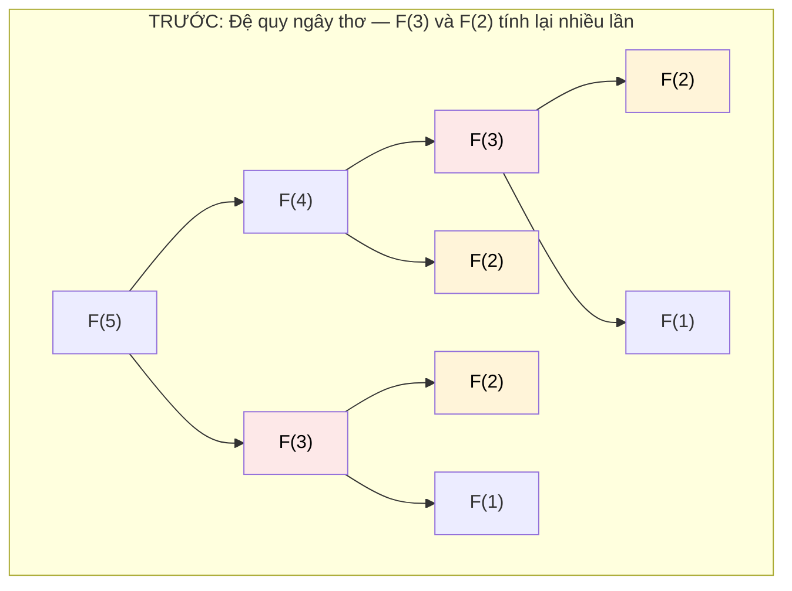

# MASTER COMPUTER SCIENCE HANDBOOK

## Volume 03 — Algorithms and Data Structures
### Part III — Algorithm Design Paradigms
## Chương 18 — Quy hoạch Động I: Nền tảng và Bài toán Kinh điển
### (Dynamic Programming I: Foundations)

---

### Thông tin chương

| Trường | Giá trị |
|---|---|
| Chương | 18 |
| Thuộc Part | III — Algorithm Design Paradigms |
| Thuộc Volume | 03 — Algorithms and Data Structures |
| Thời gian đọc ước tính | 65–75 phút |
| Độ khó | ★★★☆☆ |
| Kiến thức tiên quyết | Chương 17 — Greedy Algorithms (đặc biệt phản ví dụ 0/1 Knapsack); Chương 13 — Brute Force; Đệ quy và Hash Table (Volume 3, Part II) |
| Chương liên quan | 17 — Greedy Algorithms (đối lập trực tiếp: cùng Optimal Substructure nhưng cách khai thác khác nhau); 19 — Dynamic Programming II (kỹ thuật nâng cao); Volume 5 — Reinforcement Learning (Bellman Equation dùng lại chính tư duy DP) |
| Từ khóa | dynamic programming, optimal substructure, overlapping subproblems, memoization, tabulation, knapsack, longest common subsequence |

---

### Mục tiêu học tập

Sau khi hoàn thành chương này, người đọc có thể:

- Định nghĩa Dynamic Programming và giải thích chính xác hai điều kiện cần thiết: **Optimal Substructure** và **Overlapping Subproblems** — đặc biệt phân biệt điều kiện thứ hai này với Divide and Conquer (Chương 14).
- Phân biệt và triển khai hai kỹ thuật cài đặt: **Memoization (top-down)** và **Tabulation (bottom-up)**.
- Giải bài toán 0/1 Knapsack bằng Dynamic Programming, đối chiếu trực tiếp với thất bại của Greedy đã thấy ở Chương 17.
- Xây dựng bảng DP cho bài toán Longest Common Subsequence (LCS), xác định đúng trạng thái (state), công thức chuyển trạng thái (transition), và điều kiện biên (base case).
- Nhận diện được một bài toán mới có phù hợp với Dynamic Programming hay không, thông qua quy trình bốn bước: xác định state, transition, base case, và thứ tự điền bảng.

---

### Câu hỏi khơi gợi

> *Nếu bạn được hỏi "số Fibonacci thứ 50 là bao nhiêu?", và bạn viết một hàm đệ quy đơn giản theo đúng định nghĩa $F(n) = F(n-1) + F(n-2)$, tại sao chương trình đó lại chạy rất lâu — trong khi bài toán này, xét thuần túy, chỉ cần 50 phép cộng để tính? Điều gì đang bị lãng phí trong tính toán, và làm sao một thay đổi nhỏ trong cách cài đặt có thể biến chương trình đó từ "gần như không chạy được" thành "tức thời"?*

---

## 1. Tổng quan chương

Chương 17 đã kết thúc bằng một cảnh báo quan trọng: có những bài toán, dù có Optimal Substructure, vẫn **không** có Greedy-Choice Property — và ví dụ điển hình là 0/1 Knapsack, nơi chiến lược tham lam theo tỉ lệ giá trị/trọng lượng cho kết quả sai. Chương này giới thiệu paradigm được thiết kế chính xác để giải quyết lớp bài toán đó: **Dynamic Programming (Quy hoạch Động)**.

Ý tưởng cốt lõi của Dynamic Programming khác hẳn Greedy: thay vì đưa ra một lựa chọn duy nhất tại mỗi bước và không bao giờ xem lại, Dynamic Programming **xem xét một cách có hệ thống mọi lựa chọn khả dĩ** — giống tinh thần của Brute Force (Chương 13) — nhưng với một cải tiến mấu chốt: **nó không bao giờ tính toán lại cùng một bài toán con hai lần**. Kết quả của mỗi bài toán con được lưu lại (ghi nhớ) ngay sau lần tính đầu tiên, và được tái sử dụng mỗi khi cần đến sau này.

Chương này có bốn mục tiêu. Thứ nhất, hình thức hóa hai điều kiện toán học của Dynamic Programming: Optimal Substructure (chia sẻ với Greedy) và **Overlapping Subproblems** (điều kiện mới, đặc trưng riêng của DP). Thứ hai, trang bị hai kỹ thuật cài đặt song song: Memoization và Tabulation. Thứ ba, giải quyết triệt để bài toán 0/1 Knapsack — hoàn thành câu chuyện dang dở từ Chương 17. Thứ tư, mở rộng sang bài toán Longest Common Subsequence, một trong những bài toán DP kinh điển nhất, chuẩn bị nền tảng vững chắc cho các kỹ thuật nâng cao ở Chương 19.

> **💡 Insight**
> Nếu phải tóm gọn Dynamic Programming trong một câu: **"Brute Force thông minh, biết ghi nhớ những gì đã tính."** Không có gì trong DP đòi hỏi một ý tưởng toán học cao siêu — điều duy nhất nó thêm vào so với đệ quy ngây thơ là một cuốn "sổ ghi chép" (bảng nhớ) để không lãng phí công sức tính đi tính lại cùng một việc.

---

## 2. Bối cảnh lịch sử

| Thời điểm | Nhân vật / Sự kiện | Đóng góp |
|---|---|---|
| 1950–1953 | Richard Bellman, tại RAND Corporation | Đặt tên và hình thức hóa **Dynamic Programming** như một phương pháp giải các bài toán tối ưu hóa đa giai đoạn (multistage decision processes); công bố **Nguyên lý Tối ưu (Bellman's Principle of Optimality)** — nền tảng lý thuyết chính thức cho Optimal Substructure |
| 1957 | Richard Bellman | Xuất bản cuốn sách *Dynamic Programming* — tài liệu nền tảng chính thức hóa toàn bộ lý thuyết |
| Thập niên 1960–1970 | Cộng đồng nghiên cứu tin sinh học (bioinformatics sơ khai) | Ứng dụng DP cho bài toán so khớp chuỗi sinh học (sequence alignment) — tiền thân trực tiếp của Longest Common Subsequence sẽ học ở chương này |
| Liên tục đến nay | Cộng đồng nghiên cứu AI và Reinforcement Learning | Bellman Equation — công thức truy hồi trung tâm của DP — trở thành nền tảng toán học của Reinforcement Learning hiện đại (sẽ gặp lại ở Volume 5) |

> **🔬 Research Connection**
> Có một giai thoại nổi tiếng (được chính Bellman kể lại) về lý do ông chọn tên gọi "Dynamic Programming": vào thời điểm đó, từ "programming" được hiểu theo nghĩa "lập kế hoạch" (planning), không phải "viết code" như ngày nay; và Bellman cố ý chọn một cái tên "nghe có vẻ ấn tượng" để tránh sự phản đối từ cấp trên tại RAND Corporation (một cơ quan chính phủ Mỹ thời Chiến tranh Lạnh, vốn không mặn mà với các nghiên cứu mang tên "toán học lý thuyết"). Dù là giai thoại hay sự thật, câu chuyện này minh họa một điểm thú vị: bản thân cái tên "Dynamic Programming" không mô tả trực tiếp bản chất kỹ thuật của phương pháp (ghi nhớ để tránh tính toán lại).

---

## 3. Động lực

Quay lại câu hỏi khơi gợi: tính số Fibonacci thứ $n$ bằng đệ quy ngây thơ theo đúng định nghĩa toán học $F(n) = F(n-1) + F(n-2)$, với $F(0) = 0$, $F(1) = 1$.

```text
                        F(5)
                      /      \
                  F(4)         F(3)
                 /    \        /    \
             F(3)    F(2)   F(2)   F(1)
            /   \    /  \   /  \
        F(2) F(1) F(1)F(0)F(1)F(0)
        /  \
    F(1) F(0)
```

Quan sát cây đệ quy trên: $F(3)$ được tính **hai lần** (một lần trong nhánh trái của $F(5)$, một lần trong nhánh phải), $F(2)$ được tính **ba lần**. Với $n$ càng lớn, số lần tính toán lại càng bùng nổ — độ phức tạp của cách cài đặt ngây thơ này là $O(2^n)$ (thực ra gần với $O(\phi^n)$ với $\phi$ là tỉ lệ vàng, nhưng vẫn tăng theo hàm mũ), dù bài toán, xét về bản chất, chỉ cần $n$ phép cộng.

Đây chính là **Overlapping Subproblems** — hiện tượng cùng một bài toán con xuất hiện lặp lại nhiều lần trong quá trình đệ quy. Đây là điểm khác biệt căn bản so với Divide and Conquer (Chương 14): ở Merge Sort, các bài toán con (nửa trái, nửa phải) **hoàn toàn độc lập**, không bao giờ trùng lặp. Với Fibonacci, các bài toán con **chồng lấp** lẫn nhau — và chính sự chồng lấp này là cơ hội để Dynamic Programming tỏa sáng: chỉ cần lưu lại $F(3)$ sau lần tính đầu tiên, ta tránh được toàn bộ việc tính lại nó ở nhánh còn lại.

---

## 4. Trực giác

**Mô hình tinh thần (Mental Model) của chương này:**

> Dynamic Programming giống như việc bạn giải một bài toán lớn bằng cách **viết lại đáp số của từng bài toán nhỏ vào một cuốn sổ tay** ngay khi tính ra, để nếu sau này cần dùng lại đáp số đó, bạn chỉ cần **tra sổ** thay vì phải tính toán lại từ đầu. Khác với Brute Force (Chương 13) — nơi bạn tính đi tính lại mọi thứ mỗi lần cần — Dynamic Programming đầu tư một chút bộ nhớ để đổi lấy tốc độ vượt trội.

| Trực giác đời thường | Khái niệm thuật toán tương ứng |
|---|---|
| Viết đáp số bài toán nhỏ vào sổ tay ngay khi tính ra | **Memoization/Tabulation** — lưu kết quả bài toán con vào bảng nhớ |
| Tra sổ thay vì tính lại từ đầu | Tái sử dụng kết quả đã lưu — tránh Overlapping Subproblems |
| Đáp số bài toán lớn được xây từ đáp số các bài toán nhỏ hơn đã ghi trong sổ | **Optimal Substructure** — lời giải tối ưu của bài toán lớn phụ thuộc vào lời giải tối ưu của bài toán con |
| Cuốn sổ càng "dày" (nhiều bài toán con hơn) không làm bạn chậm đi, vì mỗi trang chỉ cần viết một lần | Độ phức tạp DP thường tỉ lệ với **số lượng bài toán con riêng biệt** — không phải số lần bài toán con được gọi đến |

---

## 5. Trực quan hóa khái niệm

**Hình 18.1 — Cây đệ quy Fibonacci trước và sau khi áp dụng Memoization**
*(Visual đặc trưng của chương — Chapter Identity)*



```text
SAU: Với Memoization, mỗi F(k) chỉ được TÍNH một lần,
     mọi lần gọi lại sau đó chỉ là TRA BẢNG:

F(5) → cần F(4), F(3)
F(4) → cần F(3) [ĐÃ CÓ trong bảng — tra ngay], F(2)
F(3) → tính lần đầu: cần F(2), F(1)
F(2) → tính lần đầu: cần F(1), F(0)
F(1), F(0) → base case

Tổng cộng: chỉ 6 giá trị được TÍNH (F(0) đến F(5)),
thay vì 15 lệnh gọi hàm như cây đệ quy ngây thơ ở trên.
```

| Trường thông tin | Nội dung |
|---|---|
| Mục đích | Minh họa trực quan chính xác nơi Overlapping Subproblems xảy ra (các nút màu trong cây phía trên), và cách Memoization loại bỏ hoàn toàn việc tính toán trùng lặp |
| Điểm mấu chốt | Đối chiếu với Hình 14.2 (cây đệ quy Merge Sort, Chương 14): ở đó, **không có nút nào lặp lại** — mỗi bài toán con chỉ xuất hiện đúng một lần trong toàn bộ cây, đó là lý do Divide and Conquer không cần (và không được lợi từ) việc ghi nhớ |

---

**Hình 18.2 — Bảng DP hai chiều cho Longest Common Subsequence**

```text
        ""   B    D    C    A    B    A
    ""   0   0    0    0    0    0    0
    A    0   0    0    0    1    1    1
    B    0   1    1    1    1    2    2
    C    0   1    1    2    2    2    2
    B    0   1    1    2    2    3    3
    D    0   1    2    2    2    3    3
    A    0   1    2    2    3    3    4
```

*Mục đích:* minh họa cấu trúc bảng hai chiều điển hình của DP trên chuỗi — mỗi ô $(i, j)$ biểu diễn lời giải cho bài toán con "LCS của $i$ ký tự đầu chuỗi thứ nhất và $j$ ký tự đầu chuỗi thứ hai". *Điểm mấu chốt:* giá trị ở góc dưới phải cùng ($LCS = 4$) chính là lời giải cho bài toán gốc, được xây dựng dần từ góc trên trái — đây là bản chất của Tabulation (bottom-up), sẽ trình bày đầy đủ ở Mục 8.

---

## 6. Định nghĩa hình thức

> **📌 Remember — Dynamic Programming**
>
> **Dynamic Programming (Quy hoạch Động)** là một paradigm thiết kế thuật toán áp dụng được cho các bài toán thỏa mãn đồng thời hai điều kiện:
>
> 1. **Optimal Substructure:** lời giải tối ưu của bài toán có thể được xây dựng từ lời giải tối ưu của các bài toán con của nó (chia sẻ với Greedy, Chương 17).
> 2. **Overlapping Subproblems:** khi giải bài toán bằng đệ quy, cùng một bài toán con xuất hiện lặp lại nhiều lần trong quá trình tính toán (khác biệt căn bản với Divide and Conquer, Chương 14, nơi các bài toán con luôn độc lập, không chồng lấp).
>
> Dynamic Programming khai thác hai điều kiện này bằng cách **lưu lại (ghi nhớ) kết quả của mỗi bài toán con riêng biệt**, đảm bảo mỗi bài toán con chỉ được tính đúng một lần, bất kể nó được tham chiếu đến bao nhiêu lần trong quá trình giải bài toán gốc.

> **⚠️ Common Mistake**
> Một nhầm lẫn phổ biến là cho rằng Dynamic Programming và Divide and Conquer là "cùng một thứ" vì cả hai đều dùng đệ quy chia nhỏ bài toán. Điểm phân biệt duy nhất nhưng quyết định: Divide and Conquer có các bài toán con **độc lập** (không chồng lấp); Dynamic Programming có các bài toán con **chồng lấp**. Nếu bạn thấy mình đang "ghi nhớ kết quả để tránh tính lại", đó là dấu hiệu chắc chắn bạn đang làm việc với DP, không phải Divide and Conquer thuần túy.

---

## 7. Nền tảng toán học

### 7.1 Công thức truy hồi cho 0/1 Knapsack

Cho $n$ vật phẩm, mỗi vật phẩm $i$ có giá trị $v_i$ và trọng lượng $w_i$, sức chứa tối đa $W$. Gọi $K(i, w)$ là giá trị tối đa đạt được khi chỉ xét $i$ vật phẩm đầu tiên với sức chứa còn lại $w$.

> **📦 Formula Box — Công thức truy hồi 0/1 Knapsack**
>
> $$
> K(i, w) =
> \begin{cases}
> 0 & \text{nếu } i = 0 \text{ hoặc } w = 0 \\
> K(i-1, w) & \text{nếu } w_i > w \text{ (vật phẩm } i \text{ không vừa)} \\
> \max\big(K(i-1, w),\ v_i + K(i-1, w - w_i)\big) & \text{ngược lại}
> \end{cases}
> $$
>
> | Thành phần | Ý nghĩa |
> |---|---|
> | $K(i-1, w)$ | Phương án **không lấy** vật phẩm $i$ — giữ nguyên kết quả tốt nhất của $i-1$ vật phẩm đầu với cùng sức chứa $w$ |
> | $v_i + K(i-1, w - w_i)$ | Phương án **có lấy** vật phẩm $i$ — cộng giá trị $v_i$ vào kết quả tốt nhất của $i-1$ vật phẩm đầu với sức chứa còn lại sau khi trừ $w_i$ |
> | $\max(\dots)$ | Chọn phương án tốt hơn giữa "lấy" và "không lấy" — đây chính là điểm khác biệt cốt lõi với Greedy (Chương 17): thay vì quyết định dứt khoát một lần, DP **xét cả hai khả năng** và giữ lại khả năng tốt hơn |
> | **Ứng dụng thường gặp** | Công thức này chính là lời giải chính xác cho phản ví dụ ở Chương 17, Hình 17.2 — nơi Greedy đã thất bại |

### 7.2 Công thức truy hồi cho Longest Common Subsequence (LCS)

Cho hai chuỗi $X$ (độ dài $m$) và $Y$ (độ dài $n$). Gọi $L(i, j)$ là độ dài LCS của $i$ ký tự đầu của $X$ và $j$ ký tự đầu của $Y$.

> **📦 Formula Box — Công thức truy hồi LCS**
>
> $$
> L(i, j) =
> \begin{cases}
> 0 & \text{nếu } i = 0 \text{ hoặc } j = 0 \\
> L(i-1, j-1) + 1 & \text{nếu } X_i = Y_j \\
> \max\big(L(i-1, j),\ L(i, j-1)\big) & \text{nếu } X_i \neq Y_j
> \end{cases}
> $$
>
> | Thành phần | Ý nghĩa |
> |---|---|
> | $X_i = Y_j$ | Nếu ký tự cuối của hai tiền tố đang xét trùng nhau, ký tự đó chắc chắn thuộc LCS — cộng thêm 1 vào kết quả LCS của phần còn lại (bỏ cả hai ký tự cuối) |
> | $X_i \neq Y_j$ | Nếu không trùng, LCS phải bỏ qua ký tự cuối của $X$ **hoặc** ký tự cuối của $Y$ — chọn phương án cho kết quả tốt hơn |
> | **Diễn giải kỹ thuật** | Đây chính xác là công thức đã dùng để xây bảng ở Hình 18.2 — mỗi ô được tính từ ô chéo trên-trái, ô trên, hoặc ô trái, tùy điều kiện |
> | **Độ phức tạp** | $O(m \times n)$ thời gian và không gian — một cải thiện vượt trội so với cách tiếp cận Brute Force duyệt mọi dãy con có thể ($O(2^m)$) |

---

## 8. Thuật toán / Cơ chế

### 8.1 Hai chiến lược cài đặt: Memoization và Tabulation

> **💡 Insight**
> Memoization và Tabulation không phải hai thuật toán khác nhau — chúng là **hai cách cài đặt cùng một công thức truy hồi**. Memoization đi từ bài toán gốc "xuống" các bài toán con (top-down, dùng đệ quy + bảng nhớ để tránh tính lại). Tabulation đi từ các bài toán con nhỏ nhất "lên" bài toán gốc (bottom-up, dùng vòng lặp điền bảng theo thứ tự).

```text
MEMOIZATION (Top-Down):
Bước 1 — Khởi tạo bảng nhớ (cache) rỗng
Bước 2 — Gọi hàm đệ quy giải bài toán gốc
Bước 3 —   Nếu kết quả bài toán con đã có trong cache: trả về ngay
Bước 4 —   Ngược lại: tính theo công thức truy hồi (có thể gọi đệ quy
             tiếp), lưu kết quả vào cache trước khi trả về

TABULATION (Bottom-Up):
Bước 1 — Khởi tạo bảng (mảng/ma trận) với các base case
Bước 2 — Xác định đúng thứ tự điền bảng (đảm bảo khi điền ô nào,
           mọi ô nó phụ thuộc đã được điền trước đó)
Bước 3 — Lặp qua bảng theo đúng thứ tự, áp dụng công thức truy hồi
           để điền từng ô
Bước 4 — Kết quả bài toán gốc nằm ở ô cuối cùng (hoặc ô tương ứng)
```

### 8.2 0/1 Knapsack bằng Tabulation

```text
Bước 1 — Khởi tạo bảng K kích thước (n+1) × (W+1), toàn bộ hàng 0
           và cột 0 bằng 0 (base case: không có vật phẩm hoặc không
           có sức chứa thì giá trị là 0)
        │
        ▼
Bước 2 — Với mỗi i từ 1 đến n (xét từng vật phẩm):
        │
        ▼
Bước 3 —   Với mỗi w từ 0 đến W (xét từng mức sức chứa):
        │
        ▼
Bước 4 —     Áp dụng công thức truy hồi ở Mục 7.1 để điền K[i][w]
        │
        ▼
Bước 5 — Kết quả cuối cùng: K[n][W]
```

### 8.3 Longest Common Subsequence bằng Tabulation

```text
Bước 1 — Khởi tạo bảng L kích thước (m+1) × (n+1), hàng 0 và
           cột 0 bằng 0
        │
        ▼
Bước 2 — Với mỗi i từ 1 đến m, mỗi j từ 1 đến n:
        │
        ▼
Bước 3 —   Áp dụng công thức truy hồi ở Mục 7.2 để điền L[i][j]
        │
        ▼
Bước 4 — Kết quả cuối cùng: L[m][n]
```

---

## 9. Triển khai

```python
def fibonacci_memo(n, cache=None):
    """Tính số Fibonacci thứ n bằng Memoization (Top-Down).
    So sánh trực tiếp với đệ quy ngây thơ ở Mục 3."""
    if cache is None:
        cache = {}
    if n in cache:
        return cache[n]
    if n <= 1:
        return n

    result = fibonacci_memo(n - 1, cache) + fibonacci_memo(n - 2, cache)
    cache[n] = result
    return result


def knapsack_01(values, weights, capacity):
    """Giải 0/1 Knapsack bằng Tabulation (Bottom-Up).
    Trả về giá trị tối đa đạt được — lời giải ĐÚNG cho bài toán
    mà Greedy (Chương 17) đã thất bại."""
    n = len(values)
    # K[i][w]: giá trị tối đa với i vật phẩm đầu, sức chứa w
    K = [[0] * (capacity + 1) for _ in range(n + 1)]

    for i in range(1, n + 1):
        for w in range(capacity + 1):
            if weights[i - 1] > w:
                K[i][w] = K[i - 1][w]                  # Không lấy được
            else:
                K[i][w] = max(
                    K[i - 1][w],                        # Không lấy
                    values[i - 1] + K[i - 1][w - weights[i - 1]]  # Có lấy
                )

    return K[n][capacity]


def longest_common_subsequence(X, Y):
    """Tính độ dài Longest Common Subsequence của X và Y
    bằng Tabulation (Bottom-Up)."""
    m, n = len(X), len(Y)
    L = [[0] * (n + 1) for _ in range(m + 1)]

    for i in range(1, m + 1):
        for j in range(1, n + 1):
            if X[i - 1] == Y[j - 1]:
                L[i][j] = L[i - 1][j - 1] + 1
            else:
                L[i][j] = max(L[i - 1][j], L[i][j - 1])

    return L[m][n]
```

Ba hàm minh họa đúng nội dung Mục 7–8: `fibonacci_memo` minh họa Memoization và giải quyết trực tiếp vấn đề Overlapping Subproblems nêu ở Mục 3; `knapsack_01` và `longest_common_subsequence` minh họa Tabulation cho hai bài toán DP kinh điển.

---

## 10. Trực quan hóa quá trình thực thi

**So sánh thực nghiệm: Fibonacci đệ quy ngây thơ so với Memoization:**

| $n$ | Đệ quy ngây thơ (số lệnh gọi hàm, xấp xỉ) | Memoization (số lệnh gọi hàm) |
|---:|---:|---:|
| 10 | ~177 | ~19 |
| 30 | ~2.692.537 | ~59 |
| 50 | ~40.730.022.147 (không khả thi trong thời gian hợp lý) | ~99 |

Bảng này định lượng chính xác lợi ích của Memoization: số lệnh gọi hàm giảm từ tăng trưởng **hàm mũ** xuống **tuyến tính** — đúng bằng $2n - 1$ lệnh gọi cho mỗi $F(n)$ mới cần tính.

**Vết thực thi của `knapsack_01([60, 100, 120], [10, 20, 30], 50)`** (đúng dữ liệu ở Chương 17, Hình 17.2):

Bảng $K$ đầy đủ (rút gọn, chỉ hiển thị các cột mốc $w = 0, 10, 20, 30, 40, 50$):

| $i$ \\ $w$ | 0 | 10 | 20 | 30 | 40 | 50 |
|---:|---:|---:|---:|---:|---:|---:|
| 0 (không vật phẩm) | 0 | 0 | 0 | 0 | 0 | 0 |
| 1 (vật phẩm A: 60, 10) | 0 | 60 | 60 | 60 | 60 | 60 |
| 2 (+ vật phẩm B: 100, 20) | 0 | 60 | 100 | 160 | 160 | 160 |
| 3 (+ vật phẩm C: 120, 30) | 0 | 60 | 100 | 160 | 180 | **220** |

Kết quả: $K[3][50] = 220$ — khớp chính xác với lời giải tối ưu thực sự đã nêu ở Chương 17 (bỏ A, lấy B + C), **cao hơn** kết quả Greedy sai (160) đã tính ở chương trước. Đây là bằng chứng cụ thể, bằng số liệu, cho thấy Dynamic Programming giải đúng bài toán mà Greedy đã thất bại.

---

## 11. Ứng dụng công nghiệp

> **🛠 Engineering Practice**
> Dynamic Programming là nền tảng của nhiều hệ thống công nghiệp xử lý bài toán tối ưu hóa với cấu trúc chồng lấp.

| Bối cảnh công nghiệp | Vai trò của Dynamic Programming |
|---|---|
| Công cụ `diff` (so sánh phiên bản file, Git) | Thuật toán tính khác biệt giữa hai phiên bản file dựa trực tiếp trên Longest Common Subsequence — xác định những dòng nào giữ nguyên (thuộc LCS) và những dòng nào thay đổi |
| Tin sinh học (Bioinformatics) — so khớp chuỗi DNA/protein | Thuật toán Needleman-Wunsch và Smith-Waterman (sequence alignment) là các biến thể mở rộng trực tiếp của công thức LCS ở Mục 7.2 |
| Bộ nhớ đệm trong hệ thống phần mềm (Caching / Memoization tự động) | Nhiều framework lập trình cung cấp decorator ghi nhớ kết quả hàm (ví dụ `functools.lru_cache` trong Python) — ứng dụng trực tiếp nguyên lý Memoization |
| Xử lý ngôn ngữ tự nhiên (kiểm tra chính tả, gợi ý sửa lỗi gõ phím) | Khoảng cách chỉnh sửa (Edit Distance, sẽ mở rộng ở Chương 19) — một biến thể DP khác trên chuỗi — là nền tảng của các thuật toán gợi ý sửa lỗi chính tả |

---

## 12. Góc nhìn nghiên cứu

> **🔬 Research Connection**
> Công thức truy hồi trung tâm của Dynamic Programming — biểu diễn giá trị tối ưu của một trạng thái dựa trên giá trị tối ưu của các trạng thái kế tiếp — chính là **Bellman Equation**, mang tên chính Richard Bellman (Mục 2). Đây không chỉ là công cụ của Computer Science lý thuyết: Bellman Equation là nền tảng toán học trung tâm của **Reinforcement Learning** hiện đại (sẽ học đầy đủ ở Volume 5), nơi một "agent" học cách hành động tối ưu bằng cách ước lượng giá trị kỳ vọng của từng trạng thái, dựa trên giá trị của các trạng thái kế tiếp — một cấu trúc toán học giống hệt công thức $K(i,w)$ hay $L(i,j)$ đã học ở chương này, chỉ khác là áp dụng cho không gian trạng thái của một môi trường tương tác thay vì một bài toán tổ hợp tĩnh.

**Câu hỏi mở** để suy ngẫm: cả `knapsack_01` và `longest_common_subsequence` đều dùng bảng 2 chiều với độ phức tạp không gian $O(n \times m)$ hoặc $O(n \times W)$. Với các bài toán có $n$ hoặc $W$ rất lớn (hàng triệu), độ phức tạp không gian này có thể trở thành vấn đề nghiêm trọng hơn cả độ phức tạp thời gian. Liệu có cách nào giảm độ phức tạp không gian mà không làm mất thông tin cần thiết? (Gợi ý: quan sát kỹ công thức truy hồi ở Mục 7 — mỗi hàng chỉ phụ thuộc vào chính nó và hàng ngay phía trên; đây là tiền đề cho kỹ thuật "rolling array" sẽ học ở Chương 19.)

---

## 13. Ưu điểm

- **Giải đúng các bài toán mà Greedy thất bại** — như đã chứng minh cụ thể với 0/1 Knapsack (Mục 10), DP luôn cho lời giải tối ưu tuyệt đối khi bài toán có Optimal Substructure, không phụ thuộc vào việc có Greedy-Choice Property hay không.
- **Cải thiện độ phức tạp vượt trội so với đệ quy ngây thơ / Brute Force** — như Fibonacci minh họa, DP có thể biến độ phức tạp hàm mũ thành tuyến tính hoặc đa thức.
- **Framework tư duy nhất quán, có thể học và áp dụng lặp lại** — quy trình bốn bước (xác định state, transition, base case, thứ tự điền bảng) áp dụng được cho hàng trăm bài toán khác nhau, một khi đã thành thạo.
- **Nền tảng toán học vững chắc (Bellman Equation)** — không chỉ là một "mẹo lập trình", mà là một lý thuyết tối ưu hóa hoàn chỉnh, kết nối trực tiếp đến các lĩnh vực hiện đại như Reinforcement Learning.

---

## 14. Hạn chế

> **⚠️ Common Mistake**
> Một sai lầm phổ biến của người mới học DP là cố "nhớ công thức" cho từng bài toán riêng lẻ, thay vì rèn luyện quy trình tư duy tổng quát (xác định state trước, rồi mới suy ra transition). Cách học thuộc lòng công thức khiến người học bối rối ngay khi gặp một bài toán DP mới, dù bản chất tương tự các bài đã học.

- **Độ phức tạp không gian có thể lớn** — bảng DP 2 chiều đòi hỏi $O(n \times m)$ bộ nhớ, có thể trở thành vấn đề với dữ liệu đầu vào lớn (sẽ giải quyết một phần ở Chương 19 bằng kỹ thuật tối ưu không gian).
- **Không phải bài toán tối ưu hóa nào cũng có Overlapping Subproblems** — nếu bài toán chỉ có Optimal Substructure nhưng các bài toán con độc lập (không chồng lấp), DP không mang lại lợi ích gì so với Divide and Conquer thuần túy — thậm chí có thể chậm hơn do chi phí phụ trội của việc quản lý bảng nhớ.
- **Việc xác định đúng "state" có thể không hiển nhiên** — với các bài toán phức tạp (đặc biệt sẽ gặp ở Chương 19), việc chọn đúng biểu diễn trạng thái là bước khó nhất, đòi hỏi kinh nghiệm và thực hành.
- **Memoization (đệ quy) có nguy cơ tràn ngăn xếp** với bài toán có độ sâu đệ quy lớn — Tabulation (vòng lặp) thường an toàn hơn về mặt này.

---

## 15. So sánh

**Bảng 18.1 — Memoization so với Tabulation**

| Tiêu chí | Memoization (Top-Down) | Tabulation (Bottom-Up) |
|---|---|---|
| Hướng tiếp cận | Từ bài toán gốc, đệ quy xuống bài toán con | Từ bài toán con nhỏ nhất, lặp lên bài toán gốc |
| Chỉ tính bài toán con cần thiết? | Có — chỉ tính đúng những gì thực sự được gọi đến | Không — thường tính toàn bộ bảng, kể cả ô không cần thiết |
| Nguy cơ tràn ngăn xếp | Có (do đệ quy) | Không (dùng vòng lặp) |
| Dễ suy ra thứ tự tính toán? | Tự động (đệ quy tự xử lý) | Cần xác định thủ công thứ tự điền bảng đúng |

**Bảng 18.2 — Dynamic Programming so với Greedy (Chương 17)**

| Tiêu chí | Greedy (Chương 17) | Dynamic Programming (chương này) |
|---|---|---|
| Số lựa chọn xét tại mỗi bước | 1 (lựa chọn tốt nhất cục bộ) | Nhiều (xét mọi khả năng khả dĩ, chọn khả năng tốt nhất) |
| Xem xét lại quyết định? | Không bao giờ | Có — dưới dạng lưu và tái sử dụng kết quả bài toán con |
| Điều kiện áp dụng | Optimal Substructure + Greedy-Choice Property | Optimal Substructure + Overlapping Subproblems |
| Độ phức tạp điển hình | $O(n \log n)$ hoặc thấp hơn | $O(n^2)$, $O(nW)$, hoặc cao hơn tùy bài toán |
| Ví dụ đối lập | Fractional Knapsack (đúng) | 0/1 Knapsack (Greedy sai, DP đúng) |

**Phân tích:** Bảng 18.2 hoàn thiện câu chuyện bắt đầu từ Chương 17 — hai paradigm cùng yêu cầu Optimal Substructure, nhưng khai thác nó theo hai cách hoàn toàn khác nhau: Greedy "đặt cược" vào một lựa chọn duy nhất và không bao giờ xem lại; DP "xét hết mọi khả năng" nhưng tránh lãng phí bằng cách không tính lại. Sự đánh đổi là tốc độ (Greedy nhanh hơn khi áp dụng được) đổi lấy tính tổng quát (DP giải đúng nhiều bài toán hơn, kể cả khi Greedy thất bại).

---

## 16. Tóm tắt

- **Dynamic Programming** áp dụng cho bài toán có cả **Optimal Substructure** và **Overlapping Subproblems** — điều kiện thứ hai là khác biệt cốt lõi so với Divide and Conquer (Chương 14), nơi bài toán con luôn độc lập.
- Hai kỹ thuật cài đặt: **Memoization** (top-down, đệ quy + bảng nhớ) và **Tabulation** (bottom-up, điền bảng theo vòng lặp) — cùng giải một công thức truy hồi, khác nhau về hướng tiếp cận.
- **0/1 Knapsack** được giải đúng bằng DP với công thức truy hồi xét cả hai khả năng "lấy" và "không lấy" mỗi vật phẩm, cho kết quả tối ưu tuyệt đối (220), vượt trội so với Greedy sai ở Chương 17 (160).
- **Longest Common Subsequence** minh họa DP trên chuỗi, với bảng 2 chiều $O(m \times n)$, xây dựng từ công thức truy hồi dựa trên việc ký tự cuối của hai tiền tố có trùng nhau hay không.
- Công thức truy hồi trung tâm của DP mang tên **Bellman Equation**, kết nối trực tiếp đến Reinforcement Learning hiện đại (Volume 5) — một minh chứng cho thấy paradigm thiết kế thuật toán cổ điển vẫn là nền tảng của AI hiện đại.

Chương 19 (Dynamic Programming II) sẽ mở rộng bộ công cụ này với các kỹ thuật nâng cao: DP trên chuỗi phức tạp hơn (Edit Distance, Matrix Chain Multiplication), DP theo bitmask, DP trên cây, và kỹ thuật tối ưu không gian bộ nhớ — giải quyết trực tiếp câu hỏi mở đã đặt ra ở Mục 12.

---

## 17. Bài tập

### Mức Cơ bản (Basic)

1. Mô phỏng cây đệ quy đầy đủ của `fibonacci_memo(6)` (tương tự Hình 18.1), đánh dấu rõ những lệnh gọi nào được tính trực tiếp và những lệnh gọi nào chỉ tra bảng nhớ.
2. Với các vật phẩm (giá trị, trọng lượng) $(3, 4), (4, 5), (5, 6)$ và sức chứa $10$, xây dựng đầy đủ bảng $K$ theo đúng công thức ở Mục 7.1, và xác định giá trị tối ưu.
3. Với hai chuỗi $X = \text{"ABC"}$ và $Y = \text{"AC"}$, xây dựng đầy đủ bảng $L$ theo Mục 7.2 và xác định độ dài LCS.

### Mức Trung bình (Intermediate)

4. Viết phiên bản Memoization (top-down, dùng đệ quy + dict cache) cho bài toán 0/1 Knapsack, tương đương về kết quả với `knapsack_01` (Tabulation) ở Mục 9. So sánh số lượng trạng thái $(i, w)$ thực sự được tính trong phiên bản Memoization so với tổng số ô trong bảng Tabulation.
5. Mở rộng `longest_common_subsequence` để không chỉ trả về **độ dài** LCS, mà trả về **chính chuỗi con** đó (gợi ý: sau khi điền xong bảng $L$, truy vết ngược — traceback — từ ô $L[m][n]$ về ô $L[0][0]$, theo hướng ô nào đã tạo ra giá trị hiện tại).

### Mức Nâng cao (Advanced)

6. Chứng minh (bằng lời, dựa trên cấu trúc công thức truy hồi ở Mục 7.1) rằng công thức 0/1 Knapsack thỏa mãn Optimal Substructure: lời giải tối ưu cho $(i, w)$ luôn được xây dựng từ lời giải tối ưu của $(i-1, w)$ hoặc $(i-1, w - w_i)$, không có khả năng nào khác tốt hơn bị bỏ sót.
7. Bài toán "Coin Change — số lượng tờ tiền tối thiểu" (đã nhắc ở Chương 17, Bài tập 6, nơi Greedy có thể sai với hệ mệnh giá không chuẩn) có thể giải đúng bằng Dynamic Programming với mọi hệ mệnh giá. Thiết lập công thức truy hồi cho bài toán này (gợi ý: gọi $C(w)$ là số tờ tiền tối thiểu để đổi đúng số tiền $w$; xét việc dùng đồng xu mệnh giá $c$ cuối cùng, dẫn đến bài toán con $C(w - c)$).

### Mức Nghiên cứu (Research)

8. Bellman Equation (Mục 12) trong Reinforcement Learning có dạng tổng quát $V(s) = \max_a \big[R(s,a) + \gamma \sum_{s'} P(s'|s,a) V(s')\big]$. Không cần hiểu đầy đủ ký hiệu (sẽ học ở Volume 5), hãy so sánh cấu trúc của công thức này với công thức 0/1 Knapsack ở Mục 7.1, và viết một đoạn ngắn (200–300 từ) chỉ ra điểm tương đồng cấu trúc: cả hai đều biểu diễn giá trị "tốt nhất tại một trạng thái" dựa trên giá trị "tốt nhất tại các trạng thái kế tiếp", thông qua một phép chọn tối đa (max) giữa các lựa chọn khả dĩ.

---

## 18. Dự án nhỏ

**Dự án: Công cụ so sánh phiên bản văn bản (Text Diff Tool)**

- **Mục tiêu:** xây dựng một chương trình Python đơn giản so sánh hai phiên bản của một văn bản (theo dòng), xác định những dòng nào giữ nguyên và những dòng nào bị thêm/xóa, dựa trên thuật toán Longest Common Subsequence.
- **Yêu cầu:**
  - Cài đặt `longest_common_subsequence` với truy vết ngược (traceback) để lấy ra chính LCS, không chỉ độ dài (dựa trên Bài tập 5).
  - Đọc hai file văn bản, coi mỗi dòng là một "ký tự" của bài toán LCS.
  - In ra kết quả theo định dạng giống công cụ `diff` đơn giản: dòng giữ nguyên (thuộc LCS) đánh dấu bình thường, dòng chỉ có ở file thứ nhất đánh dấu `-`, dòng chỉ có ở file thứ hai đánh dấu `+`.
- **Công nghệ đề xuất:** Python, xử lý file văn bản cơ bản.
- **Kết quả mong đợi:** chương trình hoạt động đúng trên ít nhất ba cặp file thử nghiệm có độ phức tạp khác nhau (thay đổi nhỏ, thay đổi lớn, không thay đổi gì).
- **Hướng mở rộng:** so sánh kết quả với công cụ `diff` thực tế của hệ điều hành (Linux/macOS) trên cùng bộ dữ liệu thử nghiệm.

---

## 19. Tự đánh giá

- [ ] Tôi có thể giải thích chính xác Overlapping Subproblems là gì, và chỉ ra cụ thể nó xuất hiện ở đâu trong cây đệ quy Fibonacci (Hình 18.1).
- [ ] Tôi có thể phân biệt rõ ràng Memoization và Tabulation, và biết khi nào nên chọn cách nào (ví dụ: lo ngại tràn ngăn xếp → chọn Tabulation).
- [ ] Tôi có thể tự thiết lập công thức truy hồi cho một bài toán DP mới (chưa từng gặp) bằng cách xác định đúng state, transition, và base case.
- [ ] Tôi hiểu tại sao 0/1 Knapsack cần xét cả hai khả năng "lấy" và "không lấy" tại mỗi bước, trong khi Fractional Knapsack (Chương 17) chỉ cần một quyết định Greedy duy nhất.
- [ ] Tôi đã hoàn thành việc xây dựng bảng DP đầy đủ cho ít nhất một bài tập ở Mục 17 (Knapsack hoặc LCS) bằng tay, không chỉ chạy code.

Nếu việc thiết lập công thức truy hồi ở Bài tập 7 (Coin Change) vẫn còn khó khăn, đây là dấu hiệu nên quay lại Mục 7 và thử áp dụng lại quy trình bốn bước (state, transition, base case, thứ tự điền bảng) một cách tường minh, từng bước một, trước khi tiếp tục sang Chương 19 — nơi độ phức tạp của các bài toán DP sẽ tăng lên đáng kể.

---

## 20. Đọc thêm

- **Sách:** Richard Bellman, *Dynamic Programming* (1957) — tài liệu gốc chính thức hóa toàn bộ lý thuyết. *(Tài liệu kinh điển, giá trị lịch sử cao.)*
- **Sách:** Thomas H. Cormen, Charles E. Leiserson, Ronald L. Rivest, Clifford Stein, *Introduction to Algorithms* (CLRS) — Chương về Dynamic Programming, trình bày đầy đủ 0/1 Knapsack, LCS, và Matrix Chain Multiplication (sẽ gặp ở Chương 19). *(Xem BOOKS.md — Volume 3.)*
- **Sách:** Jon Kleinberg, Éva Tardos, *Algorithm Design* — trình bày trực quan quy trình "thiết kế" một thuật toán DP từ đầu, hữu ích để rèn kỹ năng tự xây dựng công thức truy hồi.
- **Chủ đề mở rộng (không bắt buộc):** tìm đọc tổng quan không kỹ thuật về Bellman Equation trong Reinforcement Learning, chuẩn bị trực giác cho Volume 5.
- **Chương tiếp theo:** Chương 19 — Dynamic Programming II: Kỹ thuật nâng cao.

---

### Liên kết chương (Cross References)

- **Chương trước:** Chương 17 — Greedy Algorithms (0/1 Knapsack là phản ví dụ trung tâm nối liền hai chương — cùng bài toán, hai cách tiếp cận, một đúng một sai).
- **Chương tiếp theo:** Chương 19 — Dynamic Programming II (mở rộng sang Edit Distance, Matrix Chain Multiplication, Bitmask DP, và kỹ thuật tối ưu không gian).
- **Chương liên quan xa hơn:** Volume 5 — Reinforcement Learning (Bellman Equation, Mục 12); Volume 3, Part II — Hash Table (dùng làm cache cho Memoization); công cụ `diff`/Git (ứng dụng công nghiệp trực tiếp của LCS, Mục 11).
- **Vị trí trong Knowledge Graph:** Nút thứ sáu của Volume 3, Part III, phụ thuộc trực tiếp vào Chương 17 (đối lập Greedy) và Chương 13 (đường cơ sở Brute Force mà Memoization cải tiến); là điều kiện tiên quyết bắt buộc cho Chương 19.

---

*Hết Chương 18. Chương này tuân thủ đầy đủ cấu trúc 20 mục của `OUTPUT.md` và chuẩn Presentation Layer của `WRITING_STANDARD.md`, khớp với outline đã thống nhất cho Volume 3, Part III. Chương hoàn thành trọn vẹn câu chuyện 0/1 Knapsack bắt đầu từ Chương 17, với số liệu cụ thể chứng minh DP cho kết quả tối ưu (220) vượt trội Greedy sai (160). Đang chờ rà soát trước khi tiếp tục sang Chương 19 — Dynamic Programming II.*
