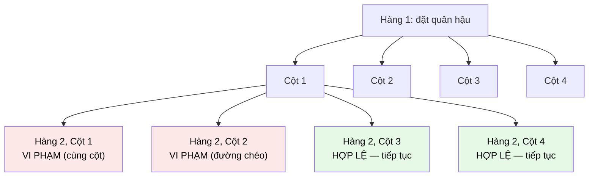

# MASTER COMPUTER SCIENCE HANDBOOK

## Volume 03 — Algorithms and Data Structures
### Part III — Algorithm Design Paradigms
## Chương 20 — Quay lui
### (Backtracking)

---

### Thông tin chương

| Trường | Giá trị |
|---|---|
| Chương | 20 |
| Thuộc Part | III — Algorithm Design Paradigms |
| Thuộc Volume | 03 — Algorithms and Data Structures |
| Thời gian đọc ước tính | 55–65 phút |
| Độ khó | ★★★☆☆ |
| Kiến thức tiên quyết | Chương 13 — Brute Force và Exhaustive Search; Đệ quy; Volume 3, Part II — Tree traversal |
| Chương liên quan | 13 — Brute Force (Backtracking là phiên bản có cắt tỉa của chính cây tìm kiếm vét cạn ở Hình 13.1); 21 — Branch and Bound (mở rộng trực tiếp cho bài toán tối ưu hóa); Volume 3, Part IV — Graph Coloring sẽ mở rộng ở đó |
| Từ khóa | backtracking, decision tree, pruning, constraint satisfaction, n-queens, sudoku, permutation generation |

---

### Mục tiêu học tập

Sau khi hoàn thành chương này, người đọc có thể:

- Định nghĩa Backtracking và giải thích chính xác mối quan hệ của nó với Brute Force (Chương 13) — cùng một cây tìm kiếm, khác nhau ở khả năng cắt tỉa.
- Mô hình hóa một bài toán dưới dạng "cây quyết định" (decision tree) và xác định các điều kiện cắt tỉa (pruning conditions) phù hợp.
- Triển khai và phân tích bốn bài toán Backtracking kinh điển: N-Queens, Sudoku Solver, Subset/Permutation Generation, và Graph Coloring.
- Phân biệt Backtracking với Brute Force thuần túy bằng cách chỉ ra chính xác thời điểm một nhánh bị cắt bỏ sớm, trước khi duyệt hết.
- Đánh giá được khi nào Backtracking là lựa chọn phù hợp cho một bài toán ràng buộc (constraint satisfaction problem) mới.

---

### Câu hỏi khơi gợi

> *Khi giải một ô Sudoku, bạn có nhận ra rằng mình hiếm khi thử điền số một cách hoàn toàn ngẫu nhiên vào từng ô trống rồi kiểm tra toàn bộ bảng ở cuối cùng? Thay vào đó, ngay khi phát hiện một số vừa điền vi phạm luật chơi (trùng với một số khác trong cùng hàng, cột, hoặc ô vuông 3×3), bạn lập tức bỏ số đó và thử số khác — không cần điền tiếp các ô còn lại rồi mới phát hiện lỗi. Chiến lược "dừng lại ngay khi biết chắc con đường này thất bại" tưởng chừng đơn giản này thực chất là một trong những paradigm thiết kế thuật toán mạnh mẽ nhất cho các bài toán ràng buộc phức tạp.*

---

## 1. Tổng quan chương

Chương 13 đã giới thiệu Brute Force như đường cơ sở: duyệt toàn bộ không gian khả dĩ, không cắt tỉa gì cả. Các chương 14–19 sau đó đã khám phá nhiều cách "khai thác cấu trúc bài toán" để tránh phải duyệt hết — chia nhỏ (Chương 14), giảm kích thước (Chương 15), biến đổi (Chương 16), quyết định cục bộ (Chương 17), hoặc ghi nhớ để tránh tính lại (Chương 18–19). Chương này quay trở lại gần với tinh thần ban đầu của Brute Force, nhưng bổ sung một cải tiến quan trọng: **Backtracking (Quay lui)**.

Ý tưởng cốt lõi: Backtracking vẫn duyệt qua cây quyết định của mọi khả năng có thể — giống hệt Brute Force — nhưng **ngay khi phát hiện một nhánh đang xây dựng chắc chắn vi phạm ràng buộc của bài toán**, nó **dừng lại ngay lập tức, quay lui (backtrack) về bước trước đó, và thử một lựa chọn khác** — thay vì tiếp tục xây dựng nhánh đó cho đến khi hoàn chỉnh rồi mới kiểm tra.

Chương này có bốn mục tiêu. Thứ nhất, hình thức hóa mô hình "cây quyết định" và khái niệm cắt tỉa (pruning) — chính là Hình 13.1 ở Chương 13, nhưng lần này với các nhánh bị loại bỏ sớm. Thứ hai, xây dựng khuôn mẫu (template) cài đặt Backtracking tổng quát, áp dụng được cho nhiều bài toán khác nhau. Thứ ba, minh họa qua bốn bài toán kinh điển: N-Queens, Sudoku, Subset/Permutation Generation, Graph Coloring. Thứ tư, phân tích định lượng mức độ cải thiện mà việc cắt tỉa mang lại so với Brute Force thuần túy trên cùng bài toán.

> **💡 Insight**
> Nếu phải tóm gọn mối quan hệ giữa Backtracking và Brute Force trong một câu: **Backtracking là Brute Force biết "xấu hổ" và dừng lại ngay khi nhận ra mình đang đi sai đường, thay vì đi hết con đường sai đó rồi mới nhận ra**. Về mặt lý thuyết, trường hợp xấu nhất của Backtracking vẫn có thể tệ như Brute Force (nếu không có điều kiện cắt tỉa nào phát huy tác dụng) — nhưng trong thực hành, với hầu hết bài toán ràng buộc, việc cắt tỉa mang lại cải thiện tốc độ đáng kinh ngạc.

---

## 2. Bối cảnh lịch sử

| Thời điểm | Nhân vật / Sự kiện | Đóng góp |
|---|---|---|
| 1848 | Max Bezzel | Đề xuất bài toán **N-Queens** (khi đó là 8-Queens) trên một tạp chí cờ vua Đức — bài toán tổ hợp kinh điển sẽ trở thành ví dụ tiêu chuẩn của Backtracking |
| 1950 (thuật ngữ), khái niệm có từ trước | D. H. Lehmer | Được ghi nhận là người đầu tiên sử dụng thuật ngữ "backtrack" trong ngữ cảnh thuật toán, mô tả kỹ thuật quay lui trong các bài toán tổ hợp |
| Thập niên 1960–1970 | Robert Floyd, Donald Knuth | Hình thức hóa và phân tích lý thuyết đầy đủ cho Backtracking như một paradigm thiết kế thuật toán riêng biệt, tách bạch khỏi Brute Force thuần túy |
| Liên tục đến nay | Cộng đồng nghiên cứu trí tuệ nhân tạo và ràng buộc (Constraint Satisfaction) | Backtracking là nền tảng của nhiều bộ giải ràng buộc (constraint solvers) hiện đại, với các cải tiến như "constraint propagation" và "arc consistency" — mở rộng đáng kể hiệu quả cắt tỉa cơ bản |

> **🔬 Research Connection**
> Bài toán N-Queens, dù có phát biểu đơn giản, vẫn là một bài toán nghiên cứu tích cực: số lượng lời giải cho bàn cờ $n \times n$ tăng rất nhanh và không có công thức đóng (closed-form formula) nào được biết đến để tính trực tiếp — giá trị chính xác cho $n$ lớn (hiện tại đã tính được đến $n$ khoảng 27) đòi hỏi các thuật toán Backtracking được tối ưu hóa cao chạy trên siêu máy tính trong nhiều tháng. Đây là một minh chứng rằng ngay cả một paradigm "cổ điển" như Backtracking vẫn đang được đẩy đến giới hạn tính toán hiện đại.

---

## 3. Động lực

Hãy xét lại bài toán N-Queens: đặt $n$ quân hậu trên bàn cờ $n \times n$ sao cho không có hai quân hậu nào tấn công lẫn nhau (cùng hàng, cùng cột, hoặc cùng đường chéo).

Cách tiếp cận Brute Force thuần túy (Chương 13): thử **mọi** cách đặt $n$ quân hậu vào $n^2$ ô, kiểm tra từng cách xem có hợp lệ hay không — độ phức tạp khủng khiếp $O(\binom{n^2}{n})$. Một cải tiến đơn giản: vì biết trước mỗi hàng chỉ có đúng một quân hậu, ta chỉ cần thử đặt quân hậu theo từng hàng, mỗi hàng thử $n$ cột có thể — độ phức tạp giảm còn $O(n^n)$, vẫn rất lớn nhưng đã tốt hơn nhiều.

Nhưng đây là lúc Backtracking phát huy tác dụng: giả sử ta đang đặt quân hậu ở hàng thứ 3, và cột được chọn khiến nó tấn công quân hậu đã đặt ở hàng 1 (cùng đường chéo). Thay vì **tiếp tục đặt quân hậu cho hàng 4, 5, ..., n** rồi mới phát hiện toàn bộ cấu hình không hợp lệ (như Brute Force sẽ làm nếu áp dụng máy móc), Backtracking **dừng ngay lập tức tại hàng 3**, quay lại thử cột khác cho hàng 3. Việc cắt bỏ sớm này loại trừ hoàn toàn một lượng lớn các nhánh con của cây quyết định mà chắc chắn sẽ thất bại — không cần lãng phí thời gian khám phá chúng.

---

## 4. Trực giác

**Mô hình tinh thần (Mental Model) của chương này:**

> Backtracking giống như việc bạn đi trong một mê cung nhiều ngã rẽ, tại mỗi ngã rẽ bạn chọn một hướng đi và tiếp tục tiến lên. Nhưng ngay khi bạn **đâm phải một bức tường cụt (dead end)**, bạn không cố "phá tường" hay tiếp tục đi xuyên qua — bạn **quay lại ngay ngã rẽ gần nhất**, thử một hướng khác chưa thử. Bạn không bao giờ lãng phí thời gian khám phá sâu hơn vào một con đường đã biết chắc chắn là ngõ cụt.

| Trực giác đời thường | Khái niệm thuật toán tương ứng |
|---|---|
| Ngã rẽ trong mê cung | Một nút trong cây quyết định — một lựa chọn cần đưa ra |
| Đâm phải bức tường cụt | Vi phạm ràng buộc (constraint violation) — phát hiện nhánh hiện tại không thể dẫn đến lời giải hợp lệ |
| Quay lại ngã rẽ gần nhất, thử hướng khác | **Backtrack** — quay lui về bước quyết định trước đó, thử lựa chọn khác |
| Không tiếp tục khám phá sâu hơn vào ngõ cụt đã biết | **Pruning** — cắt tỉa toàn bộ cây con bên dưới nút vi phạm, tiết kiệm thời gian đáng kể so với Brute Force |

---

## 5. Trực quan hóa khái niệm

**Hình 20.1 — Cây quyết định của Backtracking cho bài toán 4-Queens, với nhánh bị cắt tỉa**
*(Visual đặc trưng của chương — Chapter Identity)*



| Trường thông tin | Nội dung |
|---|---|
| Mục đích | So sánh trực tiếp với Hình 13.1 (Chương 13): cấu trúc cây hoàn toàn giống nhau (cùng là cây quyết định của mọi khả năng đặt quân hậu), nhưng ở đây, hai nhánh màu đỏ bị **cắt bỏ ngay lập tức** — không có nút con nào được sinh ra bên dưới chúng |
| Điểm mấu chốt | Với Brute Force thuần túy, ngay cả hai nhánh vi phạm màu đỏ cũng sẽ tiếp tục được mở rộng đầy đủ đến hàng 3, hàng 4, rồi mới bị loại ở bước kiểm tra cuối cùng — Backtracking tiết kiệm toàn bộ công sức đó bằng cách kiểm tra ràng buộc **ngay sau mỗi lựa chọn**, không đợi đến cuối |

---

**Hình 20.2 — Khuôn mẫu (template) tổng quát của thuật toán Backtracking**

```text
┌─────────────────────────────────────────────────────────┐
│  function BACKTRACK(trạng_thái_hiện_tại):                │
│      NẾU trạng_thái_hiện_tại là một LỜI GIẢI HOÀN CHỈNH:  │
│          Ghi nhận lời giải; return                        │
│                                                             │
│      VỚI MỖI lựa_chọn khả dĩ tiếp theo:                    │
│          NẾU lựa_chọn VI PHẠM ràng buộc:                   │
│              BỎ QUA lựa_chọn này (đây chính là PRUNING)    │
│          NGƯỢC LẠI:                                        │
│              Áp dụng lựa_chọn (thêm vào trạng thái)        │
│              BACKTRACK(trạng_thái_mới)   ← đệ quy          │
│              Hủy bỏ lựa_chọn (backtrack — quay lui)        │
└─────────────────────────────────────────────────────────┘
```

*Mục đích:* đây là khuôn mẫu tổng quát áp dụng được cho toàn bộ bốn bài toán ở Mục 8 — chỉ cần thay đổi định nghĩa "lời giải hoàn chỉnh", "lựa chọn khả dĩ", và "điều kiện vi phạm" cho từng bài toán cụ thể.

---

## 6. Định nghĩa hình thức

> **📌 Remember — Backtracking**
>
> **Backtracking (Quay lui)** là một paradigm thiết kế thuật toán xây dựng lời giải theo từng bước bằng cách duyệt qua một **cây quyết định (decision tree)**, tại mỗi bước:
>
> 1. Thử một lựa chọn khả dĩ tiếp theo.
> 2. **Kiểm tra ràng buộc ngay lập tức** — nếu lựa chọn đó vi phạm ràng buộc của bài toán, loại bỏ nó và thử lựa chọn khác (không mở rộng nhánh này thêm nữa).
> 3. Nếu lựa chọn hợp lệ, tiếp tục đệ quy xây dựng phần còn lại của lời giải.
> 4. Nếu nhánh đệ quy đó không dẫn đến lời giải (dù đã hợp lệ tại bước hiện tại, các bước sau thất bại), **quay lui (backtrack)** — hủy bỏ lựa chọn vừa thực hiện, quay về trạng thái trước đó, và thử lựa chọn khác.
>
> Khác biệt định danh so với Brute Force (Chương 13): Backtracking kiểm tra ràng buộc **từng phần (partial constraint checking)** ngay trong quá trình xây dựng lời giải, thay vì chỉ kiểm tra khi lời giải đã hoàn chỉnh.

---

## 7. Nền tảng toán học

### 7.1 Ước lượng độ phức tạp trường hợp xấu nhất

Về mặt lý thuyết, độ phức tạp **trường hợp xấu nhất** của Backtracking có thể giống hệt Brute Force — nếu điều kiện cắt tỉa không bao giờ được kích hoạt (ví dụ bài toán không có ràng buộc nào để vi phạm), Backtracking suy biến hoàn toàn thành Brute Force.

> **📦 Formula Box — Độ phức tạp N-Queens: Brute Force thuần túy so với Backtracking**
>
> $$T_{\text{Brute Force (theo hàng)}}(n) = O(n^n), \qquad T_{\text{Backtracking}}(n) \leq O(n^n)$$
>
> | Thành phần | Ý nghĩa |
> |---|---|
> | $O(n^n)$ | Cận trên lý thuyết cho cả hai cách tiếp cận — mỗi hàng có $n$ lựa chọn cột, có $n$ hàng |
> | **Diễn giải kỹ thuật** | Backtracking không cải thiện **cận trên lý thuyết trong trường hợp xấu nhất tuyệt đối** — nhưng trong thực hành, việc cắt tỉa loại bỏ một tỉ lệ rất lớn các nhánh trước khi chúng được mở rộng đầy đủ, dẫn đến hiệu năng thực tế tốt hơn nhiều bậc so với con số lý thuyết này gợi ý |
> | **Điểm mấu chốt** | Đây là lý do phân tích độ phức tạp *thực nghiệm* (Mục 10) quan trọng không kém phân tích lý thuyết đối với Backtracking — khác với các paradigm trước, nơi phân tích lý thuyết (Master Theorem, công thức truy hồi) thường phản ánh khá sát hiệu năng thực tế |

### 7.2 Số lượng lời giải của N-Queens — một chuỗi không có công thức đóng

| $n$ | Số lời giải (không tính đối xứng) |
|---:|---:|
| 4 | 2 |
| 5 | 10 |
| 6 | 4 |
| 8 | 92 |
| 10 | 724 |

Chuỗi số này (dãy OEIS A000170) tăng không đều và không có công thức toán học đóng nào được biết đến để tính trực tiếp mà không cần duyệt (dù bằng Backtracking hay phương pháp khác) — một minh chứng cụ thể cho phát biểu ở Mục 2, Research Connection.

---

## 8. Thuật toán / Cơ chế

### 8.1 N-Queens

```text
Bước 1 — Nếu đã đặt xong quân hậu cho tất cả n hàng: ghi nhận
           đây là một lời giải hợp lệ; return
        │
        ▼
Bước 2 — Với hàng hiện tại, thử từng cột từ 0 đến n-1:
        │
        ▼
Bước 3 —   Kiểm tra: cột này có bị chiếm bởi quân hậu ở hàng
             trước, hoặc nằm trên cùng đường chéo với quân hậu
             nào đã đặt hay không?
        │
        ▼
Bước 4 —   Nếu VI PHẠM: bỏ qua cột này (PRUNING), thử cột tiếp
        │
        ▼
Bước 5 —   Nếu HỢP LỆ: đặt quân hậu tại (hàng, cột) này;
             đệ quy sang hàng tiếp theo
        │
        ▼
Bước 6 —   Sau khi đệ quy trở về (dù thành công hay thất bại):
             gỡ bỏ quân hậu vừa đặt (BACKTRACK), thử cột tiếp theo
```

### 8.2 Sudoku Solver

```text
Bước 1 — Tìm ô trống đầu tiên (theo thứ tự quét trái sang phải,
           trên xuống dưới)
        │
        ▼
Bước 2 — Nếu không còn ô trống nào: bảng đã giải xong; return
        │
        ▼
Bước 3 — Với ô trống này, thử từng số từ 1 đến 9:
        │
        ▼
Bước 4 —   Kiểm tra: số này có trùng với số khác trong cùng
             hàng, cùng cột, hoặc cùng ô vuông 3×3 hay không?
        │
        ▼
Bước 5 —   Nếu VI PHẠM: bỏ qua số này (PRUNING)
        │
        ▼
Bước 6 —   Nếu HỢP LỆ: điền số vào ô; đệ quy sang ô trống tiếp
             theo
        │
        ▼
Bước 7 —   Nếu đệ quy thất bại: xóa số vừa điền (BACKTRACK),
             thử số tiếp theo
```

### 8.3 Subset/Permutation Generation có ràng buộc (minh họa tổng quát)

Khác với Chương 13 (sinh **toàn bộ** tập con/hoán vị không ràng buộc), Backtracking tỏa sáng khi bài toán yêu cầu sinh các tập con/hoán vị thỏa mãn một ràng buộc cụ thể — ví dụ "sinh mọi tập con có tổng đúng bằng $k$" — nơi việc cắt tỉa sớm (dừng ngay khi tổng vượt quá $k$) tiết kiệm đáng kể so với sinh toàn bộ $2^n$ tập con rồi mới lọc.

### 8.4 Graph Coloring

```text
Bước 1 — Nếu đã tô màu xong cho tất cả đỉnh: ghi nhận lời giải
        │
        ▼
Bước 2 — Với đỉnh hiện tại, thử từng màu trong số m màu có sẵn:
        │
        ▼
Bước 3 —   Kiểm tra: có đỉnh liền kề nào đã được tô cùng màu
             này hay không?
        │
        ▼
Bước 4 —   Nếu VI PHẠM: bỏ qua màu này (PRUNING)
        │
        ▼
Bước 5 —   Nếu HỢP LỆ: tô màu đỉnh; đệ quy sang đỉnh tiếp theo
        │
        ▼
Bước 6 —   Nếu đệ quy thất bại: gỡ màu (BACKTRACK), thử màu khác
```

> **💡 Insight**
> Graph Coloring sẽ được mở rộng đầy đủ ở Volume 3, Part IV, bao gồm ứng dụng thực tế trong việc tô màu bản đồ (đảm bảo hai vùng liền kề không cùng màu) và phân bổ tài nguyên (ví dụ lập lịch thi cử để hai môn có sinh viên trùng nhau không thi cùng khung giờ). Ở chương này, nó chỉ được giới thiệu như ví dụ thứ tư minh họa cùng một khuôn mẫu Backtracking.

---

## 9. Triển khai

```python
def solve_n_queens(n):
    """Giải bài toán N-Queens bằng Backtracking.
    Trả về danh sách các lời giải, mỗi lời giải là danh sách
    cột được chọn cho từng hàng."""
    solutions = []
    columns = [-1] * n           # columns[row] = cột được chọn cho hàng đó

    def is_valid(row, col):
        for prev_row in range(row):
            prev_col = columns[prev_row]
            if prev_col == col:                              # Cùng cột
                return False
            if abs(prev_col - col) == abs(prev_row - row):   # Cùng đường chéo
                return False
        return True

    def backtrack(row):
        if row == n:                          # Lời giải hoàn chỉnh
            solutions.append(columns[:])
            return
        for col in range(n):
            if is_valid(row, col):             # Kiểm tra ràng buộc
                columns[row] = col             # Áp dụng lựa chọn
                backtrack(row + 1)              # Đệ quy
                columns[row] = -1              # BACKTRACK: hủy lựa chọn

    backtrack(0)
    return solutions


def solve_sudoku(board):
    """Giải Sudoku bằng Backtracking. board: ma trận 9x9,
    0 nghĩa là ô trống. Sửa đổi board tại chỗ (in-place)."""

    def find_empty():
        for r in range(9):
            for c in range(9):
                if board[r][c] == 0:
                    return r, c
        return None

    def is_valid(r, c, num):
        if num in board[r]:                                    # Cùng hàng
            return False
        if num in [board[i][c] for i in range(9)]:              # Cùng cột
            return False
        box_r, box_c = 3 * (r // 3), 3 * (c // 3)
        for i in range(box_r, box_r + 3):                        # Cùng ô 3x3
            for j in range(box_c, box_c + 3):
                if board[i][j] == num:
                    return False
        return True

    def backtrack():
        empty = find_empty()
        if empty is None:
            return True                        # Đã giải xong
        r, c = empty
        for num in range(1, 10):
            if is_valid(r, c, num):
                board[r][c] = num               # Áp dụng
                if backtrack():                  # Đệ quy
                    return True
                board[r][c] = 0                 # BACKTRACK
        return False                            # Không số nào hợp lệ

    backtrack()
    return board
```

Hai hàm minh họa đầy đủ khuôn mẫu ở Hình 20.2: cả hai đều có bước kiểm tra ràng buộc (`is_valid`), áp dụng lựa chọn, đệ quy, và hủy bỏ lựa chọn (backtrack) khi cần.

---

## 10. Trực quan hóa quá trình thực thi

**Số lượng nút được khám phá trong cây quyết định N-Queens: Brute Force thuần túy (không cắt tỉa cho đến hàng cuối) so với Backtracking:**

| $n$ | Brute Force (ước lượng số cấu hình đầy đủ cần kiểm tra, $n^n$) | Backtracking (số nút thực sự khám phá, thực nghiệm) |
|---:|---:|---:|
| 6 | 46.656 | ~1.500 |
| 8 | 16.777.216 | ~2.100 |
| 10 | 10.000.000.000 | ~5.700 |

Bảng này định lượng cụ thể lợi ích của việc cắt tỉa: với $n = 10$, Backtracking chỉ khám phá một phần rất nhỏ (~0,00006%) so với số cấu hình mà Brute Force thuần túy (thử mọi cách đặt theo hàng) sẽ phải xem xét nếu không cắt tỉa cho đến khi hoàn chỉnh.

**Vết thực thi rút gọn của `solve_n_queens(4)`:**

| Hàng | Cột thử | Kết quả kiểm tra | Hành động |
|---:|---:|---|---|
| 0 | 0 | Hợp lệ (hàng đầu tiên, luôn hợp lệ) | Đặt, tiến tới hàng 1 |
| 1 | 0 | Vi phạm (cùng cột) | Bỏ qua |
| 1 | 1 | Vi phạm (đường chéo) | Bỏ qua |
| 1 | 2 | Hợp lệ | Đặt, tiến tới hàng 2 |
| 2 | 0 | Vi phạm (đường chéo với hàng 1) | Bỏ qua |
| 2 | ... | (toàn bộ cột đều vi phạm) | **Backtrack về hàng 1** |
| 1 | 3 | Hợp lệ | Đặt, tiến tới hàng 2 (nhánh mới) |

Kết quả cuối cùng: `solve_n_queens(4)` trả về đúng 2 lời giải, khớp với Bảng ở Mục 7.2.

---

## 11. Ứng dụng công nghiệp

> **🛠 Engineering Practice**
> Backtracking là nền tảng của nhiều công cụ giải quyết ràng buộc (constraint solving) trong công nghiệp, đặc biệt khi bài toán có thể mô hình hóa dưới dạng các ràng buộc rời rạc.

| Bối cảnh công nghiệp | Vai trò của Backtracking |
|---|---|
| Trình biên dịch — phân giải kiểu dữ liệu (Type Inference, đặc biệt trong ngôn ngữ có kiểu tổng quát hóa mạnh như Haskell) | Một số thuật toán suy luận kiểu dữ liệu dùng Backtracking để thử các cách gán kiểu, quay lui khi phát hiện xung đột |
| Lập lịch (Scheduling) và phân bổ tài nguyên | Bài toán phân công ca làm việc, lập thời khóa biểu thường được mô hình hóa như Constraint Satisfaction Problem, giải bằng Backtracking (hoặc các cải tiến của nó) |
| Công cụ giải Sudoku, giải ô chữ (crossword) thương mại | Nhiều ứng dụng giải đố phổ biến dùng trực tiếp Backtracking, đôi khi kết hợp thêm heuristic để chọn thứ tự thử ô/số thông minh hơn |
| Định tuyến mạch điện tử (VLSI routing), thiết kế bo mạch | Bài toán đặt dây dẫn không giao nhau trên bo mạch có thể mô hình hóa và giải một phần bằng kỹ thuật Backtracking kết hợp heuristic |

---

## 12. Góc nhìn nghiên cứu

> **🔬 Research Connection**
> Cải tiến hiệu quả của Backtracking cho các bài toán ràng buộc (Constraint Satisfaction Problems — CSP) là một hướng nghiên cứu tích cực trong Trí tuệ Nhân tạo, với các kỹ thuật như **Constraint Propagation** (lan truyền ràng buộc — tự động loại bỏ các giá trị không khả thi cho các biến chưa gán, dựa trên các biến đã gán) và **Arc Consistency** (đảm bảo mọi cặp biến ràng buộc lẫn nhau đều nhất quán trước khi tiếp tục Backtracking). Những kỹ thuật này không thay thế Backtracking, mà **tăng cường** khả năng cắt tỉa của nó — giảm đáng kể số nút cần khám phá so với Backtracking "thuần túy" như trình bày ở chương này.

**Câu hỏi mở** để suy ngẫm: N-Queens và Sudoku đều là các bài toán Constraint Satisfaction — tìm **một** lời giải (hoặc đếm **tất cả** lời giải) thỏa mãn ràng buộc, không có khái niệm "tối ưu hơn/kém hơn" giữa các lời giải hợp lệ. Chương 21 (Branch and Bound) sẽ giới thiệu một biến thể khác của tư duy cắt tỉa, áp dụng cho bài toán **tối ưu hóa** (tìm lời giải *tốt nhất*, không chỉ *hợp lệ*) — câu hỏi đặt ra: nếu bạn đã hiểu cách Backtracking cắt tỉa dựa trên "vi phạm ràng buộc cứng", làm sao khái niệm cắt tỉa có thể mở rộng cho trường hợp không có ràng buộc cứng nào bị vi phạm, nhưng bạn vẫn muốn dừng khám phá sớm một nhánh vì nó "chắc chắn không thể tốt hơn lời giải đã tìm được"?

---

## 13. Ưu điểm

- **Cải thiện hiệu năng thực tế đáng kể so với Brute Force** — như Bảng ở Mục 10 cho thấy, dù cận trên lý thuyết trường hợp xấu nhất không đổi, số nút thực sự cần khám phá giảm rất mạnh nhờ cắt tỉa.
- **Luôn đúng đắn (tìm được lời giải nếu tồn tại)** — giống Brute Force, Backtracking không bỏ sót bất kỳ khả năng hợp lệ nào, chỉ cắt bỏ những khả năng chắc chắn vô hiệu.
- **Áp dụng được cho lớp bài toán rất rộng** — bất kỳ bài toán nào có thể mô hình hóa dưới dạng xây dựng lời giải từng bước với ràng buộc kiểm tra được đều có thể dùng Backtracking, kể cả khi không có cấu trúc toán học đặc biệt như Optimal Substructure hay Greedy-Choice Property.
- **Cài đặt tương đối đơn giản, dựa trên khuôn mẫu chung** — như Hình 20.2 cho thấy, một khi hiểu rõ khuôn mẫu, việc áp dụng cho bài toán mới chủ yếu là điều chỉnh hàm kiểm tra ràng buộc.

---

## 14. Hạn chế

> **⚠️ Common Mistake**
> Một sai lầm phổ biến là tin rằng Backtracking "luôn nhanh" chỉ vì nó có cắt tỉa. Trên thực tế, nếu điều kiện cắt tỉa được kiểm tra **quá muộn** (ví dụ chỉ kiểm tra ràng buộc khi lời giải gần như hoàn chỉnh, thay vì ngay sau mỗi lựa chọn), lợi ích của Backtracking gần như biến mất, và hiệu năng có thể gần tương đương Brute Force thuần túy.

- **Trường hợp xấu nhất vẫn có thể là hàm mũ hoặc giai thừa** — như Mục 7.1 đã chỉ rõ, cận trên lý thuyết không cải thiện so với Brute Force; hiệu quả thực tế phụ thuộc hoàn toàn vào mức độ "chặt" của các ràng buộc và thứ tự thử các lựa chọn.
- **Hiệu năng phụ thuộc mạnh vào thứ tự lựa chọn và thiết kế điều kiện cắt tỉa** — cùng một bài toán, hai cách cài đặt Backtracking khác nhau (ví dụ thứ tự thử ô/màu/cột khác nhau) có thể cho hiệu năng chênh lệch rất lớn.
- **Không phù hợp cho bài toán tối ưu hóa mà không có ràng buộc cứng để cắt tỉa** — Backtracking (thuần túy, như trình bày ở chương này) được thiết kế cho bài toán "tìm lời giải hợp lệ", không tự nhiên áp dụng cho bài toán "tìm lời giải tốt nhất" — đây chính là động lực cho Chương 21.
- **Đệ quy sâu có thể gây tràn ngăn xếp** với bài toán có kích thước rất lớn, tương tự hạn chế đã nêu ở các paradigm đệ quy trước (Chương 14, 18).

---

## 15. So sánh

**Bảng 20.1 — Backtracking so với Brute Force (Chương 13)**

| Tiêu chí | Brute Force | Backtracking |
|---|---|---|
| Cấu trúc cây tìm kiếm | Giống hệt nhau — cùng một cây quyết định đầy đủ | Giống hệt nhau |
| Thời điểm kiểm tra ràng buộc | Chỉ khi lời giải đã hoàn chỉnh | Ngay sau mỗi lựa chọn (partial checking) |
| Số nút thực sự khám phá | Toàn bộ cây (hoặc gần như toàn bộ) | Một phần của cây — các nhánh vi phạm bị cắt sớm |
| Cận trên lý thuyết (worst case) | $O(n^n)$ hoặc tương tự, tùy bài toán | Không cải thiện so với Brute Force |
| Hiệu năng thực nghiệm | Luôn ở mức tệ nhất lý thuyết | Thường tốt hơn đáng kể trong thực hành |

**Bảng 20.2 — Backtracking so với Dynamic Programming (Chương 18–19)**

| Tiêu chí | Dynamic Programming | Backtracking |
|---|---|---|
| Cách tránh lãng phí tính toán | Ghi nhớ kết quả bài toán con (Overlapping Subproblems) | Cắt tỉa nhánh vi phạm ràng buộc sớm |
| Yêu cầu cấu trúc bài toán | Optimal Substructure + Overlapping Subproblems | Chỉ cần ràng buộc kiểm tra được từng phần |
| Phù hợp cho loại bài toán nào | Tối ưu hóa với cấu trúc con lặp lại | Tìm lời giải hợp lệ (constraint satisfaction) |

**Phân tích:** Bảng 20.1 khẳng định lại thông điệp cốt lõi của chương: Backtracking **không phải một cây tìm kiếm khác** so với Brute Force — nó là **cùng một cây, được duyệt thông minh hơn**. Bảng 20.2 định vị Backtracking trong bức tranh tổng thể của Part III: khác với DP (tránh lãng phí bằng ghi nhớ), Backtracking tránh lãng phí bằng cách **không đi vào những con đường đã biết chắc là ngõ cụt** — hai triết lý bổ trợ, không thay thế lẫn nhau.

---

## 16. Tóm tắt

- **Backtracking** duyệt qua cùng cây quyết định như Brute Force (Chương 13), nhưng **kiểm tra ràng buộc ngay sau mỗi lựa chọn** thay vì đợi đến khi lời giải hoàn chỉnh — cho phép **cắt tỉa (prune)** các nhánh chắc chắn vô hiệu ngay lập tức.
- Khuôn mẫu tổng quát: thử lựa chọn → kiểm tra ràng buộc → nếu hợp lệ, đệ quy tiếp; nếu không, bỏ qua → sau khi đệ quy trở về, **quay lui (backtrack)** để thử lựa chọn khác.
- **N-Queens**, **Sudoku Solver**, **Subset/Permutation Generation có ràng buộc**, và **Graph Coloring** là bốn ví dụ kinh điển minh họa cùng một khuôn mẫu, chỉ khác nhau ở định nghĩa "lựa chọn", "lời giải hoàn chỉnh", và "điều kiện vi phạm".
- Về mặt lý thuyết, cận trên trường hợp xấu nhất của Backtracking **không cải thiện** so với Brute Force; lợi ích thực sự đến từ hiệu năng thực nghiệm — như Bảng ở Mục 10 cho thấy, số nút thực sự khám phá có thể chỉ là một phần rất nhỏ so với cây đầy đủ.
- Backtracking phù hợp cho bài toán **tìm lời giải hợp lệ (constraint satisfaction)**, khác với Dynamic Programming (bài toán tối ưu hóa với cấu trúc con lặp lại) — hai paradigm bổ trợ nhau, không thay thế lẫn nhau.

Chương 21 (Branch and Bound) sẽ mở rộng chính xác tư duy cắt tỉa này sang bài toán **tối ưu hóa**: thay vì cắt tỉa khi vi phạm một ràng buộc cứng, ta sẽ cắt tỉa khi có thể chứng minh (thông qua một "cận" — bound) rằng một nhánh chắc chắn không thể cho ra lời giải tốt hơn lời giải tốt nhất đã tìm được — chuẩn bị công cụ cần thiết để giải quyết các bài toán như Traveling Salesman Problem một cách chính xác (dù vẫn có độ phức tạp hàm mũ trong trường hợp xấu nhất).

---

## 17. Bài tập

### Mức Cơ bản (Basic)

1. Mô phỏng đầy đủ cây quyết định của `solve_n_queens(4)` (tương tự Hình 20.1 nhưng đầy đủ 4 hàng), đánh dấu rõ các nhánh bị cắt tỉa (vi phạm ràng buộc) và các nhánh dẫn đến lời giải hợp lệ.
2. Với một bảng Sudoku $4 \times 4$ đơn giản (dùng số 1–4, ô vuông con $2 \times 2$ thay vì $3 \times 3$), có 3 ô đã điền sẵn và 13 ô trống, mô phỏng từng bước `solve_sudoku` (rút gọn) cho 3–4 ô trống đầu tiên.
3. Giải thích bằng lời tại sao độ phức tạp trường hợp xấu nhất của Backtracking không cải thiện so với Brute Force về mặt lý thuyết, dù hiệu năng thực tế thường tốt hơn nhiều.

### Mức Trung bình (Intermediate)

4. Cài đặt hàm `generate_subsets_with_sum(elements, target)` bằng Backtracking: sinh mọi tập con có tổng đúng bằng `target`, cắt tỉa ngay khi tổng hiện tại vượt quá `target` (giả sử mọi phần tử đều dương). So sánh số lượng nút được khám phá với cách sinh toàn bộ $2^n$ tập con rồi lọc (Chương 13, Mục 9).
5. Cài đặt `solve_graph_coloring(graph, m)` theo đúng khuôn mẫu ở Mục 8.4, với `graph` biểu diễn dưới dạng dict danh sách kề (giống Topological Sort ở Chương 15). Kiểm chứng trên một đồ thị nhỏ (5 đỉnh, m = 3 màu).

### Mức Nâng cao (Advanced)

6. Với bài toán N-Queens, đề xuất một cải tiến cho thứ tự thử cột tại mỗi hàng (ví dụ: ưu tiên thử cột "ít bị ràng buộc nhất" trước — một dạng đơn giản của heuristic "Most Constrained Variable" trong CSP) và giải thích (không cần cài đặt đầy đủ) tại sao cải tiến này có thể giảm thêm số nút cần khám phá so với thứ tự cố định 0, 1, 2, ..., n-1.
7. Chứng minh (bằng lời) rằng khuôn mẫu Backtracking ở Hình 20.2, khi áp dụng cho một bài toán **không có ràng buộc nào** (mọi lựa chọn đều luôn hợp lệ), suy biến chính xác thành thuật toán sinh toàn bộ tổ hợp bằng Brute Force (Chương 13, Mục 9) — không có bất kỳ sự cắt tỉa nào xảy ra.

### Mức Nghiên cứu (Research)

8. Tìm hiểu (không cần cài đặt) về kỹ thuật **Constraint Propagation** và **Forward Checking** trong lĩnh vực Constraint Satisfaction Problems (Mục 12). Viết một đoạn ngắn (200–300 từ) giải thích trực giác: những kỹ thuật này "tăng cường" Backtracking cơ bản (như trình bày ở chương này) bằng cách nào — cụ thể là chúng cố gắng phát hiện vi phạm ràng buộc **sớm hơn nữa**, trước cả khi một lựa chọn thực sự được thử, dựa trên việc suy luận trước về các ô/biến chưa được gán giá trị.

---

## 18. Dự án nhỏ

**Dự án: Trình giải Sudoku có so sánh hiệu năng Brute Force / Backtracking**

- **Mục tiêu:** xây dựng một chương trình Python giải Sudoku bằng hai cách — Brute Force ngây thơ (thử điền toàn bộ bảng rồi mới kiểm tra tính hợp lệ ở cuối cùng — chỉ khả thi trên bảng rất ít ô trống) và Backtracking chuẩn (Mục 9) — kèm công cụ đo và so sánh số nút được khám phá.
- **Yêu cầu:**
  - Cài đặt `solve_sudoku` theo đúng đặc tả ở Mục 9.
  - Cài đặt một phiên bản Brute Force cực kỳ ngây thơ (chỉ khả thi minh họa trên bảng có rất ít ô trống, ví dụ dưới 5 ô) để làm rõ sự khác biệt.
  - Đếm số lần hàm `is_valid` được gọi trong cả hai cách tiếp cận, trên cùng một bảng thử nghiệm.
  - Đo thời gian giải trên ít nhất 3 bảng Sudoku có độ khó khác nhau (ít ô trống, trung bình, nhiều ô trống).
- **Công nghệ đề xuất:** Python, `time`.
- **Kết quả mong đợi:** một báo cáo ngắn định lượng rõ ràng sự khác biệt về số nút khám phá và thời gian chạy giữa hai cách tiếp cận, đặc biệt làm nổi bật rằng Brute Force ngây thơ trở nên hoàn toàn bất khả thi ngay cả với số ô trống tương đối nhỏ.
- **Hướng mở rộng:** thử thêm heuristic đơn giản (ví dụ luôn ưu tiên điền ô trống có ít lựa chọn hợp lệ nhất trước — "Minimum Remaining Values") và đo mức độ cải thiện thêm so với Backtracking cơ bản.

---

## 19. Tự đánh giá

- [ ] Tôi có thể giải thích chính xác mối quan hệ giữa Backtracking và Brute Force: cùng cây tìm kiếm, khác nhau ở thời điểm kiểm tra ràng buộc.
- [ ] Tôi có thể tự viết khuôn mẫu Backtracking tổng quát (Hình 20.2) cho một bài toán ràng buộc mới (chưa từng gặp), xác định đúng ba thành phần: "lựa chọn khả dĩ", "điều kiện vi phạm", "lời giải hoàn chỉnh".
- [ ] Tôi hiểu tại sao độ phức tạp trường hợp xấu nhất lý thuyết của Backtracking không cải thiện so với Brute Force, nhưng vẫn giải thích được tại sao hiệu năng thực tế thường tốt hơn nhiều.
- [ ] Tôi có thể tự tay mô phỏng cây quyết định (kèm đánh dấu cắt tỉa) cho N-Queens với $n$ nhỏ (4 hoặc 5) mà không cần chạy code.
- [ ] Tôi đã hoàn thành ít nhất một bài tập ở mức Nâng cao (Mục 17), áp dụng đúng tư duy phân tích hiệu quả cắt tỉa.

Nếu câu hỏi ở Bài tập 7 (Backtracking suy biến thành Brute Force khi không có ràng buộc) vẫn chưa rõ ràng, đây là dấu hiệu tốt để quay lại Mục 6 và Hình 20.2, thử tự tay "xóa" điều kiện kiểm tra ràng buộc khỏi khuôn mẫu và quan sát nó trở thành chính xác thuật toán nào ở Chương 13.

---

## 20. Đọc thêm

- **Sách:** Thomas H. Cormen, Charles E. Leiserson, Ronald L. Rivest, Clifford Stein, *Introduction to Algorithms* (CLRS) — phần bài tập và phụ lục về Backtracking cho các bài toán tổ hợp kinh điển. *(Xem BOOKS.md — Volume 3.)*
- **Sách:** Stuart Russell, Peter Norvig, *Artificial Intelligence: A Modern Approach* — Chương về Constraint Satisfaction Problems, trình bày đầy đủ Backtracking cùng các kỹ thuật tăng cường (Constraint Propagation, Arc Consistency). *(Xem BOOKS.md — Volume 5.)*
- **Chủ đề mở rộng (không bắt buộc):** tìm đọc về dãy số OEIS A000170 (số lời giải N-Queens theo $n$) để thấy cụ thể tốc độ tăng trưởng không đều của bài toán này.
- **Chương tiếp theo:** Chương 21 — Branch and Bound.

---

### Liên kết chương (Cross References)

- **Chương trước:** Chương 19 — Dynamic Programming II (khép lại nhóm "chiến lược ra quyết định" bằng ghi nhớ; chương này chuyển sang chiến lược cắt tỉa dựa trên ràng buộc).
- **Chương tiếp theo:** Chương 21 — Branch and Bound (mở rộng tư duy cắt tỉa từ "vi phạm ràng buộc cứng" sang "chắc chắn không thể tốt hơn lời giải đã biết" — áp dụng cho bài toán tối ưu hóa như Traveling Salesman Problem).
- **Chương liên quan xa hơn:** Chương 13 — Brute Force (nền tảng cấu trúc cây mà Backtracking cắt tỉa); Volume 3, Part IV — Graph Coloring (mở rộng đầy đủ ứng dụng thực tế); Volume 5 — Artificial Intelligence (Constraint Satisfaction Problems như một nhánh nghiên cứu AI cổ điển).
- **Vị trí trong Knowledge Graph:** Nút thứ tám của Volume 3, Part III, quay lại tham chiếu trực tiếp Chương 13 sau một hành trình dài qua Chương 14–19; là điều kiện tiên quyết trực tiếp cho Chương 21.

---

*Hết Chương 20. Chương này tuân thủ đầy đủ cấu trúc 20 mục của `OUTPUT.md` và chuẩn Presentation Layer của `WRITING_STANDARD.md`, khớp với outline đã thống nhất cho Volume 3, Part III. Mối quan hệ giữa Backtracking và Brute Force được trình bày trung thực, bao gồm cả điểm quan trọng thường bị bỏ qua: độ phức tạp lý thuyết trường hợp xấu nhất không cải thiện, chỉ có hiệu năng thực nghiệm được cải thiện. Đang chờ rà soát trước khi tiếp tục sang Chương 21 — Branch and Bound.*
