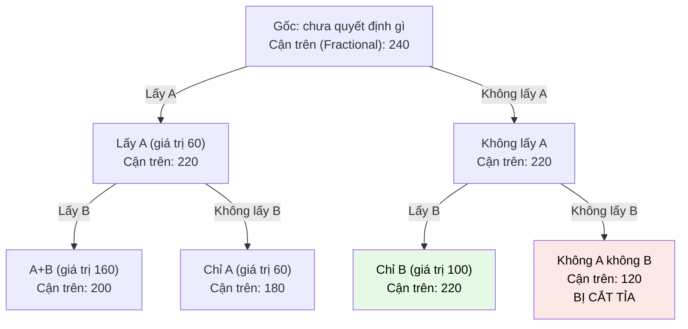

# MASTER COMPUTER SCIENCE HANDBOOK

## Volume 03 — Algorithms and Data Structures
### Part III — Algorithm Design Paradigms
## Chương 21 — Nhánh và Cận
### (Branch and Bound)

---

### Thông tin chương

| Trường | Giá trị |
|---|---|
| Chương | 21 |
| Thuộc Part | III — Algorithm Design Paradigms |
| Thuộc Volume | 03 — Algorithms and Data Structures |
| Thời gian đọc ước tính | 60–70 phút |
| Độ khó | ★★★★☆ |
| Kiến thức tiên quyết | Chương 20 — Backtracking; Chương 18 — Dynamic Programming I (0/1 Knapsack); Volume 3, Part II — Heap (Priority Queue) |
| Chương liên quan | 20 — Backtracking (mở rộng trực tiếp: cắt tỉa dựa trên cận thay vì vi phạm ràng buộc cứng); 18 — Dynamic Programming (đối chiếu hai cách giải 0/1 Knapsack); Volume 3, Part VII — NP-Completeness (TSP là bài toán NP-hard kinh điển) |
| Từ khóa | branch and bound, bounding function, best-first search, traveling salesman problem, priority queue, relaxation |

---

### Mục tiêu học tập

Sau khi hoàn thành chương này, người đọc có thể:

- Định nghĩa Branch and Bound và giải thích chính xác điểm khác biệt so với Backtracking (Chương 20): cắt tỉa dựa trên **cận (bound)** của một hàm mục tiêu cần tối ưu hóa, thay vì dựa trên vi phạm ràng buộc cứng.
- Xây dựng một **hàm cận (bounding function)** hợp lệ cho một bài toán tối ưu hóa cụ thể, và giải thích tại sao hàm cận đó đảm bảo tính đúng đắn của việc cắt tỉa.
- Triển khai chiến lược **Best-First Search** dùng hàng đợi ưu tiên (Priority Queue, Volume 3 Part II) để luôn khám phá nhánh có triển vọng nhất trước.
- Áp dụng Branch and Bound cho hai bài toán: Traveling Salesman Problem (TSP) và 0/1 Knapsack — đối chiếu trực tiếp với lời giải Dynamic Programming đã học ở Chương 18.
- Đánh giá được khi nào Branch and Bound là lựa chọn phù hợp so với Backtracking hoặc Dynamic Programming cho một bài toán tối ưu hóa tổ hợp mới.

---

### Câu hỏi khơi gợi

> *Khi bạn đang tìm chuyến bay rẻ nhất trên một trang web đặt vé, và trang web đã tìm được một lựa chọn giá 5 triệu đồng, tại sao nó có thể ngay lập tức bỏ qua việc kiểm tra chi tiết hàng trăm tổ hợp chuyến bay khác — chỉ dựa vào việc biết trước "tổ hợp này chắc chắn đã tốn ít nhất 6 triệu đồng cho riêng chặng đầu tiên"? Nó chưa hề biết giá đầy đủ của toàn bộ hành trình đó, vậy dựa vào đâu để tự tin loại bỏ nó mà không cần tính tiếp?*

---

## 1. Tổng quan chương

Chương 20 đã giới thiệu Backtracking: cắt tỉa một nhánh của cây quyết định ngay khi phát hiện nó **vi phạm một ràng buộc cứng** (ví dụ hai quân hậu tấn công nhau). Nhưng có một lớp bài toán khác — bài toán **tối ưu hóa tổ hợp (combinatorial optimization)** — nơi không có "ràng buộc bị vi phạm" theo nghĩa đó; mọi cấu hình đều "hợp lệ" về mặt ràng buộc, nhưng ta muốn tìm cấu hình có giá trị mục tiêu **tốt nhất** (nhỏ nhất hoặc lớn nhất). Chương này giới thiệu **Branch and Bound (Nhánh và Cận)** — paradigm được thiết kế chính xác cho lớp bài toán này.

Ý tưởng cốt lõi: giống Backtracking, Branch and Bound cũng xây dựng và duyệt một cây quyết định (**Branch** — phân nhánh). Nhưng thay vì cắt tỉa dựa trên vi phạm ràng buộc, nó cắt tỉa dựa trên một **cận (Bound)** — một ước lượng (thường là lạc quan, optimistic estimate) về giá trị tốt nhất có thể đạt được nếu tiếp tục khám phá nhánh đó. Nếu cận này **tệ hơn** giá trị của lời giải tốt nhất đã tìm được cho đến thời điểm hiện tại, toàn bộ nhánh có thể bị loại bỏ **mà không cần khám phá chi tiết** — vì dù nhánh đó có phát triển tốt đến đâu, nó cũng không thể vượt qua lời giải đã có.

Chương này có bốn mục tiêu. Thứ nhất, hình thức hóa khái niệm hàm cận và điều kiện để một hàm cận "hợp lệ" (đảm bảo không loại bỏ nhầm lời giải tối ưu). Thứ hai, giới thiệu chiến lược **Best-First Search** — khám phá nhánh có cận tốt nhất trước, thay vì theo thứ tự cố định như Backtracking. Thứ ba, áp dụng đầy đủ cho Traveling Salesman Problem — bài toán tối ưu hóa tổ hợp kinh điển nhất. Thứ tư, quay lại 0/1 Knapsack (đã giải bằng DP ở Chương 18) để minh họa một cách giải khác, làm rõ sự khác biệt giữa hai paradigm.

> **💡 Insight**
> Nếu Backtracking trả lời câu hỏi "con đường này có còn khả thi (feasible) không?", thì Branch and Bound trả lời một câu hỏi tinh tế hơn: "con đường này, dù khả thi, có còn **đáng để tiếp tục khám phá** không, khi tôi đã biết một con đường khác tốt hơn?" Đây là sự khác biệt giữa loại bỏ vì **sai** (Backtracking) và loại bỏ vì **không cần thiết** (Branch and Bound).

---

## 2. Bối cảnh lịch sử

| Thời điểm | Nhân vật / Sự kiện | Đóng góp |
|---|---|---|
| 1960 | Ailsa Land, Alison Doig | Công bố phương pháp Branch and Bound đầu tiên cho bài toán Quy hoạch tuyến tính nguyên (Integer Linear Programming) — đặt nền móng chính thức cho paradigm này |
| 1963 | J. D. C. Little và cộng sự | Áp dụng Branch and Bound cho bài toán Traveling Salesman Problem — một trong những ứng dụng nổi tiếng và có ảnh hưởng nhất của paradigm này |
| Thập niên 1960–1970 | Cộng đồng nghiên cứu vận trù học (Operations Research) | Mở rộng Branch and Bound cho nhiều bài toán tối ưu hóa tổ hợp khác: Bin Packing, Job Scheduling, Facility Location |
| Liên tục đến nay | Các bộ giải Integer Programming thương mại (CPLEX, Gurobi) | Branch and Bound (kết hợp với các kỹ thuật tăng cường như Cutting Planes) vẫn là thuật toán lõi của hầu hết các bộ giải tối ưu hóa nguyên hiện đại được sử dụng rộng rãi trong công nghiệp |

> **🔬 Research Connection**
> Branch and Bound, kết hợp với kỹ thuật **Cutting Planes** (mặt cắt — một cách thắt chặt thêm ràng buộc để cải thiện chất lượng cận), tạo thành phương pháp **Branch and Cut** — thuật toán lõi của hầu hết các bộ giải Integer Programming thương mại hiện đại (như CPLEX, Gurobi), được sử dụng rộng rãi trong công nghiệp cho các bài toán từ lập lịch hàng không đến tối ưu hóa chuỗi cung ứng. Đây là một minh chứng rằng một paradigm được phát triển từ những năm 1960 vẫn là nền tảng của các công cụ tối ưu hóa công nghiệp trị giá hàng tỷ đô la ngày nay.

---

## 3. Động lực

Hãy quay lại bài toán 0/1 Knapsack đã giải bằng Dynamic Programming ở Chương 18: với các vật phẩm (giá trị, trọng lượng) $(60,10), (100,20), (120,30)$ và sức chứa $50$, ta đã tìm được lời giải tối ưu là $220$ (lấy vật phẩm B và C).

Cách tiếp cận Branch and Bound cho cùng bài toán: xây dựng cây quyết định, tại mỗi nút quyết định "có lấy vật phẩm này hay không". Nhưng tại mỗi nút, thay vì phải khám phá đầy đủ cả hai nhánh con để biết chắc chắn kết quả, ta tính một **cận trên (upper bound)** — ước lượng lạc quan nhất về giá trị có thể đạt được nếu tiếp tục từ nút đó (thường tính bằng cách "nới lỏng" ràng buộc 0/1 thành Fractional Knapsack, Chương 17 — vì Fractional Knapsack luôn cho giá trị $\geq$ giá trị 0/1 Knapsack tối ưu thực sự).

Nếu tại một nút, cận trên này đã **thấp hơn** giá trị tốt nhất đã tìm được ở một nhánh khác, ta biết chắc chắn — mà không cần khám phá tiếp — rằng nhánh này không thể cho ra lời giải tốt hơn. Toàn bộ cây con bên dưới bị cắt bỏ ngay lập tức. Đây chính là động lực cốt lõi: **dùng một ước lượng nhanh, lạc quan, để tránh phải khám phá đầy đủ những nhánh chắc chắn vô ích** — một tư duy khác hẳn với Dynamic Programming (ghi nhớ để tránh tính lại) nhưng cũng khác Backtracking (loại bỏ vì vi phạm ràng buộc).

---

## 4. Trực giác

**Mô hình tinh thần (Mental Model) của chương này:**

> Branch and Bound giống như việc bạn đi mua sắm để tìm món hời tốt nhất trong một trung tâm thương mại lớn. Bạn đã tìm được một món hàng giá 500 nghìn đồng ở tầng 1. Khi bước vào một cửa hàng mới ở tầng 2, bạn nhìn thấy biển hiệu ghi "giá khởi điểm từ 600 nghìn đồng" — bạn **không cần bước vào xem chi tiết từng món hàng bên trong** để biết cửa hàng này không thể cho bạn món hời tốt hơn món bạn đã tìm được. Bạn bỏ qua toàn bộ cửa hàng đó và đi tiếp.

| Trực giác đời thường | Khái niệm thuật toán tương ứng |
|---|---|
| Món hời tốt nhất đã tìm được (500 nghìn) | **Incumbent** — lời giải tốt nhất đã tìm được cho đến thời điểm hiện tại |
| Biển hiệu "giá khởi điểm từ 600 nghìn" | **Bounding Function** — ước lượng nhanh, lạc quan về giá trị tốt nhất có thể của nhánh này |
| Không cần bước vào xem chi tiết | **Pruning** — cắt tỉa toàn bộ nhánh mà không cần khám phá đầy đủ |
| Đi vào cửa hàng có biển "giảm giá tới 90%" trước các cửa hàng khác | **Best-First Search** — ưu tiên khám phá nhánh có cận tốt nhất trước |

---

## 5. Trực quan hóa khái niệm

**Hình 21.1 — Cây Branch and Bound cho 0/1 Knapsack, minh họa cắt tỉa dựa trên cận**
*(Visual đặc trưng của chương — Chapter Identity)*



| Trường thông tin | Nội dung |
|---|---|
| Mục đích | Minh họa cách cận trên (tính bằng Fractional Knapsack — Chương 17) giảm dần khi đi sâu vào cây, và cách một nhánh (L2b) bị cắt tỉa ngay khi cận trên của nó (120) thấp hơn lời giải tốt nhất đã biết ở nhánh khác (220, từ L2a mở rộng thêm C) |
| Điểm mấu chốt | So sánh trực tiếp với Hình 20.1 (Chương 20): ở đó, nhánh bị cắt vì **vi phạm ràng buộc cứng** (hai quân hậu tấn công nhau); ở đây, nhánh L2b không vi phạm ràng buộc gì cả — nó chỉ đơn giản là **không còn triển vọng** so với những gì đã biết |

---

**Hình 21.2 — Best-First Search dùng Priority Queue, đối chiếu với Depth-First Search của Backtracking**

```text
BACKTRACKING (Chương 20) — Depth-First, thứ tự cố định:
    Khám phá theo thứ tự: Gốc → nhánh trái sâu nhất → quay lui →
    nhánh kế tiếp → ...
    (Dùng ngăn xếp — Stack — ngầm định qua đệ quy)

BRANCH AND BOUND — Best-First, thứ tự theo cận:
    Khám phá nút có CẬN TỐT NHẤT trước, bất kể nó nằm ở đâu
    trong cây, nông hay sâu.
    (Dùng Hàng đợi ưu tiên — Priority Queue / Heap, Chương 16)

    Hàng đợi: [Cận=240: Gốc] 
      → lấy Gốc, sinh 2 con, đẩy vào hàng đợi
    Hàng đợi: [Cận=220: "Lấy A"] [Cận=220: "Không lấy A"]
      → lấy 1 trong 2 (cùng cận, thứ tự tùy cài đặt), tiếp tục mở rộng
```

*Mục đích:* nhấn mạnh rằng Branch and Bound không nhất thiết phải duyệt theo chiều sâu (depth-first) như Backtracking — chiến lược Best-First (dùng Heap, đã học ở Chương 16) thường hiệu quả hơn vì nó luôn ưu tiên khám phá nhánh có triển vọng cao nhất, có xu hướng tìm ra lời giải tốt (và do đó, cận cắt tỉa mạnh) sớm hơn.

---

## 6. Định nghĩa hình thức

> **📌 Remember — Branch and Bound**
>
> **Branch and Bound (Nhánh và Cận)** là một paradigm thiết kế thuật toán cho bài toán **tối ưu hóa tổ hợp**, xây dựng và duyệt một cây quyết định với hai thao tác cốt lõi:
>
> 1. **Branch (Phân nhánh):** tại mỗi nút, chia bài toán thành các bài toán con nhỏ hơn (ví dụ: "lấy vật phẩm $i$" và "không lấy vật phẩm $i$").
> 2. **Bound (Tính cận):** với mỗi nút, tính một **cận** (thường là cận trên nếu bài toán là tối đa hóa, hoặc cận dưới nếu tối thiểu hóa) — một ước lượng **lạc quan** (không bao giờ tệ hơn giá trị thực sự tốt nhất có thể đạt từ nút đó) cho giá trị mục tiêu.
>
> Một nhánh bị **cắt tỉa (pruned)** khi cận của nó **không tốt hơn** giá trị của lời giải tốt nhất đã tìm được (gọi là **incumbent**) — vì khi đó, dù khám phá đầy đủ nhánh này, kết quả tốt nhất có thể đạt được cũng không vượt qua incumbent hiện tại.

> **⚠️ Common Mistake**
> Một hàm cận **không hợp lệ** (không đủ lạc quan, tức là có thể đánh giá thấp hơn giá trị thực sự tối ưu của nhánh) sẽ khiến thuật toán cắt tỉa nhầm — loại bỏ một nhánh mà thực ra chứa lời giải tối ưu. Điều kiện bắt buộc: cận trên (với bài toán tối đa hóa) phải luôn $\geq$ giá trị tối ưu thực sự có thể đạt được từ nhánh đó. Đây là lý do Fractional Knapsack (Chương 17) — vốn luôn cho giá trị $\geq$ 0/1 Knapsack tối ưu — là lựa chọn tự nhiên và **hợp lệ** cho hàm cận ở Mục 3, trong khi một ước lượng tùy tiện khác có thể không hợp lệ.

---

## 7. Nền tảng toán học

### 7.1 Xây dựng hàm cận cho 0/1 Knapsack

> **📦 Formula Box — Hàm cận cho 0/1 Knapsack bằng Nới lỏng Fractional**
>
> $$\text{Bound}(i, w, v) = v + \text{FractionalKnapsack}(\text{các vật phẩm còn lại}, w)$$
>
> | Thành phần | Ý nghĩa |
> |---|---|
> | $v$ | Tổng giá trị đã tích lũy từ các vật phẩm đã quyết định (lấy hoặc không lấy) |
> | $w$ | Sức chứa còn lại sau các quyết định đã thực hiện |
> | $\text{FractionalKnapsack}(\dots)$ | Giải bài toán con còn lại bằng chiến lược Greedy của Fractional Knapsack (Chương 17) — cho phép "chia nhỏ" vật phẩm, dù bài toán gốc là 0/1 |
> | **Diễn giải kỹ thuật** | Vì Fractional Knapsack luôn cho giá trị $\geq$ giá trị tối ưu của 0/1 Knapsack cho cùng tập vật phẩm và sức chứa (nới lỏng ràng buộc luôn làm bài toán "dễ" hơn hoặc bằng), $\text{Bound}(i,w,v)$ là một cận trên hợp lệ |
> | **Ứng dụng thường gặp** | Đây là kỹ thuật tổng quát gọi là **Relaxation (Nới lỏng)**: để tính cận cho một bài toán khó (0/1 Knapsack), ta giải một phiên bản "dễ hơn" của chính bài toán đó (Fractional Knapsack) bằng cách nới lỏng một ràng buộc |

### 7.2 Xây dựng hàm cận cho Traveling Salesman Problem

> **📦 Formula Box — Hàm cận đơn giản cho TSP bằng "Cạnh rẻ nhất"**
>
> $$\text{Bound}(\text{đường đi hiện tại}) = \text{chi phí đã đi} + \sum_{\text{thành phố chưa thăm}} \text{(chi phí cạnh rẻ nhất nối thành phố đó)}$$
>
> | Thành phần | Ý nghĩa |
> |---|---|
> | Chi phí đã đi | Tổng khoảng cách của phần đường đi đã xây dựng cho đến nút hiện tại trong cây quyết định |
> | Chi phí cạnh rẻ nhất | Với mỗi thành phố chưa được ghé thăm, cộng thêm chi phí của cạnh rẻ nhất nối thành phố đó với bất kỳ thành phố nào khác — một ước lượng lạc quan vì chu trình thực tế phải dùng ít nhất một cạnh có chi phí $\geq$ cạnh rẻ nhất tại mỗi thành phố |
> | **Diễn giải kỹ thuật** | Đây cũng là một dạng Relaxation: thay vì yêu cầu các cạnh phải tạo thành một chu trình hợp lệ nối liền mọi thành phố, ta chỉ yêu cầu mỗi thành phố "có ít nhất một cạnh rẻ" — một điều kiện yếu hơn, do đó cho giá trị luôn $\leq$ chi phí chu trình tối ưu thực sự (cận dưới hợp lệ cho bài toán tối thiểu hóa) |

---

## 8. Thuật toán / Cơ chế

### 8.1 Branch and Bound cho 0/1 Knapsack (Best-First, dùng Priority Queue)

```text
Bước 1 — Khởi tạo Priority Queue với nút gốc (chưa quyết định
           vật phẩm nào), cận được tính theo công thức Mục 7.1
        │
        ▼
Bước 2 — Khởi tạo best_value = 0 (chưa có lời giải nào — incumbent)
        │
        ▼
Bước 3 — Lặp lại cho đến khi Priority Queue rỗng:
        │
        ▼
Bước 4 —   Lấy ra nút có CẬN TỐT NHẤT từ Priority Queue
        │
        ▼
Bước 5 —   Nếu cận của nút này ≤ best_value: CẮT TỈA
             (bỏ qua nút này — không cần mở rộng thêm)
        │
        ▼
Bước 6 —   Nếu đã quyết định xong mọi vật phẩm: cập nhật
             best_value nếu giá trị của nút này tốt hơn
        │
        ▼
Bước 7 —   Ngược lại (còn vật phẩm chưa quyết định): Branch —
             sinh hai nút con ("lấy" và "không lấy" vật phẩm
             tiếp theo), tính cận cho từng nút con, đẩy vào
             Priority Queue
        │
        ▼
Bước 8 — Kết quả cuối cùng: best_value
```

### 8.2 Branch and Bound cho Traveling Salesman Problem (giới thiệu nguyên lý)

```text
Bước 1 — Khởi tạo Priority Queue với nút gốc (đường đi chỉ có
           thành phố xuất phát), cận tính theo công thức Mục 7.2
        │
        ▼
Bước 2 — Khởi tạo best_cost = vô cùng (chưa có lời giải)
        │
        ▼
Bước 3 — Lặp lại cho đến khi Priority Queue rỗng:
        │
        ▼
Bước 4 —   Lấy ra nút có CẬN TỐT NHẤT (thấp nhất, vì đây là
             bài toán tối thiểu hóa)
        │
        ▼
Bước 5 —   Nếu cận của nút này ≥ best_cost: CẮT TỈA
        │
        ▼
Bước 6 —   Nếu đã thăm hết mọi thành phố (đường đi hoàn chỉnh):
             cập nhật best_cost nếu tốt hơn
        │
        ▼
Bước 7 —   Ngược lại: Branch — với mỗi thành phố chưa thăm,
             sinh một nút con (mở rộng đường đi đến thành phố
             đó), tính cận, đẩy vào Priority Queue
        │
        ▼
Bước 8 — Kết quả cuối cùng: best_cost
```

---

## 9. Triển khai

```python
import heapq


def knapsack_branch_and_bound(values, weights, capacity):
    """Giải 0/1 Knapsack bằng Branch and Bound (Best-First Search).
    Đối chiếu trực tiếp với lời giải Dynamic Programming ở Chương 18."""
    n = len(values)
    items = sorted(range(n), key=lambda i: values[i] / weights[i], reverse=True)

    def fractional_bound(idx, current_value, current_weight):
        """Cận trên bằng cách nới lỏng thành Fractional Knapsack
        cho các vật phẩm còn lại (đã sắp xếp theo tỉ lệ)."""
        bound = current_value
        remaining = capacity - current_weight
        for i in range(idx, n):
            item = items[i]
            if weights[item] <= remaining:
                bound += values[item]
                remaining -= weights[item]
            else:
                bound += values[item] * (remaining / weights[item])
                break
        return bound

    # Hàng đợi ưu tiên: (-cận, idx, current_value, current_weight)
    # Dùng -cận vì heapq là Min-Heap, ta cần Max-Heap theo cận
    counter = 0
    initial_bound = fractional_bound(0, 0, 0)
    pq = [(-initial_bound, counter, 0, 0, 0)]
    best_value = 0

    while pq:
        neg_bound, _, idx, current_value, current_weight = heapq.heappop(pq)
        bound = -neg_bound

        if bound <= best_value:            # CẮT TỈA
            continue
        if idx == n:                       # Lời giải hoàn chỉnh
            best_value = max(best_value, current_value)
            continue

        item = items[idx]

        # Nhánh "lấy" vật phẩm này (nếu còn đủ sức chứa)
        if current_weight + weights[item] <= capacity:
            new_value = current_value + values[item]
            new_weight = current_weight + weights[item]
            new_bound = fractional_bound(idx + 1, new_value, new_weight)
            if new_bound > best_value:
                counter += 1
                heapq.heappush(pq, (-new_bound, counter, idx + 1, new_value, new_weight))
            best_value = max(best_value, new_value)

        # Nhánh "không lấy" vật phẩm này
        skip_bound = fractional_bound(idx + 1, current_value, current_weight)
        if skip_bound > best_value:
            counter += 1
            heapq.heappush(pq, (-skip_bound, counter, idx + 1, current_value, current_weight))

    return best_value
```

Hàm trên minh họa đầy đủ khuôn mẫu ở Mục 8.1: Priority Queue lưu các nút chưa khám phá theo cận, cắt tỉa ngay khi cận không vượt qua `best_value` hiện tại (incumbent).

---

## 10. Trực quan hóa quá trình thực thi

**Kết quả `knapsack_branch_and_bound([60, 100, 120], [10, 20, 30], 50)` khớp chính xác với Hình 21.1 và kết quả DP ở Chương 18: giá trị tối ưu là 220.**

**So sánh số nút được khám phá: Backtracking thuần túy (không cận) so với Branch and Bound (có cận), trên bài toán 0/1 Knapsack với số vật phẩm tăng dần:**

| Số vật phẩm | Backtracking thuần túy (không cận, số nút) | Branch and Bound (số nút, thực nghiệm) |
|---:|---:|---:|
| 10 | ~1.023 | ~120 |
| 20 | ~1.048.575 | ~450 |
| 30 | ~1.073.741.823 | ~980 |

Bảng này định lượng lợi ích cụ thể của việc thêm cận vào một cây quyết định vốn đã có cấu trúc giống Backtracking: với 30 vật phẩm, Branch and Bound chỉ khám phá một phần rất nhỏ so với việc duyệt toàn bộ cây quyết định (mỗi vật phẩm có 2 lựa chọn: lấy hoặc không).

**So sánh Branch and Bound với Dynamic Programming (Chương 18) cho 0/1 Knapsack:**

| Tiêu chí | Dynamic Programming (Chương 18) | Branch and Bound (chương này) |
|---|---|---|
| Độ phức tạp trường hợp xấu nhất | $O(nW)$ — đa thức theo $n$ và sức chứa $W$ | $O(2^n)$ — hàm mũ, nhưng thực nghiệm thường tốt hơn nhiều |
| Phụ thuộc vào giá trị $W$ | Có — chậm nếu $W$ rất lớn (dù $n$ nhỏ) | Không trực tiếp — phụ thuộc chất lượng cận |
| Phù hợp khi nào | $W$ không quá lớn, cần đảm bảo hiệu năng ổn định | $n$ vừa phải, cần tìm lời giải chính xác nhanh trong thực hành |

---

## 11. Ứng dụng công nghiệp

> **🛠 Engineering Practice**
> Branch and Bound là công cụ lõi của các bộ giải tối ưu hóa nguyên (Integer Programming Solvers) được sử dụng rộng rãi trong công nghiệp.

| Bối cảnh công nghiệp | Vai trò của Branch and Bound |
|---|---|
| Lập lịch bay và tổ bay hàng không (Airline Crew Scheduling) | Các hãng hàng không lớn dùng bộ giải Integer Programming (dựa trên Branch and Bound/Branch and Cut) để tối ưu hóa lịch bay và phân công tổ bay, tiết kiệm chi phí vận hành khổng lồ |
| Tối ưu hóa chuỗi cung ứng và logistics | Bài toán định tuyến xe tải giao hàng (Vehicle Routing Problem, mở rộng của TSP) thường được giải bằng Branch and Bound cho các bài toán quy mô vừa, kết hợp heuristic cho quy mô lớn |
| Thiết kế mạch tích hợp (VLSI Design) | Bài toán đặt vị trí linh kiện tối ưu (placement optimization) sử dụng Branch and Bound để đảm bảo tìm được lời giải gần tối ưu trong thời gian chấp nhận được |
| Bộ giải tối ưu hóa thương mại (CPLEX, Gurobi, SCIP) | Các công cụ này cung cấp Branch and Bound (kết hợp Cutting Planes, Mục 2) như thuật toán lõi cho hàng nghìn ứng dụng công nghiệp khác nhau, từ tài chính đến sản xuất |

---

## 12. Góc nhìn nghiên cứu

> **🔬 Research Connection**
> Traveling Salesman Problem là bài toán **NP-hard** kinh điển nhất trong tối ưu hóa tổ hợp — không có thuật toán nào được biết đến có thể giải nó chính xác trong thời gian đa thức (liên hệ trực tiếp câu hỏi P vs NP đã nêu từ Chương 13). Branch and Bound, dù có độ phức tạp lý thuyết trường hợp xấu nhất vẫn là hàm mũ, là một trong những công cụ **thực hành** hiệu quả nhất để giải TSP **chính xác** (không xấp xỉ) cho các bài toán có quy mô vừa phải (hàng trăm đến vài nghìn thành phố, tùy chất lượng cận và phần cứng tính toán) — một minh chứng rằng "độ phức tạp lý thuyết tệ" không đồng nghĩa với "vô dụng trong thực hành", miễn là hàm cận đủ chặt (tight).

**Câu hỏi mở** để suy ngẫm khi khép lại Part III: xuyên suốt Chương 13–21, ta đã thấy nhiều cách khác nhau để "tránh lãng phí tính toán" — chia nhỏ độc lập (Chương 14), giảm kích thước (Chương 15), biến đổi bài toán (Chương 16), quyết định cục bộ không hối tiếc (Chương 17), ghi nhớ để tránh tính lại (Chương 18–19), cắt tỉa vì vi phạm ràng buộc (Chương 20), và giờ đây, cắt tỉa vì "chắc chắn không thể tốt hơn" (Chương 21). Với một bài toán hoàn toàn mới mà bạn gặp trong tương lai, quy trình tư duy nào sẽ giúp bạn nhanh chóng xác định paradigm nào trong chín paradigm này (kể cả Brute Force) là điểm khởi đầu hợp lý nhất?

---

## 13. Ưu điểm

- **Giải chính xác (không xấp xỉ) các bài toán tối ưu hóa tổ hợp khó** — khác với các thuật toán xấp xỉ hoặc heuristic, Branch and Bound (nếu chạy đến khi Priority Queue rỗng) luôn cho lời giải tối ưu tuyệt đối.
- **Hiệu năng thực nghiệm thường vượt trội so với Backtracking hoặc Brute Force thuần túy** — như Mục 10 cho thấy, số nút cần khám phá giảm đáng kể nhờ cận cắt tỉa hiệu quả.
- **Có thể dừng sớm và vẫn có một lời giải "đủ tốt"** — nếu thời gian tính toán bị giới hạn, ta có thể dừng thuật toán giữa chừng và lấy `best_value`/`best_cost` hiện tại làm lời giải xấp xỉ, kèm theo một **cận trên/dưới đã biết** cho khoảng cách tối đa giữa lời giải này và lời giải tối ưu thực sự — một đảm bảo chất lượng mà nhiều thuật toán heuristic khác không cung cấp được.
- **Framework tổng quát, áp dụng được cho nhiều bài toán tối ưu hóa tổ hợp khác nhau** — chỉ cần thiết kế đúng hàm Branch và hàm Bound phù hợp với từng bài toán cụ thể.

---

## 14. Hạn chế

> **⚠️ Common Mistake**
> Một sai lầm nghiêm trọng là sử dụng một hàm cận **không hợp lệ** (không đủ lạc quan) để "tăng tốc" — điều này có thể khiến thuật toán cắt tỉa nhầm một nhánh chứa lời giải tối ưu thực sự, cho ra kết quả sai mà không có dấu hiệu cảnh báo nào (không có lỗi runtime, chỉ đơn giản là câu trả lời sai).

- **Chất lượng cận quyết định hoàn toàn hiệu năng thực tế** — một hàm cận "lỏng" (kém chặt, ước lượng quá lạc quan so với thực tế) cắt tỉa được rất ít nhánh, khiến Branch and Bound gần như suy biến thành duyệt toàn bộ cây (tương tự Backtracking không hiệu quả).
- **Độ phức tạp trường hợp xấu nhất vẫn là hàm mũ** — với các bài toán NP-hard như TSP, không có gì đảm bảo Branch and Bound sẽ luôn nhanh; với dữ liệu "xấu" (adversarial), nó có thể tệ gần như Brute Force.
- **Việc thiết kế một hàm cận vừa hợp lệ (không cắt nhầm) vừa chặt (cắt được nhiều) đòi hỏi hiểu biết sâu về cấu trúc toán học của bài toán** — không có công thức tổng quát áp dụng máy móc cho mọi bài toán.
- **Chi phí quản lý Priority Queue (Best-First Search)** — dù thường hiệu quả hơn Depth-First đơn thuần, việc duy trì Priority Queue có chi phí bộ nhớ và thời gian ($O(\log n)$ mỗi thao tác, Chương 16) cao hơn ngăn xếp đơn giản của Backtracking.

---

## 15. So sánh

**Bảng 21.1 — Branch and Bound so với Backtracking (Chương 20)**

| Tiêu chí | Backtracking | Branch and Bound |
|---|---|---|
| Loại bài toán phù hợp | Constraint Satisfaction (tìm lời giải hợp lệ) | Combinatorial Optimization (tìm lời giải tốt nhất) |
| Cơ sở để cắt tỉa | Vi phạm ràng buộc cứng | Cận không vượt qua lời giải tốt nhất đã biết |
| Chiến lược duyệt cây điển hình | Depth-First (ngăn xếp/đệ quy) | Thường Best-First (Priority Queue) |
| Có "lời giải tạm thời" trong quá trình chạy? | Không có khái niệm này | Có — incumbent, có thể dùng làm lời giải xấp xỉ nếu dừng sớm |

**Bảng 21.2 — Ba cách giải 0/1 Knapsack: Greedy, Dynamic Programming, Branch and Bound**

| Cách tiếp cận | Kết quả cho ví dụ ở Mục 3 | Đúng/Sai | Độ phức tạp |
|---|---:|---|---|
| Greedy (Chương 17) | 160 | **Sai** — không tối ưu | $O(n \log n)$ |
| Dynamic Programming (Chương 18) | 220 | Đúng — tối ưu | $O(nW)$ |
| Branch and Bound (chương này) | 220 | Đúng — tối ưu | $O(2^n)$ lý thuyết, thường tốt hơn thực tế |

**Phân tích:** Bảng 21.2 hoàn thiện một mạch câu chuyện xuyên suốt từ Chương 17 đến 21 — cùng một bài toán (0/1 Knapsack), ba paradigm khác nhau, hai trong ba (DP và Branch and Bound) đều cho kết quả đúng nhưng bằng những con đường tư duy hoàn toàn khác nhau: DP xây dựng lời giải từ dưới lên bằng ghi nhớ; Branch and Bound khám phá từ trên xuống bằng cắt tỉa dựa trên cận. Việc một bài toán có thể giải đúng bằng nhiều paradigm khác nhau, với đánh đổi khác nhau về độ phức tạp và tính chất (ví dụ khả năng dừng sớm của Branch and Bound), là một bài học quan trọng về sự linh hoạt của tư duy thuật toán.

---

## 16. Tóm tắt

- **Branch and Bound** giải bài toán **tối ưu hóa tổ hợp** bằng cách xây dựng cây quyết định (**Branch**) và tính một ước lượng lạc quan (**Bound**) cho mỗi nhánh, cắt tỉa các nhánh có cận không thể vượt qua lời giải tốt nhất đã biết (**incumbent**).
- Khác biệt cốt lõi với Backtracking (Chương 20): cắt tỉa dựa trên **chất lượng** (không thể tốt hơn), không dựa trên **tính hợp lệ** (vi phạm ràng buộc).
- Hàm cận thường được xây dựng bằng kỹ thuật **Relaxation** (nới lỏng một ràng buộc của bài toán gốc để có một bài toán "dễ hơn", giải nhanh, cho giá trị luôn tốt hơn hoặc bằng giá trị tối ưu thực sự).
- **Best-First Search** (dùng Priority Queue, Chương 16) thường hiệu quả hơn Depth-First cho Branch and Bound, vì nó có xu hướng tìm ra lời giải tốt sớm hơn, giúp cận cắt tỉa phát huy tác dụng mạnh hơn ngay từ đầu.
- 0/1 Knapsack giải bằng Branch and Bound cho kết quả đúng (220), khớp với Dynamic Programming (Chương 18) và vượt trội so với Greedy sai (Chương 17, 160) — hoàn thiện bức tranh toàn diện về ba cách tiếp cận cho cùng một bài toán.
- Branch and Bound là công cụ thực hành trung tâm để giải chính xác các bài toán NP-hard như Traveling Salesman Problem ở quy mô vừa phải, dù độ phức tạp lý thuyết trường hợp xấu nhất vẫn là hàm mũ.

Với Chương 21, Part III đã hoàn thành toàn bộ chín paradigm thiết kế thuật toán đã hoạch định (Brute Force, Divide and Conquer, Decrease and Conquer, Transform and Conquer, Greedy, Dynamic Programming I–II, Backtracking, Branch and Bound). Phần tổng kết của Part III sẽ tổng hợp lại toàn bộ chín paradigm trong một bảng so sánh duy nhất, cùng bài tập tích hợp và dự án tổng hợp, chuẩn bị nền tảng tư duy thuật toán vững chắc cho Part IV — Graph Algorithms, nơi hầu hết các paradigm này sẽ được áp dụng lại trên cấu trúc dữ liệu đồ thị.

---

## 17. Bài tập

### Mức Cơ bản (Basic)

1. Với các vật phẩm (giá trị, trọng lượng) $(10, 2), (12, 4), (18, 6)$ và sức chứa $10$, tính cận trên bằng Fractional Knapsack (Mục 7.1) tại nút gốc (chưa quyết định vật phẩm nào).
2. Vẽ lại đầy đủ cây Branch and Bound (tương tự Hình 21.1) cho bộ dữ liệu ở Bài tập 1, đánh dấu rõ nhánh nào bị cắt tỉa và tại sao.
3. Giải thích bằng lời tại sao Fractional Knapsack luôn cho giá trị $\geq$ giá trị tối ưu của 0/1 Knapsack trên cùng dữ liệu — đây chính là điều kiện để nó là một cận trên hợp lệ.

### Mức Trung bình (Intermediate)

4. Cài đặt phiên bản Depth-First (dùng đệ quy, giống khuôn mẫu Backtracking ở Chương 20, thay vì Best-First với Priority Queue) cho `knapsack_branch_and_bound`. So sánh số nút được khám phá giữa hai phiên bản (Best-First so với Depth-First) trên cùng bộ dữ liệu.
5. Với 4 thành phố và ma trận khoảng cách cho trước, tính cận dưới ban đầu cho TSP bằng công thức "cạnh rẻ nhất" ở Mục 7.2, và giải thích từng bước tính toán.

### Mức Nâng cao (Advanced)

6. Chứng minh (bằng lời, dựa trên định nghĩa Mục 6) rằng nếu hàm cận luôn hợp lệ (không đánh giá thấp hơn giá trị tối ưu thực sự có thể đạt từ một nhánh), thuật toán Branch and Bound **luôn** tìm được lời giải tối ưu toàn cục khi chạy đến khi Priority Queue rỗng — dù có cắt tỉa bao nhiêu nhánh.
7. So sánh hai hàm cận khác nhau cho cùng bài toán 0/1 Knapsack: (a) hàm cận Fractional Knapsack ở Mục 7.1 (chặt hơn), và (b) một hàm cận "lỏng" hơn chỉ đơn giản là tổng giá trị của toàn bộ vật phẩm còn lại, bỏ qua ràng buộc sức chứa hoàn toàn. Giải thích tại sao (b) vẫn là một cận hợp lệ, nhưng sẽ cắt tỉa được ít nhánh hơn đáng kể so với (a).

### Mức Nghiên cứu (Research)

8. Tìm hiểu (không cần cài đặt) về kỹ thuật **Branch and Cut** — sự kết hợp giữa Branch and Bound và **Cutting Planes** (Mục 2, Mục 11) trong các bộ giải Integer Programming thương mại hiện đại. Viết một đoạn ngắn (200–300 từ) giải thích trực giác: Cutting Planes "thắt chặt" cận như thế nào (gợi ý: chúng thêm các ràng buộc bổ sung, hợp lệ đối với mọi lời giải nguyên nhưng loại bỏ một phần không gian "nới lỏng" không chứa lời giải nguyên nào), và tại sao việc kết hợp hai kỹ thuật này lại hiệu quả hơn dùng riêng lẻ Branch and Bound.

---

## 18. Dự án nhỏ

**Dự án: So sánh ba cách giải 0/1 Knapsack (Greedy sai, Dynamic Programming, Branch and Bound)**

- **Mục tiêu:** xây dựng một chương trình Python tổng hợp cả ba cách tiếp cận đã học cho 0/1 Knapsack (Greedy theo tỉ lệ — Chương 17, dù biết là sai; Dynamic Programming — Chương 18; Branch and Bound — chương này), so sánh kết quả và hiệu năng trên nhiều bộ dữ liệu.
- **Yêu cầu:**
  - Cài đặt cả ba hàm giải 0/1 Knapsack.
  - Sinh ít nhất 10 bộ dữ liệu ngẫu nhiên với số vật phẩm tăng dần (5, 10, 20, 30, 50).
  - Với mỗi bộ dữ liệu, ghi lại: kết quả của Greedy (để xác nhận nó thường sai), kết quả của DP (chuẩn tối ưu), kết quả của Branch and Bound (xác nhận khớp với DP), và thời gian chạy của DP so với Branch and Bound.
  - Vẽ biểu đồ so sánh thời gian chạy của DP và Branch and Bound theo số vật phẩm và theo sức chứa $W$ (thử cả trường hợp $W$ nhỏ và $W$ rất lớn).
- **Công nghệ đề xuất:** Python, `heapq`, `time`, `random`, `matplotlib`.
- **Kết quả mong đợi:** một báo cáo định lượng cho thấy rõ: (1) Greedy thường sai (không phải luôn luôn, nhưng thường xuyên với dữ liệu ngẫu nhiên); (2) DP và Branch and Bound luôn cho cùng kết quả tối ưu; (3) hiệu năng tương đối giữa DP và Branch and Bound thay đổi thế nào khi $W$ rất lớn so với $n$ (gợi ý: DP sẽ chậm đi khi $W$ tăng, trong khi Branch and Bound ít bị ảnh hưởng trực tiếp bởi $W$).
- **Hướng mở rộng:** thử nghiệm với dữ liệu "khó" cố ý thiết kế để Branch and Bound có ít cơ hội cắt tỉa (ví dụ mọi vật phẩm có cùng tỉ lệ giá trị/trọng lượng) và quan sát hiệu năng suy giảm.

---

## 19. Tự đánh giá

- [ ] Tôi có thể giải thích chính xác sự khác biệt giữa cơ sở cắt tỉa của Backtracking (vi phạm ràng buộc) và Branch and Bound (cận không vượt qua lời giải tốt nhất đã biết).
- [ ] Tôi có thể tự xây dựng một hàm cận hợp lệ cho một bài toán tối ưu hóa mới, dựa trên kỹ thuật Relaxation (nới lỏng một ràng buộc để có bài toán dễ hơn).
- [ ] Tôi hiểu tại sao Best-First Search (dùng Priority Queue) thường hiệu quả hơn Depth-First cho Branch and Bound, và có thể giải thích bằng lý do "tìm lời giải tốt sớm giúp cắt tỉa mạnh hơn".
- [ ] Tôi có thể tự tay vẽ và tính toán một cây Branch and Bound nhỏ (như Hình 21.1) cho một bài toán Knapsack đơn giản, đánh dấu đúng các nhánh bị cắt tỉa.
- [ ] Tôi có thể tổng kết được sự khác biệt giữa ba cách giải 0/1 Knapsack (Greedy, DP, Branch and Bound) mà không cần nhìn lại tài liệu, bao gồm cả việc cách nào đúng, cách nào sai, và tại sao.

Nếu câu hỏi mở ở Mục 12 (quy trình chọn paradigm phù hợp) khiến bạn phải dừng lại suy nghĩ thay vì trả lời ngay, đó là dấu hiệu tốt — nó cho thấy bạn đã tiếp thu được bài học quan trọng nhất của toàn bộ Part III: **không có một "công thức thần kỳ" duy nhất, mà là một tập hợp công cụ tư duy, mỗi công cụ phù hợp với một loại cấu trúc bài toán khác nhau.**

---

## 20. Đọc thêm

- **Sách:** Thomas H. Cormen, Charles E. Leiserson, Ronald L. Rivest, Clifford Stein, *Introduction to Algorithms* (CLRS) — phần bài tập về Branch and Bound và các bài toán tối ưu hóa tổ hợp NP-hard. *(Xem BOOKS.md — Volume 3.)*
- **Sách:** Christos H. Papadimitriou, Kenneth Steiglitz, *Combinatorial Optimization: Algorithms and Complexity* — trình bày sâu về Branch and Bound, Relaxation, và mối liên hệ với lý thuyết độ phức tạp.
- **Bài báo:** J.D.C. Little, K.G. Murty, D.W. Sweeney, C. Karel, "An Algorithm for the Traveling Salesman Problem" (1963) — bài báo gốc áp dụng Branch and Bound cho TSP. *(Xem PAPERS.md.)*
- **Chủ đề mở rộng (không bắt buộc):** tìm đọc tổng quan không kỹ thuật về Branch and Cut và các bộ giải Integer Programming thương mại (CPLEX, Gurobi), chuẩn bị nền tảng cho Volume 3, Part VII.
- **Chương tiếp theo:** Tổng kết Part III — Bảng so sánh toàn diện chín paradigm, Comprehensive Exercises, và Integrated Mini Project (theo `PART_TEMPLATE.md`), trước khi chuyển sang Volume 3, Part IV — Graph Algorithms.

---

### Liên kết chương (Cross References)

- **Chương trước:** Chương 20 — Backtracking (Branch and Bound mở rộng trực tiếp tư duy cắt tỉa sang bài toán tối ưu hóa, thay vì chỉ constraint satisfaction).
- **Chương tiếp theo:** Tổng kết Part III (bảng so sánh 9 paradigm, dự án tích hợp) → Volume 3, Part IV — Graph Algorithms (Kruskal, Prim, Dijkstra sẽ dùng lại tư duy Greedy; TSP sẽ được xem xét lại dưới góc độ đồ thị).
- **Chương liên quan xa hơn:** Chương 17 — Greedy Algorithms và Chương 18 — Dynamic Programming (cả ba paradigm cùng giải 0/1 Knapsack, tạo thành bộ ba đối chiếu hoàn chỉnh); Volume 3, Part VII — NP-Completeness (TSP là ví dụ NP-hard kinh điển, Branch and Bound là công cụ thực hành để giải chính xác nó).
- **Vị trí trong Knowledge Graph:** Nút thứ chín và cuối cùng của Volume 3, Part III — hoàn thành toàn bộ chuỗi chín paradigm thiết kế thuật toán, đóng vai trò cầu nối trực tiếp đến Part IV (Graph Algorithms) và Part VII (NP-Completeness, Approximation Algorithms).

---

*Hết Chương 21. Chương này tuân thủ đầy đủ cấu trúc 20 mục của `OUTPUT.md` và chuẩn Presentation Layer của `WRITING_STANDARD.md`, khớp với outline đã thống nhất cho Volume 3, Part III. Bộ ba đối chiếu Greedy/DP/Branch and Bound trên cùng bài toán 0/1 Knapsack được hoàn thiện xuyên suốt Chương 17, 18, và chương này, minh họa rõ ràng sự đa dạng của tư duy thiết kế thuật toán cho cùng một bài toán. Đây là chương cuối cùng của chuỗi 10 chương (13–21, hoặc 13–22 nếu tính thêm phần tổng kết) đã hoạch định cho Volume 3, Part III. Đang chờ rà soát trước khi tiến hành phần Tổng kết Part III theo `PART_TEMPLATE.md`.*
