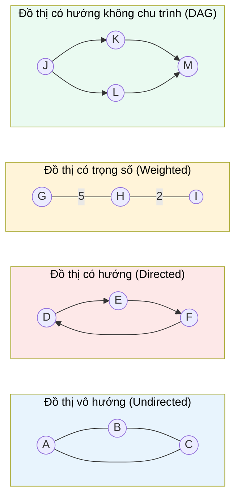

# MASTER COMPUTER SCIENCE HANDBOOK

## Volume 03 — Algorithms and Data Structures
### Part IV — Graph Algorithms
## Chương 4.1 — Biểu diễn Đồ thị
### (Graph Representation)

---

### Thông tin chương

| Trường | Giá trị |
|---|---|
| Chương | 4.1 |
| Thuộc Part | IV — Graph Algorithms |
| Thuộc Volume | 03 — Algorithms and Data Structures |
| Thời gian đọc ước tính | 45–55 phút |
| Độ khó | ★☆☆☆☆ |
| Kiến thức tiên quyết | Volume 03, Part II — Fundamental Data Structures (đặc biệt: Arrays, Linked Lists, Hash Tables); Volume 03, Part I — Big-O Analysis |
| Chương liên quan | 4.2 — Graph Traversal (BFS/DFS sẽ dùng trực tiếp biểu diễn học ở chương này); Volume 01, Part II — Discrete Mathematics (Graph Theory, định nghĩa toán học của đồ thị) |
| Từ khóa | graph, vertex, edge, adjacency list, adjacency matrix, edge list, directed graph, undirected graph, weighted graph, degree |

---

### Mục tiêu học tập

Sau khi hoàn thành chương này, người đọc có thể:

- Định nghĩa hình thức một đồ thị (graph) bằng ngôn ngữ toán học tập hợp đã học ở Volume 01.
- Phân biệt đồ thị có hướng (directed) và vô hướng (undirected), có trọng số (weighted) và không trọng số.
- Triển khai ba cách biểu diễn đồ thị phổ biến: Adjacency Matrix, Adjacency List, Edge List.
- Phân tích và so sánh độ phức tạp về thời gian và bộ nhớ của từng cách biểu diễn cho các thao tác cơ bản.
- Lựa chọn cách biểu diễn phù hợp dựa trên đặc điểm của bài toán thực tế (đồ thị thưa hay đồ thị dày đặc).

---

### Câu hỏi khơi gợi

> *Tại sao Google Maps có thể tìm đường đi giữa hai địa điểm cách nhau hàng nghìn kilômét chỉ trong vài mili-giây, trong khi bản đồ đường bộ của một quốc gia có thể chứa hàng triệu giao lộ và đoạn đường? Làm thế nào để một cấu trúc dữ liệu biểu diễn được hàng triệu "điểm" và "kết nối" đó mà không làm máy tính cạn kiệt bộ nhớ?*

---

## 1. Tổng quan chương

Toàn bộ Part IV của Volume này xoay quanh một loại bài toán mà bạn đã gặp trong thực tế lập trình mà có thể chưa nhận ra: bài toán về **quan hệ giữa các thực thể**. Một hệ thống mạng xã hội có quan hệ "theo dõi" giữa người dùng; một hệ thống build tool có quan hệ "phụ thuộc" giữa các module; một bản đồ giao thông có quan hệ "kết nối" giữa các giao lộ. Tất cả những cấu trúc này đều có thể mô hình hóa bằng một đối tượng toán học duy nhất: **đồ thị (graph)**.

Chương này là chương mở đầu của Part IV, tập trung vào một câu hỏi có vẻ đơn giản nhưng quyết định hiệu năng của mọi thuật toán đồ thị sau này: **làm sao để lưu trữ một đồ thị trong bộ nhớ máy tính?** Cách lựa chọn biểu diễn không chỉ là vấn đề cài đặt — nó ảnh hưởng trực tiếp đến độ phức tạp thời gian của các thuật toán sẽ học ở Chương 4.2 đến 4.7. Chọn sai cách biểu diễn có thể khiến một thuật toán vốn chạy nhanh trở nên chậm chạp trên dữ liệu thực tế có hàng triệu đỉnh.

> **💡 Insight**
> Đồ thị không phải một cấu trúc dữ liệu "mới" hoàn toàn — nó là một cách tổng quát hóa nhiều cấu trúc đã học. Cây (Tree) ở Part II chính là một đồ thị đặc biệt: đồ thị vô hướng, liên thông, không có chu trình. Danh sách liên kết (Linked List) cũng là một đồ thị đặc biệt: mỗi đỉnh chỉ có tối đa một cạnh đi ra. Học đồ thị, theo một nghĩa nào đó, là học phiên bản tổng quát nhất của những gì bạn đã biết.

---

## 2. Bối cảnh lịch sử

| Thời điểm | Nhân vật / Sự kiện | Đóng góp |
|---|---|---|
| 1736 | Leonhard Euler | Giải **Bài toán Bảy cây cầu Königsberg (Seven Bridges of Königsberg)** — được xem là công trình khai sinh Lý thuyết Đồ thị (Graph Theory); Euler chứng minh không tồn tại đường đi qua đúng mỗi cây cầu một lần bằng cách trừu tượng hóa thành phố thành các đỉnh và cầu thành các cạnh |
| 1852 | Francis Guthrie | Đặt ra **Bài toán Bốn màu (Four Color Problem)** — thúc đẩy nghiên cứu về tô màu đồ thị (graph coloring), chỉ được chứng minh hoàn chỉnh vào năm 1976 với sự hỗ trợ của máy tính |
| 1956 | Joseph Kruskal | Công bố thuật toán tìm cây khung nhỏ nhất, một trong những thuật toán tham lam kinh điển nhất (sẽ học ở Chương 4.4) |
| 1959 | Edsger W. Dijkstra | Công bố thuật toán tìm đường đi ngắn nhất mang tên ông (Chương 4.5) |

Điều đáng chú ý là Euler chưa từng dùng từ "đồ thị" hay vẽ hình đỉnh–cạnh như ngày nay; đóng góp mang tính cách mạng của ông nằm ở việc **nhận ra rằng chi tiết hình học của thành phố (khoảng cách, hình dạng cây cầu) hoàn toàn không liên quan đến việc giải bài toán** — chỉ có cấu trúc kết nối mới quan trọng. Đây chính là bản chất của tư duy trừu tượng hóa (abstraction) mà Volume 02 đã giới thiệu, áp dụng vào một bài toán cụ thể.

---

## 3. Động lực

Hãy xem xét một bài toán kỹ thuật quen thuộc: bạn đang xây dựng một hệ thống quản lý build cho một dự án phần mềm lớn, nơi module A phụ thuộc vào module B, module B phụ thuộc vào module C và D, v.v. Bạn cần trả lời các câu hỏi như:

- "Nếu tôi thay đổi module C, những module nào cần được build lại?"
- "Có tồn tại một vòng phụ thuộc (circular dependency) trong hệ thống hay không?"
- "Thứ tự build tối ưu là gì để không module nào được build trước các phụ thuộc của nó?"

Nếu bạn dùng một `Array` hoặc một tập hợp các cặp `(module_A, module_B)` rời rạc để lưu thông tin này, việc trả lời những câu hỏi trên sẽ đòi hỏi quét toàn bộ dữ liệu nhiều lần — rất kém hiệu quả khi số module lên đến hàng nghìn. Vấn đề nằm ở việc bạn đang cố lưu trữ **quan hệ** bằng cấu trúc dữ liệu chỉ vốn được thiết kế cho **danh sách phẳng**. Đồ thị, cùng với cách biểu diễn phù hợp, giải quyết chính xác lớp bài toán này — và các câu hỏi trên hóa ra chính là những gì Chương 4.2 (duyệt đồ thị) và Chương 4.3 (Topological Sort) sẽ trả lời trực tiếp.

---

## 4. Trực giác

**Mô hình tinh thần (Mental Model) của chương này:**

> Một đồ thị giống như một **bản đồ tàu điện ngầm**: các nhà ga là **đỉnh (vertex)**, các đoạn đường ray nối trực tiếp hai nhà ga là **cạnh (edge)**. Bản đồ không quan tâm khoảng cách vật lý thực tế hay hình dạng đường ray uốn lượn ra sao — nó chỉ quan tâm: từ ga này, tôi có thể đi trực tiếp đến những ga nào?

| Trực giác kỹ thuật bạn đã có | Khái niệm đồ thị tương ứng |
|---|---|
| Bảng "following" và "followers" trên mạng xã hội | Directed Graph — cạnh có hướng, A theo dõi B không có nghĩa B theo dõi lại A |
| Nhóm bạn bè trên Facebook (kết bạn là hai chiều) | Undirected Graph — cạnh không có hướng |
| Khoảng cách giữa hai thành phố trên bản đồ | Weighted Graph — mỗi cạnh mang một giá trị (trọng số) |
| `package.json` liệt kê dependencies của một dự án | Directed Graph biểu diễn quan hệ phụ thuộc |
| Bảng băm (Hash Table) ánh xạ key → danh sách giá trị | Chính là cách hoạt động nội tại của Adjacency List (Mục 7.2) |

---

## 5. Trực quan hóa khái niệm

**Hình 4.1.1 — Bốn loại đồ thị cơ bản**
*(Visual đặc trưng của chương — Chapter Identity)*



| Trường thông tin | Nội dung |
|---|---|
| Mục đích | Cho một hình ảnh trực quan phân biệt 4 loại đồ thị sẽ xuất hiện xuyên suốt Part IV — DAG (Directed Acyclic Graph) đặc biệt quan trọng cho Chương 4.3 (Topological Sort) |
| Điểm mấu chốt | Đồ thị có hướng ở giữa (D→E→F→D) có **chu trình (cycle)**; DAG bên phải thì không — sự khác biệt này quyết định việc Topological Sort có thực hiện được hay không (Chương 4.3) |

---

**Hình 4.1.2 — So sánh trực quan ba cách biểu diễn cho cùng một đồ thị**

Xét đồ thị vô hướng đơn giản: đỉnh $\{0, 1, 2, 3\}$, cạnh $\{(0,1), (0,2), (1,2), (2,3)\}$.

```text
Adjacency Matrix (Ma trận kề)          Adjacency List (Danh sách kề)
                                        
      0   1   2   3                    0 → [1, 2]
   0  0   1   1   0                    1 → [0, 2]
   1  1   0   1   0                    2 → [0, 1, 3]
   2  1   1   0   1                    3 → [2]
   3  0   0   1   0                    

Edge List (Danh sách cạnh)
[(0,1), (0,2), (1,2), (2,3)]
```

*Mục đích:* Cho thấy cùng một thông tin đồ thị được mã hóa theo ba cấu trúc dữ liệu hoàn toàn khác nhau. *Điểm mấu chốt:* Adjacency Matrix dùng ô `1`/`0` để đánh dấu cạnh (chiếm $n^2$ ô bất kể có bao nhiêu cạnh thực sự); Adjacency List chỉ lưu đúng những cạnh tồn tại (linh hoạt hơn về bộ nhớ khi đồ thị thưa).

---

## 6. Định nghĩa hình thức

> **📌 Remember — Đồ thị (Graph)**
>
> Một **đồ thị (graph)** $G$ là một cặp có thứ tự $G = (V, E)$, trong đó:
> - $V$ là một **tập hợp hữu hạn** các **đỉnh (vertex)**, còn gọi là node.
> - $E \subseteq V \times V$ là một tập hợp các **cạnh (edge)**, mỗi cạnh nối hai đỉnh.
>
> Đây chính là ứng dụng trực tiếp của khái niệm tập hợp và tích Descartes đã học ở Volume 01, Chương 1.5: mỗi cạnh, về bản chất hình thức nhất, là một phần tử của $V \times V$.

**Đồ thị vô hướng (Undirected Graph)** — cạnh $(u, v)$ không phân biệt thứ tự: $(u,v)$ và $(v,u)$ biểu diễn cùng một cạnh.

**Đồ thị có hướng (Directed Graph, hay Digraph)** — cạnh $(u, v)$ có thứ tự: tồn tại cạnh từ $u$ đến $v$ không có nghĩa tồn tại cạnh từ $v$ đến $u$.

**Đồ thị có trọng số (Weighted Graph)** — mỗi cạnh $(u,v)$ được gán thêm một giá trị số thực $w(u,v)$, gọi là **trọng số (weight)**, biểu diễn "chi phí" của cạnh đó (khoảng cách, thời gian, chi phí tiền tệ...).

**Bậc của đỉnh (Degree)** — với đồ thị vô hướng, $\deg(v)$ là số cạnh liên thuộc với $v$. Với đồ thị có hướng, phân biệt **bậc vào (in-degree)** — số cạnh đi vào $v$ — và **bậc ra (out-degree)** — số cạnh đi ra từ $v$.

**Đồ thị thưa (Sparse Graph) và đồ thị dày đặc (Dense Graph)** — một đồ thị được gọi là thưa khi $|E|$ gần với $|V|$ (ví dụ $|E| = O(|V|)$), và dày đặc khi $|E|$ gần với $|V|^2$ (gần với số cạnh tối đa có thể). Sự phân biệt này quyết định trực tiếp cách biểu diễn nào hiệu quả hơn (Mục 15).

---

## 7. Nền tảng toán học

### 7.1 Số cạnh tối đa của một đồ thị

- **Ý nghĩa:** với $n$ đỉnh, có bao nhiêu cạnh khác nhau có thể tồn tại nhiều nhất?
- **Trực giác:** mỗi cạnh là một cặp hai đỉnh phân biệt; số cách chọn 2 đỉnh từ $n$ đỉnh, không quan tâm thứ tự (với đồ thị vô hướng), chính là tổ hợp chập 2 của $n$.

> **📦 Formula Box — Số cạnh tối đa**
>
> $$|E|_{max} = \binom{n}{2} = \frac{n(n-1)}{2} \quad \text{(vô hướng)} \qquad |E|_{max} = n(n-1) \quad \text{(có hướng)}$$
>
> | Thành phần | Ý nghĩa |
> |---|---|
> | $n$ | Số đỉnh của đồ thị ($n = |V|$) |
> | $\binom{n}{2}$ | Số cách chọn 2 đỉnh phân biệt từ $n$ đỉnh, không quan tâm thứ tự (mỗi cặp = một cạnh vô hướng tiềm năng) |
> | **Diễn giải kỹ thuật** | Với đồ thị có hướng, mỗi cặp đỉnh có thể có **2 cạnh riêng biệt** (một chiều mỗi hướng), nên nhân đôi: $n(n-1)$ |
> | **Ứng dụng thường gặp** | Xác định một đồ thị có "dày đặc" hay không bằng cách so sánh $|E|$ thực tế với $|E|_{max}$; ước lượng bộ nhớ cần thiết trong trường hợp xấu nhất |

**Kiểm chứng bằng tay** với $n = 4$: $\binom{4}{2} = \frac{4 \times 3}{2} = 6$ — khớp với 6 cạnh của đồ thị đầy đủ $K_4$ (mỗi đỉnh nối với mọi đỉnh khác).

### 7.2 Quan hệ giữa Adjacency List và Hash Table

Adjacency List, về bản chất cài đặt, thường được xây dựng bằng một **mảng (hoặc Hash Table) ánh xạ mỗi đỉnh đến một danh sách các đỉnh kề** — đây là lý do Mục 4 xếp nó cùng hàng với "Hash Table ánh xạ key → danh sách giá trị". Việc tra cứu "đỉnh $v$ kề với những đỉnh nào" có độ phức tạp trung bình $O(1)$ để truy cập danh sách kề, nhờ tính chất tra cứu $O(1)$ trung bình của Hash Table đã học ở Part II.

---

## 8. Thuật toán / Cơ chế

**Xây dựng Adjacency List từ Edge List** — thao tác chuyển đổi phổ biến khi nhận dữ liệu đầu vào dạng danh sách cạnh (ví dụ đọc từ file CSV):

```text
Bước 1 — Khởi tạo một mảng (hoặc Hash Table) rỗng adj[], kích thước n
        │
        ▼
Bước 2 — Với mỗi cạnh (u, v) trong Edge List:
        │
        ▼
Bước 3 —   Thêm v vào danh sách adj[u]
        │
        ▼
Bước 4 —   Nếu đồ thị vô hướng: thêm u vào danh sách adj[v]
           (nếu có hướng: bỏ qua bước này)
        │
        ▼
Bước 5 — Sau khi duyệt hết Edge List, adj[] chính là Adjacency List hoàn chỉnh
```

> **💡 Insight**
> Bước 4 chính là điểm khác biệt cài đặt duy nhất giữa đồ thị có hướng và vô hướng khi dùng Adjacency List: đồ thị vô hướng cần ghi cạnh **hai lần** (một lần cho mỗi chiều), trong khi đồ thị có hướng chỉ ghi **một lần**. Đây là nguồn gốc phổ biến của lỗi cài đặt sai (xem Mục 14).

---

## 9. Triển khai

```python
class Graph:
    """Cài đặt đồ thị bằng Adjacency List — cách biểu diễn hiệu quả nhất
    cho đa số bài toán thực tế (đồ thị thưa)."""

    def __init__(self, num_vertices, directed=False):
        self.num_vertices = num_vertices
        self.directed = directed
        # Mỗi đỉnh ánh xạ tới danh sách các đỉnh kề (adjacency list)
        self.adj = {v: [] for v in range(num_vertices)}

    def add_edge(self, u, v, weight=1):
        """Thêm một cạnh (u, v). Nếu đồ thị vô hướng, thêm cả hai chiều."""
        self.adj[u].append((v, weight))
        if not self.directed:
            self.adj[v].append((u, weight))

    def neighbors(self, v):
        """Trả về danh sách đỉnh kề của v — độ phức tạp O(deg(v))."""
        return self.adj[v]

    def has_edge(self, u, v):
        """Kiểm tra cạnh (u, v) có tồn tại không — độ phức tạp O(deg(u))
        vì phải quét toàn bộ danh sách kề của u."""
        return any(neighbor == v for neighbor, _ in self.adj[u])


class GraphMatrix:
    """Cài đặt đồ thị bằng Adjacency Matrix — phù hợp khi cần kiểm tra
    cạnh cực nhanh và đồ thị tương đối dày đặc."""

    def __init__(self, num_vertices, directed=False):
        self.num_vertices = num_vertices
        self.directed = directed
        # Ma trận n x n, khởi tạo toàn 0 (không có cạnh)
        self.matrix = [[0] * num_vertices for _ in range(num_vertices)]

    def add_edge(self, u, v, weight=1):
        self.matrix[u][v] = weight
        if not self.directed:
            self.matrix[v][u] = weight

    def has_edge(self, u, v):
        """Kiểm tra cạnh (u, v) — độ phức tạp O(1), tra cứu trực tiếp."""
        return self.matrix[u][v] != 0
```

Lớp `Graph` triển khai chính xác thuật toán ở Mục 8 (dùng Hash Table/dict thay vì mảng để đơn giản hóa việc thêm trọng số). Lớp `GraphMatrix` cho thấy sự đánh đổi ngược lại: `has_edge` nhanh hơn ($O(1)$ so với $O(\deg(u))$) nhưng khởi tạo tốn $O(n^2)$ bộ nhớ ngay từ đầu, bất kể đồ thị có bao nhiêu cạnh thực sự.

---

## 10. Trực quan hóa quá trình thực thi

**Xây dựng đồ thị từ Hình 4.1.2** (đỉnh $\{0,1,2,3\}$, cạnh $\{(0,1), (0,2), (1,2), (2,3)\}$, vô hướng), chạy thực tế với `Graph`:

```text
>>> g = Graph(4, directed=False)
>>> for u, v in [(0,1), (0,2), (1,2), (2,3)]:
...     g.add_edge(u, v)
>>> g.adj
{0: [(1, 1), (2, 1)],
 1: [(0, 1), (2, 1)],
 2: [(0, 1), (1, 1), (3, 1)],
 3: [(2, 1)]}
```

Kết quả khớp chính xác với Adjacency List minh họa ở Hình 4.1.2 — mỗi đỉnh ánh xạ đến đúng các đỉnh kề của nó, mỗi cạnh vô hướng xuất hiện ở cả hai chiều (ví dụ $(0,1)$ xuất hiện trong `adj[0]` lẫn `adj[1]`).

**Đo bộ nhớ thực nghiệm** — so sánh Adjacency List và Adjacency Matrix trên đồ thị thưa ($n = 10{,}000$ đỉnh, $|E| = 20{,}000$ cạnh, tức trung bình mỗi đỉnh chỉ kề với 2 đỉnh khác):

| Cách biểu diễn | Số ô/phần tử cần cấp phát | Ghi chú |
|---|---|---|
| Adjacency Matrix | $10{,}000^2 = 100{,}000{,}000$ | Cấp phát cố định $n^2$, bất kể $|E|$ |
| Adjacency List | $\approx 2 \times 20{,}000 = 40{,}000$ | Chỉ cấp phát đúng số cạnh thực tế (nhân đôi vì vô hướng) |

Chênh lệch **2500 lần** — minh chứng thực nghiệm trực tiếp cho phân tích ở Mục 15: với đồ thị thưa (rất phổ biến trong thực tế, ví dụ mạng xã hội hay bản đồ giao thông), Adjacency List tiết kiệm bộ nhớ vượt trội.

---

## 11. Ứng dụng công nghiệp

> **🛠 Engineering Practice**
> Lựa chọn cách biểu diễn đồ thị là một quyết định kỹ thuật thực sự xuất hiện trong thiết kế hệ thống quy mô lớn, không chỉ là bài tập lý thuyết.

| Bối cảnh công nghiệp | Cách biểu diễn thường dùng | Lý do |
|---|---|---|
| Bản đồ giao thông (Google Maps) | Adjacency List | Mạng lưới đường thực tế rất thưa — mỗi giao lộ chỉ kết nối trực tiếp với vài giao lộ lân cận |
| Mạng xã hội (Facebook, LinkedIn) | Adjacency List (thường kết hợp Hash Table phân tán) | Số bạn bè trung bình của một người dùng nhỏ hơn rất nhiều so với tổng số người dùng |
| Bảng quan hệ trong Compiler (dependency graph giữa các file mã nguồn) | Adjacency List (thường là DAG) | Số file mà một file phụ thuộc trực tiếp thường nhỏ |
| Bài toán đồ thị dày đặc trong Computational Biology (ví dụ ma trận tương đồng gene) | Adjacency Matrix | Gần như mọi cặp đỉnh đều có cạnh (có trọng số), tra cứu $O(1)$ quan trọng hơn tiết kiệm bộ nhớ |

---

## 12. Góc nhìn nghiên cứu

> **🔬 Research Connection**
> Việc chọn cách biểu diễn đồ thị không chỉ dừng lại ở hai lựa chọn kinh điển (List/Matrix) — đây vẫn là một chủ đề nghiên cứu tích cực khi quy mô đồ thị vượt xa những gì bộ nhớ một máy tính đơn có thể chứa.

Với các đồ thị siêu lớn (ví dụ đồ thị web với hàng tỷ trang, hoặc đồ thị mạng xã hội với hàng tỷ người dùng), cả Adjacency List lẫn Adjacency Matrix truyền thống đều không đủ khả năng mở rộng trên một máy đơn. Điều này thúc đẩy các hướng nghiên cứu như:

- **Compressed Sparse Row (CSR)** — một biến thể nén của Adjacency List, phổ biến trong các thư viện tính toán khoa học và Graph Neural Networks (sẽ gặp lại ở Volume 6).
- **Distributed Graph Processing** — các hệ thống như Pregel (Google) hay GraphX (Apache Spark) phân tán đồ thị trên nhiều máy, mỗi máy chỉ giữ một phần đỉnh và cạnh (chi tiết thuộc phạm vi Volume 4 — Data Engineering and Computer Systems).

**Câu hỏi mở** để suy ngẫm: nếu đồ thị của bạn liên tục thay đổi theo thời gian thực (ví dụ thêm/xóa quan hệ bạn bè hàng nghìn lần mỗi giây), cách biểu diễn nào trong số các cách đã học ở chương này sẽ chịu chi phí cập nhật thấp nhất? Đây là động lực trực tiếp cho các cấu trúc dữ liệu đồ thị động (dynamic graph structures) — một hướng nghiên cứu vẫn đang phát triển.

---

## 13. Ưu điểm

- **Adjacency List** tiết kiệm bộ nhớ vượt trội cho đồ thị thưa — trường hợp phổ biến nhất trong thực tế kỹ thuật (Mục 10, 11).
- **Adjacency Matrix** cho phép kiểm tra sự tồn tại của một cạnh trong $O(1)$ — quan trọng cho các thuật toán cần tra cứu cạnh liên tục.
- Cả hai cách biểu diễn đều tổng quát hóa tốt cho đồ thị có trọng số, có hướng, hoặc kết hợp cả hai.
- Việc mô hình hóa bài toán thành đồ thị mở khóa toàn bộ kho thuật toán đã được nghiên cứu kỹ lưỡng qua nhiều thập kỷ (Chương 4.2–4.7).

---

## 14. Hạn chế

> **⚠️ Common Mistake**
> Lỗi cài đặt phổ biến nhất khi mới học đồ thị là **quên xử lý tính đối xứng của đồ thị vô hướng** — chỉ thêm cạnh một chiều thay vì cả hai chiều (Mục 8, Bước 4), dẫn đến kết quả duyệt đồ thị sai ở Chương 4.2 mà rất khó phát hiện nếu không kiểm tra kỹ.

- **Adjacency Matrix** lãng phí bộ nhớ nghiêm trọng với đồ thị thưa: cấp phát cố định $O(n^2)$ bất kể số cạnh thực tế (Mục 10).
- **Adjacency List** có chi phí kiểm tra cạnh cao hơn: $O(\deg(u))$ thay vì $O(1)$, vì phải quét toàn bộ danh sách kề.
- Không có cách biểu diễn nào "luôn tốt nhất" — lựa chọn phụ thuộc hoàn toàn vào đặc điểm đồ thị và thao tác nào được thực hiện thường xuyên nhất (Mục 15).
- Cả hai cách biểu diễn cơ bản đều không mở rộng tốt cho đồ thị có hàng tỷ đỉnh trên một máy đơn (Mục 12).

---

## 15. So sánh

**Bảng 4.1.1 — So sánh Độ phức tạp giữa các Cách Biểu diễn Đồ thị**

| Thao tác | Adjacency Matrix | Adjacency List | Edge List |
|---|---|---|---|
| Bộ nhớ | $O(n^2)$ | $O(n + m)$ | $O(m)$ |
| Kiểm tra cạnh $(u,v)$ | $O(1)$ | $O(\deg(u))$ | $O(m)$ |
| Liệt kê đỉnh kề của $v$ | $O(n)$ | $O(\deg(v))$ | $O(m)$ |
| Thêm một cạnh | $O(1)$ | $O(1)$ | $O(1)$ |
| Duyệt toàn bộ cạnh | $O(n^2)$ | $O(n + m)$ | $O(m)$ |

*(Ký hiệu: $n = |V|$ số đỉnh, $m = |E|$ số cạnh)*

**Phân tích:** Sự khác biệt then chốt nằm ở dòng "Bộ nhớ" và "Liệt kê đỉnh kề" — hai thao tác sẽ được dùng **liên tục** trong mọi thuật toán duyệt đồ thị ở Chương 4.2 trở đi. Khi đồ thị thưa ($m = O(n)$, trường hợp phổ biến của đồ thị thực tế như bản đồ hay mạng xã hội — Mục 11), Adjacency List có độ phức tạp $O(n + m) = O(n)$ cho bộ nhớ và cho phép liệt kê đỉnh kề nhanh gần như tối ưu, trong khi Adjacency Matrix vẫn buộc phải trả giá $O(n^2)$. Ngược lại, khi đồ thị dày đặc ($m \approx n^2$), cả hai cách biểu diễn có độ phức tạp bộ nhớ tương đương, nhưng Adjacency Matrix có thao tác kiểm tra cạnh $O(1)$ vượt trội. Edge List, tuy đơn giản nhất để cài đặt, hiếm khi được dùng làm cấu trúc chính cho thuật toán — nó thường chỉ là định dạng **đầu vào trung gian**, được chuyển đổi thành Adjacency List hoặc Matrix trước khi xử lý (đúng như quy trình ở Mục 8).

> **🎯 Nguyên tắc lựa chọn thực hành:** Mặc định dùng Adjacency List trừ khi bạn biết trước đồ thị của mình dày đặc hoặc cần kiểm tra cạnh cực nhanh và lặp lại nhiều lần — đây cũng chính là lựa chọn mặc định của hầu hết thư viện đồ thị công nghiệp (ví dụ NetworkX trong Python).

---

## 16. Tóm tắt

- Một **đồ thị** $G = (V, E)$ là một cặp gồm tập đỉnh và tập cạnh, với cạnh được định nghĩa hình thức là phần tử của $V \times V$ — ứng dụng trực tiếp của tích Descartes học ở Volume 01.
- Bốn thuộc tính phân loại đồ thị quan trọng nhất: **có hướng/vô hướng**, **có trọng số/không trọng số**, và tính chất **thưa/dày đặc** — thuộc tính cuối cùng này quyết định cách biểu diễn nào hiệu quả hơn.
- Ba cách biểu diễn cơ bản: **Adjacency Matrix** ($O(n^2)$ bộ nhớ, tra cứu cạnh $O(1)$), **Adjacency List** ($O(n+m)$ bộ nhớ, phù hợp đồ thị thưa), và **Edge List** (đơn giản, thường dùng làm định dạng trung gian).
- Không tồn tại một cách biểu diễn "tốt nhất tuyệt đối" — lựa chọn luôn là sự đánh đổi (trade-off) dựa trên đặc điểm đồ thị và thao tác được thực hiện thường xuyên nhất (Bảng 4.1.1).
- Lỗi cài đặt phổ biến nhất là quên thêm cạnh cả hai chiều cho đồ thị vô hướng khi dùng Adjacency List.

Chương 4.2 (Graph Traversal) sẽ dùng trực tiếp cấu trúc `Graph` (Adjacency List) xây dựng ở chương này để cài đặt BFS và DFS — hai thuật toán duyệt đồ thị nền tảng cho gần như mọi thuật toán còn lại của Part IV.

---

## 17. Bài tập

### Mức Cơ bản (Basic)

1. Cho đồ thị vô hướng với đỉnh $\{A, B, C, D\}$ và cạnh $\{(A,B), (B,C), (C,D), (D,A)\}$. Vẽ Adjacency Matrix và viết Adjacency List tương ứng.
2. Với đồ thị ở Bài 1, tính bậc (degree) của từng đỉnh. Tổng các bậc có quan hệ gì với số cạnh $|E|$? *(Gợi ý: thử với vài đồ thị nhỏ khác và tìm quy luật.)*
3. Một đồ thị có hướng với 5 đỉnh có tối đa bao nhiêu cạnh? Áp dụng công thức ở Mục 7.1.

### Mức Trung bình (Intermediate)

4. Cài đặt phương thức `remove_edge(u, v)` cho lớp `Graph` ở Mục 9 (dùng Adjacency List). Phân tích độ phức tạp thời gian của thao tác này và giải thích tại sao nó không thể đạt $O(1)$ như `add_edge`.
5. Cho một Edge List gồm 100.000 cạnh trên đồ thị có 10.000 đỉnh. Đồ thị này được xem là thưa hay dày đặc? Biện luận bằng công thức ở Mục 7.1, sau đó đề xuất cách biểu diễn phù hợp, có giải thích dựa trên Bảng 4.1.1.

### Mức Nâng cao (Advanced)

6. Thiết kế một cấu trúc dữ liệu lai (hybrid) kết hợp ưu điểm của Adjacency List (tiết kiệm bộ nhớ) và Adjacency Matrix (tra cứu cạnh $O(1)$), chấp nhận đánh đổi bộ nhớ ở mức trung gian. *(Gợi ý: nghĩ về việc dùng Hash Set thay vì List thông thường cho mỗi đỉnh.)*
7. Chứng minh rằng tổng bậc của mọi đỉnh trong một đồ thị vô hướng luôn là một số chẵn (đây được gọi là **Bổ đề Bắt tay — Handshaking Lemma**). *(Gợi ý: áp dụng kỹ thuật chứng minh trực tiếp học ở Volume 01, Chương 1.4 — mỗi cạnh đóng góp bao nhiêu vào tổng bậc?)*

### Mức Nghiên cứu (Research)

8. Tìm hiểu về định dạng **Compressed Sparse Row (CSR)** được nhắc đến ở Mục 12. So sánh CSR với Adjacency List truyền thống về mặt bộ nhớ và hiệu năng truy cập tuần tự (cache locality) — đây là câu hỏi mở, không kỳ vọng câu trả lời hoàn chỉnh, mà nhằm khuyến khích tìm đọc thêm tài liệu ngoài chương.

---

## 18. Dự án nhỏ

**Dự án: "Trình phân tích quan hệ phụ thuộc module" (Module Dependency Analyzer)**

**Mục tiêu:** Xây dựng một công cụ dòng lệnh đọc danh sách phụ thuộc giữa các module phần mềm (dạng Edge List từ file CSV hoặc JSON) và trực quan hóa dưới dạng đồ thị.

**Yêu cầu:**
- Đọc dữ liệu đầu vào dạng Edge List: mỗi dòng là một cặp `(module_phụ_thuộc, module_được_phụ_thuộc)`.
- Xây dựng Adjacency List bằng lớp `Graph` đã cài đặt ở Mục 9.
- In ra bậc vào/bậc ra (in-degree/out-degree) của từng module.
- (Mở rộng) Phát hiện module nào có in-degree cao nhất — thường là "module lõi" được nhiều module khác phụ thuộc vào.

**Công nghệ đề xuất:** Python, thư viện chuẩn (không cần thư viện đồ thị chuyên dụng ở giai đoạn này).

**Kết quả kỳ vọng:** Một script nhận file dữ liệu bất kỳ và xuất ra bảng thống kê bậc của từng đỉnh.

**Hướng mở rộng:** Sau khi hoàn thành Chương 4.3 (Topological Sort), quay lại dự án này để thêm chức năng phát hiện chu trình phụ thuộc (circular dependency) — một tính năng thực sự hữu ích cho các công cụ build tool thực tế.

---

## 19. Tự đánh giá

- [ ] Tôi có thể định nghĩa một đồ thị bằng ký hiệu tập hợp $(V, E)$ và giải thích mối liên hệ với tích Descartes đã học ở Volume 01.
- [ ] Tôi có thể tự vẽ Adjacency Matrix và viết Adjacency List cho một đồ thị nhỏ cho trước, không cần tra lại định nghĩa.
- [ ] Tôi hiểu và có thể giải thích bằng lời tại sao Adjacency List phù hợp hơn cho đồ thị thưa, còn Adjacency Matrix phù hợp hơn cho đồ thị dày đặc (không chỉ ghi nhớ Bảng 4.1.1, mà hiểu *tại sao*).
- [ ] Tôi đã tự cài đặt được (hoặc đọc hiểu hoàn toàn) đoạn code ở Mục 9, bao gồm cả lý do vì sao đồ thị vô hướng cần thêm cạnh hai chiều.
- [ ] Tôi có thể nhận diện được, với một bài toán thực tế mới, đồ thị đó nên được mô hình hóa có hướng hay vô hướng, có trọng số hay không.

Nếu vẫn còn phân vân giữa việc chọn Adjacency List hay Matrix cho một bài toán cụ thể, đây là dấu hiệu nên quay lại đọc kỹ Mục 15 (Bảng so sánh) trước khi tiếp tục sang Chương 4.2 — kỹ năng lựa chọn cách biểu diễn phù hợp sẽ ảnh hưởng trực tiếp đến hiệu năng của mọi thuật toán học sau này trong Part IV.

---

## 20. Đọc thêm

- **Sách:** Cormen, Leiserson, Rivest, Stein, *Introduction to Algorithms (CLRS)*, Chương "Elementary Graph Algorithms" — phần giới thiệu biểu diễn đồ thị. *(Xem BOOKS.md — Tier S, Volume 3.)*
- **Sách:** Steven Skiena, *The Algorithm Design Manual*, phần "Graph Data Structures". *(Xem BOOKS.md — Volume 3.)*
- **Chủ đề mở rộng (không bắt buộc):** tìm đọc về định dạng Compressed Sparse Row (CSR) và ứng dụng của nó trong các thư viện tính toán khoa học hiện đại (NumPy sparse matrices, PyTorch Geometric).
- **Chương tiếp theo:** Chương 4.2 — Graph Traversal (BFS và DFS).

---

### Liên kết chương (Cross References)

- **Chương trước:** Volume 03, Part II — Fundamental Data Structures (Hash Table là nền tảng cài đặt của Adjacency List, Mục 7.2).
- **Chương tiếp theo:** 4.2 — Graph Traversal: BFS và DFS (sẽ dùng trực tiếp cấu trúc `Graph` xây dựng ở chương này).
- **Chương liên quan xa hơn:** Volume 01, Part II — Discrete Mathematics (định nghĩa toán học đầy đủ của Graph Theory); Volume 04 — Data Engineering and Computer Systems (Distributed Graph Processing cho đồ thị siêu lớn, Mục 12); Volume 06 — Advanced AI (Graph Neural Networks dùng biến thể nén của Adjacency List).
- **Vị trí trong Knowledge Graph:** Nút đầu tiên của Part IV, phụ thuộc vào Part I (Big-O Analysis) và Part II (Hash Table); là điều kiện tiên quyết trực tiếp cho toàn bộ 6 chương còn lại của Part IV (4.2–4.7).

---

*Hết Chương 4.1. Chương này tuân thủ đầy đủ cấu trúc 20 mục của `OUTPUT.md` và chuẩn Presentation Layer của `WRITING_STANDARD.md`, mở đầu Part IV — Graph Algorithms của Volume 03. Toàn bộ ví dụ về Adjacency List, Adjacency Matrix và so sánh bộ nhớ đều được minh họa bằng code Python có thể chạy thực tế. Đang chờ rà soát trước khi tiếp tục sang Chương 4.2 — Graph Traversal.*
