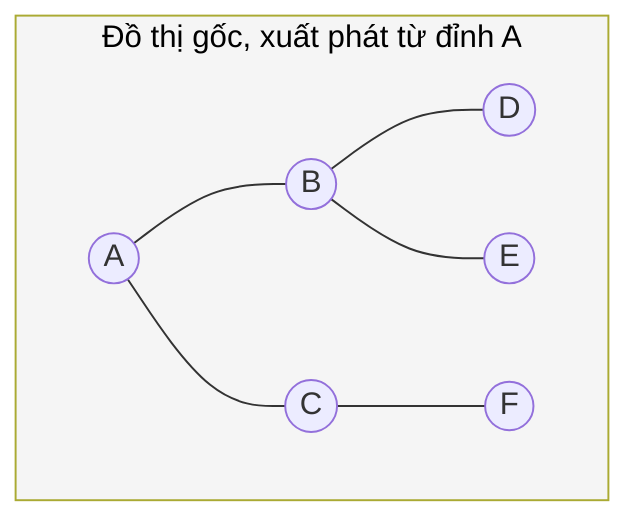

# MASTER COMPUTER SCIENCE HANDBOOK

## Volume 03 — Algorithms and Data Structures
### Part IV — Graph Algorithms
## Chương 4.2 — Duyệt Đồ thị: BFS và DFS
### (Graph Traversal: Breadth-First Search and Depth-First Search)

---

### Thông tin chương

| Trường | Giá trị |
|---|---|
| Chương | 4.2 |
| Thuộc Part | IV — Graph Algorithms |
| Thuộc Volume | 03 — Algorithms and Data Structures |
| Thời gian đọc ước tính | 55–65 phút |
| Độ khó | ★★☆☆☆ |
| Kiến thức tiên quyết | Chương 4.1 — Graph Representation (dùng trực tiếp lớp `Graph`); Volume 03, Part II — Queue, Stack |
| Chương liên quan | 4.3 — Topological Sorting (mở rộng trực tiếp từ DFS); 4.7 — Strongly Connected Components (dùng DFS làm nền tảng) |
| Từ khóa | BFS, DFS, traversal, visited set, connected component, cycle detection, recursion, backtracking |

---

### Mục tiêu học tập

Sau khi hoàn thành chương này, người đọc có thể:

- Giải thích sự khác biệt cốt lõi giữa duyệt theo chiều rộng (BFS) và duyệt theo chiều sâu (DFS).
- Cài đặt BFS bằng Queue và DFS bằng cả đệ quy (recursion) lẫn Stack tường minh.
- Sử dụng BFS để tìm đường đi ngắn nhất trên đồ thị không trọng số.
- Sử dụng DFS để phát hiện chu trình (cycle) và xác định các thành phần liên thông (connected components).
- Phân tích độ phức tạp thời gian và không gian của cả hai thuật toán bằng ký hiệu $O(V + E)$.

---

### Câu hỏi khơi gợi

> *Khi bạn tìm kiếm đường thoát hiểm trong một mê cung, bạn có hai chiến lược trực giác: (1) đi thẳng theo một hướng cho đến khi gặp ngõ cụt rồi quay lại thử hướng khác, hoặc (2) thăm dò tất cả các ngã rẽ gần nhất trước, rồi mới tiến xa hơn từng bước một. Bạn có biết rằng hai chiến lược "bản năng" này chính xác là hai thuật toán nền tảng nhất của toàn bộ Graph Theory — và máy tính dùng đúng hai chiến lược đó để giải hàng loạt bài toán từ tìm đường đi ngắn nhất đến phát hiện gian lận mạng?*

---

## 1. Tổng quan chương

Chương 4.1 đã trả lời câu hỏi "làm sao lưu trữ một đồ thị". Chương này trả lời câu hỏi tiếp theo, tự nhiên hơn: "làm sao **thăm (visit)** tất cả các đỉnh của một đồ thị một cách có hệ thống, không bỏ sót và không lặp lại?"

Hai thuật toán duyệt đồ thị nền tảng — **BFS (Breadth-First Search — Tìm kiếm theo chiều rộng)** và **DFS (Depth-First Search — Tìm kiếm theo chiều sâu)** — không chỉ là hai cách "đi dạo" qua đồ thị. Chúng là **khối xây dựng (building block)** cho gần như mọi thuật toán còn lại của Part IV: Chương 4.3 (Topological Sort) là DFS với một bước ghi nhận thứ tự; Chương 4.7 (Strongly Connected Components) là hai lượt DFS kết hợp khéo léo; ngay cả Chương 4.5 (Shortest Paths) cũng có thể xem là một phiên bản mở rộng có trọng số của BFS.

> **💡 Insight**
> Nếu bạn đã từng viết một hàm đệ quy duyệt qua cây thư mục (file system) để tìm một file cụ thể, bạn đã cài đặt DFS mà không biết. Nếu bạn từng dùng thuật toán "lan truyền" (flood fill) trong một công cụ vẽ để tô màu một vùng liên tục, bạn đã dùng cả BFS lẫn DFS — vì cây (Tree) chỉ là một trường hợp đặc biệt của đồ thị (đã nêu ở Chương 4.1, Mục 1).

---

## 2. Bối cảnh lịch sử

| Thời điểm | Nhân vật / Sự kiện | Đóng góp |
|---|---|---|
| 1959 | Edward F. Moore | Mô tả thuật toán tương đương BFS trong bài toán tìm đường đi ngắn nhất qua mê cung — một trong những mô tả sớm nhất của BFS |
| 1961 | C. Y. Lee | Độc lập công bố thuật toán tương tự (Lee Algorithm) trong bối cảnh thiết kế mạch điện tử (routing trên vi mạch) — cho thấy BFS được khám phá song song ở nhiều lĩnh vực kỹ thuật khác nhau |
| 1972 | Robert Tarjan | Công bố công trình hệ thống hóa DFS như một công cụ phân tích đồ thị mạnh mẽ, đặt nền móng cho hàng loạt thuật toán tuyến tính về sau (bao gồm thuật toán tìm Strongly Connected Components — Chương 4.7) |

Điều thú vị là bản thân ý tưởng DFS — "đi sâu nhất có thể trước khi quay lui" — đã tồn tại từ trước máy tính điện tử, dưới dạng thuật toán giải mê cung cổ điển gọi là **Thuật toán Trémaux (Trémaux's Algorithm)**, được nhà toán học Pháp Charles Pierre Trémaux mô tả từ thế kỷ 19. Đây là một ví dụ đẹp cho thấy nhiều thuật toán "hiện đại" thực chất hình thức hóa những chiến lược con người đã áp dụng trực giác từ lâu.

---

## 3. Động lực

Quay lại bài toán quản lý build hệ thống đã nêu ở Chương 4.1 (Mục 3): "Nếu tôi thay đổi module C, những module nào cần được build lại?"

Đây chính xác là bài toán: **xuất phát từ đỉnh C, tìm tất cả các đỉnh có thể đến được (reachable) từ C** trong đồ thị phụ thuộc. Nếu không có một thuật toán duyệt có hệ thống, bạn buộc phải kiểm tra thủ công từng cặp module — độ phức tạp bùng nổ tổ hợp khi số module tăng lên.

Một tình huống khác, quen thuộc hơn với web developer: bài toán "tìm số bạn chung gần nhất" trên mạng xã hội, hoặc bài toán "gợi ý kết bạn qua N bước quen biết". Cả hai đều đòi hỏi duyệt đồ thị theo từng "lớp khoảng cách" tăng dần — chính xác là cách BFS hoạt động (Mục 6).

---

## 4. Trực giác

**Mô hình tinh thần (Mental Model) của chương này:**

> **BFS** giống như **vết dầu loang trên mặt nước**: từ điểm xuất phát, vết dầu lan ra đều theo mọi hướng, thăm hết các điểm gần nhất trước khi lan xa hơn. **DFS** giống như một **người đi trong mê cung luôn ưu tiên rẽ vào lối chưa đi**, đi thẳng một mạch cho đến khi gặp ngõ cụt, rồi quay lại (backtrack) điểm rẽ gần nhất để thử hướng khác.

| Trực giác kỹ thuật bạn đã có | Khái niệm duyệt đồ thị tương ứng |
|---|---|
| Duyệt cây thư mục bằng hàm đệ quy | DFS (đệ quy) |
| Thuật toán "loang màu" (flood fill) trong Paint/Photoshop | BFS hoặc DFS, tùy cài đặt |
| Tìm kiếm "bạn của bạn" theo từng cấp độ trên LinkedIn | BFS — duyệt theo từng "lớp khoảng cách" |
| Undo/redo dựa trên ngăn xếp thao tác | Cấu trúc Stack — nền tảng cài đặt DFS không đệ quy |
| Xử lý hàng đợi tin nhắn theo thứ tự đến trước | Cấu trúc Queue — nền tảng cài đặt BFS |

---

## 5. Trực quan hóa khái niệm

**Hình 4.2.1 — So sánh thứ tự duyệt của BFS và DFS trên cùng một đồ thị**
*(Visual đặc trưng của chương — Chapter Identity)*



```text
Thứ tự duyệt BFS (theo Queue):        Thứ tự duyệt DFS (theo Stack/đệ quy):
A → B → C → D → E → F                 A → B → D → E → C → F

Lớp khoảng cách từ A:                 Đường đi "sâu nhất trước":
Lớp 0: A                              A → B → D  (ngõ cụt, quay lui)
Lớp 1: B, C                                → E  (ngõ cụt, quay lui)
Lớp 2: D, E, F                           → C → F  (ngõ cụt, kết thúc)
```

| Trường thông tin | Nội dung |
|---|---|
| Mục đích | Cho thấy trực quan hai thứ tự duyệt hoàn toàn khác nhau trên cùng một đồ thị, xuất phát từ cùng một đỉnh |
| Điểm mấu chốt | BFS thăm **toàn bộ** đỉnh ở "lớp gần" trước khi sang lớp xa hơn (giải thích trực tiếp vì sao BFS tìm được đường đi ngắn nhất — Mục 11); DFS lao thẳng theo một nhánh đến tận cùng trước khi quay lại |

---

**Hình 4.2.2 — Cơ chế nội tại: Queue (BFS) vs. Stack (DFS)**

```text
BFS dùng QUEUE (FIFO — vào trước ra trước)     DFS dùng STACK (LIFO — vào sau ra trước)

  Queue: [A]                                     Stack: [A]
  Xử lý A → thêm B, C                            Xử lý A → thêm B, C
  Queue: [B, C]                                  Stack: [B, C]
  Xử lý B → thêm D, E                            Xử lý C (đỉnh Stack) → thêm F
  Queue: [C, D, E]                                Stack: [B, F]
  Xử lý C → thêm F                               Xử lý F → ngõ cụt
  Queue: [D, E, F]                                Stack: [B]
  ...                                             Xử lý B (đỉnh Stack) → thêm D, E
                                                   ...
```

*Mục đích:* Cho thấy sự khác biệt cấu trúc dữ liệu — chỉ cần **đổi Queue thành Stack** — là chuyển hoàn toàn từ BFS sang DFS trong cùng một khung thuật toán (Mục 8). *Điểm mấu chốt:* đây chính là lý do DFS thường được cài đặt bằng đệ quy — ngăn xếp lời gọi hàm (call stack) của chính ngôn ngữ lập trình đã là một Stack có sẵn.

---

## 6. Định nghĩa hình thức

> **📌 Remember — Duyệt đồ thị (Graph Traversal)**
>
> **Duyệt đồ thị** là quá trình thăm một cách có hệ thống mọi đỉnh **có thể đến được (reachable)** từ một đỉnh xuất phát (source vertex), sao cho mỗi đỉnh được thăm đúng một lần. Để đảm bảo điều này, thuật toán cần duy trì một tập hợp **visited** (đã thăm) — chính là ứng dụng trực tiếp của khái niệm tập hợp học ở Volume 01.

**BFS (Breadth-First Search)** — duyệt đồ thị theo từng "lớp khoảng cách" tính từ đỉnh xuất phát $s$: thăm hết mọi đỉnh cách $s$ đúng $k$ cạnh trước khi thăm bất kỳ đỉnh nào cách $s$ đúng $k+1$ cạnh. BFS sử dụng cấu trúc **Queue (FIFO — First In First Out)** để đảm bảo tính chất này.

**DFS (Depth-First Search)** — duyệt đồ thị bằng cách đi theo một nhánh đến khi không thể đi tiếp (không còn đỉnh kề chưa thăm), rồi **quay lui (backtrack)** về đỉnh gần nhất còn nhánh chưa khám phá. DFS sử dụng cấu trúc **Stack (LIFO — Last In First Out)**, thường được cài đặt ngầm định thông qua đệ quy.

**Thành phần liên thông (Connected Component)** — trong đồ thị vô hướng, một thành phần liên thông là một tập con cực đại các đỉnh mà giữa mọi cặp đỉnh trong đó đều tồn tại đường đi. Một đồ thị có thể có nhiều thành phần liên thông tách rời nhau; BFS/DFS xuất phát từ một đỉnh chỉ thăm được đúng thành phần liên thông chứa đỉnh đó.

**Cạnh cây (Tree Edge) và Cạnh lùi (Back Edge)** — khi DFS đi qua một cạnh dẫn đến đỉnh chưa thăm, đó là cạnh cây (tạo thành "cây DFS" — DFS Tree). Khi DFS gặp một cạnh dẫn ngược về một đỉnh **đang trong quá trình xử lý** (tổ tiên của đỉnh hiện tại trên nhánh đệ quy), đó là **cạnh lùi (back edge)** — dấu hiệu trực tiếp của một **chu trình (cycle)** trong đồ thị (Mục 8, 11).

---

## 7. Nền tảng toán học

### 7.1 Độ phức tạp thời gian $O(V + E)$

- **Ý nghĩa:** cả BFS và DFS đều có cùng độ phức tạp thời gian, ký hiệu $O(|V| + |E|)$, hay viết gọn $O(V + E)$.
- **Trực giác:** thuật toán cần (1) thăm mỗi đỉnh đúng một lần — đóng góp $O(V)$ — và (2) với mỗi đỉnh, xét qua toàn bộ danh sách kề của nó để tìm đỉnh chưa thăm — tổng số lần xét cạnh trên toàn bộ quá trình duyệt chính là $O(E)$ (mỗi cạnh được xét tối đa 2 lần, một lần từ mỗi đầu mút, với đồ thị vô hướng).

> **📦 Formula Box — Độ phức tạp BFS/DFS**
>
> $$T(V, E) = O(V + E)$$
>
> | Thành phần | Ý nghĩa |
> |---|---|
> | $O(V)$ | Chi phí đưa mỗi đỉnh vào Queue/Stack và đánh dấu visited đúng một lần |
> | $O(E)$ | Tổng chi phí xét qua danh sách kề của tất cả các đỉnh — **đây chính là lý do cách biểu diễn đồ thị ở Chương 4.1 quan trọng**: với Adjacency List, tổng độ dài mọi danh sách kề đúng bằng $O(E)$; nhưng nếu dùng Adjacency Matrix, chi phí này tăng lên $O(V^2)$ vì phải quét toàn bộ hàng $V$ ô cho mỗi đỉnh |
> | **Điều kiện áp dụng** | Công thức $O(V+E)$ chỉ đúng khi dùng Adjacency List; nếu dùng Adjacency Matrix, độ phức tạp thực tế là $O(V^2)$ |
> | **Ứng dụng thường gặp** | Ước lượng thời gian chạy khi thiết kế hệ thống xử lý đồ thị quy mô lớn (ví dụ: BFS trên đồ thị mạng xã hội hàng triệu người dùng) |

**Kiểm chứng bằng tay** với đồ thị Hình 4.2.1 ($|V| = 6$, $|E| = 5$): $O(V+E) = O(11)$ — với đồ thị nhỏ, chi phí gần như tức thời, nhưng công thức này cho thấy thuật toán **tuyến tính** theo kích thước đồ thị — không có thuật toán duyệt đồ thị nào nhanh hơn về mặt lý thuyết, vì bản thân việc "đọc" toàn bộ input ($V$ đỉnh, $E$ cạnh) đã đòi hỏi tối thiểu $\Omega(V+E)$.

### 7.2 Vì sao BFS đảm bảo đường đi ngắn nhất (trên đồ thị không trọng số)

BFS thăm các đỉnh theo đúng thứ tự khoảng cách tăng dần từ nguồn (Mục 6). Có thể chứng minh bằng quy nạp: nếu mọi đỉnh ở lớp $k$ đã được thăm với khoảng cách đúng bằng $k$, thì mọi đỉnh mới được phát hiện từ lớp $k$ (chưa từng thăm trước đó) chắc chắn có khoảng cách chính xác $k+1$ — vì nếu có đường đi ngắn hơn, đỉnh đó đã được thăm ở một lớp sớm hơn rồi. Đây là nền tảng trực tiếp cho việc dùng BFS giải bài toán Shortest Path trên đồ thị không trọng số (Mục 11) — một trường hợp đặc biệt, đơn giản hơn nhiều so với thuật toán Dijkstra tổng quát sẽ học ở Chương 4.5.

---

## 8. Thuật toán / Cơ chế

**BFS — Duyệt theo chiều rộng:**

```text
Bước 1 — Khởi tạo Queue rỗng, thêm đỉnh xuất phát s vào Queue
        │
        ▼
Bước 2 — Đánh dấu s là visited
        │
        ▼
Bước 3 — Trong khi Queue không rỗng:
        │
        ▼
Bước 4 —   Lấy đỉnh u ở đầu Queue ra (dequeue)
        │
        ▼
Bước 5 —   Với mỗi đỉnh v kề với u:
        │
        ▼
Bước 6 —     Nếu v chưa visited:
             - Đánh dấu v là visited
             - Thêm v vào cuối Queue (enqueue)
        │
        ▼
Bước 7 — Khi Queue rỗng, đã thăm hết mọi đỉnh reachable từ s
```

**DFS — Duyệt theo chiều sâu (dạng đệ quy):**

```text
Hàm DFS(u):
        │
        ▼
Bước 1 — Đánh dấu u là visited
        │
        ▼
Bước 2 — Với mỗi đỉnh v kề với u:
        │
        ▼
Bước 3 —   Nếu v chưa visited:
             - Gọi đệ quy DFS(v)
        │
        ▼
Bước 4 — Kết thúc hàm (quay lui về nơi gọi DFS(u))
```

> **💡 Insight**
> So sánh trực tiếp hai khung thuật toán trên: cấu trúc **hoàn toàn giống nhau** — "lấy một đỉnh, xét các đỉnh kề chưa thăm, xử lý tiếp" — điểm khác biệt **duy nhất** là BFS lấy đỉnh từ **đầu** Queue (FIFO) trong khi DFS (dạng không đệ quy) lấy đỉnh từ **đỉnh** Stack (LIFO). Đây chính là minh chứng thuật toán cho trực giác đã nêu ở Hình 4.2.2.

---

## 9. Triển khai

```python
from collections import deque

class Graph:
    """Kế thừa từ Chương 4.1 — bổ sung các phương thức duyệt đồ thị."""

    def __init__(self, num_vertices, directed=False):
        self.num_vertices = num_vertices
        self.directed = directed
        self.adj = {v: [] for v in range(num_vertices)}

    def add_edge(self, u, v):
        self.adj[u].append(v)
        if not self.directed:
            self.adj[v].append(u)

    def bfs(self, source):
        """BFS dùng Queue — trả về danh sách đỉnh theo thứ tự thăm,
        và khoảng cách (số cạnh) từ source đến mỗi đỉnh."""
        visited = {source}
        distance = {source: 0}
        order = []
        queue = deque([source])

        while queue:
            u = queue.popleft()          # Lấy đầu Queue — O(1)
            order.append(u)
            for v in self.adj[u]:
                if v not in visited:
                    visited.add(v)
                    distance[v] = distance[u] + 1
                    queue.append(v)       # Thêm cuối Queue — O(1)

        return order, distance

    def dfs(self, source):
        """DFS đệ quy — trả về danh sách đỉnh theo thứ tự thăm."""
        visited = set()
        order = []

        def dfs_visit(u):
            visited.add(u)
            order.append(u)
            for v in self.adj[u]:
                if v not in visited:
                    dfs_visit(v)          # Gọi đệ quy — dùng call stack ngầm định

        dfs_visit(source)
        return order

    def dfs_iterative(self, source):
        """DFS không đệ quy — dùng Stack tường minh, tránh giới hạn
        độ sâu đệ quy của ngôn ngữ lập trình (quan trọng với đồ thị lớn)."""
        visited = {source}
        order = []
        stack = [source]

        while stack:
            u = stack.pop()                # Lấy đỉnh Stack — O(1)
            order.append(u)
            for v in self.adj[u]:
                if v not in visited:
                    visited.add(v)
                    stack.append(v)

        return order

    def has_cycle_undirected(self):
        """Phát hiện chu trình trên đồ thị VÔ HƯỚNG bằng DFS.
        Ý tưởng: nếu gặp một đỉnh đã visited mà KHÔNG PHẢI là
        đỉnh cha trực tiếp, đó là một cạnh lùi → có chu trình."""
        visited = set()

        def dfs_check(u, parent):
            visited.add(u)
            for v in self.adj[u]:
                if v not in visited:
                    if dfs_check(v, u):
                        return True
                elif v != parent:
                    return True   # Gặp cạnh lùi — phát hiện chu trình
            return False

        for vertex in range(self.num_vertices):
            if vertex not in visited:
                if dfs_check(vertex, -1):
                    return True
        return False
```

Phương thức `bfs` triển khai chính xác thuật toán ở Mục 8, đồng thời tính luôn khoảng cách ngắn nhất (số cạnh) nhờ tính chất đã chứng minh ở Mục 7.2. Phương thức `dfs` và `dfs_iterative` cho thấy hai cách cài đặt tương đương của cùng một thuật toán — khác biệt duy nhất là dùng call stack ngầm định hay Stack tường minh. `has_cycle_undirected` là ứng dụng trực tiếp của khái niệm "cạnh lùi" học ở Mục 6.

---

## 10. Trực quan hóa quá trình thực thi

**Chạy BFS và DFS trên đồ thị Hình 4.2.1** (cạnh: A–B, A–C, B–D, B–E, C–F), xuất phát từ A:

```text
>>> g = Graph(6, directed=False)
>>> vertices = {'A':0, 'B':1, 'C':2, 'D':3, 'E':4, 'F':5}
>>> for u, v in [('A','B'), ('A','C'), ('B','D'), ('B','E'), ('C','F')]:
...     g.add_edge(vertices[u], vertices[v])

>>> order_bfs, distance = g.bfs(0)
>>> order_bfs
[0, 1, 2, 3, 4, 5]        # A, B, C, D, E, F
>>> distance
{0: 0, 1: 1, 2: 1, 3: 2, 4: 2, 5: 2}

>>> order_dfs = g.dfs(0)
>>> order_dfs
[0, 1, 3, 4, 2, 5]        # A, B, D, E, C, F
```

Kết quả khớp chính xác với thứ tự duyệt minh họa ở Hình 4.2.1: BFS cho ra `A, B, C, D, E, F` (đúng thứ tự lớp khoảng cách 0→1→1→2→2→2), DFS cho ra `A, B, D, E, C, F` (đi sâu theo nhánh B–D–E trước, quay lui, rồi mới sang nhánh C–F).

**Kiểm tra chu trình** trên hai đồ thị nhỏ:

| Đồ thị | Cạnh | `has_cycle_undirected()` |
|---|---|---|
| Cây (không chu trình) | $\{(0,1), (1,2), (1,3)\}$ | `False` |
| Có chu trình | $\{(0,1), (1,2), (2,0)\}$ | `True` |

Kết quả khớp trực giác: đồ thị dạng cây không bao giờ có chu trình (đúng như định nghĩa Tree đã học ở Part II), trong khi tam giác $0$–$1$–$2$–$0$ tạo thành một chu trình rõ ràng.

---

## 11. Ứng dụng công nghiệp

> **🛠 Engineering Practice**
> BFS và DFS không chỉ là bài tập giáo trình — chúng chạy ngầm bên trong nhiều hệ thống production mà bạn dùng hằng ngày.

| Bối cảnh công nghiệp | Thuật toán dùng | Vai trò |
|---|---|---|
| Gợi ý "bạn có thể biết" trên LinkedIn/Facebook | BFS | Tìm người dùng trong bán kính 2–3 bước quen biết — đúng khái niệm "lớp khoảng cách" ở Mục 6 |
| Web Crawler (Googlebot) | BFS (thường ưu tiên) | Thu thập trang gần trang gốc trước, đảm bảo phủ rộng thay vì đi quá sâu vào một nhánh liên kết |
| Trình biên dịch — phát hiện circular import giữa các module | DFS | Dùng chính kỹ thuật "cạnh lùi" ở Mục 6, 9 để báo lỗi vòng phụ thuộc |
| Công cụ giải mê cung / Pathfinding trong game đơn giản | DFS hoặc BFS | DFS tìm nhanh một đường đi bất kỳ; BFS đảm bảo tìm đường đi ngắn nhất (không trọng số) |
| Garbage Collector (thu gom rác) trong nhiều ngôn ngữ lập trình | DFS/BFS (Mark-and-Sweep) | Đánh dấu (mark) mọi đối tượng "reachable" từ root — chính là bài toán duyệt đồ thị kinh điển |

---

## 12. Góc nhìn nghiên cứu

> **🔬 Research Connection**
> Dù BFS và DFS đã được nghiên cứu kỹ từ giữa thế kỷ 20, chúng vẫn là nền tảng cho các hướng nghiên cứu hiện đại khi quy mô đồ thị vượt xa khả năng xử lý tuần tự trên một máy đơn.

Với đồ thị có hàng tỷ đỉnh (ví dụ đồ thị web hoặc đồ thị mạng xã hội quy mô toàn cầu), việc thực hiện BFS/DFS tuần tự — dù có độ phức tạp lý thuyết tối ưu $O(V+E)$ — vẫn không khả thi về mặt thời gian thực tế trên một máy tính đơn. Điều này thúc đẩy các hướng nghiên cứu như:

- **Parallel BFS** — phân chia việc xử lý các đỉnh trong cùng một "lớp khoảng cách" cho nhiều luồng/máy xử lý song song, vì các đỉnh trong cùng lớp độc lập với nhau (không phụ thuộc thứ tự xử lý lẫn nhau).
- **External-Memory Graph Traversal** — kỹ thuật duyệt đồ thị khi dữ liệu quá lớn để chứa trong bộ nhớ RAM, phải đọc/ghi liên tục từ đĩa, tối ưu hóa số lần truy cập đĩa thay vì số phép tính.

Cả hai hướng đều đóng vai trò nền tảng cho các hệ thống xử lý đồ thị phân tán được nhắc đến ở Chương 4.1 (Mục 12), và sẽ được trình bày chi tiết hơn ở Volume 04 — Data Engineering and Computer Systems.

**Câu hỏi mở** để suy ngẫm: DFS dạng đệ quy dựa vào call stack của ngôn ngữ lập trình — điều gì xảy ra nếu đồ thị có một nhánh sâu đến hàng triệu đỉnh liên tiếp? Đây chính là động lực thực tế cho phiên bản `dfs_iterative` ở Mục 9, tránh lỗi **Stack Overflow** — một vấn đề kỹ thuật có thật, không chỉ lý thuyết.

---

## 13. Ưu điểm

- Cả BFS và DFS đều đạt độ phức tạp thời gian tối ưu về lý thuyết: $O(V+E)$ — không thể nhanh hơn vì phải đọc toàn bộ input.
- BFS đảm bảo tìm được đường đi ngắn nhất trên đồ thị không trọng số — một tính chất mạnh mà DFS không có.
- DFS có bộ nhớ sử dụng hiệu quả hơn trong nhiều trường hợp thực tế (độ sâu call stack thường nhỏ hơn số đỉnh ở "lớp rộng nhất" của BFS).
- Cả hai đều là nền tảng trực tiếp, dễ mở rộng cho nhiều bài toán phái sinh: liên thông, chu trình, thứ tự tô-pô (Chương 4.3), thành phần liên thông mạnh (Chương 4.7).

---

## 14. Hạn chế

> **⚠️ Common Mistake**
> Lỗi phổ biến nhất khi cài đặt BFS/DFS là **quên đánh dấu visited đúng thời điểm** — đánh dấu visited khi *lấy ra khỏi* Queue/Stack thay vì khi *thêm vào*, dẫn đến cùng một đỉnh có thể bị thêm vào Queue/Stack nhiều lần, làm sai độ phức tạp (có thể trở thành $O(E)$ lần thêm thay vì $O(V)$ lần thăm) và trong một số trường hợp gây vòng lặp vô hạn.

- DFS đệ quy có nguy cơ **Stack Overflow** trên đồ thị có nhánh cực sâu (Mục 12) — cần chuyển sang phiên bản lặp (`dfs_iterative`) cho dữ liệu lớn trong môi trường production.
- BFS tiêu tốn bộ nhớ cho Queue có thể lớn hơn DFS đáng kể trên đồ thị "rộng" (nhiều đỉnh ở cùng một lớp khoảng cách) — ví dụ đồ thị hình sao (star graph) với một đỉnh trung tâm nối tới hàng triệu đỉnh lá.
- Cả BFS và DFS, ở dạng cơ bản trình bày trong chương này, **không xử lý được trọng số cạnh** — tìm đường đi "ngắn nhất" theo BFS chỉ đúng khi đếm số cạnh, không phải tổng chi phí (cần Dijkstra, Chương 4.5, cho đồ thị có trọng số).
- Với đồ thị có hướng, "liên thông" theo nghĩa BFS/DFS đơn giản (Mục 6) không đối xứng — cần khái niệm riêng biệt (Strongly Connected Components, Chương 4.7).

---

## 15. So sánh

**Bảng 4.2.1 — So sánh BFS và DFS**

| Tiêu chí | BFS | DFS |
|---|---|---|
| Cấu trúc dữ liệu | Queue (FIFO) | Stack (LIFO) hoặc đệ quy |
| Thứ tự duyệt | Theo lớp khoảng cách tăng dần | Đi sâu theo một nhánh trước |
| Độ phức tạp thời gian | $O(V+E)$ | $O(V+E)$ |
| Độ phức tạp không gian | $O(V)$ (Queue có thể chứa toàn bộ một "lớp") | $O(V)$ trong trường hợp xấu nhất, nhưng thường $O(h)$ với $h$ là độ sâu cây DFS |
| Tìm đường đi ngắn nhất (không trọng số) | ✓ Đảm bảo tối ưu | ✗ Không đảm bảo |
| Phát hiện chu trình | Có thể, nhưng ít tự nhiên hơn | ✓ Rất tự nhiên (cạnh lùi) |
| Ứng dụng điển hình | Shortest Path, Level-order traversal, Web crawling theo độ ưu tiên gần | Topological Sort, Cycle Detection, SCC, giải mê cung |

**Phân tích:** Bảng trên cho thấy hai thuật toán có cùng độ phức tạp thời gian nhưng phục vụ hai lớp bài toán khác nhau về bản chất. Sự lựa chọn giữa BFS và DFS **không phải** vấn đề hiệu năng (cả hai đều tối ưu $O(V+E)$) mà là vấn đề **tính chất của bài toán**: nếu bài toán quan tâm đến "khoảng cách" hoặc "mức độ gần" (ví dụ: đường đi ngắn nhất, lan truyền theo thời gian), BFS là lựa chọn tự nhiên. Nếu bài toán quan tâm đến "cấu trúc kết nối sâu" hoặc "thứ tự phụ thuộc" (ví dụ: phát hiện chu trình, sắp xếp tô-pô ở Chương 4.3), DFS phù hợp hơn. Đây là ví dụ điển hình của nguyên tắc thiết kế thuật toán: **chọn công cụ theo cấu trúc của bài toán, không phải theo độ phức tạp lý thuyết** (vì ở đây cả hai đều bằng nhau).

---

## 16. Tóm tắt

- **Duyệt đồ thị** là quá trình thăm mọi đỉnh reachable từ một nguồn, dùng tập hợp **visited** để tránh lặp lại.
- **BFS** dùng **Queue**, duyệt theo từng lớp khoảng cách tăng dần, đảm bảo tìm đường đi ngắn nhất trên đồ thị không trọng số.
- **DFS** dùng **Stack** (hoặc đệ quy), đi sâu theo một nhánh đến ngõ cụt rồi quay lui, tự nhiên cho bài toán phát hiện chu trình qua khái niệm **cạnh lùi (back edge)**.
- Cả hai thuật toán đều đạt độ phức tạp thời gian tối ưu $O(V+E)$ khi dùng Adjacency List — một lần nữa khẳng định tầm quan trọng của lựa chọn biểu diễn đồ thị đã học ở Chương 4.1.
- Lựa chọn giữa BFS và DFS phụ thuộc vào **bản chất bài toán** (khoảng cách/lớp vs. cấu trúc sâu/thứ tự), không phải hiệu năng.

Chương 4.3 (Topological Sorting) sẽ mở rộng trực tiếp DFS bằng cách thêm một bước ghi nhận thứ tự hoàn thành (finish time) của mỗi đỉnh — biến DFS từ một công cụ "duyệt" thành một công cụ "sắp xếp thứ tự phụ thuộc".

---

## 17. Bài tập

### Mức Cơ bản (Basic)

1. Cho đồ thị vô hướng với cạnh $\{(1,2), (1,3), (2,4), (3,4), (4,5)\}$. Viết ra thứ tự đỉnh theo BFS và DFS, xuất phát từ đỉnh 1. So sánh hai kết quả.
2. Với đồ thị ở Bài 1, tính khoảng cách (số cạnh) từ đỉnh 1 đến từng đỉnh còn lại bằng BFS.
3. Giải thích bằng lời (không cần code) tại sao DFS có thể được cài đặt bằng đệ quy nhưng BFS thì không (hoặc rất bất tiện nếu cố làm vậy).

### Mức Trung bình (Intermediate)

4. Cài đặt phương thức `connected_components()` cho lớp `Graph` ở Mục 9, trả về danh sách các thành phần liên thông của đồ thị (dùng BFS hoặc DFS lặp qua mọi đỉnh chưa thăm). Áp dụng cho một đồ thị có 2 thành phần liên thông tách rời và kiểm chứng kết quả.
5. Mở rộng hàm `bfs` ở Mục 9 để trả về không chỉ khoảng cách mà còn **đường đi cụ thể (path)** từ nguồn đến một đỉnh đích cho trước. *(Gợi ý: lưu thêm một dict `parent` ghi nhận đỉnh đã phát hiện ra mỗi đỉnh mới.)*

### Mức Nâng cao (Advanced)

6. Chứng minh rằng độ phức tạp thời gian của BFS là $O(V+E)$ khi dùng Adjacency List. *(Gợi ý: tách chứng minh thành hai phần — chi phí liên quan đến $V$ và chi phí liên quan đến $E$, tương tự cách phân tích ở Mục 7.1, nhưng viết đầy đủ dưới dạng lập luận, không chỉ trực giác.)*
7. Cài đặt thuật toán phát hiện chu trình cho đồ thị **có hướng** (khác với `has_cycle_undirected` ở Mục 9 vốn chỉ dùng cho đồ thị vô hướng). *(Gợi ý: với đồ thị có hướng, cần phân biệt ba trạng thái của mỗi đỉnh trong quá trình DFS: chưa thăm, đang xử lý — tức nằm trên nhánh đệ quy hiện tại — và đã xử lý xong; một "cạnh lùi" chỉ thực sự là chu trình nếu trỏ đến đỉnh đang ở trạng thái "đang xử lý".)*

### Mức Nghiên cứu (Research)

8. Tìm hiểu về **Bidirectional BFS** (BFS hai chiều — chạy đồng thời từ cả điểm xuất phát và điểm đích, gặp nhau ở giữa). So sánh trực giác về độ phức tạp thời gian thực tế của kỹ thuật này với BFS một chiều thông thường trên đồ thị có "bán kính" lớn — đây là câu hỏi mở, khuyến khích tìm đọc thêm tài liệu ngoài chương trước khi đưa ra kết luận.

---

## 18. Dự án nhỏ

**Dự án: "Bộ giải mê cung" (Maze Solver)**

**Mục tiêu:** Xây dựng chương trình biểu diễn một mê cung dạng lưới ô vuông (2D grid) thành đồ thị và tìm đường thoát bằng BFS.

**Yêu cầu:**
- Biểu diễn mê cung dưới dạng ma trận 2D (`0` là ô đi được, `1` là tường), sau đó chuyển đổi thành đồ thị bằng lớp `Graph` (mỗi ô là một đỉnh, cạnh nối các ô liền kề đi được).
- Dùng `bfs()` để tìm đường đi ngắn nhất từ điểm bắt đầu đến điểm kết thúc.
- In ra đường đi cụ thể (không chỉ độ dài) — cần hoàn thành Bài tập 5 trước.
- (Mở rộng) So sánh trực quan kết quả của BFS với DFS trên cùng một mê cung — quan sát vì sao DFS có thể tìm ra đường đi dài hơn đường đi ngắn nhất thực sự.

**Công nghệ đề xuất:** Python, có thể dùng `matplotlib` để vẽ mê cung và đường đi tìm được (tùy chọn).

**Kết quả kỳ vọng:** Một script nhận ma trận mê cung bất kỳ và điểm bắt đầu/kết thúc, xuất ra đường đi ngắn nhất (nếu tồn tại) hoặc thông báo không có đường thoát.

---

## 19. Tự đánh giá

- [ ] Tôi có thể tự tay mô phỏng (trên giấy) thứ tự duyệt BFS và DFS cho một đồ thị nhỏ, không cần chạy code.
- [ ] Tôi hiểu và có thể giải thích tại sao BFS đảm bảo tìm đường đi ngắn nhất trên đồ thị không trọng số, còn DFS thì không (Mục 7.2).
- [ ] Tôi có thể cài đặt được cả DFS đệ quy lẫn DFS không đệ quy (dùng Stack tường minh), và giải thích sự tương đương giữa hai cách.
- [ ] Tôi hiểu khái niệm "cạnh lùi" và có thể giải thích tại sao nó là dấu hiệu của chu trình trong đồ thị.
- [ ] Tôi có thể phân biệt được, với một bài toán thực tế mới, nên dùng BFS hay DFS dựa trên bản chất câu hỏi cần trả lời (khoảng cách hay cấu trúc/thứ tự).

Nếu vẫn còn nhầm lẫn giữa việc "đánh dấu visited khi thêm vào" và "khi lấy ra" (lỗi phổ biến ở Mục 14), hãy thử tự debug bằng tay trên giấy với một đồ thị nhỏ có chu trình — đây là cách hiệu quả nhất để nội tâm hóa sự khác biệt trước khi sang Chương 4.3.

---

## 20. Đọc thêm

- **Sách:** Cormen, Leiserson, Rivest, Stein, *Introduction to Algorithms (CLRS)*, Chương "Elementary Graph Algorithms" — phần BFS và DFS. *(Xem BOOKS.md — Tier S, Volume 3.)*
- **Sách:** Steven Skiena, *The Algorithm Design Manual*, phần "Graph Traversal". *(Xem BOOKS.md — Volume 3.)*
- **Chủ đề mở rộng (không bắt buộc):** tìm đọc về thuật toán Trémaux (Trémaux's Algorithm) — tiền thân lịch sử của DFS trong bài toán giải mê cung, được đề cập ở Mục 2.
- **Chương tiếp theo:** Chương 4.3 — Topological Sorting.

---

### Liên kết chương (Cross References)

- **Chương trước:** 4.1 — Graph Representation (cấu trúc `Graph` dùng Adjacency List là nền tảng cài đặt trực tiếp cho toàn bộ chương này).
- **Chương tiếp theo:** 4.3 — Topological Sorting (mở rộng trực tiếp từ DFS bằng cách ghi nhận thứ tự hoàn thành).
- **Chương liên quan xa hơn:** 4.7 — Strongly Connected Components (dùng hai lượt DFS kết hợp); Volume 03, Part II — Queue và Stack (nền tảng cấu trúc dữ liệu cho BFS/DFS).
- **Vị trí trong Knowledge Graph:** Nút thứ hai của Part IV, phụ thuộc trực tiếp vào Chương 4.1; là điều kiện tiên quyết cho Chương 4.3 và 4.7, đồng thời là nền tảng khái niệm cho toàn bộ các thuật toán đồ thị nâng cao hơn trong Part này.

---

*Hết Chương 4.2. Chương này tuân thủ đầy đủ cấu trúc 20 mục của `OUTPUT.md` và chuẩn Presentation Layer của `WRITING_STANDARD.md`, tiếp nối trực tiếp Chương 4.1 của Part IV — Graph Algorithms. Toàn bộ ví dụ BFS, DFS và phát hiện chu trình đều được minh họa bằng code Python có thể chạy thực tế, dùng lại cấu trúc `Graph` đã giới thiệu ở chương trước. Đang chờ rà soát trước khi tiếp tục sang Chương 4.3 — Topological Sorting.*
