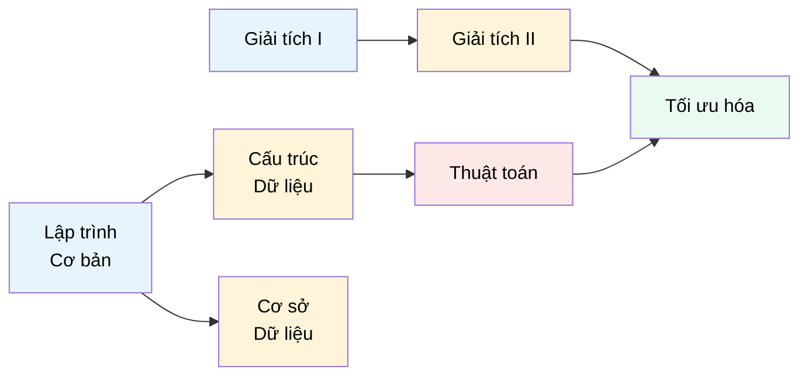

# MASTER COMPUTER SCIENCE HANDBOOK

## Volume 03 — Algorithms and Data Structures
### Part IV — Graph Algorithms
## Chương 4.3 — Sắp xếp Tô-pô
### (Topological Sorting)

---

### Thông tin chương

| Trường | Giá trị |
|---|---|
| Chương | 4.3 |
| Thuộc Part | IV — Graph Algorithms |
| Thuộc Volume | 03 — Algorithms and Data Structures |
| Thời gian đọc ước tính | 45–55 phút |
| Độ khó | ★★☆☆☆ |
| Kiến thức tiên quyết | Chương 4.2 — Graph Traversal (dùng trực tiếp DFS và khái niệm cạnh lùi); Chương 4.1 — Graph Representation |
| Chương liên quan | 4.4 — Minimum Spanning Tree (dùng Union-Find, một cấu trúc dữ liệu có tinh thần tương tự); 4.7 — Strongly Connected Components (mở rộng DFS theo hướng khác) |
| Từ khóa | topological sort, DAG, Kahn's Algorithm, in-degree, finish time, dependency resolution |

---

### Mục tiêu học tập

Sau khi hoàn thành chương này, người đọc có thể:

- Định nghĩa hình thức bài toán sắp xếp tô-pô và điều kiện tiên quyết để nó có lời giải (DAG).
- Cài đặt Sắp xếp Tô-pô bằng hai cách tiếp cận độc lập: DFS-based và Kahn's Algorithm (dựa trên in-degree).
- Giải thích mối liên hệ giữa việc phát hiện chu trình (Chương 4.2) và tính khả thi của sắp xếp tô-pô.
- Phân tích độ phức tạp thời gian của cả hai thuật toán và so sánh sự đánh đổi giữa chúng.
- Áp dụng sắp xếp tô-pô để giải các bài toán thực tế về thứ tự thực thi có ràng buộc phụ thuộc.

---

### Câu hỏi khơi gợi

> *Khi bạn chạy `npm install`, làm sao công cụ quản lý gói biết cần cài đặt package nào trước, package nào sau, khi hàng trăm package phụ thuộc chằng chịt lẫn nhau? Và làm sao một biên dịch viên (compiler) biết cần build file `.cpp` nào trước khi file khác có thể build được, khi đồ án của bạn có hàng nghìn file mã nguồn phụ thuộc nhau qua các câu lệnh `#include`?*

---

## 1. Tổng quan chương

Chương 4.2 đã trang bị hai công cụ nền tảng: BFS và DFS. Chương này giới thiệu bài toán đầu tiên **xây dựng trực tiếp** trên nền DFS đã học — không phải một thuật toán hoàn toàn mới, mà là một **cách sử dụng khác** của công cụ cũ.

**Sắp xếp Tô-pô (Topological Sorting)** giải quyết một lớp bài toán cực kỳ phổ biến trong kỹ thuật phần mềm: cho một tập hợp các công việc (task) với các ràng buộc "công việc A phải hoàn thành trước công việc B", hãy tìm một **thứ tự thực hiện hợp lệ** thỏa mãn mọi ràng buộc. Đây chính xác là bài toán đã được đặt ra ở Chương 4.1 (Mục 3) khi nói về hệ thống quản lý build phần mềm — và giờ đây, sau khi có DFS trong tay, chúng ta đã đủ công cụ để giải nó một cách hệ thống.

> **💡 Insight**
> Sắp xếp Tô-pô không phải một thuật toán "mới" theo nghĩa cấu trúc — nó chính là DFS (Chương 4.2) với đúng **một dòng bổ sung**: ghi lại đỉnh vào một danh sách kết quả **ngay khi DFS xử lý xong hoàn toàn đỉnh đó** (tức mọi đỉnh kề của nó đã được xử lý). Đây là minh chứng rõ ràng cho nguyên tắc "Concept Reuse" của Handbook: một công cụ nền tảng, dùng đúng cách, mở khóa nhiều bài toán tưởng chừng khác biệt.

---

## 2. Bối cảnh lịch sử

| Thời điểm | Nhân vật / Sự kiện | Đóng góp |
|---|---|---|
| 1962 | Arthur B. Kahn | Công bố thuật toán mang tên ông (**Kahn's Algorithm**) trong bài báo về việc sắp xếp các phần tử của một tập hợp bán thứ tự (partial order) — nền tảng trực tiếp cho cách tiếp cận dựa trên in-degree (Mục 8) |
| Thập niên 1970 | Cộng đồng phát triển Unix | `make` — một trong những công cụ build tool đầu tiên — sử dụng tư tưởng sắp xếp tô-pô để xác định thứ tự biên dịch file dựa trên Makefile, đặt nền móng cho triết lý build tool hiện đại |
| Thập niên 1990–nay | Cộng đồng quản lý gói phần mềm (Debian `apt`, Node.js `npm`, Python `pip`) | Áp dụng sắp xếp tô-pô làm thuật toán lõi để giải quyết thứ tự cài đặt package có phụ thuộc lẫn nhau |

Điều đáng chú ý là bài toán sắp xếp tô-pô, dù mang tên gọi hình thức từ thập niên 1960, đã tồn tại tự nhiên trong tư duy con người từ lâu hơn nhiều — bất kỳ ai từng lập kế hoạch nấu một bữa ăn nhiều món (sơ chế trước khi nấu, nấu trước khi bày) đều đã áp dụng trực giác sắp xếp tô-pô mà không gọi tên nó.

---

## 3. Động lực

Hãy hình dung bạn đang thiết kế một hệ thống quản lý chương trình học đại học, nơi một số môn học có **môn tiên quyết (prerequisite)**: "Giải tích II" yêu cầu đã hoàn thành "Giải tích I"; "Cấu trúc Dữ liệu" yêu cầu "Lập trình Cơ bản". Bài toán đặt ra: cho danh sách môn học và các ràng buộc tiên quyết, hãy sắp xếp một **lộ trình học** sao cho không sinh viên nào phải học một môn trước khi hoàn thành các môn tiên quyết của nó.

Đây chính xác là cấu trúc bài toán của Sắp xếp Tô-pô: mỗi môn học là một đỉnh, mỗi ràng buộc tiên quyết là một cạnh có hướng. Nếu bạn thử giải bài toán này "bằng tay" với một chương trình học lớn (hàng trăm môn), bạn sẽ nhanh chóng nhận ra cần một thuật toán có hệ thống — thử sai thủ công không thể đảm bảo tìm được thứ tự hợp lệ (hoặc phát hiện đúng khi nào **không thể** tìm được, ví dụ nếu chương trình học vô tình có một vòng phụ thuộc do lỗi nhập liệu).

---

## 4. Trực giác

**Mô hình tinh thần (Mental Model) của chương này:**

> Sắp xếp Tô-pô giống như việc **xếp hàng các chồng đĩa cần rửa theo thứ tự sử dụng ngược lại**: đĩa nào được dùng cuối cùng trong bữa ăn (không đĩa nào "đợi" nó) thì được rửa và cất đi trước; cứ thế lần lượt, cho đến khi chồng đĩa đầu tiên bạn dùng được xử lý sau cùng. Nói cách khác: xử lý các đỉnh **"không còn ai phụ thuộc"** trước, dần dần lộ ra các đỉnh có thể xử lý tiếp theo.

| Trực giác kỹ thuật bạn đã có | Khái niệm Sắp xếp Tô-pô tương ứng |
|---|---|
| `npm install` cài package phụ thuộc trước package chính | Thứ tự tô-pô của đồ thị dependency |
| Makefile biên dịch file `.o` trước khi link thành file thực thi | Thứ tự tô-pô của đồ thị build |
| Lộ trình học các môn có môn tiên quyết ở đại học | Thứ tự tô-pô của đồ thị prerequisite |
| Excel tính toán lại các ô công thức theo đúng thứ tự phụ thuộc | Thứ tự tô-pô của đồ thị công thức (formula dependency graph) |
| Docker build multi-stage theo đúng thứ tự các stage phụ thuộc | Thứ tự tô-pô của đồ thị build stage |

---

## 5. Trực quan hóa khái niệm

**Hình 4.3.1 — Đồ thị phụ thuộc môn học và một thứ tự tô-pô hợp lệ**
*(Visual đặc trưng của chương — Chapter Identity)*



```text
Một thứ tự tô-pô hợp lệ (không duy nhất!):

Lập trình Cơ bản → Giải tích I → Cấu trúc Dữ liệu →
Giải tích II → Cơ sở Dữ liệu → Thuật toán → Tối ưu hóa
```

| Trường thông tin | Nội dung |
|---|---|
| Mục đích | Minh họa bài toán "lộ trình học" đã nêu ở Mục 3, cho thấy đồ thị prerequisite là một DAG (không có chu trình) |
| Điểm mấu chốt | Thứ tự tô-pô **không duy nhất** — "Giải tích I" có thể học trước hoặc sau "Lập trình Cơ bản" (không có ràng buộc giữa chúng), miễn là mọi cạnh có hướng đều "đi từ trái sang phải" trong thứ tự cuối cùng |

---

**Hình 4.3.2 — DFS-based Topological Sort: vai trò của "finish time"**

```text
Đồ thị: A → B → D,  A → C,  C → D

DFS xuất phát từ A:
  Vào A (chưa finish)
    Vào B (chưa finish)
      Vào D (chưa finish)
      D không còn đỉnh kề chưa thăm → D FINISH (thứ 1)
    B không còn đỉnh kề chưa thăm (D đã thăm) → B FINISH (thứ 2)
    Vào C (chưa finish)
      C kề D — D đã thăm rồi → không đi tiếp
    C không còn đỉnh kề chưa thăm → C FINISH (thứ 3)
  A không còn đỉnh kề chưa thăm → A FINISH (thứ 4)

Thứ tự finish: D, B, C, A
Đảo ngược thứ tự finish → Thứ tự tô-pô: A, C, B, D
```

*Mục đích:* Cho thấy trực quan tại sao "đảo ngược thứ tự hoàn thành DFS" lại cho ra thứ tự tô-pô hợp lệ — D hoàn thành sớm nhất (không phụ thuộc gì thêm) nên phải đứng **cuối** trong kết quả đảo ngược... nhưng thực tế D lại đứng cuối trong thứ tự tô-pô vì mọi đỉnh khác đều dẫn đến D. *Điểm mấu chốt:* đỉnh hoàn thành **DFS muộn nhất** (ở đây là A) luôn không có đỉnh nào trỏ đến nó từ những đỉnh chưa xử lý — nên nó an toàn để đứng đầu tiên (chứng minh đầy đủ ở Mục 7).

---

## 6. Định nghĩa hình thức

> **📌 Remember — Sắp xếp Tô-pô (Topological Sort)**
>
> Cho một đồ thị có hướng $G = (V, E)$, một **thứ tự tô-pô** là một cách sắp xếp tuyến tính toàn bộ đỉnh của $V$ sao cho với mọi cạnh có hướng $(u, v) \in E$, đỉnh $u$ xuất hiện **trước** đỉnh $v$ trong thứ tự đó.
>
> Thứ tự tô-pô chỉ tồn tại khi và chỉ khi $G$ là một **DAG (Directed Acyclic Graph — Đồ thị có hướng không chu trình)** — đã giới thiệu sơ lược ở Chương 4.1, Hình 4.1.1.

**Vì sao chu trình khiến bài toán vô nghiệm:** giả sử tồn tại chu trình $A \to B \to C \to A$. Nếu có một thứ tự tô-pô hợp lệ, ta cần $A$ trước $B$ (từ cạnh $A \to B$), $B$ trước $C$ (từ cạnh $B \to C$), và $C$ trước $A$ (từ cạnh $C \to A$) — ba ràng buộc này mâu thuẫn lẫn nhau không thể đồng thời thỏa mãn. Đây chính là lý do **phát hiện chu trình** (Chương 4.2, Mục 6 và 9) là bước kiểm tra tiên quyết bắt buộc trước khi thực hiện sắp xếp tô-pô.

**In-degree (Bậc vào)** — đã định nghĩa ở Chương 4.1, Mục 6: số cạnh có hướng đi **vào** một đỉnh. Khái niệm này là nền tảng trực tiếp cho Kahn's Algorithm (Mục 8): một đỉnh có in-degree bằng 0 nghĩa là **không có ràng buộc tiên quyết nào chưa được thỏa mãn** — an toàn để xử lý ngay.

**Finish Time (Thời điểm hoàn thành trong DFS)** — thời điểm mà DFS xử lý xong hoàn toàn một đỉnh (mọi đỉnh kề của nó, trực tiếp hoặc gián tiếp, đã được thăm). Đây là khái niệm cốt lõi cho cách tiếp cận DFS-based (Mục 8, Hình 4.3.2).

---

## 7. Nền tảng toán học

### 7.1 Chứng minh tính đúng đắn của DFS-based Topological Sort

- **Ý nghĩa:** cần chứng minh rằng "đảo ngược thứ tự finish time của DFS" luôn cho ra một thứ tự tô-pô hợp lệ trên DAG.
- **Phát biểu cần chứng minh:** với mọi cạnh $(u, v) \in E$, đỉnh $u$ phải finish **sau** đỉnh $v$ (tức $v$ hoàn thành trước $u$).

**Chứng minh (áp dụng kỹ thuật phân tích trường hợp, tương tự Volume 01, Chương 1.4):** xét cạnh $(u,v)$. Khi DFS đang xử lý đỉnh $u$ và xét đến cạnh này, có đúng hai trường hợp:

1. **$v$ chưa được thăm.** DFS sẽ đệ quy ngay vào $v$ (theo thuật toán Chương 4.2, Mục 8), và vì $G$ không có chu trình (là DAG), lời gọi đệ quy này chắc chắn kết thúc và $v$ hoàn thành (finish) **trước khi** lời gọi DFS trên $u$ kết thúc. Vậy $v$ finish trước $u$. ✓
2. **$v$ đã được thăm trước đó.** Vì $G$ là DAG (không có cạnh lùi — theo định nghĩa cạnh lùi ở Chương 4.2, Mục 6), $v$ không thể đang "trong quá trình xử lý" trên cùng nhánh đệ quy dẫn đến chu trình; $v$ phải đã **hoàn thành hoàn toàn** trước khi DFS quay lại xét đỉnh $u$. Vậy $v$ finish trước $u$. ✓

Cả hai trường hợp đều cho $v$ finish trước $u$ — đúng như phát biểu cần chứng minh. Do đó, đảo ngược thứ tự finish time (đỉnh finish sau cùng đứng đầu) đảm bảo $u$ luôn đứng trước $v$ cho mọi cạnh $(u,v)$ — chính là định nghĩa của thứ tự tô-pô hợp lệ. $\blacksquare$

> **📦 Formula Box — Điều kiện tồn tại Thứ tự Tô-pô**
>
> $$\text{Tồn tại thứ tự tô-pô của } G \iff G \text{ là DAG (không có chu trình)}$$
>
> | Thành phần | Ý nghĩa |
> |---|---|
> | Chiều thuận | Nếu $G$ có chu trình, không tồn tại thứ tự tô-pô (chứng minh bằng mâu thuẫn ở Mục 6) |
> | Chiều nghịch | Nếu $G$ là DAG, luôn tồn tại ít nhất một thứ tự tô-pô — chính DFS-based algorithm là **bằng chứng mang tính xây dựng (constructive proof)** cho điều này, vì nó luôn tạo ra được một thứ tự hợp lệ |
> | **Ứng dụng thường gặp** | Kiểm tra tính khả thi của một hệ thống ràng buộc phụ thuộc (build system, course prerequisite, task scheduler) trước khi cố tìm lời giải |

---

## 8. Thuật toán / Cơ chế

**Cách 1 — DFS-based Topological Sort:**

```text
Bước 1 — Khởi tạo danh sách kết quả result rỗng, tập visited rỗng
        │
        ▼
Bước 2 — Với mỗi đỉnh v trong đồ thị (đảm bảo phủ hết mọi thành phần):
        │
        ▼
Bước 3 —   Nếu v chưa visited: gọi DFS_Visit(v)
        │
        ▼
Hàm DFS_Visit(u):
        │
        ▼
Bước 4 —   Đánh dấu u là visited
        │
        ▼
Bước 5 —   Với mỗi đỉnh w kề với u:
        │
        ▼
Bước 6 —     Nếu w chưa visited: gọi đệ quy DFS_Visit(w)
        │
        ▼
Bước 7 —   Sau khi xét hết đỉnh kề (u đã "finish"):
             chèn u vào ĐẦU danh sách result
        │
        ▼
Bước 8 — Sau khi duyệt hết mọi đỉnh, result chính là thứ tự tô-pô
```

**Cách 2 — Kahn's Algorithm (dựa trên in-degree):**

```text
Bước 1 — Tính in-degree của mọi đỉnh trong đồ thị
        │
        ▼
Bước 2 — Khởi tạo Queue chứa mọi đỉnh có in-degree = 0
        │
        ▼
Bước 3 — Khởi tạo danh sách kết quả result rỗng
        │
        ▼
Bước 4 — Trong khi Queue không rỗng:
        │
        ▼
Bước 5 —   Lấy đỉnh u ra khỏi Queue, thêm u vào result
        │
        ▼
Bước 6 —   Với mỗi đỉnh v kề với u (u → v):
        │
        ▼
Bước 7 —     Giảm in-degree của v đi 1
             (nghĩa là: một ràng buộc tiên quyết của v vừa được thỏa mãn)
        │
        ▼
Bước 8 —     Nếu in-degree của v trở thành 0: thêm v vào Queue
        │
        ▼
Bước 9 — Nếu |result| < |V| sau khi Queue rỗng: đồ thị CÓ CHU TRÌNH
           (một số đỉnh không bao giờ đạt in-degree 0)
```

> **💡 Insight**
> Kahn's Algorithm có một ưu điểm tinh tế mà DFS-based không có: nó **tự động phát hiện chu trình** như một hệ quả tự nhiên của thuật toán (Bước 9), không cần một lượt kiểm tra riêng biệt như `has_cycle_undirected` ở Chương 4.2. Đây là lý do nhiều thư viện thực tế (ví dụ trình giải quyết dependency của `npm`) ưu tiên cách tiếp cận này.

---

## 9. Triển khai

```python
from collections import deque

class Graph:
    """Kế thừa từ Chương 4.1–4.2 — bổ sung Sắp xếp Tô-pô."""

    def __init__(self, num_vertices, directed=True):
        self.num_vertices = num_vertices
        self.directed = directed
        self.adj = {v: [] for v in range(num_vertices)}

    def add_edge(self, u, v):
        self.adj[u].append(v)
        if not self.directed:
            self.adj[v].append(u)

    def topological_sort_dfs(self):
        """Cách 1: DFS-based — trả về None nếu đồ thị có chu trình."""
        visited = set()
        in_progress = set()   # Đỉnh đang nằm trên nhánh đệ quy hiện tại
        result = []
        has_cycle = [False]   # Dùng list để có thể sửa trong closure

        def dfs_visit(u):
            visited.add(u)
            in_progress.add(u)
            for v in self.adj[u]:
                if v in in_progress:
                    has_cycle[0] = True     # Phát hiện cạnh lùi thực sự
                    return
                if v not in visited:
                    dfs_visit(v)
            in_progress.discard(u)
            result.insert(0, u)             # Chèn vào ĐẦU — Bước 7

        for vertex in range(self.num_vertices):
            if vertex not in visited:
                dfs_visit(vertex)
            if has_cycle[0]:
                return None                  # Không tồn tại thứ tự tô-pô

        return result

    def topological_sort_kahn(self):
        """Cách 2: Kahn's Algorithm — trả về None nếu đồ thị có chu trình."""
        in_degree = {v: 0 for v in range(self.num_vertices)}
        for u in self.adj:
            for v in self.adj[u]:
                in_degree[v] += 1

        queue = deque([v for v in in_degree if in_degree[v] == 0])
        result = []

        while queue:
            u = queue.popleft()
            result.append(u)
            for v in self.adj[u]:
                in_degree[v] -= 1
                if in_degree[v] == 0:
                    queue.append(v)

        if len(result) < self.num_vertices:
            return None                      # Bước 9 — phát hiện chu trình
        return result
```

Hàm `topological_sort_dfs` triển khai chính xác thuật toán ở Mục 8, với một cải tiến quan trọng: thay vì chỉ kiểm tra "đã visited" như DFS thông thường ở Chương 4.2, nó phân biệt thêm trạng thái `in_progress` (đỉnh đang trên nhánh đệ quy hiện tại) để phát hiện chính xác chu trình trên đồ thị **có hướng** — đây chính là lời giải cho Bài tập 7 của Chương 4.2. Hàm `topological_sort_kahn` triển khai đúng quy trình dựa trên hàng đợi các đỉnh in-degree bằng 0.

---

## 10. Trực quan hóa quá trình thực thi

**Chạy cả hai thuật toán trên đồ thị Hình 4.3.2** (cạnh: A→B, A→C, B→D, C→D):

```text
>>> g = Graph(4, directed=True)
>>> vertices = {'A':0, 'B':1, 'C':2, 'D':3}
>>> for u, v in [('A','B'), ('A','C'), ('B','D'), ('C','D')]:
...     g.add_edge(vertices[u], vertices[v])

>>> g.topological_sort_dfs()
[0, 2, 1, 3]        # A, C, B, D — khớp với Hình 4.3.2

>>> g.topological_sort_kahn()
[0, 1, 2, 3]        # A, B, C, D — cũng hợp lệ, khác thứ tự!
```

Cả hai kết quả `[A, C, B, D]` và `[A, B, C, D]` đều là thứ tự tô-pô **hợp lệ** — kiểm tra: trong cả hai, A luôn đứng trước B và C; B và C đều đứng trước D. Điều này minh chứng trực tiếp cho nhận xét ở Hình 4.3.1: **thứ tự tô-pô không duy nhất**, hai thuật toán khác nhau (thậm chí cùng một thuật toán với thứ tự duyệt đỉnh ban đầu khác nhau) có thể cho ra các kết quả khác nhau nhưng đều đúng.

**Kiểm tra phát hiện chu trình** trên đồ thị có chu trình ($A \to B \to C \to A$):

```text
>>> g2 = Graph(3, directed=True)
>>> for u, v in [(0,1), (1,2), (2,0)]:
...     g2.add_edge(u, v)

>>> g2.topological_sort_dfs()
None

>>> g2.topological_sort_kahn()
None
```

Cả hai thuật toán đều chính xác trả về `None`, khớp với chứng minh ở Mục 6 và 7.1: đồ thị có chu trình không có thứ tự tô-pô.

---

## 11. Ứng dụng công nghiệp

> **🛠 Engineering Practice**
> Sắp xếp Tô-pô là một trong những thuật toán đồ thị được ứng dụng trực tiếp nhiều nhất trong công cụ phát triển phần mềm hằng ngày.

| Bối cảnh công nghiệp | Vai trò của Sắp xếp Tô-pô |
|---|---|
| `npm install`, `pip install`, `apt install` | Xác định thứ tự cài đặt các package sao cho mọi dependency được cài trước package phụ thuộc nó |
| Build system (`make`, Bazel, Webpack module bundler) | Xác định thứ tự biên dịch/đóng gói các module dựa trên đồ thị `import`/`#include` |
| Trình lập lịch tác vụ (Task Scheduler) trong CI/CD pipeline (GitHub Actions, Jenkins) | Xác định thứ tự chạy các job khi có khai báo `needs`/`depends_on` giữa chúng |
| Bảng tính (Excel, Google Sheets) | Tính toán lại các ô công thức theo đúng thứ tự phụ thuộc khi một ô đầu vào thay đổi |
| Hệ thống gợi ý lộ trình học (Coursera, các nền tảng MOOC) | Sắp xếp thứ tự khóa học dựa trên ràng buộc kiến thức tiên quyết — đúng bài toán đã nêu ở Mục 3 |

---

## 12. Góc nhìn nghiên cứu

> **🔬 Research Connection**
> Sắp xếp Tô-pô cơ bản giải quyết bài toán tĩnh (đồ thị cố định), nhưng nhiều hệ thống thực tế cần xử lý các biến thể động và phức tạp hơn — đây vẫn là chủ đề được nghiên cứu và cải tiến liên tục.

- **Dynamic Topological Sort** — duy trì một thứ tự tô-pô hợp lệ khi đồ thị liên tục thay đổi (thêm/xóa cạnh theo thời gian thực), quan trọng cho các hệ thống build tool tăng trưởng (incremental build systems) như Bazel hay Buck, nơi việc tính lại toàn bộ thứ tự tô-pô từ đầu sau mỗi thay đổi nhỏ là quá tốn kém.
- **Parallel Task Scheduling với ràng buộc tô-pô** — khi các đỉnh (task) có thể chạy song song miễn là thứ tự tô-pô được tôn trọng, bài toán mở rộng thành: làm sao lập lịch để tối thiểu hóa tổng thời gian hoàn thành, với số luồng xử lý giới hạn? Đây là một bài toán tối ưu hóa tổ hợp (combinatorial optimization) khó hơn nhiều so với chỉ tìm **một** thứ tự tô-pô hợp lệ.

**Câu hỏi mở** để suy ngẫm: nếu một hệ thống build có 10.000 file, và bạn có 8 nhân xử lý (CPU cores) để build song song, thứ tự tô-pô đơn thuần (Mục 8) có đủ để tận dụng tối đa 8 nhân đó không, hay cần thêm thông tin gì khác? Gợi ý: hãy nghĩ về việc các đỉnh có cùng "lớp" theo BFS (Chương 4.2) có thể là ứng viên tốt để chạy song song — đây là nền tảng trực giác cho các thuật toán lập lịch song song hiện đại.

---

## 13. Ưu điểm

- Cả hai thuật toán đều đạt độ phức tạp thời gian tối ưu $O(V+E)$, tận dụng trực tiếp nền tảng đã học ở Chương 4.2.
- Kahn's Algorithm phát hiện chu trình như một hệ quả tự nhiên của thuật toán, không cần bước kiểm tra riêng.
- DFS-based Topological Sort tận dụng trực tiếp code DFS đã có sẵn từ Chương 4.2, chỉ cần thêm một dòng logic — minh chứng cho nguyên tắc tái sử dụng kiến thức của Handbook.
- Bài toán có ứng dụng công nghiệp cực kỳ rộng rãi (Mục 11), khiến đây là một trong những thuật toán đồ thị "đáng đầu tư hiểu sâu" nhất trong toàn Part IV.

---

## 14. Hạn chế

> **⚠️ Common Mistake**
> Lỗi phổ biến nhất khi cài đặt DFS-based Topological Sort là **nhầm lẫn giữa "đã visited" và "đang xử lý" (in-progress)** — như đã thấy ở Mục 9, chỉ kiểm tra `visited` (giống DFS thông thường Chương 4.2) sẽ **không phát hiện được chu trình trên đồ thị có hướng**, vì một đỉnh có thể "đã visited" (đã hoàn thành từ nhánh khác) mà không tạo thành chu trình. Cần phân biệt rõ ba trạng thái: chưa thăm, đang xử lý (on the current recursion stack), và đã hoàn thành.

- Sắp xếp Tô-pô **chỉ áp dụng cho đồ thị có hướng** — khái niệm "trước/sau" không có ý nghĩa trên đồ thị vô hướng.
- Thứ tự tô-pô **không duy nhất** (Mục 10) — nếu bài toán thực tế cần một thứ tự "tối ưu" theo tiêu chí nào đó (ví dụ: ưu tiên alphabet, hoặc tối thiểu thời gian hoàn thành khi chạy song song), cần thuật toán chuyên biệt hơn (Mục 12).
- Cả hai thuật toán đều yêu cầu biết trước **toàn bộ** đồ thị — không phù hợp trực tiếp cho các hệ thống mà ràng buộc phụ thuộc được phát hiện dần trong quá trình chạy (cần biến thể động, Mục 12).

---

## 15. So sánh

**Bảng 4.3.1 — So sánh DFS-based và Kahn's Algorithm**

| Tiêu chí | DFS-based | Kahn's Algorithm |
|---|---|---|
| Cấu trúc dữ liệu chính | Đệ quy (call stack) | Queue |
| Độ phức tạp thời gian | $O(V+E)$ | $O(V+E)$ |
| Phát hiện chu trình | Cần bước bổ sung (theo dõi `in_progress`) | Tự động, là hệ quả trực tiếp của thuật toán |
| Cách xây dựng kết quả | Chèn vào đầu danh sách theo finish time đảo ngược | Thêm vào cuối danh sách khi in-degree về 0 |
| Trực giác chính | "Xử lý xong hoàn toàn một nhánh trước khi ghi nhận" | "Xử lý các đỉnh không còn ràng buộc nào trước" |
| Phù hợp mở rộng song song hóa | Khó hơn (bản chất tuần tự của đệ quy) | Tự nhiên hơn (mọi đỉnh trong Queue tại một thời điểm có thể xử lý song song) |

**Phân tích:** Cả hai thuật toán có cùng độ phức tạp lý thuyết, nhưng khác biệt về **trực giác** và **tính chất phụ trợ**. Kahn's Algorithm thường được ưa chuộng trong thực tế công nghiệp (Mục 11) vì hai lý do: (1) phát hiện chu trình tự nhiên mà không cần logic bổ sung dễ gây lỗi như đã cảnh báo ở Mục 14, và (2) cấu trúc dựa trên Queue "mọi đỉnh in-degree = 0 tại một thời điểm" gợi ý trực tiếp cách song song hóa — các đỉnh trong cùng một "lớp" của Queue có thể xử lý đồng thời, một tính chất khai thác trực tiếp bởi các build system hiện đại như Bazel. DFS-based, ngược lại, thường được ưa chuộng khi code đã có sẵn hạ tầng DFS (như trong Handbook này, kế thừa trực tiếp từ Chương 4.2) và khi không cần song song hóa.

---

## 16. Tóm tắt

- **Sắp xếp Tô-pô** tìm một thứ tự tuyến tính các đỉnh sao cho mọi cạnh có hướng đều "đi từ trước ra sau" — chỉ tồn tại khi đồ thị là **DAG**.
- **DFS-based Topological Sort** là DFS (Chương 4.2) với một bổ sung duy nhất: chèn đỉnh vào đầu kết quả khi nó "finish" — chứng minh đúng đắn dựa trên phân tích hai trường hợp của mỗi cạnh (Mục 7.1).
- **Kahn's Algorithm** xử lý các đỉnh có in-degree bằng 0 trước, giảm dần in-degree của các đỉnh kề — tự động phát hiện chu trình nếu không xử lý hết được mọi đỉnh.
- Cả hai thuật toán đạt độ phức tạp $O(V+E)$; lựa chọn giữa chúng phụ thuộc vào việc có cần phát hiện chu trình tự nhiên hay có ý định song song hóa (Bảng 4.3.1).
- Thứ tự tô-pô **không duy nhất** — nhiều thứ tự hợp lệ có thể cùng tồn tại cho một đồ thị.

Chương 4.4 (Minimum Spanning Tree) sẽ chuyển hướng sang một lớp bài toán khác trên đồ thị có trọng số — không còn về thứ tự, mà về việc chọn một tập con cạnh tối ưu — giới thiệu cấu trúc dữ liệu Union-Find mới, khác với DFS/BFS đã dùng xuyên suốt từ Chương 4.2 đến 4.3.

---

## 17. Bài tập

### Mức Cơ bản (Basic)

1. Cho đồ thị có hướng với cạnh $\{(1,2), (1,3), (2,4), (3,4)\}$. Liệt kê **tất cả** các thứ tự tô-pô hợp lệ có thể có (gợi ý: không chỉ có một).
2. Cho đồ thị có hướng với cạnh $\{(A,B), (B,C), (C,A)\}$. Giải thích bằng lời tại sao đồ thị này không có thứ tự tô-pô, dựa trên lập luận mâu thuẫn ở Mục 6.
3. Với đồ thị ở Bài 1, tính in-degree của từng đỉnh và mô phỏng thủ công (trên giấy) các bước của Kahn's Algorithm.

### Mức Trung bình (Intermediate)

4. Áp dụng bài toán "lộ trình học đại học" ở Mục 3: cho danh sách môn học và ràng buộc tiên quyết dưới dạng Edge List, viết chương trình đọc dữ liệu, xây dựng đồ thị (dùng lớp `Graph` từ Chương 4.1), và in ra một lộ trình học hợp lệ bằng cả hai thuật toán ở Mục 9. So sánh hai kết quả.
5. Sửa đổi `topological_sort_kahn` ở Mục 9 để khi có nhiều đỉnh cùng in-degree bằng 0 tại một thời điểm, luôn ưu tiên đỉnh có chỉ số nhỏ nhất trước (dùng cấu trúc dữ liệu Heap thay vì Queue thông thường — ôn lại Heap từ Volume 03, Part II). Giải thích tại sao thay đổi này hữu ích khi cần một thứ tự tô-pô "xác định" (deterministic) thay vì phụ thuộc thứ tự duyệt ngẫu nhiên.

### Mức Nâng cao (Advanced)

6. Chứng minh rằng nếu một DAG có đúng một thứ tự tô-pô duy nhất, thì đồ thị đó phải chứa một **đường đi Hamilton** (đường đi đi qua mọi đỉnh đúng một lần). *(Gợi ý: chứng minh theo hướng phản chứng — giả sử có hai đỉnh liên tiếp trong thứ tự tô-pô mà không có cạnh trực tiếp giữa chúng, hãy chỉ ra rằng có thể hoán đổi để tạo ra một thứ tự tô-pô khác.)*
7. Thiết kế một biến thể của Kahn's Algorithm trả về **số lượng thứ tự tô-pô khác nhau** có thể có cho một DAG cho trước (không cần liệt kê hết, chỉ cần đếm). Phân tích độ phức tạp của cách tiếp cận bạn đề xuất — đây là một bài toán khó hơn đáng kể so với chỉ tìm một thứ tự.

### Mức Nghiên cứu (Research)

8. Tìm hiểu về bài toán **Parallel Task Scheduling with Precedence Constraints** được nhắc đến ở Mục 12. Đây là một bài toán NP-khó (NP-hard) trong trường hợp tổng quát khi có ràng buộc về số luồng xử lý giới hạn — tìm đọc thêm về các thuật toán xấp xỉ (approximation algorithms) được dùng trong thực tế cho bài toán này.

---

## 18. Dự án nhỏ

**Dự án: "Trình phát hiện Circular Dependency cho hệ thống Module"**

**Mục tiêu:** Mở rộng trực tiếp dự án "Module Dependency Analyzer" đã bắt đầu ở Chương 4.1 (Mục 18), bổ sung khả năng phát hiện vòng phụ thuộc và đề xuất thứ tự build hợp lệ.

**Yêu cầu:**
- Tái sử dụng phần đọc dữ liệu Edge List và xây dựng `Graph` từ Chương 4.1.
- Áp dụng `topological_sort_kahn` để tìm thứ tự build hợp lệ.
- Nếu phát hiện chu trình (kết quả `None`), in ra rõ ràng **các module nào** đang nằm trong vòng phụ thuộc — không chỉ báo "có lỗi" một cách chung chung. *(Gợi ý: các đỉnh không bao giờ đạt in-degree 0 sau khi Queue rỗng chính là các đỉnh nằm trong hoặc phụ thuộc vào chu trình.)*
- (Mở rộng) Nếu không có chu trình, in ra thứ tự build kèm theo "lớp song song hóa" — các module có thể build đồng thời ở mỗi bước (dựa trên gợi ý ở Mục 12).

**Công nghệ đề xuất:** Python, có thể mở rộng đọc trực tiếp từ `package.json`/`requirements.txt` thực tế cho một dự án nhỏ (nâng cao, tùy chọn).

**Kết quả kỳ vọng:** Một công cụ CLI hữu ích thực sự, có thể áp dụng để kiểm tra circular import trong một dự án Python/JavaScript thật.

---

## 19. Tự đánh giá

- [ ] Tôi có thể giải thích bằng lời tại sao Sắp xếp Tô-pô chỉ tồn tại trên DAG, dựa trên lập luận mâu thuẫn với chu trình (Mục 6).
- [ ] Tôi hiểu và có thể trình bày lại chứng minh ở Mục 7.1 (tại sao đảo ngược finish time của DFS cho ra thứ tự tô-pô hợp lệ) bằng ngôn ngữ của riêng mình.
- [ ] Tôi có thể tự tay cài đặt cả hai thuật toán (DFS-based và Kahn's) mà không cần nhìn lại code mẫu.
- [ ] Tôi hiểu điểm khác biệt cốt lõi giữa việc theo dõi `visited` (DFS thông thường, Chương 4.2) và `in_progress` (cần thiết cho phát hiện chu trình có hướng, Mục 9) — và có thể giải thích tại sao sự phân biệt này quan trọng.
- [ ] Tôi có thể nhận diện được một bài toán thực tế mới có thể mô hình hóa thành Sắp xếp Tô-pô hay không, chỉ dựa trên việc bài toán đó có "ràng buộc thứ tự/tiên quyết" hay không.

Nếu Bài tập 6 (chứng minh về đường đi Hamilton) vẫn còn khó, đây là dấu hiệu tốt — bài tập này mang tính thách thức cao và không kỳ vọng mọi người đọc giải được trong lần thử đầu tiên; hãy thử quay lại sau khi hoàn thành Chương 4.4.

---

## 20. Đọc thêm

- **Sách:** Cormen, Leiserson, Rivest, Stein, *Introduction to Algorithms (CLRS)*, Chương "Elementary Graph Algorithms" — phần Topological Sort. *(Xem BOOKS.md — Tier S, Volume 3.)*
- **Bài báo:** A. B. Kahn (1962), "Topological sorting of large networks" — bài báo gốc giới thiệu thuật toán được nhắc ở Mục 2.
- **Chủ đề mở rộng (không bắt buộc):** tìm đọc về cách công cụ `make` sử dụng sắp xếp tô-pô để xác định thứ tự biên dịch dựa trên Makefile — một trong những ứng dụng công nghiệp lâu đời nhất của thuật toán này.
- **Chương tiếp theo:** Chương 4.4 — Minimum Spanning Tree.

---

### Liên kết chương (Cross References)

- **Chương trước:** 4.2 — Graph Traversal (DFS là nền tảng trực tiếp cho Cách 1 ở Mục 8–9; khái niệm cạnh lùi được mở rộng thành phân biệt ba trạng thái đỉnh).
- **Chương tiếp theo:** 4.4 — Minimum Spanning Tree (chuyển sang bài toán tối ưu trên đồ thị có trọng số, giới thiệu Union-Find).
- **Chương liên quan xa hơn:** 4.7 — Strongly Connected Components (một mở rộng khác của DFS, giải bài toán khác biệt); Volume 08 — Master's Thesis (lập lịch công việc nghiên cứu với ràng buộc phụ thuộc, một ứng dụng gián tiếp của tư duy tô-pô).
- **Vị trí trong Knowledge Graph:** Nút thứ ba của Part IV, phụ thuộc trực tiếp vào Chương 4.2 (DFS); độc lập tương đối với Chương 4.4–4.7 (không phải điều kiện tiên quyết bắt buộc, nhưng củng cố tư duy "tái sử dụng công cụ nền tảng cho bài toán mới" xuyên suốt Part.

---

*Hết Chương 4.3. Chương này tuân thủ đầy đủ cấu trúc 20 mục của `OUTPUT.md` và chuẩn Presentation Layer của `WRITING_STANDARD.md`, tiếp nối trực tiếp Chương 4.1–4.2 của Part IV — Graph Algorithms. Toàn bộ ví dụ về DFS-based Topological Sort và Kahn's Algorithm đều được minh họa bằng code Python có thể chạy thực tế, kế thừa cấu trúc `Graph` đã giới thiệu ở các chương trước. Đang chờ rà soát trước khi tiếp tục sang Chương 4.4 — Minimum Spanning Tree.*
