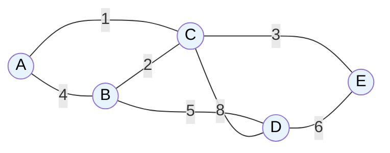

# MASTER COMPUTER SCIENCE HANDBOOK

## Volume 03 — Algorithms and Data Structures
### Part IV — Graph Algorithms
## Chương 4.4 — Cây khung nhỏ nhất
### (Minimum Spanning Tree)

---

### Thông tin chương

| Trường | Giá trị |
|---|---|
| Chương | 4.4 |
| Thuộc Part | IV — Graph Algorithms |
| Thuộc Volume | 03 — Algorithms and Data Structures |
| Thời gian đọc ước tính | 55–65 phút |
| Độ khó | ★★★☆☆ |
| Kiến thức tiên quyết | Chương 4.1 — Graph Representation; Volume 03, Part II — Union-Find (Disjoint Set), Heap; Volume 03, Part III — Greedy Algorithms (tư duy tham lam) |
| Chương liên quan | 4.5 — Shortest Paths (Prim và Dijkstra chia sẻ cùng một "khung" thuật toán); 4.6 — Maximum Flow (một bài toán tối ưu khác trên đồ thị có trọng số) |
| Từ khóa | Minimum Spanning Tree, Kruskal's Algorithm, Prim's Algorithm, Union-Find, Disjoint Set, cut property, greedy algorithm |

---

### Mục tiêu học tập

Sau khi hoàn thành chương này, người đọc có thể:

- Định nghĩa hình thức bài toán Cây khung nhỏ nhất và giải thích tại sao nó chỉ có nghĩa trên đồ thị liên thông, có trọng số.
- Cài đặt thuật toán Kruskal dùng cấu trúc dữ liệu Union-Find (Disjoint Set).
- Cài đặt thuật toán Prim dùng Priority Queue (Min-Heap).
- Giải thích và áp dụng **Cut Property** để chứng minh tính đúng đắn của cả hai thuật toán tham lam.
- So sánh sự đánh đổi giữa Kruskal và Prim tùy theo mật độ của đồ thị (thưa hay dày đặc).

---

### Câu hỏi khơi gợi

> *Một công ty viễn thông cần kéo cáp quang để kết nối 50 thành phố với chi phí thấp nhất, sao cho từ bất kỳ thành phố nào cũng có thể liên lạc được với mọi thành phố khác (trực tiếp hoặc gián tiếp qua các thành phố trung gian). Không cần kết nối trực tiếp mọi cặp thành phố — chỉ cần đảm bảo toàn mạng liên thông. Làm sao chọn được đúng tập hợp các đoạn cáp cần kéo để tổng chi phí là nhỏ nhất, trong hàng triệu tổ hợp có thể?*

---

## 1. Tổng quan chương

Ba chương đầu tiên của Part IV (4.1–4.3) đều xoay quanh câu hỏi **"đến được hay không"** và **"theo thứ tự nào"**: biểu diễn đồ thị, duyệt đồ thị, sắp xếp thứ tự phụ thuộc. Chương này chuyển sang một loại câu hỏi hoàn toàn khác, mang tính **tối ưu hóa (optimization)**: trong số rất nhiều cách kết nối mọi đỉnh của một đồ thị có trọng số, cách nào có **tổng chi phí nhỏ nhất**?

Đây là bài toán **Cây khung nhỏ nhất (Minimum Spanning Tree — MST)** — một trong những bài toán tối ưu tổ hợp kinh điển và được nghiên cứu kỹ lưỡng nhất trong Khoa học Máy tính. Điều làm MST trở nên đặc biệt thú vị về mặt giáo dục là: mặc dù không gian tìm kiếm (search space) của bài toán lớn đến mức không thể liệt kê hết bằng brute force cho đồ thị lớn, **cả hai thuật toán kinh điển giải nó (Kruskal và Prim) đều là thuật toán tham lam (greedy algorithm) đơn giản đến bất ngờ** — và quan trọng hơn, tính đúng đắn của chúng có thể được chứng minh chặt chẽ bằng một nguyên lý duy nhất: **Cut Property** (Mục 7).

> **💡 Insight**
> MST là chương đầu tiên trong Part IV giới thiệu một cấu trúc dữ liệu hoàn toàn mới: **Union-Find (Disjoint Set)**. Nếu BFS/DFS (Chương 4.2) trả lời câu hỏi "từ A có đến được B không", thì Union-Find trả lời một câu hỏi tương tự nhưng được tối ưu hóa cực độ cho một tình huống cụ thể: "hai đỉnh này có đang thuộc cùng một nhóm liên thông hay không" — được hỏi lặp đi lặp lại hàng nghìn lần trong khi đồ thị dần được xây dựng thêm cạnh.

---

## 2. Bối cảnh lịch sử

| Thời điểm | Nhân vật / Sự kiện | Đóng góp |
|---|---|---|
| 1926 | Otakar Borůvka | Công bố thuật toán MST đầu tiên được ghi nhận trong lịch sử, trong bối cảnh thiết kế mạng lưới điện hiệu quả tại Moravia (nay thuộc Cộng hòa Séc) — sớm hơn cả Kruskal và Prim hàng thập kỷ |
| 1956 | Joseph Kruskal | Công bố thuật toán mang tên ông, độc lập tái khám phá và hình thức hóa ý tưởng của Borůvka theo một cách tiếp cận khác (dựa trên sắp xếp cạnh) |
| 1957 | Robert C. Prim | Công bố thuật toán mang tên ông, với cách tiếp cận "phát triển dần từ một đỉnh" — độc lập với Kruskal dù giải cùng một bài toán |
| 1930 (tái khám phá 1959) | Vojtěch Jarník | Thực tế đã mô tả ý tưởng tương tự thuật toán Prim từ năm 1930, nhưng công trình ít được biết đến rộng rãi cho đến khi Prim công bố độc lập gần 30 năm sau — vì lý do này, thuật toán đôi khi được gọi là **Prim–Jarník Algorithm** |

Câu chuyện lịch sử của MST là một minh chứng thú vị cho hiện tượng **đa khám phá độc lập (multiple independent discovery)** trong khoa học: cùng một bài toán, cùng những ý tưởng cốt lõi, được phát hiện lại nhiều lần bởi các nhà nghiên cứu không biết đến công trình của nhau, cách nhau hàng chục năm và ở các bối cảnh ứng dụng khác nhau (mạng điện, mạng viễn thông). Điều này gợi ý rằng cấu trúc tham lam của bài toán MST có một sự "tự nhiên" nhất định — một khi bạn hiểu đúng bản chất bài toán, lời giải tham lam gần như hiện ra một cách hiển nhiên.

---

## 3. Động lực

Câu hỏi khơi gợi đã nêu chính xác động lực thực tế: bài toán kéo cáp quang kết nối 50 thành phố. Giả sử công ty viễn thông có sẵn ước tính chi phí kéo cáp cho **mọi cặp thành phố** (một số cặp rất đắt vì địa hình khó khăn, một số rẻ vì gần nhau). Số cách chọn tập con cạnh để tạo thành một mạng liên thông là cực lớn — với 50 thành phố, số cây khung có thể có lên đến $50^{48}$ theo Công thức Cayley (một kết quả tổ hợp nổi tiếng, nằm ngoài phạm vi chương này). Thử toàn bộ các phương án bằng brute force là hoàn toàn bất khả thi.

Đây chính xác là tình huống MST giải quyết: trong số toàn bộ cây khung (spanning tree) có thể có của một đồ thị, MST là cây khung có **tổng trọng số cạnh nhỏ nhất**. Điều đáng kinh ngạc, và cũng là chủ đề chính của chương này, là bài toán tưởng chừng cần tìm kiếm trong không gian tổ hợp khổng lồ này lại có lời giải bằng một thuật toán tham lam đơn giản, chạy trong thời gian gần tuyến tính.

---

## 4. Trực giác

**Mô hình tinh thần (Mental Model) của chương này:**

> **Kruskal** giống như việc bạn có một danh sách tất cả các đoạn cáp tiềm năng, sắp xếp theo giá từ rẻ nhất đến đắt nhất, rồi lần lượt mua từng đoạn **rẻ nhất còn lại**, miễn là nó không tạo thành một vòng lặp thừa (kết nối hai thành phố đã liên thông với nhau rồi). **Prim** giống như việc bạn bắt đầu từ một thành phố, rồi liên tục "vươn cánh tay" ra mua đoạn cáp rẻ nhất **nối trực tiếp** từ mạng lưới hiện tại đến một thành phố mới chưa được kết nối.

| Trực giác kỹ thuật bạn đã có | Khái niệm MST tương ứng |
|---|---|
| Mua sắm theo chiến lược "món rẻ nhất trước, miễn còn cần thiết" | Chiến lược tham lam của Kruskal |
| Phát triển một mạng nội bộ công ty (LAN) dần dần từ trụ sở chính, luôn nối máy chủ mới rẻ nhất | Chiến lược "phát triển từ một điểm" của Prim |
| `find()` và `union()` để kiểm tra hai nhóm bạn bè có "chung một cộng đồng" chưa | Union-Find — cấu trúc dữ liệu nền tảng của Kruskal |
| Priority Queue trong hệ thống xử lý tác vụ theo độ ưu tiên | Min-Heap — cấu trúc dữ liệu nền tảng của Prim |

---

## 5. Trực quan hóa khái niệm

**Hình 4.4.1 — Một đồ thị có trọng số và Cây khung nhỏ nhất của nó**
*(Visual đặc trưng của chương — Chapter Identity)*



```text
Đồ thị gốc: 7 cạnh, tổng trọng số nếu chọn tất cả = 4+1+2+5+8+3+6 = 29

Cây khung nhỏ nhất (MST):
  A–C (1), B–C (2), C–E (3), B–D (5)
  Tổng trọng số MST = 1 + 2 + 3 + 5 = 11

  (Cạnh A–B, C–D, D–E bị loại — không cần thiết để giữ liên thông
   với chi phí thấp nhất)
```

| Trường thông tin | Nội dung |
|---|---|
| Mục đích | Cho thấy trực quan: MST không nhất thiết chứa cạnh có trọng số nhỏ nhất từ mỗi đỉnh, mà tối ưu hóa **tổng thể toàn cục** |
| Điểm mấu chốt | MST của một đồ thị có $n$ đỉnh luôn có đúng $n-1$ cạnh (tính chất của cây — Tree, đã học ở Volume 03 Part II) — ở đây $5$ đỉnh nên MST có đúng $4$ cạnh |

---

**Hình 4.4.2 — Cut Property: nền tảng chứng minh chung cho cả Kruskal và Prim**

```text
Chia đỉnh thành 2 nhóm (một "cut" của đồ thị):
   Nhóm 1: {A, C}          Nhóm 2: {B, D, E}

   Các cạnh "băng qua" cut này: A–B (4), C–B (2), C–D (8), C–E (3)
   
   Cạnh nhẹ nhất băng qua cut: C–B (trọng số 2)
   
   → Cut Property khẳng định: C–B CHẮC CHẮN thuộc về MST
     (không cần xét thêm — luôn đúng cho MỌI cách chia cut)
```

*Mục đích:* Minh họa trực quan nguyên lý sẽ được dùng để chứng minh tính đúng đắn của cả Kruskal lẫn Prim ở Mục 7 — một "lát cắt" (cut) bất kỳ chia đỉnh thành hai nhóm, và cạnh nhẹ nhất băng qua lát cắt đó luôn an toàn để đưa vào MST. *Điểm mấu chốt:* đây là nguyên lý **duy nhất** đủ để chứng minh cả hai thuật toán tưởng chừng khác nhau hoàn toàn về cách tiếp cận.

---

## 6. Định nghĩa hình thức

> **📌 Remember — Cây khung (Spanning Tree)**
>
> Cho đồ thị vô hướng liên thông $G = (V, E)$, một **cây khung (spanning tree)** $T$ là một cây con của $G$ (tức $T \subseteq E$, không có chu trình) sao cho $T$ chứa **tất cả** các đỉnh của $V$. Theo tính chất của cây đã học ở Volume 03, Part II, mọi cây khung của đồ thị $n$ đỉnh luôn có đúng $n - 1$ cạnh.
>
> **Cây khung nhỏ nhất (Minimum Spanning Tree — MST)** là cây khung $T$ có **tổng trọng số cạnh nhỏ nhất** trong số mọi cây khung có thể có của $G$:
>
> $$T^* = \arg\min_{T \text{ là cây khung của } G} \sum_{(u,v) \in T} w(u,v)$$

**Điều kiện tồn tại:** MST chỉ được định nghĩa có nghĩa trên đồ thị **liên thông** (connected) — nếu đồ thị có nhiều thành phần liên thông tách rời (Chương 4.2, Mục 6), không tồn tại cây khung nào chứa hết mọi đỉnh; khi đó ta nói đến **Minimum Spanning Forest** (rừng khung nhỏ nhất) — mỗi thành phần liên thông có MST riêng.

**Cut (Lát cắt)** — một cách chia tập đỉnh $V$ thành hai tập con không rỗng, rời nhau $(S, V \setminus S)$. Một cạnh $(u,v)$ được gọi là **băng qua (crossing)** lát cắt này nếu $u \in S$ và $v \in V \setminus S$ (hoặc ngược lại).

**Cạnh an toàn (Safe Edge)** — một cạnh mà việc thêm nó vào tập cạnh MST đang xây dựng dở không bao giờ dẫn đến kết quả sai (tức vẫn có thể mở rộng thành một MST hoàn chỉnh). Đây là khái niệm trung tâm mà **Cut Property** (Mục 7) sẽ xác định một cách chính xác.

---

## 7. Nền tảng toán học

### 7.1 Cut Property — Nguyên lý nền tảng của mọi thuật toán MST tham lam

- **Ý nghĩa:** cần một nguyên lý cho phép khẳng định chắc chắn một cạnh **thuộc về** MST, mà không cần xét toàn bộ tổ hợp cây khung.
- **Phát biểu:** cho một lát cắt bất kỳ $(S, V \setminus S)$ của đồ thị $G$, nếu cạnh $e$ là cạnh **nhẹ nhất (có trọng số nhỏ nhất)** trong số các cạnh băng qua lát cắt đó, và trọng số các cạnh đều phân biệt (không có hai cạnh trùng trọng số), thì $e$ **chắc chắn thuộc về mọi MST** của $G$.

> **📦 Formula Box — Cut Property**
>
> $$e = \arg\min_{(u,v) \text{ băng qua } (S, V\setminus S)} w(u,v) \implies e \in \text{MST}$$
>
> | Thành phần | Ý nghĩa |
> |---|---|
> | $(S, V \setminus S)$ | Một lát cắt bất kỳ — cách chia đỉnh thành hai nhóm, không cần liên quan gì đến cấu trúc đồ thị |
> | $e$ | Cạnh nhẹ nhất trong số các cạnh nối hai nhóm |
> | **Chứng minh (phản chứng)** | Giả sử MST $T$ không chứa $e$. Vì $T$ liên thông, phải có một cạnh $e'$ khác (băng qua cùng lát cắt) trong $T$ nối hai nhóm. Vì $w(e) < w(e')$ (do $e$ nhẹ nhất), thay $e'$ bằng $e$ trong $T$ tạo ra một cây khung mới có tổng trọng số **nhỏ hơn** $T$ — mâu thuẫn với giả thiết $T$ là MST. Vậy $e$ phải thuộc $T$. $\blacksquare$ |
> | **Ứng dụng thường gặp** | Là nền tảng chứng minh trực tiếp cho cả Kruskal (Mục 7.2) lẫn Prim (Mục 7.3) |

**Kiểm chứng bằng tay** trên Hình 4.4.2: lát cắt $(\{A,C\}, \{B,D,E\})$, cạnh nhẹ nhất băng qua là $C$–$B$ (trọng số 2) — và đúng như minh họa, cạnh này thuộc MST hiển thị ở Hình 4.4.1.

### 7.2 Tại sao Kruskal đúng

Kruskal xét các cạnh theo thứ tự trọng số tăng dần. Tại mỗi bước, khi xét cạnh $(u,v)$ mà $u$ và $v$ đang thuộc hai thành phần liên thông khác nhau (kiểm tra bằng Union-Find, Mục 8), hãy xét lát cắt $(S, V\setminus S)$ với $S$ là thành phần liên thông chứa $u$. Vì mọi cạnh có trọng số nhỏ hơn $(u,v)$ đã được xét trước đó (và bị loại vì tạo chu trình, tức không băng qua lát cắt này theo đúng nghĩa "nối hai thành phần khác nhau"), $(u,v)$ chính là cạnh nhẹ nhất băng qua lát cắt $(S, V \setminus S)$. Theo Cut Property (Mục 7.1), $(u,v)$ an toàn để thêm vào MST.

### 7.3 Tại sao Prim đúng

Prim duy trì một tập đỉnh $S$ đang được "phát triển" từ đỉnh xuất phát. Tại mỗi bước, thuật toán chọn cạnh nhẹ nhất băng qua lát cắt $(S, V \setminus S)$ — đây chính xác là điều kiện của Cut Property, áp dụng trực tiếp không cần biến đổi thêm.

---

## 8. Thuật toán / Cơ chế

**Kruskal's Algorithm:**

```text
Bước 1 — Sắp xếp toàn bộ cạnh của đồ thị theo trọng số tăng dần
        │
        ▼
Bước 2 — Khởi tạo cấu trúc Union-Find, mỗi đỉnh là một nhóm riêng biệt
        │
        ▼
Bước 3 — Khởi tạo MST rỗng
        │
        ▼
Bước 4 — Với mỗi cạnh (u, v) theo thứ tự đã sắp xếp:
        │
        ▼
Bước 5 —   Nếu find(u) ≠ find(v)  (u và v thuộc hai nhóm khác nhau):
             - Thêm cạnh (u, v) vào MST
             - union(u, v)  — hợp nhất hai nhóm
        │
        ▼
Bước 6 —   Ngược lại (cùng nhóm): bỏ qua cạnh này (sẽ tạo chu trình)
        │
        ▼
Bước 7 — Dừng khi MST có đủ n−1 cạnh (hoặc đã xét hết mọi cạnh)
```

**Prim's Algorithm:**

```text
Bước 1 — Chọn một đỉnh bất kỳ làm điểm xuất phát, thêm vào tập S
        │
        ▼
Bước 2 — Khởi tạo Min-Heap chứa mọi cạnh xuất phát từ đỉnh ban đầu
        │
        ▼
Bước 3 — Khởi tạo MST rỗng
        │
        ▼
Bước 4 — Trong khi S chưa chứa đủ mọi đỉnh và Heap chưa rỗng:
        │
        ▼
Bước 5 —   Lấy cạnh (u, v) có trọng số nhỏ nhất ra khỏi Heap
        │
        ▼
Bước 6 —   Nếu v đã thuộc S: bỏ qua (cạnh dư thừa)
        │
        ▼
Bước 7 —   Ngược lại: thêm (u,v) vào MST, thêm v vào S,
             đẩy mọi cạnh mới từ v đến các đỉnh chưa thuộc S vào Heap
        │
        ▼
Bước 8 — Dừng khi S chứa đủ mọi đỉnh
```

> **💡 Insight**
> So sánh hai khung thuật toán: Kruskal có tư duy **toàn cục** — xét cạnh nhẹ nhất trong **toàn bộ đồ thị** trước, không quan tâm nó có kề với phần cây đã xây dựng hay không. Prim có tư duy **cục bộ** — chỉ xét cạnh nhẹ nhất trong số các cạnh **kề trực tiếp** với phần cây đã xây dựng. Đây là sự khác biệt triết lý cốt lõi dẫn đến các đánh đổi hiệu năng khác nhau (Mục 15).

---

## 9. Triển khai

```python
import heapq

class UnionFind:
    """Cấu trúc Disjoint Set với hai kỹ thuật tối ưu kinh điển:
    Path Compression và Union by Rank."""

    def __init__(self, n):
        self.parent = list(range(n))
        self.rank = [0] * n

    def find(self, x):
        """Tìm đại diện (root) của nhóm chứa x, đồng thời nén đường đi
        (path compression) để các lần gọi sau nhanh hơn."""
        if self.parent[x] != x:
            self.parent[x] = self.find(self.parent[x])   # Nén đường đi
        return self.parent[x]

    def union(self, x, y):
        """Hợp nhất hai nhóm chứa x và y. Trả về False nếu đã cùng nhóm
        (nghĩa là thêm cạnh (x,y) sẽ tạo chu trình)."""
        root_x, root_y = self.find(x), self.find(y)
        if root_x == root_y:
            return False
        # Union by Rank: gắn cây thấp hơn vào cây cao hơn, tránh cây lệch
        if self.rank[root_x] < self.rank[root_y]:
            root_x, root_y = root_y, root_x
        self.parent[root_y] = root_x
        if self.rank[root_x] == self.rank[root_y]:
            self.rank[root_x] += 1
        return True


def kruskal_mst(num_vertices, edges):
    """edges: danh sách (weight, u, v). Trả về (mst_edges, total_weight)."""
    edges_sorted = sorted(edges)          # Bước 1 — O(E log E)
    uf = UnionFind(num_vertices)          # Bước 2
    mst_edges = []
    total_weight = 0

    for weight, u, v in edges_sorted:     # Bước 4
        if uf.union(u, v):                # Bước 5 — kiểm tra + hợp nhất
            mst_edges.append((u, v, weight))
            total_weight += weight

    return mst_edges, total_weight


def prim_mst(num_vertices, adj):
    """adj[u] = danh sách (v, weight) — Adjacency List có trọng số (Chương 4.1)."""
    visited = [False] * num_vertices
    min_heap = [(0, 0, -1)]               # (weight, vertex, parent) — bắt đầu từ đỉnh 0
    mst_edges = []
    total_weight = 0

    while min_heap and len(mst_edges) < num_vertices - 1:
        weight, u, parent = heapq.heappop(min_heap)   # Bước 5 — O(log E)
        if visited[u]:
            continue                       # Bước 6 — cạnh dư thừa
        visited[u] = True                  # Bước 7
        if parent != -1:
            mst_edges.append((parent, u, weight))
            total_weight += weight
        for v, w in adj[u]:
            if not visited[v]:
                heapq.heappush(min_heap, (w, v, u))

    return mst_edges, total_weight
```

Hàm `kruskal_mst` triển khai chính xác thuật toán ở Mục 8, sử dụng `UnionFind` với hai tối ưu hóa kinh điển: **Path Compression** (trong `find`) và **Union by Rank** (trong `union`) — cả hai kỹ thuật này giúp mỗi thao tác `find`/`union` đạt độ phức tạp gần như $O(1)$ được khấu hao (amortized), chính xác hơn là $O(\alpha(n))$ với $\alpha$ là hàm nghịch đảo Ackermann — một hàm tăng cực kỳ chậm, trong thực tế luôn nhỏ hơn 5 cho mọi $n$ có thể biểu diễn được trong máy tính. Hàm `prim_mst` triển khai Mục 8 bằng Min-Heap (module `heapq` của Python), dùng chính kỹ thuật "lazy deletion" — thay vì xóa cạnh cũ khỏi heap khi có cạnh tốt hơn, đơn giản bỏ qua khi lấy ra (Bước 6) nếu đỉnh đã `visited`.

---

## 10. Trực quan hóa quá trình thực thi

**Chạy Kruskal trên đồ thị Hình 4.4.1** (cạnh: A-B:4, A-C:1, B-C:2, B-D:5, C-D:8, C-E:3, D-E:6):

```text
>>> vertices = {'A':0, 'B':1, 'C':2, 'D':3, 'E':4}
>>> edges = [(4,0,1), (1,0,2), (2,1,2), (5,1,3), (8,2,3), (3,2,4), (6,3,4)]
>>> mst_edges, total = kruskal_mst(5, edges)

Cạnh đã sắp xếp: A-C(1), B-C(2), C-E(3), A-B(4), B-D(5), D-E(6), C-D(8)

Xét A-C(1): find(A)≠find(C) → THÊM. Nhóm: {A,C}, {B}, {D}, {E}
Xét B-C(2): find(B)≠find(C) → THÊM. Nhóm: {A,B,C}, {D}, {E}
Xét C-E(3): find(C)≠find(E) → THÊM. Nhóm: {A,B,C,E}, {D}
Xét A-B(4): find(A)=find(B) → BỎ QUA (cùng nhóm, tạo chu trình)
Xét B-D(5): find(B)≠find(D) → THÊM. Nhóm: {A,B,C,D,E}  ← đủ 4 cạnh, DỪNG

>>> mst_edges
[(0, 2, 1), (1, 2, 2), (2, 4, 3), (1, 3, 5)]
>>> total
11
```

Kết quả khớp chính xác với MST minh họa ở Hình 4.4.1: các cạnh A–C, B–C, C–E, B–D với tổng trọng số $11$.

**Chạy Prim trên cùng đồ thị**, xuất phát từ đỉnh A:

```text
>>> adj = {0:[(1,4),(2,1)], 1:[(0,4),(2,2),(3,5)],
...        2:[(0,1),(1,2),(3,8),(4,3)], 3:[(1,5),(2,8),(4,6)], 4:[(2,3),(3,6)]}
>>> mst_edges, total = prim_mst(5, adj)
>>> mst_edges
[(0, 2, 1), (2, 1, 2), (2, 4, 3), (1, 3, 5)]
>>> total
11
```

Cả hai thuật toán, dù dùng chiến lược khác nhau hoàn toàn (toàn cục vs. cục bộ), đều cho ra **cùng tổng trọng số MST là 11** (tập cạnh cụ thể có thể khác thứ tự nhưng cùng tạo thành một cây khung tối ưu tương đương) — minh chứng thực nghiệm trực tiếp cho việc cả hai đều đúng đắn theo Cut Property (Mục 7).

---

## 11. Ứng dụng công nghiệp

> **🛠 Engineering Practice**
> MST là một trong những thuật toán đồ thị có lịch sử ứng dụng công nghiệp lâu đời nhất, bắt nguồn trực tiếp từ bài toán thiết kế hạ tầng vật lý.

| Bối cảnh công nghiệp | Vai trò của MST |
|---|---|
| Thiết kế mạng lưới viễn thông/điện lực | Bài toán gốc của Borůvka (Mục 2) — tối thiểu hóa chi phí kéo cáp/dây điện trong khi đảm bảo toàn mạng liên thông |
| Thiết kế mạch in (PCB — Printed Circuit Board) | Tối thiểu hóa tổng chiều dài dây dẫn kết nối các linh kiện |
| Phân cụm dữ liệu (Clustering) trong Machine Learning | Thuật toán **Single-Linkage Clustering** thực chất xây dựng MST rồi loại bỏ các cạnh nặng nhất để tạo thành các cụm — một cầu nối trực tiếp đến Volume 05 |
| Nén ảnh và xử lý ảnh (Image Segmentation) | Một số thuật toán phân vùng ảnh dùng MST trên đồ thị pixel để nhóm các vùng ảnh tương đồng |
| Định tuyến mạng máy tính (giao thức Spanning Tree Protocol — STP) | Xây dựng cây khung để tránh vòng lặp (loop) trong mạng Ethernet có nhiều đường kết nối dự phòng |

---

## 12. Góc nhìn nghiên cứu

> **🔬 Research Connection**
> Dù bài toán MST cơ bản đã được giải quyết tối ưu từ thế kỷ trước, các biến thể và mở rộng của nó vẫn là chủ đề nghiên cứu tích cực.

- **Thuật toán MST tuyến tính kỳ vọng (Randomized Linear-Time MST)** — công trình của Karger, Klein, và Tarjan (1995) chứng minh tồn tại thuật toán MST chạy trong thời gian $O(V+E)$ kỳ vọng (expected), sử dụng ngẫu nhiên hóa (randomization) — nhanh hơn cả $O(E \log V)$ của Kruskal/Prim tất định (deterministic) trong Mục 15.
- **Steiner Tree Problem** — một mở rộng của MST cho phép thêm các đỉnh **trung gian** không bắt buộc phải kết nối (ví dụ: thêm một trạm trung chuyển không cần thiết về mặt yêu cầu, nhưng giúp giảm tổng chi phí) — bài toán này được chứng minh là **NP-khó (NP-hard)**, khác biệt căn bản so với MST vốn giải được trong thời gian đa thức.
- **Dynamic MST** — duy trì MST khi đồ thị liên tục thay đổi trọng số cạnh theo thời gian thực, quan trọng cho các hệ thống mạng có độ trễ (latency) biến động liên tục.

**Câu hỏi mở** để suy ngẫm: Cut Property (Mục 7.1) yêu cầu trọng số các cạnh phân biệt để đảm bảo MST duy nhất. Điều gì xảy ra khi có nhiều cạnh cùng trọng số? MST khi đó có còn duy nhất không, và Kruskal/Prim có còn đúng đắn không? *(Gợi ý: hãy thử chứng minh Cut Property vẫn đúng nếu phát biểu lại thành "tồn tại một MST chứa cạnh nhẹ nhất", thay vì "mọi MST đều chứa".)*

---

## 13. Ưu điểm

- Cả hai thuật toán đều đạt hiệu quả cao ($O(E \log V)$), khả thi cho đồ thị thực tế với hàng triệu cạnh.
- Được chứng minh đúng đắn chặt chẽ bằng một nguyên lý toán học duy nhất (Cut Property), thể hiện vẻ đẹp của tư duy thuật toán tham lam khi áp dụng đúng cấu trúc bài toán.
- Kruskal tận dụng Union-Find — một cấu trúc dữ liệu tối ưu gần như hằng số cho bài toán "kiểm tra cùng nhóm" — mở ra nhiều ứng dụng khác ngoài MST (ví dụ: phát hiện chu trình, phân cụm động).
- Bài toán MST có ứng dụng thực tế trực tiếp trong thiết kế hạ tầng vật lý, không chỉ mang tính lý thuyết thuần túy.

---

## 14. Hạn chế

> **⚠️ Common Mistake**
> Lỗi phổ biến khi cài đặt Union-Find là **quên áp dụng Path Compression hoặc Union by Rank** — nếu chỉ hợp nhất ngây thơ (luôn gắn `parent[y] = x` không xét rank), cấu trúc cây trong Union-Find có thể trở nên rất lệch (skewed), khiến `find()` suy biến thành $O(n)$ trong trường hợp xấu nhất thay vì gần $O(1)$ khấu hao — làm chậm toàn bộ thuật toán Kruskal nghiêm trọng trên đồ thị lớn.

- MST **không tính đến** các ràng buộc khác ngoài tổng trọng số — ví dụ không đảm bảo đường đi giữa hai đỉnh bất kỳ trong MST là ngắn nhất (đó là bài toán Shortest Path, Chương 4.5, hoàn toàn khác biệt).
- MST chỉ áp dụng cho đồ thị **vô hướng** — bài toán tương đương trên đồ thị có hướng (gọi là **Minimum Arborescence** hay **Optimum Branching**) đòi hỏi thuật toán khác biệt hoàn toàn (Chu–Liu/Edmonds' Algorithm), phức tạp hơn đáng kể.
- Nếu đồ thị không liên thông, cần tính riêng cho từng thành phần (Minimum Spanning Forest) — cả Kruskal lẫn Prim cơ bản như trình bày ở Mục 8–9 không tự động xử lý trường hợp này (Prim đặc biệt cần chạy lại cho mỗi thành phần).

---

## 15. So sánh

**Bảng 4.4.1 — So sánh Kruskal và Prim**

| Tiêu chí | Kruskal | Prim |
|---|---|---|
| Cấu trúc dữ liệu chính | Union-Find | Min-Heap (Priority Queue) |
| Cách tiếp cận | Toàn cục — xét cạnh nhẹ nhất trong toàn đồ thị | Cục bộ — xét cạnh nhẹ nhất kề với cây đang xây dựng |
| Độ phức tạp thời gian | $O(E \log E)$ — chi phí sắp xếp cạnh chiếm ưu thế | $O(E \log V)$ — dùng Min-Heap tiêu chuẩn (Binary Heap) |
| Phù hợp đồ thị thưa ($E \approx V$) | ✓ Rất hiệu quả | ✓ Hiệu quả |
| Phù hợp đồ thị dày đặc ($E \approx V^2$) | Kém hơn (số cạnh cần sắp xếp lớn) | ✓ Hiệu quả hơn khi dùng cấu trúc Adjacency Matrix + mảng thay vì Heap |
| Dễ dừng sớm khi chỉ cần một phần MST | Khó hơn (cần xét cạnh theo thứ tự toàn cục) | ✓ Tự nhiên hơn (MST phát triển liên tục từ một đỉnh) |

**Phân tích:** Cả hai thuật toán chia sẻ độ phức tạp $O(E \log V)$ trong hầu hết cách cài đặt thực tế (vì $\log E = O(\log V)$ khi $E = O(V^2)$), nhưng khác biệt về **hằng số ẩn (hidden constant)** và **đặc điểm phù hợp**. Kruskal có xu hướng đơn giản hơn để cài đặt đúng (không cần quản lý Heap phức tạp với cập nhật trọng số) và trực quan hơn khi trình bày kèm chứng minh (Mục 7.2), nhưng phải trả giá bằng việc **sắp xếp toàn bộ cạnh** ngay từ đầu — kém hiệu quả khi đồ thị có rất nhiều cạnh. Prim, ngược lại, chỉ cần duy trì các cạnh "biên giới" hiện tại trong Heap, phù hợp hơn cho đồ thị dày đặc khi cài đặt bằng mảng tuyến tính thay vì Heap (biến thể $O(V^2)$, không trình bày chi tiết trong chương này nhưng là một hướng mở rộng đáng tìm hiểu).

---

## 16. Tóm tắt

- **Cây khung nhỏ nhất (MST)** là cây khung có tổng trọng số cạnh nhỏ nhất trên đồ thị vô hướng, có trọng số, liên thông — luôn có đúng $n-1$ cạnh.
- **Cut Property** là nguyên lý toán học duy nhất đủ để chứng minh tính đúng đắn của cả Kruskal lẫn Prim: cạnh nhẹ nhất băng qua bất kỳ lát cắt nào luôn thuộc về MST.
- **Kruskal** xét cạnh theo thứ tự trọng số toàn cục tăng dần, dùng **Union-Find** để kiểm tra và tránh chu trình.
- **Prim** phát triển cây MST dần dần từ một đỉnh, dùng **Min-Heap** để luôn chọn cạnh nhẹ nhất kề với cây hiện tại.
- Cả hai đạt độ phức tạp $O(E \log V)$; lựa chọn giữa chúng phụ thuộc vào mật độ đồ thị và ngữ cảnh cài đặt cụ thể (Bảng 4.4.1).

Chương 4.5 (Shortest Paths) sẽ giới thiệu thuật toán Dijkstra — có cấu trúc code gần như **giống hệt** Prim (cùng dùng Min-Heap, cùng "phát triển dần từ một đỉnh"), nhưng giải một bài toán khác biệt về bản chất: tối ưu **từng đường đi riêng lẻ** thay vì tối ưu **tổng thể một cây**. Sự tương đồng và khác biệt này sẽ là một trong những so sánh trọng tâm của chương tiếp theo.

---

## 17. Bài tập

### Mức Cơ bản (Basic)

1. Cho đồ thị vô hướng có trọng số với cạnh $\{(A,B,3), (A,C,1), (B,C,2), (B,D,4), (C,D,5)\}$ (định dạng: đỉnh, đỉnh, trọng số). Mô phỏng thủ công (trên giấy) thuật toán Kruskal, ghi rõ từng bước xét cạnh và trạng thái Union-Find.
2. Với đồ thị ở Bài 1, mô phỏng thủ công thuật toán Prim, xuất phát từ đỉnh A. So sánh tổng trọng số MST thu được với kết quả Kruskal ở Bài 1.
3. Một đồ thị có $n = 8$ đỉnh. MST của đồ thị này có bao nhiêu cạnh? Áp dụng trực tiếp định nghĩa ở Mục 6.

### Mức Trung bình (Intermediate)

4. Cài đặt phiên bản `union` **không** dùng Union by Rank (chỉ dùng Path Compression, hoặc không dùng tối ưu nào cả). Thử nghiệm với một đồ thị "chuỗi dài" (đỉnh 1 nối đỉnh 2, đỉnh 2 nối đỉnh 3, ...) để quan sát hiện tượng cây Union-Find bị lệch, dẫn đến `find()` chậm — minh chứng thực nghiệm cho cảnh báo ở Mục 14.
5. Sửa đổi `kruskal_mst` ở Mục 9 để xử lý đúng trường hợp đồ thị **không liên thông**: trả về một **Minimum Spanning Forest** (danh sách các MST cho từng thành phần liên thông) thay vì giả định luôn tìm được đủ $n-1$ cạnh.

### Mức Nâng cao (Advanced)

6. Chứng minh rằng nếu tất cả trọng số cạnh trong đồ thị là **duy nhất** (không có hai cạnh trùng trọng số), thì MST là **duy nhất**. *(Gợi ý: chứng minh phản chứng — giả sử có hai MST khác nhau $T_1$ và $T_2$, tìm cạnh có trọng số nhỏ nhất chỉ thuộc một trong hai cây, rồi áp dụng Cut Property để suy ra mâu thuẫn.)*
7. Thiết kế một thuật toán tìm **Second-Best MST** (cây khung có tổng trọng số nhỏ thứ nhì, khác MST) cho một đồ thị cho trước. *(Gợi ý: với mỗi cạnh không thuộc MST, xét việc thêm nó vào MST sẽ tạo ra đúng một chu trình — cây khung tốt thứ nhì có thể thu được bằng cách thay thế một cạnh trong chu trình đó.)*

### Mức Nghiên cứu (Research)

8. Tìm hiểu về **Steiner Tree Problem** được nhắc đến ở Mục 12 — giải thích bằng ví dụ cụ thể (có thể tự vẽ một đồ thị nhỏ) tại sao việc cho phép thêm đỉnh trung gian có thể giảm tổng chi phí so với MST thông thường, và tại sao bài toán này khó hơn về mặt độ phức tạp tính toán.

---

## 18. Dự án nhỏ

**Dự án: "Trình thiết kế mạng cáp chi phí tối thiểu" (Minimum-Cost Network Designer)**

**Mục tiêu:** Xây dựng công cụ nhận vào tọa độ của $n$ địa điểm (thành phố, tòa nhà, hoặc điểm bất kỳ) và tính toán mạng kết nối chi phí thấp nhất.

**Yêu cầu:**
- Nhận đầu vào là danh sách tọa độ $(x, y)$ của các địa điểm.
- Tự động tính trọng số cạnh giữa **mọi cặp địa điểm** bằng khoảng cách Euclid (ôn lại từ Volume 01, Part III — Linear Algebra).
- Áp dụng Kruskal (hoặc Prim) để tìm MST của đồ thị đầy đủ (complete graph) này.
- In ra danh sách các kết nối cần xây dựng và tổng chi phí (tổng chiều dài cáp).
- (Mở rộng) Trực quan hóa bằng `matplotlib`: vẽ các điểm và các cạnh MST được chọn.

**Công nghệ đề xuất:** Python, `matplotlib` cho phần trực quan hóa (tùy chọn).

**Kết quả kỳ vọng:** Một công cụ minh họa trực quan, sinh động cho bài toán đã nêu ở Câu hỏi khơi gợi đầu chương — thấy được MST "trông như thế nào" trên một tập điểm ngẫu nhiên trong mặt phẳng.

**Hướng mở rộng:** So sánh trực quan MST với việc chỉ đơn giản nối "điểm gần nhất với mỗi điểm" (nearest-neighbor heuristic, không tối ưu toàn cục) để thấy rõ sự khác biệt giữa một heuristic đơn giản và lời giải tối ưu thực sự.

---

## 19. Tự đánh giá

- [ ] Tôi có thể định nghĩa chính xác MST và giải thích tại sao nó luôn có $n-1$ cạnh.
- [ ] Tôi có thể trình bày lại chứng minh Cut Property bằng ngôn ngữ của riêng mình, không cần nhìn lại Mục 7.1.
- [ ] Tôi hiểu và có thể áp dụng Cut Property để giải thích tại sao cả Kruskal (Mục 7.2) lẫn Prim (Mục 7.3) đều đúng đắn, dù chiến lược của chúng khác nhau.
- [ ] Tôi có thể tự cài đặt Union-Find với cả hai tối ưu hóa (Path Compression, Union by Rank) và giải thích tại sao chúng quan trọng (Mục 14).
- [ ] Tôi có thể phân biệt được, cho một bài toán thực tế mới, khi nào Kruskal phù hợp hơn Prim (hoặc ngược lại) dựa trên mật độ đồ thị (Bảng 4.4.1).

Nếu Bài tập 6 (chứng minh MST duy nhất khi trọng số phân biệt) vẫn còn khó, hãy thử áp dụng chính xác kỹ thuật chứng minh phản chứng đã luyện tập nhiều lần xuyên suốt Handbook (Volume 01, Chương 1.4; Chương 4.3, Mục 6–7) — đây là cơ hội tốt để kiểm tra mức độ thành thạo kỹ năng chứng minh của bạn trước khi bước vào Chương 4.5, nơi độ khó toán học sẽ tăng thêm một bậc.

---

## 20. Đọc thêm

- **Sách:** Cormen, Leiserson, Rivest, Stein, *Introduction to Algorithms (CLRS)*, Chương "Minimum Spanning Trees" — trình bày đầy đủ cả chứng minh Cut Property lẫn hai thuật toán. *(Xem BOOKS.md — Tier S, Volume 3.)*
- **Sách:** Steven Skiena, *The Algorithm Design Manual*, phần "Minimum Spanning Tree". *(Xem BOOKS.md — Volume 3.)*
- **Bài báo:** Karger, Klein, Tarjan (1995), "A randomized linear-time algorithm to find minimum spanning trees" — công trình về thuật toán MST tuyến tính kỳ vọng, nhắc đến ở Mục 12.
- **Chủ đề mở rộng (không bắt buộc):** tìm đọc về thuật toán Borůvka — thuật toán MST lâu đời nhất, có tính chất song song hóa tự nhiên hơn cả Kruskal và Prim, phù hợp cho các hệ thống xử lý phân tán hiện đại.
- **Chương tiếp theo:** Chương 4.5 — Shortest Paths.

---

### Liên kết chương (Cross References)

- **Chương trước:** 4.1 — Graph Representation (Adjacency List có trọng số dùng trực tiếp trong Prim); Volume 03, Part II — Union-Find, Heap (nền tảng cấu trúc dữ liệu cho cả hai thuật toán của chương này).
- **Chương tiếp theo:** 4.5 — Shortest Paths (Prim và Dijkstra chia sẻ khung thuật toán gần như giống hệt nhau, nhưng giải hai bài toán khác biệt về bản chất — so sánh chi tiết sẽ mở đầu chương tiếp theo).
- **Chương liên quan xa hơn:** Volume 05, Part III — Data Mining (Single-Linkage Clustering dùng trực tiếp MST, Mục 11); Volume 04 — Computer Systems (Spanning Tree Protocol trong mạng máy tính).
- **Vị trí trong Knowledge Graph:** Nút thứ tư của Part IV, phụ thuộc vào Chương 4.1 và cấu trúc dữ liệu Union-Find/Heap từ Part II; giới thiệu tư duy tối ưu hóa tham lam trên đồ thị có trọng số, mở đường trực tiếp cho Chương 4.5 và 4.6.

---

*Hết Chương 4.4. Chương này tuân thủ đầy đủ cấu trúc 20 mục của `OUTPUT.md` và chuẩn Presentation Layer của `WRITING_STANDARD.md`, tiếp nối Chương 4.1–4.3 của Part IV — Graph Algorithms. Đây là chương đầu tiên của Part IV giới thiệu bài toán tối ưu hóa trên đồ thị có trọng số, cùng cấu trúc dữ liệu Union-Find mới. Toàn bộ ví dụ Kruskal và Prim đều được minh họa bằng code Python có thể chạy thực tế và kiểm chứng chéo lẫn nhau. Đang chờ rà soát trước khi tiếp tục sang Chương 4.5 — Shortest Paths.*
