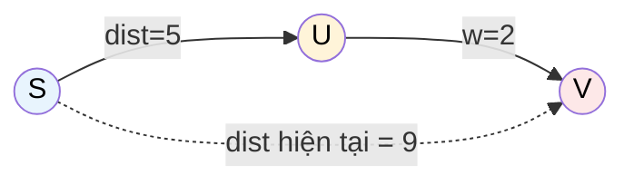

# MASTER COMPUTER SCIENCE HANDBOOK

## Volume 03 — Algorithms and Data Structures
### Part IV — Graph Algorithms
## Chương 4.5 — Đường đi ngắn nhất
### (Shortest Paths)

---

### Thông tin chương

| Trường | Giá trị |
|---|---|
| Chương | 4.5 |
| Thuộc Part | IV — Graph Algorithms |
| Thuộc Volume | 03 — Algorithms and Data Structures |
| Thời gian đọc ước tính | 65–75 phút |
| Độ khó | ★★★★☆ |
| Kiến thức tiên quyết | Chương 4.4 — Minimum Spanning Tree (đặc biệt cấu trúc Prim, Min-Heap); Chương 4.2 — Graph Traversal (BFS làm nền so sánh); Volume 03, Part III — Dynamic Programming |
| Chương liên quan | 4.6 — Maximum Flow (một bài toán tối ưu khác trên đồ thị có trọng số, dùng lại tư duy "residual"); Volume 04 — Computer Systems (giao thức định tuyến mạng dùng trực tiếp Dijkstra/Bellman-Ford) |
| Từ khóa | shortest path, Dijkstra's Algorithm, Bellman-Ford Algorithm, Floyd-Warshall Algorithm, relaxation, negative weight cycle, all-pairs shortest path |

---

### Mục tiêu học tập

Sau khi hoàn thành chương này, người đọc có thể:

- Giải thích khái niệm **relaxation (nới lỏng)** — thao tác nền tảng chung cho mọi thuật toán đường đi ngắn nhất trong chương này.
- Cài đặt thuật toán Dijkstra cho đồ thị có trọng số không âm, và giải thích tại sao nó thất bại khi có trọng số âm.
- Cài đặt thuật toán Bellman-Ford, xử lý được trọng số âm và phát hiện chu trình âm (negative weight cycle).
- Cài đặt thuật toán Floyd-Warshall cho bài toán đường đi ngắn nhất giữa **mọi cặp đỉnh** (All-Pairs Shortest Path).
- Lựa chọn thuật toán phù hợp dựa trên đặc điểm bài toán: một nguồn hay mọi cặp, có trọng số âm hay không, đồ thị thưa hay dày đặc.

---

### Câu hỏi khơi gợi

> *Khi Google Maps tính toán tuyến đường lái xe nhanh nhất giữa hai địa điểm, nó không chỉ tính khoảng cách vật lý — nó còn phải tính đến giới hạn tốc độ, tình trạng giao thông, thời gian dừng đèn đỏ. Vậy "ngắn nhất" ở đây không còn nghĩa là "ít cạnh nhất" (như BFS đã học ở Chương 4.2) mà là "tổng chi phí nhỏ nhất" trên một đồ thị có trọng số. Nhưng nếu một số "cạnh" mang giá trị âm — ví dụ đại diện cho một khoản hoàn tiền trong bài toán tài chính, hay một sự tăng tốc trong mô hình vật lý — liệu chiến lược tham lam quen thuộc còn hoạt động đúng không?*

---

## 1. Tổng quan chương

Chương 4.4 đã kết thúc bằng một lời hứa hẹn: thuật toán Dijkstra có cấu trúc code gần như **giống hệt** Prim, nhưng giải một bài toán khác biệt về bản chất. Chương này bắt đầu bằng chính sự so sánh đó, rồi mở rộng theo hai hướng mà Dijkstra **không** giải quyết được: trọng số âm (Bellman-Ford) và bài toán mọi cặp đỉnh thay vì một nguồn (Floyd-Warshall).

Bài toán **Đường đi ngắn nhất (Shortest Path)** tổng quát hóa trực tiếp bài toán BFS đã học ở Chương 4.2: thay vì đếm số cạnh, giờ đây mỗi cạnh mang một **trọng số (chi phí)**, và "ngắn nhất" nghĩa là tổng trọng số nhỏ nhất trên đường đi. Đây là một trong những bài toán đồ thị có ứng dụng thực tế rộng rãi và trực tiếp nhất — từ định tuyến GPS đến định tuyến gói tin mạng Internet.

> **💡 Insight**
> Ba thuật toán trong chương này (Dijkstra, Bellman-Ford, Floyd-Warshall) đều xây dựng trên cùng một thao tác nguyên tử duy nhất gọi là **relaxation**: "nếu đi qua đỉnh trung gian $u$ để đến $v$ ngắn hơn đường đi đã biết trước đó, hãy cập nhật lại". Sự khác biệt giữa ba thuật toán chỉ nằm ở **thứ tự** và **phạm vi** áp dụng thao tác relaxation này — một minh chứng đẹp khác cho nguyên tắc "một ý tưởng nền tảng, nhiều cách áp dụng" đã xuất hiện xuyên suốt Part IV.

---

## 2. Bối cảnh lịch sử

| Thời điểm | Nhân vật / Sự kiện | Đóng góp |
|---|---|---|
| 1956 (công bố 1959) | Edsger W. Dijkstra | Thiết kế thuật toán mang tên ông trong khoảng 20 phút khi ngồi uống cà phê cùng vợ ở Amsterdam — theo chính lời kể của Dijkstra, ông nghĩ ra thuật toán mà không dùng giấy bút, vì "muốn tránh mọi khả năng phức tạp hóa không cần thiết" |
| 1955–1958 | Richard Bellman, Lester Ford Jr. | Độc lập phát triển các ý tưởng nền tảng cho thuật toán mang tên Bellman–Ford, ban đầu trong bối cảnh lý thuyết Quy hoạch động (Dynamic Programming) mà Bellman là người khai sinh (sẽ học chi tiết ở Part III của Volume này) |
| 1962 | Robert Floyd, Stephen Warshall | Công bố độc lập (Floyd tập trung vào đường đi ngắn nhất, Warshall vào bao đóng bắc cầu — transitive closure) hai bài toán hóa ra có cùng một cấu trúc thuật toán, dẫn đến tên gọi ghép Floyd–Warshall ngày nay |

Câu chuyện về Dijkstra nghĩ ra thuật toán "không cần giấy bút trong 20 phút" thường được kể như một giai thoại về sự thanh lịch của thuật toán — nhưng nó cũng phản ánh một bài học sâu sắc hơn về thiết kế thuật toán: những lời giải đẹp nhất thường xuất phát từ việc **nhận diện đúng cấu trúc bài toán** (ở đây là tính chất "tham lam" của trọng số không âm, Mục 7) hơn là từ những kỹ thuật phức tạp.

---

## 3. Động lực

Quay lại bài toán bản đồ giao thông đã nêu ở Chương 4.1 (Mục 11): tìm đường đi ngắn nhất từ nhà đến công ty. BFS (Chương 4.2) đã giải quyết trường hợp đơn giản — mọi đoạn đường có "chi phí" bằng nhau (đếm số giao lộ). Nhưng thực tế, mỗi đoạn đường có độ dài, giới hạn tốc độ, mức độ tắc nghẽn khác nhau — "ngắn nhất" cần được đo bằng **tổng trọng số**, không phải số cạnh.

Bây giờ hãy xét một biến thể tinh tế hơn: trong bài toán định giá công cụ tài chính phái sinh (financial arbitrage), các "cạnh" trong đồ thị có thể biểu diễn tỷ giá hối đoái logarit, và một số "cạnh" có thể mang giá trị **âm** (biểu diễn cơ hội chênh lệch giá có lợi). Nếu dùng thuật toán tham lam như Dijkstra một cách ngây thơ trên đồ thị này, kết quả có thể **sai hoàn toàn** — đây chính là động lực cho Bellman-Ford (Mục 8, 14), thuật toán chậm hơn nhưng đúng đắn ngay cả khi có trọng số âm.

---

## 4. Trực giác

**Mô hình tinh thần (Mental Model) của chương này:**

> **Dijkstra** giống như **vết dầu loang có tốc độ khác nhau theo từng hướng**: từ điểm xuất phát, "sóng" lan ra, luôn ưu tiên mở rộng đến điểm gần nhất (tính theo tổng chi phí) trước — một phiên bản "có trọng số" của BFS. **Bellman-Ford** giống như việc bạn **kiên nhẫn hỏi lại mọi con đường nhiều lần**: "liệu có cách nào rẻ hơn để đến đây không?", lặp lại đủ số lần để chắc chắn không bỏ sót bất kỳ cải thiện nào, kể cả khi có những "phần thưởng âm" dọc đường. **Floyd-Warshall** giống như việc bạn hỏi lần lượt "nếu cho phép ghé qua điểm trung gian này, có đường nào ngắn hơn giữa mọi cặp điểm không?", lặp lại cho từng điểm trung gian một.

| Trực giác kỹ thuật bạn đã có | Khái niệm Shortest Path tương ứng |
|---|---|
| Google Maps tính đường đi nhanh nhất, ưu tiên đường gần trước | Chiến lược tham lam của Dijkstra |
| Kiểm tra lặp lại bảng giá nhiều vòng để chắc chắn không bỏ sót ưu đãi tốt hơn | Vòng lặp relaxation lặp lại của Bellman-Ford |
| Bảng tính khoảng cách giữa mọi thành phố trên bản đồ, cập nhật dần khi thêm đường mới qua từng trạm trung chuyển | Cấu trúc quy hoạch động của Floyd-Warshall |
| Cảnh báo "vòng lặp vô hạn phần thưởng" trong hệ thống game (exploit) | Negative Weight Cycle — chu trình âm |

---

## 5. Trực quan hóa khái niệm

**Hình 4.5.1 — Relaxation: thao tác nguyên tử chung của cả ba thuật toán**
*(Visual đặc trưng của chương — Chapter Identity)*



```text
Trước relaxation:  dist[S] = 0,  dist[U] = 5,  dist[V] = 9
Xét cạnh U → V (trọng số 2):
  Đường đi qua U:  dist[U] + w(U,V) = 5 + 2 = 7
  So sánh với dist[V] hiện tại = 9
  7 < 9  →  CẬP NHẬT: dist[V] = 7

Sau relaxation:    dist[S] = 0,  dist[U] = 5,  dist[V] = 7  (cải thiện!)
```

| Trường thông tin | Nội dung |
|---|---|
| Mục đích | Định nghĩa trực quan thao tác **relaxation** — sẽ được nhắc lại nguyên văn ở cả ba thuật toán trong chương này |
| Điểm mấu chốt | Relaxation chỉ là một phép so sánh và cập nhật đơn giản: "đường đi qua $u$ có tốt hơn đường đi đã biết đến $v$ không?" — sự khác biệt giữa Dijkstra, Bellman-Ford, Floyd-Warshall nằm ở **thứ tự** áp dụng phép toán này, không phải bản thân phép toán |

---

**Hình 4.5.2 — Vì sao Dijkstra thất bại với trọng số âm**

```text
Đồ thị:  S →(4)→ A →(−3)→ B         S →(2)→ B  (cạnh trực tiếp)

Dijkstra xử lý theo thứ tự khoảng cách "chốt" tăng dần (Mục 7):
  Bước 1: dist[S]=0. Chốt S.
  Bước 2: dist[A]=4, dist[B]=2 (qua cạnh trực tiếp S→B).
          B có khoảng cách nhỏ hơn (2 < 4) → CHỐT B trước, dist[B]=2 CỐ ĐỊNH.
  Bước 3: Xử lý A → B (trọng số −3): 4 + (−3) = 1 < 2
          NHƯNG B đã bị CHỐT ở bước 2 → Dijkstra KHÔNG xét lại!

Kết quả SAI của Dijkstra: dist[B] = 2
Kết quả ĐÚNG thực tế:      dist[B] = 1  (qua đường S→A→B)
```

*Mục đích:* Minh họa cụ thể lỗi sai của Dijkstra khi có trọng số âm — không phải một lỗi cài đặt, mà là một **giới hạn cấu trúc** của chính thuật toán. *Điểm mấu chốt:* Dijkstra "chốt" (finalize) khoảng cách của một đỉnh ngay khi lấy nó ra khỏi Heap, giả định ngầm rằng không còn đường nào tốt hơn xuất hiện sau đó — giả định này **chỉ đúng** khi mọi trọng số không âm (chứng minh đầy đủ ở Mục 7).

---

## 6. Định nghĩa hình thức

> **📌 Remember — Đường đi ngắn nhất (Shortest Path)**
>
> Cho đồ thị có trọng số $G = (V, E, w)$ với $w: E \to \mathbb{R}$, và hai đỉnh $s, t \in V$. **Khoảng cách ngắn nhất** $\delta(s, t)$ là giá trị nhỏ nhất của $\sum w(e)$ trên mọi đường đi từ $s$ đến $t$. Nếu không tồn tại đường đi nào, $\delta(s,t) = \infty$.

**Single-Source Shortest Path (SSSP)** — bài toán tìm $\delta(s, v)$ cho **mọi** đỉnh $v$, với $s$ cố định. Đây là bài toán mà Dijkstra và Bellman-Ford giải quyết.

**All-Pairs Shortest Path (APSP)** — bài toán tìm $\delta(u, v)$ cho **mọi cặp** đỉnh $(u,v)$. Đây là bài toán Floyd-Warshall giải quyết.

**Relaxation (Nới lỏng)** — thao tác nguyên tử: cho cạnh $(u,v)$ với trọng số $w(u,v)$, nếu $dist[u] + w(u,v) < dist[v]$, cập nhật $dist[v] \leftarrow dist[u] + w(u,v)$. Đây chính xác là thao tác minh họa ở Hình 4.5.1.

**Negative Weight Cycle (Chu trình âm)** — một chu trình trong đồ thị có tổng trọng số các cạnh **âm**. Khi tồn tại chu trình âm có thể đến được từ nguồn $s$, khái niệm "đường đi ngắn nhất" **không còn được định nghĩa tốt (well-defined)** — vì có thể đi vòng quanh chu trình âm vô hạn lần để giảm tổng chi phí về $-\infty$.

---

## 7. Nền tảng toán học

### 7.1 Vì sao Dijkstra đúng khi trọng số không âm

- **Ý nghĩa:** cần chứng minh rằng khi Dijkstra "chốt" một đỉnh $u$ (lấy ra khỏi Heap với khoảng cách nhỏ nhất hiện tại), giá trị $dist[u]$ đó **chắc chắn** là khoảng cách ngắn nhất thực sự, không thể cải thiện thêm sau này.

**Chứng minh (phản chứng, tương tự kỹ thuật đã dùng ở Chương 4.4, Mục 7.1):** giả sử tồn tại một đường đi ngắn hơn từ $s$ đến $u$ mà Dijkstra chưa xét, đi qua một đỉnh $w$ chưa được chốt. Vì mọi trọng số **không âm**, khoảng cách từ $s$ đến $w$ (là một phần của đường đi này) không thể lớn hơn khoảng cách từ $s$ đến $u$ qua đường đi đó. Nhưng Dijkstra luôn chốt đỉnh có khoảng cách tạm thời nhỏ nhất trước (tính chất Min-Heap) — nếu $w$ có khoảng cách nhỏ hơn hoặc bằng đường đi giả định qua nó đến $u$, $w$ phải được chốt **trước** $u$, mâu thuẫn với giả thiết $w$ "chưa được chốt". Vậy không tồn tại đường đi nào ngắn hơn $dist[u]$ đã chốt. $\blacksquare$

> **📦 Formula Box — Điều kiện đúng đắn của Dijkstra**
>
> $$\forall (u,v) \in E: w(u,v) \geq 0 \implies \text{Dijkstra cho kết quả chính xác}$$
>
> | Thành phần | Ý nghĩa |
> |---|---|
> | Điều kiện tiên quyết | Trọng số không âm — chứng minh ở trên sụp đổ ngay khi có $w(u,v) < 0$ (minh họa cụ thể ở Hình 4.5.2) |
> | **Điểm mấu chốt** | Việc "chốt" vĩnh viễn khoảng cách của một đỉnh chỉ an toàn khi không có cách nào một đường đi dài hơn (đi qua nhiều cạnh hơn) lại có tổng trọng số nhỏ hơn — điều này **chỉ đảm bảo** khi mọi cạnh không âm |
> | **Ứng dụng thường gặp** | Đây chính là lý do tại sao GPS, định tuyến mạng dùng Dijkstra một cách an toàn — khoảng cách vật lý, thời gian di chuyển đều tự nhiên không âm |

### 7.2 Bellman-Ford: quy hoạch động và số lần lặp $|V|-1$

Bellman-Ford dựa trên một quan sát từ Quy hoạch động (sẽ học đầy đủ ở Volume 03, Part III): trong một đồ thị **không có chu trình âm**, mọi đường đi ngắn nhất đơn giản (không lặp đỉnh) có **tối đa $|V|-1$ cạnh** — vì một đường đi đơn giản không thể đi qua quá $|V|$ đỉnh. Do đó, nếu lặp lại thao tác relaxation cho **toàn bộ cạnh** đúng $|V|-1$ lần, thuật toán đảm bảo "lan truyền" thông tin khoảng cách chính xác đến mọi đỉnh, bất kể thứ tự xử lý cạnh — khác biệt căn bản so với Dijkstra vốn phụ thuộc vào thứ tự "chốt" theo Min-Heap.

**Phát hiện chu trình âm:** nếu sau đúng $|V|-1$ lần lặp mà vẫn còn cạnh có thể relax được (tức $dist[u] + w(u,v) < dist[v]$), điều đó chứng tỏ tồn tại một chu trình âm có thể đến được — vì một đồ thị không có chu trình âm không bao giờ cần hơn $|V|-1$ lần relax để đạt trạng thái ổn định.

---

## 8. Thuật toán / Cơ chế

**Dijkstra's Algorithm** (SSSP, trọng số không âm):

```text
Bước 1 — Khởi tạo dist[s] = 0, dist[v] = ∞ với mọi v ≠ s
        │
        ▼
Bước 2 — Khởi tạo Min-Heap chứa (0, s)
        │
        ▼
Bước 3 — Trong khi Heap không rỗng:
        │
        ▼
Bước 4 —   Lấy (d, u) có d nhỏ nhất ra khỏi Heap
        │
        ▼
Bước 5 —   Nếu d > dist[u]: bỏ qua (thông tin đã lỗi thời — lazy deletion)
        │
        ▼
Bước 6 —   Với mỗi cạnh (u, v) trọng số w:
             Relaxation: nếu dist[u] + w < dist[v]:
               dist[v] = dist[u] + w
               đẩy (dist[v], v) vào Heap
```

**Bellman-Ford Algorithm** (SSSP, cho phép trọng số âm):

```text
Bước 1 — Khởi tạo dist[s] = 0, dist[v] = ∞ với mọi v ≠ s
        │
        ▼
Bước 2 — Lặp đúng |V| − 1 lần:
        │
        ▼
Bước 3 —   Với MỌI cạnh (u, v) trọng số w trong đồ thị:
             Relaxation: nếu dist[u] + w < dist[v]:
               dist[v] = dist[u] + w
        │
        ▼
Bước 4 — Sau |V|−1 lần lặp, kiểm tra thêm MỘT lần relaxation nữa:
        │
        ▼
Bước 5 —   Nếu còn cạnh nào relax được: BÁO CÓ CHU TRÌNH ÂM
```

**Floyd-Warshall Algorithm** (APSP, cho phép trọng số âm nhưng không có chu trình âm):

```text
Bước 1 — Khởi tạo ma trận dist[i][j] = w(i,j) nếu có cạnh, ∞ nếu không,
           0 nếu i = j
        │
        ▼
Bước 2 — Với mỗi đỉnh trung gian k từ 1 đến |V|:
        │
        ▼
Bước 3 —   Với mỗi cặp đỉnh (i, j):
        │
        ▼
Bước 4 —     Relaxation qua k: nếu dist[i][k] + dist[k][j] < dist[i][j]:
               dist[i][j] = dist[i][k] + dist[k][j]
        │
        ▼
Bước 5 — Sau khi xét hết mọi k, dist[i][j] là khoảng cách ngắn nhất
           thực sự giữa MỌI cặp (i,j)
```

> **💡 Insight**
> Cả ba khung thuật toán đều dùng chung thao tác relaxation ở Hình 4.5.1 — chỉ khác **phạm vi** và **thứ tự**: Dijkstra relax theo thứ tự khoảng cách tăng dần (dùng Heap để đảm bảo thứ tự này); Bellman-Ford relax **mọi cạnh, lặp lại nhiều lần** không quan tâm thứ tự; Floyd-Warshall relax theo từng "lớp đỉnh trung gian được phép dùng", một tư duy quy hoạch động đặc trưng.

---

## 9. Triển khai

```python
import heapq

def dijkstra(num_vertices, adj, source):
    """adj[u] = danh sách (v, weight). Trả về dict khoảng cách ngắn nhất."""
    dist = {v: float('inf') for v in range(num_vertices)}
    dist[source] = 0
    min_heap = [(0, source)]

    while min_heap:
        d, u = heapq.heappop(min_heap)        # Bước 4
        if d > dist[u]:
            continue                            # Bước 5 — lazy deletion
        for v, weight in adj[u]:
            if dist[u] + weight < dist[v]:      # Bước 6 — Relaxation
                dist[v] = dist[u] + weight
                heapq.heappush(min_heap, (dist[v], v))

    return dist


def bellman_ford(num_vertices, edges, source):
    """edges: danh sách (u, v, weight). Trả về (dist, has_negative_cycle)."""
    dist = {v: float('inf') for v in range(num_vertices)}
    dist[source] = 0

    for _ in range(num_vertices - 1):           # Bước 2 — |V|-1 lần lặp
        for u, v, weight in edges:               # Bước 3
            if dist[u] != float('inf') and dist[u] + weight < dist[v]:
                dist[v] = dist[u] + weight        # Relaxation

    # Bước 4-5: kiểm tra thêm một lần — phát hiện chu trình âm
    for u, v, weight in edges:
        if dist[u] != float('inf') and dist[u] + weight < dist[v]:
            return dist, True                     # Có chu trình âm

    return dist, False


def floyd_warshall(num_vertices, adj_matrix):
    """adj_matrix[i][j] = trọng số cạnh (float('inf') nếu không có cạnh).
    Trả về ma trận khoảng cách ngắn nhất giữa mọi cặp đỉnh."""
    dist = [row[:] for row in adj_matrix]        # Bước 1 — sao chép ma trận

    for k in range(num_vertices):                 # Bước 2
        for i in range(num_vertices):              # Bước 3
            for j in range(num_vertices):
                if dist[i][k] + dist[k][j] < dist[i][j]:   # Bước 4
                    dist[i][j] = dist[i][k] + dist[k][j]

    return dist
```

Hàm `dijkstra` triển khai chính xác thuật toán ở Mục 8, dùng lại kỹ thuật "lazy deletion" đã giới thiệu ở Chương 4.4 (Mục 9) cho Prim — minh chứng trực tiếp cho sự tương đồng cấu trúc giữa hai thuật toán. Hàm `bellman_ford` lặp đơn giản qua toàn bộ Edge List (Chương 4.1) đúng $|V|-1$ lần, rồi thêm một lần kiểm tra để phát hiện chu trình âm (Mục 7.2). Hàm `floyd_warshall` có cấu trúc ba vòng lặp lồng nhau đặc trưng — độ phức tạp $O(V^3)$, đơn giản đến mức đáng ngạc nhiên so với hai thuật toán còn lại, nhưng chỉ phù hợp khi $V$ không quá lớn (Mục 15).

---

## 10. Trực quan hóa quá trình thực thi

**Chạy Dijkstra trên đồ thị nhỏ** (S→A:4, S→B:2, A→B:1, A→C:5, B→C:8, B→D:6, C→D:3), xuất phát từ S:

```text
>>> vertices = {'S':0, 'A':1, 'B':2, 'C':3, 'D':4}
>>> adj = {0:[(1,4),(2,2)], 1:[(2,1),(3,5)], 2:[(3,8),(4,6)], 3:[(4,3)], 4:[]}
>>> dijkstra(5, adj, 0)
{0: 0, 1: 4, 2: 2, 3: 9, 4: 8}
```

Kiểm chứng thủ công: $S \to A \to C$ có tổng $4+5=9$ — khớp `dist[C]=9`. $S \to A \to C \to D$ có tổng $9+3=12$, nhưng $S \to B \to D$ chỉ có tổng $2+6=8$ — nhỏ hơn, khớp chính xác `dist[D]=8`.

**Chạy Bellman-Ford trên đồ thị có trọng số âm** từ Hình 4.5.2 (S→A:4, A→B:−3, S→B:2):

```text
>>> edges = [(0,1,4), (1,2,-3), (0,2,2)]
>>> dist, has_neg_cycle = bellman_ford(3, edges, 0)
>>> dist
{0: 0, 1: 4, 2: 1}
>>> has_neg_cycle
False
```

Kết quả `dist[B] = 1` — **chính xác** như phân tích ở Hình 4.5.2 (đường $S \to A \to B$ với tổng $4 + (-3) = 1$), khác với kết quả **sai** mà Dijkstra sẽ cho ($dist[B]=2$) — minh chứng thực nghiệm trực tiếp cho giới hạn đã nêu ở Mục 7.1.

**Kiểm tra phát hiện chu trình âm** (thêm cạnh $B \to A$ trọng số $-10$ vào đồ thị trên):

```text
>>> edges_with_cycle = [(0,1,4), (1,2,-3), (0,2,2), (2,1,-10)]
>>> dist, has_neg_cycle = bellman_ford(3, edges_with_cycle, 0)
>>> has_neg_cycle
True
```

Đúng như dự đoán: chu trình $A \to B \to A$ (qua cạnh $A\to B: -3$ và $B \to A: -10$) có tổng trọng số $-13 < 0$ — một chu trình âm, được Bellman-Ford phát hiện chính xác.

---

## 11. Ứng dụng công nghiệp

> **🛠 Engineering Practice**
> Ba thuật toán trong chương này phục vụ các lớp bài toán công nghiệp khác nhau rõ rệt, phản ánh trực tiếp qua Bảng so sánh ở Mục 15.

| Bối cảnh công nghiệp | Thuật toán dùng | Lý do |
|---|---|---|
| GPS, Google Maps, định tuyến giao thông | Dijkstra (thường kết hợp thêm heuristic — A* Algorithm) | Chi phí di chuyển (thời gian, khoảng cách) luôn không âm |
| Giao thức định tuyến mạng OSPF (Open Shortest Path First) | Dijkstra | Chi phí liên kết mạng (latency, băng thông) không âm |
| Giao thức định tuyến mạng RIP (Routing Information Protocol), phát hiện định tuyến bất thường | Bellman-Ford (dạng phân tán — Distance Vector Routing) | Cần phát hiện các bất thường có thể biểu diễn như "trọng số âm"; thuật toán phân tán tự nhiên hơn Dijkstra cho môi trường nhiều router độc lập |
| Bài toán chênh lệch giá tiền tệ (Currency Arbitrage Detection) | Bellman-Ford — phát hiện chu trình âm | Chu trình âm trong đồ thị tỷ giá logarit chính là cơ hội arbitrage có lợi nhuận (Mục 3) |
| Bảng tra cứu khoảng cách trước (precomputed distance table) cho hệ thống logistics quy mô vừa | Floyd-Warshall | Cần khoảng cách giữa **mọi cặp** kho hàng, tính một lần, tra cứu nhiều lần sau đó |

---

## 12. Góc nhìn nghiên cứu

> **🔬 Research Connection**
> Bài toán Shortest Path, dù đã có lời giải kinh điển từ những năm 1950–1960, vẫn tiếp tục là chủ đề nghiên cứu tích cực khi đối mặt với quy mô dữ liệu hiện đại.

- **A\* Algorithm** — một mở rộng trực tiếp của Dijkstra, sử dụng thêm một **hàm heuristic** ước lượng khoảng cách còn lại đến đích, giúp thuật toán "hướng" tìm kiếm về phía đích thay vì lan tỏa đều mọi hướng như Dijkstra thuần túy — nền tảng của hầu hết engine pathfinding trong game và GPS thực tế hiện đại.
- **Contraction Hierarchies** — kỹ thuật tiền xử lý (preprocessing) đồ thị đường bộ khổng lồ (hàng chục triệu đỉnh) để có thể trả lời truy vấn shortest path trong vài mili-giây — nền tảng thực sự đằng sau tốc độ của Google Maps mà Dijkstra thuần túy không thể đạt được trên quy mô đó.
- **Parallel/Distributed Bellman-Ford** — vì Bellman-Ford không phụ thuộc thứ tự relaxation nghiêm ngặt như Dijkstra, nó tự nhiên phù hợp hơn cho các thuật toán định tuyến **phân tán**, nơi mỗi router chỉ biết thông tin cục bộ — chính là cơ chế nền tảng của giao thức RIP (Mục 11).

**Câu hỏi mở** để suy ngẫm: Floyd-Warshall có độ phức tạp $O(V^3)$, không phụ thuộc vào $E$. Với một đồ thị **rất thưa** ($E = O(V)$), liệu chạy Dijkstra $V$ lần (một lần cho mỗi đỉnh làm nguồn) có nhanh hơn một lần chạy Floyd-Warshall không? *(Gợi ý: so sánh $O(V \times E \log V)$ với $O(V^3)$ và xem điều kiện nào của $E$ khiến cách nào nhanh hơn — đây chính là động lực thực tế cho việc lựa chọn thuật toán APSP phù hợp.)*

---

## 13. Ưu điểm

- Dijkstra đạt hiệu quả cao ($O(E \log V)$) cho bài toán SSSP trên đồ thị trọng số không âm — trường hợp phổ biến nhất trong thực tế (khoảng cách, thời gian, chi phí vật lý).
- Bellman-Ford xử lý được trọng số âm và **tự phát hiện** chu trình âm — một khả năng chẩn đoán quan trọng mà Dijkstra hoàn toàn không có.
- Floyd-Warshall cực kỳ đơn giản để cài đặt đúng (ba vòng lặp lồng nhau) trong khi giải quyết một bài toán tổng quát hơn (mọi cặp đỉnh) so với hai thuật toán còn lại.
- Cả ba đều xây dựng trên cùng một nguyên lý relaxation duy nhất — dễ ghi nhớ và liên hệ với nhau, đúng tinh thần "concept reuse" của Handbook.

---

## 14. Hạn chế

> **⚠️ Common Mistake**
> Lỗi nghiêm trọng và phổ biến nhất trong chương này là **áp dụng Dijkstra cho đồ thị có trọng số âm** mà không nhận ra — như minh họa cụ thể ở Hình 4.5.2, thuật toán **không báo lỗi**, nó âm thầm trả về kết quả **sai**. Đây là lỗi nguy hiểm hơn nhiều so với lỗi runtime thông thường, vì code chạy "bình thường" nhưng cho ra kết quả không đúng — luôn kiểm tra tính chất trọng số của đồ thị trước khi chọn thuật toán.

- Dijkstra hoàn toàn thất bại (cho kết quả sai, không phải báo lỗi) khi có cạnh trọng số âm (Mục 7.1, Hình 4.5.2).
- Bellman-Ford có độ phức tạp $O(V \cdot E)$ — chậm hơn đáng kể so với Dijkstra trên đồ thị lớn không có trọng số âm; không nên dùng Bellman-Ford "cho chắc" khi đã biết trọng số không âm.
- Floyd-Warshall có độ phức tạp $O(V^3)$ và bộ nhớ $O(V^2)$ — hoàn toàn không khả thi cho đồ thị có hàng triệu đỉnh, dù đồ thị đó thưa.
- Không thuật toán nào trong chương này (kể cả Bellman-Ford) định nghĩa được "đường đi ngắn nhất" khi tồn tại chu trình âm **có thể đến được** — bài toán trở nên vô nghĩa về mặt toán học (Mục 6), Bellman-Ford chỉ có thể **phát hiện** tình huống này, không "giải" nó.

---

## 15. So sánh

**Bảng 4.5.1 — So sánh Dijkstra, Bellman-Ford, Floyd-Warshall**

| Tiêu chí | Dijkstra | Bellman-Ford | Floyd-Warshall |
|---|---|---|---|
| Loại bài toán | SSSP | SSSP | APSP |
| Trọng số âm | ✗ Không hỗ trợ | ✓ Hỗ trợ | ✓ Hỗ trợ (không có chu trình âm) |
| Phát hiện chu trình âm | ✗ Không có khả năng | ✓ Có | Có thể (kiểm tra đường chéo ma trận < 0) |
| Độ phức tạp thời gian | $O(E \log V)$ | $O(V \cdot E)$ | $O(V^3)$ |
| Cấu trúc dữ liệu chính | Min-Heap | Edge List (lặp đơn giản) | Ma trận 2D |
| Phù hợp đồ thị lớn, thưa | ✓ Rất tốt | Khá tốt | ✗ Kém (không khả thi với $V$ lớn) |
| Tính song song hóa/phân tán tự nhiên | Khó (phụ thuộc thứ tự Heap) | ✓ Tự nhiên hơn | Trung bình |

**Phân tích:** Ba thuật toán tạo thành một **phổ đánh đổi rõ ràng** giữa tốc độ và tính tổng quát. Dijkstra nhanh nhất nhưng có điều kiện tiên quyết chặt nhất (không trọng số âm). Bellman-Ford tổng quát hơn (chấp nhận trọng số âm) với cái giá là chậm hơn đáng kể — đúng theo tinh thần đánh đổi đã thấy nhiều lần trong Part IV (ví dụ Adjacency Matrix vs. List ở Chương 4.1). Floyd-Warshall giải một bài toán **khác về bản chất** (mọi cặp, không chỉ một nguồn) — so sánh trực tiếp với Dijkstra/Bellman-Ford chỉ có ý nghĩa khi cân nhắc chạy SSSP nhiều lần (một lần cho mỗi đỉnh nguồn) như một cách thay thế để giải APSP, câu hỏi đã đặt ra ở Mục 12.

> **🎯 Nguyên tắc lựa chọn thực hành:** Mặc định dùng Dijkstra trừ khi biết chắc đồ thị có trọng số âm (khi đó bắt buộc Bellman-Ford) hoặc cần khoảng cách giữa **mọi cặp** đỉnh trên đồ thị nhỏ/vừa (khi đó Floyd-Warshall đơn giản hơn chạy Dijkstra nhiều lần).

---

## 16. Tóm tắt

- Bài toán **Đường đi ngắn nhất** tổng quát hóa BFS (Chương 4.2) từ đếm cạnh sang tổng trọng số, dựa trên thao tác nguyên tử chung: **relaxation**.
- **Dijkstra** giải SSSP nhanh ($O(E \log V)$) nhưng **chỉ đúng khi mọi trọng số không âm** — chứng minh dựa trên việc "chốt" khoảng cách theo thứ tự Min-Heap không thể bị đảo ngược.
- **Bellman-Ford** giải SSSP chậm hơn ($O(V \cdot E)$) nhưng xử lý được trọng số âm và **tự phát hiện chu trình âm** — dựa trên tư duy quy hoạch động: đường đi ngắn nhất đơn giản có tối đa $|V|-1$ cạnh.
- **Floyd-Warshall** giải APSP bằng cấu trúc ba vòng lặp $O(V^3)$ đơn giản, dựa trên tư duy "cho phép dùng dần từng đỉnh trung gian".
- Lựa chọn thuật toán phụ thuộc vào ba yếu tố: (1) một nguồn hay mọi cặp, (2) có trọng số âm hay không, (3) kích thước đồ thị.

Chương 4.6 (Maximum Flow) sẽ chuyển sang một bài toán tối ưu khác trên đồ thị có trọng số — không còn tìm đường đi ngắn nhất, mà tìm cách "bơm" một đại lượng (luồng) qua mạng lưới với công suất tối đa — nhưng vẫn kế thừa trực tiếp tư duy "cập nhật lặp đi lặp lại cho đến khi không còn cải thiện được" đã thấy xuyên suốt chương này.

---

## 17. Bài tập

### Mức Cơ bản (Basic)

1. Cho đồ thị có trọng số với cạnh $\{(S,A,2), (S,B,4), (A,B,1), (A,C,7), (B,C,3)\}$. Mô phỏng thủ công Dijkstra xuất phát từ $S$, ghi rõ trạng thái Heap sau mỗi bước.
2. Với đồ thị ở Bài 1 (không có trọng số âm), giải thích tại sao chạy Bellman-Ford thay vì Dijkstra vẫn cho kết quả đúng nhưng lãng phí thời gian hơn — ước lượng cụ thể số lần relaxation mỗi thuật toán thực hiện.
3. Cho ma trận trọng số 3×3 nhỏ, mô phỏng thủ công một vòng lặp ($k=0$) của Floyd-Warshall.

### Mức Trung bình (Intermediate)

4. Mở rộng hàm `dijkstra` ở Mục 9 để trả về không chỉ khoảng cách mà còn **đường đi cụ thể** đến mỗi đỉnh (tương tự Bài tập 5, Chương 4.2 — dùng dict `parent`).
5. Cài đặt thuật toán phát hiện **cơ hội chênh lệch giá tiền tệ (Currency Arbitrage)** đã nêu ở Mục 11: cho một bảng tỷ giá hối đoái giữa $n$ loại tiền tệ, xây dựng đồ thị với trọng số là $-\log(\text{tỷ giá})$, rồi dùng Bellman-Ford để phát hiện chu trình âm. *(Gợi ý: tỷ giá đi vòng quanh một chu trình có tích lớn hơn 1 tương ứng với tổng log dương; cần đảo dấu để chu trình có lợi nhuận trở thành chu trình âm.)*

### Mức Nâng cao (Advanced)

6. Chứng minh chặt chẽ (không chỉ trực giác) rằng Bellman-Ford chỉ cần đúng $|V|-1$ lần lặp là đủ để tìm khoảng cách ngắn nhất chính xác, khi đồ thị không có chu trình âm. *(Gợi ý: chứng minh quy nạp — sau lần lặp thứ $i$, mọi đường đi ngắn nhất có tối đa $i$ cạnh đã được tính đúng.)*
7. Cài đặt Floyd-Warshall với khả năng **truy vết đường đi cụ thể** (không chỉ khoảng cách) giữa mọi cặp đỉnh, dùng thêm một ma trận `next[i][j]` ghi nhận đỉnh kế tiếp trên đường đi ngắn nhất từ $i$ đến $j$, cập nhật đồng thời với `dist[i][j]` trong Bước 4 của thuật toán.

### Mức Nghiên cứu (Research)

8. Tìm hiểu về thuật toán **A\*** được nhắc đến ở Mục 12. Giải thích trực giác (không cần chứng minh hình thức) tại sao một hàm heuristic "admissible" (không bao giờ đánh giá quá cao khoảng cách thực) đảm bảo A* vẫn tìm được đường đi ngắn nhất chính xác, đồng thời thường nhanh hơn Dijkstra thuần túy trong thực tế.

---

## 18. Dự án nhỏ

**Dự án: "Công cụ định tuyến giao thông đơn giản" (Simple Route Planner)**

**Mục tiêu:** Mở rộng dự án "Trình thiết kế mạng cáp" ở Chương 4.4 thành một công cụ tìm đường đi ngắn nhất giữa hai địa điểm trên một mạng lưới đường giả lập.

**Yêu cầu:**
- Xây dựng đồ thị đường phố dạng lưới (grid) hoặc đọc từ file dữ liệu đơn giản (danh sách giao lộ và đoạn đường kèm "thời gian di chuyển ước tính").
- Áp dụng Dijkstra để tìm đường đi nhanh nhất giữa hai điểm bất kỳ.
- In ra tuyến đường cụ thể (dùng kết quả Bài tập 4) và tổng thời gian di chuyển.
- (Mở rộng) Thêm tính năng: nếu một số đoạn đường "đóng" (giá trị $\infty$), kiểm tra Dijkstra tự động tìm đường vòng hợp lý.
- (Mở rộng nâng cao) Tiền tính toán (precompute) khoảng cách giữa các "điểm trung tâm" quan trọng bằng Floyd-Warshall để tăng tốc truy vấn lặp lại nhiều lần — minh họa trực tiếp ý tưởng ở Mục 11 (bảng tra cứu logistics).

**Công nghệ đề xuất:** Python, `matplotlib` để vẽ mạng lưới và tuyến đường tìm được (tùy chọn).

**Kết quả kỳ vọng:** Một phiên bản thu nhỏ, đơn giản hóa nhưng minh họa đầy đủ nguyên lý hoạt động lõi của các hệ thống như Google Maps.

---

## 19. Tự đánh giá

- [ ] Tôi có thể định nghĩa chính xác thao tác relaxation và giải thích tại sao nó là "hạt nhân" chung của cả ba thuật toán.
- [ ] Tôi có thể trình bày lại (bằng lời, không cần công thức) tại sao Dijkstra thất bại với trọng số âm, dựa trên khái niệm "chốt" đỉnh.
- [ ] Tôi hiểu vì sao Bellman-Ford cần đúng $|V|-1$ lần lặp — không nhiều hơn, không ít hơn — dựa trên lập luận về độ dài tối đa của đường đi đơn giản.
- [ ] Tôi có thể tự cài đặt cả ba thuật toán và giải thích được từng dòng code liên hệ với bước nào trong khung thuật toán ở Mục 8.
- [ ] Tôi có thể lựa chọn đúng thuật toán phù hợp cho một bài toán thực tế mới, dựa trên ba yếu tố: SSSP/APSP, có trọng số âm hay không, kích thước đồ thị (Bảng 4.5.1).

Nếu vẫn còn nhầm lẫn về lý do Dijkstra sai với trọng số âm (một trong những điểm dễ gây hiểu lầm nhất của toàn Part IV), hãy quay lại tự tay mô phỏng ví dụ ở Hình 4.5.2 trên giấy — trải nghiệm trực tiếp việc "chốt nhầm" một đỉnh thường hiệu quả hơn nhiều so với chỉ đọc lời giải thích, trước khi chuyển sang Chương 4.6.

---

## 20. Đọc thêm

- **Sách:** Cormen, Leiserson, Rivest, Stein, *Introduction to Algorithms (CLRS)*, các chương "Single-Source Shortest Paths" và "All-Pairs Shortest Paths". *(Xem BOOKS.md — Tier S, Volume 3.)*
- **Bài báo:** E. W. Dijkstra (1959), "A note on two problems in connexion with graphs" — bài báo gốc chỉ dài 3 trang, giới thiệu thuật toán được nhắc ở Mục 2.
- **Chủ đề mở rộng (không bắt buộc):** tìm đọc về Contraction Hierarchies được nhắc ở Mục 12 — kỹ thuật thực sự đứng sau tốc độ định tuyến tức thời của các ứng dụng bản đồ hiện đại trên quy mô lục địa.
- **Chương tiếp theo:** Chương 4.6 — Maximum Flow.

---

### Liên kết chương (Cross References)

- **Chương trước:** 4.4 — Minimum Spanning Tree (Dijkstra kế thừa gần như nguyên vẹn cấu trúc code và Min-Heap từ Prim, dù giải bài toán khác biệt về bản chất — tối ưu từng đường đi riêng lẻ thay vì tối ưu một cây tổng thể).
- **Chương tiếp theo:** 4.6 — Maximum Flow (một bài toán tối ưu khác trên đồ thị có trọng số, kế thừa tư duy lặp lại cải thiện dần).
- **Chương liên quan xa hơn:** Volume 03, Part III — Dynamic Programming (nền tảng tư duy cho cả Bellman-Ford và Floyd-Warshall); Volume 04 — Computer Systems (giao thức định tuyến mạng OSPF/RIP dùng trực tiếp Dijkstra/Bellman-Ford, Mục 11).
- **Vị trí trong Knowledge Graph:** Nút thứ năm của Part IV, phụ thuộc trực tiếp vào cấu trúc Min-Heap của Chương 4.4 và tư duy Quy hoạch động sẽ học đầy đủ ở Part III; là một trong những chương có độ khó cao nhất Part IV do yêu cầu chứng minh chặt chẽ hơn (Mục 7).

---

*Hết Chương 4.5. Chương này tuân thủ đầy đủ cấu trúc 20 mục của `OUTPUT.md` và chuẩn Presentation Layer của `WRITING_STANDARD.md`, tiếp nối Chương 4.1–4.4 của Part IV — Graph Algorithms. Đây là chương đầu tiên của Part IV trình bày ba thuật toán song song trong cùng một chương (theo đúng thiết kế outline Part IV đã duyệt), thống nhất bằng khái niệm relaxation chung. Toàn bộ ví dụ Dijkstra, Bellman-Ford, Floyd-Warshall đều được minh họa bằng code Python có thể chạy thực tế, bao gồm cả trường hợp trọng số âm và phát hiện chu trình âm. Đang chờ rà soát trước khi tiếp tục sang Chương 4.6 — Maximum Flow.*
