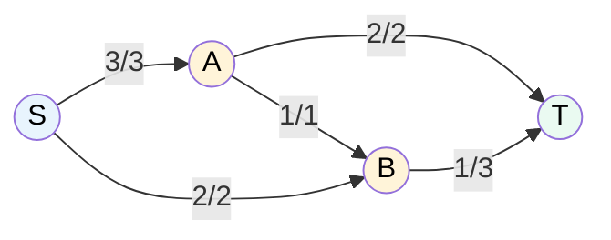

# MASTER COMPUTER SCIENCE HANDBOOK

## Volume 03 — Algorithms and Data Structures
### Part IV — Graph Algorithms
## Chương 4.6 — Luồng cực đại
### (Maximum Flow)

---

### Thông tin chương

| Trường | Giá trị |
|---|---|
| Chương | 4.6 |
| Thuộc Part | IV — Graph Algorithms |
| Thuộc Volume | 03 — Algorithms and Data Structures |
| Thời gian đọc ước tính | 60–70 phút |
| Độ khó | ★★★★☆ |
| Kiến thức tiên quyết | Chương 4.2 — Graph Traversal (BFS dùng trực tiếp trong Edmonds-Karp); Chương 4.5 — Shortest Paths (tư duy lặp lại cải thiện dần) |
| Chương liên quan | 4.7 — Strongly Connected Components (chương cuối Part IV, quay lại nền tảng DFS); Volume 04 — Distributed Systems (bài toán cân bằng tải mạng liên quan trực tiếp đến Max Flow) |
| Từ khóa | maximum flow, minimum cut, Ford-Fulkerson, Edmonds-Karp, residual graph, augmenting path, Max-Flow Min-Cut Theorem, bipartite matching |

---

### Mục tiêu học tập

Sau khi hoàn thành chương này, người đọc có thể:

- Định nghĩa hình thức bài toán Luồng cực đại trên mạng có công suất (flow network).
- Giải thích khái niệm đồ thị thặng dư (residual graph) và đường tăng luồng (augmenting path).
- Cài đặt thuật toán Ford-Fulkerson và biến thể Edmonds-Karp (dùng BFS để chọn đường tăng luồng).
- Phát biểu và áp dụng **Định lý Max-Flow Min-Cut (Max-Flow Min-Cut Theorem)**.
- Nhận diện và mô hình hóa các bài toán thực tế (ví dụ: bipartite matching) thành bài toán Luồng cực đại.

---

### Câu hỏi khơi gợi

> *Một hệ thống đường ống dẫn nước kết nối một hồ chứa với một thành phố, đi qua nhiều trạm bơm trung gian, mỗi đoạn ống có giới hạn công suất tối đa (lít/giây) khác nhau. Câu hỏi đặt ra: lượng nước tối đa có thể chuyển từ hồ chứa đến thành phố mỗi giây là bao nhiêu? Và làm sao biết chắc chắn bạn đã đạt đến giới hạn tối đa thực sự, chứ không phải chỉ là "tưởng đã tối đa"?*

---

## 1. Tổng quan chương

Ba chương trước (4.4, 4.5) đã giải hai bài toán tối ưu hóa trên đồ thị có trọng số: chọn tập cạnh tối thiểu để giữ liên thông (MST) và tìm đường đi tổng chi phí nhỏ nhất (Shortest Path). Chương này giới thiệu bài toán tối ưu hóa thứ ba, khác biệt về bản chất: thay vì trọng số cạnh biểu diễn "chi phí", giờ đây chúng biểu diễn **công suất (capacity)** — giới hạn tối đa "lượng" có thể đi qua cạnh đó.

**Luồng cực đại (Maximum Flow)** trả lời câu hỏi: với một mạng lưới có công suất giới hạn trên từng cạnh, lượng "luồng" (nước, dữ liệu, hàng hóa, dòng tiền...) tối đa có thể truyền từ một điểm nguồn (source) đến một điểm đích (sink) là bao nhiêu? Đây là bài toán có một trong những kết quả lý thuyết đẹp và sâu sắc nhất của Graph Theory: **Định lý Max-Flow Min-Cut**, khẳng định rằng luồng cực đại **luôn bằng chính xác** với "lát cắt nhỏ nhất" (minimum cut) — điểm nghẽn cổ chai nhỏ nhất của mạng lưới.

> **💡 Insight**
> Bài toán Maximum Flow, thoạt nhìn có vẻ hoàn toàn khác biệt so với MST hay Shortest Path, thực chất chia sẻ một tư duy thuật toán chung xuyên suốt Part IV: **lặp đi lặp lại việc cải thiện dần cho đến khi không thể cải thiện thêm**. Ford-Fulkerson liên tục tìm "đường tăng luồng" và cải thiện tổng luồng, giống hệt tinh thần "liên tục relax cạnh cho đến khi ổn định" của Bellman-Ford (Chương 4.5) — chỉ khác đối tượng được cải thiện.

---

## 2. Bối cảnh lịch sử

| Thời điểm | Nhân vật / Sự kiện | Đóng góp |
|---|---|---|
| 1955–1956 | T. E. Harris, F. S. Ross | Nghiên cứu bài toán luồng cực đại trong bối cảnh phân tích mạng lưới đường sắt Liên Xô–Đông Âu cho mục đích quân sự (báo cáo của RAND Corporation) — một trong những động lực thực tế sớm nhất của bài toán này |
| 1956 | Lester Ford Jr., Delbert Fulkerson | Công bố thuật toán mang tên hai ông (Ford-Fulkerson Method) cùng với chứng minh Định lý Max-Flow Min-Cut — một trong những kết quả nền tảng nhất của lý thuyết tối ưu hóa tổ hợp |
| 1972 | Jack Edmonds, Richard Karp | Công bố cải tiến Edmonds-Karp, chứng minh việc chọn đường tăng luồng **ngắn nhất** (bằng BFS) đảm bảo độ phức tạp đa thức, khắc phục điểm yếu tiềm ẩn của Ford-Fulkerson nguyên bản |

Câu chuyện về nguồn gốc quân sự của bài toán Max Flow (phân tích "điểm nghẽn" của mạng lưới đường sắt đối phương trong bối cảnh Chiến tranh Lạnh) là một minh chứng thú vị cho việc nhiều thuật toán nền tảng của Khoa học Máy tính bắt nguồn từ những bài toán ứng dụng rất cụ thể, trước khi được trừu tượng hóa thành lý thuyết tổng quát mà ngày nay được dạy tách biệt khỏi bối cảnh lịch sử ban đầu của nó.

---

## 3. Động lực

Câu hỏi khơi gợi đã nêu chính xác động lực: hệ thống đường ống nước với công suất giới hạn từng đoạn. Một tình huống kỹ thuật hiện đại hơn: hạ tầng mạng máy tính, nơi mỗi liên kết (link) giữa các router có băng thông (bandwidth) giới hạn. Câu hỏi "tốc độ truyền dữ liệu tối đa từ máy chủ A đến máy chủ B là bao nhiêu, xét trên toàn bộ mạng lưới có thể có nhiều đường đi song song?" chính xác là bài toán Maximum Flow.

Một ứng dụng khác, ít trực quan hơn nhưng cực kỳ phổ biến trong thực tế: **bài toán ghép cặp (matching)**. Ví dụ, một nền tảng tuyển dụng cần ghép $n$ ứng viên với $m$ công việc, mỗi ứng viên chỉ phù hợp với một số công việc nhất định, mỗi công việc chỉ nhận một ứng viên. Câu hỏi "số cặp ghép tối đa có thể thực hiện là bao nhiêu?" — thoạt nhìn không liên quan gì đến "luồng" hay "công suất" — hóa ra có thể mô hình hóa **chính xác** thành bài toán Maximum Flow (Mục 11), một trong những ví dụ đẹp nhất về sức mạnh của việc quy đổi (reduction) một bài toán về một bài toán đã biết cách giải.

---

## 4. Trực giác

**Mô hình tinh thần (Mental Model) của chương này:**

> Maximum Flow giống như một **hệ thống đường ống nước thực sự**: nước chảy từ nguồn (source) qua mạng lưới ống có đường kính (công suất) khác nhau, đến đích (sink). Thuật toán Ford-Fulkerson giống như việc bạn **liên tục tìm một con đường còn "chỗ trống"** từ nguồn đến đích, "bơm" thêm nước qua đường đó cho đến khi đầy, rồi tìm con đường tiếp theo — lặp lại cho đến khi không còn con đường nào còn chỗ trống nữa.

| Trực giác kỹ thuật bạn đã có | Khái niệm Maximum Flow tương ứng |
|---|---|
| Băng thông mạng giới hạn trên mỗi liên kết router | Capacity (công suất) của cạnh |
| Tổng dữ liệu thực sự truyền qua một liên kết tại một thời điểm | Flow (luồng) trên cạnh — luôn $\leq$ capacity |
| "Điểm nghẽn cổ chai" (bottleneck) trong hệ thống pipeline CI/CD | Minimum Cut — lát cắt nhỏ nhất giới hạn tốc độ tổng thể |
| Thuật toán ghép cặp ứng viên–công việc trên các nền tảng tuyển dụng | Bipartite Matching — quy đổi thành Maximum Flow (Mục 11) |
| Load balancer phân phối traffic qua nhiều server dự phòng | Mạng lưới nhiều đường luồng song song |

---

## 5. Trực quan hóa khái niệm

**Hình 4.6.1 — Mạng luồng (Flow Network) và một luồng khả thi**
*(Visual đặc trưng của chương — Chapter Identity)*



```text
Ký hiệu "flow/capacity" trên mỗi cạnh:
  S→A: 3/3 (đã dùng hết công suất — "bão hòa")
  S→B: 2/2 (bão hòa)
  A→B: 1/1 (bão hòa)
  A→T: 2/2 (bão hòa)
  B→T: 1/3 (còn 2 đơn vị công suất chưa dùng)

Tổng luồng hiện tại từ S đến T = flow(S→A) + flow(S→B) = 3 + 2 = 5
(hoặc tương đương: flow(A→T) + flow(B→T) = 2 + 1 = 3... 

  → CHÚ Ý: có sự "rò rỉ" ở đây — thực ra cần kiểm tra Bảo toàn Luồng
    tại từng đỉnh trung gian (Mục 6) để đảm bảo tính nhất quán)
```

| Trường thông tin | Nội dung |
|---|---|
| Mục đích | Giới thiệu ký hiệu "flow/capacity" sẽ dùng xuyên suốt chương, và khái niệm cạnh "bão hòa" (saturated) — công suất đã dùng hết |
| Điểm mấu chốt | Luồng không chỉ đơn thuần là "một số trên mỗi cạnh" — nó phải thỏa mãn ràng buộc **Bảo toàn Luồng (Flow Conservation)** tại mọi đỉnh trung gian: tổng luồng vào bằng tổng luồng ra (Mục 6) |

---

**Hình 4.6.2 — Đồ thị thặng dư (Residual Graph) và đường tăng luồng**

```text
Đồ thị gốc:  S →(cap=10)→ A →(cap=5)→ T
Sau khi đẩy luồng = 5 qua đường S→A→T:

Đồ thị THẶNG DƯ (Residual Graph):
  S →(còn lại: 10−5=5)→ A     (cạnh thuận — còn chỗ trống)
  A →(cạnh NGƯỢC: 5)→ S        (cạnh nghịch — có thể "hoàn tác" luồng đã đẩy)
  A →(còn lại: 5−5=0)→ T       (đã bão hòa — KHÔNG còn trong residual graph)
  T →(cạnh NGƯỢC: 5)→ A        (cạnh nghịch — có thể hoàn tác)
```

*Mục đích:* Minh họa khái niệm cốt lõi của Ford-Fulkerson: mỗi khi đẩy luồng qua một cạnh, đồ thị thặng dư tự động sinh ra một **cạnh ngược (reverse edge)** cho phép thuật toán "hoàn tác" (undo) quyết định trước đó nếu phát hiện có cách phân bổ luồng tốt hơn ở bước sau. *Điểm mấu chốt:* đây chính là cơ chế cho phép Ford-Fulkerson **luôn đạt được luồng tối ưu toàn cục**, dù mỗi bước chỉ đưa ra quyết định "tham lam cục bộ" — nếu không có cạnh ngược, thuật toán có thể bị "kẹt" ở một luồng không tối ưu.

---

## 6. Định nghĩa hình thức

> **📌 Remember — Mạng luồng (Flow Network)**
>
> Một **mạng luồng** là một đồ thị có hướng $G = (V, E)$ với một hàm **công suất (capacity)** $c: E \to \mathbb{R}^{+}$, một đỉnh **nguồn (source)** $s$, và một đỉnh **đích (sink)** $t$. Một **luồng (flow)** là một hàm $f: E \to \mathbb{R}^{+}$ thỏa mãn hai ràng buộc:
>
> 1. **Ràng buộc công suất (Capacity Constraint):** $0 \leq f(u,v) \leq c(u,v)$ với mọi cạnh $(u,v)$.
> 2. **Bảo toàn luồng (Flow Conservation):** với mọi đỉnh $v \neq s, t$, tổng luồng vào bằng tổng luồng ra: $\sum_{u} f(u,v) = \sum_{w} f(v,w)$.

**Giá trị luồng (Value of Flow)** — $|f| = \sum_{v} f(s,v) - \sum_{v} f(v,s)$, tổng luồng ròng đi ra từ nguồn $s$. Bài toán Maximum Flow tìm luồng $f$ có $|f|$ lớn nhất.

**Đồ thị thặng dư (Residual Graph)** $G_f$ — với mỗi cạnh $(u,v)$ trong đồ thị gốc có luồng hiện tại $f(u,v)$, đồ thị thặng dư chứa: (1) cạnh thuận $(u,v)$ với **công suất thặng dư** $c_f(u,v) = c(u,v) - f(u,v)$ nếu $c_f(u,v) > 0$, và (2) cạnh nghịch $(v,u)$ với công suất thặng dư $c_f(v,u) = f(u,v)$ nếu $f(u,v) > 0$ (Hình 4.6.2).

**Đường tăng luồng (Augmenting Path)** — một đường đi từ $s$ đến $t$ trong đồ thị thặng dư $G_f$ (đi qua cả cạnh thuận lẫn cạnh nghịch), với **công suất thắt cổ chai (bottleneck capacity)** bằng giá trị nhỏ nhất trong số công suất thặng dư của các cạnh trên đường đi đó.

**Lát cắt s-t (s-t Cut)** — một cách chia đỉnh thành $(S, T)$ với $s \in S$, $t \in T$. **Công suất của lát cắt** là tổng công suất của mọi cạnh đi từ $S$ sang $T$.

---

## 7. Nền tảng toán học

### 7.1 Định lý Max-Flow Min-Cut

- **Ý nghĩa:** đây là kết quả trung tâm của toàn chương — một mối liên hệ sâu sắc và bất ngờ giữa hai đại lượng thoạt nhìn không liên quan: giá trị luồng cực đại và công suất lát cắt nhỏ nhất.

> **📦 Formula Box — Định lý Max-Flow Min-Cut**
>
> $$\max_{f} |f| = \min_{(S,T) \text{ là s-t cut}} c(S, T)$$
>
> | Thành phần | Ý nghĩa |
> |---|---|
> | Vế trái | Giá trị luồng lớn nhất có thể đạt được trên mạng |
> | Vế phải | Công suất nhỏ nhất trong số mọi lát cắt s-t có thể có — đại diện cho "điểm nghẽn cổ chai" thực sự của mạng |
> | **Chứng minh (phác thảo ba chiều tương đương)** | (1) Với mọi luồng $f$ và mọi lát cắt $(S,T)$: $\|f\| \leq c(S,T)$ — vì mọi đơn vị luồng từ $s$ đến $t$ phải "băng qua" lát cắt ít nhất một lần. (2) Khi thuật toán Ford-Fulkerson dừng lại (không còn đường tăng luồng), tập $S$ = các đỉnh còn đến được từ $s$ trong đồ thị thặng dư tạo thành một lát cắt có $c(S,T) = \|f\|$ hiện tại — chứng tỏ đây chính là luồng cực đại và đồng thời là lát cắt nhỏ nhất. |
> | **Ứng dụng thường gặp** | Xác định "điểm nghẽn" cần nâng cấp trong hạ tầng mạng; chứng minh tính tối ưu của một luồng mà không cần thử mọi luồng khả thi khác |

**Kiểm chứng bằng tay** trên Hình 4.6.1 (giả định sửa lại cho nhất quán Bảo toàn Luồng): lát cắt $(\{S\}, \{A,B,T\})$ có công suất $c(S,A) + c(S,B) = 3+2 = 5$; đây chính là giá trị luồng cực đại của mạng — không có lát cắt nào khác nhỏ hơn $5$, khớp với Định lý Max-Flow Min-Cut.

### 7.2 Vì sao Ford-Fulkerson hội tụ về luồng cực đại

Thuật toán dừng lại khi không còn đường tăng luồng nào từ $s$ đến $t$ trong đồ thị thặng dư — nghĩa là $t$ **không còn đến được** từ $s$ trong $G_f$. Gọi $S$ là tập đỉnh còn đến được từ $s$ trong $G_f$ lúc này, và $T = V \setminus S$. Vì không có cạnh thặng dư nào từ $S$ sang $T$ (nếu có, $t$ đã đến được), mọi cạnh gốc từ $S$ sang $T$ phải đang **bão hòa hoàn toàn** ($f(u,v) = c(u,v)$), và mọi cạnh gốc từ $T$ sang $S$ phải có luồng bằng $0$ (nếu không, sẽ có cạnh nghịch thặng dư từ $S$ sang $T$). Suy ra $|f| = c(S,T)$ — luồng hiện tại **bằng đúng** công suất lát cắt $(S,T)$, và theo bất đẳng thức đã nêu ở Mục 7.1 ($|f| \leq c(S,T)$ cho mọi lát cắt), đây chính là luồng cực đại. $\blacksquare$

---

## 8. Thuật toán / Cơ chế

**Ford-Fulkerson Method (khung tổng quát):**

```text
Bước 1 — Khởi tạo luồng f(u,v) = 0 với mọi cạnh
        │
        ▼
Bước 2 — Xây dựng đồ thị thặng dư G_f từ luồng hiện tại
        │
        ▼
Bước 3 — Trong khi tồn tại đường tăng luồng P từ s đến t trong G_f:
        │
        ▼
Bước 4 —   Tính bottleneck = công suất thặng dư nhỏ nhất trên đường P
        │
        ▼
Bước 5 —   Với mỗi cạnh (u,v) trên đường P:
             - Nếu (u,v) là cạnh thuận: f(u,v) += bottleneck
             - Nếu (u,v) là cạnh nghịch: f(v,u) −= bottleneck  (hoàn tác)
        │
        ▼
Bước 6 —   Cập nhật lại đồ thị thặng dư G_f
        │
        ▼
Bước 7 — Khi không còn đường tăng luồng nào: |f| hiện tại là LUỒNG CỰC ĐẠI
```

**Edmonds-Karp (Ford-Fulkerson + BFS):**

```text
Giống hệt khung Ford-Fulkerson ở trên, CHỈ khác duy nhất Bước 3:
Bước 3' — Tìm đường tăng luồng P bằng BFS (đường có ÍT CẠNH NHẤT),
            thay vì tìm bất kỳ đường nào (ví dụ bằng DFS)
```

> **💡 Insight**
> Sự khác biệt tưởng chừng nhỏ ở Bước 3 — dùng BFS thay vì DFS hay bất kỳ cách tìm đường nào khác — lại có hệ quả to lớn về độ phức tạp thời gian (Mục 15). Đây là một ví dụ điển hình cho nguyên tắc: **cùng một khung thuật toán, một lựa chọn cài đặt tưởng chừng nhỏ có thể quyết định thuật toán chạy trong vài giây hay không bao giờ dừng lại** (Ford-Fulkerson nguyên bản, dùng công suất là số vô tỷ, về mặt lý thuyết có thể không hội tụ — Mục 14).

---

## 9. Triển khai

```python
from collections import deque

def bfs_find_augmenting_path(capacity, source, sink, num_vertices):
    """Tìm đường tăng luồng bằng BFS trên đồ thị thặng dư.
    capacity[u][v] là công suất thặng dư hiện tại.
    Trả về dict parent nếu tìm thấy đường, None nếu không."""
    parent = {source: None}
    queue = deque([source])

    while queue:
        u = queue.popleft()
        if u == sink:
            return parent
        for v in range(num_vertices):
            if v not in parent and capacity[u][v] > 0:   # Còn công suất thặng dư
                parent[v] = u
                queue.append(v)

    return None   # Không còn đường tăng luồng


def edmonds_karp(num_vertices, capacity, source, sink):
    """capacity: ma trận công suất num_vertices x num_vertices.
    Trả về giá trị luồng cực đại."""
    # Sao chép để không làm hỏng ma trận công suất gốc của người dùng
    residual = [row[:] for row in capacity]
    max_flow = 0

    while True:
        parent = bfs_find_augmenting_path(residual, source, sink, num_vertices)
        if parent is None:
            break                                          # Bước 7 — dừng

        # Bước 4 — tìm bottleneck dọc theo đường tăng luồng vừa tìm
        bottleneck = float('inf')
        v = sink
        while v != source:
            u = parent[v]
            bottleneck = min(bottleneck, residual[u][v])
            v = u

        # Bước 5 — cập nhật đồ thị thặng dư dọc đường đi
        v = sink
        while v != source:
            u = parent[v]
            residual[u][v] -= bottleneck        # Giảm công suất thuận
            residual[v][u] += bottleneck        # Tăng công suất nghịch (hoàn tác)
            v = u

        max_flow += bottleneck

    return max_flow
```

Hàm `bfs_find_augmenting_path` triển khai Bước 3' — dùng lại chính xác cấu trúc BFS đã học ở Chương 4.2, chỉ thay đổi điều kiện mở rộng đỉnh: thay vì "có cạnh kề", giờ là "có **công suất thặng dư dương**". Hàm `edmonds_karp` triển khai vòng lặp chính của Ford-Fulkerson (Mục 8), với `residual` đóng vai trò ma trận biểu diễn cả cạnh thuận lẫn cạnh nghịch đồng thời — khi giảm `residual[u][v]` (dùng bớt công suất thuận), luôn tăng `residual[v][u]` tương ứng (tạo/tăng khả năng hoàn tác), đúng theo định nghĩa đồ thị thặng dư ở Mục 6.

---

## 10. Trực quan hóa quá trình thực thi

**Chạy Edmonds-Karp trên mạng nhỏ** (S→A: cap 3, S→B: cap 2, A→B: cap 1, A→T: cap 2, B→T: cap 3):

```text
>>> vertices = {'S':0, 'A':1, 'B':2, 'T':3}
>>> capacity = [
...     [0, 3, 2, 0],   # S → A, B
...     [0, 0, 1, 2],   # A → B, T
...     [0, 0, 0, 3],   # B → T
...     [0, 0, 0, 0],
... ]
>>> edmonds_karp(4, capacity, 0, 3)
5
```

**Diễn giải từng vòng lặp:**

```text
Vòng 1 — BFS tìm đường S→A→T (2 cạnh). Bottleneck = min(3,2) = 2.
         Đẩy 2 đơn vị luồng. Cập nhật residual: S→A còn 1, A→T còn 0 (bão hòa).

Vòng 2 — BFS tìm đường S→B→T (2 cạnh). Bottleneck = min(2,3) = 2.
         Đẩy 2 đơn vị luồng. Cập nhật residual: S→B còn 0, B→T còn 1.

Vòng 3 — BFS tìm đường S→A→B→T (3 cạnh, dùng cạnh A→B trực tiếp).
         Bottleneck = min(1,1,1) = 1.
         Đẩy 1 đơn vị luồng.

Vòng 4 — BFS không tìm thấy đường nào nữa (S→A còn 0, S→B còn 0) → DỪNG.

Tổng luồng cực đại = 2 + 2 + 1 = 5
```

Kiểm chứng bằng Định lý Max-Flow Min-Cut (Mục 7.1): lát cắt $(\{S\}, \{A,B,T\})$ có công suất $c(S,A)+c(S,B) = 3+2 = 5$ — khớp chính xác với kết quả $5$ vừa tính được, xác nhận đây thực sự là luồng cực đại.

---

## 11. Ứng dụng công nghiệp

> **🛠 Engineering Practice**
> Maximum Flow là một trong những thuật toán có phạm vi ứng dụng bất ngờ rộng nhất trong Part IV — nhiều bài toán tưởng chừng không liên quan đến "luồng" hóa ra có thể quy đổi trực tiếp về nó.

| Bối cảnh công nghiệp | Vai trò của Maximum Flow |
|---|---|
| Thiết kế và phân tích băng thông mạng máy tính | Tính lượng dữ liệu tối đa truyền được giữa hai điểm, xác định điểm nghẽn cần nâng cấp (Mục 7.1) |
| **Bipartite Matching** — ghép cặp ứng viên/công việc, sinh viên/ký túc xá | Xây dựng mạng luồng: một đỉnh nguồn nối đến mọi ứng viên (cap=1 mỗi cạnh), mỗi ứng viên nối đến các công việc phù hợp (cap=1), mọi công việc nối đến đích (cap=1) — luồng cực đại **chính xác bằng** số cặp ghép tối đa có thể |
| Lập lịch dự án với nhiều ràng buộc tài nguyên | Mô hình hóa ràng buộc tài nguyên như công suất cạnh, tìm lịch trình khả thi tối đa |
| Phân đoạn ảnh (Image Segmentation) trong Computer Vision | Thuật toán Graph Cut dùng chính Min-Cut để tách vùng tiền cảnh/hậu cảnh của ảnh — kết nối trực tiếp đến Volume 05 |
| Phân tích độ tin cậy mạng lưới (Network Reliability) | Min-Cut xác định số liên kết tối thiểu cần hỏng để cắt đứt kết nối giữa hai điểm — ứng dụng bảo mật và thiết kế dự phòng |

---

## 12. Góc nhìn nghiên cứu

> **🔬 Research Connection**
> Dù bài toán Max Flow cơ bản đã có lời giải hiệu quả từ thập niên 1970 (Mục 2), việc tìm thuật toán **nhanh nhất có thể về mặt lý thuyết** vẫn là một hướng nghiên cứu tích cực kéo dài nhiều thập kỷ.

- **Dinic's Algorithm (1970)** — cải tiến đáng kể so với Edmonds-Karp, đạt độ phức tạp $O(V^2 E)$, dựa trên khái niệm "đồ thị mức" (level graph) và tìm nhiều đường tăng luồng "chặn" (blocking flow) trong mỗi giai đoạn thay vì từng đường một.
- **Push-Relabel Algorithm (Goldberg-Tarjan, 1988)** — một cách tiếp cận hoàn toàn khác biệt, không dựa trên đường tăng luồng mà "đẩy" luồng cục bộ giữa các đỉnh kề rồi điều chỉnh dần, đạt độ phức tạp cạnh tranh cho đồ thị dày đặc.
- **Đột phá gần đây (2022)** — một công trình của Chen, Kyng, Liu, Peng, Probst Gutenberg, và Sachdeva công bố thuật toán Max Flow chạy trong thời gian **gần tuyến tính** $\tilde{O}(E)$ — một kết quả được xem là đột phá lớn của lý thuyết thuật toán, giải quyết một câu hỏi mở tồn tại suốt nhiều thập kỷ.

**Câu hỏi mở** để suy ngẫm: Định lý Max-Flow Min-Cut (Mục 7.1) chỉ áp dụng cho mạng có công suất **hữu hạn, không âm** trên mỗi cạnh. Điều gì sẽ xảy ra nếu một số đỉnh (không phải cạnh) cũng có giới hạn "công suất đi qua" (ví dụ: giới hạn số lượng gói tin một router có thể xử lý mỗi giây)? Đây là bài toán **Vertex Capacity** — gợi ý: có thể quy đổi về bài toán Edge Capacity thông thường bằng một kỹ thuật "tách đỉnh" (vertex splitting) đơn giản.

---

## 13. Ưu điểm

- Ford-Fulkerson/Edmonds-Karp cung cấp một thuật toán đơn giản, dễ hiểu để giải một bài toán tối ưu hóa mạnh mẽ và tổng quát.
- Định lý Max-Flow Min-Cut cho một chứng nhận (certificate) toán học chắc chắn về tính tối ưu — khi thuật toán dừng, ta biết chắc chắn đã đạt luồng cực đại mà không cần thử phương án nào khác.
- Bài toán có khả năng **quy đổi (reduction)** cực kỳ linh hoạt — nhiều bài toán tổ hợp khác (bipartite matching, vertex cover trên đồ thị hai phía, lập lịch tài nguyên) có thể giải gián tiếp thông qua Max Flow.
- Edmonds-Karp đạt độ phức tạp đa thức đảm bảo ($O(VE^2)$), khắc phục hoàn toàn nhược điểm tiềm ẩn của Ford-Fulkerson nguyên bản.

---

## 14. Hạn chế

> **⚠️ Common Mistake**
> Lỗi phổ biến nhất khi cài đặt Ford-Fulkerson là **quên tạo cạnh nghịch (reverse edge) trong đồ thị thặng dư**, hoặc tạo với công suất sai — nếu thiếu cạnh nghịch, thuật toán mất khả năng "hoàn tác" quyết định trước đó và có thể **kẹt ở một luồng không tối ưu**, dù về hình thức vẫn "chạy xong" mà không báo lỗi gì (tương tự nguy hiểm với lỗi Dijkstra + trọng số âm ở Chương 4.5).

- Ford-Fulkerson nguyên bản (không chỉ định cách chọn đường tăng luồng) có thể **không hội tụ hoặc hội tụ cực chậm** nếu công suất là số vô tỷ hoặc nếu luôn chọn đường tăng luồng "xấu" (bottleneck rất nhỏ) — đây chính là động lực cho cải tiến Edmonds-Karp (Mục 2, 15).
- Thuật toán chỉ tìm được **giá trị** luồng cực đại và **một** phương án luồng cụ thể đạt giá trị đó — nếu có nhiều phương án luồng khác nhau cùng đạt giá trị cực đại, thuật toán không đảm bảo tìm ra phương án "đẹp" nhất theo tiêu chí phụ nào khác (ví dụ: phân bổ đều nhất).
- Định lý Max-Flow Min-Cut không áp dụng trực tiếp cho mạng có giới hạn công suất tại **đỉnh** thay vì cạnh — cần kỹ thuật quy đổi bổ sung (Mục 12).
- Với đồ thị rất lớn, ngay cả Edmonds-Karp ($O(VE^2)$) cũng có thể chậm hơn nhiều so với các thuật toán hiện đại hơn (Dinic's, Push-Relabel) không được trình bày chi tiết trong chương giới thiệu này.

---

## 15. So sánh

**Bảng 4.6.1 — So sánh Ford-Fulkerson nguyên bản và Edmonds-Karp**

| Tiêu chí | Ford-Fulkerson (chọn đường tùy ý, ví dụ DFS) | Edmonds-Karp (chọn đường bằng BFS) |
|---|---|---|
| Cách chọn đường tăng luồng | Bất kỳ đường nào tồn tại | Đường có **ít cạnh nhất** (BFS) |
| Độ phức tạp thời gian (công suất nguyên) | $O(E \cdot |f^*|)$ với $|f^*|$ là giá trị luồng cực đại — **phụ thuộc giá trị công suất**, không đa thức thuần túy theo kích thước input | $O(VE^2)$ — **đa thức thuần túy**, không phụ thuộc giá trị công suất |
| Đảm bảo hội tụ với công suất vô tỷ | ✗ Không đảm bảo | ✓ Luôn hội tụ |
| Độ phức tạp cài đặt | Đơn giản nhất | Chỉ thêm một bước BFS, không phức tạp hơn đáng kể |
| Hiệu năng thực tế trên đồ thị nhỏ/vừa | Có thể nhanh hơn nếu may mắn chọn đường tốt | Ổn định, dự đoán được |

**Phân tích:** Bảng trên cho thấy một bài học quan trọng về thiết kế thuật toán: độ phức tạp $O(E \cdot |f^*|)$ của Ford-Fulkerson nguyên bản là một ví dụ về **độ phức tạp giả đa thức (pseudo-polynomial)** — phụ thuộc vào **giá trị** của công suất (có thể là một số cực lớn dù chỉ cần vài bit để biểu diễn), chứ không phải **kích thước** thực sự của input (số bit cần thiết). Đây là lý do tại sao cải tiến của Edmonds-Karp — chỉ đơn giản là "luôn chọn đường ngắn nhất bằng BFS" — lại có ý nghĩa lý thuyết quan trọng: nó chuyển đổi thuật toán từ giả đa thức sang **đa thức thực sự** ($O(VE^2)$, chỉ phụ thuộc $V$ và $E$), đảm bảo hiệu năng dự đoán được trên mọi trường hợp, không phụ thuộc vào các con số công suất cụ thể "may rủi" như thế nào.

---

## 16. Tóm tắt

- **Maximum Flow** tìm giá trị luồng lớn nhất có thể truyền từ nguồn $s$ đến đích $t$ trên một mạng có công suất giới hạn từng cạnh, thỏa mãn ràng buộc công suất và **bảo toàn luồng**.
- **Đồ thị thặng dư (Residual Graph)** — với cạnh nghịch cho phép "hoàn tác" — là cơ chế cốt lõi cho phép Ford-Fulkerson đạt được luồng tối ưu toàn cục dù chỉ đưa ra quyết định cục bộ từng bước.
- **Định lý Max-Flow Min-Cut** khẳng định giá trị luồng cực đại luôn bằng công suất lát cắt nhỏ nhất — một kết quả toán học sâu sắc, đồng thời là chứng nhận tính tối ưu khi thuật toán dừng lại.
- **Edmonds-Karp** (Ford-Fulkerson + BFS chọn đường ngắn nhất) đảm bảo độ phức tạp đa thức thực sự $O(VE^2)$, khắc phục nhược điểm tiềm ẩn của phiên bản nguyên bản.
- Bài toán có khả năng quy đổi mạnh mẽ — Bipartite Matching là ví dụ điển hình cho thấy một bài toán tổ hợp khác biệt hoàn toàn về hình thức vẫn có thể giải được thông qua Max Flow.

Đây là chương áp chót của Part IV. Chương 4.7 (Strongly Connected Components) sẽ khép lại Part bằng cách quay về nền tảng DFS đã học ở Chương 4.2, mở rộng nó theo một hướng hoàn toàn khác: không phải tối ưu hóa, mà là phân tích **cấu trúc liên thông** của đồ thị có hướng.

---

## 17. Bài tập

### Mức Cơ bản (Basic)

1. Cho mạng luồng với cạnh (định dạng u→v, công suất): S→A:4, S→B:3, A→T:2, B→T:5, A→B:1. Mô phỏng thủ công Edmonds-Karp, ghi rõ đường tăng luồng tìm được ở mỗi vòng lặp và bottleneck tương ứng.
2. Với kết quả Bài 1, tìm một lát cắt $(S,T)$ có công suất bằng đúng giá trị luồng cực đại vừa tính — xác nhận Định lý Max-Flow Min-Cut.
3. Vẽ đồ thị thặng dư sau vòng lặp đầu tiên của Bài 1, chỉ rõ cạnh thuận và cạnh nghịch.

### Mức Trung bình (Intermediate)

4. Cài đặt bài toán **Bipartite Matching** đã mô tả ở Mục 11: cho danh sách ứng viên, danh sách công việc, và danh sách cặp (ứng viên, công việc) phù hợp, xây dựng mạng luồng tương ứng và dùng `edmonds_karp` ở Mục 9 để tìm số cặp ghép tối đa.
5. Mở rộng `edmonds_karp` để không chỉ trả về giá trị luồng cực đại mà còn trả về **phương án luồng cụ thể** trên từng cạnh gốc (không phải cạnh thặng dư) — cần phân biệt luồng thực tế `f(u,v) = capacity_gốc[u][v] - residual[u][v]` với `capacity[u][v] > 0` ban đầu.

### Mức Nâng cao (Advanced)

6. Chứng minh chi tiết (viết đầy đủ, không chỉ trực giác) bất đẳng thức "$|f| \leq c(S,T)$ với mọi luồng $f$ và mọi lát cắt $(S,T)$" — nửa đầu của chứng minh Định lý Max-Flow Min-Cut được phác thảo ở Mục 7.1. *(Gợi ý: dùng ràng buộc Bảo toàn Luồng để tính tổng luồng "ròng" băng qua lát cắt, rồi so sánh với tổng công suất.)*
7. Thiết kế thuật toán tìm **Min-Cut cụ thể** (không chỉ giá trị, mà danh sách các cạnh tạo thành lát cắt) sau khi Edmonds-Karp đã dừng lại. *(Gợi ý: dựa trực tiếp vào lập luận ở Mục 7.2 — tập $S$ là các đỉnh còn đến được từ $s$ trong đồ thị thặng dư cuối cùng.)*

### Mức Nghiên cứu (Research)

8. Tìm hiểu về **Dinic's Algorithm** được nhắc đến ở Mục 12. So sánh trực giác ý tưởng "blocking flow trên đồ thị mức" của Dinic's với cách tiếp cận "một đường tăng luồng mỗi lần" của Edmonds-Karp — giải thích tại sao xử lý nhiều đường cùng lúc trong một giai đoạn lại cải thiện đáng kể độ phức tạp tổng thể.

---

## 18. Dự án nhỏ

**Dự án: "Hệ thống phân tích băng thông mạng" (Network Bandwidth Analyzer)**

**Mục tiêu:** Xây dựng công cụ mô phỏng một mạng máy tính với các liên kết có băng thông giới hạn, tính toán băng thông tối đa có thể đạt được giữa hai điểm bất kỳ.

**Yêu cầu:**
- Đọc dữ liệu mạng dạng danh sách liên kết kèm băng thông (ví dụ: `router_A, router_B, 100` nghĩa là liên kết A–B có băng thông 100 Mbps).
- Áp dụng `edmonds_karp` để tính băng thông tối đa từ một router nguồn đến một router đích.
- In ra **lát cắt nhỏ nhất** (dùng kết quả Bài tập 7) — chính là các liên kết "nghẽn cổ chai" cần nâng cấp ưu tiên nếu muốn tăng băng thông tổng thể.
- (Mở rộng) Mô phỏng việc "nâng cấp" một liên kết trong lát cắt nhỏ nhất (tăng công suất), chạy lại thuật toán, và quan sát băng thông tối đa mới — minh họa trực tiếp giá trị thực tiễn của việc xác định đúng điểm nghẽn.

**Công nghệ đề xuất:** Python.

**Kết quả kỳ vọng:** Một công cụ phân tích hạ tầng mạng đơn giản nhưng minh họa đầy đủ giá trị thực tiễn của Định lý Max-Flow Min-Cut trong việc ra quyết định đầu tư hạ tầng.

---

## 19. Tự đánh giá

- [ ] Tôi có thể định nghĩa chính xác một mạng luồng, bao gồm cả hai ràng buộc: công suất và bảo toàn luồng.
- [ ] Tôi hiểu và có thể giải thích tại sao đồ thị thặng dư cần có cạnh nghịch, và điều gì xảy ra nếu thiếu nó (Mục 14).
- [ ] Tôi có thể phát biểu chính xác Định lý Max-Flow Min-Cut và giải thích trực giác (không cần chứng minh đầy đủ) tại sao nó đúng.
- [ ] Tôi hiểu tại sao Edmonds-Karp (dùng BFS) có độ phức tạp đa thức đảm bảo, trong khi Ford-Fulkerson nguyên bản (chọn đường tùy ý) thì không (Bảng 4.6.1).
- [ ] Tôi có thể tự mô hình hóa một bài toán ghép cặp (matching) đơn giản thành bài toán Maximum Flow, theo đúng cách quy đổi ở Mục 11.

Nếu Bài tập 4 (Bipartite Matching) vẫn còn khó hình dung, hãy quay lại Mục 11 và tự vẽ ra mạng luồng tương ứng với một ví dụ ghép cặp nhỏ (ví dụ: 3 ứng viên, 3 công việc) trên giấy trước khi viết code — việc "nhìn thấy" cấu trúc mạng luồng ẩn sau bài toán ghép cặp là kỹ năng quan trọng nhất của toàn chương này.

---

## 20. Đọc thêm

- **Sách:** Cormen, Leiserson, Rivest, Stein, *Introduction to Algorithms (CLRS)*, Chương "Maximum Flow" — trình bày đầy đủ chứng minh Định lý Max-Flow Min-Cut. *(Xem BOOKS.md — Tier S, Volume 3.)*
- **Sách:** L. R. Ford Jr., D. R. Fulkerson, *Flows in Networks* (1962) — công trình gốc của hai tác giả, đặt nền móng cho toàn bộ lý thuyết luồng mạng hiện đại.
- **Bài báo:** J. Edmonds, R. M. Karp (1972), "Theoretical improvements in algorithmic efficiency for network flow problems".
- **Chủ đề mở rộng (không bắt buộc):** tìm đọc về Dinic's Algorithm và Push-Relabel Algorithm được nhắc ở Mục 12 — hai hướng cải tiến quan trọng vượt ra ngoài phạm vi giới thiệu của chương này.
- **Chương tiếp theo:** Chương 4.7 — Strongly Connected Components (chương cuối cùng của Part IV).

---

### Liên kết chương (Cross References)

- **Chương trước:** 4.5 — Shortest Paths (chia sẻ tinh thần "lặp lại cải thiện dần" xuyên suốt Part IV); 4.2 — Graph Traversal (BFS được tái sử dụng trực tiếp trong Edmonds-Karp).
- **Chương tiếp theo:** 4.7 — Strongly Connected Components (chương cuối Part IV, quay lại mở rộng DFS theo hướng phân tích cấu trúc).
- **Chương liên quan xa hơn:** Volume 04 — Data Engineering and Computer Systems (phân tích băng thông mạng thực tế); Volume 05 — Computer Vision (thuật toán Graph Cut dùng Min-Cut cho phân đoạn ảnh, Mục 11).
- **Vị trí trong Knowledge Graph:** Nút thứ sáu của Part IV, phụ thuộc trực tiếp vào BFS (Chương 4.2); là một trong hai chương có độ khó cao nhất Part IV (cùng Chương 4.5) do yêu cầu nắm vững khái niệm đồ thị thặng dư và chứng minh Định lý Max-Flow Min-Cut.

---

*Hết Chương 4.6. Chương này tuân thủ đầy đủ cấu trúc 20 mục của `OUTPUT.md` và chuẩn Presentation Layer của `WRITING_STANDARD.md`, tiếp nối Chương 4.1–4.5 của Part IV — Graph Algorithms. Toàn bộ ví dụ Ford-Fulkerson/Edmonds-Karp và kiểm chứng Định lý Max-Flow Min-Cut đều được minh họa bằng code Python có thể chạy thực tế, tái sử dụng trực tiếp cấu trúc BFS từ Chương 4.2. Đang chờ rà soát trước khi tiếp tục sang Chương 4.7 — Strongly Connected Components, chương khép lại Part IV.*
