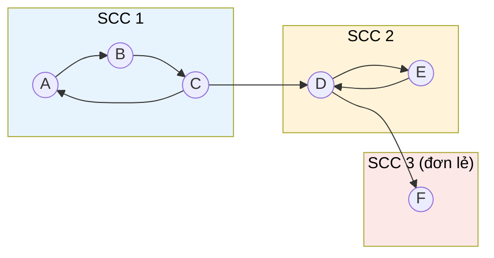

# MASTER COMPUTER SCIENCE HANDBOOK

## Volume 03 — Algorithms and Data Structures
### Part IV — Graph Algorithms
## Chương 4.7 — Thành phần liên thông mạnh
### (Strongly Connected Components)

---

### Thông tin chương

| Trường | Giá trị |
|---|---|
| Chương | 4.7 |
| Thuộc Part | IV — Graph Algorithms (chương cuối cùng) |
| Thuộc Volume | 03 — Algorithms and Data Structures |
| Thời gian đọc ước tính | 55–65 phút |
| Độ khó | ★★★★☆ |
| Kiến thức tiên quyết | Chương 4.2 — Graph Traversal (DFS, finish time); Chương 4.3 — Topological Sorting (khái niệm DAG, tư duy "thu gọn" đồ thị) |
| Chương liên quan | Toàn bộ Part IV (chương tổng kết); Volume 06 — AI Agents (phát hiện vòng lặp phụ thuộc trong hệ thống multi-agent) |
| Từ khóa | Strongly Connected Components, Kosaraju's Algorithm, Tarjan's Algorithm, transpose graph, condensation graph, low-link value |

---

### Mục tiêu học tập

Sau khi hoàn thành chương này, người đọc có thể:

- Định nghĩa hình thức khái niệm liên thông mạnh (strong connectivity) trên đồ thị có hướng, phân biệt với liên thông thông thường đã học ở Chương 4.2.
- Cài đặt thuật toán Kosaraju, dựa trên hai lượt DFS và đồ thị chuyển vị (transpose graph).
- Cài đặt thuật toán Tarjan, dựa trên một lượt DFS duy nhất với khái niệm low-link value.
- Xây dựng đồ thị thu gọn (condensation graph) từ các thành phần liên thông mạnh và giải thích tại sao nó luôn là một DAG.
- Nhận diện các bài toán thực tế có thể giải quyết thông qua việc phân tích thành phần liên thông mạnh.

---

### Câu hỏi khơi gợi

> *Trên mạng xã hội Twitter/X, nếu A theo dõi B nhưng B không theo dõi lại A, liệu A và B có thuộc về "cùng một cộng đồng chặt chẽ" không? Điều gì sẽ xảy ra nếu ta chỉ quan tâm đến những nhóm người dùng mà **mọi thành viên đều có thể "chạm tới" mọi thành viên khác** thông qua chuỗi theo dõi lẫn nhau, theo cả hai chiều? Làm sao xác định được những nhóm như vậy trong một mạng xã hội hàng triệu người dùng, chỉ bằng công cụ đã có sẵn từ Chương 4.2 — DFS?*

---

## 1. Tổng quan chương

Đây là chương khép lại Part IV — Graph Algorithms. Trước khi đi vào nội dung, hãy nhìn lại hành trình đã đi qua: Chương 4.1 dạy cách **lưu trữ** đồ thị; Chương 4.2 dạy cách **duyệt** đồ thị bằng BFS/DFS; Chương 4.3 dùng DFS để **sắp xếp thứ tự**; Chương 4.4–4.6 giải các bài toán **tối ưu hóa** trên đồ thị có trọng số. Chương 4.7 quay trở lại nền tảng DFS một lần cuối, nhưng theo một hướng hoàn toàn mới: không tối ưu hóa, không sắp xếp, mà **phân tích cấu trúc liên thông** của đồ thị có hướng.

**Thành phần liên thông mạnh (Strongly Connected Component — SCC)** trả lời câu hỏi: trong một đồ thị có hướng, những nhóm đỉnh nào có tính chất "mọi đỉnh trong nhóm đều đến được mọi đỉnh khác trong cùng nhóm, theo cả hai chiều"? Đây là một khái niệm tinh tế hơn "liên thông" thông thường đã học ở Chương 4.2 (vốn chỉ áp dụng tự nhiên cho đồ thị vô hướng) — và việc tìm ra các SCC mở khóa một kỹ thuật mạnh mẽ: **thu gọn (condense)** một đồ thị có hướng phức tạp, có thể chứa nhiều chu trình chằng chịt, thành một **DAG đơn giản hơn** — nơi mọi công cụ đã học ở Chương 4.3 (Topological Sort) có thể áp dụng trở lại.

> **💡 Insight**
> Chương này là một "phép chiếu" cuối cùng cho thấy sức mạnh tích lũy của Part IV: Kosaraju's Algorithm dùng DFS **hai lần**, với lượt đầu tiên tái sử dụng chính xác khái niệm **finish time** đã học ở Chương 4.3 (Topological Sort), và lượt thứ hai chạy trên **đồ thị chuyển vị** (đảo ngược mọi cạnh — một biến đổi đơn giản dựa trên biểu diễn Adjacency List từ Chương 4.1). Không có kỹ thuật nào trong chương này là "mới hoàn toàn" — tất cả là sự kết hợp tinh tế của những gì đã học.

---

## 2. Bối cảnh lịch sử

| Thời điểm | Nhân vật / Sự kiện | Đóng góp |
|---|---|---|
| Thập niên 1970 (chưa công bố chính thức) | S. Rao Kosaraju | Nghĩ ra thuật toán mang tên ông trong một bài giảng chưa xuất bản — thuật toán được biết đến rộng rãi qua việc Micha Sharir độc lập công bố lại ý tưởng tương tự vào năm 1981 |
| 1972 | Robert Tarjan | Công bố thuật toán mang tên ông trong cùng bài báo nền tảng đã giới thiệu khái niệm hệ thống hóa DFS (đã nhắc đến ở Chương 4.2, Mục 2) — đạt được kết quả chỉ dùng **một lượt DFS duy nhất**, một cải tiến đáng kể về mặt kỹ thuật so với cách tiếp cận hai lượt của Kosaraju |
| 1993 | Harold N. Gabow | Công bố một biến thể khác của thuật toán một-lượt-DFS, dùng cấu trúc ngăn xếp (stack) đơn giản hơn Tarjan's Algorithm về mặt khái niệm, dù độ phức tạp tương đương |

Điều thú vị trong lịch sử của thuật toán Kosaraju là nó minh họa một hiện tượng phổ biến trong giới nghiên cứu: **ý tưởng tồn tại trước khi được công bố chính thức**. Kosaraju đã trình bày thuật toán này trong các bài giảng của mình trước cả khi nó xuất hiện trên giấy tờ chính thức — một lời nhắc nhở rằng lịch sử "chính thức" của khoa học (ngày công bố bài báo) đôi khi không hoàn toàn khớp với lịch sử thực sự của ý tưởng.

---

## 3. Động lực

Câu hỏi khơi gợi đã nêu chính xác động lực: mạng xã hội với quan hệ "theo dõi" một chiều. Một ví dụ kỹ thuật khác, quen thuộc hơn: hệ thống quản lý module phần mềm (đã xuất hiện xuyên suốt từ Chương 4.1) đôi khi **vô tình** chứa các vòng phụ thuộc (circular dependency) — Chương 4.3 đã dạy cách **phát hiện** sự tồn tại của chúng, nhưng không cho biết **chính xác những module nào** tạo thành từng vòng lặp, đặc biệt khi có nhiều vòng lặp lồng nhau hoặc chồng chéo phức tạp.

Đây chính xác là bài toán SCC giải quyết: mỗi thành phần liên thông mạnh trong đồ thị dependency chính là một "cụm module" bị ràng buộc vòng lặp lẫn nhau — không thể build riêng lẻ từng module trong cụm mà không xử lý toàn bộ cụm cùng lúc. Sau khi xác định các cụm này, ta có thể **thu gọn mỗi cụm thành một "siêu-module"**, biến đồ thị dependency phức tạp ban đầu thành một DAG đơn giản giữa các cụm — áp dụng lại Topological Sort (Chương 4.3) để xác định thứ tự build ở cấp độ cụm.

---

## 4. Trực giác

**Mô hình tinh thần (Mental Model) của chương này:**

> Một thành phần liên thông mạnh giống như **một "câu lạc bộ kín" trong quan hệ theo dõi mạng xã hội**: mọi thành viên trong câu lạc bộ đều có thể "chuyền tin" đến mọi thành viên khác (qua chuỗi theo dõi), theo cả hai chiều — dù không nhất thiết theo dõi trực tiếp lẫn nhau. Người ở ngoài câu lạc bộ, dù có thể theo dõi được người trong câu lạc bộ, không bao giờ được "theo dõi lại" đầy đủ hai chiều để gia nhập câu lạc bộ đó.

| Trực giác kỹ thuật bạn đã có | Khái niệm SCC tương ứng |
|---|---|
| Nhóm bạn bè "quen biết vòng tròn" trên mạng xã hội (ai cũng biết ai, trực tiếp hoặc gián tiếp, hai chiều) | Một thành phần liên thông mạnh |
| Cụm module phần mềm bị vòng phụ thuộc lẫn nhau (circular import) | Một SCC trong đồ thị dependency |
| Thu gọn một nhóm commit Git liên quan thành một "squash commit" duy nhất trước khi merge | Thu gọn một SCC thành một đỉnh duy nhất (condensation) |
| Web page ranking — các trang web liên kết vòng tròn lẫn nhau tạo thành một "cụm chủ đề" chặt chẽ | Ứng dụng SCC trong phân tích đồ thị web (Mục 11) |

---

## 5. Trực quan hóa khái niệm

**Hình 4.7.1 — Đồ thị có hướng và các Thành phần liên thông mạnh của nó**
*(Visual đặc trưng của chương — Chapter Identity)*



```text
SCC 1 = {A, B, C}   — A→B→C→A tạo một chu trình khép kín, liên thông mạnh
SCC 2 = {D, E}      — D→E→D tạo một chu trình khép kín
SCC 3 = {F}         — một đỉnh đơn lẻ LUÔN là một SCC (liên thông mạnh với chính nó)

Cạnh GIỮA các SCC: SCC1 → SCC2 (qua C→D), SCC2 → SCC3 (qua D→F)
Các cạnh này CHỈ ĐI MỘT CHIỀU giữa các SCC — không có đường quay lại
```

| Trường thông tin | Nội dung |
|---|---|
| Mục đích | Minh họa trực quan cách một đồ thị có hướng phức tạp phân rã tự nhiên thành các "cụm" SCC, với các cạnh nối giữa cụm chỉ đi một chiều |
| Điểm mấu chốt | Một đỉnh đơn lẻ không nằm trong chu trình nào (như F) vẫn được tính là một SCC — SCC không nhất thiết phải có nhiều hơn một đỉnh |

---

**Hình 4.7.2 — Đồ thị thu gọn (Condensation Graph): luôn là một DAG**

```text
Thu gọn mỗi SCC ở Hình 4.7.1 thành MỘT đỉnh duy nhất:

   [SCC1: A,B,C] ──→ [SCC2: D,E] ──→ [SCC3: F]

Đây LUÔN LUÔN là một DAG — không có chu trình giữa các SCC đã thu gọn!
```

*Mục đích:* Cho thấy kết quả then chốt nhất của lý thuyết SCC — dù đồ thị gốc có bao nhiêu chu trình phức tạp, đồ thị thu gọn (mỗi SCC → một siêu-đỉnh) luôn là một DAG. *Điểm mấu chốt:* đây chính là cầu nối trực tiếp về lại Chương 4.3 — sau khi thu gọn, **Topological Sort có thể áp dụng ngay lập tức** trên đồ thị thu gọn, giải quyết trọn vẹn động lực đã nêu ở Mục 3 (chứng minh đầy đủ ở Mục 7).

---

## 6. Định nghĩa hình thức

> **📌 Remember — Liên thông mạnh (Strong Connectivity)**
>
> Trên đồ thị có hướng $G = (V, E)$, hai đỉnh $u, v$ được gọi là **liên thông mạnh với nhau** nếu tồn tại đường đi từ $u$ đến $v$ **và** tồn tại đường đi từ $v$ đến $u$ (viết gọn: $u \leftrightarrow v$). Quan hệ này là một **quan hệ tương đương (equivalence relation)** — phản xạ, đối xứng, bắc cầu — nên nó chia $V$ thành các lớp tương đương rời nhau, gọi là các **Thành phần liên thông mạnh (Strongly Connected Components — SCC)**.

**So sánh với Chương 4.2:** khái niệm "thành phần liên thông" (connected component) ở Chương 4.2 chỉ có ý nghĩa tự nhiên trên đồ thị **vô hướng**, nơi $u \leftrightarrow v$ tự động đúng nếu có đường đi giữa chúng (vì không có "hướng" để phân biệt). Trên đồ thị **có hướng**, khái niệm liên thông "yếu" (weakly connected — bỏ qua hướng cạnh) và "mạnh" (strongly connected — tôn trọng hướng cạnh, đòi hỏi cả hai chiều) là **hai khái niệm khác biệt hoàn toàn** — chương này chỉ quan tâm đến liên thông mạnh.

**Đồ thị chuyển vị (Transpose Graph)** $G^T$ — đồ thị thu được từ $G$ bằng cách **đảo ngược hướng của mọi cạnh**: nếu $(u,v) \in E$ thì $(v,u) \in E^T$. Tính chất quan trọng nhất: $G$ và $G^T$ có **cùng tập các SCC** — vì nếu $u \leftrightarrow v$ trong $G$ (cả hai chiều), thì hiển nhiên cũng $u \leftrightarrow v$ trong $G^T$ (chỉ là đảo ngược lại hai chiều đã có sẵn).

**Đồ thị thu gọn (Condensation Graph)** — đồ thị $G^{SCC}$ thu được bằng cách thay mỗi SCC của $G$ bằng một đỉnh duy nhất, giữ lại các cạnh nối giữa các SCC khác nhau (loại bỏ cạnh nội bộ trong từng SCC).

---

## 7. Nền tảng toán học

### 7.1 Chứng minh Đồ thị thu gọn luôn là DAG

- **Ý nghĩa:** đây là kết quả nền tảng biện minh cho toàn bộ giá trị thực tiễn của lý thuyết SCC (Mục 3).
- **Phát biểu:** với mọi đồ thị có hướng $G$, đồ thị thu gọn $G^{SCC}$ không bao giờ có chu trình.

**Chứng minh (phản chứng):** giả sử $G^{SCC}$ có một chu trình giữa các siêu-đỉnh $C_1 \to C_2 \to \dots \to C_k \to C_1$ (mỗi $C_i$ là một SCC). Khi đó, với mọi cặp $C_i, C_j$ trên chu trình này, tồn tại đường đi từ $C_i$ đến $C_j$ (đi theo chiều chu trình) **và** từ $C_j$ đến $C_i$ (đi vòng qua phần còn lại của chu trình). Suy ra mọi đỉnh thuộc $C_1, C_2, \dots, C_k$ đều liên thông mạnh với nhau — nghĩa là chúng phải thuộc **cùng một** SCC, mâu thuẫn với giả thiết $C_1, \dots, C_k$ là các SCC **riêng biệt**. Vậy $G^{SCC}$ không có chu trình. $\blacksquare$

> **📦 Formula Box — Đồ thị thu gọn là DAG**
>
> $$\forall G \text{ có hướng}: G^{SCC} \text{ là DAG}$$
>
> | Thành phần | Ý nghĩa |
> |---|---|
> | Hệ quả trực tiếp | Có thể áp dụng Topological Sort (Chương 4.3) trên $G^{SCC}$ ngay sau khi tìm được các SCC |
> | **Ứng dụng thường gặp** | Giải quyết trọn vẹn động lực ở Mục 3: xác định thứ tự "build" các cụm module bị vòng phụ thuộc, coi mỗi cụm như một đơn vị không thể chia nhỏ |

### 7.2 Vì sao Kosaraju's Algorithm đúng đắn

Ý tưởng cốt lõi (sẽ triển khai ở Mục 8): chạy DFS trên $G$ để tính finish time (giống hệt Chương 4.3), sau đó chạy DFS lần thứ hai trên đồ thị chuyển vị $G^T$, theo thứ tự đỉnh có finish time **giảm dần**. Mỗi cây DFS riêng biệt hình thành trong lượt thứ hai chính xác là một SCC.

**Trực giác chứng minh:** đỉnh có finish time lớn nhất trong lượt DFS đầu tiên trên $G$ chắc chắn thuộc về một SCC mà "không có SCC nào khác trỏ vào nó trong đồ thị thu gọn của $G$" — nói cách khác, nó nằm ở "đỉnh nguồn" (source) của $G^{SCC}$ theo một thứ tự tô-pô nào đó (đây chính là lý do finish time, đã chứng minh liên hệ trực tiếp với thứ tự tô-pô ở Chương 4.3, Mục 7.1, lại xuất hiện ở đây). Chạy DFS từ đỉnh này trên $G^T$ (đồ thị **đảo ngược**) sẽ chỉ "lan" đến đúng các đỉnh trong cùng SCC với nó — vì mọi cạnh dẫn ra ngoài SCC này trong $G^{SCC}$ (nếu tồn tại) đã bị **đảo hướng thành đi vào**, không phải đi ra, trong $G^T$, nên DFS không thể "vượt biên" sang SCC khác. Lặp lại cho đỉnh có finish time lớn tiếp theo (chưa thăm) sẽ tuần tự bóc tách từng SCC theo đúng thứ tự tô-pô của $G^{SCC}$.

---

## 8. Thuật toán / Cơ chế

**Kosaraju's Algorithm:**

```text
Bước 1 — Chạy DFS trên đồ thị gốc G, ghi lại finish time của mọi đỉnh
           (tái sử dụng chính xác kỹ thuật Chương 4.3, Mục 8)
        │
        ▼
Bước 2 — Xây dựng đồ thị chuyển vị G^T (đảo ngược mọi cạnh)
        │
        ▼
Bước 3 — Khởi tạo danh sách kết quả SCCs rỗng, visited rỗng
        │
        ▼
Bước 4 — Với mỗi đỉnh v, xét theo thứ tự finish time GIẢM DẦN:
        │
        ▼
Bước 5 —   Nếu v chưa visited:
             - Chạy DFS từ v trên G^T
             - Mọi đỉnh thăm được trong lượt DFS này tạo thành MỘT SCC
             - Đánh dấu chúng visited
        │
        ▼
Bước 6 — Sau khi xét hết mọi đỉnh, SCCs chứa đầy đủ mọi thành phần
```

**Tarjan's Algorithm (một lượt DFS duy nhất):**

```text
Bước 1 — Khởi tạo: disc[v] = −1 (chưa thăm) với mọi v; một Stack rỗng
           (Stack theo dõi các đỉnh "có thể" thuộc SCC đang xây dựng)
        │
        ▼
Bước 2 — Với mỗi đỉnh v chưa thăm, gọi DFS_SCC(v)
        │
        ▼
Hàm DFS_SCC(u), với biến đếm toàn cục "timer":
        │
        ▼
Bước 3 —   disc[u] = low[u] = timer; timer += 1
           Đẩy u vào Stack; đánh dấu u "đang trong Stack"
        │
        ▼
Bước 4 —   Với mỗi đỉnh v kề với u:
        │
        ▼
Bước 5 —     Nếu v chưa thăm (disc[v] == −1):
               - Gọi đệ quy DFS_SCC(v)
               - low[u] = min(low[u], low[v])   ← cập nhật low-link
        │
        ▼
Bước 6 —     Ngược lại, nếu v đang trong Stack:
               - low[u] = min(low[u], disc[v])   ← v là "tổ tiên", cạnh lùi
        │
        ▼
Bước 7 —   Sau khi xét hết đỉnh kề, NẾU low[u] == disc[u]:
             (u là "gốc" của một SCC — root)
             - Lần lượt POP đỉnh khỏi Stack cho đến khi pop được chính u
             - Toàn bộ các đỉnh vừa pop tạo thành MỘT SCC
```

> **💡 Insight**
> **Low-link value** `low[u]` là khái niệm cốt lõi và tinh tế nhất của Tarjan's Algorithm: nó biểu diễn "chỉ số discovery (disc) nhỏ nhất có thể đến được từ $u$, đi qua tối đa một cạnh lùi (back edge) về một tổ tiên còn trong Stack". Khi `low[u] == disc[u]`, điều đó có nghĩa **không có cách nào "thoát" khỏi nhánh con của $u$ để quay về một tổ tiên xa hơn** — $u$ chính là điểm "gốc" chốt chặt của một SCC hoàn chỉnh, an toàn để "đóng gói" toàn bộ SCC đó ngay lập tức, mà không cần một lượt DFS thứ hai như Kosaraju.

---

## 9. Triển khai

```python
class Graph:
    """Kế thừa Adjacency List từ Chương 4.1, bổ sung SCC."""

    def __init__(self, num_vertices, directed=True):
        self.num_vertices = num_vertices
        self.directed = directed
        self.adj = {v: [] for v in range(num_vertices)}

    def add_edge(self, u, v):
        self.adj[u].append(v)

    def transpose(self):
        """Xây dựng đồ thị chuyển vị G^T — Bước 2 của Kosaraju."""
        g_t = Graph(self.num_vertices)
        for u in self.adj:
            for v in self.adj[u]:
                g_t.add_edge(v, u)          # Đảo ngược cạnh
        return g_t

    def scc_kosaraju(self):
        """Thuật toán Kosaraju — trả về danh sách các SCC."""
        # Bước 1: DFS lấy finish time (tái sử dụng logic Chương 4.3)
        visited = set()
        finish_order = []

        def dfs_finish(u):
            visited.add(u)
            for v in self.adj[u]:
                if v not in visited:
                    dfs_finish(v)
            finish_order.append(u)           # Ghi nhận khi "finish"

        for v in range(self.num_vertices):
            if v not in visited:
                dfs_finish(v)

        # Bước 2: đồ thị chuyển vị
        g_t = self.transpose()

        # Bước 4-5: DFS trên G^T theo finish time giảm dần
        visited.clear()
        sccs = []

        def dfs_collect(u, component):
            visited.add(u)
            component.append(u)
            for v in g_t.adj[u]:
                if v not in visited:
                    dfs_collect(v, component)

        for v in reversed(finish_order):     # Giảm dần
            if v not in visited:
                component = []
                dfs_collect(v, component)
                sccs.append(component)

        return sccs

    def scc_tarjan(self):
        """Thuật toán Tarjan — một lượt DFS duy nhất."""
        disc = [-1] * self.num_vertices
        low = [-1] * self.num_vertices
        on_stack = [False] * self.num_vertices
        stack = []
        sccs = []
        self._timer = 0

        def dfs_scc(u):
            disc[u] = low[u] = self._timer   # Bước 3
            self._timer += 1
            stack.append(u)
            on_stack[u] = True

            for v in self.adj[u]:            # Bước 4
                if disc[v] == -1:             # Bước 5 — chưa thăm
                    dfs_scc(v)
                    low[u] = min(low[u], low[v])
                elif on_stack[v]:              # Bước 6 — cạnh lùi
                    low[u] = min(low[u], disc[v])

            if low[u] == disc[u]:             # Bước 7 — u là gốc SCC
                component = []
                while True:
                    w = stack.pop()
                    on_stack[w] = False
                    component.append(w)
                    if w == u:
                        break
                sccs.append(component)

        for v in range(self.num_vertices):
            if disc[v] == -1:
                dfs_scc(v)

        return sccs
```

Hàm `scc_kosaraju` triển khai chính xác thuật toán ở Mục 8: `dfs_finish` tái sử dụng nguyên vẹn kỹ thuật ghi nhận finish time đã học ở Chương 4.3; `transpose` là một phép biến đổi đơn giản trên Adjacency List (Chương 4.1); `dfs_collect` là DFS thông thường (Chương 4.2) chạy trên `g_t`. Hàm `scc_tarjan` triển khai thuật toán một-lượt phức tạp hơn, với `low[u]` được cập nhật liên tục trong quá trình đệ quy — điều kiện `low[u] == disc[u]` ở Bước 7 chính là "tín hiệu" để đóng gói một SCC hoàn chỉnh ngay lập tức.

---

## 10. Trực quan hóa quá trình thực thi

**Chạy cả hai thuật toán trên đồ thị Hình 4.7.1** (cạnh: A→B, B→C, C→A, C→D, D→E, E→D, D→F):

```text
>>> vertices = {'A':0,'B':1,'C':2,'D':3,'E':4,'F':5}
>>> g = Graph(6)
>>> for u,v in [('A','B'),('B','C'),('C','A'),('C','D'),
...             ('D','E'),('E','D'),('D','F')]:
...     g.add_edge(vertices[u], vertices[v])

>>> g.scc_kosaraju()
[[0, 1, 2], [3, 4], [5]]      # {A,B,C}, {D,E}, {F}

>>> g.scc_tarjan()
[[2, 1, 0], [4, 3], [5]]      # Cùng nội dung, thứ tự phần tử khác
```

Cả hai thuật toán đều tìm ra chính xác **ba SCC**: $\{A,B,C\}$, $\{D,E\}$, $\{F\}$ — khớp hoàn toàn với phân tích trực quan ở Hình 4.7.1. Thứ tự phần tử bên trong mỗi SCC khác nhau giữa hai thuật toán (do cách duyệt khác nhau) nhưng **nội dung tập hợp** hoàn toàn giống nhau — minh chứng thực nghiệm cho việc cả hai thuật toán đều đúng đắn dù cách tiếp cận khác biệt.

**Xây dựng đồ thị thu gọn** từ kết quả trên và áp dụng Topological Sort (Chương 4.3):

```text
Gán nhãn: SCC0={A,B,C}, SCC1={D,E}, SCC2={F}
Cạnh thu gọn: SCC0 → SCC1 (từ C→D), SCC1 → SCC2 (từ D→F)

>>> # Dùng lại topological_sort_kahn từ Chương 4.3 trên đồ thị 3 đỉnh này
>>> condensed.topological_sort_kahn()
[0, 1, 2]    # SCC0, SCC1, SCC2 — đúng một DAG tuyến tính, khớp Hình 4.7.2
```

---

## 11. Ứng dụng công nghiệp

> **🛠 Engineering Practice**
> Phân tích SCC là công cụ nền tảng cho nhiều bài toán phân tích đồ thị có hướng quy mô lớn trong thực tế công nghiệp.

| Bối cảnh công nghiệp | Vai trò của SCC |
|---|---|
| Phân tích đồ thị Web (Web Graph Analysis) | Nghiên cứu kinh điển của Broder et al. (2000) cho thấy đồ thị World Wide Web có một SCC khổng lồ ở "lõi trung tâm" (chiếm khoảng 1/4 số trang), cùng với các thành phần "vào" (IN) và "ra" (OUT) chỉ liên kết một chiều — cấu trúc này ảnh hưởng trực tiếp đến thiết kế thuật toán PageRank |
| Trình biên dịch — phát hiện vòng lặp phụ thuộc phức tạp | Xác định chính xác cụm file/module bị ràng buộc vòng lặp lẫn nhau (Mục 3), sau đó dùng đồ thị thu gọn để lập lịch build tối ưu cho các cụm còn lại |
| Phân tích mạng lưới giao thông một chiều | Xác định các khu vực mà từ mọi điểm có thể đến mọi điểm khác (một chiều hợp lệ) — quan trọng cho quy hoạch đô thị và thiết kế hệ thống đường một chiều |
| Phân tích mạng xã hội (quan hệ "theo dõi" một chiều) | Xác định các "cộng đồng tương tác chặt chẽ" thực sự — nơi thông tin có thể lan truyền hai chiều, khác với các nhóm chỉ liên kết một chiều (Câu hỏi khơi gợi) |
| Giải bài toán 2-SAT (Boolean Satisfiability với 2 biến mỗi mệnh đề) | Một ứng dụng lý thuyết đẹp: bài toán 2-SAT có thể giải trong thời gian tuyến tính bằng cách xây dựng một "đồ thị hàm ý" (implication graph) và kiểm tra SCC — nằm ngoài phạm vi chi tiết của chương này nhưng là một kết nối thú vị đến Lý thuyết Độ phức tạp |

---

## 12. Góc nhìn nghiên cứu

> **🔬 Research Connection**
> Phân tích cấu trúc liên thông của đồ thị có hướng quy mô lớn (như toàn bộ World Wide Web hay mạng xã hội hàng tỷ người dùng) vẫn là một hướng nghiên cứu tích cực khi đối mặt với thách thức về quy mô.

- **Cấu trúc "Bowtie" của Web Graph** — công trình nghiên cứu năm 2000 của Broder và cộng sự (đã nhắc ở Mục 11) không chỉ tìm SCC lớn nhất mà còn phân loại toàn bộ các trang web thành các vùng cấu trúc (SCC trung tâm, vùng chỉ trỏ vào, vùng chỉ được trỏ tới, các "ống" kết nối, và các thành phần tách biệt hoàn toàn) — một trong những nghiên cứu thực nghiệm có ảnh hưởng lớn nhất về cấu trúc vĩ mô của Internet.
- **Parallel SCC Algorithms** — cả Kosaraju lẫn Tarjan về bản chất có tính tuần tự cao (đệ quy DFS khó song song hóa trực tiếp); nghiên cứu về các thuật toán SCC song song hiệu quả (ví dụ dựa trên kỹ thuật "forward-backward" reachability) vẫn tiếp diễn cho các hệ thống xử lý đồ thị phân tán quy mô tỷ đỉnh.
- **Streaming SCC** — xác định SCC khi đồ thị được truyền vào dưới dạng luồng cạnh liên tục (streaming edges), không thể lưu toàn bộ đồ thị trong bộ nhớ — một hướng nghiên cứu quan trọng cho giám sát mạng lưới thời gian thực.

**Câu hỏi mở** để suy ngẫm: Tarjan's Algorithm chỉ cần một lượt DFS, trong khi Kosaraju cần hai lượt DFS và một lần xây dựng đồ thị chuyển vị. Vậy tại sao Kosaraju vẫn thường được **dạy trước** trong nhiều giáo trình (kể cả trong Handbook này)? *(Gợi ý: hãy so sánh độ phức tạp về mặt "khái niệm cần hiểu" — không chỉ độ phức tạp thời gian — giữa `low[u] == disc[u]` của Tarjan và ý tưởng "finish time giảm dần trên đồ thị chuyển vị" của Kosaraju.)*

---

## 13. Ưu điểm

- Cả hai thuật toán đạt độ phức tạp thời gian tối ưu $O(V+E)$, tận dụng trực tiếp nền tảng DFS đã học từ Chương 4.2.
- Kosaraju có cấu trúc trực quan, dễ chứng minh (dựa trên tính chất finish time đã quen thuộc từ Chương 4.3), phù hợp để học khái niệm lần đầu.
- Tarjan chỉ cần một lượt DFS duy nhất, không cần xây dựng đồ thị chuyển vị — hiệu quả hơn về mặt hằng số thực tế và bộ nhớ.
- Đồ thị thu gọn (Mục 7.1) mở khóa lại toàn bộ công cụ Topological Sort đã học ở Chương 4.3 cho các đồ thị có chu trình — một minh chứng đẹp cho tính "khép kín" của kiến thức Part IV.

---

## 14. Hạn chế

> **⚠️ Common Mistake**
> Lỗi phổ biến nhất khi cài đặt Tarjan's Algorithm là **nhầm lẫn điều kiện cập nhật `low[u]` giữa cạnh cây (tree edge) và cạnh lùi (back edge) đến tổ tiên còn trong Stack** — như thấy ở Mục 9, Bước 6 chỉ cập nhật `low[u] = min(low[u], disc[v])` (dùng `disc[v]`, không phải `low[v]`) khi $v$ đang trong Stack; nhầm lẫn dùng `low[v]` ở đây (thay vì `disc[v]`) là lỗi tinh vi, khó phát hiện qua test case đơn giản nhưng cho kết quả sai trên đồ thị có cấu trúc phức tạp hơn.

- SCC chỉ có ý nghĩa trên đồ thị **có hướng** — trên đồ thị vô hướng, khái niệm này suy biến về đúng "thành phần liên thông" thông thường đã học ở Chương 4.2 (không cần công cụ mới).
- Cả hai thuật toán, ở dạng đệ quy trình bày trong chương này, có cùng nguy cơ **Stack Overflow** trên đồ thị có nhánh cực sâu như đã cảnh báo ở Chương 4.2 (Mục 12, 14) — cần phiên bản lặp cho dữ liệu production quy mô lớn.
- Tarjan's Algorithm, dù hiệu quả hơn về mặt lý thuyết, có độ phức tạp **khái niệm** cao hơn đáng kể (khái niệm low-link value tinh tế hơn nhiều so với finish time) — dễ cài sai nếu không hiểu thấu đáo sự khác biệt giữa Bước 5 và Bước 6.
- SCC chỉ cho biết **các đỉnh nào** thuộc cùng nhóm liên thông mạnh — không trực tiếp cho biết đường đi cụ thể giữa các đỉnh trong cùng nhóm (cần chạy BFS/DFS bổ sung nếu cần).

---

## 15. So sánh

**Bảng 4.7.1 — So sánh Kosaraju và Tarjan**

| Tiêu chí | Kosaraju's Algorithm | Tarjan's Algorithm |
|---|---|---|
| Số lượt DFS | 2 (một trên $G$, một trên $G^T$) | 1 |
| Cần xây dựng đồ thị chuyển vị | ✓ Có | ✗ Không |
| Độ phức tạp thời gian | $O(V+E)$ | $O(V+E)$ |
| Độ phức tạp bộ nhớ | $O(V+E)$ thêm cho $G^T$ | $O(V)$ cho Stack và mảng `low`/`disc` |
| Độ phức tạp khái niệm | Thấp hơn — dựa trên finish time đã quen thuộc (Chương 4.3) | Cao hơn — cần hiểu low-link value |
| Thứ tự SCC thu được | Tương ứng thứ tự tô-pô của $G^{SCC}$ một cách tự nhiên | Không tự động theo thứ tự tô-pô (cần xử lý thêm nếu cần) |

**Phân tích:** Cả hai thuật toán có cùng độ phức tạp thời gian tiệm cận $O(V+E)$, nhưng khác biệt về **hằng số thực tế** và **độ phức tạp khái niệm** — một sự đánh đổi tương tự đã thấy nhiều lần xuyên suốt Part IV (ví dụ DFS-based vs. Kahn's ở Chương 4.3). Kosaraju có lợi thế sư phạm rõ ràng: nó tái sử dụng trực tiếp finish time đã học, khiến người mới tiếp cận dễ hiểu và dễ chứng minh đúng đắn hơn (Mục 7.2 dựa trực tiếp trên trực giác đã có từ Chương 4.3). Tarjan, ngược lại, hiệu quả hơn về mặt cài đặt thực tế (không cần cấp phát bộ nhớ cho đồ thị chuyển vị, chỉ một lượt duyệt) — đây là lý do hầu hết thư viện đồ thị công nghiệp (bao gồm NetworkX, Boost Graph Library) triển khai Tarjan's Algorithm làm lựa chọn mặc định cho bài toán SCC, dù Kosaraju thường được dạy trước vì lý do sư phạm.

---

## 16. Tóm tắt

- **Thành phần liên thông mạnh (SCC)** là các lớp tương đương của quan hệ "liên thông mạnh" ($u \leftrightarrow v$ cả hai chiều) trên đồ thị có hướng — một khái niệm không có ý nghĩa tương đương trên đồ thị vô hướng.
- **Đồ thị thu gọn** (mỗi SCC → một siêu-đỉnh) **luôn luôn là một DAG** (chứng minh phản chứng ở Mục 7.1) — hệ quả trực tiếp: có thể áp dụng lại Topological Sort (Chương 4.3) sau khi thu gọn.
- **Kosaraju's Algorithm** dùng hai lượt DFS: lượt đầu lấy finish time trên $G$ (tái sử dụng Chương 4.3), lượt hai chạy trên **đồ thị chuyển vị** $G^T$ theo thứ tự finish time giảm dần.
- **Tarjan's Algorithm** dùng một lượt DFS duy nhất với khái niệm **low-link value**: điều kiện `low[u] == disc[u]` xác định chính xác thời điểm một SCC hoàn chỉnh có thể được "đóng gói".
- Cả hai thuật toán đạt $O(V+E)$; lựa chọn giữa chúng là sự đánh đổi giữa độ dễ hiểu (Kosaraju) và hiệu quả cài đặt thực tế (Tarjan).

**Tổng kết Part IV:** Bảy chương của Part IV (4.1–4.7) đã xây dựng một hành trình liền mạch: từ biểu diễn dữ liệu (4.1), đến công cụ duyệt nền tảng (4.2), rồi mở rộng công cụ đó theo ba hướng khác nhau — sắp xếp thứ tự (4.3), tối ưu hóa trên trọng số (4.4–4.6), và cuối cùng là phân tích cấu trúc liên thông (4.7) — khép lại bằng một kết quả đẹp: SCC cho phép áp dụng lại chính công cụ đã học sớm nhất (Topological Sort) trên những đồ thị mà ban đầu tưởng chừng không thể dùng nó (đồ thị có chu trình). Volume 03 sẽ tiếp tục sang Part V — String Algorithms, chuyển hướng từ cấu trúc quan hệ (đồ thị) sang cấu trúc chuỗi dữ liệu.

---

## 17. Bài tập

### Mức Cơ bản (Basic)

1. Cho đồ thị có hướng với cạnh $\{(1,2),(2,3),(3,1),(3,4),(4,5),(5,4)\}$. Xác định thủ công (trên giấy) các SCC của đồ thị này.
2. Với đồ thị ở Bài 1, vẽ đồ thị thu gọn và xác nhận nó là một DAG.
3. Giải thích bằng lời tại sao một đỉnh không có cạnh vào lẫn cạnh ra (đỉnh cô lập) luôn tự nó là một SCC.

### Mức Trung bình (Intermediate)

4. Cài đặt hàm xây dựng **đồ thị thu gọn hoàn chỉnh** (không chỉ liệt kê SCC mà còn tạo ra một đối tượng `Graph` mới, mỗi SCC là một đỉnh, giữ lại cạnh giữa các SCC khác nhau — loại bỏ cạnh trùng lặp nếu có nhiều cạnh nối cùng một cặp SCC).
5. Áp dụng bài toán "Trình phát hiện Circular Dependency" đã xây dựng ở Chương 4.1 và 4.3: mở rộng để khi phát hiện có chu trình, in ra **chính xác từng cụm module** bị ràng buộc vòng lặp (dùng `scc_kosaraju` hoặc `scc_tarjan`), thay vì chỉ báo "có lỗi" như phiên bản Chương 4.3.

### Mức Nâng cao (Advanced)

6. Chứng minh chi tiết rằng quan hệ liên thông mạnh ($u \leftrightarrow v$) là một quan hệ tương đương — cần chứng minh đủ ba tính chất: phản xạ, đối xứng, bắc cầu. *(Gợi ý: tính bắc cầu là phần thú vị nhất — nếu $u \leftrightarrow v$ và $v \leftrightarrow w$, hãy chỉ ra cách ghép nối các đường đi để suy ra $u \leftrightarrow w$.)*
7. Phân tích độ phức tạp không gian chi tiết của Tarjan's Algorithm (Mục 9), so sánh với Kosaraju — chỉ rõ chính xác những cấu trúc dữ liệu nào đóng góp vào độ phức tạp không gian của mỗi thuật toán, không chỉ dừng ở ký hiệu $O(V+E)$ hay $O(V)$ chung chung.

### Mức Nghiên cứu (Research)

8. Tìm hiểu về cấu trúc "Bowtie" của đồ thị Web được nhắc đến ở Mục 11–12 (công trình của Broder et al., 2000). Tóm tắt (bằng ngôn ngữ của riêng bạn, không sao chép) các vùng cấu trúc chính mà nghiên cứu này xác định, và giải thích SCC đóng vai trò gì trong việc xác định vùng "lõi" (Core/SCC) của cấu trúc này.

---

## 18. Dự án nhỏ

**Dự án tích hợp cuối Part IV: "Trình phân tích Cộng đồng Mạng xã hội có hướng" (Directed Social Network Community Analyzer)**

**Mục tiêu:** Tích hợp toàn bộ kiến thức Part IV (4.1–4.7) vào một công cụ phân tích mạng xã hội hoàn chỉnh, mô phỏng quan hệ "theo dõi" một chiều.

**Yêu cầu:**
- **Chương 4.1:** Đọc dữ liệu quan hệ theo dõi dạng Edge List, xây dựng đồ thị có hướng.
- **Chương 4.2:** Áp dụng BFS để tìm "khoảng cách quen biết" (số bước theo dõi) giữa hai người dùng bất kỳ.
- **Chương 4.7 (trọng tâm):** Áp dụng `scc_tarjan` (hoặc `scc_kosaraju`) để xác định các "cộng đồng tương tác chặt chẽ" — nhóm người dùng liên thông mạnh với nhau.
- **Chương 4.3:** Xây dựng đồ thị thu gọn từ các cộng đồng tìm được, áp dụng Topological Sort để xác định "thứ bậc ảnh hưởng" giữa các cộng đồng (cộng đồng nào "dẫn dắt" thông tin đến cộng đồng nào).
- In ra báo cáo: danh sách cộng đồng, kích thước mỗi cộng đồng, và sơ đồ phân cấp ảnh hưởng giữa chúng.
- (Mở rộng, tùy chọn) Kết hợp Chương 4.4–4.6: mô hình hóa "khả năng lan truyền thông tin tối đa" giữa hai cộng đồng như một bài toán Maximum Flow, coi mỗi liên kết theo dõi có "công suất lan truyền" giới hạn.

**Công nghệ đề xuất:** Python, `matplotlib`/`networkx` để trực quan hóa các cộng đồng và đồ thị thu gọn (tùy chọn).

**Kết quả kỳ vọng:** Một dự án tổng hợp thể hiện đầy đủ khả năng vận dụng linh hoạt các công cụ đã học xuyên suốt Part IV — chính là bài kiểm tra thực hành toàn diện nhất cho việc hoàn thành Part này.

---

## 19. Tự đánh giá

- [ ] Tôi có thể định nghĩa chính xác "liên thông mạnh" và phân biệt rõ nó với "liên thông" thông thường trên đồ thị vô hướng (Chương 4.2).
- [ ] Tôi có thể trình bày lại chứng minh "đồ thị thu gọn luôn là DAG" (Mục 7.1) bằng ngôn ngữ của riêng mình.
- [ ] Tôi hiểu và có thể giải thích trực giác đằng sau Kosaraju's Algorithm — tại sao chạy DFS trên đồ thị chuyển vị theo thứ tự finish time giảm dần lại tách đúng các SCC.
- [ ] Tôi hiểu khái niệm low-link value của Tarjan's Algorithm và có thể giải thích chính xác sự khác biệt giữa Bước 5 (`low[v]`) và Bước 6 (`disc[v]`) ở Mục 9 — điểm dễ nhầm lẫn nhất đã cảnh báo ở Mục 14.
- [ ] Tôi có thể nhìn lại toàn bộ Part IV (4.1–4.7) và mô tả bằng lời cách mỗi chương xây dựng dựa trên chương trước, tạo thành một hành trình kiến thức liền mạch, không phải bảy chủ đề rời rạc.

Đây là chương khép lại Part IV — nếu mục tự đánh giá cuối cùng vẫn còn khó khăn, đây là dấu hiệu tốt để dành thời gian ôn lại toàn bộ Part trước khi chuyển sang Part V (String Algorithms), thay vì vội vàng tiến tiếp. Việc nhìn thấy được sự liên kết giữa các chương quan trọng hơn nhiều so với việc nhớ chi tiết từng thuật toán riêng lẻ.

---

## 20. Đọc thêm

- **Sách:** Cormen, Leiserson, Rivest, Stein, *Introduction to Algorithms (CLRS)*, Chương "Strongly Connected Components" — trình bày Kosaraju's Algorithm với chứng minh đầy đủ. *(Xem BOOKS.md — Tier S, Volume 3.)*
- **Bài báo:** R. E. Tarjan (1972), "Depth-first search and linear graph algorithms" — bài báo nền tảng giới thiệu cả Tarjan's SCC Algorithm lẫn việc hệ thống hóa DFS nói chung (đã nhắc ở Chương 4.2, Mục 2).
- **Bài báo:** A. Broder et al. (2000), "Graph structure in the web" — nghiên cứu về cấu trúc Bowtie của Web Graph, nhắc đến ở Mục 11–12.
- **Chủ đề mở rộng (không bắt buộc):** tìm đọc về ứng dụng SCC trong giải bài toán 2-SAT (nhắc ở Mục 11) — một kết nối đẹp giữa Graph Theory và Lý thuyết Độ phức tạp Tính toán.
- **Chương/Part tiếp theo:** Part V — String Algorithms (Volume 03).

---

### Liên kết chương (Cross References)

- **Chương trước:** 4.2 — Graph Traversal (nền tảng DFS và finish time được tái sử dụng trực tiếp cho Kosaraju); 4.3 — Topological Sorting (đồ thị thu gọn cho phép áp dụng lại Topological Sort, khép vòng kiến thức của Part IV).
- **Part tiếp theo:** Part V — String Algorithms (chuyển hướng sang cấu trúc dữ liệu chuỗi, tạm rời khỏi lý thuyết đồ thị).
- **Chương liên quan xa hơn:** Volume 06 — AI Agents (phát hiện vòng lặp phụ thuộc phức tạp trong hệ thống multi-agent, một ứng dụng hiện đại của tư duy SCC); Volume 08 — Master's Thesis (bài toán 2-SAT và các kết nối lý thuyết độ phức tạp liên quan đến SCC, cho người đọc muốn đi sâu vào nghiên cứu).
- **Vị trí trong Knowledge Graph:** Nút cuối cùng của Part IV, phụ thuộc trực tiếp vào Chương 4.2 (DFS, finish time) và Chương 4.3 (khái niệm DAG, Topological Sort); là chương tổng kết, không phải điều kiện tiên quyết bắt buộc cho Part V, nhưng củng cố toàn diện tư duy đồ thị trước khi chuyển chủ đề.

---

*Hết Chương 4.7 — chương khép lại Part IV: Graph Algorithms. Chương này tuân thủ đầy đủ cấu trúc 20 mục của `OUTPUT.md` và chuẩn Presentation Layer của `WRITING_STANDARD.md`. Toàn bộ ví dụ Kosaraju và Tarjan đều được minh họa bằng code Python có thể chạy thực tế, kiểm chứng chéo cho ra cùng một tập hợp SCC. Phần Tóm tắt (Mục 16) và Dự án nhỏ (Mục 18) đặc biệt được thiết kế để tổng kết và tích hợp toàn bộ bảy chương của Part IV, đúng tinh thần "Comprehensive Review" và "Integrated Project" theo VOLUME_TEMPLATE.md. Part IV chính thức hoàn thành — sẵn sàng chuyển sang Part V: String Algorithms.*
