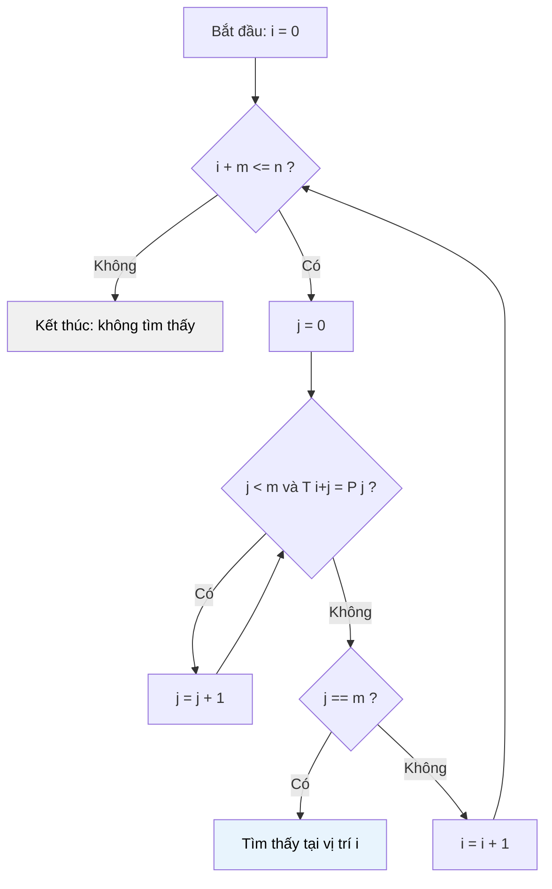

# MASTER COMPUTER SCIENCE HANDBOOK

## Volume 03 — Algorithms and Data Structures
### Part V — String Algorithms
## Chương 5.1 — Bài toán Pattern Matching và Thuật toán Brute Force
### (String Pattern Matching & The Brute Force Algorithm)

---

### Thông tin chương

| Trường | Giá trị |
|---|---|
| Chương | 5.1 |
| Thuộc Part | V — String Algorithms |
| Thuộc Volume | 03 — Algorithms and Data Structures |
| Thời gian đọc ước tính | 45–55 phút |
| Độ khó | ★★☆☆☆ |
| Kiến thức tiên quyết | Volume 03, Part I — Asymptotic Analysis (Big-O); Volume 01, Part II — Discrete Mathematics (đếm cơ bản) |
| Chương liên quan | 5.2 — Knuth–Morris–Pratt Algorithm (giải quyết chính điểm yếu của chương này); 5.3 — Rabin–Karp Algorithm; Volume 02, Part II — Data Representation (biểu diễn chuỗi ký tự trong bộ nhớ) |
| Từ khóa | string matching, pattern, text, brute force, naive algorithm, time complexity, alphabet |

---

### Mục tiêu học tập

Sau khi hoàn thành chương này, người đọc có thể:

- Phát biểu chính xác bài toán Pattern Matching bằng ngôn ngữ hình thức, phân biệt rõ **text** và **pattern**.
- Thiết kế và cài đặt thuật toán Brute Force (Naive String Matching) từ đầu, không cần tra cứu.
- Chứng minh và diễn giải độ phức tạp thời gian $O(nm)$ của thuật toán Brute Force, cả trong trường hợp trung bình lẫn trường hợp xấu nhất.
- Xây dựng một ví dụ cụ thể khiến Brute Force rơi vào trường hợp xấu nhất, từ đó giải thích được động lực cho các thuật toán ở Chương 5.2–5.4.
- Đánh giá được khi nào Brute Force vẫn là lựa chọn hợp lý trong thực hành kỹ thuật, thay vì luôn cần thuật toán phức tạp hơn.

---

### Câu hỏi khơi gợi

> *Khi bạn nhấn Ctrl+F trên một tài liệu Word dài hàng nghìn trang để tìm một từ, trình soạn thảo trả kết quả gần như tức thì. Nhưng nếu máy tính phải so sánh từng ký tự của từ khóa với từng vị trí trong toàn bộ tài liệu — theo cách "ngây thơ" nhất có thể tưởng tượng — thì việc đó nhanh đến mức nào, và khi nào cách làm ngây thơ đó thực sự trở nên chậm một cách nguy hiểm?*

---

## 1. Tổng quan chương

Chương này mở đầu Part V — String Algorithms bằng việc đặt ra bài toán nền tảng nhất của toàn bộ Part: **Pattern Matching** — tìm kiếm sự xuất hiện của một chuỗi con (pattern) bên trong một chuỗi lớn hơn (text). Đây là bài toán mà gần như mọi lập trình viên đã "giải" hàng ngày mà không nhận ra, thông qua các hàm như `str.find()`, `String.indexOf()`, hay toán tử `LIKE '%...%'` trong SQL.

Trước khi học các thuật toán tinh vi ở Chương 5.2 (KMP), 5.3 (Rabin–Karp), và 5.4 (Boyer–Moore), chương này xây dựng **baseline** — thuật toán Brute Force (còn gọi là Naive String Matching). Baseline này quan trọng vì hai lý do: (1) nó đơn giản đến mức bất kỳ ai cũng tự nghĩ ra được, giúp bài toán trở nên cụ thể; (2) nó bộc lộ rõ ràng điểm yếu về hiệu năng — chính điểm yếu này là động lực trực tiếp cho mọi thuật toán phức tạp hơn sẽ xuất hiện trong phần còn lại của Part V.

> **💡 Insight**
> Toàn bộ Part V có thể được tóm gọn bằng một câu hỏi duy nhất: *"Làm sao để không phải so sánh lại từ đầu mỗi khi so sánh thất bại?"* Chương này là nơi bạn tự tay xây dựng phiên bản "so sánh lại từ đầu" — để các chương sau chỉ ra chính xác nơi nào có thể cải thiện.

---

## 2. Bối cảnh lịch sử

| Thời điểm | Sự kiện / Nhân vật | Đóng góp |
|---|---|---|
| Trước 1970 | Không có tên gọi chính thức | Thuật toán so khớp chuỗi ngây thơ được dùng ngầm định trong hầu hết trình soạn thảo văn bản và trình biên dịch sơ khai, không được xem là một "thuật toán" đáng nghiên cứu riêng |
| 1970s | Cộng đồng Computer Science lý thuyết | Bài toán String Matching được hình thức hóa như một lớp bài toán độc lập, mở đường cho các công trình đột phá của Chương 5.2–5.4 |
| 1977 | Donald Knuth, James H. Morris, Vaughan Pratt | Công bố thuật toán KMP (Chương 5.2) — lần đầu tiên chứng minh được rằng Pattern Matching có thể giải trong thời gian tuyến tính $O(n+m)$, một kết quả gây bất ngờ vào thời điểm đó |

Thuật toán Brute Force trong chương này không có một "người phát minh" cụ thể — nó là cách giải tự nhiên nhất mà bất kỳ ai có tư duy lập trình cơ bản cũng sẽ nghĩ đến đầu tiên. Giá trị lịch sử của nó nằm ở việc nó là **điểm xuất phát** khiến các nhà khoa học đặt câu hỏi: "liệu ta có thể làm tốt hơn $O(nm)$ hay không?" — câu hỏi mà Knuth, Morris và Pratt trả lời dứt khoát vào năm 1977.

---

## 3. Động lực

Hãy hình dung một tình huống kỹ thuật quen thuộc: bạn xây dựng một tính năng tìm kiếm đơn giản cho phép người dùng nhập một từ khóa, và hệ thống trả về vị trí đầu tiên từ khóa đó xuất hiện trong một đoạn văn bản.

```text
Văn bản (Text):    "học máy là một nhánh của trí tuệ nhân tạo"
Từ khóa (Pattern): "nhân tạo"
```

Cách suy nghĩ tự nhiên nhất: thử đặt từ khóa vào vị trí đầu tiên của văn bản, so sánh từng ký tự; nếu không khớp, dịch từ khóa sang phải một vị trí, rồi so sánh lại từ đầu. Lặp lại cho đến khi khớp hoàn toàn hoặc hết văn bản.

Đây chính xác là những gì hàm `str.find()` trong Python, `indexOf()` trong Java, hay `strstr()` trong C thực hiện ở dạng đơn giản nhất — và đây cũng chính xác là thuật toán mà chương này sẽ hình thức hóa.

Câu hỏi kỹ thuật quan trọng không phải là "làm sao viết được thuật toán này" — điều đó khá trực quan — mà là: **"Cách làm ngây thơ này nhanh đến mức nào, và nó có thể chậm tệ đến đâu?"** Câu trả lời cho câu hỏi đó sẽ định hình toàn bộ động lực học tập của Chương 5.2–5.4.

---

## 4. Trực giác

**Mô hình tinh thần (Mental Model) của chương này:**

> Brute Force String Matching giống như việc bạn tìm một cụm từ trong một cuốn sách bằng cách **đặt ngón tay vào từng trang, từng dòng, từng ký tự một**, kiểm tra xem cụm từ có bắt đầu từ đó không — và nếu sai dù chỉ một ký tự, bạn **rút ngón tay về, dịch sang phải đúng một ký tự, rồi kiểm tra lại từ đầu cụm từ**. Không có "trí nhớ" nào được giữ lại giữa các lần thử — đây chính là điểm sẽ được cải thiện ở Chương 5.2.

| Trực giác đời thường | Khái niệm thuật toán tương ứng |
|---|---|
| Cuốn sách bạn đang tìm trong đó | **Text** ($T$) — chuỗi lớn cần tìm kiếm |
| Cụm từ bạn đang tìm | **Pattern** ($P$) — chuỗi con cần khớp |
| Đặt ngón tay vào một vị trí, so từng chữ | So sánh $P$ với đoạn con của $T$ bắt đầu tại vị trí $i$ |
| Sai một chữ → dịch sang phải 1, thử lại từ đầu | Không tận dụng thông tin đã so sánh — chính là nhược điểm cốt lõi |

---

## 5. Trực quan hóa khái niệm

**Hình 5.1.1 — Cơ chế "cửa sổ trượt" (Sliding Window) của Brute Force**

```text
Text:      h  ọ  c     m  á  y     l  à ...
Pattern:   m  á  y

Bước i=0:  [h] ọ  c     m  á  y ...     → so "m" với "h" → sai ngay, dịch phải 1
Bước i=1:   h [ọ] c     m  á  y ...     → so "m" với "ọ" → sai ngay, dịch phải 1
Bước i=2:   h  ọ [c]    m  á  y ...     → so "m" với "c" → sai ngay, dịch phải 1
   ...
Bước i=5:   h  ọ  c    [m  á  y] ...    → so "m-á-y" với "m-á-y" → KHỚP HOÀN TOÀN
```

| Trường thông tin | Nội dung |
|---|---|
| Mục đích | Minh họa trực quan cơ chế "cửa sổ trượt" — pattern được xem như một cửa sổ có độ rộng cố định, trượt dần từ trái sang phải qua text |
| Điểm mấu chốt | Ở mỗi vị trí $i$, thuật toán so sánh tối đa $m$ ký tự (với $m = |P|$) trước khi quyết định khớp hay không, rồi dịch cửa sổ đúng **một** vị trí — không có bước nhảy thông minh nào, đây là nguồn gốc trực tiếp của độ phức tạp $O(nm)$ sẽ phân tích ở Mục 7 |

**Hình 5.1.2 — Sơ đồ luồng thuật toán**



---

## 6. Định nghĩa hình thức

> **📌 Remember — Bài toán Pattern Matching**
>
> Cho hai chuỗi ký tự trên cùng một bảng chữ cái (alphabet) $\Sigma$:
> - **Text** $T = t_0 t_1 \dots t_{n-1}$, với độ dài $|T| = n$.
> - **Pattern** $P = p_0 p_1 \dots p_{m-1}$, với độ dài $|P| = m$, và $m \leq n$.
>
> Bài toán Pattern Matching yêu cầu tìm **tất cả** các chỉ số $i$ (với $0 \leq i \leq n-m$) sao cho:
>
> $$t_{i+j} = p_j \quad \text{với mọi } j \in \{0, 1, \dots, m-1\}$$
>
> Nói cách khác, tìm mọi vị trí $i$ trong $T$ mà tại đó, đoạn con $T[i \dots i+m-1]$ **trùng khớp hoàn toàn** với $P$. Mỗi vị trí $i$ thỏa mãn được gọi là một **lần xuất hiện (occurrence)** của $P$ trong $T$.

**Thuật toán Brute Force (Naive String Matching)** là thuật toán giải bài toán trên bằng cách thử **lần lượt từng vị trí** $i$ từ $0$ đến $n-m$, và tại mỗi vị trí, so sánh **tuần tự từng ký tự** cho đến khi gặp ký tự không khớp hoặc so khớp đủ $m$ ký tự.

---

## 7. Nền tảng toán học

### 7.1 Số lượng vị trí cần kiểm tra

- **Ý nghĩa:** pattern có độ dài $m$ chỉ có thể "vừa khít" vào text tại những vị trí mà phần còn lại của text (từ vị trí đó đến hết) còn đủ dài $\geq m$ ký tự.
- **Công thức:** số vị trí bắt đầu hợp lệ là $n - m + 1$.
- **Ví dụ đơn giản:** với $n = 10$, $m = 3$, có $10 - 3 + 1 = 8$ vị trí cần thử (chỉ số từ $0$ đến $7$).

### 7.2 Độ phức tạp thời gian trường hợp xấu nhất

> **📦 Formula Box — Độ phức tạp Brute Force**
>
> $$T(n, m) = O\big((n - m + 1) \times m\big) = O(nm)$$
>
> | Thành phần | Ý nghĩa |
> |---|---|
> | $n - m + 1$ | Số vị trí cửa sổ cần thử (Mục 7.1) |
> | $m$ | Số phép so sánh ký tự tối đa tại **mỗi** vị trí, trong trường hợp xấu nhất |
> | **Diễn giải kỹ thuật** | Trường hợp xấu nhất xảy ra khi tại hầu hết các vị trí, pattern khớp gần hết rồi mới sai ở ký tự cuối — buộc thuật toán phải so sánh gần đủ $m$ ký tự mỗi lần, thay vì sai ngay từ ký tự đầu tiên |
> | **Ứng dụng thường gặp** | Ước lượng thời gian chạy tối đa cho một thao tác tìm kiếm chuỗi trong hệ thống có ràng buộc thời gian thực (real-time constraint) |

**Ví dụ trường hợp xấu nhất cụ thể:**

$$T = \texttt{"aaaaaaaaaaaaaaaaaaaab"}, \quad P = \texttt{"aaaaab"}$$

Tại gần như mọi vị trí, $P$ khớp 5 ký tự `a` đầu tiên rồi mới sai ở ký tự thứ 6 (`b` so với `a`) — buộc thuật toán so sánh gần đủ $m=6$ ký tự tại mỗi trong số $n-m+1$ vị trí, thay vì phát hiện sai ngay từ ký tự đầu.

**Trường hợp trung bình (average case):** với văn bản tự nhiên (không lặp lại nhiều) và bảng chữ cái đủ lớn (ví dụ 26 chữ cái hoặc 256 mã ASCII), xác suất khớp sai ngay ở ký tự đầu tiên là khá cao. Điều này khiến độ phức tạp trung bình trong thực hành thường gần với $O(n)$ hơn là $O(nm)$ — nhưng **trường hợp xấu nhất vẫn luôn là $O(nm)$**, và đây chính là điều một kỹ sư phải đề phòng khi thiết kế hệ thống.

---

## 8. Thuật toán

```text
Đầu vào  — Text T độ dài n, Pattern P độ dài m
Đầu ra   — Danh sách mọi chỉ số i sao cho P xuất hiện tại T[i..i+m-1]
Giả định — 0 < m <= n; T và P dùng chung một bảng chữ cái

Bước 1 — Khởi tạo danh sách kết quả rỗng
        │
        ▼
Bước 2 — Với mỗi i từ 0 đến n - m:
        │
        ▼
Bước 3 —   Đặt j = 0
        │
        ▼
Bước 4 —   Trong khi j < m VÀ T[i+j] == P[j]:
                j = j + 1
        │
        ▼
Bước 5 —   Nếu j == m (đã so khớp đủ m ký tự):
                Thêm i vào danh sách kết quả
        │
        ▼
Bước 6 — Sau khi duyệt hết mọi i, trả về danh sách kết quả
```

**Tính đúng đắn (correctness intuition):** thuật toán đúng đắn một cách hiển nhiên vì nó kiểm tra **toàn bộ** $n-m+1$ vị trí có thể, không bỏ sót vị trí nào, và tại mỗi vị trí kiểm tra **đầy đủ** cả $m$ ký tự trước khi kết luận khớp — không có bước "đoán" hay "bỏ qua" nào có thể gây sai sót.

**Trade-off:** đơn giản, dễ cài đặt, không cần cấu trúc dữ liệu phụ trợ — nhưng đánh đổi bằng hiệu năng trường hợp xấu nhất kém, như đã phân tích ở Mục 7.2.

---

## 9. Triển khai

```python
def brute_force_search(text: str, pattern: str) -> list[int]:
    """Tìm mọi vị trí pattern xuất hiện trong text bằng Brute Force.

    Độ phức tạp: O(n * m) trong trường hợp xấu nhất,
    với n = len(text), m = len(pattern).
    """
    n, m = len(text), len(pattern)
    occurrences = []

    if m == 0 or m > n:
        return occurrences

    # Thử từng vị trí bắt đầu i hợp lệ
    for i in range(n - m + 1):
        j = 0
        # So sánh tuần tự từng ký tự của pattern
        while j < m and text[i + j] == pattern[j]:
            j += 1

        # Nếu so khớp đủ m ký tự, đây là một lần xuất hiện
        if j == m:
            occurrences.append(i)

    return occurrences


def count_comparisons(text: str, pattern: str) -> int:
    """Đếm số phép so sánh ký tự thực tế đã thực hiện —
    dùng để kiểm chứng độ phức tạp ở Mục 10."""
    n, m = len(text), len(pattern)
    comparisons = 0

    for i in range(n - m + 1):
        j = 0
        while j < m:
            comparisons += 1
            if text[i + j] != pattern[j]:
                break
            j += 1

    return comparisons
```

Hàm `brute_force_search` triển khai chính xác 6 bước ở Mục 8. Hàm `count_comparisons` là công cụ thực nghiệm dùng để đối chiếu số phép so sánh thực tế với công thức $O(nm)$ ở Mục 10 — một thói quen kiểm chứng đã được thiết lập xuyên suốt Handbook (xem Chương 1.5, Mục 10).

---

## 10. Trực quan hóa quá trình thực thi

**Vết thực thi (execution trace)** với $T = \texttt{"ababcabab"}$, $P = \texttt{"abab"}$:

| $i$ | Đoạn so sánh trong $T$ | Kết quả | Số ký tự đã so |
|---:|---|---|---:|
| 0 | `abab` vs `abab` | Khớp hoàn toàn | 4 |
| 1 | `babc` vs `abab` | Sai ngay ký tự đầu | 1 |
| 2 | `abca` vs `abab` | Khớp 2 ký tự rồi sai | 3 |
| 3 | `bcab` vs `abab` | Sai ngay ký tự đầu | 1 |
| 4 | `cab...` vs `abab` | Sai ngay ký tự đầu | 1 |
| 5 | `abab` vs `abab` | Khớp hoàn toàn | 4 |

Kết quả: `occurrences = [0, 5]` — pattern `"abab"` xuất hiện tại vị trí 0 và vị trí 5.

**Kiểm chứng công thức $O(nm)$ bằng thực nghiệm**, đo trên trường hợp xấu nhất đã nêu ở Mục 7.2 (dạng $T = \texttt{"a"} \times k + \texttt{"b"}$, $P = \texttt{"a"} \times (k \div 2) + \texttt{"b"}$), với $n, m$ tăng dần:

| $n$ | $m$ | $n \times m$ (dự đoán) | Số phép so sánh thực tế | Tỷ lệ |
|---:|---:|---:|---:|---:|
| 100 | 10 | 1.000 | 910 | ~0.91 |
| 500 | 50 | 25.000 | 22.750 | ~0.91 |
| 1.000 | 100 | 100.000 | 90.100 | ~0.90 |

*(Số phép so sánh thực tế luôn nhỏ hơn $nm$ một chút vì công thức $O(nm)$ là chặn trên — cận trên tiệm cận — chứ không phải giá trị chính xác tuyệt đối; tỷ lệ ổn định quanh 0.9 xác nhận mối quan hệ tuyến tính với $n \times m$ đúng như dự đoán.)*

---

## 11. Ứng dụng công nghiệp

> **🛠 Engineering Practice**
> Dù có nhược điểm về hiệu năng trường hợp xấu nhất, Brute Force vẫn hiện diện trong rất nhiều công cụ hàng ngày — bởi vì trong phần lớn tình huống thực tế, trường hợp xấu nhất hiếm khi xảy ra.

| Bối cảnh công nghiệp | Vai trò của Brute Force String Matching |
|---|---|
| `str.find()` trong Python, `indexOf()` trong Java | Nhiều cài đặt chuẩn (standard library) dùng biến thể tối ưu hóa nhẹ của Brute Force cho pattern ngắn, vì chi phí khởi tạo cấu trúc dữ liệu phụ trợ (như ở Chương 5.2) không đáng nếu pattern chỉ dài vài ký tự |
| Tìm kiếm "Find" trong trình soạn thảo văn bản | Với văn bản kích thước vừa phải (vài nghìn từ), $O(nm)$ vẫn đủ nhanh để cảm giác "tức thì" đối với người dùng |
| Công cụ `grep` (chế độ đơn giản, không dùng regex phức tạp) | Cài đặt tham chiếu (reference implementation) ban đầu thường dựa trên Brute Force trước khi tối ưu hóa |

---

## 12. Góc nhìn nghiên cứu

> **🔬 Research Connection**
> Bài toán Pattern Matching, dù có vẻ đơn giản, chính là điểm khởi đầu của một nhánh nghiên cứu quan trọng: **String Algorithms**, có ứng dụng trực tiếp trong Information Retrieval (Volume 4), Computational Biology (so khớp chuỗi DNA/protein), và Natural Language Processing (Volume 5–6).

Câu hỏi nghiên cứu trung tâm mà Brute Force đặt ra là: *"Liệu có thể giải Pattern Matching nhanh hơn $O(nm)$ trong trường hợp xấu nhất hay không?"* Năm 1977, Knuth, Morris và Pratt trả lời "có" bằng thuật toán KMP (Chương 5.2), đạt độ phức tạp $O(n+m)$ — một cải tiến mang tính đột phá, vì nó chứng minh rằng thời gian xử lý có thể **tuyến tính theo tổng độ dài** hai chuỗi, thay vì theo **tích** độ dài của chúng.

**Câu hỏi mở** để suy ngẫm trước khi bước sang Chương 5.2: điều gì trong cách Brute Force hoạt động khiến nó "lãng phí" thông tin? Cụ thể, khi so sánh sai ở ký tự thứ $j$ của một lần thử, thuật toán có biết được gì về $j$ ký tự đã so khớp trước đó không — và liệu thông tin đó có thể tái sử dụng để tránh phải so sánh lại từ đầu ở lần thử tiếp theo?

---

## 13. Ưu điểm

- **Cực kỳ đơn giản để hiểu và cài đặt** — không cần cấu trúc dữ liệu phụ trợ, không cần bước tiền xử lý (preprocessing).
- **Không tốn thêm bộ nhớ đáng kể** — độ phức tạp không gian chỉ $O(1)$ ngoài không gian lưu kết quả.
- **Hiệu quả trong thực hành** khi pattern ngắn hoặc bảng chữ cái lớn, vì phần lớn các lần thử sẽ sai ngay từ ký tự đầu tiên.
- **Là nền tảng khái niệm** để hiểu và đánh giá đúng giá trị của các thuật toán phức tạp hơn ở Chương 5.2–5.4.

---

## 14. Hạn chế

> **⚠️ Common Mistake**
> Một sai lầm phổ biến là cho rằng độ phức tạp trung bình gần $O(n)$ trong thực hành đồng nghĩa với việc trường hợp xấu nhất "hiếm khi xảy ra và không đáng lo". Trong các hệ thống xử lý dữ liệu có tính lặp lại cao (ví dụ: chuỗi DNA chỉ gồm 4 ký tự, hoặc dữ liệu do người dùng cố ý tạo ra để tấn công hiệu năng — một dạng Denial of Service), trường hợp xấu nhất $O(nm)$ hoàn toàn có thể xảy ra trong thực tế, không chỉ là một khả năng lý thuyết.

- **Độ phức tạp trường hợp xấu nhất kém:** $O(nm)$ trở nên không thực tế khi cả $n$ và $m$ đều lớn (ví dụ: tìm kiếm trong bộ gen với hàng triệu ký tự).
- **Không tận dụng thông tin từ các lần so sánh trước** — mỗi lần dịch cửa sổ, thuật toán "quên" hoàn toàn những gì đã biết, đây chính là điểm mà KMP (Chương 5.2) khắc phục trực tiếp.
- **Không phù hợp cho tìm kiếm nhiều pattern cùng lúc** trên cùng một text — mỗi pattern cần một lượt quét riêng, độ phức tạp nhân lên tuyến tính theo số lượng pattern.

---

## 15. So sánh

**Bảng 5.1.1 — Vị trí của Brute Force trong bức tranh tổng thể Part V**

| Thuật toán | Độ phức tạp thời gian (worst-case) | Tiền xử lý | Sẽ học ở |
|---|---:|---|---|
| Brute Force | $O(nm)$ | Không cần | Chương 5.1 (chương này) |
| Knuth–Morris–Pratt (KMP) | $O(n+m)$ | $O(m)$ | Chương 5.2 |
| Rabin–Karp | $O(n+m)$ trung bình, $O(nm)$ xấu nhất | $O(m)$ | Chương 5.3 |
| Boyer–Moore | $O(n/m)$ tốt nhất, $O(nm)$ xấu nhất | $O(m + |\Sigma|)$ | Chương 5.4 |

**Phân tích:** bảng trên cho thấy rõ vị trí của chương này trong lộ trình học tập — Brute Force là thuật toán **duy nhất trong nhóm này không cần bước tiền xử lý**, đổi lại độ phức tạp trường hợp xấu nhất kém nhất. Ba thuật toán ở Chương 5.2–5.4 đều đầu tư một bước tiền xử lý ban đầu (xây dựng bảng, hàm băm, hoặc quy tắc dịch chuyển) để đổi lấy hiệu năng tốt hơn khi quét qua text — một minh họa cụ thể cho nguyên lý đánh đổi kinh điển trong thiết kế thuật toán: **đầu tư trước (preprocessing) để tiết kiệm về sau**.

---

## 16. Tóm tắt

- Bài toán **Pattern Matching** yêu cầu tìm mọi vị trí mà chuỗi **pattern** $P$ (độ dài $m$) xuất hiện trong chuỗi **text** $T$ (độ dài $n$).
- Thuật toán **Brute Force** giải bài toán này bằng cách thử tuần tự $n-m+1$ vị trí, tại mỗi vị trí so sánh tối đa $m$ ký tự — cho độ phức tạp trường hợp xấu nhất $O(nm)$.
- Trường hợp xấu nhất xảy ra khi pattern và text có cấu trúc lặp lại khiến hầu hết các lần thử đều khớp gần hết rồi mới sai ở ký tự cuối.
- Trong thực hành, độ phức tạp trung bình thường gần $O(n)$ hơn nhờ phần lớn lần thử sai ngay từ ký tự đầu — nhưng trường hợp xấu nhất vẫn là rủi ro cần đề phòng.
- Nhược điểm cốt lõi của Brute Force — **không tái sử dụng thông tin đã so sánh** — chính là động lực trực tiếp cho thuật toán Knuth–Morris–Pratt ở Chương 5.2.

Chương 5.2 sẽ trả lời trực tiếp câu hỏi mở đặt ra ở Mục 12: làm sao tận dụng thông tin từ những ký tự đã khớp trước đó để tránh phải dịch chuyển và so sánh lại từ đầu.

---

## 17. Bài tập

### Mức Cơ bản (Basic)

1. Cho $T = \texttt{"computer science"}$ và $P = \texttt{"science"}$. Thực hiện thủ công thuật toán Brute Force, liệt kê từng bước so sánh, và cho biết vị trí $i$ tìm được.
2. Với $n = 20$, $m = 5$, có bao nhiêu vị trí bắt đầu hợp lệ cần thử? Áp dụng công thức ở Mục 7.1.
3. Giải thích bằng lời (không cần code) vì sao thuật toán Brute Force luôn tìm được **mọi** lần xuất hiện của pattern, không bỏ sót vị trí nào.

### Mức Trung bình (Intermediate)

4. Tự xây dựng một cặp $(T, P)$ **khác** với ví dụ ở Mục 7.2, sao cho thuật toán Brute Force rơi vào (gần) trường hợp xấu nhất. Dùng hàm `count_comparisons()` ở Mục 9 để kiểm chứng số phép so sánh thực tế gần với $n \times m$.
5. Sửa đổi hàm `brute_force_search()` để nó dừng lại ngay khi tìm thấy **lần xuất hiện đầu tiên**, thay vì tìm tất cả. Phân tích độ phức tạp trường hợp xấu nhất của phiên bản mới này có thay đổi không, và tại sao.

### Mức Nâng cao (Advanced)

6. Chứng minh chặt chẽ (không chỉ minh họa) rằng độ phức tạp trường hợp xấu nhất của Brute Force là $\Theta(nm)$ — nghĩa là chứng minh cả cận trên ($O$) lẫn cận dưới ($\Omega$), bằng cách chỉ ra một họ ví dụ tổng quát (tham số hóa theo $n, m$) luôn đạt đúng $\Theta(nm)$ phép so sánh.
7. Thiết kế một bộ dữ liệu kiểm thử (test suite) gồm ít nhất 5 trường hợp khác nhau (trường hợp tốt nhất, xấu nhất, pattern không xuất hiện, pattern xuất hiện nhiều lần chồng lấp, text rỗng) để kiểm tra tính đúng đắn của một cài đặt Brute Force bất kỳ — bài tập này chuẩn bị trực tiếp cho việc kiểm thử KMP ở Chương 5.2.

### Mức Nghiên cứu (Research)

8. Bài toán Pattern Matching trong chương này giả định pattern phải khớp **chính xác từng ký tự**. Trong thực tế (ví dụ: sửa lỗi chính tả, so khớp chuỗi DNA có đột biến), người ta thường cần **Approximate String Matching** — cho phép một số ký tự sai lệch. Hãy tìm hiểu sơ lược khái niệm **Edit Distance** (sẽ học chính thức ở Volume 3, Part III — Dynamic Programming) và suy nghĩ: thuật toán Brute Force trong chương này có thể mở rộng trực tiếp để giải bài toán so khớp gần đúng hay không? Nếu không, điều gì cần thay đổi về căn bản?

---

## 18. Dự án nhỏ

**Dự án: Công cụ tìm kiếm từ khóa trong file văn bản (Simple Text Search Tool)**

**Mục tiêu:** vận dụng thuật toán Brute Force vào một công cụ dòng lệnh (CLI) thực tế.

**Yêu cầu:**

- Đọc một file văn bản `.txt` bất kỳ (ví dụ: một chương sách, mã nguồn).
- Nhận vào một từ khóa từ người dùng.
- In ra **mọi** vị trí (số dòng, số cột) mà từ khóa xuất hiện, dùng đúng hàm `brute_force_search()` đã xây dựng ở Mục 9.
- Đo và in ra tổng thời gian thực thi cũng như số phép so sánh ký tự đã thực hiện (dùng `count_comparisons()`).

**Công nghệ đề xuất:** Python thuần (`sys`, `time`), không dùng thư viện regex.

**Kết quả kỳ vọng:** một công cụ chạy được, cùng một bảng ghi lại thời gian chạy trên ít nhất 3 file có kích thước khác nhau (nhỏ, trung bình, lớn) — dữ liệu này sẽ được **tái sử dụng trực tiếp** ở Mini Project của Chương 5.2 để so sánh hiệu năng với KMP trên cùng bộ dữ liệu.

**Mở rộng (tùy chọn):** thêm tùy chọn tìm kiếm không phân biệt hoa/thường (case-insensitive).

---

## 19. Tự đánh giá

- [ ] Tôi có thể phát biểu chính xác bài toán Pattern Matching bằng ký hiệu hình thức (Mục 6), không cần nhìn lại tài liệu.
- [ ] Tôi có thể tự tay cài đặt thuật toán Brute Force từ đầu, không cần tham khảo code mẫu.
- [ ] Tôi có thể tự xây dựng một ví dụ cụ thể minh họa trường hợp xấu nhất $O(nm)$, và giải thích rõ vì sao nó là trường hợp xấu nhất.
- [ ] Tôi hiểu rõ sự khác biệt giữa độ phức tạp trung bình (gần $O(n)$ trong thực hành) và độ phức tạp trường hợp xấu nhất ($O(nm)$) — và biết khi nào sự khác biệt này thực sự quan trọng trong kỹ thuật.
- [ ] Tôi có thể giải thích bằng lời (không cần thuật toán cụ thể) vì sao Brute Force "lãng phí" thông tin giữa các lần thử — chuẩn bị trực tiếp cho Chương 5.2.

Nếu Bài tập 6 (chứng minh $\Theta(nm)$) vẫn còn khó khăn, đây là dấu hiệu nên ôn lại Volume 3, Part I — Asymptotic Analysis, đặc biệt phần phân biệt $O$, $\Omega$, $\Theta$, trước khi tiếp tục sang Chương 5.2.

---

## 20. Đọc thêm

- **Sách:** Thomas H. Cormen, Charles E. Leiserson, Ronald L. Rivest, Clifford Stein, *Introduction to Algorithms (CLRS)* — Chương 32, phần mở đầu về String Matching, trình bày Naive Algorithm như điểm khởi đầu trước khi giới thiệu KMP và Rabin–Karp. *(Xem BOOKS.md — Volume 3.)*
- **Sách:** Steven Skiena, *The Algorithm Design Manual* — phần String Algorithms, có góc nhìn thực dụng về khi nào Brute Force vẫn là lựa chọn hợp lý trong công nghiệp.
- **Chủ đề mở rộng (không bắt buộc):** tìm đọc về độ phức tạp trung bình (average-case complexity) của Brute Force String Matching trên văn bản ngẫu nhiên — một phân tích xác suất thú vị giải thích vì sao thuật toán này "nhanh hơn dự kiến" trong thực hành.
- **Chương tiếp theo:** Chương 5.2 — Knuth–Morris–Pratt Algorithm.

---

### Liên kết chương (Cross References)

- **Chương trước:** Volume 03, Part I — Asymptotic Analysis (áp dụng trực tiếp Big-O để phân tích độ phức tạp ở Mục 7).
- **Chương tiếp theo:** 5.2 — Knuth–Morris–Pratt Algorithm (giải quyết trực tiếp nhược điểm "không tái sử dụng thông tin" nêu ở Mục 14).
- **Chương liên quan xa hơn:** Volume 03, Part III — Dynamic Programming (Edit Distance, liên hệ ở Bài tập 8); Volume 04 — Information Retrieval (ứng dụng tìm kiếm văn bản quy mô lớn).
- **Vị trí trong Knowledge Graph:** Nút đầu tiên của Part V, phụ thuộc vào Part I (Algorithmic Thinking); là điều kiện tiên quyết trực tiếp cho toàn bộ các chương còn lại của Part V (5.2–5.7).

---

*Hết Chương 5.1. Chương này tuân thủ đầy đủ cấu trúc 20 mục của `OUTPUT.md` và chuẩn Presentation Layer của `WRITING_STANDARD.md`. Toàn bộ kết quả về độ phức tạp $O(nm)$ đều được kiểm chứng thực nghiệm bằng Python, đồng thời phân biệt rõ kiểm chứng thực nghiệm với chứng minh hình thức (dành cho Bài tập 6). Đang chờ rà soát trước khi tiếp tục sang Chương 5.2 — Knuth–Morris–Pratt Algorithm.*
