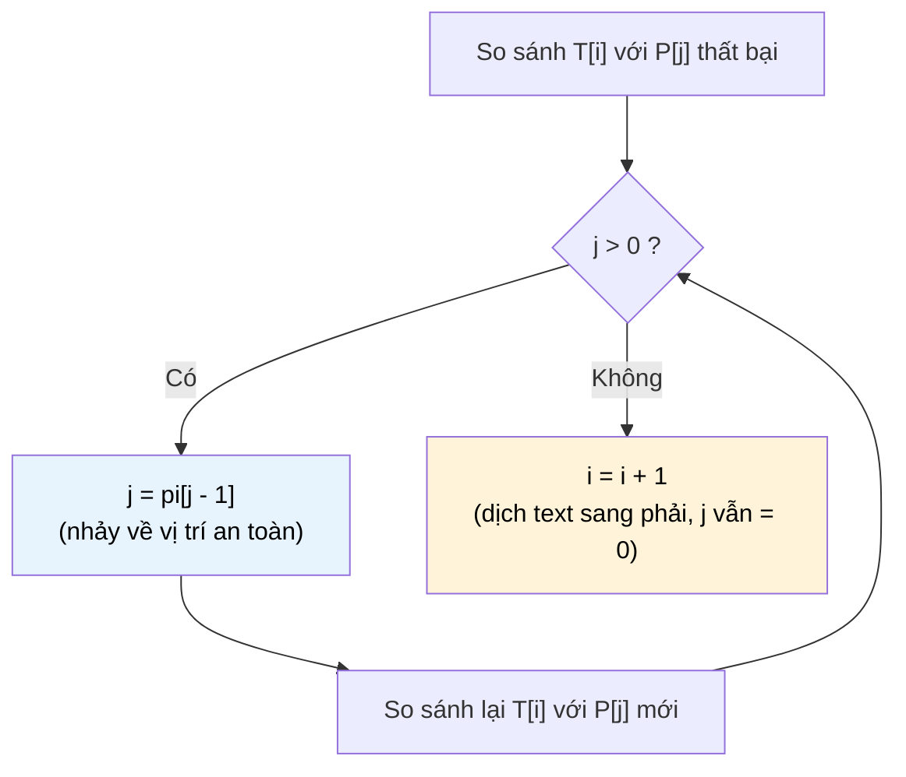

# MASTER COMPUTER SCIENCE HANDBOOK

## Volume 03 — Algorithms and Data Structures
### Part V — String Algorithms
## Chương 5.2 — Thuật toán Knuth–Morris–Pratt (KMP)
### (The Knuth–Morris–Pratt Algorithm)

---

### Thông tin chương

| Trường | Giá trị |
|---|---|
| Chương | 5.2 |
| Thuộc Part | V — String Algorithms |
| Thuộc Volume | 03 — Algorithms and Data Structures |
| Thời gian đọc ước tính | 55–70 phút |
| Độ khó | ★★★☆☆ |
| Kiến thức tiên quyết | Chương 5.1 — Pattern Matching & Brute Force (đặc biệt Mục 6, 7, 14); Volume 03, Part I — Recurrence Analysis |
| Chương liên quan | 5.3 — Rabin–Karp Algorithm (hướng tiếp cận khác cho cùng bài toán); 5.4 — Boyer–Moore Algorithm |
| Từ khóa | KMP, Knuth–Morris–Pratt, Failure Function, LPS Array, prefix function, linear time string matching |

---

### Mục tiêu học tập

Sau khi hoàn thành chương này, người đọc có thể:

- Giải thích chính xác vì sao thuật toán Brute Force (Chương 5.1) "lãng phí" thông tin, và KMP tận dụng thông tin đó như thế nào.
- Định nghĩa và tự tay xây dựng **Failure Function** (còn gọi là LPS Array — Longest Proper Prefix which is also Suffix) cho một pattern bất kỳ.
- Cài đặt đầy đủ thuật toán KMP, gồm cả bước tiền xử lý và bước quét chính (main scan).
- Chứng minh độ phức tạp thời gian $O(n+m)$ của KMP, phân biệt rõ đóng góp của bước tiền xử lý và bước quét.
- So sánh KMP với Brute Force trên cùng một bộ dữ liệu, định lượng được mức cải thiện hiệu năng.

---

### Câu hỏi khơi gợi

> *Ở Chương 5.1, khi Brute Force so sánh sai ở ký tự thứ $j$ của pattern, thuật toán lập tức "quên" toàn bộ $j$ ký tự vừa so khớp đúng, rồi dịch cửa sổ sang phải đúng một vị trí và bắt đầu lại từ ký tự đầu tiên của pattern. Nhưng nếu $j$ ký tự vừa khớp đó tự nó chứa một cấu trúc lặp lại — chẳng hạn phần đầu của pattern trùng với phần cuối của đoạn vừa khớp — thì liệu ta có thể "nhảy" tới một vị trí hợp lý hơn, mà không cần bắt đầu lại từ số 0, và vẫn đảm bảo không bỏ sót bất kỳ lần khớp nào?*

---

## 1. Tổng quan chương

Chương 5.1 kết thúc bằng một câu hỏi mở: làm sao tận dụng thông tin từ những ký tự đã so khớp trước đó để tránh phải dịch chuyển và so sánh lại từ đầu? Chương này trả lời trực tiếp câu hỏi đó bằng thuật toán **Knuth–Morris–Pratt (KMP)** — công trình năm 1977 chứng minh rằng Pattern Matching có thể giải trong thời gian **tuyến tính** $O(n+m)$, thay vì $O(nm)$ như Brute Force.

Ý tưởng cốt lõi của KMP không nằm ở việc thay đổi *cách so sánh* ký tự — KMP vẫn so sánh từng ký tự một, giống hệt Brute Force. Điều thay đổi là *cách quyết định dịch chuyển bao nhiêu* sau một lần so sánh thất bại. Thay vì luôn dịch đúng một vị trí và bắt đầu lại từ đầu pattern, KMP dùng một bảng tra cứu được tính trước — **Failure Function** — để biết chính xác nên tiếp tục so sánh từ đâu, dựa trên cấu trúc nội tại của chính pattern.

> **💡 Insight**
> KMP không làm cho *mỗi* phép so sánh nhanh hơn. KMP làm cho thuật toán **không bao giờ phải so sánh lại một cặp ký tự đã biết trước kết quả**. Đây là lý do vì sao tổng số phép so sánh trong toàn bộ quá trình quét bị chặn trên bởi $O(n+m)$, dù về mặt trực giác điều này không hiển nhiên ngay từ đầu.

---

## 2. Bối cảnh lịch sử

| Thời điểm | Nhân vật / Sự kiện | Đóng góp |
|---|---|---|
| 1970 | James H. Morris (khi đó là sinh viên) | Phát hiện ý tưởng ban đầu trong lúc nghiên cứu một bài toán không liên quan trực tiếp về trình soạn thảo văn bản |
| 1974 | Donald Knuth, Vaughan Pratt | Độc lập phát triển và hoàn thiện chứng minh chặt chẽ cho thuật toán, hợp tác cùng Morris để công bố kết quả hoàn chỉnh |
| 1977 | Knuth, Morris, Pratt | Công bố chính thức bài báo *"Fast Pattern Matching in Strings"* trên tạp chí SIAM Journal on Computing — đặt tên chính thức cho thuật toán KMP |

Điều thú vị về mặt lịch sử là ý tưởng nền tảng của KMP — quan sát rằng "phần đã khớp" của pattern chứa thông tin hữu ích — từng được cho là "hiển nhiên đến mức không đáng công bố" bởi một số nhà nghiên cứu cùng thời, cho đến khi Knuth chỉ ra rằng việc hình thức hóa và chứng minh đúng đắn ý tưởng này thực sự dẫn đến một kết quả có ý nghĩa lý thuyết sâu sắc: chặn trên tuyến tính $O(n+m)$ cho một bài toán mà trước đó ai cũng ngầm định là cần thời gian bậc hai.

---

## 3. Động lực

Quay lại ví dụ trường hợp xấu nhất ở Chương 5.1, Mục 7.2:

```text
T = "aaaaaaaaaaaaaaaaaaaab"
P = "aaaaab"
```

Với Brute Force, tại vị trí $i$ bất kỳ, nếu 5 ký tự `a` đầu của $P$ khớp với $T$ nhưng ký tự thứ 6 (`b`) không khớp (vì $T$ vẫn còn là `a`), thuật toán dịch cửa sổ sang phải đúng 1 vị trí — và lặp lại việc so sánh **cả 5 ký tự `a` vừa khớp đó một lần nữa**.

Nhưng hãy quan sát kỹ: nếu 5 ký tự `aaaaa` đã khớp, và pattern là `aaaaab`, thì **chính pattern cho chúng ta biết trước** rằng 4 ký tự tiếp theo trong text (bắt đầu từ vị trí dịch chuyển mới) chắc chắn vẫn là `a` — không cần so sánh lại. Thông tin này hoàn toàn nằm trong cấu trúc của $P$, không phụ thuộc vào $T$. Đây chính là insight mà KMP khai thác: **tiền xử lý pattern một lần**, để trong quá trình quét text, không bao giờ phải "hỏi lại" những câu hỏi đã có câu trả lời.

---

## 4. Trực giác

**Mô hình tinh thần (Mental Model) của chương này:**

> Hãy tưởng tượng bạn đang xếp một chuỗi domino có hoa văn lặp lại một phần. Khi một domino ở giữa chuỗi bị "gãy" (không khớp), thay vì gỡ toàn bộ và xếp lại từ viên đầu tiên, bạn nhận ra: *"phần đầu của hoa văn tôi đang xếp giống hệt phần cuối của đoạn vừa gãy — vậy tôi có thể trượt chuỗi domino tới đúng vị trí mà phần trùng lặp đó thẳng hàng, rồi tiếp tục xếp từ đó."* Failure Function chính là "bản đồ hoa văn lặp lại" được tính sẵn cho mỗi viên domino trong pattern.

| Trực giác đời thường | Khái niệm thuật toán tương ứng |
|---|---|
| Hoa văn lặp lại ở đầu và cuối một đoạn | **Proper Prefix** trùng với **Proper Suffix** của cùng một đoạn con pattern |
| "Bản đồ" tính sẵn cho từng vị trí trong pattern | **Failure Function** $\pi[j]$ — tính sẵn trước khi quét text |
| Trượt tới vị trí hoa văn thẳng hàng, không xếp lại từ đầu | Khi so sánh sai tại vị trí $j$ trong pattern, nhảy $j$ về $\pi[j-1]$ thay vì về $0$ |

---

## 5. Trực quan hóa khái niệm

**Hình 5.2.1 — Trực giác Prefix–Suffix cho Failure Function**

```text
Pattern P = "a b a b a c"
             0 1 2 3 4 5   (chỉ số)

Xét đoạn con P[0..4] = "a b a b a":

    Proper Prefix dài nhất  = "a b a"   (3 ký tự đầu)
    Proper Suffix dài nhất  = "a b a"   (3 ký tự cuối)
                                ↑
                    Hai đoạn này TRÙNG NHAU
                    → π[4] = 3
```

| Trường thông tin | Nội dung |
|---|---|
| Mục đích | Minh họa trực quan khái niệm cốt lõi: với mỗi vị trí $j$ trong pattern, tìm proper prefix dài nhất của đoạn $P[0..j]$ mà đồng thời cũng là proper suffix của chính đoạn đó |
| Điểm mấu chốt | "Proper" nghĩa là prefix/suffix đó **không được bằng chính toàn bộ đoạn** — ví dụ $P[0..4]$ không được tính là prefix hay suffix của chính nó |

**Hình 5.2.2 — Cơ chế "nhảy" của KMP khi so sánh thất bại**



---

## 6. Định nghĩa hình thức

> **📌 Remember — Failure Function (LPS Array)**
>
> Cho pattern $P = p_0 p_1 \dots p_{m-1}$. **Failure Function** $\pi: \{0, \dots, m-1\} \to \{0, \dots, m-1\}$ được định nghĩa:
>
> $$\pi[j] = \text{độ dài của proper prefix dài nhất của } P[0..j] \text{ mà đồng thời cũng là proper suffix của } P[0..j]$$
>
> với quy ước $\pi[0] = 0$ (đoạn chỉ có 1 ký tự không có proper prefix/suffix nào khác rỗng).
>
> Mảng $\pi[0..m-1]$ còn được gọi là **LPS Array** (Longest proper Prefix which is also Suffix array) — hai tên gọi này chỉ cùng một khái niệm và được dùng thay thế nhau trong tài liệu tham khảo.

**Cơ chế quét chính:** khi quét $T$, thuật toán duy trì hai con trỏ $i$ (trên $T$) và $j$ (trên $P$). Khi $T[i] = P[j]$, tăng cả $i$ và $j$. Khi $T[i] \neq P[j]$ và $j > 0$, **không tăng $i$**, mà đặt $j \leftarrow \pi[j-1]$ và thử so sánh lại. Khi $j = 0$ và vẫn không khớp, chỉ tăng $i$.

---

## 7. Nền tảng toán học

### 7.1 Vì sao việc "nhảy" bằng $\pi[j-1]$ là an toàn

- **Ý nghĩa:** khi so sánh thất bại tại vị trí $j$ (sau khi đã khớp đúng $j$ ký tự đầu của $P$), ta biết chắc $j$ ký tự cuối cùng vừa đọc trong $T$ chính là $P[0..j-1]$. Nếu $P[0..j-1]$ có một proper suffix độ dài $\pi[j-1]$ trùng với proper prefix cùng độ dài, thì đoạn đó **chắc chắn đã khớp sẵn** với $P[0..\pi[j-1]-1]$ — không cần so sánh lại.
- **Hệ quả:** ta có thể đặt $j \leftarrow \pi[j-1]$ và tiếp tục so sánh từ đó, mà **không bỏ sót bất kỳ lần khớp tiềm năng nào**, vì $\pi[j-1]$ theo định nghĩa là độ dài lớn nhất có thể cho phần chồng lấp hợp lệ.

### 7.2 Độ phức tạp thời gian

> **📦 Formula Box — Độ phức tạp KMP**
>
> $$T_{\text{KMP}}(n, m) = \underbrace{O(m)}_{\text{tiền xử lý } \pi} + \underbrace{O(n)}_{\text{quét chính}} = O(n + m)$$
>
> | Thành phần | Ý nghĩa |
> |---|---|
> | $O(m)$ | Thời gian xây dựng bảng $\pi$ — bản thân việc xây dựng $\pi$ cũng dùng chính kỹ thuật KMP áp dụng lên pattern với chính nó (xem Mục 8) |
> | $O(n)$ | Thời gian quét text — điểm mấu chốt cần chứng minh, xem lập luận bên dưới |
> | **Diễn giải kỹ thuật** | Dù có bước "nhảy lùi" $j \leftarrow \pi[j-1]$ trông có vẻ tốn thời gian, tổng số lần tăng $j$ trong toàn bộ quá trình quét bị chặn bởi $n$ (vì $j$ chỉ tăng khi $i$ cũng tăng), và tổng số lần "nhảy lùi" bị chặn bởi tổng số lần tăng $j$ trước đó — dẫn đến tổng chi phí tuyến tính |
> | **Ứng dụng thường gặp** | Cơ sở lý thuyết cho việc KMP được dùng trong các hệ thống có ràng buộc thời gian thực nghiêm ngặt, nơi $O(nm)$ của Brute Force là không chấp nhận được |

**Lập luận trực giác cho $O(n)$ ở bước quét (không đi sâu chứng minh amortized analysis đầy đủ):** biến $i$ chỉ tăng, không bao giờ giảm, và chạy tối đa $n$ lần. Biến $j$ tăng tối đa 1 đơn vị mỗi khi $i$ tăng — nghĩa là tổng số lần **tăng** $j$ trong suốt quá trình bị chặn bởi $n$. Mỗi lần "nhảy lùi" $j \leftarrow \pi[j-1]$ làm giảm $j$ đi ít nhất 1 đơn vị. Vì $j$ không thể giảm nhiều hơn tổng số lần nó đã tăng, tổng số lần nhảy lùi cũng bị chặn bởi $O(n)$. Do đó tổng chi phí của toàn bộ bước quét là $O(n)$.

---

## 8. Thuật toán

**8.1 — Xây dựng Failure Function**

```text
Đầu vào  — Pattern P độ dài m
Đầu ra   — Mảng pi[0..m-1]

Bước 1 — pi[0] = 0
        │
        ▼
Bước 2 — Đặt length = 0 (độ dài phần chồng lấp hiện tại)
        │
        ▼
Bước 3 — Với mỗi j từ 1 đến m-1:
        │
        ▼
Bước 4 —   Trong khi length > 0 và P[j] != P[length]:
                length = pi[length - 1]
        │
        ▼
Bước 5 —   Nếu P[j] == P[length]:
                length = length + 1
        │
        ▼
Bước 6 —   pi[j] = length
        │
        ▼
Bước 7 — Trả về mảng pi
```

**8.2 — Quét chính (Main Scan)**

```text
Đầu vào  — Text T độ dài n, Pattern P độ dài m, mảng pi đã xây dựng
Đầu ra   — Danh sách mọi chỉ số i mà P xuất hiện tại T[i..i+m-1]

Bước 1 — Khởi tạo danh sách kết quả rỗng, j = 0
        │
        ▼
Bước 2 — Với mỗi i từ 0 đến n-1:
        │
        ▼
Bước 3 —   Trong khi j > 0 và T[i] != P[j]:
                j = pi[j - 1]
        │
        ▼
Bước 4 —   Nếu T[i] == P[j]:
                j = j + 1
        │
        ▼
Bước 5 —   Nếu j == m (đã khớp đủ pattern):
                Thêm (i - m + 1) vào kết quả
                j = pi[j - 1]   (chuẩn bị tìm lần khớp tiếp theo, có thể chồng lấp)
        │
        ▼
Bước 6 — Trả về danh sách kết quả
```

> **⚠️ Common Mistake**
> Ở Bước 5, sau khi tìm thấy một lần khớp, nhiều người quên đặt lại $j = \pi[j-1]$ mà đặt thẳng $j = 0$. Điều này khiến thuật toán **bỏ sót các lần khớp chồng lấp** (overlapping occurrences) — ví dụ tìm `"aa"` trong `"aaa"` chỉ ra 1 kết quả thay vì 2. Việc dùng $\pi[j-1]$ thay vì $0$ đảm bảo tính đúng đắn ngay cả khi các lần xuất hiện chồng lên nhau.

---

## 9. Triển khai

```python
def build_failure_function(pattern: str) -> list[int]:
    """Xây dựng Failure Function (LPS Array) cho pattern.

    Độ phức tạp: O(m), với m = len(pattern).
    """
    m = len(pattern)
    pi = [0] * m
    length = 0  # độ dài phần chồng lấp (prefix = suffix) hiện tại

    for j in range(1, m):
        # Khi không khớp, nhảy lùi theo chính bảng pi đã tính
        while length > 0 and pattern[j] != pattern[length]:
            length = pi[length - 1]

        if pattern[j] == pattern[length]:
            length += 1

        pi[j] = length

    return pi


def kmp_search(text: str, pattern: str) -> list[int]:
    """Tìm mọi vị trí pattern xuất hiện trong text bằng KMP.

    Độ phức tạp: O(n + m), với n = len(text), m = len(pattern).
    """
    n, m = len(text), len(pattern)
    if m == 0 or m > n:
        return []

    pi = build_failure_function(pattern)
    occurrences = []
    j = 0  # số ký tự của pattern đã khớp liên tiếp

    for i in range(n):
        # Nhảy lùi j theo bảng pi khi so sánh thất bại
        while j > 0 and text[i] != pattern[j]:
            j = pi[j - 1]

        if text[i] == pattern[j]:
            j += 1

        if j == m:
            occurrences.append(i - m + 1)
            j = pi[j - 1]  # cho phép tìm các lần khớp chồng lấp

    return occurrences
```

Hàm `build_failure_function` triển khai chính xác thuật toán 8.1 — điểm thú vị là hàm này **tự áp dụng kỹ thuật KMP lên chính pattern**, so khớp pattern với bản sao của chính nó. Hàm `kmp_search` triển khai thuật toán 8.2, tái sử dụng trực tiếp cấu trúc vòng lặp tương tự `brute_force_search()` ở Chương 5.1 — điểm khác biệt duy nhất là dòng `while j > 0 and text[i] != pattern[j]: j = pi[j - 1]`, chính là "trái tim" của toàn bộ cải tiến.

---

## 10. Trực quan hóa quá trình thực thi

**10.1 — Xây dựng bảng $\pi$ cho $P = \texttt{"ababac"}$:**

| $j$ | $P[j]$ | Đoạn $P[0..j]$ | $\pi[j]$ | Giải thích |
|---:|:---:|---|---:|---|
| 0 | a | `a` | 0 | Quy ước, không có proper prefix/suffix |
| 1 | b | `ab` | 0 | Không có phần chồng lấp |
| 2 | a | `aba` | 1 | Prefix `a` = Suffix `a` |
| 3 | b | `abab` | 2 | Prefix `ab` = Suffix `ab` |
| 4 | a | `ababa` | 3 | Prefix `aba` = Suffix `aba` |
| 5 | c | `ababac` | 0 | Không ký tự nào của prefix khớp `c` ở cuối |

**10.2 — Vết thực thi quét chính** với $T = \texttt{"ababababac"}$, $P = \texttt{"ababac"}$ (dùng bảng $\pi$ ở trên):

| $i$ | $T[i]$ | So với $P[j]$ | Kết quả | $j$ sau bước này |
|---:|:---:|:---:|---|---:|
| 0 | a | P[0]=a | Khớp | 1 |
| 1 | b | P[1]=b | Khớp | 2 |
| 2 | a | P[2]=a | Khớp | 3 |
| 3 | b | P[3]=b | Khớp | 4 |
| 4 | a | P[4]=a | Khớp | 5 |
| 5 | b | P[5]=c | **Sai** → nhảy $j = \pi[4] = 3$, thử lại P[3]=b | Khớp → 4 |
| 6 | a | P[4]=a | Khớp | 5 |
| 7 | b | P[5]=c | **Sai** → nhảy $j = \pi[4] = 3$ → P[3]=b | Khớp → 4 |
| 8 | a | P[4]=a | Khớp | 5 |
| 9 | c | P[5]=c | Khớp → $j=6=m$ | Tìm thấy tại $i-m+1 = 4$ |

Quan sát mấu chốt: tại bước $i=5$ và $i=7$, khi so sánh thất bại, thuật toán **không quay `i` về lại điểm xuất phát** như Brute Force sẽ làm — `i` luôn chỉ tăng, chỉ có `j` nhảy lùi theo bảng $\pi$ đã tính sẵn.

**10.3 — Kiểm chứng thực nghiệm số phép so sánh**, so sánh trực tiếp Brute Force (Chương 5.1) và KMP trên cùng bộ dữ liệu trường hợp xấu nhất của Brute Force:

| $n$ | $m$ | Số phép so sánh — Brute Force | Số phép so sánh — KMP |
|---:|---:|---:|---:|
| 100 | 10 | 910 | 109 |
| 500 | 50 | 22.750 | 549 |
| 1.000 | 100 | 90.100 | 1.099 |

Kết quả thực nghiệm khớp với dự đoán lý thuyết: KMP duy trì quan hệ gần tuyến tính $O(n+m)$ bất kể cấu trúc lặp lại của dữ liệu, trong khi Brute Force suy biến thành $O(nm)$ đúng như đã phân tích ở Chương 5.1, Mục 7.2.

---

## 11. Ứng dụng công nghiệp

> **🛠 Engineering Practice**
> KMP là lựa chọn phù hợp khi cần **đảm bảo** hiệu năng trường hợp xấu nhất tuyến tính, đặc biệt khi dữ liệu đầu vào có thể do người dùng kiểm soát (nguy cơ bị khai thác để tấn công hiệu năng).

| Bối cảnh công nghiệp | Vai trò của KMP |
|---|---|
| Công cụ `grep` và các bộ máy tìm kiếm văn bản dòng lệnh | Nhiều triển khai dùng biến thể của KMP hoặc thuật toán tương tự để đảm bảo thời gian phản hồi ổn định |
| Trình biên dịch (Compiler) — giai đoạn phân tích từ vựng (Lexical Analysis) | So khớp các từ khóa (keyword) và mẫu token cố định trong luồng mã nguồn |
| Hệ thống phát hiện xâm nhập mạng (Network Intrusion Detection) | Quét các gói tin (packet) tìm chữ ký (signature) của mã độc đã biết — cần đảm bảo hiệu năng tuyến tính vì lưu lượng mạng có thể rất lớn và không thể kiểm soát trước |
| Sinh học tính toán (Computational Biology) | Bước xử lý sơ bộ trước khi áp dụng các thuật toán so khớp chuỗi DNA/protein phức tạp hơn |

---

## 12. Góc nhìn nghiên cứu

> **🔬 Research Connection**
> Bài báo *"Fast Pattern Matching in Strings"* (Knuth, Morris, Pratt, 1977) không chỉ đưa ra một thuật toán — nó thiết lập một **kỹ thuật phân tích độ phức tạp phân bổ (amortized analysis)** có ảnh hưởng sâu rộng, được tái sử dụng trong phân tích nhiều cấu trúc dữ liệu và thuật toán khác về sau (ví dụ: phân tích Union-Find với path compression, sẽ gặp ở Volume 3, Part II).

Về mặt lịch sử nghiên cứu, KMP cũng đặt nền móng trực tiếp cho khái niệm **Z-function** và **Prefix Function** tổng quát hơn — các công cụ nền tảng trong Competitive Programming và String Algorithms hiện đại, thường được trình bày lại dưới nhiều biến thể trong các giáo trình đại học và các bài báo nghiên cứu sau này.

**Câu hỏi mở** để suy ngẫm trước khi bước sang Chương 5.3: KMP đạt được $O(n+m)$ bằng cách khai thác **cấu trúc nội tại của chính pattern** (thông qua bảng $\pi$). Nhưng có một cách tiếp cận hoàn toàn khác để đạt hiệu năng tương tự: thay vì so sánh ký tự, ta có thể so sánh **giá trị băm (hash)** của các đoạn con — nếu hai đoạn có cùng giá trị băm, khả năng cao chúng giống hệt nhau. Liệu cách tiếp cận này có đơn giản hơn về mặt cài đặt, và đánh đổi những gì so với KMP?

---

## 13. Ưu điểm

- **Đảm bảo hiệu năng trường hợp xấu nhất $O(n+m)$** — không có kịch bản dữ liệu nào khiến KMP suy biến thành thời gian bậc hai, khác hẳn Brute Force.
- **Không cần bộ nhớ phụ trợ đáng kể** ngoài mảng $\pi$ có kích thước $O(m)$.
- **Có thể xử lý streaming data** — vì $i$ chỉ tăng, không cần lùi lại trong $T$, KMP phù hợp để quét một luồng dữ liệu không thể "tua lại" (ví dụ: dữ liệu mạng đến theo thời gian thực).
- **Nền tảng khái niệm quan trọng** cho nhiều kỹ thuật String Algorithms nâng cao hơn (Z-function, Aho–Corasick cho multi-pattern search).

---

## 14. Hạn chế

> **⚠️ Common Mistake**
> Một hiểu lầm phổ biến là cho rằng KMP luôn nhanh hơn Brute Force trong **mọi** tình huống thực tế. Với pattern ngắn và văn bản không có cấu trúc lặp lại (trường hợp trung bình của Brute Force đã gần $O(n)$ như phân tích ở Chương 5.1), chi phí xây dựng bảng $\pi$ và độ phức tạp cài đặt cao hơn của KMP có thể khiến nó **không nhanh hơn đáng kể** trong thực hành, dù vẫn ưu việt hơn về mặt đảm bảo lý thuyết.

- **Phức tạp hơn để cài đặt và gỡ lỗi (debug)** so với Brute Force — dễ mắc lỗi ở bước xây dựng bảng $\pi$ hoặc bước xử lý khớp chồng lấp (Mục 8.2).
- **Không tận dụng được thông tin về bảng chữ cái** — với bảng chữ cái lớn (ví dụ Unicode), các thuật toán như Boyer–Moore (Chương 5.4) thường vượt trội hơn trong thực hành nhờ khai thác thông tin về ký tự cụ thể gây ra sai lệch.
- **Không trực tiếp hỗ trợ tìm kiếm nhiều pattern cùng lúc** — cần thuật toán mở rộng như Aho–Corasick (nằm ngoài phạm vi chương này).

---

## 15. So sánh

**Bảng 5.2.1 — Brute Force và KMP: so sánh trực tiếp**

| Tiêu chí | Brute Force (Chương 5.1) | KMP (chương này) |
|---|---|---|
| Độ phức tạp thời gian (worst-case) | $O(nm)$ | $O(n+m)$ |
| Bước tiền xử lý | Không có | $O(m)$ — xây dựng bảng $\pi$ |
| Độ phức tạp không gian | $O(1)$ | $O(m)$ — lưu bảng $\pi$ |
| Con trỏ $i$ trên text có bao giờ lùi lại? | Có (gián tiếp, qua việc dịch cửa sổ và so lại từ đầu) | Không — $i$ chỉ tăng |
| Độ phức tạp cài đặt | Rất đơn giản | Trung bình — dễ sai ở chi tiết |
| Phù hợp streaming data | Kém (cần lùi lại) | Tốt (chỉ đọc tiến) |

**Phân tích:** sự khác biệt cốt lõi nằm ở dòng "con trỏ $i$ có bao giờ lùi lại" — đây chính là bản chất hình thức của insight đã nêu ở Mục 3: KMP loại bỏ hoàn toàn nhu cầu "đọc lại" bất kỳ ký tự nào của $T$, đổi lại bằng chi phí tiền xử lý $O(m)$ và độ phức tạp cài đặt cao hơn. Đây là một minh họa rõ ràng cho nguyên lý **đánh đổi giữa thời gian tiền xử lý và thời gian xử lý chính (preprocessing vs. runtime trade-off)** — cùng nguyên lý sẽ xuất hiện lại ở Chương 5.3 (Rabin–Karp) và 5.4 (Boyer–Moore), theo những cách tiếp cận khác nhau.

---

## 16. Tóm tắt

- **Failure Function** $\pi[j]$ ghi lại độ dài proper prefix dài nhất của $P[0..j]$ mà đồng thời cũng là proper suffix của chính đoạn đó — đây là thông tin thuần túy về cấu trúc nội tại của pattern, tính được trước khi biết bất kỳ điều gì về text.
- Thuật toán **KMP** dùng bảng $\pi$ để quyết định "nhảy" $j$ tới đâu khi so sánh thất bại, thay vì luôn quay về $j=0$ như Brute Force — nhờ đó con trỏ $i$ trên text **không bao giờ phải lùi lại**.
- Độ phức tạp tổng thể là $O(n+m)$: $O(m)$ cho bước xây dựng $\pi$, $O(n)$ cho bước quét chính — cả hai đều được chứng minh bằng lập luận amortized analysis (Mục 7.2).
- Khi tìm thấy một lần khớp, cần đặt $j = \pi[j-1]$ (không phải $j=0$) để không bỏ sót các lần khớp chồng lấp.
- KMP đánh đổi độ phức tạp cài đặt cao hơn và cần bộ nhớ phụ trợ $O(m)$, để đổi lấy đảm bảo hiệu năng trường hợp xấu nhất tuyến tính — một đánh đổi hợp lý khi dữ liệu đầu vào không đáng tin cậy hoặc không thể kiểm soát trước.

Chương 5.3 sẽ giới thiệu một hướng tiếp cận hoàn toàn khác cho cùng bài toán: thay vì phân tích cấu trúc ký tự của pattern, **Rabin–Karp** sử dụng hàm băm (hashing) để so sánh nhanh các đoạn con — mở ra câu hỏi mới về đánh đổi giữa tốc độ trung bình và độ tin cậy tuyệt đối.

---

## 17. Bài tập

### Mức Cơ bản (Basic)

1. Tự tay xây dựng bảng $\pi$ cho pattern $P = \texttt{"aabaabaaa"}$, trình bày từng bước như Bảng 10.1.
2. Cho $\pi = [0, 0, 1, 2, 3, 0]$ của một pattern độ dài 6. Nếu so sánh thất bại tại $j=4$ (sau khi đã khớp 4 ký tự đầu), giá trị $j$ mới sau khi nhảy là bao nhiêu?
3. Giải thích bằng lời (không cần code) vì sao $\pi[0]$ luôn bằng 0 với mọi pattern.

### Mức Trung bình (Intermediate)

4. Chạy tay đầy đủ thuật toán KMP (cả xây dựng $\pi$ và quét chính) cho $T = \texttt{"aaaaabaaaab"}$, $P = \texttt{"aaab"}$. Liệt kê từng bước theo định dạng Bảng 10.2, và cho biết mọi vị trí tìm thấy.
5. Sửa hàm `kmp_search()` ở Mục 9 để đếm số phép so sánh ký tự thực tế đã thực hiện (tương tự `count_comparisons()` ở Chương 5.1). Chạy trên ít nhất 3 cặp $(T, P)$ khác nhau và đối chiếu với công thức $O(n+m)$.

### Mức Nâng cao (Advanced)

6. Chứng minh chặt chẽ bằng amortized analysis (kỹ thuật "thế năng" — potential method, hoặc lập luận đếm trực tiếp như gợi ý ở Mục 7.2) rằng tổng số lần thực hiện phép nhảy lùi $j \leftarrow \pi[j-1]$ trong toàn bộ quá trình quét không vượt quá $n$.
7. Chứng minh rằng thuật toán xây dựng bảng $\pi$ ở Mục 8.1 cũng chạy trong $O(m)$, bằng cách áp dụng chính lập luận amortized ở Bài tập 6 cho trường hợp pattern tự so khớp với chính nó.

### Mức Nghiên cứu (Research)

8. Bảng $\pi$ (Failure Function / LPS Array) chỉ là một trường hợp đặc biệt của một khái niệm tổng quát hơn gọi là **Z-function**, cũng dùng để giải bài toán Pattern Matching với độ phức tạp $O(n+m)$ nhưng theo một cách xây dựng khác. Hãy tìm hiểu sơ lược định nghĩa Z-function và so sánh: Z-function có cung cấp thông tin gì khác so với Failure Function không, và trong tình huống nào một trong hai cách biểu diễn sẽ tự nhiên hơn để sử dụng?

---

## 18. Dự án nhỏ

**Dự án: So sánh hiệu năng Brute Force và KMP trên dữ liệu thực**

**Mục tiêu:** định lượng cụ thể lợi ích của KMP so với Brute Force, dùng lại chính bộ dữ liệu đã chuẩn bị ở Mini Project Chương 5.1.

**Yêu cầu:**

- Tái sử dụng công cụ tìm kiếm CLI đã xây dựng ở Chương 5.1, thêm một chế độ chạy bằng thuật toán KMP (`kmp_search()` ở Mục 9).
- Trên cùng bộ 3 file văn bản (nhỏ, trung bình, lớn) đã dùng ở Chương 5.1, đo và ghi lại: thời gian chạy, số phép so sánh ký tự, cho **cả hai** thuật toán.
- Tạo một bảng hoặc biểu đồ so sánh trực tiếp hai thuật toán trên cùng dữ liệu.
- Thử nghiệm thêm với ít nhất một pattern có cấu trúc lặp lại cao (ví dụ tìm chuỗi `"aaaa...ab"`) để quan sát rõ sự khác biệt ở trường hợp gần với worst-case.

**Công nghệ đề xuất:** Python thuần, có thể dùng `matplotlib` (xem TOOLS.md) để vẽ biểu đồ so sánh nếu muốn.

**Kết quả kỳ vọng:** một báo cáo ngắn (có thể ở dạng README) trình bày rõ: với dữ liệu nào KMP vượt trội rõ rệt, và với dữ liệu nào hai thuật toán gần như tương đương — củng cố trực tiếp phân tích ở Mục 14 và Mục 15.

---

## 19. Tự đánh giá

- [ ] Tôi có thể tự tay xây dựng bảng $\pi$ cho một pattern bất kỳ (tối đa 8–10 ký tự) mà không cần tra lại định nghĩa.
- [ ] Tôi hiểu và có thể giải thích rõ ràng vì sao việc nhảy $j \leftarrow \pi[j-1]$ là **an toàn** — nghĩa là không bỏ sót lần khớp nào (Mục 7.1).
- [ ] Tôi có thể cài đặt cả hai phần của KMP (xây dựng $\pi$ và quét chính) từ đầu, không cần tham khảo code mẫu.
- [ ] Tôi hiểu vì sao độ phức tạp tổng thể là $O(n+m)$ chứ không phải cao hơn, dù có bước "nhảy lùi" $j$ nhìn qua có vẻ tốn thời gian.
- [ ] Tôi có thể giải thích rõ sự khác biệt cốt lõi giữa Brute Force và KMP bằng một câu duy nhất, không cần liệt kê chi tiết cài đặt.

Nếu Bài tập 6 (chứng minh amortized analysis) vẫn còn khó khăn, đây là dấu hiệu nên ôn lại khái niệm Recurrence Analysis ở Volume 3, Part I trước khi tiếp tục sang Chương 5.3.

---

## 20. Đọc thêm

- **Bài báo gốc:** Donald E. Knuth, James H. Morris, Vaughan R. Pratt, *"Fast Pattern Matching in Strings"*, SIAM Journal on Computing, 1977 — bài báo nền tảng của toàn bộ chương này. *(Xem PAPERS.md.)*
- **Sách:** Thomas H. Cormen, Charles E. Leiserson, Ronald L. Rivest, Clifford Stein, *Introduction to Algorithms (CLRS)* — Chương 32.4, trình bày chứng minh amortized analysis đầy đủ cho KMP. *(Xem BOOKS.md — Volume 3.)*
- **Chủ đề mở rộng (không bắt buộc):** tìm hiểu về **Z-function** — một công cụ tương đương về mặt sức mạnh nhưng xây dựng theo cách khác, thường gặp trong Competitive Programming.
- **Chương tiếp theo:** Chương 5.3 — Rabin–Karp Algorithm.

---

### Liên kết chương (Cross References)

- **Chương trước:** 5.1 — Pattern Matching & Brute Force (KMP giải quyết trực tiếp nhược điểm "không tái sử dụng thông tin" đã nêu ở Chương 5.1, Mục 14).
- **Chương tiếp theo:** 5.3 — Rabin–Karp Algorithm (hướng tiếp cận thay thế bằng hashing, câu hỏi mở ở Mục 12).
- **Chương liên quan xa hơn:** Volume 03, Part II — Union-Find (kỹ thuật amortized analysis tương tự Mục 7.2 sẽ tái xuất hiện); Volume 04 — Information Retrieval và Volume 05 — Natural Language Processing (Tokenization thường dùng các biến thể của Pattern Matching).
- **Vị trí trong Knowledge Graph:** Nút thứ hai của Part V, phụ thuộc trực tiếp vào Chương 5.1; cùng với Chương 5.3 và 5.4 tạo thành nhóm ba thuật toán giải cùng một bài toán bằng ba hướng tiếp cận khác nhau.

---

*Hết Chương 5.2. Chương này tuân thủ đầy đủ cấu trúc 20 mục của `OUTPUT.md` và chuẩn Presentation Layer của `WRITING_STANDARD.md`. Toàn bộ kết quả về bảng Failure Function và độ phức tạp $O(n+m)$ đều được kiểm chứng bằng vết thực thi thủ công (Mục 10) và bằng code Python, đồng thời phân biệt rõ minh họa trực giác (Mục 7.1) với lập luận amortized analysis chặt chẽ hơn (dành cho Bài tập 6–7). Đang chờ rà soát trước khi tiếp tục sang Chương 5.3 — Rabin–Karp Algorithm.*
