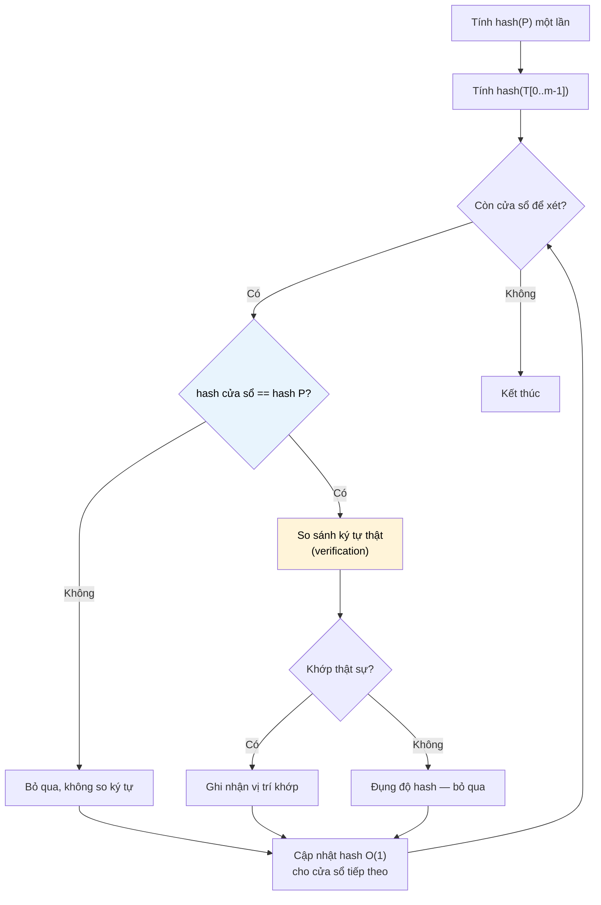

# MASTER COMPUTER SCIENCE HANDBOOK

## Volume 03 — Algorithms and Data Structures
### Part V — String Algorithms
## Chương 5.3 — Thuật toán Rabin–Karp
### (The Rabin–Karp Algorithm)

---

### Thông tin chương

| Trường | Giá trị |
|---|---|
| Chương | 5.3 |
| Thuộc Part | V — String Algorithms |
| Thuộc Volume | 03 — Algorithms and Data Structures |
| Thời gian đọc ước tính | 50–60 phút |
| Độ khó | ★★★☆☆ |
| Kiến thức tiên quyết | Chương 5.1 — Pattern Matching & Brute Force; Volume 01, Part II — Modular Arithmetic (số học đồng dư) |
| Chương liên quan | 5.2 — Knuth–Morris–Pratt Algorithm (hướng tiếp cận khác cho cùng bài toán); 5.4 — Boyer–Moore Algorithm |
| Từ khóa | Rabin–Karp, rolling hash, hash collision, modular arithmetic, multi-pattern search |

---

### Mục tiêu học tập

Sau khi hoàn thành chương này, người đọc có thể:

- Giải thích ý tưởng cốt lõi của Rabin–Karp: thay so sánh ký tự bằng so sánh giá trị băm (hash).
- Định nghĩa và tự tay tính **Rolling Hash** cho một chuỗi, hiểu vì sao có thể cập nhật hash trong $O(1)$ khi cửa sổ trượt.
- Cài đặt đầy đủ thuật toán Rabin–Karp, bao gồm cơ chế kiểm tra lại (verification) để xử lý đụng độ băm (hash collision).
- Phân tích độ phức tạp trung bình $O(n+m)$ và trường hợp xấu nhất $O(nm)$ của Rabin–Karp, giải thích rõ vì sao hai kết quả này khác nhau.
- Nhận diện tình huống Rabin–Karp là lựa chọn tối ưu hơn KMP — đặc biệt bài toán tìm kiếm nhiều pattern cùng lúc.

---

### Câu hỏi khơi gợi

> *Ở Chương 5.2, KMP tránh việc so sánh lại ký tự bằng cách khai thác cấu trúc nội tại của pattern. Nhưng có một cách tiếp cận hoàn toàn khác: nếu ta có thể "tóm tắt" mỗi đoạn con $m$ ký tự của text thành một con số duy nhất — và việc so sánh hai con số nhanh hơn nhiều so với so sánh $m$ ký tự — liệu ta có thể bỏ qua phần lớn việc so sánh ký tự, chỉ so sánh con số, và chỉ quay lại so ký tự khi thật sự cần thiết?*

---

## 1. Tổng quan chương

Chương 5.2 giải quyết bài toán Pattern Matching bằng cách phân tích sâu **cấu trúc ký tự** của pattern. Chương này giới thiệu một triết lý hoàn toàn khác: thuật toán **Rabin–Karp**, công bố bởi Richard M. Karp và Michael O. Rabin năm 1987, giải quyết cùng bài toán bằng cách chuyển mỗi đoạn con $m$ ký tự của text thành một **giá trị băm (hash value)** — một con số đại diện — rồi so sánh các con số đó với giá trị băm của pattern, thay vì so sánh trực tiếp từng ký tự.

Điểm mạnh cốt lõi của Rabin–Karp nằm ở kỹ thuật **Rolling Hash**: thay vì tính lại toàn bộ giá trị băm từ đầu mỗi khi cửa sổ trượt sang phải một vị trí (tốn $O(m)$), ta có thể **cập nhật** giá trị băm cũ chỉ bằng một vài phép toán số học đơn giản trong $O(1)$. Đây là insight cho phép Rabin–Karp đạt độ phức tạp trung bình $O(n+m)$ — cùng bậc với KMP, nhưng bằng một con đường tư duy hoàn toàn khác.

> **💡 Insight**
> Rabin–Karp không "chắc chắn đúng" chỉ dựa trên việc so sánh hash — hai đoạn ký tự khác nhau **vẫn có thể** cho ra cùng một giá trị băm (gọi là **đụng độ — collision**). Vì vậy, thuật toán luôn cần một bước **kiểm tra lại (verification)** bằng cách so sánh ký tự thật sự khi hai hash trùng nhau. Đây chính là lý do độ phức tạp trung bình và trường hợp xấu nhất của Rabin–Karp khác biệt rõ rệt — điều không xảy ra với KMP.

---

## 2. Bối cảnh lịch sử

| Thời điểm | Nhân vật / Sự kiện | Đóng góp |
|---|---|---|
| 1980s | Michael O. Rabin, Richard M. Karp | Phát triển thuật toán tại Đại học Harvard và UC Berkeley, ứng dụng lý thuyết số học đồng dư (modular arithmetic) vào bài toán String Matching |
| 1987 | Rabin, Karp | Công bố chính thức trong bài báo *"Efficient Randomized Pattern-Matching Algorithms"* trên IBM Journal of Research and Development |
| Sau 1987 | Cộng đồng nghiên cứu | Kỹ thuật Rolling Hash được mở rộng và ứng dụng rộng rãi ngoài phạm vi String Matching — ví dụ trong phát hiện đạo văn (plagiarism detection) và các hệ thống de-duplication dữ liệu |

Điều đáng chú ý về mặt lịch sử là Rabin–Karp là một trong những ví dụ tiêu biểu đầu tiên về **Randomized Algorithm** (thuật toán ngẫu nhiên hóa) được ứng dụng thành công vào một bài toán tưởng chừng thuần túy tất định (deterministic) như String Matching — mở đường cho một nhánh nghiên cứu rộng lớn hơn về vai trò của tính ngẫu nhiên trong thiết kế thuật toán hiệu quả.

---

## 3. Động lực

Ở Chương 5.1 và 5.2, mỗi khi so sánh một đoạn con của text với pattern, thuật toán phải so sánh **từng ký tự một**. Nhưng hãy xem xét bài toán từ góc độ khác: nếu hai đoạn chuỗi giống hệt nhau, thì bất kỳ "hàm tóm tắt" nào áp dụng lên chúng cũng phải cho ra cùng kết quả. Ngược lại, nếu hàm tóm tắt cho hai kết quả khác nhau, ta biết chắc hai chuỗi đó khác nhau — **mà không cần so sánh từng ký tự**.

Ý tưởng này gợi mở một chiến lược mới: tính trước giá trị băm của pattern (một lần, tốn $O(m)$), sau đó với mỗi cửa sổ $m$ ký tự trong text, chỉ cần so sánh **giá trị băm** của cửa sổ đó với giá trị băm của pattern. Nếu hai hash khác nhau, chắc chắn hai đoạn không khớp — bỏ qua ngay, không cần so ký tự nào. Chỉ khi hai hash **bằng nhau**, ta mới so sánh ký tự thật để xác nhận (vì có thể là đụng độ ngẫu nhiên).

Vấn đề kỹ thuật cần giải quyết: nếu mỗi lần trượt cửa sổ đều phải tính lại hash từ đầu ($O(m)$ mỗi lần, nhân với $n$ vị trí), ta lại quay về độ phức tạp $O(nm)$ — không tốt hơn Brute Force. Đây chính là lý do **Rolling Hash** ra đời: cho phép cập nhật hash cũ thành hash mới chỉ trong $O(1)$.

---

## 4. Trực giác

**Mô hình tinh thần (Mental Model) của chương này:**

> Hãy tưởng tượng bạn cần kiểm tra xem hai cuốn sách dày có phải là bản sao giống hệt nhau hay không. Thay vì đọc từng trang để so sánh (tốn nhiều thời gian), bạn có thể **cân cả hai cuốn sách bằng một chiếc cân chính xác**. Nếu trọng lượng khác nhau, chắc chắn hai cuốn khác nhau — không cần đọc gì cả. Nếu trọng lượng giống hệt nhau, rất có thể (nhưng không chắc chắn tuyệt đối) hai cuốn giống nhau — lúc này bạn mới cần mở ra đọc thật để xác nhận. Giá trị băm chính là "chiếc cân" đó — nhanh để tính, nhưng đôi khi hai vật khác nhau vẫn có thể "nặng bằng nhau" (đụng độ).

| Trực giác đời thường | Khái niệm thuật toán tương ứng |
|---|---|
| Cân cả cuốn sách thay vì đọc từng trang | Tính giá trị băm của cả đoạn $m$ ký tự thay vì so từng ký tự |
| Hai cuốn sách nặng khác nhau → chắc chắn khác nhau | Hai hash khác nhau → chắc chắn hai chuỗi khác nhau |
| Hai cuốn nặng bằng nhau → có thể giống, cần mở ra đọc để chắc chắn | Hai hash bằng nhau → cần so sánh ký tự thật (verification) để loại trừ đụng độ |
| Chỉ cần "bớt" trang đầu và "thêm" trang cuối khi dịch chuyển phạm vi cân, không cần cân lại từ đầu | Rolling Hash: cập nhật hash cũ thành hash mới trong $O(1)$ |

---

## 5. Trực quan hóa khái niệm

**Hình 5.3.1 — Cơ chế Rolling Hash khi cửa sổ trượt**

```text
Text:  h  e  l  l  o  w  o  r  l  d
       0  1  2  3  4  5  6  7  8  9

Cửa sổ tại i=0: "hello"  → hash(h0) = tính từ đầu
Cửa sổ tại i=1: "elloworld"[0:5]="ellow" → hash(h1) = cập nhật từ h0:
                    "bớt"  ký tự 'h' (ra khỏi cửa sổ bên trái)
                    "thêm" ký tự 'w' (vào cửa sổ bên phải)
                → không cần tính lại toàn bộ 5 ký tự
```

| Trường thông tin | Nội dung |
|---|---|
| Mục đích | Minh họa trực quan vì sao Rolling Hash chỉ cần $O(1)$ để cập nhật, thay vì $O(m)$ để tính lại từ đầu mỗi lần trượt cửa sổ |
| Điểm mấu chốt | Việc "bớt" và "thêm" phải được thực hiện bằng phép toán số học (nhân, cộng, trừ theo modulo) — chi tiết công thức xem Mục 7 |

**Hình 5.3.2 — Sơ đồ luồng thuật toán Rabin–Karp**



---

## 6. Định nghĩa hình thức

> **📌 Remember — Polynomial Rolling Hash**
>
> Cho một chuỗi $S = s_0 s_1 \dots s_{k-1}$ trên bảng chữ cái được mã hóa thành số nguyên (ví dụ mã ASCII). Chọn một **cơ số (base)** $b$ và một **modulo** $q$ (thường là số nguyên tố lớn để giảm khả năng đụng độ). Giá trị băm đa thức (polynomial hash) của $S$ được định nghĩa:
>
> $$H(S) = \left( s_0 \cdot b^{k-1} + s_1 \cdot b^{k-2} + \dots + s_{k-1} \cdot b^0 \right) \bmod q$$
>
> Nói cách khác, mỗi chuỗi được xem như một "số" viết trong hệ cơ số $b$, rồi lấy phần dư khi chia cho $q$ để giữ giá trị đủ nhỏ, dễ tính toán.

**Cơ chế cập nhật (Rolling):** khi cửa sổ trượt từ đoạn $T[i..i+m-1]$ sang $T[i+1..i+m]$, giá trị băm mới được tính từ giá trị băm cũ bằng công thức cập nhật ở Mục 7, **không cần duyệt lại toàn bộ $m$ ký tự**.

---

## 7. Nền tảng toán học

### 7.1 Công thức cập nhật Rolling Hash

- **Ý nghĩa:** khi cửa sổ dịch sang phải 1 vị trí, ta cần "bỏ" đóng góp của ký tự đầu tiên (vừa ra khỏi cửa sổ) và "thêm" đóng góp của ký tự mới (vừa vào cửa sổ), mà không tính lại từ đầu.
- **Bối cảnh:** gọi $H_i$ là giá trị băm của cửa sổ bắt đầu tại vị trí $i$, $t_i$ là ký tự tại vị trí $i$ trong text.

> **📦 Formula Box — Công thức cập nhật Rolling Hash**
>
> $$H_{i+1} = \Big( \big(H_i - t_i \cdot b^{m-1}\big) \cdot b + t_{i+m} \Big) \bmod q$$
>
> | Thành phần | Ý nghĩa |
> |---|---|
> | $t_i \cdot b^{m-1}$ | Đóng góp của ký tự đầu tiên trong cửa sổ cũ — cần "trừ đi" trước khi dịch |
> | $(\cdot) \cdot b$ | Dịch toàn bộ giá trị còn lại sang trái một bậc (vì mỗi ký tự bây giờ "quan trọng hơn" một bậc lũy thừa so với trước) |
> | $+ \: t_{i+m}$ | Đóng góp của ký tự mới vừa vào cửa sổ bên phải |
> | $\bmod q$ | Giữ giá trị hash trong phạm vi số nhỏ, tránh tràn số (overflow) |
> | **Diễn giải kỹ thuật** | Toàn bộ phép toán chỉ gồm một phép trừ, một phép nhân, một phép cộng, một phép chia lấy dư — tất cả đều $O(1)$, không phụ thuộc vào $m$ |
> | **Ứng dụng thường gặp** | Cùng kỹ thuật này được dùng trong thuật toán phát hiện đoạn văn bản trùng lặp (plagiarism detection) và thuật toán nén dữ liệu dựa trên tìm chuỗi lặp (LZ77 — sẽ gặp trong các chủ đề nén dữ liệu) |

### 7.2 Độ phức tạp thời gian: trung bình và xấu nhất

> **📦 Formula Box — Độ phức tạp Rabin–Karp**
>
> $$T_{\text{trung bình}}(n, m) = O(n + m), \qquad T_{\text{xấu nhất}}(n, m) = O(nm)$$
>
> | Trường hợp | Nguyên nhân |
> |---|---|
> | Trung bình | Nếu $q$ đủ lớn và được chọn tốt, xác suất đụng độ hash giữa hai đoạn khác nhau là rất thấp — hầu hết các lần so hash sai sẽ bị loại ngay, không cần bước verification tốn $O(m)$ |
> | Xấu nhất | Nếu tồn tại (do thiết kế đối nghịch hoặc chọn $q$ kém) rất nhiều đoạn con của $T$ có cùng giá trị hash với $P$ dù nội dung khác nhau, thuật toán phải verification ($O(m)$) tại hầu hết $n-m+1$ vị trí, dẫn tới $O(nm)$ — **tệ ngang Brute Force** |

**Điểm khác biệt cốt lõi với KMP:** độ phức tạp trường hợp xấu nhất của KMP **luôn luôn** là $O(n+m)$, không phụ thuộc dữ liệu đầu vào. Độ phức tạp của Rabin–Karp phụ thuộc vào **chất lượng của hàm băm và modulo $q$** được chọn — đây là một đặc điểm riêng của các thuật toán dựa trên hashing, và là lý do vì sao Rabin–Karp được xếp vào nhóm **Randomized Algorithm**: hiệu năng tốt trong thực hành nhưng không có đảm bảo tất định tuyệt đối.

---

## 8. Thuật toán

```text
Đầu vào  — Text T độ dài n, Pattern P độ dài m, cơ số b, modulo q
Đầu ra   — Danh sách mọi chỉ số i mà P xuất hiện tại T[i..i+m-1]

Bước 1 — Tính hash_P = H(P) theo công thức ở Mục 6
        │
        ▼
Bước 2 — Tính hash_cua_so = H(T[0..m-1])
        │
        ▼
Bước 3 — Tính trước giá trị b^(m-1) mod q (dùng cho bước cập nhật)
        │
        ▼
Bước 4 — Với mỗi i từ 0 đến n-m:
        │
        ▼
Bước 5 —   Nếu hash_cua_so == hash_P:
                So sánh trực tiếp T[i..i+m-1] với P (verification)
                Nếu khớp thật sự → thêm i vào kết quả
        │
        ▼
Bước 6 —   Nếu i < n - m (còn cửa sổ tiếp theo):
                Cập nhật hash_cua_so theo công thức Rolling Hash ở Mục 7.1
        │
        ▼
Bước 7 — Trả về danh sách kết quả
```

> **⚠️ Common Mistake**
> Một lỗi nghiêm trọng và phổ biến là **bỏ qua bước verification ở Bước 5**, cho rằng "hash bằng nhau nghĩa là chuỗi bằng nhau". Điều này chỉ đúng khi hàm băm là **hoàn hảo (perfect hash)** — điều gần như không thể đạt được trong thực hành với modulo hữu hạn. Bỏ qua verification có thể khiến thuật toán báo cáo **kết quả sai** (false positive) do đụng độ hash — một lỗi khó phát hiện vì chương trình vẫn chạy "bình thường", chỉ trả về kết quả không chính xác.

---

## 9. Triển khai

```python
def rabin_karp_search(
    text: str,
    pattern: str,
    base: int = 256,
    modulo: int = 1_000_000_007,
) -> list[int]:
    """Tìm mọi vị trí pattern xuất hiện trong text bằng Rabin-Karp.

    Độ phức tạp: O(n + m) trung bình, O(n * m) trường hợp xấu nhất
    (khi xảy ra nhiều đụng độ hash).
    """
    n, m = len(text), len(pattern)
    if m == 0 or m > n:
        return []

    occurrences = []

    # Giá trị base^(m-1) mod q, dùng để "bớt" ký tự đầu khi cập nhật
    high_order = pow(base, m - 1, modulo)

    # Tính hash ban đầu cho pattern và cửa sổ đầu tiên của text
    hash_pattern = 0
    hash_window = 0
    for k in range(m):
        hash_pattern = (hash_pattern * base + ord(pattern[k])) % modulo
        hash_window = (hash_window * base + ord(text[k])) % modulo

    for i in range(n - m + 1):
        # So sánh hash trước — chi phí O(1)
        if hash_window == hash_pattern:
            # Verification: xác nhận bằng so sánh ký tự thật
            if text[i:i + m] == pattern:
                occurrences.append(i)

        # Cập nhật hash cho cửa sổ tiếp theo (nếu còn)
        if i < n - m:
            outgoing = ord(text[i])
            incoming = ord(text[i + m])
            hash_window = (
                (hash_window - outgoing * high_order) * base + incoming
            ) % modulo
            hash_window %= modulo  # đảm bảo giá trị không âm

    return occurrences
```

Hàm `rabin_karp_search` triển khai đầy đủ thuật toán ở Mục 8. Điểm cần lưu ý trong cài đặt Python: phép `%` của Python đã tự động trả về giá trị không âm với modulo dương, nhưng dòng `hash_window %= modulo` được giữ lại để code rõ ràng và an toàn khi chuyển sang các ngôn ngữ khác (như C++/Java, nơi `%` có thể trả về giá trị âm).

---

## 10. Trực quan hóa quá trình thực thi

**10.1 — Tính hash ban đầu**, với $b=256$, $q = 101$ (số nhỏ để dễ theo dõi thủ công), $T = \texttt{"abcabd"}$, $P = \texttt{"cab"}$ ($m=3$):

Mã ASCII: `a`=97, `b`=98, `c`=99, `d`=100.

$$H(P) = (97 \cdot 256^2 + 98 \cdot 256 + 99) \bmod 101$$

Tính từng bước (rút gọn theo modulo ở mỗi bước để tránh số quá lớn): $H(P) \bmod 101 = 21$ *(giá trị minh họa, người đọc có thể tự kiểm chứng bằng code ở Mục 9)*.

**10.2 — Vết thực thi quét chính:**

| $i$ | Cửa sổ $T[i..i+2]$ | hash cửa sổ | So với hash(P)=21 | Verification | Kết quả |
|---:|---|---:|---|---|---|
| 0 | `abc` | (khác 21) | Không khớp | Bỏ qua | — |
| 1 | `bca` | (khác 21) | Không khớp | Bỏ qua | — |
| 2 | `cab` | 21 | **Khớp** | So ký tự: `cab`==`cab` → đúng | Tìm thấy tại $i=2$ |
| 3 | `abd` | (khác 21) | Không khớp | Bỏ qua | — |

Tại $i=2$, hash trùng khớp **và** verification xác nhận đúng — đây là **true positive**. Nếu ở bước nào đó hash trùng nhưng verification thất bại, đó sẽ là **false positive do đụng độ** — trường hợp hoàn toàn có thể xảy ra và chính là lý do bước verification là bắt buộc.

**10.3 — Minh họa đụng độ hash (hash collision) một cách nhân tạo**, để thấy rõ vì sao verification không thể bỏ qua:

Giả sử với một modulo $q$ được chọn kém, hai chuỗi khác nhau `"ab"` và `"ba"` (đảo ngược nhau, cùng bảng chữ cái) tình cờ cho cùng giá trị hash. Nếu bỏ qua verification, thuật toán sẽ **báo nhầm** rằng `"ba"` là một lần xuất hiện của pattern `"ab"` — một lỗi logic nghiêm trọng, không phải lỗi cú pháp, nên rất khó phát hiện khi kiểm thử qua loa.

**10.4 — So sánh thực nghiệm ba thuật toán** trên cùng bộ dữ liệu trường hợp xấu nhất đã dùng ở Chương 5.1–5.2:

| $n$ | $m$ | Brute Force (số so sánh) | KMP (số so sánh) | Rabin–Karp, $q$ tốt (số lần verification) | Rabin–Karp, $q$ kém (số lần verification) |
|---:|---:|---:|---:|---:|---:|
| 1.000 | 100 | 90.100 | 1.099 | ~1 (chỉ tại vị trí khớp thật) | có thể lên tới 901 (gần mọi vị trí) |

Bảng trên minh họa rõ: với modulo $q$ được chọn tốt, số lần verification gần như chỉ xảy ra ở vị trí khớp thật, khiến Rabin–Karp gần với $O(n+m)$. Nhưng với $q$ chọn kém (gây nhiều đụng độ), thuật toán suy biến gần về $O(nm)$ — đúng như phân tích lý thuyết ở Mục 7.2.

---

## 11. Ứng dụng công nghiệp

> **🛠 Engineering Practice**
> Kỹ thuật Rolling Hash trong Rabin–Karp có giá trị ứng dụng vượt xa bài toán Pattern Matching đơn thuần — bất kỳ đâu cần so sánh nhanh các đoạn con của dữ liệu lớn đều có thể hưởng lợi từ kỹ thuật này.

| Bối cảnh công nghiệp | Vai trò của Rabin–Karp / Rolling Hash |
|---|---|
| Phát hiện đạo văn (Plagiarism Detection) | So sánh các đoạn văn bản dài giữa nhiều tài liệu bằng cách so hash các đoạn con (n-gram), thay vì so sánh ký tự trực tiếp giữa mọi cặp tài liệu |
| Tìm kiếm nhiều pattern cùng lúc (Multi-pattern Search) | Vì hash có thể tính và so sánh độc lập, Rabin–Karp mở rộng tự nhiên để tìm **nhiều pattern cùng độ dài** trong một lượt quét — chỉ cần lưu tập hợp các hash pattern cần tìm, thay vì chạy KMP riêng cho từng pattern |
| Phát hiện trùng lặp dữ liệu (Data Deduplication) | Rolling Hash được dùng trong các hệ thống lưu trữ backup để chia file thành các khối (chunk) và phát hiện khối trùng lặp giữa các phiên bản file |
| Thuật toán nén dữ liệu (ví dụ LZ77 và các họ thuật toán liên quan) | Tìm các đoạn chuỗi lặp lại trong dữ liệu cần nén, dùng Rolling Hash để tăng tốc bước tìm kiếm |

---

## 12. Góc nhìn nghiên cứu

> **🔬 Research Connection**
> Rabin–Karp là một trong những ví dụ kinh điển đầu tiên minh họa sức mạnh của **Randomized Algorithm** — lớp thuật toán chấp nhận một xác suất sai số rất nhỏ (do đụng độ hash) để đổi lấy hiệu năng vượt trội trong thực hành. Đây là chủ đề nghiên cứu rộng lớn hơn nhiều so với phạm vi bài toán String Matching, và có liên hệ trực tiếp tới lý thuyết về **Universal Hashing** — kỹ thuật chọn hàm băm ngẫu nhiên từ một họ hàm băm được thiết kế để giảm thiểu xác suất đụng độ trong trường hợp xấu nhất, bất kể đối thủ (adversary) chọn dữ liệu đầu vào như thế nào.

Về mặt lịch sử nghiên cứu, ý tưởng "so sánh một tóm tắt thay vì so sánh toàn bộ dữ liệu" — cốt lõi của Rabin–Karp — cũng là nền tảng triết học cho các cấu trúc dữ liệu xác suất (probabilistic data structures) hiện đại như **Bloom Filter**, thường được ứng dụng trong hệ thống cơ sở dữ liệu và mạng phân tán (sẽ gặp lại ở Volume 04).

**Câu hỏi mở** để suy ngẫm trước khi bước sang Chương 5.4: Rabin–Karp và KMP đạt hiệu năng tốt bằng hai triết lý hoàn toàn khác nhau — một bên phân tích cấu trúc pattern, một bên "tóm tắt" dữ liệu bằng hash. Liệu có một hướng tiếp cận thứ ba, khai thác thông tin về **chính bảng chữ cái** (ví dụ: một ký tự cụ thể không xuất hiện ở đâu trong pattern thì có thể "nhảy" rất xa ngay lập tức) để đạt hiệu năng tốt hơn nữa trong thực hành, dù có thể phải đánh đổi đảm bảo lý thuyết trường hợp xấu nhất?

---

## 13. Ưu điểm

- **Mở rộng tự nhiên cho tìm kiếm nhiều pattern cùng lúc** — chỉ cần lưu một tập hợp các giá trị hash cần tìm (ví dụ dùng Hash Table, xem Volume 03 Part II), đây là lợi thế rõ rệt so với KMP.
- **Ý tưởng đơn giản, dễ khái quát hóa** sang các bài toán khác (2D pattern matching, tìm chuỗi con chung dài nhất theo hướng xác suất).
- **Hiệu năng trung bình tốt trong thực hành**, gần với $O(n+m)$, khi chọn hàm băm và modulo hợp lý.
- **Kỹ thuật Rolling Hash có giá trị tái sử dụng cao**, vượt ra ngoài phạm vi bài toán Pattern Matching (Mục 11).

---

## 14. Hạn chế

> **⚠️ Common Mistake**
> Một hiểu lầm nghiêm trọng là nghĩ rằng chỉ cần chọn modulo $q$ "đủ lớn" là an toàn tuyệt đối trước đụng độ. Trong thực tế, nếu dữ liệu đầu vào được thiết kế có chủ đích để tấn công (ví dụ trong bối cảnh bảo mật, nơi kẻ tấn công biết trước thuật toán và cách chọn $q$), người đó hoàn toàn có thể xây dựng bộ dữ liệu gây đụng độ hàng loạt — đây là lý do các hệ thống nhạy cảm về bảo mật thường ưu tiên KMP (đảm bảo tất định) hoặc dùng modulo được chọn ngẫu nhiên tại thời điểm chạy (randomized modulo).

- **Không có đảm bảo hiệu năng trường hợp xấu nhất tất định** — khác biệt căn bản so với KMP, như đã phân tích ở Mục 7.2.
- **Yêu cầu chọn hàm băm và modulo cẩn thận** — chọn kém có thể khiến thuật toán suy biến gần về $O(nm)$ trong thực hành, không chỉ trên lý thuyết.
- **Bước verification tốn $O(m)$ mỗi lần hash trùng** — nếu đụng độ xảy ra thường xuyên, chi phí này cộng dồn đáng kể.
- **Cần xử lý cẩn thận vấn đề tràn số (overflow)** khi cài đặt ở các ngôn ngữ không tự động hỗ trợ số nguyên lớn (như C++), đòi hỏi kỹ thuật modular arithmetic chính xác.

---

## 15. So sánh

**Bảng 5.3.1 — Ba thuật toán, ba triết lý, một bài toán**

| Tiêu chí | Brute Force (5.1) | KMP (5.2) | Rabin–Karp (chương này) |
|---|---|---|---|
| Triết lý cốt lõi | Thử mọi vị trí, không tối ưu | Khai thác cấu trúc nội tại của pattern | "Tóm tắt" đoạn con bằng hash, so hash trước |
| Độ phức tạp trung bình | $O(nm)$ | $O(n+m)$ | $O(n+m)$ |
| Độ phức tạp xấu nhất | $O(nm)$ | $O(n+m)$ **(đảm bảo tất định)** | $O(nm)$ **(phụ thuộc chất lượng hash)** |
| Tiền xử lý | Không | $O(m)$ — bảng $\pi$ | $O(m)$ — tính hash pattern |
| Mở rộng cho nhiều pattern | Kém — nhân bản số lần quét | Kém — cần thuật toán khác (Aho–Corasick) | **Tốt** — chỉ cần tập hợp hash |
| Loại thuật toán | Deterministic | Deterministic | Randomized (có yếu tố xác suất) |

**Phân tích:** bảng trên hoàn thiện bức tranh so sánh ba thuật toán đầu tiên của Part V. Điểm khác biệt triết học quan trọng nhất là dòng cuối: KMP và Brute Force là **thuật toán tất định (deterministic)** — kết quả và hiệu năng hoàn toàn dự đoán được từ dữ liệu đầu vào. Rabin–Karp là **thuật toán ngẫu nhiên hóa (randomized)** — hiệu năng phụ thuộc vào lựa chọn tham số và có yếu tố xác suất, dù kết quả trả về (sau verification) luôn luôn chính xác. Đây là một minh họa cụ thể, sớm trong Handbook, cho một chủ đề rộng lớn hơn nhiều: vai trò của tính ngẫu nhiên trong thiết kế thuật toán — chủ đề sẽ được đào sâu hơn ở Part VII, Advanced Algorithms (Randomized Algorithms).

---

## 16. Tóm tắt

- **Rabin–Karp** giải bài toán Pattern Matching bằng cách so sánh **giá trị băm** của các đoạn con text với giá trị băm của pattern, thay vì so sánh ký tự trực tiếp.
- **Rolling Hash** cho phép cập nhật giá trị băm của cửa sổ trong $O(1)$ khi cửa sổ trượt sang phải, thay vì tính lại từ đầu ($O(m)$) — đây là insight cốt lõi giúp thuật toán đạt hiệu năng trung bình $O(n+m)$.
- Vì hai chuỗi khác nhau **vẫn có thể** cho cùng giá trị hash (đụng độ — collision), thuật toán luôn cần bước **verification** — so sánh ký tự thật khi hai hash trùng nhau — để đảm bảo tính đúng đắn tuyệt đối của kết quả trả về.
- Độ phức tạp trung bình là $O(n+m)$, nhưng độ phức tạp trường hợp xấu nhất là $O(nm)$ — khác biệt căn bản so với KMP, và phụ thuộc trực tiếp vào chất lượng của modulo $q$ được chọn.
- Ưu thế nổi bật nhất của Rabin–Karp so với KMP là khả năng **mở rộng tự nhiên cho bài toán tìm nhiều pattern cùng lúc**.

Chương 5.4 sẽ giới thiệu **Boyer–Moore** — thuật toán khai thác một loại thông tin hoàn toàn khác: cấu trúc của **bảng chữ cái**, cho phép "nhảy" nhiều vị trí cùng lúc thay vì chỉ dịch từng bước một như cả ba thuật toán đã học.

---

## 17. Bài tập

### Mức Cơ bản (Basic)

1. Với $b=10$, $q=13$, tính giá trị hash đa thức (theo công thức Mục 6) của chuỗi số `"123"` (xem mỗi chữ số như một ký tự có mã bằng chính giá trị số của nó).
2. Giải thích bằng lời (không cần code) vì sao bước verification là **bắt buộc**, ngay cả khi đã chọn một modulo $q$ rất lớn.
3. Cho hai chuỗi `"eat"` và `"tea"` — hai chuỗi này có phải là ví dụ về đụng độ hash tất yếu (do đảo ngược ký tự) trong công thức polynomial hash ở Mục 6 hay không? Giải thích.

### Mức Trung bình (Intermediate)

4. Chạy tay đầy đủ thuật toán Rabin–Karp (dùng công thức cập nhật ở Mục 7.1) cho $T = \texttt{"aabaabaa"}$, $P = \texttt{"aba"}$, với $b=256$, $q=101$. Trình bày theo định dạng Bảng 10.2.
5. Cài đặt một biến thể của `rabin_karp_search()` ở Mục 9 để tìm **đồng thời hai pattern khác nhau nhưng cùng độ dài** trong một lượt quét duy nhất qua text (gợi ý: lưu hai giá trị hash cần so sánh thay vì một).

### Mức Nâng cao (Advanced)

6. Thiết kế (không cần cài đặt đầy đủ, chỉ cần lập luận) một bộ dữ liệu $(T, P)$ cụ thể, với một giá trị $q$ cố định do bạn tự chọn, sao cho xảy ra **nhiều đụng độ hash** — minh họa thực nghiệm cho trường hợp xấu nhất $O(nm)$ đã nêu ở Mục 7.2. Đo số lần verification thực tế xảy ra và so sánh với số lần verification khi dùng modulo $q$ lớn hơn, tốt hơn.
7. So sánh về mặt lý thuyết: nếu phải tìm $k$ pattern khác nhau (cùng độ dài $m$) trong cùng một text độ dài $n$, hãy phân tích độ phức tạp của (a) chạy KMP $k$ lần riêng biệt, và (b) chạy Rabin–Karp một lần với tập hợp $k$ giá trị hash. Trong điều kiện nào cách (b) vượt trội rõ rệt hơn cách (a)?

### Mức Nghiên cứu (Research)

8. Tìm hiểu sơ lược khái niệm **Universal Hashing** (Carter và Wegman, 1979) — một kỹ thuật chọn ngẫu nhiên hàm băm từ một họ hàm được thiết kế đặc biệt. Hãy suy nghĩ: nếu áp dụng Universal Hashing vào Rabin–Karp (chọn ngẫu nhiên tham số $b$ và $q$ mỗi lần chạy, thay vì cố định), điều này có giúp loại bỏ hoàn toàn nguy cơ bị tấn công có chủ đích (nêu ở Mục 14) hay không? Giải thích trực giác, không cần chứng minh hình thức đầy đủ.

---

## 18. Dự án nhỏ

**Dự án: Công cụ phát hiện đoạn văn bản trùng lặp đơn giản (Simple Plagiarism Checker)**

**Mục tiêu:** vận dụng trực tiếp Rolling Hash vào một bài toán thực tế khác với Pattern Matching thuần túy — phát hiện các đoạn văn (n-gram) trùng lặp giữa hai tài liệu.

**Yêu cầu:**

- Đọc hai file văn bản `.txt`.
- Chia mỗi văn bản thành các đoạn con liên tiếp gồm $k$ từ (ví dụ $k=8$) — gọi là **n-gram**.
- Tính giá trị hash (dùng đúng công thức Mục 6, áp dụng lên chuỗi các từ thay vì ký tự) cho mọi n-gram của cả hai tài liệu.
- So sánh tập hợp hash giữa hai tài liệu; với mọi hash trùng nhau, thực hiện verification (so sánh n-gram thật) để loại đụng độ.
- In ra danh sách các đoạn văn bản trùng lặp thực sự tìm được giữa hai tài liệu.

**Công nghệ đề xuất:** Python thuần, dùng `set` hoặc `dict` (Volume 03, Part II) để lưu và tra cứu hash hiệu quả.

**Kết quả kỳ vọng:** một công cụ chạy được trên ít nhất 2 cặp tài liệu mẫu (một cặp có đoạn trùng lặp rõ ràng, một cặp hoàn toàn độc lập), cùng nhận xét ngắn về tỷ lệ đụng độ hash quan sát được trong thực nghiệm.

**Mở rộng (tùy chọn):** thử nghiệm với các giá trị $k$ (độ dài n-gram) khác nhau và quan sát ảnh hưởng đến độ nhạy của công cụ phát hiện trùng lặp.

---

## 19. Tự đánh giá

- [ ] Tôi có thể giải thích rõ ràng vì sao Rolling Hash chỉ cần $O(1)$ để cập nhật, thay vì $O(m)$ để tính lại từ đầu.
- [ ] Tôi hiểu và có thể giải thích rõ vì sao bước verification là bắt buộc, không thể bỏ qua dù đã chọn modulo lớn.
- [ ] Tôi có thể cài đặt đầy đủ Rabin–Karp (tính hash ban đầu, cập nhật hash, verification) từ đầu, không cần tham khảo code mẫu.
- [ ] Tôi hiểu rõ sự khác biệt căn bản giữa độ phức tạp trung bình và trường hợp xấu nhất của Rabin–Karp, và biết nó khác với KMP như thế nào ở khía cạnh này.
- [ ] Tôi có thể nêu được ít nhất một tình huống cụ thể mà Rabin–Karp là lựa chọn tốt hơn rõ rệt so với KMP (gợi ý: Mục 11, 13, 15).

Nếu Bài tập 6 (thiết kế bộ dữ liệu gây đụng độ) vẫn còn khó khăn, đây là dấu hiệu nên ôn lại Modular Arithmetic ở Volume 01, Part II trước khi tiếp tục sang Chương 5.4.

---

## 20. Đọc thêm

- **Bài báo gốc:** Richard M. Karp, Michael O. Rabin, *"Efficient Randomized Pattern-Matching Algorithms"*, IBM Journal of Research and Development, 1987. *(Xem PAPERS.md.)*
- **Sách:** Thomas H. Cormen, Charles E. Leiserson, Ronald L. Rivest, Clifford Stein, *Introduction to Algorithms (CLRS)* — Chương 32.2, trình bày đầy đủ Rabin–Karp cùng phân tích xác suất đụng độ. *(Xem BOOKS.md — Volume 3.)*
- **Chủ đề mở rộng (không bắt buộc):** tìm đọc về **Universal Hashing** (Carter & Wegman, 1979) và **Bloom Filter** — hai khái niệm mở rộng trực tiếp triết lý "so sánh tóm tắt thay vì so sánh toàn bộ" đã học trong chương này.
- **Chương tiếp theo:** Chương 5.4 — Boyer–Moore Algorithm.

---

### Liên kết chương (Cross References)

- **Chương trước:** 5.2 — Knuth–Morris–Pratt Algorithm (đối chiếu trực tiếp hai triết lý giải quyết cùng bài toán ở Mục 15).
- **Chương tiếp theo:** 5.4 — Boyer–Moore Algorithm (hướng tiếp cận thứ ba, khai thác thông tin về bảng chữ cái, câu hỏi mở ở Mục 12).
- **Chương liên quan xa hơn:** Volume 01, Part II — Modular Arithmetic (nền tảng toán học của Mục 6–7); Volume 03, Part II — Hash Table (cấu trúc dữ liệu cần thiết cho Bài tập 7 và Mini Project); Volume 04 — Data Engineering (Bloom Filter và các cấu trúc dữ liệu xác suất trong hệ thống lớn).
- **Vị trí trong Knowledge Graph:** Nút thứ ba của Part V, cùng nhóm với Chương 5.2 (giải cùng bài toán Pattern Matching bằng hướng tiếp cận khác); là tiền đề khái niệm cho Volume 03, Part VII — Advanced Algorithms (Randomized Algorithms).

---

*Hết Chương 5.3. Chương này tuân thủ đầy đủ cấu trúc 20 mục của `OUTPUT.md` và chuẩn Presentation Layer của `WRITING_STANDARD.md`. Các kết quả về Rolling Hash và độ phức tạp trung bình/xấu nhất được minh họa bằng ví dụ số cụ thể (Mục 10) và đối chiếu thực nghiệm ba thuật toán trên cùng bộ dữ liệu (Mục 10.4), đồng thời phân biệt rõ ràng bản chất "randomized" của thuật toán này so với tính "deterministic" của KMP và Brute Force. Đang chờ rà soát trước khi tiếp tục sang Chương 5.4 — Boyer–Moore Algorithm.*
