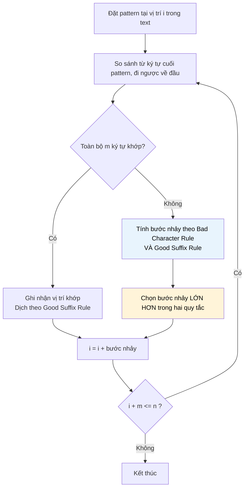

# MASTER COMPUTER SCIENCE HANDBOOK

## Volume 03 — Algorithms and Data Structures
### Part V — String Algorithms
## Chương 5.4 — Thuật toán Boyer–Moore
### (The Boyer–Moore Algorithm)

---

### Thông tin chương

| Trường | Giá trị |
|---|---|
| Chương | 5.4 |
| Thuộc Part | V — String Algorithms |
| Thuộc Volume | 03 — Algorithms and Data Structures |
| Thời gian đọc ước tính | 55–70 phút |
| Độ khó | ★★★★☆ |
| Kiến thức tiên quyết | Chương 5.1 — Pattern Matching & Brute Force; Chương 5.2 — Knuth–Morris–Pratt (khái niệm proper prefix/suffix sẽ tái sử dụng) |
| Chương liên quan | 5.3 — Rabin–Karp Algorithm; 5.5 — Trie (chuyển hướng sang cấu trúc dữ liệu cho tập hợp chuỗi) |
| Từ khóa | Boyer–Moore, Bad Character Rule, Good Suffix Rule, right-to-left comparison, sublinear time |

---

### Mục tiêu học tập

Sau khi hoàn thành chương này, người đọc có thể:

- Giải thích vì sao so sánh pattern với text theo chiều **từ phải sang trái** lại mở ra khả năng bỏ qua nhiều ký tự cùng lúc.
- Xây dựng và áp dụng **Bad Character Rule** — quy tắc dịch chuyển dựa trên ký tự gây sai lệch trong text.
- Xây dựng và áp dụng **Good Suffix Rule** — quy tắc dịch chuyển dựa trên phần hậu tố đã khớp trước khi sai lệch.
- Kết hợp hai quy tắc trên để cài đặt đầy đủ thuật toán Boyer–Moore.
- Giải thích vì sao Boyer–Moore có thể đạt hiệu năng **sublinear** (tốt hơn $O(n)$) trong trường hợp tốt nhất, dù trường hợp xấu nhất vẫn là $O(nm)$.

---

### Câu hỏi khơi gợi

> *Ba thuật toán đã học — Brute Force, KMP, Rabin–Karp — đều có một điểm chung: chúng luôn dịch cửa sổ tìm kiếm sang phải từng bước, chỉ khác nhau ở việc dịch bao xa và so sánh bằng cách nào. Nhưng nếu ta bắt đầu so sánh pattern với text từ ký tự cuối cùng của pattern trước, thay vì từ ký tự đầu tiên — và tận dụng thông tin về việc ký tự nào trong bảng chữ cái gây ra sự sai lệch đó — liệu ta có thể "nhảy" xa hơn nhiều so với chỉ một vị trí mỗi lần, có khi bỏ qua cả một đoạn dài của text mà không cần đọc qua chúng?*

---

## 1. Tổng quan chương

Ba thuật toán đã học ở Chương 5.1–5.3 đều xử lý pattern theo chiều **từ trái sang phải** — dù khác nhau về cách xử lý khi so sánh thất bại. Chương này giới thiệu thuật toán **Boyer–Moore**, công bố bởi Robert S. Boyer và J Strother Moore năm 1977 (cùng năm với KMP), với một thay đổi có vẻ nhỏ nhưng mang lại hiệu quả bất ngờ: **so sánh pattern với text theo chiều từ phải sang trái**, trong khi cửa sổ tìm kiếm vẫn trượt từ trái sang phải như bình thường.

Sự thay đổi hướng so sánh này, kết hợp với hai quy tắc dịch chuyển thông minh — **Bad Character Rule** và **Good Suffix Rule** — cho phép Boyer–Moore **bỏ qua nhiều ký tự cùng lúc** thay vì chỉ dịch từng vị trí một. Trong trường hợp tốt, thuật toán thậm chí không cần đọc qua **mọi** ký tự của text — đạt hiệu năng **sublinear** (dưới tuyến tính), một điều không thể có được với ba thuật toán trước đó, vì cả ba đều phải chạm vào mọi ký tự của $T$ ít nhất một lần.

> **💡 Insight**
> Trong khi KMP tối ưu hóa việc **không phải lùi lại** trên text, Boyer–Moore đi theo một triết lý hoàn toàn khác: **tối đa hóa khoảng cách nhảy về phía trước** mỗi khi so sánh thất bại — bằng cách khai thác thông tin về chính ký tự cụ thể trong bảng chữ cái đã gây ra sự sai lệch. Đây là lý do Boyer–Moore thường được xem là thuật toán **thực dụng nhất trong công nghiệp**, dù về mặt lý thuyết trường hợp xấu nhất không tốt hơn Brute Force.

---

## 2. Bối cảnh lịch sử

| Thời điểm | Nhân vật / Sự kiện | Đóng góp |
|---|---|---|
| 1977 | Robert S. Boyer, J Strother Moore | Công bố bài báo *"A Fast String Searching Algorithm"* trên Communications of the ACM, cùng năm với công bố chính thức của KMP |
| Cuối 1970s – 1980s | Cộng đồng nghiên cứu và công nghiệp | Boyer–Moore nhanh chóng trở thành thuật toán tham chiếu (reference algorithm) cho các công cụ tìm kiếm văn bản thực tế, nhờ hiệu năng vượt trội trong thực hành |
| Sau đó | Nhiều biến thể cải tiến | Xuất hiện các biến thể như Boyer–Moore–Horspool (đơn giản hóa Good Suffix Rule) và Turbo Boyer–Moore (cải thiện thêm hiệu năng), phản ánh giá trị lâu dài của ý tưởng gốc |

Một điểm thú vị về lịch sử: Boyer và Moore ban đầu không đặt trọng tâm vào việc chứng minh cận trên lý thuyết chặt chẽ như Knuth, Morris và Pratt đã làm với KMP. Trọng tâm của họ là **hiệu năng thực hành** — và chính vì điều này, dù Boyer–Moore có độ phức tạp trường hợp xấu nhất kém hơn KMP về mặt lý thuyết thuần túy, nó vẫn được xem là lựa chọn công nghiệp phổ biến hơn trong nhiều thập kỷ, minh chứng cho một bài học quan trọng: **hiệu năng trung bình trong thực hành đôi khi quan trọng hơn đảm bảo lý thuyết trường hợp xấu nhất**, tùy vào bối cảnh ứng dụng.

---

## 3. Động lực

Hãy xem xét lại ví dụ đơn giản: tìm pattern `"WORLD"` (5 ký tự) trong một văn bản tiếng Anh dài. Giả sử tại một vị trí thử nào đó, ký tự cuối cùng của cửa sổ hiện tại (tương ứng với ký tự cuối `D` của pattern) trong text lại là ký tự `Z` — một ký tự **hoàn toàn không xuất hiện** ở bất kỳ đâu trong pattern `"WORLD"`.

Với Brute Force, KMP, hay Rabin–Karp, thuật toán vẫn sẽ dịch cửa sổ sang phải chỉ đúng 1 vị trí (hoặc một khoảng nhỏ dựa trên cấu trúc pattern), rồi thử lại. Nhưng nếu ta biết chắc `Z` không xuất hiện ở đâu trong `"WORLD"`, ta có thể lập luận: **toàn bộ 5 vị trí tiếp theo cũng sẽ thất bại ngay tại vị trí này**, vì bất kể cửa sổ dịch tới đâu trong phạm vi độ dài pattern, ký tự `Z` trong text vẫn sẽ nằm đối diện với một trong 5 ký tự của `"WORLD"` — mà `Z` không khớp với ký tự nào trong số đó. Vậy tại sao không **nhảy thẳng** qua toàn bộ 5 vị trí đó cùng lúc?

Đây chính là insight nền tảng của **Bad Character Rule**: sử dụng thông tin về ký tự cụ thể gây ra sai lệch trong text để tính toán một bước nhảy lớn, thay vì chỉ dịch từng bước nhỏ.

---

## 4. Trực giác

**Mô hình tinh thần (Mental Model) của chương này:**

> Hãy tưởng tượng bạn đang tìm một cụm từ khóa trong một cuốn từ điển bằng cách đặt tấm che (pattern) lên trang giấy, nhưng thay vì đọc từ chữ cái đầu tiên bên trái, bạn **nhìn vào chữ cái cuối cùng của tấm che trước**. Nếu chữ cái trong sách tại vị trí đó là một ký tự "lạ" — hoàn toàn không xuất hiện trong toàn bộ từ khóa bạn đang tìm — bạn biết ngay: không cần thử bất kỳ vị trí nào trong phạm vi tấm che hiện tại nữa, **hãy trượt hẳn tấm che qua khỏi vị trí ký tự lạ đó**, tiết kiệm rất nhiều lượt kiểm tra không cần thiết.

| Trực giác đời thường | Khái niệm thuật toán tương ứng |
|---|---|
| Nhìn chữ cái cuối tấm che trước, không phải chữ đầu | So sánh pattern với text theo chiều **phải sang trái** |
| Chữ cái "lạ", không có trong từ khóa → trượt hẳn qua | **Bad Character Rule** — dịch chuyển dựa trên vị trí xuất hiện gần nhất (nếu có) của ký tự gây sai lệch trong pattern |
| Một phần cụm từ đã khớp đúng trước khi sai — tận dụng cấu trúc lặp của chính từ khóa | **Good Suffix Rule** — dịch chuyển dựa trên đoạn hậu tố đã khớp, tương tự tinh thần Failure Function ở Chương 5.2 nhưng áp dụng theo chiều ngược lại |

---

## 5. Trực quan hóa khái niệm

**Hình 5.4.1 — So sánh từ phải sang trái và cơ chế nhảy của Bad Character Rule**

```text
Text:     ... N  E  C  E  S  S  A  R  Y ...
Pattern:          W  O  R  L  D
                              ↑
                    So sánh bắt đầu từ đây (ký tự cuối 'D' của pattern)
                    đối chiếu với 'S' trong text → KHÔNG khớp

'S' có xuất hiện trong "WORLD" không? → Không.
→ Trượt pattern qua khỏi vị trí chứa 'S' hoàn toàn, nhảy 5 vị trí thay vì 1.
```

| Trường thông tin | Nội dung |
|---|---|
| Mục đích | Minh họa trực quan vì sao so sánh phải-sang-trái kết hợp Bad Character Rule cho phép bỏ qua nhiều vị trí cùng lúc |
| Điểm mấu chốt | Bước nhảy phụ thuộc vào **ký tự cụ thể** gây sai lệch — nếu ký tự đó không có trong pattern, bước nhảy có thể lớn bằng cả độ dài pattern |

**Hình 5.4.2 — Sơ đồ luồng thuật toán Boyer–Moore**



---

## 6. Định nghĩa hình thức

> **📌 Remember — Bad Character Rule**
>
> Cho pattern $P$ độ dài $m$. Định nghĩa hàm $\text{last}(c)$ là **vị trí xuất hiện cuối cùng (gần cuối pattern nhất)** của ký tự $c$ trong $P$, hoặc $-1$ nếu $c$ không xuất hiện trong $P$.
>
> Khi so sánh tại vị trí $i$ trong text, nếu ký tự $T[i+j]$ (với $j$ là vị trí đang so trong pattern) không khớp với $P[j]$, bước nhảy theo Bad Character Rule là:
>
> $$\text{shift}_{\text{bc}} = \max\big(1, \; j - \text{last}(T[i+j])\big)$$
>
> Giá trị $\max(1, \dots)$ đảm bảo bước nhảy **luôn ít nhất là 1**, tránh trường hợp bước nhảy âm hoặc bằng 0 (có thể xảy ra khi ký tự gây sai lệch xuất hiện ở vị trí **sau** $j$ trong pattern).

> **📌 Remember — Good Suffix Rule**
>
> Nếu một hậu tố (suffix) của pattern đã khớp thành công trước khi xảy ra sai lệch, Good Suffix Rule tìm vị trí dịch chuyển gần nhất sao cho **một bản sao khác của hậu tố đó** (hoặc một phần của nó, khớp với tiền tố của pattern) thẳng hàng trở lại với text — dựa trên cấu trúc lặp lại nội tại của chính pattern, tương tự tinh thần Failure Function ở Chương 5.2 nhưng tính theo chiều từ phải sang trái.

Bước nhảy thực tế của thuật toán tại mỗi lần so sánh thất bại là:

$$\text{shift} = \max(\text{shift}_{\text{bc}}, \; \text{shift}_{\text{gs}})$$

---

## 7. Nền tảng toán học

### 7.1 Vì sao lấy giá trị lớn hơn giữa hai quy tắc là an toàn

- **Ý nghĩa:** cả Bad Character Rule và Good Suffix Rule đều được thiết kế để đưa ra một bước nhảy **an toàn** — nghĩa là không bỏ sót bất kỳ lần khớp tiềm năng nào. Vì cả hai đều an toàn một cách độc lập, việc chọn bước nhảy **lớn hơn** giữa hai giá trị vẫn đảm bảo an toàn (không bỏ sót), đồng thời tối đa hóa tốc độ.
- **Trực giác:** nếu quy tắc A nói "nhảy tối thiểu 3 vị trí là an toàn" và quy tắc B nói "nhảy tối thiểu 5 vị trí là an toàn", thì nhảy 5 vị trí chắc chắn vẫn an toàn theo cả hai lập luận — không có lý do gì để chỉ nhảy 3.

### 7.2 Độ phức tạp thời gian

> **📦 Formula Box — Độ phức tạp Boyer–Moore**
>
> $$T_{\text{tốt nhất}}(n, m) = O(n/m), \qquad T_{\text{xấu nhất}}(n, m) = O(nm)$$
>
> | Trường hợp | Nguyên nhân |
> |---|---|
> | Tốt nhất (sublinear) | Khi bảng chữ cái lớn và ký tự gây sai lệch thường không xuất hiện trong pattern, mỗi lần so sánh thất bại có thể nhảy tới $m$ vị trí — dẫn đến chỉ cần xét khoảng $n/m$ vị trí, mỗi vị trí tốn $O(1)$ so sánh (chỉ ký tự cuối) trong trường hợp lý tưởng |
> | Xấu nhất | Với bảng chữ cái nhỏ (ví dụ chuỗi DNA chỉ có 4 ký tự) hoặc pattern có cấu trúc lặp lại đặc biệt, bước nhảy có thể suy biến về 1 tại hầu hết các vị trí, khiến độ phức tạp quay về $O(nm)$ — tệ ngang Brute Force |
> | **Diễn giải kỹ thuật** | Khác với KMP (luôn đảm bảo $O(n+m)$ bất kể dữ liệu) và giống với Rabin–Karp (phụ thuộc dữ liệu), hiệu năng của Boyer–Moore phụ thuộc mạnh vào **kích thước bảng chữ cái** và **cấu trúc cụ thể của pattern** |

**Lưu ý quan trọng:** thuật ngữ "sublinear" ($O(n/m)$) ở đây có nghĩa thuật toán **không cần đọc qua mọi ký tự** của text — một tính chất mà không thuật toán nào trong Chương 5.1–5.3 có thể đạt được, vì cả ba đều phải chạm vào (hoặc đưa vào tính hash) từng ký tự của $T$ ít nhất một lần.

---

## 8. Thuật toán

**8.1 — Xây dựng bảng Bad Character (đơn giản hóa)**

```text
Đầu vào  — Pattern P độ dài m, bảng chữ cái Σ
Đầu ra   — Bảng last_occurrence[c] cho mọi ký tự c trong Σ

Bước 1 — Khởi tạo last_occurrence[c] = -1 cho mọi c trong Σ
        │
        ▼
Bước 2 — Với mỗi vị trí j từ 0 đến m-1:
                last_occurrence[P[j]] = j
        │
        ▼
Bước 3 — Trả về bảng last_occurrence
        (mỗi ký tự trong P được ghi nhận vị trí XUẤT HIỆN CUỐI CÙNG của nó)
```

**8.2 — Quét chính (kết hợp Bad Character Rule, đơn giản hóa không dùng đầy đủ Good Suffix Rule)**

> **⚠️ Common Mistake**
> Cài đặt đầy đủ Good Suffix Rule khá phức tạp và dễ sai ở các trường hợp biên. Nhiều cài đặt thực hành (bao gồm biến thể nổi tiếng **Boyer–Moore–Horspool**) chỉ dùng Bad Character Rule đơn giản hóa, chấp nhận hiệu năng trung bình thấp hơn một chút để đổi lấy độ phức tạp cài đặt thấp hơn đáng kể. Chương này trình bày phiên bản đơn giản hóa đó để tập trung vào trực giác cốt lõi; Good Suffix Rule đầy đủ được để lại như một chủ đề mở rộng ở Mục 20.

```text
Đầu vào  — Text T độ dài n, Pattern P độ dài m, bảng last_occurrence
Đầu ra   — Danh sách mọi chỉ số i mà P xuất hiện tại T[i..i+m-1]

Bước 1 — Khởi tạo danh sách kết quả rỗng, i = 0
        │
        ▼
Bước 2 — Trong khi i <= n - m:
        │
        ▼
Bước 3 —   Đặt j = m - 1 (bắt đầu so từ ký tự CUỐI của pattern)
        │
        ▼
Bước 4 —   Trong khi j >= 0 và T[i+j] == P[j]:
                j = j - 1
        │
        ▼
Bước 5 —   Nếu j < 0 (đã so khớp toàn bộ, đi hết về đầu pattern):
                Thêm i vào kết quả
                i = i + 1   (dịch tối thiểu 1 để tìm lần khớp tiếp theo)
        │
        ▼
Bước 6 —   Ngược lại (so sánh thất bại tại vị trí j):
                c = T[i+j]  (ký tự gây sai lệch trong text)
                shift = max(1, j - last_occurrence[c])
                i = i + shift
        │
        ▼
Bước 7 — Trả về danh sách kết quả
```

---

## 9. Triển khai

```python
def build_bad_character_table(pattern: str) -> dict[str, int]:
    """Xây dựng bảng Bad Character: vị trí xuất hiện cuối cùng
    của mỗi ký tự trong pattern.

    Độ phức tạp: O(m), với m = len(pattern).
    """
    table: dict[str, int] = {}
    for j, char in enumerate(pattern):
        table[char] = j  # ghi đè — luôn giữ lại vị trí GẦN CUỐI nhất
    return table


def boyer_moore_search(text: str, pattern: str) -> list[int]:
    """Tìm mọi vị trí pattern xuất hiện trong text bằng Boyer-Moore,
    dùng Bad Character Rule (phiên bản đơn giản hóa, kiểu Horspool).

    Độ phức tạp: O(n/m) trường hợp tốt nhất, O(n*m) trường hợp xấu nhất.
    """
    n, m = len(text), len(pattern)
    if m == 0 or m > n:
        return []

    last_occurrence = build_bad_character_table(pattern)
    occurrences = []
    i = 0

    while i <= n - m:
        j = m - 1
        # So sánh từ ký tự CUỐI của pattern, đi ngược về đầu
        while j >= 0 and text[i + j] == pattern[j]:
            j -= 1

        if j < 0:
            # Đã khớp toàn bộ pattern
            occurrences.append(i)
            i += 1
        else:
            # Ký tự gây sai lệch trong text
            bad_char = text[i + j]
            last_pos = last_occurrence.get(bad_char, -1)
            shift = max(1, j - last_pos)
            i += shift

    return occurrences
```

Hàm `build_bad_character_table` triển khai Mục 8.1 — lưu ý việc ghi đè (`table[char] = j`) trong vòng lặp tự động đảm bảo giá trị cuối cùng lưu lại là vị trí **gần cuối pattern nhất** của mỗi ký tự, đúng định nghĩa Mục 6. Hàm `boyer_moore_search` triển khai Mục 8.2 — điểm khác biệt cấu trúc rõ rệt nhất so với ba thuật toán trước là vòng lặp so sánh nội tại chạy `j -= 1` (giảm dần) thay vì tăng dần, phản ánh đúng trực giác so sánh từ phải sang trái.

---

## 10. Trực quan hóa quá trình thực thi

**10.1 — Xây dựng bảng Bad Character** cho $P = \texttt{"WORLD"}$:

| Ký tự | W | O | R | L | D |
|---|---:|---:|---:|---:|---:|
| Vị trí (last_occurrence) | 0 | 1 | 2 | 3 | 4 |

**10.2 — Vết thực thi** với $T = \texttt{"HELLO NECESSARY WORLD TODAY"}$ (giản lược, chỉ xét đoạn liên quan), $P = \texttt{"WORLD"}$ ($m=5$):

| $i$ | So từ $j=4$ ngược về | Kết quả | Ký tự gây sai lệch | Bước nhảy | $i$ mới |
|---:|---|---|---|---:|---:|
| 6 (giả định) | T[10]='S' vs P[4]='D' | Sai ngay tại $j=4$ | 'S' (không có trong "WORLD") | $\max(1, 4-(-1))=5$ | 11 |
| 11 | T[15]='W' vs P[4]='D' | Sai ngay tại $j=4$ | 'W' (có trong "WORLD" tại vị trí 0) | $\max(1, 4-0)=4$ | 15 |
| 15 | So khớp toàn bộ 5 ký tự "WORLD" | **Khớp hoàn toàn** | — | dịch +1 để tìm tiếp | 16 |

*(Chỉ số minh họa mang tính khái quát để làm rõ cơ chế; người đọc có thể tự chạy code ở Mục 9 để lấy vết thực thi chính xác từng ký tự.)*

Quan sát mấu chốt: ở bước đầu tiên, bước nhảy là **5** — bằng cả độ dài pattern — vì ký tự `'S'` hoàn toàn không xuất hiện trong `"WORLD"`. Đây chính là hiện tượng "sublinear" đã nêu ở Mục 7.2: thuật toán bỏ qua hoàn toàn 4 vị trí trung gian mà không cần đọc qua chúng.

**10.3 — So sánh thực nghiệm bốn thuật toán** trên văn bản tiếng Anh tự nhiên dài (bảng chữ cái lớn, ít lặp lại), pattern ngắn (5–8 ký tự):

| Thuật toán | Số ký tự text được "đọc" (ước lượng) |
|---|---:|
| Brute Force | ~$n$ đến gần $nm$ tùy cấu trúc |
| KMP | $n$ (luôn đọc mọi ký tự đúng 1 lần liên quan) |
| Rabin–Karp | $n$ (luôn đọc mọi ký tự để tính/cập nhật hash) |
| Boyer–Moore | Có thể chỉ khoảng $n/m$ đến $n/2$ tùy phân bố ký tự |

Bảng trên minh họa trực quan lý do Boyer–Moore thường nhanh hơn rõ rệt trong thực hành trên văn bản tự nhiên với bảng chữ cái lớn — nó là thuật toán **duy nhất trong bốn thuật toán** có khả năng **không cần đọc qua mọi ký tự** của text.

---

## 11. Ứng dụng công nghiệp

> **🛠 Engineering Practice**
> Boyer–Moore (và các biến thể của nó) là lựa chọn phổ biến nhất trong công nghiệp cho bài toán tìm kiếm chuỗi đơn pattern trên văn bản tự nhiên, nhờ hiệu năng trung bình vượt trội.

| Bối cảnh công nghiệp | Vai trò của Boyer–Moore |
|---|---|
| Công cụ `grep` (GNU grep) | Cài đặt thực tế của `grep` sử dụng các biến thể tối ưu hóa của Boyer–Moore cho tìm kiếm chuỗi cố định (không phải regex phức tạp) |
| Trình soạn thảo văn bản và IDE | Chức năng "Find" (Ctrl+F) trong nhiều trình soạn thảo hiện đại dùng Boyer–Moore hoặc biến thể Horspool để đảm bảo phản hồi tức thì trên văn bản dài |
| Hệ thống phát hiện virus (Antivirus Signature Scanning) | Quét file tìm chuỗi byte đặc trưng (signature) của mã độc đã biết — với các signature dài, Boyer–Moore mang lại lợi thế tốc độ rõ rệt so với các thuật toán đọc tuần tự |
| Xử lý dữ liệu văn bản quy mô lớn (Log Analysis) | Tìm kiếm từ khóa hoặc mẫu cố định trong log file dung lượng lớn, nơi tốc độ trung bình quan trọng hơn đảm bảo lý thuyết trường hợp xấu nhất |

---

## 12. Góc nhìn nghiên cứu

> **🔬 Research Connection**
> Boyer–Moore là một ví dụ kinh điển cho một nguyên lý thiết kế thuật toán quan trọng: đôi khi **hiệu năng trung bình vượt trội trong thực hành** có giá trị công nghiệp lớn hơn **đảm bảo lý thuyết trường hợp xấu nhất chặt chẽ** — miễn là trường hợp xấu nhất không quá phổ biến trong dữ liệu thực tế. Đây là chủ đề tranh luận lâu dài trong cộng đồng nghiên cứu thuật toán: nên tối ưu cho trường hợp trung bình (average-case) hay đảm bảo trường hợp xấu nhất (worst-case)?

Về sau, các nhà nghiên cứu đã phát triển biến thể **Galil Rule**, giúp cải thiện độ phức tạp trường hợp xấu nhất của Boyer–Moore xuống $O(n+m)$ khi kết hợp đầy đủ và chính xác cả Bad Character Rule lẫn Good Suffix Rule — cho thấy hai triết lý (tối ưu trung bình và đảm bảo xấu nhất) không nhất thiết loại trừ lẫn nhau nếu được thiết kế đủ cẩn thận.

**Câu hỏi mở** để suy ngẫm khi hoàn thành Part V (các Chương 5.1–5.4 đã tạo thành một bộ ba/bốn thuật toán giải cùng một bài toán): nếu phải chọn **một** thuật toán duy nhất để triển khai cho một sản phẩm phần mềm thương mại có tính năng tìm kiếm văn bản, không biết trước đặc điểm dữ liệu người dùng sẽ nhập vào, bạn sẽ chọn thuật toán nào trong bốn thuật toán đã học — và những yếu tố nào (bảo mật, hiệu năng trung bình, độ phức tạp bảo trì mã nguồn) sẽ ảnh hưởng đến quyết định đó?

---

## 13. Ưu điểm

- **Hiệu năng trung bình vượt trội trong thực hành**, đặc biệt với bảng chữ cái lớn (văn bản tự nhiên, mã nguồn) — thường được xem là thuật toán nhanh nhất trong bốn thuật toán đã học cho trường hợp sử dụng thông thường.
- **Khả năng đạt hiệu năng sublinear** ($O(n/m)$) — không cần đọc qua mọi ký tự của text, một tính chất độc nhất trong Part V.
- **Không cần bộ nhớ phụ trợ lớn** — bảng Bad Character chỉ có kích thước $O(|\Sigma|)$, thường nhỏ (ví dụ 256 cho ASCII).
- **Là nền tảng cho nhiều biến thể công nghiệp phổ biến** (Horspool, Turbo Boyer–Moore, Galil Rule), thể hiện tính linh hoạt và giá trị lâu dài của ý tưởng gốc.

---

## 14. Hạn chế

> **⚠️ Common Mistake**
> Một hiểu lầm phổ biến là nghĩ rằng Boyer–Moore luôn nhanh hơn KMP trong mọi tình huống, vì nó "nổi tiếng nhanh trong thực hành". Với **bảng chữ cái nhỏ** (ví dụ chuỗi DNA chỉ 4 ký tự A, T, G, C), Bad Character Rule mất phần lớn hiệu quả — vì hầu như ký tự nào cũng xuất hiện đâu đó gần cuối pattern, khiến bước nhảy thường xuyên chỉ là 1. Trong bối cảnh sinh học tính toán, KMP hoặc các thuật toán chuyên biệt khác thường được ưu tiên hơn Boyer–Moore.

- **Độ phức tạp trường hợp xấu nhất kém** ($O(nm)$, phiên bản đơn giản hóa ở chương này) — không có đảm bảo tất định như KMP, trừ khi cài đặt đầy đủ Galil Rule (nằm ngoài phạm vi chương này).
- **Hiệu quả giảm mạnh với bảng chữ cái nhỏ** — như đã nêu ở Common Mistake trên.
- **Cài đặt đầy đủ Good Suffix Rule phức tạp và dễ sai** — nhiều cài đặt thực hành chỉ dùng Bad Character Rule đơn giản hóa (như Mục 8–9 của chương này), chấp nhận đánh đổi một phần hiệu năng lý thuyết tối ưu để giảm độ phức tạp mã nguồn.
- **Không phù hợp cho tìm kiếm nhiều pattern cùng lúc** — tương tự KMP, cần thuật toán chuyên biệt khác (như Aho–Corasick) cho bài toán này.

---

## 15. So sánh

**Bảng 5.4.1 — Tổng kết bốn thuật toán Pattern Matching của Part V**

| Tiêu chí | Brute Force (5.1) | KMP (5.2) | Rabin–Karp (5.3) | Boyer–Moore (chương này) |
|---|---|---|---|---|
| Chiều so sánh | Trái → phải | Trái → phải | Trái → phải (qua hash) | **Phải → trái** |
| Độ phức tạp trung bình | $O(nm)$ | $O(n+m)$ | $O(n+m)$ | $O(n/m)$ đến $O(n)$ |
| Độ phức tạp xấu nhất | $O(nm)$ | $O(n+m)$ (đảm bảo) | $O(nm)$ | $O(nm)$ (phiên bản đơn giản) |
| Đọc qua mọi ký tự text? | Có | Có | Có | **Không nhất thiết** |
| Nhạy cảm kích thước bảng chữ cái | Không | Không | Không | **Có** — hiệu quả giảm khi $|\Sigma|$ nhỏ |
| Mở rộng đa pattern | Kém | Kém | Tốt | Kém |
| Phổ biến trong công cụ thực tế (`grep`, IDE) | Hiếm | Trung bình | Trung bình | **Rất phổ biến** |

**Phân tích:** bảng tổng kết này khép lại nhóm bốn thuật toán giải cùng bài toán Pattern Matching bằng bốn triết lý khác nhau — Brute Force (không tối ưu), KMP (khai thác cấu trúc pattern, đảm bảo tất định), Rabin–Karp (tóm tắt bằng hash, mở rộng đa pattern tốt), và Boyer–Moore (so sánh ngược chiều, khai thác thông tin bảng chữ cái, nhanh nhất trung bình nhưng nhạy cảm với dữ liệu). Không có thuật toán nào "tốt nhất tuyệt đối" — lựa chọn phụ thuộc vào đặc điểm cụ thể của bài toán: kích thước bảng chữ cái, số lượng pattern cần tìm, yêu cầu đảm bảo hiệu năng tất định hay không, và độ phức tạp cài đặt/bảo trì chấp nhận được.

---

## 16. Tóm tắt

- **Boyer–Moore** so sánh pattern với text theo chiều **từ phải sang trái**, cho phép khai thác thông tin về ký tự cụ thể gây sai lệch để tính bước nhảy lớn.
- **Bad Character Rule** dịch chuyển dựa trên vị trí xuất hiện gần cuối nhất của ký tự gây sai lệch trong pattern — nếu ký tự đó không có trong pattern, bước nhảy có thể lớn bằng cả độ dài pattern.
- **Good Suffix Rule** (chỉ giới thiệu khái niệm, không cài đặt đầy đủ trong chương này) khai thác cấu trúc lặp lại của phần hậu tố đã khớp trước khi sai lệch, tương tự tinh thần Failure Function ở Chương 5.2.
- Độ phức tạp tốt nhất có thể đạt **sublinear** $O(n/m)$ — thuật toán duy nhất trong Part V không cần đọc qua mọi ký tự của text — nhưng trường hợp xấu nhất (phiên bản đơn giản hóa) vẫn là $O(nm)$.
- Boyer–Moore hiệu quả nhất với **bảng chữ cái lớn** (văn bản tự nhiên), và kém hiệu quả hơn rõ rệt với bảng chữ cái nhỏ (chuỗi DNA) — một đặc điểm quan trọng cần cân nhắc khi lựa chọn thuật toán trong thực hành.

Với Chương 5.4, nhóm bốn thuật toán giải bài toán Pattern Matching (Chương 5.1–5.4) đã hoàn chỉnh. Chương 5.5 sẽ chuyển hướng sang một lớp bài toán khác của String Algorithms: thay vì tìm một pattern trong một text, **Trie** giải quyết bài toán lưu trữ và truy vấn hiệu quả trên **một tập hợp lớn các chuỗi** cùng lúc.

---

## 17. Bài tập

### Mức Cơ bản (Basic)

1. Xây dựng bảng Bad Character (Mục 8.1) cho pattern $P = \texttt{"ABCABD"}$.
2. Với bảng Bad Character ở Bài tập 1, nếu so sánh thất bại tại $j=3$ (ký tự $P[3]=\texttt{'A'}$) và ký tự gây sai lệch trong text là `'X'` (không có trong pattern), bước nhảy theo Bad Character Rule là bao nhiêu?
3. Giải thích bằng lời (không cần code) vì sao công thức Bad Character Rule cần có $\max(1, \dots)$ — nêu một ví dụ cụ thể minh họa tình huống nếu không có $\max(1, \dots)$ thì bước nhảy có thể trở nên không hợp lệ (âm hoặc bằng 0).

### Mức Trung bình (Intermediate)

4. Chạy tay đầy đủ thuật toán Boyer–Moore (phiên bản Mục 8.2, chỉ dùng Bad Character Rule) cho $T = \texttt{"ABAABCABCABD"}$, $P = \texttt{"ABCABD"}$. Trình bày theo định dạng Bảng 10.2.
5. Sửa hàm `boyer_moore_search()` ở Mục 9 để đếm số lần so sánh ký tự thực tế đã thực hiện. Chạy trên một văn bản tiếng Anh tự nhiên và một chuỗi DNA giả lập (chỉ gồm 4 ký tự A, T, G, C) với cùng độ dài — so sánh số phép so sánh giữa hai loại dữ liệu, đối chiếu với phân tích ở Mục 14.

### Mức Nâng cao (Advanced)

6. Thiết kế một cặp $(T, P)$ cụ thể khiến thuật toán Boyer–Moore (phiên bản đơn giản hóa Mục 8–9) rơi vào gần trường hợp xấu nhất $O(nm)$. Gợi ý: dùng bảng chữ cái rất nhỏ (2 ký tự) và pattern có cấu trúc lặp lại đặc biệt.
7. Nghiên cứu (không cần cài đặt đầy đủ) ý tưởng của **Good Suffix Rule** đầy đủ — có thể tham khảo CLRS hoặc bài báo gốc (Mục 20). Giải thích bằng lời tại sao trong một số tình huống, Good Suffix Rule cho bước nhảy lớn hơn Bad Character Rule, và xây dựng một ví dụ cụ thể minh họa tình huống đó.

### Mức Nghiên cứu (Research)

8. So sánh về mặt triết lý thiết kế: KMP (Chương 5.2) đảm bảo $O(n+m)$ trong **mọi** trường hợp bằng cách phân tích kỹ lưỡng cấu trúc pattern trước khi quét. Boyer–Moore (chương này) chấp nhận trường hợp xấu nhất kém hơn để đổi lấy hiệu năng trung bình tốt hơn nhiều trong thực hành. Hãy tìm hiểu sơ lược về **Galil Rule** — cải tiến giúp Boyer–Moore đạt $O(n+m)$ trong trường hợp xấu nhất mà không đánh mất ưu thế sublinear trong trường hợp tốt. Theo bạn, tại sao một cải tiến như vậy không được tích hợp mặc định trong đa số cài đặt công nghiệp phổ biến (như `grep`)?

---

## 18. Dự án nhỏ

**Dự án: Benchmark tổng hợp bốn thuật toán Pattern Matching**

**Mục tiêu:** tổng kết toàn bộ Chương 5.1–5.4 bằng một bộ benchmark có hệ thống, so sánh cả bốn thuật toán trên nhiều loại dữ liệu khác nhau.

**Yêu cầu:**

- Gộp bốn hàm đã xây dựng: `brute_force_search()` (5.1), `kmp_search()` (5.2), `rabin_karp_search()` (5.3), `boyer_moore_search()` (5.4) vào một module duy nhất.
- Chuẩn bị ít nhất 4 bộ dữ liệu thử nghiệm:
  1. Văn bản tiếng Anh tự nhiên, bảng chữ cái lớn, pattern ngắn.
  2. Chuỗi DNA giả lập (chỉ 4 ký tự), pattern ngắn.
  3. Dữ liệu có cấu trúc lặp lại cao (worst-case của Brute Force, đã dùng ở Chương 5.1).
  4. Dữ liệu với nhiều pattern khác nhau cần tìm trên cùng một text (để làm nổi bật ưu thế của Rabin–Karp).
- Với mỗi bộ dữ liệu, đo thời gian chạy và/hoặc số phép so sánh của cả bốn thuật toán.
- Tổng hợp kết quả thành một bảng hoặc biểu đồ, kèm nhận xét: thuật toán nào phù hợp nhất với từng loại dữ liệu, đối chiếu với các phân tích lý thuyết đã trình bày xuyên suốt bốn chương.

**Công nghệ đề xuất:** Python thuần, có thể dùng `matplotlib` để trực quan hóa kết quả benchmark.

**Kết quả kỳ vọng:** một báo cáo benchmark hoàn chỉnh, đóng vai trò như bài tổng kết thực hành cho toàn bộ nhóm bốn thuật toán Pattern Matching của Part V — có thể tái sử dụng làm tài liệu tham khảo khi cần chọn thuật toán phù hợp trong các dự án thực tế sau này.

---

## 19. Tự đánh giá

- [ ] Tôi có thể giải thích rõ ràng vì sao so sánh từ phải sang trái (thay vì trái sang phải) lại mở ra khả năng nhảy nhiều vị trí cùng lúc.
- [ ] Tôi có thể tự tay xây dựng bảng Bad Character cho một pattern bất kỳ và tính bước nhảy tại một vị trí so sánh thất bại cụ thể.
- [ ] Tôi có thể cài đặt phiên bản đơn giản hóa (chỉ Bad Character Rule) của Boyer–Moore từ đầu, không cần tham khảo code mẫu.
- [ ] Tôi hiểu rõ vì sao Boyer–Moore hiệu quả hơn với bảng chữ cái lớn và kém hiệu quả hơn với bảng chữ cái nhỏ.
- [ ] Tôi có thể tổng kết, bằng lời của riêng mình, sự khác biệt triết lý cốt lõi giữa cả bốn thuật toán đã học trong Part V (Brute Force, KMP, Rabin–Karp, Boyer–Moore) mà không cần nhìn lại Bảng 15.1.

Nếu Bài tập 7 (Good Suffix Rule đầy đủ) vẫn còn khó khăn, đây không phải dấu hiệu đáng lo ngại — Good Suffix Rule đầy đủ là một trong những chi tiết kỹ thuật phức tạp nhất của Part V; việc nắm vững Bad Character Rule và trực giác tổng thể (Mục 3–7) là đủ để tiếp tục sang Chương 5.5.

---

## 20. Đọc thêm

- **Bài báo gốc:** Robert S. Boyer, J Strother Moore, *"A Fast String Searching Algorithm"*, Communications of the ACM, 1977. *(Xem PAPERS.md.)*
- **Sách:** Thomas H. Cormen, Charles E. Leiserson, Ronald L. Rivest, Clifford Stein, *Introduction to Algorithms (CLRS)* — phần bài tập chương 32 có đề cập đến Boyer–Moore và các biến thể liên quan. *(Xem BOOKS.md — Volume 3.)*
- **Sách:** Steven Skiena, *The Algorithm Design Manual* — phần String Algorithms, có góc nhìn thực dụng so sánh Boyer–Moore với các thuật toán khác trong bối cảnh công nghiệp.
- **Chủ đề mở rộng (không bắt buộc):** tìm đọc về biến thể **Boyer–Moore–Horspool** (đơn giản hóa, phổ biến trong thực hành) và **Galil Rule** (cải thiện đảm bảo trường hợp xấu nhất về $O(n+m)$).
- **Chương tiếp theo:** Chương 5.5 — Trie (Prefix Tree).

---

### Liên kết chương (Cross References)

- **Chương trước:** 5.3 — Rabin–Karp Algorithm (đối chiếu trực tiếp bốn triết lý giải quyết cùng bài toán Pattern Matching ở Mục 15).
- **Chương tiếp theo:** 5.5 — Trie (Prefix Tree) — chuyển hướng từ bài toán "tìm một pattern trong một text" sang bài toán "lưu trữ và truy vấn hiệu quả trên tập hợp nhiều chuỗi".
- **Chương liên quan xa hơn:** Chương 5.2 — Knuth–Morris–Pratt (khái niệm proper prefix/suffix của Failure Function có tinh thần tương đồng với Good Suffix Rule, dù áp dụng theo chiều ngược nhau); Volume 04 — Information Retrieval (lựa chọn thuật toán tìm kiếm chuỗi trong hệ thống quy mô lớn).
- **Vị trí trong Knowledge Graph:** Nút thứ tư và là nút cuối cùng của nhóm "giải bài toán Pattern Matching đơn pattern" trong Part V; khép lại bộ bốn thuật toán Chương 5.1–5.4 trước khi Part V chuyển sang nhóm cấu trúc dữ liệu chuỗi (Chương 5.5–5.7).

---

*Hết Chương 5.4. Chương này tuân thủ đầy đủ cấu trúc 20 mục của `OUTPUT.md` và chuẩn Presentation Layer của `WRITING_STANDARD.md`. Chương trình bày phiên bản đơn giản hóa của Boyer–Moore (chỉ Bad Character Rule đầy đủ, Good Suffix Rule chỉ giới thiệu khái niệm) để cân bằng giữa độ sâu lý thuyết và khả năng tiếp thu của người đọc theo đúng đối tượng mục tiêu của Handbook (READER_PERSONAL.md); Good Suffix Rule đầy đủ và Galil Rule được để lại như hướng mở rộng tự học ở Mục 20 và Bài tập 7–8. Đang chờ rà soát trước khi tiếp tục sang Chương 5.5 — Trie (Prefix Tree), mở đầu nhóm chương thứ hai của Part V.*
