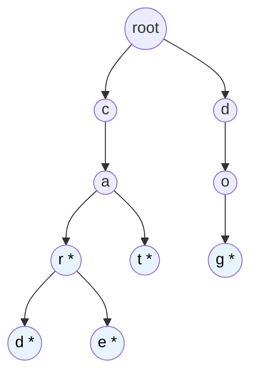

# MASTER COMPUTER SCIENCE HANDBOOK

## Volume 03 — Algorithms and Data Structures
### Part V — String Algorithms
## Chương 5.5 — Trie (Prefix Tree)
### (Trie / Prefix Tree)

---

### Thông tin chương

| Trường | Giá trị |
|---|---|
| Chương | 5.5 |
| Thuộc Part | V — String Algorithms |
| Thuộc Volume | 03 — Algorithms and Data Structures |
| Thời gian đọc ước tính | 50–60 phút |
| Độ khó | ★★★☆☆ |
| Kiến thức tiên quyết | Volume 03, Part II — Trees, Hash Table (so sánh trực tiếp ở Mục 15); Chương 5.1 — khái niệm bảng chữ cái (alphabet) |
| Chương liên quan | 5.1–5.4 — nhóm thuật toán Pattern Matching (bài toán khác: một pattern, một text); 5.6 — Suffix Array (tiếp tục hướng cấu trúc dữ liệu chuỗi) |
| Từ khóa | Trie, Prefix Tree, autocomplete, prefix search, insert, search, IP routing |

---

### Mục tiêu học tập

Sau khi hoàn thành chương này, người đọc có thể:

- Phân biệt rõ bài toán mà Trie giải quyết (lưu trữ và truy vấn một **tập hợp** chuỗi) với bài toán Pattern Matching đã học ở Chương 5.1–5.4 (tìm một pattern trong một text).
- Định nghĩa cấu trúc Trie bằng ngôn ngữ hình thức, giải thích vai trò của từng nút và cờ đánh dấu kết thúc từ (end-of-word marker).
- Cài đặt đầy đủ ba thao tác cơ bản của Trie: `insert`, `search`, và `starts_with` (prefix search).
- Phân tích và so sánh độ phức ttạp của Trie với Hash Table cho các bài toán liên quan đến tiền tố (prefix).
- Nhận diện các ứng dụng thực tế phù hợp với Trie: autocomplete, kiểm tra chính tả, IP routing.

---

### Câu hỏi khơi gợi

> *Khi bạn gõ vài ký tự đầu tiên vào thanh tìm kiếm và một danh sách gợi ý xuất hiện gần như ngay lập tức — dù hệ thống phải tìm trong hàng triệu từ khóa đã có — công cụ nào cho phép việc này xảy ra nhanh đến vậy? Và tại sao một cấu trúc dữ liệu như Hash Table, dù rất nhanh cho việc tra cứu một từ cụ thể, lại không phù hợp để trả lời câu hỏi "những từ nào bắt đầu bằng tiền tố này"?*

---

## 1. Tổng quan chương

Bốn chương vừa qua (5.1–5.4) tập trung vào một bài toán duy nhất: tìm một **pattern** trong một **text**. Chương này đánh dấu một bước chuyển hướng quan trọng trong Part V — chuyển từ bài toán "tìm kiếm chuỗi con" sang bài toán **lưu trữ và truy vấn hiệu quả trên một tập hợp lớn các chuỗi**. Đây là bài toán nền tảng cho các tính năng quen thuộc như gợi ý từ khóa (autocomplete), kiểm tra chính tả, và định tuyến mạng.

Cấu trúc dữ liệu trung tâm của chương này là **Trie** (đọc là "trai" hoặc "tri", từ chữ re**trie**val — truy xuất), còn gọi là **Prefix Tree**. Ý tưởng cốt lõi: thay vì lưu mỗi chuỗi như một đơn vị độc lập (như Hash Table làm), Trie tổ chức các chuỗi thành một **cây**, trong đó mỗi đường đi từ gốc xuống một nút biểu diễn một **tiền tố (prefix)** chung của nhiều chuỗi. Các chuỗi có chung tiền tố sẽ **chia sẻ chung phần đường đi** đó trong cây — đây chính là nguồn gốc của cả tên gọi lẫn sức mạnh của cấu trúc dữ liệu này.

> **💡 Insight**
> Hash Table trả lời cực nhanh câu hỏi *"chuỗi X có tồn tại trong tập hợp không?"* — nhưng hoàn toàn không có khái niệm "gần giống" hay "có chung tiền tố", vì hàm băm cố ý làm cho hai chuỗi gần giống nhau có giá trị băm hoàn toàn khác biệt (tránh đụng độ). Trie làm điều ngược lại: nó **tận dụng chính sự tương đồng về tiền tố** giữa các chuỗi để tổ chức dữ liệu — đây là lý do Trie trả lời tự nhiên và hiệu quả cho các câu hỏi dạng "mọi từ bắt đầu bằng...", điều mà Hash Table không thể làm tốt.

---

## 2. Bối cảnh lịch sử

| Thời điểm | Nhân vật / Sự kiện | Đóng góp |
|---|---|---|
| 1959 | René de la Briandais | Giới thiệu ý tưởng nền tảng của cấu trúc cây tiền tố trong một công trình về tổ chức file dữ liệu |
| 1960 | Edward Fredkin | Đặt tên chính thức "Trie" (từ "retrieval"), công bố và phổ biến hóa cấu trúc dữ liệu này trong cộng đồng khoa học máy tính |
| Sau đó | Cộng đồng nghiên cứu và công nghiệp | Trie được mở rộng thành nhiều biến thể quan trọng: Compressed Trie (Radix Tree/Patricia Trie), Suffix Trie (tiền thân khái niệm của Suffix Tree ở Chương 5.7), và Ternary Search Trie |

Một điểm thú vị: mặc dù Edward Fredkin đặt tên là "Trie" với ý định phát âm giống "tree" (cây), cách phát âm phổ biến hơn trong cộng đồng lập trình hiện nay lại là "try" — một sự nhầm lẫn ngữ âm thú vị đã trở thành quy ước không chính thức, phần nào phản ánh cách một thuật ngữ kỹ thuật có thể "tiến hóa" theo cách sử dụng thực tế của cộng đồng, khác với ý định ban đầu của người đặt tên.

---

## 3. Động lực

Hãy xem xét bài toán xây dựng tính năng autocomplete cho một thanh tìm kiếm, với một tập từ điển gồm hàng triệu từ: `"cat"`, `"car"`, `"card"`, `"care"`, `"dog"`, `"door"`, ...

Nếu dùng **Hash Table** để lưu toàn bộ từ điển, việc kiểm tra "từ `'car'` có tồn tại không" cực nhanh — $O(1)$ trung bình. Nhưng nếu người dùng gõ `"ca"` và ta cần trả về **mọi** từ bắt đầu bằng `"ca"` (`"cat"`, `"car"`, `"card"`, `"care"`), Hash Table hoàn toàn bất lực: nó không có khái niệm "gần giống nhau" giữa các khóa, buộc ta phải **duyệt qua toàn bộ** tập từ điển và kiểm tra từng từ một xem có bắt đầu bằng `"ca"` hay không — độ phức tạp $O(k \cdot p)$ với $k$ là số từ trong từ điển, $p$ là độ dài tiền tố trung bình cần so — hoàn toàn không khả thi với từ điển hàng triệu từ và yêu cầu phản hồi tức thì.

Quan sát mấu chốt: bốn từ `"cat"`, `"car"`, `"card"`, `"care"` đều **chia sẻ chung 2 ký tự đầu** `"ca"`. Nếu ta tổ chức dữ liệu sao cho phần chung này chỉ cần lưu và duyệt **một lần duy nhất**, sau đó "rẽ nhánh" tại điểm khác biệt, ta có thể trả lời câu hỏi "mọi từ bắt đầu bằng tiền tố P" chỉ trong thời gian tỷ lệ với **độ dài của P**, cộng với số lượng kết quả cần trả về — không phụ thuộc vào tổng số từ trong từ điển. Đây chính xác là những gì Trie thực hiện.

---

## 4. Trực giác

**Mô hình tinh thần (Mental Model) của chương này:**

> Hãy tưởng tượng Trie giống như **hệ thống mục lục của một thư viện khổng lồ**, nơi mỗi tầng của giá sách ứng với một ký tự. Để tìm từ `"card"`, bạn đi đến khu vực chữ `'c'`, rồi bên trong đó tìm khu vực chữ `'a'`, rồi bên trong đó tìm khu vực chữ `'r'`, rồi `'d'` — và tại đó có một "biển báo" cho biết `"card"` là một từ hoàn chỉnh. Điều thú vị: mọi từ khác cũng bắt đầu bằng `"car"` (như `"care"`, `"cart"`) đều **đi qua chung con đường** `c → a → r` trước khi rẽ nhánh riêng — bạn không cần xây dựng lại con đường đó cho mỗi từ.

| Trực giác đời thường | Khái niệm thuật toán tương ứng |
|---|---|
| Mỗi tầng giá sách ứng với một ký tự | Mỗi cạnh (edge) của Trie ứng với một ký tự |
| Đường đi từ lối vào thư viện đến một khu vực cụ thể | Đường đi từ **gốc (root)** đến một **nút (node)** trong Trie, biểu diễn một tiền tố |
| "Biển báo" đánh dấu đây là một cuốn sách hoàn chỉnh, không chỉ là kệ trung gian | Cờ `is_end_of_word` đánh dấu nút đó là kết thúc của một từ hợp lệ trong tập hợp |
| Nhiều cuốn sách dùng chung lối đi ban đầu, chỉ rẽ nhánh ở phần sau | Nhiều chuỗi chia sẻ chung một đoạn đường đi (chung tiền tố) trong Trie |

---

## 5. Trực quan hóa khái niệm

**Hình 5.5.1 — Cấu trúc Trie cho tập từ {"car", "card", "care", "cat", "dog"}**



*(Ký hiệu `*` trong tên nút biểu thị `is_end_of_word = True` — nút đó là kết thúc hợp lệ của một từ trong tập hợp, ví dụ nút "r *" nghĩa là đường đi `c-a-r` kết thúc tại đây tạo thành từ `"car"` hoàn chỉnh.)*

| Trường thông tin | Nội dung |
|---|---|
| Mục đích | Minh họa trực quan cách 5 từ chia sẻ cấu trúc cây: `"car"`, `"card"`, `"care"`, `"cat"` đều dùng chung nhánh `c → a`; `"car"` và `"card"`/`"care"` còn dùng chung thêm nhánh `→ r` |
| Điểm mấu chốt | Nút `"r"` (đường đi c-a-r) vừa **là kết thúc của từ `"car"`** (có đánh dấu `*`) vừa **là điểm giữa đường** dẫn tới `"card"` và `"care"` — một nút trong Trie có thể vừa là kết thúc từ, vừa có nút con tiếp theo |

**Hình 5.5.2 — So sánh không gian lưu trữ: Trie vs lưu trực tiếp từng chuỗi**

```text
Lưu trực tiếp (không chia sẻ):        Lưu bằng Trie (chia sẻ tiền tố):
  "car"  → c-a-r                        c → a → r (*) → d (*)
  "card" → c-a-r-d                              → e (*)
  "care" → c-a-r-e                            → t (*)
  Tổng: 3+4+4 = 11 ký tự lưu trữ        Tổng: chỉ 5 nút riêng biệt (c,a,r,d,e + t)
```

---

## 6. Định nghĩa hình thức

> **📌 Remember — Trie (Prefix Tree)**
>
> Một **Trie** là một cây có gốc (rooted tree), trong đó:
> - Mỗi **cạnh (edge)** được gán nhãn bằng đúng một ký tự thuộc bảng chữ cái $\Sigma$.
> - Mỗi **nút (node)** biểu diễn một chuỗi — chính là chuỗi ký tự được ghép lại từ nhãn các cạnh trên đường đi từ **gốc (root)** đến nút đó. Nút gốc biểu diễn chuỗi rỗng.
> - Mỗi nút mang một cờ boolean `is_end_of_word`, cho biết chuỗi mà nút đó biểu diễn có phải là một **từ hoàn chỉnh** trong tập hợp đang lưu trữ hay không.
> - Hai chuỗi có chung tiền tố độ dài $k$ sẽ chia sẻ chung đúng $k$ cạnh đầu tiên tính từ gốc.

**Ba thao tác cơ bản:**

| Thao tác | Ý nghĩa |
|---|---|
| `insert(word)` | Thêm một chuỗi `word` vào tập hợp — tạo mới các nút/cạnh cần thiết dọc theo đường đi biểu diễn `word`, nếu chưa tồn tại |
| `search(word)` | Kiểm tra `word` có tồn tại **chính xác** trong tập hợp hay không (đường đi tồn tại **và** nút cuối có `is_end_of_word = True`) |
| `starts_with(prefix)` | Kiểm tra có **ít nhất một** từ trong tập hợp bắt đầu bằng `prefix` hay không (chỉ cần đường đi biểu diễn `prefix` tồn tại, không cần `is_end_of_word` tại đó) |

---

## 7. Nền tảng toán học

### 7.1 Độ phức tạp thời gian của các thao tác

- **Ý nghĩa:** vì mỗi thao tác chỉ cần đi theo đúng một đường đi từ gốc, có độ dài bằng độ dài của chuỗi/tiền tố đang xét, độ phức tạp **không phụ thuộc vào số lượng từ đã lưu trong Trie**.

> **📦 Formula Box — Độ phức tạp các thao tác Trie**
>
> $$T_{\text{insert}}(L) = O(L), \qquad T_{\text{search}}(L) = O(L), \qquad T_{\text{starts\_with}}(L) = O(L)$$
>
> | Thành phần | Ý nghĩa |
> |---|---|
> | $L$ | Độ dài của chuỗi (đối với `insert`, `search`) hoặc độ dài của tiền tố (đối với `starts_with`) đang được xử lý |
> | **Diễn giải kỹ thuật** | Mỗi bước trong thao tác chỉ di chuyển xuống đúng một cấp trong cây, tương ứng với đúng một ký tự — tổng số bước bằng đúng độ dài chuỗi/tiền tố, không phụ thuộc vào tổng số từ $k$ đã lưu trong Trie |
> | **Ứng dụng thường gặp** | Đảm bảo tốc độ phản hồi tức thì cho autocomplete, bất kể từ điển có bao nhiêu triệu từ, miễn là độ dài từ khóa người dùng gõ vào (thường rất ngắn, 2–10 ký tự) là nhỏ |

### 7.2 Độ phức tạp không gian

Độ phức tạp không gian của Trie trong trường hợp xấu nhất (không chia sẻ được tiền tố nào) là $O\left(\sum_{i=1}^{k} L_i \cdot |\Sigma|\right)$, với $k$ là số từ, $L_i$ là độ dài từ thứ $i$, và $|\Sigma|$ là kích thước bảng chữ cái (vì mỗi nút, trong cài đặt cơ bản, thường cần một mảng con trỏ kích thước $|\Sigma|$ để trỏ tới các nút con khả dĩ). Đây chính là **nhược điểm chính** của Trie sẽ được phân tích kỹ hơn ở Mục 14.

---

## 8. Thuật toán

**8.1 — Thao tác Insert**

```text
Đầu vào  — Trie hiện có (bắt đầu từ root), chuỗi word cần thêm
Đầu ra   — Trie đã được cập nhật, chứa word

Bước 1 — Đặt current = root
        │
        ▼
Bước 2 — Với mỗi ký tự c trong word (theo thứ tự):
        │
        ▼
Bước 3 —   Nếu current chưa có nút con ứng với ký tự c:
                Tạo mới một nút con cho c
        │
        ▼
Bước 4 —   Di chuyển current sang nút con ứng với c
        │
        ▼
Bước 5 — Sau khi duyệt hết word, đánh dấu current.is_end_of_word = True
```

**8.2 — Thao tác Search và Starts_with**

```text
Đầu vào  — Trie hiện có, chuỗi target (word hoặc prefix)
Đầu ra   — True/False

Bước 1 — Đặt current = root
        │
        ▼
Bước 2 — Với mỗi ký tự c trong target:
        │
        ▼
Bước 3 —   Nếu current KHÔNG có nút con ứng với c:
                Trả về False ngay lập tức (không tồn tại đường đi)
        │
        ▼
Bước 4 —   Di chuyển current sang nút con ứng với c
        │
        ▼
Bước 5 — Sau khi duyệt hết target (đường đi tồn tại đầy đủ):
                Với search(word):       trả về current.is_end_of_word
                Với starts_with(prefix): trả về True (đường đi tồn tại là đủ)
```

> **💡 Insight**
> Sự khác biệt duy nhất giữa `search` và `starts_with` nằm ở **bước cuối cùng**: `search` đòi hỏi thêm điều kiện `is_end_of_word = True` tại nút cuối, trong khi `starts_with` chỉ cần đường đi tồn tại. Đây là lý do vì sao hai thao tác này thường được cài đặt bằng cách tái sử dụng chung một hàm nội bộ để "đi theo đường đi", chỉ khác nhau ở điều kiện kiểm tra cuối cùng.

---

## 9. Triển khai

```python
class TrieNode:
    """Một nút trong Trie — dùng dict để linh hoạt với mọi bảng chữ cái,
    thay vì mảng cố định kích thước |Σ| (đánh đổi bàn ở Mục 14)."""

    def __init__(self):
        self.children: dict[str, "TrieNode"] = {}
        self.is_end_of_word: bool = False


class Trie:
    """Cấu trúc dữ liệu Trie hỗ trợ insert, search, starts_with.

    Độ phức tạp mỗi thao tác: O(L), với L là độ dài chuỗi/tiền tố xử lý.
    """

    def __init__(self):
        self.root = TrieNode()

    def insert(self, word: str) -> None:
        """Thêm một từ vào Trie. Độ phức tạp: O(len(word))."""
        current = self.root
        for char in word:
            if char not in current.children:
                current.children[char] = TrieNode()
            current = current.children[char]
        current.is_end_of_word = True

    def _walk(self, target: str) -> TrieNode | None:
        """Hàm nội bộ: đi theo đường đi ứng với target,
        trả về nút cuối cùng hoặc None nếu đường đi không tồn tại."""
        current = self.root
        for char in target:
            if char not in current.children:
                return None
            current = current.children[char]
        return current

    def search(self, word: str) -> bool:
        """Kiểm tra word có tồn tại chính xác trong Trie.
        Độ phức tạp: O(len(word))."""
        node = self._walk(word)
        return node is not None and node.is_end_of_word

    def starts_with(self, prefix: str) -> bool:
        """Kiểm tra có từ nào bắt đầu bằng prefix hay không.
        Độ phức tạp: O(len(prefix))."""
        return self._walk(prefix) is not None
```

Cài đặt trên dùng `dict` thay vì mảng cố định kích thước $|\Sigma|$ cho `children` — một lựa chọn thiết kế đánh đổi giữa tốc độ và bộ nhớ, sẽ được phân tích kỹ hơn ở Mục 14 và Mục 15. Hàm `_walk` được tách riêng để tái sử dụng logic chung giữa `search` và `starts_with`, đúng như insight đã nêu ở Mục 8.2.

---

## 10. Trực quan hóa quá trình thực thi

**10.1 — Vết thực thi `insert`** khi lần lượt thêm `"car"`, `"card"`, `"cat"` vào một Trie rỗng:

| Bước | Thao tác | Trạng thái cây sau bước này |
|---|---|---|
| `insert("car")` | Tạo mới nút `c → a → r` (đánh dấu `r` là `is_end_of_word`) | `root → c → a → r(*)` |
| `insert("card")` | `c`, `a`, `r` đã tồn tại (tái sử dụng); tạo mới nút `d` từ `r` | `root → c → a → r(*) → d(*)` |
| `insert("cat")` | `c`, `a` đã tồn tại (tái sử dụng); tạo mới nút `t` từ `a` | `root → c → a → {r(*)→d(*), t(*)}` |

Quan sát: khi thêm `"card"`, chỉ **một** nút mới (`d`) cần tạo, vì `"car"` đã tồn tại sẵn từ lần `insert` trước — đây chính là cơ chế chia sẻ tiền tố đã minh họa ở Mục 5.

**10.2 — Vết thực thi `search` và `starts_with`** trên Trie vừa xây dựng ở trên (chứa `"car"`, `"card"`, `"cat"`):

| Gọi hàm | Đường đi | `is_end_of_word` tại nút cuối? | Kết quả |
|---|---|---|---|
| `search("car")` | `c → a → r` tồn tại | Có | `True` |
| `search("ca")` | `c → a` tồn tại | Không (chỉ là nút giữa đường) | `False` |
| `search("care")` | `c → a → r` tồn tại, nhưng không có nút con `e` từ `r` | — (đường đi không đầy đủ) | `False` |
| `starts_with("ca")` | `c → a` tồn tại | Không quan tâm | `True` |
| `starts_with("care")` | Đường đi không tồn tại đầy đủ | — | `False` |

**10.3 — So sánh thực nghiệm: thời gian truy vấn `starts_with` giữa Trie và cách "duyệt tuyến tính" (linear scan) qua danh sách từ**, trên từ điển giả lập với số lượng từ tăng dần, tìm tiền tố ngắn (2 ký tự):

| Số từ trong từ điển | Thời gian `starts_with` bằng Trie | Thời gian duyệt tuyến tính qua toàn bộ danh sách |
|---:|---|---|
| 1.000 | ~hằng số (không đổi đáng kể) | tăng tuyến tính theo số từ |
| 100.000 | ~hằng số (không đổi đáng kể) | tăng gấp ~100 lần so với 1.000 từ |
| 1.000.000 | ~hằng số (không đổi đáng kể) | tăng gấp ~1.000 lần so với 1.000 từ |

*(Bảng minh họa xu hướng định tính; người đọc có thể tự đo thời gian chính xác bằng module `time` của Python trên cài đặt ở Mục 9, đối chiếu với một hàm duyệt tuyến tính đơn giản.)* Xu hướng quan trọng cần rút ra: thời gian truy vấn của Trie **không phụ thuộc vào số từ đã lưu** — đúng như công thức $O(L)$ ở Mục 7.1 — trong khi duyệt tuyến tính tăng trưởng tuyến tính theo kích thước từ điển.

---

## 11. Ứng dụng công nghiệp

> **🛠 Engineering Practice**
> Trie là lựa chọn tự nhiên cho bất kỳ bài toán nào cần truy vấn dựa trên tiền tố (prefix-based query) trên một tập hợp chuỗi lớn.

| Bối cảnh công nghiệp | Vai trò của Trie |
|---|---|
| Autocomplete trong thanh tìm kiếm (search engine, IDE) | Gợi ý các từ khóa hoàn chỉnh khi người dùng mới gõ vài ký tự đầu — chính xác bài toán đã nêu ở Mục 3 |
| Kiểm tra chính tả (Spell Checker) | Kiểm tra nhanh một từ có tồn tại trong từ điển hay không, và gợi ý các từ gần đúng bằng cách duyệt các nhánh lân cận trong Trie |
| Định tuyến IP (IP Routing — Longest Prefix Matching) | Router mạng dùng cấu trúc tương tự Trie (thường là biến thể nén — Radix Tree) để tìm nhanh tuyến đường phù hợp nhất dựa trên tiền tố dài nhất khớp với địa chỉ IP đích |
| Bộ gõ T9 và bàn phím dự đoán trên điện thoại | Dự đoán từ tiếp theo dựa trên các ký tự đã nhập, tận dụng cấu trúc chia sẻ tiền tố để tăng tốc tra cứu |

---

## 12. Góc nhìn nghiên cứu

> **🔬 Research Connection**
> Trie cơ bản (như trình bày trong chương này) có một nhược điểm không gian đáng kể khi lưu trữ các chuỗi dài với ít điểm chia sẻ tiền tố — mỗi ký tự đơn lẻ vẫn cần một nút riêng, dù nút đó chỉ có duy nhất một nút con. Điều này dẫn đến hướng nghiên cứu quan trọng: **Compressed Trie** (còn gọi là **Radix Tree** hoặc **Patricia Trie**), nơi các chuỗi cạnh liên tiếp không phân nhánh được **gộp lại thành một cạnh duy nhất** mang nhãn là cả một đoạn chuỗi, thay vì một ký tự đơn — giảm đáng kể số lượng nút cần thiết.

Khái niệm Trie cũng là nền tảng trực tiếp cho **Suffix Trie** — một biến thể lưu trữ **mọi hậu tố (suffix)** của một chuỗi duy nhất thay vì lưu một tập hợp nhiều chuỗi độc lập. Ý tưởng này, khi được nén lại một cách thông minh, chính là tiền thân khái niệm dẫn tới **Suffix Tree** — chủ đề của Chương 5.7, một trong những cấu trúc dữ liệu mạnh mẽ và phức tạp nhất của toàn bộ Part V.

**Câu hỏi mở** để suy ngẫm trước khi bước sang Chương 5.6: nếu áp dụng chính ý tưởng Trie lên **mọi hậu tố** của một chuỗi văn bản duy nhất (thay vì lưu một tập hợp từ độc lập), điều gì sẽ xảy ra với các bài toán như "tìm chuỗi con dài nhất xuất hiện lặp lại trong văn bản" — và cấu trúc thu được sẽ lớn đến mức nào nếu không có cơ chế nén thông minh?

---

## 13. Ưu điểm

- **Độ phức tạp truy vấn không phụ thuộc số lượng chuỗi đã lưu** — chỉ phụ thuộc độ dài chuỗi/tiền tố đang xét, một tính chất mà Hash Table không có được cho các truy vấn dựa trên tiền tố.
- **Hỗ trợ tự nhiên các truy vấn dựa trên tiền tố** (`starts_with`, liệt kê mọi từ có tiền tố cho trước) — bài toán mà Hash Table không thể giải quyết hiệu quả.
- **Chia sẻ bộ nhớ cho các chuỗi có chung tiền tố** — tiết kiệm không gian đáng kể khi tập dữ liệu có nhiều từ chung gốc (ví dụ từ điển ngôn ngữ tự nhiên).
- **Cấu trúc trực quan, dễ mở rộng** thành nhiều biến thể mạnh mẽ hơn (Compressed Trie, Suffix Trie/Tree — Mục 12).

---

## 14. Hạn chế

> **⚠️ Common Mistake**
> Một hiểu lầm phổ biến là cho rằng Trie luôn tiết kiệm bộ nhớ hơn Hash Table vì "chia sẻ tiền tố". Điều này chỉ đúng khi tập dữ liệu **thực sự có nhiều tiền tố chung**. Với tập dữ liệu gồm các chuỗi ngẫu nhiên, không liên quan (ví dụ mã băm, UUID), Trie có thể **tốn nhiều bộ nhớ hơn** Hash Table, vì mỗi ký tự vẫn cần một nút riêng biệt với overhead quản lý (con trỏ, cờ đánh dấu) mà không thu được lợi ích chia sẻ nào đáng kể.

- **Tốn bộ nhớ đáng kể** trong trường hợp xấu (ít chia sẻ tiền tố), đặc biệt với cài đặt dùng mảng cố định kích thước $|\Sigma|$ tại mỗi nút thay vì `dict` — nhiều nút sẽ có phần lớn con trỏ trỏ tới `null`, gây lãng phí.
- **Không phù hợp cho bài toán chỉ cần tra cứu tồn tại đơn thuần** (không cần truy vấn tiền tố) — Hash Table thường đơn giản hơn và tiết kiệm bộ nhớ hơn cho trường hợp này.
- **Hiệu năng cache kém hơn** so với Hash Table trong một số trường hợp thực tế, vì việc duyệt qua nhiều nút rải rác trong bộ nhớ (mỗi nút một vùng cấp phát riêng) kém thân thiện với cơ chế cache của CPU so với việc truy cập trực tiếp một mảng liên tục.

---

## 15. So sánh

**Bảng 5.5.1 — Trie và Hash Table: hai cấu trúc dữ liệu cho bài toán khác nhau**

| Tiêu chí | Hash Table | Trie |
|---|---|---|
| Tra cứu tồn tại chính xác (exact match) | $O(1)$ trung bình | $O(L)$ — $L$ là độ dài chuỗi |
| Truy vấn theo tiền tố (`starts_with`) | **Không hỗ trợ hiệu quả** — cần duyệt toàn bộ | $O(L)$ — $L$ là độ dài tiền tố |
| Liệt kê mọi từ có tiền tố cho trước | Không khả thi trực tiếp | Khả thi tự nhiên — duyệt (DFS) từ nút tiền tố |
| Chia sẻ bộ nhớ giữa các chuỗi tương tự | Không | Có, nếu chung tiền tố |
| Độ phức tạp cài đặt | Đơn giản (thường có sẵn trong thư viện chuẩn) | Trung bình — cần tự định nghĩa cấu trúc nút |
| Phù hợp nhất khi | Chỉ cần kiểm tra tồn tại, không quan tâm cấu trúc tiền tố | Cần truy vấn tiền tố, autocomplete, hoặc dữ liệu có nhiều tiền tố chung |

**Phân tích:** bảng trên làm rõ một nguyên tắc quan trọng trong thiết kế hệ thống: **Hash Table và Trie không phải là hai lựa chọn cạnh tranh trực tiếp cho cùng một bài toán** — chúng được tối ưu cho hai loại truy vấn khác nhau. Một hệ thống thực tế (ví dụ một công cụ tìm kiếm) thường dùng **cả hai**: Hash Table để tra cứu tồn tại nhanh khi cần, và Trie khi cần tính năng gợi ý/autocomplete dựa trên tiền tố. Việc chọn sai cấu trúc dữ liệu cho loại truy vấn cần thiết — ví dụ cố dùng Hash Table để giải bài toán autocomplete — sẽ dẫn đến hiệu năng rất kém, dù bản thân Hash Table không "sai" hay "chậm" một cách bản chất.

---

## 16. Tóm tắt

- **Trie (Prefix Tree)** là một cây, trong đó mỗi đường đi từ gốc biểu diễn một tiền tố; các chuỗi có chung tiền tố sẽ chia sẻ chung phần đường đi tương ứng.
- Ba thao tác cơ bản — `insert`, `search`, `starts_with` — đều có độ phức tạp $O(L)$, với $L$ là độ dài chuỗi/tiền tố xử lý, **không phụ thuộc** vào tổng số chuỗi đã lưu trong Trie.
- Sự khác biệt duy nhất giữa `search` và `starts_with` là điều kiện kiểm tra tại nút cuối: `search` cần `is_end_of_word = True`, `starts_with` chỉ cần đường đi tồn tại.
- Trie đánh đổi độ phức tạp bộ nhớ cao hơn (trong trường hợp ít chia sẻ tiền tố) để đổi lấy khả năng trả lời hiệu quả các truy vấn dựa trên tiền tố — điều mà Hash Table không thể làm tốt.
- Trie và Hash Table phục vụ hai loại truy vấn khác nhau và thường được dùng **kết hợp** trong hệ thống thực tế, chứ không phải hai lựa chọn loại trừ lẫn nhau.

Chương 5.6 sẽ tiếp tục hướng cấu trúc dữ liệu chuỗi, nhưng chuyển từ bài toán "lưu trữ nhiều chuỗi độc lập" sang bài toán mới: xây dựng một cấu trúc cho phép truy vấn hiệu quả **mọi chuỗi con** của **một** văn bản duy nhất — mở đầu bằng khái niệm **Suffix Array**.

---

## 17. Bài tập

### Mức Cơ bản (Basic)

1. Vẽ tay cấu trúc Trie (theo định dạng Hình 5.5.1) cho tập từ $\{\texttt{"go"}, \texttt{"good"}, \texttt{"goose"}, \texttt{"golf"}\}$.
2. Với Trie vừa vẽ ở Bài tập 1, `search("go")` và `starts_with("go")` trả về kết quả gì? Giải thích vì sao hai kết quả có thể khác nhau dù cùng truy vấn chuỗi `"go"`.
3. Giải thích bằng lời (không cần code) vì sao độ phức tạp của `insert` không phụ thuộc vào số lượng từ đã có sẵn trong Trie.

### Mức Trung bình (Intermediate)

4. Cài đặt thêm một phương thức `delete(word)` cho lớp `Trie` ở Mục 9, hỗ trợ xóa một từ khỏi Trie. Lưu ý xử lý cẩn thận trường hợp từ cần xóa là tiền tố của một từ khác vẫn còn tồn tại (ví dụ xóa `"car"` khi `"card"` vẫn còn trong Trie — không được xóa nhầm nhánh `c-a-r` vì `"card"` vẫn cần dùng đến).
5. Cài đặt một phương thức `get_words_with_prefix(prefix)` trả về **danh sách đầy đủ** mọi từ trong Trie bắt đầu bằng `prefix` (không chỉ trả về True/False như `starts_with`), dùng kỹ thuật duyệt cây theo chiều sâu (DFS) bắt đầu từ nút biểu diễn `prefix`.

### Mức Nâng cao (Advanced)

6. Phân tích và so sánh độ phức tạp không gian cụ thể (bằng số, không chỉ Big-O) giữa cài đặt Trie dùng `dict` (như Mục 9) và cài đặt dùng mảng cố định kích thước 26 (chỉ chữ cái thường tiếng Anh) cho cùng một tập gồm 1.000 từ tiếng Anh ngẫu nhiên. Trong điều kiện nào cách tiếp cận mảng cố định sẽ lãng phí bộ nhớ đáng kể?
7. Nghiên cứu khái niệm **Compressed Trie (Radix Tree)** đã giới thiệu ở Mục 12. Vẽ tay phiên bản Compressed Trie tương ứng với Hình 5.5.1 (tập từ `"car"`, `"card"`, `"care"`, `"cat"`, `"dog"`), gộp các cạnh không phân nhánh thành một cạnh duy nhất mang nhãn nhiều ký tự. So sánh số lượng nút giữa hai phiên bản.

### Mức Nghiên cứu (Research)

8. Trie chuẩn (chương này) lưu trữ một **tập hợp các chuỗi độc lập** — ví dụ một từ điển. Hãy suy nghĩ: nếu áp dụng đúng cấu trúc và thuật toán `insert` ở Mục 8.1 để lần lượt thêm **mọi hậu tố** của một chuỗi văn bản duy nhất (ví dụ với văn bản `"banana"`, thêm lần lượt `"banana"`, `"anana"`, `"nana"`, `"ana"`, `"na"`, `"a"`) vào cùng một Trie, cấu trúc thu được sẽ có đặc điểm gì khác biệt so với Trie thông thường? Đây chính là khái niệm **Suffix Trie** đã nhắc đến ở Mục 12 — hãy thử vẽ tay kết quả cho ví dụ `"banana"` và quan sát mức độ chia sẻ tiền tố có cao hơn hẳn so với một tập từ điển ngẫu nhiên hay không, và tại sao.

---

## 18. Dự án nhỏ

**Dự án: Công cụ Autocomplete đơn giản (Simple Autocomplete Engine)**

**Mục tiêu:** vận dụng Trie vào một tính năng thực tế phổ biến — gợi ý từ khóa khi người dùng gõ.

**Yêu cầu:**

- Nạp một danh sách từ vựng lớn (ví dụ: danh sách 10.000+ từ tiếng Anh phổ biến, hoặc danh sách tên sản phẩm/địa danh) vào một đối tượng `Trie` (dùng cài đặt ở Mục 9, kết hợp phương thức `get_words_with_prefix()` từ Bài tập 5).
- Xây dựng một vòng lặp CLI đơn giản: người dùng gõ từng ký tự, chương trình hiển thị (giả lập, có thể in lại mỗi lần) danh sách tối đa 5 từ gợi ý phù hợp với tiền tố đã gõ đến thời điểm hiện tại.
- Đo thời gian phản hồi của `get_words_with_prefix()` trên từ điển lớn, so sánh với một cách tiếp cận duyệt tuyến tính đơn giản (dùng `list comprehension` kiểm tra `word.startswith(prefix)` trên toàn bộ danh sách) — củng cố trực tiếp thực nghiệm ở Mục 10.3.

**Công nghệ đề xuất:** Python thuần, có thể dùng module `time` để đo hiệu năng.

**Kết quả kỳ vọng:** một công cụ CLI chạy được, cùng một bảng so sánh thời gian phản hồi giữa Trie và duyệt tuyến tính trên ít nhất 3 kích thước từ điển khác nhau (nhỏ, trung bình, lớn) — trực tiếp kiểm chứng lại phân tích lý thuyết ở Mục 7 và Mục 15.

**Mở rộng (tùy chọn):** sắp xếp các từ gợi ý theo tần suất sử dụng (nếu có dữ liệu), thay vì chỉ theo thứ tự trong Trie.

---

## 19. Tự đánh giá

- [ ] Tôi có thể phân biệt rõ ràng, bằng ví dụ cụ thể, bài toán mà Trie giải quyết khác với bài toán Pattern Matching ở Chương 5.1–5.4 như thế nào.
- [ ] Tôi có thể tự tay vẽ cấu trúc Trie cho một tập từ nhỏ (4–5 từ) mà không cần tham khảo hình minh họa.
- [ ] Tôi có thể cài đặt cả ba thao tác `insert`, `search`, `starts_with` từ đầu, không cần tham khảo code mẫu, và giải thích rõ sự khác biệt giữa `search` và `starts_with`.
- [ ] Tôi hiểu rõ vì sao độ phức tạp các thao tác Trie là $O(L)$ và không phụ thuộc vào số lượng từ đã lưu — khác biệt căn bản so với việc duyệt tuyến tính qua danh sách.
- [ ] Tôi có thể giải thích được ít nhất một tình huống cụ thể mà Trie **không phải** lựa chọn tốt hơn Hash Table (Mục 14–15), không chỉ nêu ưu điểm một chiều.

Nếu Bài tập 4 (cài đặt `delete`) vẫn còn khó khăn ở phần xử lý trường hợp từ là tiền tố của từ khác, đây là dấu hiệu tốt để quay lại ôn Volume 03, Part II — Trees, đặc biệt phần duyệt cây và xử lý nút chia sẻ, trước khi tiếp tục sang Chương 5.6.

---

## 20. Đọc thêm

- **Sách:** Thomas H. Cormen, Charles E. Leiserson, Ronald L. Rivest, Clifford Stein, *Introduction to Algorithms (CLRS)* — phần bài tập Chương 12 (Binary Search Trees) có đề cập khái niệm liên quan; nhiều giáo trình Data Structures chuyên biệt trình bày Trie chi tiết hơn. *(Xem BOOKS.md — Volume 3.)*
- **Sách:** Steven Skiena, *The Algorithm Design Manual* — phần String Data Structures, có góc nhìn thực dụng về khi nào chọn Trie so với các cấu trúc khác.
- **Chủ đề mở rộng (không bắt buộc):** tìm đọc về **Radix Tree (Patricia Trie)** — biến thể nén tiết kiệm bộ nhớ hơn, được dùng thực tế trong bảng định tuyến IP và một số cơ sở dữ liệu key-value.
- **Chương tiếp theo:** Chương 5.6 — Suffix Array.

---

### Liên kết chương (Cross References)

- **Chương trước:** 5.4 — Boyer–Moore Algorithm (kết thúc nhóm bài toán Pattern Matching; chương này mở đầu nhóm bài toán mới — cấu trúc dữ liệu cho tập hợp chuỗi).
- **Chương tiếp theo:** 5.6 — Suffix Array (tiếp tục hướng cấu trúc dữ liệu chuỗi, nhưng cho **mọi hậu tố của một văn bản** thay vì một tập từ độc lập — xem câu hỏi mở ở Mục 12 và Bài tập 8).
- **Chương liên quan xa hơn:** Volume 03, Part II — Trees và Hash Table (nền tảng cấu trúc dữ liệu cho so sánh ở Mục 15); Volume 04 — Computer Networks (ứng dụng IP Routing ở Mục 11).
- **Vị trí trong Knowledge Graph:** Nút đầu tiên của nhóm "cấu trúc dữ liệu chuỗi" trong Part V, đóng vai trò cầu nối khái niệm giữa Volume 03 Part II (Trees) và các chương String Algorithms nâng cao hơn (5.6–5.7).

---

*Hết Chương 5.5. Chương này tuân thủ đầy đủ cấu trúc 20 mục của `OUTPUT.md` và chuẩn Presentation Layer của `WRITING_STANDARD.md`. Chương đánh dấu điểm chuyển tiếp quan trọng của Part V — từ bài toán Pattern Matching (5.1–5.4, một pattern trong một text) sang bài toán cấu trúc dữ liệu cho tập hợp chuỗi (5.5–5.7); Bài tập 8 được thiết kế có chủ đích để bắc cầu trực tiếp sang khái niệm Suffix Trie/Suffix Array ở Chương 5.6. Đang chờ rà soát trước khi tiếp tục sang Chương 5.6 — Suffix Array.*
