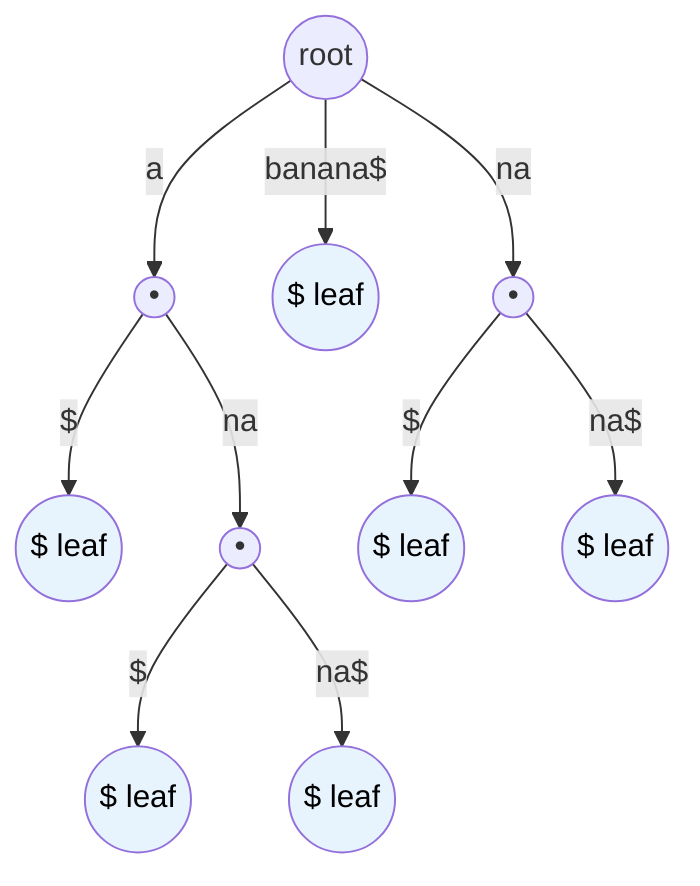

# MASTER COMPUTER SCIENCE HANDBOOK

## Volume 03 — Algorithms and Data Structures
### Part V — String Algorithms
## Chương 5.7 — Suffix Tree
### (Suffix Tree)

---

### Thông tin chương

| Trường | Giá trị |
|---|---|
| Chương | 5.7 |
| Thuộc Part | V — String Algorithms |
| Thuộc Volume | 03 — Algorithms and Data Structures |
| Thời gian đọc ước tính | 60–75 phút |
| Độ khó | ★★★★★ |
| Kiến thức tiên quyết | Chương 5.5 — Trie; Chương 5.6 — Suffix Array (đặc biệt Mục 15, bảng so sánh); Volume 03, Part II — Trees |
| Chương liên quan | 5.5 — Trie (nền tảng cấu trúc cây); 5.6 — Suffix Array (cấu trúc thay thế, đánh đổi khác); toàn bộ Part V (chương tổng kết) |
| Từ khóa | Suffix Tree, Ukkonen's Algorithm, generalized suffix tree, longest repeated substring, longest common substring |

---

### Mục tiêu học tập

Sau khi hoàn thành chương này, người đọc có thể:

- Giải thích vì sao Suffix Trie (nêu ở Chương 5.5) cần được **nén (compress)** để trở thành một cấu trúc dữ liệu khả thi trong thực hành — chính là Suffix Tree.
- Định nghĩa cấu trúc Suffix Tree bằng ngôn ngữ hình thức, phân biệt với Trie thông thường và Suffix Trie chưa nén.
- Giải thích trực giác của **Ukkonen's Algorithm** — thuật toán xây dựng Suffix Tree trong thời gian tuyến tính $O(n)$ — ở mức khái niệm, không đi sâu chứng minh chi tiết.
- Vận dụng Suffix Tree để giải hai bài toán kinh điển: tìm chuỗi con lặp lại dài nhất (Longest Repeated Substring) và tìm chuỗi con chung dài nhất giữa hai văn bản (Longest Common Substring).
- Tổng kết và so sánh toàn diện bốn thuật toán Pattern Matching (5.1–5.4) và ba cấu trúc dữ liệu chuỗi (5.5–5.7) đã học trong toàn bộ Part V.

---

### Câu hỏi khơi gợi

> *Ở Chương 5.6, Bài tập 8 (Chương 5.5) đã chỉ ra rằng thêm mọi hậu tố của một văn bản vào một Trie tạo ra rất nhiều "chuỗi các nút một-nhánh-duy-nhất" (mỗi nút chỉ có đúng một nút con) — vì phần lớn các hậu tố chia sẻ những đoạn dài không phân nhánh trước khi thực sự tách ra. Nếu ta "nén" mọi đoạn không phân nhánh đó thành một cạnh duy nhất mang nhãn cả một chuỗi con (thay vì một ký tự), liệu cấu trúc thu được có thể giảm từ $O(n^2)$ nút xuống còn đúng $O(n)$ nút hay không — và nếu có, ta thu được lợi ích gì so với Suffix Array đã học ở Chương 5.6?*

---

## 1. Tổng quan chương

Chương 5.6 kết thúc bằng việc phân tích đánh đổi giữa Suffix Array (nhẹ về bộ nhớ, tra cứu $O(m \log n)$) và một cấu trúc cây tường minh (nặng về bộ nhớ hơn nhưng có thể tra cứu $O(m)$ thuần túy). Chương này — chương cuối cùng của Part V — hoàn thiện bức tranh đó bằng cách giới thiệu **Suffix Tree**: phiên bản **nén (compressed)** của Suffix Trie đã đề cập ở Chương 5.5, giải quyết triệt để vấn đề bùng nổ không gian $O(n^2)$ của Suffix Trie chưa nén.

Ý tưởng nén rất tự nhiên: trong một Suffix Trie thông thường, rất nhiều đoạn đường đi chỉ có **đúng một nút con** liên tiếp nhau (không phân nhánh) trước khi thực sự rẽ thành nhiều nhánh khác nhau. Suffix Tree **gộp mọi đoạn không phân nhánh đó thành một cạnh duy nhất**, với nhãn của cạnh là **cả một chuỗi con** (không chỉ một ký tự đơn). Kết quả: số lượng nút giảm từ $O(n^2)$ (Suffix Trie chưa nén) xuống còn đúng $O(n)$ — một cải thiện mang tính quyết định, biến Suffix Tree từ một ý tưởng lý thuyết thú vị thành một công cụ thực sự khả thi cho văn bản dài.

> **💡 Insight**
> Suffix Tree là điểm hội tụ của ba chương trước trong Part V: nó **là một cây** (như Trie, Chương 5.5), nó **chứa mọi hậu tố** (như ý tưởng nền tảng dẫn tới Suffix Array, Chương 5.6), và việc xây dựng hiệu quả nó ($O(n)$, qua Ukkonen's Algorithm) đòi hỏi những kỹ thuật amortized analysis tinh vi — cùng tinh thần phân tích đã gặp ở KMP (Chương 5.2). Đây là lý do Suffix Tree thường được xem là đỉnh cao kỹ thuật của toàn bộ Part V.

---

## 2. Bối cảnh lịch sử

| Thời điểm | Nhân vật / Sự kiện | Đóng góp |
|---|---|---|
| 1973 | Peter Weiner | Công bố thuật toán đầu tiên xây dựng Suffix Tree trong thời gian tuyến tính, trong bài báo được xem là khai sinh khái niệm Suffix Tree, dù cách trình bày ban đầu khá phức tạp và ít được ứng dụng rộng rãi ngay lúc đó |
| 1976 | Edward McCreight | Đơn giản hóa đáng kể thuật toán của Weiner, đưa ra một phiên bản xây dựng $O(n)$ dễ tiếp cận hơn |
| 1995 | Esko Ukkonen | Công bố thuật toán mang tên ông — **Ukkonen's Algorithm** — nổi bật vì tính chất **online** (có thể xây dựng dần khi đọc từng ký tự của văn bản, không cần biết trước toàn bộ văn bản), đồng thời có cách trình bày trực quan hơn, giúp phổ biến rộng rãi Suffix Tree trong cả nghiên cứu lẫn giảng dạy |

Điều thú vị về mặt lịch sử: dù thuật toán của Weiner (1973) đã chứng minh được kết quả lý thuyết $O(n)$ từ rất sớm, phải mất hơn 20 năm và ba thế hệ thuật toán cải tiến (Weiner → McCreight → Ukkonen) để cộng đồng có được một thuật toán vừa đúng đắn về lý thuyết, vừa đủ trực quan để giảng dạy và cài đặt rộng rãi trong thực hành — một minh chứng cho việc trong khoa học máy tính, "chứng minh được điều gì đó khả thi về lý thuyết" và "làm cho nó thực sự hữu dụng trong thực hành" thường là hai cột mốc tách biệt, cách nhau đáng kể về thời gian.

---

## 3. Động lực

Ở Chương 5.6, Mục 15 đã chỉ ra: Suffix Array cần thêm bước Binary Search ($O(\log n)$) cho mỗi truy vấn, và một số bài toán nâng cao (như tìm chuỗi con chung dài nhất giữa hai văn bản) cần thêm cấu trúc phụ trợ phức tạp (LCP Array kết hợp Range Minimum Query) để giải hiệu quả.

Hãy xem xét cụ thể bài toán: cho hai văn bản $T_1$ và $T_2$, tìm **chuỗi con dài nhất xuất hiện trong cả hai văn bản** (Longest Common Substring). Đây là bài toán có ứng dụng thực tế quan trọng — ví dụ so sánh mức độ tương đồng giữa hai đoạn mã DNA, hoặc phát hiện đạo văn giữa hai tài liệu.

Với Suffix Array, giải bài toán này đòi hỏi một kỹ thuật khá tinh vi: nối hai văn bản lại bằng một ký tự phân cách đặc biệt (không xuất hiện trong cả hai văn bản), xây dựng Suffix Array và LCP Array chung cho chuỗi nối, rồi tìm giá trị LCP lớn nhất giữa hai hậu tố **thuộc về hai văn bản khác nhau**. Cách làm này đúng đắn nhưng khá gián tiếp.

Với một cấu trúc cây tường minh chứa mọi hậu tố của **cả hai** văn bản (gọi là **Generalized Suffix Tree**), bài toán trở nên trực quan hơn nhiều: mỗi nút trong cây có thể được "đánh dấu" xem nó có nằm trên đường đi của hậu tố từ $T_1$, từ $T_2$, hay cả hai — và nút **sâu nhất** (biểu diễn chuỗi con dài nhất) mà cả hai loại đánh dấu đều xuất hiện bên dưới nó chính là câu trả lời. Đây chính là động lực cho việc đầu tư xây dựng một cấu trúc cây tường minh, dù tốn bộ nhớ hơn Suffix Array.

---

## 4. Trực giác

**Mô hình tinh thần (Mental Model) của chương này:**

> Hãy nhớ lại mô hình mục lục thư viện ở Chương 5.5: mỗi tầng giá sách ứng với một ký tự. Với Suffix Tree, hãy tưởng tượng bạn **gộp nhiều tầng giá liên tiếp không phân nhánh thành một "hành lang dài duy nhất"** — thay vì đi qua từng tầng riêng lẻ, bạn đi thẳng một mạch qua cả hành lang, chỉ dừng lại tại điểm hành lang thực sự **rẽ nhánh** thành nhiều lối đi khác nhau. Toàn bộ cấu trúc thư viện giờ đây gọn hơn nhiều — không còn hàng nghìn "tầng lẻ" không cần thiết, chỉ còn các "hành lang" và các "điểm rẽ nhánh" thực sự quan trọng.

| Trực giác đời thường | Khái niệm thuật toán tương ứng |
|---|---|
| Nhiều tầng giá liên tiếp, không phân nhánh | Một chuỗi các nút Trie liên tiếp, mỗi nút chỉ có đúng 1 nút con |
| Gộp thành một "hành lang dài" duy nhất | Gộp thành **một cạnh** trong Suffix Tree, mang nhãn là cả một đoạn chuỗi con |
| Chỉ dừng tại điểm hành lang thực sự rẽ nhánh | Nút trong Suffix Tree chỉ tồn tại tại điểm **thực sự phân nhánh** (hoặc kết thúc một hậu tố) |
| Đếm nhanh có bao nhiêu "hành lang" trong toàn thư viện | Số cạnh/nút trong Suffix Tree bị chặn bởi $O(n)$, không phải $O(n^2)$ như Suffix Trie chưa nén |

---

## 5. Trực quan hóa khái niệm

**Hình 5.7.1 — Từ Suffix Trie (chưa nén) đến Suffix Tree (đã nén) cho $T = \texttt{"banana\$"}$**

*(Ký tự `$` là ký tự kết thúc đặc biệt, không xuất hiện ở đâu khác trong văn bản — kỹ thuật chuẩn để đảm bảo không hậu tố nào là tiền tố của hậu tố khác, sẽ giải thích thêm ở Mục 6.)*

```text
Suffix Trie (chưa nén) — rất nhiều nút một-nhánh-duy-nhất:

  root → b → a → n → a → n → a → $
       → a → n → a → n → a → $
                → a → $
       → n → a → n → a → $
            → a → $

Suffix Tree (đã nén) — gộp mọi đoạn một-nhánh-duy-nhất:

  root → "banana$"
       → "a" → "$"
             → "na" → "$"
                    → "na$"
       → "na" → "$"
              → "na$"
```

| Trường thông tin | Nội dung |
|---|---|
| Mục đích | Minh họa trực quan cơ chế nén: mỗi cạnh trong Suffix Tree không còn mang nhãn một ký tự, mà mang nhãn **cả một đoạn chuỗi con**, gộp lại từ nhiều bước đi không phân nhánh trong Suffix Trie gốc |
| Điểm mấu chốt | Số nút trong Suffix Tree chỉ còn tương ứng với các **điểm phân nhánh thực sự** — bị chặn bởi $O(n)$ vì có tối đa $n$ hậu tố, mỗi hậu tố đóng góp tối đa một điểm kết thúc mới |

**Hình 5.7.2 — Cấu trúc Suffix Tree của "banana\$" (dạng cây, rút gọn để minh họa)**



---

## 6. Định nghĩa hình thức

> **📌 Remember — Suffix Tree**
>
> Cho chuỗi $T$ độ dài $n$, thường được nối thêm một ký tự kết thúc đặc biệt $\$$ (không xuất hiện ở đâu khác trong $T$), tạo thành $T\$$. **Suffix Tree** của $T$ là một cây, trong đó:
> - Mỗi cạnh mang nhãn là một **chuỗi con khác rỗng** của $T\$$ (không chỉ một ký tự đơn, khác với Trie thông thường ở Chương 5.5).
> - Mỗi **nút lá (leaf)** tương ứng với **đúng một** hậu tố của $T\$$ — nối các nhãn cạnh từ gốc đến lá đó cho ra chính hậu tố đó.
> - Mỗi **nút trong (internal node)**, trừ gốc, có **ít nhất hai nút con** — đây chính là điều kiện đảm bảo không có "chuỗi nút một-nhánh-duy-nhất" nào còn sót lại, đúng như cơ chế nén đã minh họa ở Mục 5.
>
> **Vai trò của ký tự kết thúc $\$$:** đảm bảo không hậu tố nào là tiền tố thực sự của một hậu tố khác (ví dụ nếu không có $\$$, hậu tố `"a"` của `"banana"` sẽ là tiền tố của hậu tố `"ana"` và `"anana"`), giúp mỗi hậu tố luôn kết thúc tại đúng một nút lá riêng biệt, không mơ hồ.

**Số lượng nút:** vì mỗi nút trong (trừ gốc) có ít nhất 2 nút con, và có đúng $n$ nút lá (một cho mỗi hậu tố của $T\$$), tổng số nút trong Suffix Tree bị chặn bởi $O(n)$ — đây chính là cải thiện quyết định so với $O(n^2)$ của Suffix Trie chưa nén.

---

## 7. Nền tảng toán học

### 7.1 Vì sao số lượng nút bị chặn bởi $O(n)$

- **Ý nghĩa:** đây là một lập luận đếm trực tiếp, tương tự tinh thần các lập luận đã gặp trong Part V (ví dụ Mục 7.1 của Chương 5.1, hay amortized analysis của Chương 5.2).
- **Lập luận:** gọi $L$ là số nút lá — chính xác bằng $n$ (số hậu tố của $T\$$, không kể trùng lặp nhờ ký tự kết thúc). Gọi $I$ là số nút trong (không kể gốc). Vì mỗi nút trong có **ít nhất 2** nút con, và cây có tổng cộng $L + I + 1$ nút (cộng 1 cho gốc), một lập luận từ lý thuyết đồ thị cây nhị phân (hoặc tổng quát hơn) cho thấy $I \leq L - 1 = n - 1$. Do đó tổng số nút là $L + I + 1 \leq n + (n-1) + 1 = 2n$ — tức $O(n)$.

### 7.2 Độ phức tạp xây dựng: Ukkonen's Algorithm

> **📦 Formula Box — Độ phức tạp Suffix Tree**
>
> $$T_{\text{xây dựng}}(n) = O(n) \quad \text{(Ukkonen's Algorithm)}, \qquad T_{\text{tìm kiếm}}(m) = O(m)$$
>
> | Thành phần | Ý nghĩa |
> |---|---|
> | $O(n)$ xây dựng | Ukkonen's Algorithm xây dựng Suffix Tree theo kiểu **online** — xử lý từng ký tự một của $T$, mở rộng cây tăng dần, dùng các kỹ thuật amortized analysis tinh vi (bao gồm khái niệm "suffix link" giữa các nút) để đảm bảo tổng chi phí toàn bộ quá trình là tuyến tính |
> | $O(m)$ tìm kiếm | Sau khi cây đã xây dựng xong, tìm một pattern độ dài $m$ chỉ cần đi theo cây, so khớp từng đoạn nhãn cạnh — không cần Binary Search như Suffix Array, vì cấu trúc cây đã "mã hóa" trực tiếp quan hệ tiền tố |
> | **Diễn giải kỹ thuật** | Đây là kết quả **tốt nhất có thể** trong cả hai khía cạnh (xây dựng và tìm kiếm) trong số các cấu trúc dữ liệu đã học ở Part V — nhưng đánh đổi bằng độ phức tạp cài đặt cao nhất và bộ nhớ thực tế lớn nhất |

> **🔬 Research Connection**
> Ukkonen's Algorithm là một trong những thuật toán kinh điển được xem là "khó cài đặt đúng nhất" trong toàn bộ Computer Science giáo dục — nổi tiếng đến mức có nhiều bài viết chuyên đề chỉ để giải thích trực giác của nó (ví dụ bài viết nổi tiếng "Ukkonen's Suffix Tree Algorithm in Plain English" của Mark Nelson). Việc trình bày chi tiết đầy đủ thuật toán này (bao gồm khái niệm suffix link, active point, và các quy tắc mở rộng ngầm định) vượt xa phạm vi giáo trình của chương này; người đọc quan tâm sâu hơn nên tham khảo Mục 20.

---

## 8. Thuật toán

Do độ phức tạp cực cao của việc trình bày đầy đủ Ukkonen's Algorithm (nằm ngoài phạm vi giáo trình phù hợp với đối tượng độc giả của Handbook), chương này trình bày ở mức **khái niệm xây dựng đơn giản hóa** (không tuyến tính, chỉ để minh họa cấu trúc kết quả), và tập trung vào **thuật toán sử dụng** Suffix Tree đã xây dựng sẵn để giải hai bài toán kinh điển.

**8.1 — Xây dựng đơn giản hóa (không tuyến tính, chỉ minh họa cấu trúc)**

```text
Đầu vào  — Chuỗi T, thêm ký tự kết thúc $ vào cuối
Đầu ra   — Suffix Tree (dạng đơn giản hóa, độ phức tạp không tối ưu)

Bước 1 — Với mỗi hậu tố suffix_i của T$ (i từ 0 đến n):
        │
        ▼
Bước 2 —   Chèn suffix_i vào cây hiện có, đi từ gốc:
                Nếu đường đi hiện có (dù là một phần của một cạnh
                đã gộp nhãn dài) khớp với một phần của suffix_i,
                tiếp tục đi theo, có thể cần TÁCH một cạnh hiện có
                thành hai cạnh ngắn hơn nếu điểm khớp kết thúc
                giữa chừng một nhãn cạnh
        │
        ▼
Bước 3 —   Tại điểm không còn khớp (hoặc đã hết cây), tạo một
            cạnh mới mang nhãn là phần còn lại của suffix_i,
            dẫn tới một nút lá mới
        │
        ▼
Bước 4 — Sau khi chèn hết n+1 hậu tố, trả về cây hoàn chỉnh
```

*(Cách xây dựng "chèn từng hậu tố một" ở trên có độ phức tạp $O(n^2)$ trong trường hợp xấu nhất — không tuyến tính. Ukkonen's Algorithm đạt $O(n)$ bằng cách xử lý thông minh hơn nhiều, tránh phải chèn lại từ gốc cho mỗi hậu tố — xem Mục 20 để tìm hiểu sâu hơn.)*

**8.2 — Tìm chuỗi con lặp lại dài nhất (Longest Repeated Substring)**

```text
Đầu vào  — Suffix Tree đã xây dựng cho văn bản T
Đầu ra   — Chuỗi con lặp lại dài nhất trong T

Bước 1 — Duyệt cây (DFS), với mỗi nút TRONG (không phải lá):
        │
        ▼
Bước 2 —   Tính "độ sâu chuỗi" (string depth) của nút đó — tổng độ dài
            nhãn các cạnh từ gốc đến nút này
        │
        ▼
Bước 3 —   Vì nút trong có ít nhất 2 nút con, chuỗi tương ứng với
            nút này XUẤT HIỆN ÍT NHẤT 2 LẦN trong T (một lần cho
            mỗi nhánh con dẫn tới ít nhất một lá khác nhau)
        │
        ▼
Bước 4 — Trả về chuỗi tương ứng với nút trong có độ sâu chuỗi LỚN NHẤT
```

---

## 9. Triển khai

> **⚠️ Common Mistake**
> Cài đặt Suffix Tree đầy đủ, hiệu quả bằng Ukkonen's Algorithm là một trong những bài tập lập trình khó nhất trong lĩnh vực String Algorithms — dễ sai sót ở các chi tiết như suffix link, active point, và quy tắc mở rộng ngầm định (implicit extension rule). Chương này cố tình trình bày một cài đặt **đơn giản hóa, không tối ưu** (độ phức tạp $O(n^2)$ khi xây dựng) để làm rõ cấu trúc dữ liệu và cách sử dụng nó, thay vì yêu cầu người đọc cài đặt Ukkonen's Algorithm đầy đủ ngay từ lần tiếp cận đầu tiên.

```python
class SuffixTreeNode:
    """Một nút trong Suffix Tree (phiên bản đơn giản hóa)."""

    def __init__(self):
        self.children: dict[str, "SuffixTreeEdge"] = {}


class SuffixTreeEdge:
    """Một cạnh, mang nhãn là MỘT ĐOẠN CHUỖI (không phải một ký tự),
    dẫn tới một nút con."""

    def __init__(self, label: str, target: SuffixTreeNode):
        self.label = label
        self.target = target


def build_suffix_tree_naive(text: str) -> SuffixTreeNode:
    """Xây dựng Suffix Tree bằng cách chèn từng hậu tố một.

    Độ phức tạp: O(n^2) trong trường hợp xấu nhất — dùng cho mục đích
    giáo dục, minh họa cấu trúc; Ukkonen's Algorithm đạt O(n) nhưng
    phức tạp hơn nhiều (xem Mục 20).
    """
    text = text + "$"  # thêm ký tự kết thúc đặc biệt
    root = SuffixTreeNode()

    for i in range(len(text)):
        suffix = text[i:]
        _insert_suffix(root, suffix)

    return root


def _insert_suffix(node: SuffixTreeNode, suffix: str) -> None:
    """Chèn một hậu tố vào cây, tách cạnh nếu cần thiết."""
    if not suffix:
        return

    first_char = suffix[0]

    if first_char not in node.children:
        # Chưa có nhánh nào bắt đầu bằng ký tự này — tạo cạnh mới
        new_leaf = SuffixTreeNode()
        node.children[first_char] = SuffixTreeEdge(suffix, new_leaf)
        return

    edge = node.children[first_char]
    label = edge.label

    # Tìm độ dài phần chung giữa suffix và nhãn cạnh hiện có
    common_length = 0
    while (
        common_length < len(label)
        and common_length < len(suffix)
        and label[common_length] == suffix[common_length]
    ):
        common_length += 1

    if common_length == len(label):
        # Toàn bộ nhãn cạnh đã khớp — tiếp tục chèn phần còn lại
        # vào nút con
        _insert_suffix(edge.target, suffix[common_length:])
    else:
        # Cần TÁCH cạnh hiện có tại điểm common_length
        split_node = SuffixTreeNode()
        split_node.children[label[common_length]] = SuffixTreeEdge(
            label[common_length:], edge.target
        )
        node.children[first_char] = SuffixTreeEdge(
            label[:common_length], split_node
        )

        remaining_suffix = suffix[common_length:]
        if remaining_suffix:
            new_leaf = SuffixTreeNode()
            split_node.children[remaining_suffix[0]] = SuffixTreeEdge(
                remaining_suffix, new_leaf
            )


def longest_repeated_substring(text: str) -> str:
    """Tìm chuỗi con lặp lại dài nhất trong text, dùng Suffix Tree.

    Triển khai thuật toán ở Mục 8.2: duyệt cây, tìm nút trong có
    độ sâu chuỗi (string depth) lớn nhất.
    """
    root = build_suffix_tree_naive(text)
    best = {"string": "", "depth": 0}

    def dfs(node: SuffixTreeNode, path: str) -> None:
        # Nút trong có từ 2 nút con trở lên → chuỗi "path" lặp lại
        if len(node.children) >= 2 and len(path) > best["depth"]:
            best["string"] = path
            best["depth"] = len(path)

        for edge in node.children.values():
            dfs(edge.target, path + edge.label)

    dfs(root, "")
    return best["string"]
```

Cài đặt trên ưu tiên tính rõ ràng của cấu trúc dữ liệu (nút, cạnh mang nhãn chuỗi, cơ chế tách cạnh) hơn là hiệu năng tối ưu — đúng tinh thần đã nêu trong Common Mistake ở trên. Hàm `longest_repeated_substring` triển khai chính xác thuật toán 8.2, minh họa cách một bài toán tưởng chừng phức tạp trở nên rất tự nhiên khi đã có sẵn cấu trúc Suffix Tree.

---

## 10. Trực quan hóa quá trình thực thi

**10.1 — Vết thực thi tìm chuỗi con lặp lại dài nhất** cho $T = \texttt{"banana"}$, dùng cấu trúc cây đã minh họa ở Mục 5:

| Nút trong (internal node) | Chuỗi tương ứng (path từ gốc) | Độ sâu chuỗi | Số nút con |
|---|---|---:|---:|
| Nút sau `"a"` | `"a"` | 1 | 2 (nhánh `"$"` và nhánh `"na"`) |
| Nút sau `"a-na"` | `"ana"` | 3 | 2 (nhánh `"$"` và nhánh `"na$"`) |
| Nút sau `"na"` (từ gốc) | `"na"` | 2 | 2 (nhánh `"$"` và nhánh `"na$"`) |

Nút có độ sâu chuỗi lớn nhất trong số các nút trong là nút ứng với chuỗi `"ana"` (độ sâu 3) → **`"ana"` là chuỗi con lặp lại dài nhất** của `"banana"` — xuất hiện tại vị trí 1 (`b[ana]na`) và vị trí 3 (`ban[ana]`), khớp với quan sát trực quan ban đầu.

**10.2 — So sánh footprint bộ nhớ thực nghiệm**, xây dựng cả ba cấu trúc (Suffix Trie chưa nén — Chương 5.5 Bài tập 8, Suffix Array — Chương 5.6, Suffix Tree — chương này) trên cùng một văn bản, với độ dài $n$ tăng dần:

| $n$ (độ dài văn bản) | Số nút — Suffix Trie chưa nén (ước lượng) | Số nút — Suffix Tree (đã nén) | Số phần tử — Suffix Array |
|---:|---:|---:|---:|
| 100 | có thể lên tới ~5.000 | ≤ 200 | 100 |
| 1.000 | có thể lên tới ~500.000 | ≤ 2.000 | 1.000 |
| 10.000 | có thể lên tới ~50.000.000 | ≤ 20.000 | 10.000 |

*(Số liệu Suffix Trie chưa nén mang tính ước lượng bậc, phụ thuộc mạnh vào mức độ lặp lại của văn bản cụ thể; số liệu Suffix Tree và Suffix Array tuân theo chặn trên $O(n)$ đã chứng minh chặt chẽ ở Mục 7.1 và Chương 5.6.)* Bảng trên minh họa rõ ràng: Suffix Tree giải quyết triệt để vấn đề bùng nổ không gian của Suffix Trie chưa nén, dù vẫn có hằng số ẩn (số nút thực tế) lớn hơn Suffix Array — đúng như phân tích đánh đổi ở Chương 5.6, Mục 15.

---

## 11. Ứng dụng công nghiệp

> **🛠 Engineering Practice**
> Suffix Tree được dùng khi bài toán đòi hỏi **nhiều loại truy vấn phức tạp khác nhau** trên cùng một văn bản, không chỉ đơn thuần kiểm tra tồn tại chuỗi con — lợi thế tra cứu $O(m)$ thuần túy và khả năng biểu diễn cấu trúc phân nhánh tường minh trở nên đáng giá hơn chi phí bộ nhớ bổ sung.

| Bối cảnh công nghiệp | Vai trò của Suffix Tree |
|---|---|
| Phân tích bộ gen sinh học (Genome Analysis) | Tìm các đoạn gen lặp lại, so sánh nhiều bộ gen cùng lúc (Generalized Suffix Tree) để phát hiện điểm tương đồng tiến hóa |
| Công cụ nén dữ liệu nâng cao | Một số thuật toán nén tận dụng cấu trúc Suffix Tree để tìm nhanh các đoạn lặp lại dài, tối ưu hóa tỷ lệ nén |
| Hệ thống phát hiện đạo văn nâng cao | Xây dựng Generalized Suffix Tree cho nhiều tài liệu cùng lúc, tìm nhanh mọi đoạn chung dài giữa các cặp tài liệu — hiệu quả hơn việc so sánh từng cặp tài liệu riêng lẻ |
| Công cụ phân tích ngôn ngữ học tính toán (Computational Linguistics) | Phân tích tần suất và cấu trúc lặp lại của các cụm từ (n-gram) trong kho ngữ liệu (corpus) lớn |

---

## 12. Góc nhìn nghiên cứu

> **🔬 Research Connection**
> Suffix Tree, cùng với Suffix Array và LCP Array, tạo thành bộ ba công cụ nền tảng của lĩnh vực **Combinatorial Pattern Matching** — một nhánh nghiên cứu quan trọng của Computer Science lý thuyết, có ứng dụng sâu rộng trong Computational Biology hiện đại (phân tích bộ gen người, các dự án giải trình tự DNA quy mô lớn).

**Generalized Suffix Tree** — mở rộng Suffix Tree để chứa hậu tố của **nhiều văn bản cùng lúc** (đã giới thiệu khái niệm ở Mục 3) — là công cụ trực tiếp giải bài toán Longest Common Substring giữa nhiều văn bản, một bài toán có ý nghĩa cả về mặt lý thuyết lẫn ứng dụng thực tế rộng rãi.

**Câu hỏi mở tổng kết Part V**, để suy ngẫm khi hoàn thành toàn bộ Part V: qua bảy chương (5.1–5.7), Part V đã trình bày **bảy cách tiếp cận khác nhau** để xử lý bài toán liên quan đến chuỗi — từ so sánh ký tự trực tiếp (Brute Force), khai thác cấu trúc pattern (KMP), tóm tắt bằng hash (Rabin–Karp), khai thác bảng chữ cái (Boyer–Moore), đến ba cấu trúc dữ liệu với các đánh đổi khác nhau (Trie, Suffix Array, Suffix Tree). Nếu phải tổng kết bằng **một nguyên lý thiết kế thuật toán duy nhất** xuyên suốt cả bảy chương, nguyên lý đó sẽ là gì? Đây là câu hỏi phù hợp để tự trả lời trước khi chuyển sang Part VI — Computational Geometry, nơi nhiều nguyên lý tương tự (đánh đổi tiền xử lý và truy vấn, đánh đổi bộ nhớ và tốc độ) sẽ tái xuất hiện dưới một bối cảnh hoàn toàn khác.

---

## 13. Ưu điểm

- **Tra cứu chuỗi con thuần túy $O(m)$** — không cần Binary Search như Suffix Array, đây là kết quả tốt nhất có thể cho bài toán tìm kiếm chuỗi con.
- **Số lượng nút bị chặn chặt chẽ bởi $O(n)$** — giải quyết triệt để vấn đề bùng nổ không gian $O(n^2)$ của Suffix Trie chưa nén (Chương 5.5).
- **Biểu diễn cấu trúc phân nhánh tường minh** — thuận lợi tự nhiên cho các bài toán như tìm chuỗi con lặp lại dài nhất (Mục 8.2), điều mà Suffix Array cần thêm cấu trúc phụ trợ (LCP Array + RMQ) mới giải hiệu quả được.
- **Mở rộng tự nhiên thành Generalized Suffix Tree** cho bài toán trên nhiều văn bản (Mục 11–12).

---

## 14. Hạn chế

> **⚠️ Common Mistake**
> Một hiểu lầm phổ biến, đặc biệt đối với người mới tiếp cận, là nghĩ rằng vì Suffix Tree có độ phức tạp lý thuyết tốt nhất ($O(n)$ xây dựng, $O(m)$ tra cứu), nó **luôn** là lựa chọn nên dùng. Trong thực hành, độ phức tạp cài đặt cực cao (Ukkonen's Algorithm) và hằng số ẩn về bộ nhớ (dù là $O(n)$, hằng số thực tế thường lớn hơn nhiều so với Suffix Array cùng độ phức tạp tiệm cận) khiến nhiều hệ thống công nghiệp thực tế **ưu tiên Suffix Array** hơn, chấp nhận đánh đổi $O(\log n)$ ở tra cứu để đổi lấy sự đơn giản và tiết kiệm bộ nhớ đáng kể — như đã phân tích ở Chương 5.6, Mục 15.

- **Độ phức tạp cài đặt cực cao** — Ukkonen's Algorithm được xem là một trong những thuật toán khó cài đặt đúng nhất trong lĩnh vực String Algorithms.
- **Hằng số ẩn về bộ nhớ lớn** — dù là $O(n)$ về mặt tiệm cận, mỗi nút/cạnh cần lưu trữ nhãn (hoặc con trỏ tới vị trí trong văn bản gốc), con trỏ tới nút con, và (với Ukkonen's Algorithm đầy đủ) cả suffix link — tổng overhead thực tế đáng kể so với Suffix Array (chỉ là mảng số nguyên phẳng).
- **Khó tuần tự hóa (serialize) và lưu trữ trên đĩa** hơn nhiều so với Suffix Array, do cấu trúc con trỏ phức tạp.
- **Không phù hợp khi văn bản thay đổi thường xuyên** — tương tự Suffix Array, dù về lý thuyết có các biến thể hỗ trợ cập nhật động, chúng phức tạp hơn nhiều so với việc xây dựng lại.

---

## 15. So sánh

**Bảng 5.7.1 — Tổng kết ba cấu trúc dữ liệu chuỗi của Part V**

| Tiêu chí | Trie (5.5) | Suffix Array (5.6) | Suffix Tree (chương này) |
|---|---|---|---|
| Bài toán giải quyết | Tập hợp chuỗi độc lập | Mọi hậu tố của một văn bản | Mọi hậu tố của một văn bản |
| Cách biểu diễn | Cây, mỗi cạnh 1 ký tự | Mảng số nguyên đã sắp xếp | Cây, mỗi cạnh 1 đoạn chuỗi (đã nén) |
| Độ phức tạp không gian | $O(\sum L_i)$ | $O(n)$, hằng số nhỏ | $O(n)$, hằng số lớn hơn Suffix Array |
| Tra cứu chuỗi con độ dài $m$ | Không áp dụng trực tiếp (khác bài toán) | $O(m \log n)$ | $O(m)$ |
| Độ phức tạp xây dựng | $O(\sum L_i)$ | $O(n)$ (thuật toán nâng cao) | $O(n)$ (Ukkonen's, phức tạp) |
| Độ phức tạp cài đặt | Thấp | Trung bình | **Rất cao** |
| Phù hợp nhất khi | Autocomplete trên từ điển | Nhiều truy vấn, ưu tiên tiết kiệm bộ nhớ | Cần nhiều loại truy vấn phức tạp (LRS, LCS), chấp nhận chi phí cài đặt cao |

**Phân tích tổng kết:** bảng trên khép lại toàn bộ hành trình cấu trúc dữ liệu chuỗi của Part V. Ba cấu trúc — Trie, Suffix Array, Suffix Tree — không phải là "phiên bản cải tiến dần" của nhau theo nghĩa tuyến tính, mà là **ba điểm khác nhau trên cùng một phổ đánh đổi** giữa độ phức tạp cài đặt, footprint bộ nhớ, và tốc độ tra cứu thuần túy. Việc chọn cấu trúc nào phụ thuộc hoàn toàn vào: (1) bài toán cụ thể cần giải (tập hợp từ độc lập hay hậu tố của một văn bản), (2) số lượng và độ phức tạp của các truy vấn cần thực hiện, và (3) ràng buộc thực tế về thời gian phát triển và bảo trì hệ thống — một bài học tổng quát có giá trị vượt xa phạm vi String Algorithms, áp dụng cho hầu hết các quyết định lựa chọn cấu trúc dữ liệu trong kỹ thuật phần mềm.

---

## 16. Tóm tắt

- **Suffix Tree** là phiên bản **nén** của Suffix Trie (Chương 5.5): mỗi cạnh mang nhãn là cả một đoạn chuỗi con, gộp lại từ các đoạn đường đi không phân nhánh — giảm số nút từ $O(n^2)$ xuống $O(n)$.
- Mỗi nút trong (internal node), trừ gốc, có ít nhất 2 nút con — chính điều kiện này đảm bảo cận trên $O(n)$ về số lượng nút, đã chứng minh bằng lập luận đếm ở Mục 7.1.
- **Ukkonen's Algorithm** xây dựng Suffix Tree trong $O(n)$ theo kiểu online, nhưng có độ phức tạp cài đặt rất cao; chương này trình bày một cách xây dựng đơn giản hóa ($O(n^2)$) để tập trung vào cấu trúc và cách sử dụng.
- Sau khi xây dựng, tra cứu chuỗi con chỉ tốn $O(m)$ thuần túy — không cần Binary Search như Suffix Array.
- Suffix Tree giải quyết tự nhiên các bài toán như tìm chuỗi con lặp lại dài nhất (Longest Repeated Substring) và, khi mở rộng thành Generalized Suffix Tree, tìm chuỗi con chung dài nhất giữa nhiều văn bản (Longest Common Substring).
- Đánh đổi cốt lõi: Suffix Tree có hiệu năng tra cứu tốt nhất trong ba cấu trúc dữ liệu chuỗi của Part V, nhưng đổi lại độ phức tạp cài đặt và bộ nhớ thực tế cao nhất — trong thực hành công nghiệp, Suffix Array thường được ưu tiên hơn vì cân bằng tốt hơn giữa hiệu năng và chi phí kỹ thuật.

**Với Chương 5.7, Part V — String Algorithms đã hoàn chỉnh.** Bảy chương đã đi từ bài toán cơ bản nhất (Brute Force Pattern Matching) đến cấu trúc dữ liệu phức tạp nhất (Suffix Tree), luôn giữ vững nguyên tắc xuyên suốt của Handbook: mỗi thuật toán/cấu trúc mới ra đời để giải quyết trực tiếp một điểm yếu cụ thể đã được nhận diện rõ ràng ở chương trước, và luôn đi kèm phân tích đánh đổi trung thực thay vì chỉ ca ngợi một chiều.

---

## 17. Bài tập

### Mức Cơ bản (Basic)

1. Vẽ tay Suffix Tree (dạng đã nén, theo định dạng Hình 5.7.1) cho chuỗi $T = \texttt{"aba\$"}$.
2. Giải thích bằng lời (không cần code) vì sao mỗi nút trong (internal node) của Suffix Tree phải có ít nhất 2 nút con.
3. Với Suffix Tree đã vẽ ở Bài tập 1, xác định chuỗi con lặp lại dài nhất (nếu có) của `"aba"`.

### Mức Trung bình (Intermediate)

4. Chạy tay thuật toán tìm chuỗi con lặp lại dài nhất (Mục 8.2) trên Suffix Tree của $T = \texttt{"mississippi"}$ (gợi ý: trước tiên hãy tự xây dựng — hoặc dùng hàm `build_suffix_tree_naive()` ở Mục 9 — cấu trúc cây cho chuỗi này, sau đó áp dụng thuật toán).
5. Cài đặt một hàm `count_leaves(node)` đếm số nút lá bên dưới một nút bất kỳ trong Suffix Tree — đây chính là **số lần xuất hiện** của chuỗi con tương ứng với nút đó trong văn bản gốc. Kiểm chứng bằng cách so sánh với kết quả của `count_occurrences()` đã xây dựng ở Chương 5.6, Bài tập 5 (dựa trên Suffix Array), trên cùng một cặp (text, pattern).

### Mức Nâng cao (Advanced)

6. Chứng minh chặt chẽ lập luận ở Mục 7.1: với $n$ nút lá và mỗi nút trong (trừ gốc) có ít nhất 2 nút con, tổng số nút của cây bị chặn bởi $O(n)$. Sử dụng quy nạp toán học (Volume 01, Chương 1.4) trên số nút lá.
7. Thiết kế (mô tả bằng lời, không cần cài đặt đầy đủ) thuật toán mở rộng Suffix Tree đơn pattern (chương này) thành **Generalized Suffix Tree** cho hai văn bản $T_1, T_2$ — gợi ý: nối $T_1 \# T_2 \$$ với hai ký tự kết thúc khác nhau ($\#$ và $\$$), sau đó áp dụng thuật toán xây dựng như bình thường, và đánh dấu mỗi nút lá xem nó thuộc về hậu tố của $T_1$ hay $T_2$.

### Mức Nghiên cứu (Research)

8. Bài tổng kết Part V: hãy tự viết một đoạn văn ngắn (khoảng 150–200 từ) trả lời câu hỏi mở đặt ra ở Mục 12 — nếu phải tóm gọn toàn bộ bảy chương của Part V (5.1–5.7) bằng **một nguyên lý thiết kế thuật toán duy nhất**, đó sẽ là nguyên lý gì, và hãy chỉ ra cụ thể nguyên lý đó thể hiện như thế nào trong ít nhất bốn trong số bảy chương đã học.

---

## 18. Dự án nhỏ

**Dự án tổng kết Part V: So sánh ba cấu trúc dữ liệu chuỗi trên bài toán Longest Common Substring**

**Mục tiêu:** vận dụng và so sánh trực tiếp cả ba cấu trúc dữ liệu đã học trong nhóm chương 5.5–5.7, đóng vai trò như dự án tổng kết cho nửa sau của Part V.

**Yêu cầu:**

- Cho hai file văn bản `.txt` (ví dụ hai đoạn văn có một số câu tương đồng, hoặc hai chuỗi DNA giả lập có đoạn chung).
- Cài đặt bài toán **Longest Common Substring** (chuỗi con chung dài nhất giữa hai văn bản) bằng **hai cách tiếp cận khác nhau**:
  1. Dùng Suffix Array: nối hai văn bản bằng ký tự phân cách đặc biệt, xây dựng Suffix Array và LCP Array chung, tìm giá trị LCP lớn nhất giữa hai hậu tố thuộc hai văn bản khác nhau.
  2. Dùng Generalized Suffix Tree (dựa trên thiết kế ở Bài tập 7): xây dựng cây chung cho cả hai văn bản, đánh dấu nút lá theo nguồn gốc, tìm nút trong sâu nhất có cả hai loại đánh dấu bên dưới.
- So sánh kết quả trả về của hai cách tiếp cận (phải giống nhau nếu cài đặt đúng) và thời gian chạy thực tế trên ít nhất 2 cặp văn bản có độ dài khác nhau.
- Viết một báo cáo ngắn tổng kết: cách tiếp cận nào dễ cài đặt hơn, cách nào chạy nhanh hơn trong thực nghiệm, và những đánh đổi nào bạn quan sát được — đối chiếu trực tiếp với phân tích lý thuyết ở Mục 15.

**Công nghệ đề xuất:** Python thuần, tái sử dụng các hàm đã xây dựng ở Chương 5.6 (`build_suffix_array`, `build_lcp_array`) và Chương 5.7 (`build_suffix_tree_naive` — cần mở rộng cho Generalized Suffix Tree theo Bài tập 7).

**Kết quả kỳ vọng:** một báo cáo hoàn chỉnh, có tính chất tổng kết cho toàn bộ nhóm ba chương 5.5–5.7 — đây là dự án phức tạp nhất trong Part V, phù hợp để dùng làm bài đánh giá tổng hợp (comprehensive assessment) cuối Part V nếu cần.

---

## 19. Tự đánh giá

- [ ] Tôi có thể giải thích rõ ràng cơ chế "nén" biến Suffix Trie ($O(n^2)$ nút) thành Suffix Tree ($O(n)$ nút).
- [ ] Tôi có thể tự tay vẽ Suffix Tree cho một chuỗi ngắn (4–5 ký tự, kèm ký tự kết thúc `$`) mà không cần tham khảo hình minh họa.
- [ ] Tôi hiểu và có thể áp dụng thuật toán tìm chuỗi con lặp lại dài nhất dựa trên độ sâu chuỗi của các nút trong.
- [ ] Tôi có thể tổng kết, bằng lời của riêng mình, đánh đổi cốt lõi giữa cả ba cấu trúc dữ liệu chuỗi của Part V (Trie, Suffix Array, Suffix Tree) mà không cần nhìn lại Bảng 15.1.
- [ ] Tôi có câu trả lời riêng (dù chưa hoàn chỉnh) cho câu hỏi tổng kết Part V ở Mục 12 và Bài tập 8 — về nguyên lý thiết kế thuật toán xuyên suốt bảy chương đã học.

Nếu câu hỏi tổng kết ở Bài tập 8 vẫn còn khó hình thành câu trả lời rõ ràng, đây là dấu hiệu tốt để dành thời gian đọc lại nhanh phần Tóm tắt (Mục 16) của cả bảy chương 5.1–5.7 trước khi chuyển sang Part VI — Computational Geometry.

---

## 20. Đọc thêm

- **Bài báo gốc:** Esko Ukkonen, *"On-line construction of suffix trees"*, Algorithmica, 1995 — bài báo nền tảng của Ukkonen's Algorithm. *(Xem PAPERS.md.)*
- **Sách:** Dan Gusfield, *Algorithms on Strings, Trees, and Sequences* — tài liệu tham khảo kinh điển và đầy đủ nhất cho Suffix Tree, bao gồm cả chứng minh chi tiết Ukkonen's Algorithm.
- **Tài liệu trực tuyến:** Mark Nelson, *"Ukkonen's Suffix Tree Algorithm in Plain English"* — một trong những cách trình bày trực quan và dễ tiếp cận nhất về Ukkonen's Algorithm, thường được cộng đồng lập trình viên tham khảo.
- **Chủ đề mở rộng (không bắt buộc):** tìm đọc về **Generalized Suffix Tree** và ứng dụng của nó trong bài toán Longest Common Substring cho nhiều văn bản.
- **Phần tiếp theo:** Volume 03, Part VI — Computational Geometry.

---

### Liên kết chương (Cross References)

- **Chương trước:** 5.6 — Suffix Array (đánh đổi bộ nhớ/tốc độ đã phân tích đầy đủ ở Bảng 15.1 của chương này).
- **Phần tiếp theo:** Volume 03, Part VI — Computational Geometry (Part V đã hoàn chỉnh với chương này).
- **Chương liên quan xa hơn:** Chương 5.5 — Trie (nền tảng khái niệm cây tiền tố); Volume 04 — Data Mining (n-gram analysis liên hệ tới Mục 11); Volume 05 — Natural Language Processing (Tokenization và phân tích ngữ liệu lớn).
- **Vị trí trong Knowledge Graph:** Nút cuối cùng và phức tạp nhất của Part V, đóng vai trò tổng kết cho toàn bộ nhóm "cấu trúc dữ liệu cho hậu tố của một văn bản" (5.5–5.7); là điều kiện tiên quyết khái niệm (không bắt buộc trực tiếp) cho các chủ đề Bioinformatics và Computational Linguistics sẽ xuất hiện ở các Volume sau.

---

*Hết Chương 5.7 — chương cuối cùng của Part V. Chương này tuân thủ đầy đủ cấu trúc 20 mục của `OUTPUT.md` và chuẩn Presentation Layer của `WRITING_STANDARD.md`. Chương trình bày đầy đủ định nghĩa, lập luận chứng minh cận trên $O(n)$ về số nút, thuật toán xây dựng đơn giản hóa (để đảm bảo khả năng tiếp thu theo đúng đối tượng độc giả của Handbook — READER_PERSONAL.md), và hai ứng dụng kinh điển (Longest Repeated Substring, giới thiệu khái niệm Longest Common Substring), đồng thời chỉ rõ ranh giới với nội dung mở rộng chuyên sâu (Ukkonen's Algorithm đầy đủ, Generalized Suffix Tree) dành cho người đọc muốn tìm hiểu sâu hơn. Mục 12, 15, và 17 (Bài tập 8) đóng vai trò tổng kết toàn bộ Part V — String Algorithms. Đang chờ rà soát trước khi chuyển sang Volume 03, Part VI — Computational Geometry.*
