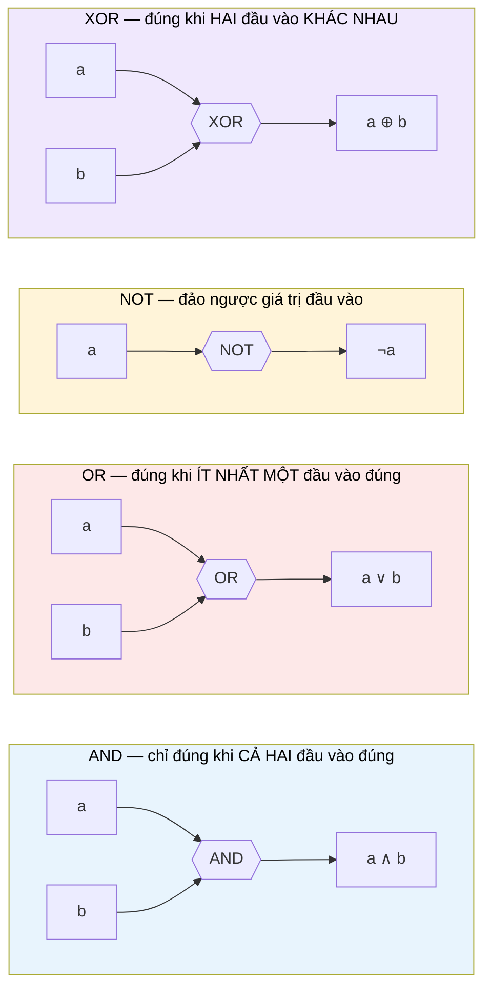

# MASTER COMPUTER SCIENCE HANDBOOK

## Volume 04 — Computer Systems
### Part I — Computer Organization and Architecture
## Chương 4.1.1 — Digital Logic Overview
### (Tổng quan Mạch số)

---

### Thông tin chương

| Trường | Giá trị |
|---|---|
| Chương | 4.1.1 |
| Thuộc Part | I — Computer Organization and Architecture |
| Thuộc Volume | 04 — Computer Systems |
| Thời gian đọc ước tính | 50–65 phút |
| Độ khó | ★★★☆☆ |
| Kiến thức tiên quyết | Volume 1, Chương 1.3 — Propositional and Predicate Logic; Volume 1, Chương 1.5 — Set Theory (De Morgan); Volume 2, Part V — Computer Organization & Architecture (tổng quan) |
| Chương liên quan | 4.1.2 — Instruction Set Architecture (ISA): tập lệnh mà mạch số ở chương này hiện thực hóa; 4.1.3 — CPU Organization: ALU và thanh ghi được xây từ chính các mạch giới thiệu ở đây |
| Từ khóa | logic gate, truth table, combinational circuit, sequential circuit, flip-flop, register, clock signal, half adder, full adder |

---

### Mục tiêu học tập

Sau khi hoàn thành chương này, người đọc có thể:

- Giải thích mối liên hệ trực tiếp giữa Boolean Algebra (Volume 1, Chương 1.3) và cổng logic (logic gate) vật lý.
- Đọc và xây dựng bảng chân trị (truth table) cho các cổng logic cơ bản: AND, OR, NOT, NAND, NOR, XOR, XNOR.
- Phân biệt mạch tổ hợp (combinational circuit) và mạch tuần tự (sequential circuit) dựa trên tiêu chí có/không có bộ nhớ trạng thái.
- Thiết kế một mạch tổ hợp đơn giản (half adder, full adder) từ bảng chân trị, sử dụng kỹ thuật Sum of Products.
- Giải thích vai trò của tín hiệu clock (clock signal) và cách flip-flop lưu trữ một bit trạng thái.
- Kết nối các khái niệm trong chương với chu trình fetch–decode–execute sẽ học ở Chương 4.1.3.

---

### Câu hỏi khơi gợi

> *Khi bạn viết `if (a && b)` trong một ngôn ngữ lập trình bất kỳ, phép toán `&&` đó cuối cùng được "vật chất hóa" thành cái gì bên trong con chip silicon đang chạy chương trình của bạn? Và làm thế nào một mạch điện — vốn chỉ biết bật/tắt — lại có thể "nhớ" được một giá trị, ví dụ như biến đếm trong vòng lặp `for`, trong khi dòng điện thì luôn chảy liên tục chứ không dừng lại chờ đợi?*

---

## 1. Tổng quan chương

Volume 2 (Part V — Computer Organization & Architecture) đã giới thiệu CPU, bộ nhớ, và thanh ghi như những khái niệm trừu tượng để phục vụ tư duy hệ thống. Chương này — chương mở đầu của Volume 04 — quay lại điểm khởi đầu thấp nhất: **làm thế nào để xây dựng một cỗ máy tính toán từ những linh kiện chỉ biết hai trạng thái, bật và tắt?**

Đây là mắt xích còn thiếu giữa hai thế giới tưởng như tách biệt: Boolean Algebra (Volume 1, Chương 1.3) — một hệ thống ký hiệu thuần túy trừu tượng — và con chip silicon vật lý đang thực thi chương trình của bạn ngay lúc này. Câu trả lời, hóa ra, không có khoảng cách nào cả: cổng logic **chính là** phép toán Boolean, chỉ khác là được hiện thực bằng linh kiện điện tử thay vì ký hiệu trên giấy.

Chương này cũng đặt nền cho toàn bộ Part I: mọi kỹ thuật CPU hiện đại — pipeline (4.1.4), superscalar (4.1.5), branch prediction (4.1.6) — đều là các cách tổ chức thông minh hơn của chính những mạch tổ hợp và mạch tuần tự sẽ học ở đây.

> **💡 Insight**
> Nếu Chương 1.3 (Volume 1) dạy bạn ngôn ngữ của logic, và Chương 1.5 (Volume 1) dạy bạn ngôn ngữ của tập hợp, thì chương này dạy bạn cách hai ngôn ngữ đó được "đúc" thành vật chất — silicon, điện áp, và dòng electron. Không có phép màu nào ở giữa; chỉ có kỹ thuật.

---

## 2. Bối cảnh lịch sử

| Thời điểm | Nhân vật / Sự kiện | Đóng góp |
|---|---|---|
| 1854 | George Boole | Công bố Boolean Algebra — hệ thống đại số cho các giá trị logic Đúng/Sai, ban đầu thuần túy là công trình triết học–toán học, không liên quan đến điện tử |
| 1937 | Claude Shannon | Chứng minh rằng Boolean Algebra có thể áp dụng trực tiếp để phân tích và thiết kế mạch chuyển mạch relay (switching circuits) — đặt nền tảng lý thuyết cho toàn bộ ngành thiết kế mạch số hiện đại |
| 1945 | John von Neumann | Đề xuất kiến trúc stored-program — mô hình máy tính lưu cả chương trình lẫn dữ liệu trong cùng một bộ nhớ, tiền đề trực tiếp cho tổ chức CPU sẽ học ở Chương 4.1.3 |
| 1947 | Bell Labs (John Bardeen, Walter Brattain, William Shockley) | Phát minh transistor — linh kiện bán dẫn thay thế đèn chân không, giúp cổng logic trở nên nhỏ, rẻ, và đáng tin cậy ở quy mô công nghiệp |

Điều đáng chú ý trong lịch sử này: khoảng cách gần **80 năm** giữa công trình thuần lý thuyết của Boole (1854) và ứng dụng thực tiễn của Shannon (1937). Đây là một minh chứng kinh điển cho một chủ đề sẽ lặp lại nhiều lần trong Handbook — toán học "thuần túy" thường đi trước ứng dụng công nghệ hàng thập kỷ, đôi khi cả thế kỷ.

---

## 3. Động lực

Hãy quay lại câu hỏi khơi gợi ở đầu chương. Xét biểu thức điều kiện quen thuộc trong lập trình:

```python
if (is_logged_in and has_permission) or is_admin:
    grant_access()
```

Ở mức mã nguồn, đây là một biểu thức Boolean thuần túy — đúng như bạn đã học ở Volume 1, Chương 1.3: `(p ∧ q) ∨ r`. Nhưng khi chương trình này được biên dịch và thực thi, biểu thức đó không còn là ký hiệu trừu tượng nữa. Nó trở thành một cấu hình vật lý cụ thể của hàng triệu transistor, được sắp xếp thành các cổng AND, OR, kết nối với nhau bằng dây dẫn, nhận điện áp đầu vào và tạo ra điện áp đầu ra tương ứng.

Nhưng có một vấn đề sâu hơn: chương trình của bạn còn có **biến** — `is_logged_in` là một giá trị được *lưu trữ*, không phải chỉ được tính toán tức thời rồi biến mất. Mạch tổ hợp (combinational circuit) — loại mạch mà cổng AND/OR nói trên thuộc về — không có khả năng "nhớ": đầu ra của nó chỉ phụ thuộc vào đầu vào tại chính thời điểm hiện tại. Vậy điều gì cho phép một mạch điện lưu giữ giá trị một biến qua nhiều chu kỳ đồng hồ, trong khi dòng điện vẫn chảy liên tục? Câu trả lời — **mạch tuần tự (sequential circuit)** và **flip-flop** — là phần thứ hai, và quan trọng không kém, của chương này.

---

## 4. Trực giác

**Mô hình tinh thần (Mental Model) của chương này:**

> Một **cổng logic (logic gate)** giống như một **công tắc thông minh**: nó nhận vào một hoặc nhiều tín hiệu bật/tắt, và dựa trên một quy tắc cố định, quyết định đầu ra của chính nó là bật hay tắt. Một **mạch tổ hợp** là một mạng lưới các công tắc thông minh đó, được nối dây với nhau — giống hệt cách bạn ghép các hàm thuần túy (pure function) trong lập trình để tạo ra một pipeline xử lý dữ liệu.
>
> Một **flip-flop**, ngược lại, giống như một **biến trạng thái (state variable)** trong lập trình hướng đối tượng: nó "nhớ" giá trị hiện tại của mình, và chỉ cập nhật giá trị đó khi nhận được một tín hiệu rõ ràng để làm vậy — đó chính là vai trò của **tín hiệu clock**.

| Trực giác kỹ thuật bạn đã có | Khái niệm phần cứng tương ứng |
|---|---|
| Hàm thuần túy (pure function) `f(a, b) = a && b` | Cổng logic AND — đầu ra chỉ phụ thuộc đầu vào hiện tại |
| Biến instance (`this.state`) trong một class | Flip-flop — lưu trạng thái qua thời gian |
| Vòng lặp `while (true) { tick(); }` trong một game engine | Tín hiệu clock — nhịp đập đều đặn điều khiển khi nào trạng thái được cập nhật |
| Ghép nhiều hàm thuần túy thành một pipeline xử lý | Mạch tổ hợp gồm nhiều cổng logic nối dây với nhau |

---

## 5. Trực quan hóa khái niệm

**Hình 4.1.1.1 — Ký hiệu và bảng chân trị của các cổng logic cơ bản**
*(Visual đặc trưng của chương — Chapter Identity)*



| Trường thông tin | Nội dung |
|---|---|
| Mục đích | Cho một hình ảnh trực tiếp về cách bốn cổng logic cơ bản biến đổi tín hiệu đầu vào — sẽ được dùng làm khối xây dựng cho mọi mạch phức tạp hơn trong suốt Part I |
| Điểm mấu chốt | So sánh với Bảng 1.5.1 (Volume 1, Chương 1.5): AND/OR/NOT ở đây chính là hiện thực vật lý của $\wedge, \vee, \neg$ đã học — không có ký hiệu nào mới, chỉ có cách biểu diễn mới |

---

**Hình 4.1.1.2 — Từ Combinational Circuit đến Sequential Circuit: vai trò của Clock**

```text
  MẠCH TỔ HỢP (Combinational)              MẠCH TUẦN TỰ (Sequential)
  ─────────────────────────                ──────────────────────────
                                            
   Input ──▶ [ Cổng logic ] ──▶ Output       Input ──▶ [ Cổng logic ] ──▶ D ──▶ [FLIP-FLOP] ──▶ Output
                                                                              ▲
   Đầu ra CHỈ phụ thuộc                                                      │
   đầu vào TẠI THỜI ĐIỂM                                                  Clock
   HIỆN TẠI. Không có                                                    (tín hiệu
   khái niệm "trước đó".                                                  nhịp đều)
                                            
                                            Đầu ra chỉ CẬP NHẬT tại cạnh
                                            lên (rising edge) của Clock —
                                            giữa hai cạnh lên, giá trị
                                            được "khóa" (latched) lại.
```

*Mục đích:* Cho thấy trực quan sự khác biệt cốt lõi — mạch tổ hợp không có "bộ nhớ" về quá khứ, còn mạch tuần tự có, và chính tín hiệu Clock là cơ chế quyết định "khi nào thì được phép nhớ giá trị mới". *Điểm mấu chốt:* đây là câu trả lời trực tiếp cho câu hỏi khơi gợi ở đầu chương — biến trong chương trình của bạn được lưu trong các flip-flop, và giá trị đó chỉ thay đổi tại đúng thời điểm CPU "tick" (một chu kỳ clock).

---

## 6. Định nghĩa hình thức

> **📌 Remember — Cổng logic (Logic Gate)**
>
> Một **cổng logic (logic gate)** là một linh kiện điện tử hiện thực hóa một hàm Boolean: nhận vào một hoặc nhiều tín hiệu nhị phân (0 hoặc 1, tương ứng với hai mức điện áp), và tạo ra một tín hiệu đầu ra nhị phân duy nhất, theo đúng quy tắc của phép toán Boolean tương ứng (Volume 1, Chương 1.3).
>
> Bảng chân trị (truth table) của bảy cổng cơ bản, với $a, b \in \{0, 1\}$:

| $a$ | $b$ | AND ($a \wedge b$) | OR ($a \vee b$) | NAND | NOR | XOR ($a \oplus b$) | XNOR |
|:---:|:---:|:---:|:---:|:---:|:---:|:---:|:---:|
| 0 | 0 | 0 | 0 | 1 | 1 | 0 | 1 |
| 0 | 1 | 0 | 1 | 1 | 0 | 1 | 0 |
| 1 | 0 | 0 | 1 | 1 | 0 | 1 | 0 |
| 1 | 1 | 1 | 1 | 0 | 0 | 0 | 1 |

(NOT chỉ nhận một đầu vào: $\neg 0 = 1$, $\neg 1 = 0$.)

> **📌 Remember — Mạch tổ hợp và Mạch tuần tự**
>
> - **Mạch tổ hợp (Combinational Circuit):** một mạng lưới cổng logic mà đầu ra tại một thời điểm bất kỳ **chỉ** phụ thuộc vào giá trị đầu vào tại chính thời điểm đó. Không có phần tử lưu trữ trạng thái.
> - **Mạch tuần tự (Sequential Circuit):** một mạch mà đầu ra phụ thuộc vào cả đầu vào hiện tại **và** trạng thái nội bộ được lưu từ trước — tức là mạch có "bộ nhớ". Mọi mạch tuần tự đều chứa ít nhất một **flip-flop**.
> - **Flip-flop:** phần tử mạch cơ bản lưu trữ đúng **1 bit** trạng thái, và chỉ cập nhật giá trị lưu trữ tại một sự kiện đồng bộ hóa gọi là **cạnh lên của Clock (rising clock edge)**.
> - **Thanh ghi (Register):** một tập hợp $n$ flip-flop được ghép song song, dùng để lưu trữ một giá trị $n$ bit — chính là thanh ghi CPU sẽ gặp lại ở Chương 4.1.3.

---

## 7. Nền tảng toán học

### 7.1 Từ Bảng chân trị đến Mạch: kỹ thuật Sum of Products

- **Ý nghĩa:** Cho bất kỳ bảng chân trị nào, luôn tồn tại một cách xây dựng biểu thức Boolean — và do đó, một mạch tổ hợp — cho ra chính xác bảng chân trị đó.
- **Nguyên tắc:** với mỗi hàng trong bảng chân trị có đầu ra bằng 1, viết một "tích" (AND) của các biến (lấy biến nguyên nếu giá trị là 1, lấy phủ định nếu giá trị là 0); sau đó lấy "tổng" (OR) của tất cả các tích đó.

> **📦 Formula Box — Sum of Products (SOP)**
>
> $$f(x_1, \dots, x_n) = \bigvee_{\substack{\text{hàng } r \\ f(r) = 1}} \left( \bigwedge_{i=1}^{n} \ell_i^{(r)} \right), \quad \ell_i^{(r)} = \begin{cases} x_i & \text{nếu } x_i = 1 \text{ tại hàng } r \\ \neg x_i & \text{nếu } x_i = 0 \text{ tại hàng } r \end{cases}$$
>
> | Thành phần | Ý nghĩa |
> |---|---|
> | $\bigwedge$ (tích, "Product") | Mỗi hàng có đầu ra 1 sinh ra đúng một cổng AND các literal — "bắt" chính xác tổ hợp đầu vào của hàng đó |
> | $\bigvee$ (tổng, "Sum") | Gộp tất cả các "trường hợp đúng" lại bằng một cổng OR duy nhất |
> | **Diễn giải kỹ thuật** | Đây là bản dịch trực tiếp của set-builder notation (Volume 1, Chương 1.5, Mục 6) sang mạch: "hàm bằng 1 khi và chỉ khi đầu vào khớp với MỘT TRONG các cấu hình đã liệt kê" — đúng cấu trúc $\vee$ của phép hợp |
> | **Ứng dụng thường gặp** | Tổng hợp mạch số tự động (logic synthesis) trong công cụ thiết kế phần cứng (EDA tools); nền tảng cho việc thiết kế ALU ở Chương 4.1.3 |

**Ví dụ áp dụng — thiết kế cổng XOR từ SOP** (kiểm chứng lại bảng ở Mục 6): XOR bằng 1 tại hai hàng $(a,b) = (0,1)$ và $(1,0)$. Áp dụng công thức:

$$a \oplus b = (\neg a \wedge b) \vee (a \wedge \neg b)$$

Đây chính xác là công thức XOR quen thuộc — không phải được "cho trước", mà được **suy ra một cách máy móc** từ bảng chân trị bằng quy tắc SOP.

### 7.2 Half Adder và Full Adder — mạch cộng nhị phân

- **Ý nghĩa:** Đây là bài toán mạch tổ hợp kinh điển nhất, vì nó là viên gạch đầu tiên xây nên đơn vị số học của CPU (ALU, Chương 4.1.3).
- **Half Adder:** cộng hai bit $a, b$, cho ra **Sum** (tổng, 1 bit) và **Carry** (bit nhớ, 1 bit).

| $a$ | $b$ | Sum | Carry |
|:---:|:---:|:---:|:---:|
| 0 | 0 | 0 | 0 |
| 0 | 1 | 1 | 0 |
| 1 | 0 | 1 | 0 |
| 1 | 1 | 0 | 1 |

Áp dụng SOP: $\text{Sum} = a \oplus b$ (giống hệt XOR ở Mục 7.1), $\text{Carry} = a \wedge b$.

> **📦 Formula Box — Half Adder**
>
> $$\text{Sum} = a \oplus b \qquad \text{Carry} = a \wedge b$$
>
> | Thành phần | Ý nghĩa |
> |---|---|
> | Sum | Kết quả cộng 1 bit, bỏ qua phần tràn |
> | Carry | Bit "nhớ" cần cộng dồn sang hàng kế tiếp — giống hệt phép cộng tay bạn học ở tiểu học |
> | **Hạn chế** | Half Adder chỉ cộng được 2 bit đơn lẻ, **không nhận carry từ hàng trước** — vì vậy không thể ghép chuỗi để cộng số nhiều bit. Đây là lý do Full Adder ra đời. |

**Full Adder** khắc phục hạn chế trên bằng cách nhận thêm đầu vào $c_{in}$ (carry từ hàng trước): $\text{Sum} = a \oplus b \oplus c_{in}$, $\text{Carry}_{out} = (a \wedge b) \vee (c_{in} \wedge (a \oplus b))$. Ghép $n$ Full Adder nối tiếp nhau (carry ra của tầng này nối vào carry vào của tầng kế) tạo ra một **Ripple Carry Adder** — mạch cộng hai số nhị phân $n$-bit hoàn chỉnh, và là tiền thân trực tiếp của đơn vị cộng trong ALU (Chương 4.1.3).

---

## 8. Thuật toán / Cơ chế

**Quy trình thiết kế một mạch tổ hợp từ đặc tả bài toán** — tổng quát hóa Mục 7:

```text
Bước 1 — Xác định số lượng đầu vào và đầu ra của bài toán
        │
        ▼
Bước 2 — Liệt kê đầy đủ bảng chân trị: với mỗi tổ hợp đầu vào,
         xác định giá trị đầu ra mong muốn
        │
        ▼
Bước 3 — Với mỗi hàng có đầu ra = 1, viết một cổng AND các
         literal tương ứng (áp dụng quy tắc SOP, Mục 7.1)
        │
        ▼
Bước 4 — Gộp toàn bộ các cổng AND đó bằng một cổng OR duy nhất
        │
        ▼
Bước 5 — (Tùy chọn) Rút gọn biểu thức bằng định luật Boolean
         (De Morgan, phân phối — đã học ở Volume 1, Chương 1.5)
         để giảm số lượng cổng logic cần dùng
        │
        ▼
Bước 6 — Nếu bài toán cần "nhớ" trạng thái qua nhiều bước
         (ví dụ: bộ đếm), thay một phần đầu ra bằng đầu vào
         của flip-flop, đồng bộ hóa bằng tín hiệu Clock
```

> **⚠️ Common Mistake**
> Một sai lầm phổ biến khi mới học thiết kế mạch là **quên Bước 5** — tạo ra một mạch đúng về mặt logic nhưng dùng quá nhiều cổng, gây lãng phí diện tích chip và tăng độ trễ tín hiệu. Trong CPU thực tế, việc tối ưu số cổng (logic minimization) là một bài toán kỹ thuật nghiêm túc, được các công cụ tổng hợp mạch (logic synthesis tools) tự động hóa.

---

## 9. Triển khai

```python
# Mô phỏng mạch tổ hợp: cổng logic cơ bản, half adder, full adder

def AND(a, b): return a & b
def OR(a, b):  return a | b
def NOT(a):    return 1 - a
def XOR(a, b): return a ^ b

def half_adder(a, b):
    """Cộng hai bit đơn lẻ, trả về (sum, carry).
    Áp dụng trực tiếp công thức SOP ở Mục 7.2."""
    s = XOR(a, b)
    c = AND(a, b)
    return s, c

def full_adder(a, b, c_in):
    """Cộng hai bit cùng với carry đầu vào — khối xây dựng
    của Ripple Carry Adder n-bit."""
    s1, c1 = half_adder(a, b)
    s, c2 = half_adder(s1, c_in)
    c_out = OR(c1, c2)
    return s, c_out

def ripple_carry_adder(bits_a, bits_b):
    """Cộng hai số nhị phân biểu diễn dưới dạng list bit
    (LSB đứng trước), dùng chuỗi Full Adder nối tiếp."""
    result, carry = [], 0
    for a, b in zip(bits_a, bits_b):
        s, carry = full_adder(a, b, carry)
        result.append(s)
    result.append(carry)  # bit tràn cuối cùng
    return result


class DFlipFlop:
    """Mô phỏng phần mềm của D Flip-Flop: chỉ cập nhật giá trị
    lưu trữ khi phương thức tick() được gọi (giả lập cạnh lên
    của Clock) — minh họa Hình 4.1.1.2."""

    def __init__(self):
        self.state = 0

    def tick(self, d_input):
        """Được gọi tại mỗi cạnh lên của Clock."""
        old_state = self.state
        self.state = d_input
        return old_state  # đầu ra PHẢN ÁNH giá trị TRƯỚC khi cập nhật
```

Hàm `ripple_carry_adder` triển khai chính xác quy trình ghép nối Full Adder mô tả ở Mục 7.2. Lớp `DFlipFlop` minh họa đặc điểm cốt lõi phân biệt mạch tuần tự với mạch tổ hợp: giá trị chỉ thay đổi khi `tick()` được gọi một cách tường minh — mô phỏng chính xác vai trò của tín hiệu Clock trong Hình 4.1.1.2.

---

## 10. Trực quan hóa quá trình thực thi

**Kiểm chứng `ripple_carry_adder` với các cặp số ngẫu nhiên, so sánh với phép cộng có sẵn của Python** (chạy trên 500 cặp số 8-bit ngẫu nhiên):

```text
Ripple Carry Adder 8-bit — khớp kết quả cộng chuẩn ở toàn bộ 500 phép thử ngẫu nhiên: True
```

**Một ví dụ cụ thể**, cộng $a = 5$ (`00000101`) và $b = 3$ (`00000011`), biểu diễn LSB trước — `[1,0,1,0,0,0,0,0]` và `[1,1,0,0,0,0,0,0]`:

| Bit vị trí | $a_i$ | $b_i$ | $c_{in}$ | Sum | $c_{out}$ |
|:---:|:---:|:---:|:---:|:---:|:---:|
| 0 | 1 | 1 | 0 | 0 | 1 |
| 1 | 0 | 1 | 1 | 0 | 1 |
| 2 | 1 | 0 | 1 | 0 | 1 |
| 3 | 0 | 0 | 1 | 1 | 0 |
| 4–7 | 0 | 0 | 0 | 0 | 0 |

Kết quả: `[0,0,0,1,0,0,0,0]` = $8$ nhị phân — khớp với $5 + 3 = 8$.

**Mô phỏng D Flip-Flop qua 4 chu kỳ Clock**, minh họa đặc tính "chỉ nhớ tại cạnh lên":

```text
Chu kỳ | D đầu vào | Trạng thái TRƯỚC tick | Đầu ra (= trạng thái trước) | Trạng thái SAU tick
-------|-----------|------------------------|------------------------------|---------------------
   1   |     1     |           0             |              0               |          1
   2   |     0     |           1             |              1               |          0
   3   |     1     |           0             |              0               |          1
   4   |     1     |           1             |              1               |          1
```

Quan sát mấu chốt: tại chu kỳ 2, đầu vào D đã đổi thành 0 *trước* khi tick, nhưng đầu ra vẫn phản ánh giá trị **cũ** (1) — đúng bản chất "khóa giá trị giữa hai cạnh Clock" đã mô tả ở Hình 4.1.1.2.

---

## 11. Ứng dụng công nghiệp

> **🛠 Engineering Practice**
> Mọi mạch giới thiệu trong chương này không phải bài tập hàn lâm — chúng là khối xây dựng thực sự bên trong CPU, GPU, và FPGA thương mại.

| Bối cảnh công nghiệp | Vai trò của Digital Logic |
|---|---|
| ALU trong CPU (Intel, AMD, Apple Silicon) | Được xây từ hàng loạt Full Adder ghép song song, cùng các mạch logic thực hiện AND/OR/XOR/dịch bit ở cấp phần cứng — chính xác cơ chế Mục 7.2 và 8 |
| FPGA (Field-Programmable Gate Array) | Chip có thể **lập trình lại cấu hình cổng logic** sau khi sản xuất — cho phép kỹ sư tự thiết kế mạch tổ hợp/tuần tự tùy chỉnh mà không cần đúc chip mới |
| Hardware Description Language (Verilog, VHDL) | Ngôn ngữ mô tả mạch ở mức cao, được công cụ tổng hợp (logic synthesis) tự động chuyển thành mạng lưới cổng logic tối ưu — tự động hóa chính quy trình Mục 8 |
| Thanh ghi CPU (registers), bộ đếm chương trình (Program Counter, sẽ gặp ở Chương 4.1.3) | Được xây trực tiếp từ nhiều D Flip-Flop ghép song song, đồng bộ chung một tín hiệu Clock |

---

## 12. Góc nhìn nghiên cứu

> **🔬 Research Connection**
> Bài toán "làm sao thiết kế một mạch dùng ÍT cổng logic nhất để hiện thực một hàm Boolean cho trước" — gọi là **logic minimization** — không chỉ là vấn đề kỹ thuật mà còn là một bài toán tối ưu tổ hợp (combinatorial optimization) sâu sắc, có liên hệ trực tiếp đến độ phức tạp tính toán (computational complexity, Volume 3) mà bạn sẽ học chi tiết ở các chương về Algorithm Design.

Từ góc độ lịch sử, công trình 1937 của Shannon (Mục 2) không chỉ "áp dụng" Boolean Algebra — nó chứng minh một điều sâu sắc hơn: **bất kỳ hàm Boolean nào với hữu hạn đầu vào cũng có thể hiện thực được bằng một mạch tổ hợp hữu hạn** (chính là nội dung của quy trình SOP ở Mục 7–8). Đây là một dạng "định lý tồn tại" (existence theorem) — nó đảm bảo mọi phép toán logic bạn từng viết trong code đều **có thể** được hiện thực bằng phần cứng, dù mạch thực tế có phức tạp đến đâu.

Một hướng nghiên cứu hiện đại đáng chú ý: **reversible computing** và **quantum logic gates** — nơi các cổng logic không "xóa" thông tin (khác với AND/OR cổ điển, vốn không thể suy ngược đầu vào từ đầu ra). Đây là lĩnh vực nằm ngoài phạm vi Volume 04, nhưng là tiền đề khái niệm cho các chủ đề Quantum Computing được liệt kê như hướng mở rộng tương lai của Handbook (xem `BOOK_STRUCTURE.md`, mục Extensibility).

---

## 13. Ưu điểm

- **Tính tổng quát tuyệt đối:** quy trình SOP (Mục 7–8) đảm bảo *mọi* hàm Boolean hữu hạn đầu vào đều thiết kế được bằng mạch — không có "khoảng trống" giữa logic và phần cứng.
- **Khả năng ghép nối (composability):** các cổng logic đơn giản có thể ghép thành mạch phức tạp tùy ý — Full Adder từ Half Adder, ALU từ Full Adder — đúng nguyên lý "xây dựng từ khối nhỏ" xuyên suốt Computer Science.
- **Đồng bộ hóa đáng tin cậy:** cơ chế Clock cho phép hàng tỷ flip-flop trong một con chip cập nhật trạng thái một cách nhất quán, tránh lỗi do thời gian tín hiệu không đồng đều (race condition ở cấp phần cứng).

---

## 14. Hạn chế

> **⚠️ Common Mistake**
> Người mới học thường nhầm lẫn giữa "mạch tổ hợp không có trạng thái" với "mạch tổ hợp không có độ trễ". Trong thực tế, tín hiệu vẫn mất một khoảng thời gian hữu hạn (propagation delay) để lan truyền qua mỗi cổng — đây chính là yếu tố giới hạn tần số Clock tối đa mà một CPU có thể chạy, một chủ đề sẽ quay lại ở Chương 4.1.4 (Pipeline).

- **Ripple Carry Adder chậm với số nhiều bit:** vì carry phải "lan truyền" tuần tự qua từng Full Adder (Mục 7.2, 9), độ trễ tăng tuyến tính theo số bit — CPU hiện đại dùng các thiết kế nhanh hơn (Carry Lookahead Adder), nằm ngoài phạm vi chương này.
- **Logic minimization là bài toán khó ở quy mô lớn:** với hàm có rất nhiều đầu vào, tìm mạch tối ưu tuyệt đối là bài toán NP-khó (sẽ định nghĩa chính xác ở Volume 3) — công cụ thực tế chỉ tìm được giải pháp gần tối ưu.
- **Chương này chỉ dừng ở mức khái niệm mạch đơn lẻ:** chưa giải thích cách hàng tỷ cổng logic được tổ chức thành một CPU hoàn chỉnh — đó là nội dung của Chương 4.1.3.

---

## 15. So sánh

**Bảng 4.1.1.1 — Mạch tổ hợp và Mạch tuần tự**

| Tiêu chí | Mạch tổ hợp (Combinational) | Mạch tuần tự (Sequential) |
|---|---|---|
| Có phần tử lưu trạng thái? | Không | Có (flip-flop) |
| Đầu ra phụ thuộc vào | Chỉ đầu vào hiện tại | Đầu vào hiện tại + trạng thái lưu trước đó |
| Cần tín hiệu Clock? | Không | Có |
| Ví dụ | Cổng AND/OR, Half Adder, Full Adder | Thanh ghi, bộ đếm, D Flip-Flop |
| Vai trò trong CPU (Chương 4.1.3) | Xây ALU — tính toán số học/logic | Xây Program Counter, thanh ghi — lưu trạng thái thực thi |

**Bảng 4.1.1.2 — Bốn cổng logic cơ bản và ứng dụng SOP điển hình**

| Cổng | Đúng khi nào | Vai trò tiêu biểu |
|---|---|---|
| AND | Cả hai đầu vào đều 1 | Kiểm tra điều kiện đồng thời (`&&` trong code); tính bit Carry (Mục 7.2) |
| OR | Ít nhất một đầu vào là 1 | Kiểm tra điều kiện thay thế (`\|\|` trong code); gộp các trường hợp trong SOP (Mục 7.1) |
| XOR | Hai đầu vào khác nhau | Tính bit Sum khi cộng nhị phân (Mục 7.2); phát hiện thay đổi bit (bit-flip detection) |
| NOT | Đảo ngược đầu vào | Phủ định điều kiện (`!` trong code); literal âm trong SOP |

**Phân tích:** Bảng 4.1.1.1 tái khẳng định thông điệp cốt lõi của chương — ranh giới giữa "có nhớ" và "không nhớ" chính là ranh giới giữa hai loại mạch, và cũng chính là ranh giới sẽ quyết định thiết kế của ALU (thuần tổ hợp) so với Program Counter (thuần tuần tự) ở Chương 4.1.3.

---

## 16. Tóm tắt

- Một **cổng logic** là hiện thực vật lý của một phép toán Boolean; bảy cổng cơ bản (AND, OR, NOT, NAND, NOR, XOR, XNOR) là khối xây dựng cho mọi mạch số.
- Kỹ thuật **Sum of Products (SOP)** cho phép suy ra một mạch tổ hợp từ bất kỳ bảng chân trị nào một cách máy móc, có hệ thống.
- **Half Adder** cộng 2 bit đơn lẻ; **Full Adder** mở rộng để nhận thêm carry, cho phép ghép chuỗi thành mạch cộng số nhiều bit (Ripple Carry Adder) — nền tảng trực tiếp của ALU.
- **Mạch tổ hợp** không có trạng thái (đầu ra chỉ phụ thuộc đầu vào hiện tại); **mạch tuần tự** có trạng thái, lưu trong **flip-flop**, chỉ cập nhật tại cạnh lên của tín hiệu **Clock**.
- Đây chính là cơ chế vật lý cho phép một chương trình "nhớ" giá trị biến qua thời gian, dù dòng điện luôn chảy liên tục — câu trả lời cho câu hỏi khơi gợi đầu chương.

Chương 4.1.2 (Instruction Set Architecture) sẽ dùng các mạch này làm nền: một tập lệnh CPU, xét đến cùng, chỉ là một tập hợp các cấu hình mạch tổ hợp và mạch tuần tự được đặt tên và chuẩn hóa.

---

## 17. Bài tập

### Mức Cơ bản (Basic)

1. Vẽ bảng chân trị cho biểu thức $(a \wedge b) \vee (\neg a \wedge c)$ với $a, b, c \in \{0,1\}$ (8 hàng).
2. Cho $a = 1, b = 0, c_{in} = 1$, tính $\text{Sum}$ và $c_{out}$ của một Full Adder bằng công thức ở Mục 7.2.
3. Giải thích bằng lời (không cần công thức) vì sao NAND và NOR được gọi là "universal gates" — gợi ý: thử biểu diễn NOT, AND, OR chỉ bằng NAND.

### Mức Trung bình (Intermediate)

4. Dùng quy tắc SOP (Mục 7.1, Mục 8) để suy ra biểu thức Boolean cho hàm 3 đầu vào "Majority" — đầu ra bằng 1 khi và chỉ khi **ít nhất 2 trong 3** đầu vào bằng 1. Vẽ bảng chân trị trước khi áp dụng công thức.
5. Chứng minh biểu thức XOR ở Mục 7.1, $a \oplus b = (\neg a \wedge b) \vee (a \wedge \neg b)$, tương đương với $(a \vee b) \wedge \neg(a \wedge b)$, bằng cách dùng các định luật Boolean (De Morgan, phân phối) đã học ở Volume 1, Chương 1.5.

### Mức Nâng cao (Advanced)

6. Mở rộng hàm `ripple_carry_adder` ở Mục 9 để hỗ trợ **phép trừ** hai số nhị phân không dấu, sử dụng biểu diễn bù hai (two's complement) — gợi ý: phép trừ $a - b$ có thể viết lại thành $a + (\neg b) + 1$.
7. Cho một mạch Ripple Carry Adder $n$-bit, giả sử mỗi Full Adder có độ trễ lan truyền (propagation delay) là $d$ đơn vị thời gian cho tín hiệu carry. Viết biểu thức tổng quát cho độ trễ tối đa (worst-case) của toàn mạch theo $n$ và $d$, và giải thích bằng lời tại sao đặc điểm này khiến CPU hiện đại không dùng Ripple Carry Adder cho các phép toán số nguyên lớn.

### Mức Nghiên cứu (Research)

8. Tìm hiểu và trình bày ngắn gọn (không cần lời giải đầy đủ) về khái niệm **Carry Lookahead Adder** — mạch cộng tính trước bit carry của mọi tầng song song thay vì chờ lan truyền tuần tự. So sánh định tính: đánh đổi giữa tốc độ và số lượng cổng logic cần dùng so với Ripple Carry Adder.

---

## 18. Dự án nhỏ

**Dự án: Mô phỏng ALU 4-bit tối giản (Simplified 4-bit ALU Simulator)**

- **Mục tiêu:** Xây dựng một chương trình Python mô phỏng một ALU 4-bit đơn giản, hỗ trợ 4 phép toán: cộng, AND, OR, XOR trên hai số 4-bit, dựa trực tiếp trên các hàm cổng logic và `ripple_carry_adder` đã triển khai ở Mục 9.
- **Yêu cầu:**
  - Nhận vào hai số 4-bit (dạng list bit hoặc số nguyên), và một mã lệnh (opcode) 2-bit chọn phép toán.
  - Trả về kết quả 4-bit tương ứng, cùng một cờ (flag) báo hiệu có tràn số (overflow) hay không.
  - Viết bộ kiểm thử so sánh kết quả với phép toán chuẩn của Python trên ít nhất 100 tổ hợp ngẫu nhiên.
- **Công nghệ gợi ý:** Python thuần, không cần thư viện ngoài.
- **Kết quả mong đợi:** Một hàm `alu(a, b, opcode)` hoạt động chính xác, cùng bảng kiểm thử tương tự Mục 10.
- **Hướng mở rộng:** Thêm phép toán trừ (dùng bù hai, xem Bài tập 6); thêm cờ Zero Flag và Carry Flag — hai khái niệm sẽ xuất hiện lại khi học về Control Unit ở Chương 4.1.3.

---

## 19. Tự đánh giá

- [ ] Tôi có thể tự vẽ bảng chân trị cho bảy cổng logic cơ bản mà không cần tra cứu lại.
- [ ] Tôi có thể áp dụng quy tắc Sum of Products để suy ra một biểu thức Boolean từ một bảng chân trị bất kỳ (không chỉ ghi nhớ công thức XOR/Half Adder có sẵn).
- [ ] Tôi giải thích được rõ ràng sự khác biệt giữa mạch tổ hợp và mạch tuần tự, và vai trò cụ thể của tín hiệu Clock trong việc "khóa" giá trị trạng thái.
- [ ] Tôi đã hoàn thành được Bài tập 4 (thiết kế mạch Majority từ SOP) mà không cần xem lại ví dụ XOR/Half Adder.
- [ ] Tôi hiểu được vì sao Ripple Carry Adder, dù đúng về logic, không phải là thiết kế lý tưởng cho CPU hiệu năng cao.

Nếu Bài tập 4 hoặc 5 vẫn còn khó khăn, nên quay lại ôn nhanh Volume 1, Chương 1.3 (Propositional Logic) và Chương 1.5 (Set Theory — đặc biệt Mục 7.2, De Morgan) trước khi tiếp tục sang Chương 4.1.2 — kỹ năng "từ bảng chân trị suy ra mạch" sẽ được dùng lại liên tục khi thiết kế ALU và Control Unit.

---

## 20. Đọc thêm

- **Sách:** Randal E. Bryant, David R. O'Hallaron, *Computer Systems: A Programmer's Perspective* — chương nền tảng về biểu diễn số và mạch số hỗ trợ số học máy tính. *(Xem BOOKS.md — Volume 4.)*
- **Chủ đề mở rộng (không bắt buộc):** tìm đọc thêm về Karnaugh Map (K-map) — một công cụ trực quan để tối giản biểu thức Boolean nhanh hơn so với áp dụng định luật đại số thủ công, thường xuất hiện trong các giáo trình Digital Design nhập môn.
- **Chương tiếp theo:** Chương 4.1.2 — Instruction Set Architecture (ISA).

---

### Liên kết chương (Cross References)

- **Kiến thức tiên quyết:** Volume 1, Chương 1.3 — Propositional and Predicate Logic (nguồn gốc trực tiếp của các cổng AND/OR/NOT); Volume 1, Chương 1.5 — Set Theory (định luật De Morgan áp dụng lại ở Mục 7, Bài tập 5); Volume 2, Part V (tổng quan CPU/kiến trúc máy tính ở mức khái niệm).
- **Chương tiếp theo:** 4.1.2 — Instruction Set Architecture (ISA), nơi các mạch giới thiệu ở đây được tổ chức thành tập lệnh chuẩn hóa mà phần mềm có thể gọi tới.
- **Chương liên quan xa hơn:** 4.1.3 — CPU Organization (ALU xây từ Full Adder, thanh ghi xây từ D Flip-Flop, đúng như Mục 11 đã nêu); Volume 3 (Algorithms and Data Structures) — bài toán logic minimization (Mục 12, 14) liên hệ trực tiếp đến độ phức tạp tính toán.
- **Vị trí trong Knowledge Graph:** Nút đầu tiên của Volume 04, Part I; không phụ thuộc chương nào khác trong cùng Volume; là điều kiện tiên quyết trực tiếp cho toàn bộ các chương còn lại của Part I (4.1.2 → 4.1.8).

---

*Hết Chương 4.1.1. Chương này tuân thủ đầy đủ cấu trúc 20 mục của `OUTPUT.md` và chuẩn Presentation Layer của `WRITING_STANDARD.md`, mở đầu Part I — Computer Organization and Architecture của Volume 04. Mọi kết quả về Ripple Carry Adder và D Flip-Flop đều được kiểm chứng thực nghiệm bằng Python (bao gồm 500 phép thử ngẫu nhiên cho phép cộng 8-bit). Đang chờ rà soát trước khi tiếp tục sang Chương 4.1.2 — Instruction Set Architecture.*
