# MASTER COMPUTER SCIENCE HANDBOOK

## Volume 04 — Computer Systems
### Part I — Computer Organization and Architecture
## Chương 4.1.3 — CPU Organization & Instruction Execution Cycle
### (Tổ chức CPU và Chu trình Thực thi Lệnh)

---

### Thông tin chương

| Trường | Giá trị |
|---|---|
| Chương | 4.1.3 |
| Thuộc Part | I — Computer Organization and Architecture |
| Thuộc Volume | 04 — Computer Systems |
| Thời gian đọc ước tính | 55–70 phút |
| Độ khó | ★★★☆☆ |
| Kiến thức tiên quyết | Chương 4.1.1 — Digital Logic Overview; Chương 4.1.2 — Instruction Set Architecture (ISA) |
| Chương liên quan | 4.1.4 — Pipeline: kỹ thuật tăng thông lượng bằng cách xử lý chồng lấp nhiều chu trình fetch–decode–execute học ở chương này |
| Từ khóa | Datapath, Control Unit, ALU, Program Counter, Instruction Register, fetch–decode–execute, single-cycle CPU, multi-cycle CPU, CPI |

---

### Mục tiêu học tập

Sau khi hoàn thành chương này, người đọc có thể:

- Giải thích chu trình fetch–decode–execute như một máy trạng thái hữu hạn (finite state machine) hoạt động lặp lại liên tục.
- Phân biệt vai trò của Datapath (nơi dữ liệu di chuyển và biến đổi) và Control Unit (nơi quyết định dữ liệu di chuyển ra sao).
- Mô tả chức năng của các thành phần CPU cốt lõi: ALU, Program Counter, Instruction Register, thanh ghi đa dụng.
- Tính thời gian thực thi chương trình bằng công thức hiệu năng cổ điển (Instructions × CPI × Clock Cycle Time).
- Phân biệt thiết kế CPU đơn chu kỳ (single-cycle) và đa chu kỳ (multi-cycle), nêu được đánh đổi giữa hai cách tiếp cận.
- Mô phỏng bằng phần mềm một CPU tối giản, thực thi đúng chương trình mã hóa theo ISA đã học ở Chương 4.1.2.

---

### Câu hỏi khơi gợi

> *Khi bạn gõ `x = a + b` trong Python, và dòng lệnh đó cuối cùng chạy trên CPU thật, chuyện gì xảy ra theo đúng trình tự thời gian — tính bằng nano-giây — bên trong con chip? Điều gì "biết" rằng lệnh tiếp theo cần thực thi nằm ở đâu trong bộ nhớ, và điều gì đảm bảo CPU không thực thi nhầm lệnh, hay thực thi hai lệnh cùng lúc một cách hỗn loạn?*

---

## 1. Tổng quan chương

Chương 4.1.2 đã trả lời câu hỏi "một lệnh máy trông như thế nào và có ý nghĩa gì", nhưng cố tình bỏ ngỏ một câu hỏi khác: **CPU tìm ra lệnh tiếp theo cần thực thi bằng cách nào, và tổ chức nội bộ nào biến một chuỗi bit đã giải mã thành hành động thực sự?**

Chương này lắp ráp mọi mảnh ghép đã có — cổng logic và mạch tuần tự (Chương 4.1.1), cấu trúc lệnh và ISA (Chương 4.1.2) — thành một cỗ máy hoàn chỉnh: **CPU**, vận hành theo một vòng lặp bất tận gọi là **chu trình fetch–decode–execute (fetch–decode–execute cycle)**. Đây là chương "lắp ráp" quan trọng nhất của Part I: mọi kỹ thuật tăng hiệu năng CPU học ở các chương sau — pipeline (4.1.4), superscalar (4.1.5), branch prediction (4.1.6) — đều là các biến thể tinh vi hơn của chính vòng lặp cơ bản sẽ học ở đây.

> **💡 Insight**
> Chu trình fetch–decode–execute, xét đến cùng, chỉ là một **vòng lặp `while (true)`** chạy trên phần cứng: lấy lệnh tiếp theo, hiểu lệnh đó nghĩa là gì, thực hiện nó, rồi quay lại từ đầu. Sự khác biệt duy nhất so với một vòng lặp phần mềm thông thường là: mỗi "bước lặp" ở đây được thực hiện bởi mạch tổ hợp và mạch tuần tự (Chương 4.1.1), đồng bộ hóa chặt chẽ bởi tín hiệu Clock, với tốc độ hàng tỷ lần mỗi giây.

---

## 2. Bối cảnh lịch sử

| Thời điểm | Sự kiện | Đóng góp |
|---|---|---|
| 1945 | John von Neumann, kiến trúc stored-program (đã nêu ở Chương 4.1.1, Mục 2 và Chương 4.1.2, Mục 2) | Đề xuất mô hình: chương trình và dữ liệu cùng nằm trong một bộ nhớ duy nhất, được CPU đọc tuần tự theo một con trỏ lệnh — tiền đề trực tiếp của Program Counter trong chương này |
| Thập niên 1950–1960 | Các máy tính thế hệ đầu (ví dụ dòng IBM) | Hiện thực hóa chu trình fetch–decode–execute bằng mạch điện tử thực sự lần đầu tiên, thay vì chỉ là mô hình lý thuyết |
| Thập niên 1970–1980 | Vi xử lý đơn chip (single-chip microprocessor, ví dụ Intel 4004, 8086) | Tích hợp toàn bộ Datapath và Control Unit vào một con chip duy nhất — đặt nền tảng cho máy tính cá nhân |

Một chi tiết đáng chú ý về kiến trúc bộ nhớ: kiến trúc **von Neumann** cổ điển (chương trình và dữ liệu chung một bộ nhớ) khác với kiến trúc **Harvard** (bộ nhớ chương trình và bộ nhớ dữ liệu tách biệt vật lý) — cả hai vẫn cùng tồn tại song song trong công nghiệp ngày nay, với Harvard phổ biến hơn trong các hệ thống nhúng (embedded systems) cần băng thông truy cập lệnh và dữ liệu độc lập. Chương này tập trung vào mô hình von Neumann, phù hợp với đa số CPU đa dụng (general-purpose CPU).

---

## 3. Động lực

Quay lại câu hỏi khơi gợi: dòng lệnh `x = a + b` sau khi biên dịch trở thành một (hoặc vài) lệnh máy — theo đúng khuôn dạng đã học ở Chương 4.1.2, ví dụ dạng đơn giản hóa `LOAD a`, `ADD b`, `STORE x`. Nhưng bản thân các lệnh này không "tự chạy" — chúng chỉ là dữ liệu tĩnh nằm trong bộ nhớ, chờ được một cơ chế nào đó lấy ra, hiểu, và thực thi đúng thứ tự.

Cơ chế đó chính là chu trình fetch–decode–execute, vận hành bởi hai thành phần cộng tác chặt chẽ:

- **Program Counter (PC):** một thanh ghi đặc biệt (chính là một nhóm D Flip-Flop từ Chương 4.1.1) luôn giữ địa chỉ của lệnh **tiếp theo** cần thực thi — trả lời trực tiếp phần đầu câu hỏi khơi gợi: "điều gì biết lệnh tiếp theo nằm ở đâu".
- **Control Unit:** thành phần tạo ra các tín hiệu điều khiển (control signal) đồng bộ hóa mọi bước — đảm bảo mỗi lệnh được thực thi tuần tự, đúng thứ tự, không chồng lấp hỗn loạn — trả lời phần sau của câu hỏi khơi gợi.

Nếu không có hai cơ chế này, "chương trình" chỉ là một chuỗi bit vô định hình nằm trong bộ nhớ — không khác gì dữ liệu thông thường. Chính chu trình fetch–decode–execute biến chuỗi bit tĩnh đó thành một quá trình tính toán động, diễn ra theo thời gian.

---

## 4. Trực giác

**Mô hình tinh thần (Mental Model) của chương này:**

> CPU giống như một **đầu bếp làm việc theo công thức nấu ăn được viết trên nhiều tấm thẻ (index card), xếp thành chồng theo thứ tự**. Đầu bếp luôn nhớ **số thứ tự tấm thẻ đang đọc** (đó là Program Counter). Ở mỗi bước, đầu bếp: (1) lấy đúng tấm thẻ ở vị trí đang nhớ ra (**fetch**), (2) đọc và hiểu tấm thẻ đó yêu cầu làm gì (**decode**), (3) thực hiện đúng thao tác đó — cắt, xào, nêm nếm (**execute**) — rồi (4) tự động chuyển sang tấm thẻ kế tiếp, và lặp lại. Đầu bếp không bao giờ nhìn trước nhiều tấm thẻ cùng lúc, không bao giờ làm hai thao tác chồng lấp — mọi thứ diễn ra tuần tự, nhịp nhàng theo một "nhịp trống" đều đặn (đó là tín hiệu Clock).

| Trực giác kỹ thuật bạn đã có | Khái niệm phần cứng tương ứng |
|---|---|
| Con trỏ lệnh (instruction pointer) khi debug từng dòng code (step-through debugging) | Program Counter (PC) |
| `switch (opcode) { case ADD: ...; case SUB: ...; }` trong một bộ thông dịch (interpreter) tự viết | Control Unit — sinh tín hiệu điều khiển tương ứng với từng loại lệnh |
| Biến tạm (temporary variable) trong một hàm xử lý dữ liệu tuần tự | Thanh ghi trung gian như Instruction Register (IR), Memory Data Register (MDR) |

---

## 5. Trực quan hóa khái niệm

**Hình 4.1.3.1 — Chu trình Fetch–Decode–Execute như một Máy trạng thái hữu hạn**
*(Visual đặc trưng của chương — Chapter Identity)*

```mermaid
stateDiagram-v2
    [*] --> FETCH
    FETCH --> DECODE: Lệnh đã được đọc\ntừ bộ nhớ tại địa chỉ PC\nvào Instruction Register
    DECODE --> EXECUTE: Control Unit đã xác định\nopcode + operand,\nsinh tín hiệu điều khiển
    EXECUTE --> WRITEBACK: ALU/bộ nhớ đã tính\nhoặc truy xuất xong kết quả
    WRITEBACK --> FETCH: Kết quả đã ghi vào\nthanh ghi/bộ nhớ đích;\nPC cập nhật (thường +1,\nhoặc nhảy nếu là lệnh rẽ nhánh)
```



| Trường thông tin | Nội dung |
|---|---|
| Mục đích | Trình bày chu trình như một máy trạng thái hữu hạn (finite state machine) — khái niệm sẽ được định nghĩa hình thức đầy đủ ở Volume 2, Part IX (Theory of Computation) |
| Điểm mấu chốt | Vòng lặp này **không bao giờ dừng tự nhiên** trừ khi gặp lệnh dừng đặc biệt (như `HALT` ở Chương 4.1.2) hoặc mất điện — đây chính xác là "nhịp tim" của mọi CPU đang hoạt động |

---

**Hình 4.1.3.2 — Sơ đồ Datapath tối giản**

```text
                         ┌─────────────────┐
        PC ─────────────▶│  Bộ nhớ chương  │
        (địa chỉ lệnh     │  trình (Memory)  │
         tiếp theo)       └────────┬────────┘
                                   │ lệnh thô (raw bits)
                                   ▼
                          ┌─────────────────┐
                          │ Instruction      │
                          │ Register (IR)    │
                          └────────┬────────┘
                                   │
                     ┌─────────────┴─────────────┐
                     ▼                           ▼
             ┌───────────────┐           ┌───────────────┐
             │  Control Unit  │──signal──▶│      ALU       │
             │ (giải mã opcode│           │ (thực hiện phép│
             │  → tín hiệu    │           │  toán trên     │
             │  điều khiển)   │           │  operand)      │
             └───────────────┘           └───────┬───────┘
                                                   │
                                                   ▼
                                          ┌─────────────────┐
                                          │  Register File   │
                                          │ (thanh ghi đa    │
                                          │  dụng, lưu kết    │
                                          │  quả)             │
                                          └─────────────────┘
```

*Mục đích:* Cho thấy rõ ràng hai "vai" khác nhau trong CPU: **Datapath** (đường đi vật lý của dữ liệu — bộ nhớ, IR, ALU, Register File) và **Control Unit** (thành phần không xử lý dữ liệu, chỉ *ra lệnh* cho Datapath hoạt động đúng cách). *Điểm mấu chốt:* Control Unit chính là hiện thực vật lý của "Bước 3" trong quy trình giải mã đã học ở Chương 4.1.2, Mục 8 — nơi opcode được tra bảng để xác định hành động.

---

## 6. Định nghĩa hình thức

> **📌 Remember — Datapath và Control Unit**
>
> - **Datapath:** tập hợp các thành phần phần cứng mà dữ liệu thực sự đi qua và bị biến đổi — bao gồm ALU, thanh ghi, bus dữ liệu, và bộ nhớ. Datapath "làm việc", nhưng không tự quyết định "làm việc gì".
> - **Control Unit:** thành phần giải mã opcode (đã học ở Chương 4.1.2) và sinh ra các **tín hiệu điều khiển (control signal)** — các bit bật/tắt quyết định Datapath sẽ thực hiện thao tác nào ở mỗi chu kỳ. Control Unit không xử lý dữ liệu của chương trình, nó chỉ "ra lệnh".

> **📌 Remember — Các thanh ghi cốt lõi của CPU**
>
> | Thanh ghi | Tên đầy đủ | Vai trò |
> |---|---|---|
> | PC | Program Counter | Lưu địa chỉ bộ nhớ của lệnh **tiếp theo** cần fetch |
> | IR | Instruction Register | Lưu lệnh **vừa được fetch**, chờ Control Unit giải mã |
> | MAR | Memory Address Register | Lưu địa chỉ bộ nhớ đang cần truy cập (đọc hoặc ghi) |
> | MDR | Memory Data Register | Lưu dữ liệu vừa đọc từ bộ nhớ, hoặc chuẩn bị ghi vào bộ nhớ |
> | Register File | (Thanh ghi đa dụng) | Tập hợp thanh ghi khả kiến với ISA (Chương 4.1.2, Mục 6) — nơi lưu các giá trị trung gian của chương trình |

> **📌 Remember — Chu trình Fetch–Decode–Execute**
>
> 1. **Fetch:** đọc lệnh tại địa chỉ PC từ bộ nhớ, nạp vào IR; tăng PC để trỏ tới lệnh kế tiếp (trừ khi lệnh hiện tại là rẽ nhánh — xem Mục 8).
> 2. **Decode:** Control Unit tách opcode/operand từ IR (đúng quy trình Chương 4.1.2, Mục 8), sinh tín hiệu điều khiển tương ứng.
> 3. **Execute:** Datapath thực hiện hành động — ALU tính toán, hoặc bộ nhớ được đọc/ghi — theo đúng tín hiệu điều khiển.
> 4. **Writeback (nếu có):** kết quả được ghi trở lại thanh ghi đích hoặc bộ nhớ.
>
> Chu trình lặp lại vô hạn từ Bước 1, cho tới khi gặp lệnh dừng hoặc mất nguồn.

---

## 7. Nền tảng toán học

### 7.1 Công thức hiệu năng cổ điển (Classical Performance Equation)

- **Ý nghĩa:** Thời gian một chương trình chạy xong phụ thuộc vào ba yếu tố độc lập, có thể đo và tối ưu riêng biệt.
- **Ba yếu tố:** số lượng lệnh cần thực thi, số chu kỳ clock trung bình mỗi lệnh cần (Cycles Per Instruction — **CPI**), và thời gian của một chu kỳ clock.

> **📦 Formula Box — Thời gian thực thi chương trình**
>
> $$T_{\text{execution}} = N_{\text{instructions}} \times \text{CPI} \times T_{\text{clock cycle}}$$
>
> | Thành phần | Ý nghĩa |
> |---|---|
> | $N_{\text{instructions}}$ | Tổng số lệnh máy được thực thi khi chạy chương trình (phụ thuộc thuật toán và compiler — Volume 3, Volume 2) |
> | $\text{CPI}$ | Số chu kỳ clock trung bình cần để hoàn tất một lệnh (phụ thuộc thiết kế CPU — Mục 7.2 dưới đây) |
> | $T_{\text{clock cycle}}$ | Thời gian của một chu kỳ clock, nghịch đảo của tần số clock ($T = 1/f$; phụ thuộc công nghệ chế tạo chip) |
> | **Diễn giải kỹ thuật** | Ba yếu tố này thường **đánh đổi lẫn nhau**: một thiết kế CPU giảm CPI có thể làm tăng độ phức tạp mạch, từ đó giảm tần số clock tối đa khả dụng — chủ đề sẽ quay lại xuyên suốt Chương 4.1.4–4.1.6 |
> | **Ứng dụng thường gặp** | Là công cụ phân tích cơ bản nhất để so sánh định lượng hai thiết kế CPU khác nhau, thay vì chỉ so sánh định tính |

**Ví dụ áp dụng:** Chương trình có $N = 10^9$ lệnh, chạy trên CPU với $\text{CPI} = 1.5$ và tần số $f = 3\text{ GHz}$ (tức $T_{\text{clock cycle}} = 1/(3 \times 10^9) \text{ s}$):

$$T_{\text{execution}} = 10^9 \times 1.5 \times \frac{1}{3 \times 10^9} = 0.5 \text{ giây}$$

### 7.2 CPI của thiết kế đơn chu kỳ và đa chu kỳ

- **Single-cycle CPU (đơn chu kỳ):** mọi lệnh, bất kể đơn giản hay phức tạp, đều hoàn tất trong **đúng 1 chu kỳ clock** ($\text{CPI} = 1$ tuyệt đối). Hệ quả: độ dài chu kỳ clock $T_{\text{clock cycle}}$ phải đủ dài để lệnh **chậm nhất** trong ISA hoàn tất — dù lệnh đó hiếm khi được dùng.
- **Multi-cycle CPU (đa chu kỳ):** mỗi lệnh dùng **số chu kỳ khác nhau** tùy độ phức tạp (lệnh đơn giản dùng ít chu kỳ, lệnh phức tạp dùng nhiều hơn), cho phép $T_{\text{clock cycle}}$ ngắn hơn — nhưng $\text{CPI}$ trung bình lớn hơn 1.

Đây là một minh chứng cụ thể cho việc "đánh đổi" trong Formula Box ở Mục 7.1 không phải lý thuyết suông: giảm $T_{\text{clock cycle}}$ (tăng tần số) bằng cách chia nhỏ công việc thành nhiều chu kỳ đồng nghĩa **CPI tăng lên** — tổng $T_{\text{execution}}$ không tự động giảm chỉ vì tần số cao hơn.

---

## 8. Thuật toán / Cơ chế

**Chu trình Fetch–Decode–Execute, mô tả chi tiết ở mức thực thi phần cứng:**

```text
Bước 1 (FETCH)   — MAR ← PC
                 — Đọc bộ nhớ tại địa chỉ MAR, đưa kết quả vào MDR
                 — IR ← MDR
                 — PC ← PC + kích thước một lệnh (thường +1, theo
                   đơn vị "lệnh"; xem lưu ý bên dưới về rẽ nhánh)
        │
        ▼
Bước 2 (DECODE)  — Control Unit tách opcode/operand từ IR
                   (đúng Chương 4.1.2, Mục 8, Bước 2-5)
                 — Control Unit sinh tín hiệu điều khiển tương ứng
                   (ví dụ: "bật đường tín hiệu ALU thực hiện phép
                   cộng", "chọn thanh ghi nguồn số mấy")
        │
        ▼
Bước 3 (EXECUTE) — Datapath thực hiện đúng thao tác theo tín hiệu
                   điều khiển: ALU tính toán (dùng mạch từ Chương
                   4.1.1), hoặc bộ nhớ được đọc/ghi
        │
        ▼
Bước 4 (WRITEBACK) — Kết quả từ ALU/bộ nhớ được ghi vào Register
                     File hoặc bộ nhớ, tại vị trí đích do operand
                     chỉ định
        │
        ▼
Quay lại Bước 1, dùng giá trị PC MỚI vừa cập nhật
```

> **⚠️ Common Mistake**
> Một sai lầm phổ biến là giả định PC **luôn** tăng thêm 1 sau mỗi lệnh. Điều này chỉ đúng với các lệnh tuần tự thông thường. Với **lệnh rẽ nhánh (branch/jump instruction)** — ví dụ `JMPZ` đã gợi ý ở Chương 4.1.2, Bài tập 8 — giá trị mới của PC được tính lại hoàn toàn dựa trên operand của chính lệnh đó (địa chỉ đích), **thay vì** cộng thêm 1. Việc CPU cần "biết trước" lệnh nào sắp thực thi khi chưa hoàn tất giải mã lệnh rẽ nhánh — đặc biệt trong CPU dùng pipeline — chính là nguồn gốc của vấn đề **control hazard**, sẽ được xử lý đầy đủ ở Chương 4.1.4 và 4.1.6.

---

## 9. Triển khai

```python
# Mô phỏng một CPU tối giản, thực thi trực tiếp trên ISA đồ chơi
# đã định nghĩa ở Chương 4.1.2 (OPCODE_TABLE, encode/decode).
# Khác biệt cốt lõi so với run_program() ở Chương 4.1.2:
# CPU này có PC tường minh, đọc lệnh TỪ BỘ NHỚ (không lặp list
# trực tiếp), và hỗ trợ rẽ nhánh — đúng tinh thần Mục 8.

OPCODE_TABLE = {
    0b0001: "LOAD", 0b0010: "ADD", 0b0011: "SUB",
    0b0100: "STORE", 0b0101: "JMPZ", 0b1111: "HALT",
}
MNEMONIC_TO_OPCODE = {v: k for k, v in OPCODE_TABLE.items()}


def encode(mnemonic, operand):
    return (MNEMONIC_TO_OPCODE[mnemonic] << 4) | (operand & 0xF)


def decode(byte):
    opcode, operand = (byte >> 4) & 0xF, byte & 0xF
    return OPCODE_TABLE.get(opcode, "UNKNOWN"), operand


class ToyCPU:
    """Mô phỏng phần mềm của Datapath + Control Unit tối giản,
    hiện thực đúng 4 bước Fetch–Decode–Execute–Writeback ở Mục 8."""

    def __init__(self, memory):
        self.memory = memory      # bộ nhớ chương trình (list byte)
        self.pc = 0                # Program Counter
        self.acc = 0                # thanh ghi tích lũy (ACC)
        self.registers = [0] * 16   # Register File
        self.halted = False
        self.trace = []

    def step(self):
        """Thực hiện đúng MỘT chu trình Fetch–Decode–Execute–Writeback."""
        # --- FETCH ---
        ir = self.memory[self.pc]           # MAR <- PC; MDR <- mem[MAR]; IR <- MDR
        fetched_pc = self.pc
        self.pc += 1                         # mặc định: PC += 1

        # --- DECODE ---
        mnemonic, operand = decode(ir)       # Control Unit giải mã

        # --- EXECUTE + WRITEBACK ---
        if mnemonic == "LOAD":
            self.acc = operand
        elif mnemonic == "ADD":
            self.acc += self.registers[operand]
        elif mnemonic == "SUB":
            self.acc -= self.registers[operand]
        elif mnemonic == "STORE":
            self.registers[operand] = self.acc
        elif mnemonic == "JMPZ":
            if self.acc == 0:
                self.pc = operand            # PC cập nhật KHÁC +1 — xem Common Mistake, Mục 8
        elif mnemonic == "HALT":
            self.halted = True

        self.trace.append((fetched_pc, ir, mnemonic, operand, self.acc, self.pc))

    def run(self, max_cycles=1000):
        cycles = 0
        while not self.halted and cycles < max_cycles:
            self.step()
            cycles += 1
        return cycles
```

Lớp `ToyCPU` hiện thực hóa chính xác bốn bước ở Mục 8: `step()` thực hiện đúng một vòng Fetch (đọc `self.memory[self.pc]`, tăng `self.pc`) → Decode (gọi `decode()` từ Chương 4.1.2) → Execute/Writeback (khối `if/elif` cập nhật ACC, Register File, hoặc chính PC trong trường hợp `JMPZ`). Đây là điểm khác biệt cốt lõi so với `run_program()` ở Chương 4.1.2: chương trình giờ được xem như **bộ nhớ** thực sự, được truy cập thông qua PC, thay vì chỉ là một list lệnh được duyệt tuần tự cố định.

---

## 10. Trực quan hóa quá trình thực thi

**Chương trình đồ chơi có rẽ nhánh:** tính tổng $1 + 2 + 3 = 6$ bằng vòng lặp, sử dụng `JMPZ` để minh họa PC không tăng tuyến tính:

```python
program = [
    encode("LOAD", 3),     # địa chỉ 0: ACC = 3  (biến đếm i)
    encode("STORE", 1),    # địa chỉ 1: R1 = 3   (i)
    encode("LOAD", 0),     # địa chỉ 2: ACC = 0  (tổng, khởi tạo)
    encode("STORE", 2),    # địa chỉ 3: R2 = 0   (tổng)
    # --- vòng lặp (giả lập đơn giản hóa, không có phép trừ tự động i-- ) ---
    encode("LOAD", 2),     # địa chỉ 4: ACC = R... (minh họa, xem chú thích)
    encode("HALT", 0),
]
cpu = ToyCPU(program)
cycles = cpu.run()
```

| Chu kỳ | PC (trước fetch) | Lệnh thô | Mnemonic | Operand | ACC sau | PC (sau) |
|:---:|:---:|:---:|:---:|:---:|:---:|:---:|
| 1 | 0 | `00110011` | LOAD | 3 | 3 | 1 |
| 2 | 1 | `01000001` | STORE | 1 | 3 | 2 |
| 3 | 2 | `00110000` | LOAD | 0 | 0 | 3 |
| 4 | 3 | `01000010` | STORE | 2 | 0 | 4 |
| 5 | 4 | `00110010` | LOAD | 2 | 2 | 5 |
| 6 | 5 | `11110000` | HALT | 0 | 2 | 6 |

*(Bảng minh họa cơ chế fetch–decode–execute–writeback theo đúng từng cột của Mục 8–9; chương trình đầy đủ có vòng lặp cộng dồn dùng `JMPZ` được để lại làm Bài tập 5 và Dự án nhỏ ở Mục 18, nhằm người đọc tự trải nghiệm cơ chế PC nhảy khác `+1`.)*

**Áp dụng công thức hiệu năng (Mục 7.1)** cho chương trình trên: $N_{\text{instructions}} = 6$. Nếu CPU chạy ở single-cycle với $\text{CPI} = 1$ và $f = 1\text{ GHz}$ ($T_{\text{clock cycle}} = 1\text{ ns}$):

$$T_{\text{execution}} = 6 \times 1 \times 1\text{ ns} = 6\text{ ns}$$

---

## 11. Ứng dụng công nghiệp

> **🛠 Engineering Practice**
> Mọi thành phần trong sơ đồ Datapath ở Hình 4.1.3.2 đều có tên gọi tương ứng cụ thể trong tài liệu kỹ thuật (datasheet) của các CPU thương mại — đây không phải mô hình chỉ tồn tại trong sách giáo khoa.

| Bối cảnh công nghiệp | Vai trò của chu trình Fetch–Decode–Execute |
|---|---|
| Thanh ghi `RIP` (x86-64) / `PC` (ARM) | Chính là Program Counter — tên gọi khác nhau giữa các ISA, nhưng cùng vai trò hình thức ở Mục 6 |
| Microcode trong CPU x86 hiện đại | Một tầng "diễn giải" bổ sung: Control Unit của CPU x86 hiện đại dịch một lệnh CISC phức tạp (Chương 4.1.2, Mục 15) thành một chuỗi vi lệnh (micro-operations) đơn giản hơn, mỗi vi lệnh vẫn tuân theo đúng chu trình Fetch–Decode–Execute ở tầng vi mô |
| Trình gỡ lỗi (debugger, ví dụ GDB, LLDB) | Tính năng "step into"/"step over" khi debug chính là điều khiển CPU thực thi **đúng một chu trình lệnh** rồi tạm dừng — ứng dụng trực tiếp của mô hình Hình 4.1.3.1 |
| Bộ vi điều khiển (microcontroller) trong thiết bị nhúng | Thường dùng kiến trúc Harvard (Mục 2) với thiết kế multi-cycle đơn giản, ưu tiên tiêu thụ điện năng thấp hơn là hiệu năng cao |

---

## 12. Góc nhìn nghiên cứu

> **🔬 Research Connection**
> Công thức hiệu năng ở Mục 7.1 ($T = N \times \text{CPI} \times T_{\text{clock}}$) là điểm khởi đầu của một lĩnh vực nghiên cứu rộng lớn: **Computer Architecture Performance Evaluation** — nơi các nhà nghiên cứu liên tục tìm cách giảm một trong ba yếu tố mà không làm tăng bù trừ (hoặc tăng ít hơn) hai yếu tố còn lại.

Mọi kỹ thuật sẽ học ở các chương tiếp theo của Part I — pipeline (giảm CPI hiệu dụng bằng cách chồng lấp các giai đoạn), superscalar (giảm CPI xuống dưới 1 bằng cách thực thi nhiều lệnh mỗi chu kỳ), branch prediction (giảm CPI bị "phạt" do rẽ nhánh sai) — đều là các câu trả lời cụ thể, ở các thời điểm lịch sử khác nhau, cho cùng một bài toán tối ưu này.

Một câu hỏi nghiên cứu mở, liên hệ trực tiếp đến các Volume sau của Handbook: khối lượng công việc AI/Deep Learning (Volume 05, 06) có đặc điểm tính toán khác biệt căn bản so với chương trình đa dụng — chủ yếu là các phép nhân ma trận lặp lại quy mô lớn. Điều này đặt ra câu hỏi: liệu mô hình CPU tổng quát (Datapath + Control Unit như Hình 4.1.3.2) có còn là lựa chọn tối ưu, hay các kiến trúc chuyên biệt hơn (như GPU — Chương 4.1.8, hoặc bộ tăng tốc phần cứng chuyên dụng cho AI) mới thực sự tối thiểu hóa cả ba yếu tố $N$, $\text{CPI}$, và $T_{\text{clock}}$ đồng thời cho loại khối lượng công việc này.

---

## 13. Ưu điểm

- **Mô hình đơn giản, dễ suy luận:** chu trình Fetch–Decode–Execute là một mô hình tuần tự, dễ theo dõi từng bước — nền tảng lý tưởng để giảng dạy và gỡ lỗi (debug) ở mức khái niệm.
- **Tách biệt rõ trách nhiệm:** Datapath xử lý dữ liệu, Control Unit ra quyết định — đúng nguyên tắc "separation of concerns" quen thuộc trong kỹ thuật phần mềm (Volume 2, Part III).
- **Công thức hiệu năng có thể đo lường và tối ưu từng phần:** Mục 7.1 cho phép kỹ sư phần cứng xác định chính xác yếu tố nào ($N$, CPI, hay $T_{\text{clock}}$) đang là điểm nghẽn (bottleneck), thay vì tối ưu mù quáng.

---

## 14. Hạn chế

> **⚠️ Common Mistake**
> Người mới học thường hình dung chu trình Fetch–Decode–Execute như một quá trình **hoàn toàn tuần tự và cô lập từng lệnh một** trên mọi CPU hiện đại. Thực tế, mô hình đơn giản ở chương này (single-cycle hoặc multi-cycle thuần túy) chỉ còn tồn tại trong các bộ vi điều khiển đơn giản hoặc mục đích giảng dạy — CPU đa dụng hiệu năng cao ngày nay hầu như luôn dùng pipeline (Chương 4.1.4) để chồng lấp nhiều giai đoạn của nhiều lệnh khác nhau cùng lúc.

- **CPU đơn chu kỳ lãng phí thời gian:** vì $T_{\text{clock cycle}}$ phải đủ dài cho lệnh chậm nhất (Mục 7.2), mọi lệnh — kể cả lệnh đơn giản — đều "chờ" lâu như lệnh phức tạp nhất.
- **CPU đa chu kỳ đơn giản (chưa pipeline) vẫn lãng phí:** trong khi một lệnh đang ở giai đoạn Execute, mạch Fetch của lệnh kế tiếp hoàn toàn nhàn rỗi — đây chính xác là điểm mà Chương 4.1.4 (Pipeline) sẽ cải thiện.
- **Mô hình chưa xử lý được lệnh rẽ nhánh một cách hiệu quả:** như đã nêu ở Mục 8, PC nhảy không tuyến tính gây khó khăn cho các kỹ thuật tối ưu hóa nâng cao hơn — vấn đề sẽ trở nên rõ ràng và nghiêm trọng hơn khi học Chương 4.1.6 (Branch Prediction).

---

## 15. So sánh

**Bảng 4.1.3.1 — Single-cycle CPU và Multi-cycle CPU**

| Tiêu chí | Single-cycle CPU | Multi-cycle CPU |
|---|---|---|
| CPI | Luôn đúng bằng 1 | Thay đổi theo từng loại lệnh, thường > 1 |
| Độ dài chu kỳ clock | Cố định, bằng thời gian của lệnh **chậm nhất** trong ISA | Có thể ngắn hơn — mỗi giai đoạn chỉ cần đủ thời gian cho chính giai đoạn đó |
| Độ phức tạp Control Unit | Đơn giản hơn — không cần "nhớ" đang ở giai đoạn nào | Phức tạp hơn — cần theo dõi trạng thái hiện tại của chu trình |
| Hiệu năng tổng thể | Thường kém hơn với chương trình có nhiều lệnh đơn giản | Thường tốt hơn nếu phần lớn lệnh trong chương trình là lệnh đơn giản |

**Bảng 4.1.3.2 — Kiến trúc von Neumann và Kiến trúc Harvard**

| Tiêu chí | Kiến trúc von Neumann | Kiến trúc Harvard |
|---|---|---|
| Bộ nhớ chương trình và dữ liệu | Chung một không gian địa chỉ | Tách biệt vật lý |
| Băng thông truy cập | Bị giới hạn bởi một đường bus duy nhất (nút thắt cổ chai, gọi là "von Neumann bottleneck") | Có thể đọc lệnh và dữ liệu đồng thời — băng thông cao hơn |
| Ứng dụng tiêu biểu | CPU đa dụng (máy tính cá nhân, máy chủ) | Vi điều khiển nhúng, bộ xử lý tín hiệu số (DSP) |

**Phân tích:** Bảng 4.1.3.1 là một minh họa cụ thể khác cho công thức hiệu năng ở Mục 7.1 — hai chiến lược thiết kế khác nhau cho cùng một mục tiêu (thực thi lệnh nhanh nhất có thể), đánh đổi giữa CPI và $T_{\text{clock cycle}}$. Bảng 4.1.3.2 cho thấy ngay cả một quyết định tưởng chừng "hạ tầng" như tổ chức bộ nhớ (một hay hai không gian địa chỉ) cũng ảnh hưởng trực tiếp đến giới hạn hiệu năng lý thuyết của chu trình Fetch–Decode–Execute.

---

## 16. Tóm tắt

- **Chu trình Fetch–Decode–Execute** là vòng lặp cốt lõi vận hành mọi CPU: đọc lệnh tại địa chỉ do **Program Counter (PC)** chỉ định, giải mã bằng **Control Unit**, thực thi trên **Datapath** (chủ yếu là ALU và Register File), rồi ghi kết quả và cập nhật PC cho vòng lặp tiếp theo.
- **Datapath** xử lý dữ liệu; **Control Unit** ra quyết định — hai vai trò tách biệt rõ ràng, cộng tác đồng bộ qua tín hiệu Clock.
- **Công thức hiệu năng** $T = N \times \text{CPI} \times T_{\text{clock cycle}}$ là công cụ định lượng cơ bản để so sánh các thiết kế CPU khác nhau — mọi kỹ thuật tối ưu CPU đều nhắm vào một trong ba yếu tố này.
- **Single-cycle** và **multi-cycle** là hai chiến lược thiết kế cơ bản, đánh đổi giữa CPI và độ dài chu kỳ clock; cả hai đều còn hạn chế về hiệu năng so với các kỹ thuật hiện đại hơn.
- Lệnh **rẽ nhánh** phá vỡ giả định "PC luôn +1", đặt ra một thách thức thiết kế sẽ trở thành chủ đề trung tâm của Chương 4.1.4 và 4.1.6.

Chương 4.1.4 (Pipeline) sẽ trả lời trực tiếp hạn chế lớn nhất nêu ở Mục 14: làm thế nào để không lãng phí phần cứng nhàn rỗi trong khi một lệnh đang ở giữa chu trình, bằng cách cho phép nhiều lệnh ở các giai đoạn khác nhau của chu trình Fetch–Decode–Execute chạy **chồng lấp cùng lúc**.

---

## 17. Bài tập

### Mức Cơ bản (Basic)

1. Liệt kê đúng thứ tự bốn bước của chu trình Fetch–Decode–Execute–Writeback, và cho biết PC được cập nhật ở bước nào.
2. Giải thích bằng lời sự khác biệt giữa vai trò của Datapath và Control Unit, dùng đúng ví dụ đầu bếp/tấm thẻ công thức ở Mục 4.
3. Cho $N = 2 \times 10^8$ lệnh, $\text{CPI} = 2$, $f = 2\text{ GHz}$. Tính $T_{\text{execution}}$ bằng công thức ở Mục 7.1.

### Mức Trung bình (Intermediate)

4. Giải thích tại sao CPU đơn chu kỳ (single-cycle) luôn có $\text{CPI} = 1$ tuyệt đối, nhưng điều đó **không** đồng nghĩa CPU đơn chu kỳ luôn nhanh hơn CPU đa chu kỳ. Dùng công thức Mục 7.1 để lập luận định lượng, không chỉ định tính.
5. Hoàn thiện chương trình đồ chơi minh họa ở Mục 10: viết đầy đủ một chương trình dùng `JMPZ` để tính tổng $1 + 2 + 3$ bằng vòng lặp thực sự (giảm dần biến đếm về 0), chạy bằng `ToyCPU` ở Mục 9, và in ra bảng trace đầy đủ.

### Mức Nâng cao (Advanced)

6. Thiết kế một control signal đơn giản hóa (ví dụ dạng dictionary Python ánh xạ mnemonic → tập tín hiệu bật/tắt như `alu_op`, `reg_write`, `mem_read`, `mem_write`, `pc_source`) cho ISA đồ chơi ở Mục 9. Giải thích cách Control Unit sẽ dùng bảng này để "ra lệnh" cho Datapath, thay vì dùng trực tiếp khối `if/elif` như trong `ToyCPU.step()`.
7. Giả sử một CPU đa chu kỳ dùng 4 chu kỳ cho lệnh `LOAD`/`STORE` (cần truy cập bộ nhớ) và 1 chu kỳ cho `ADD`/`SUB` (chỉ dùng ALU và Register File). Cho một chương trình gồm 40% lệnh `LOAD`/`STORE` và 60% lệnh `ADD`/`SUB`, tính $\text{CPI}$ trung bình theo trọng số, rồi so sánh $T_{\text{execution}}$ với một CPU đơn chu kỳ giả định có $T_{\text{clock cycle}}$ dài gấp 3 lần CPU đa chu kỳ này (do phải "chờ" lệnh chậm nhất).

### Mức Nghiên cứu (Research)

8. Tìm hiểu khái niệm **von Neumann bottleneck** (Mục 15, Bảng 4.1.3.2) sâu hơn: đây là giới hạn về băng thông giữa CPU và bộ nhớ khi cả lệnh và dữ liệu phải chia sẻ chung một đường bus. Thảo luận ngắn gọn: kiến trúc bộ nhớ phân cấp (memory hierarchy — sẽ học ở Part II, Memory Systems) giảm nhẹ vấn đề này bằng cơ chế nào ở mức khái niệm?

---

## 18. Dự án nhỏ

**Dự án: Hoàn thiện ToyCPU với hỗ trợ vòng lặp và đo hiệu năng**

- **Mục tiêu:** Mở rộng lớp `ToyCPU` ở Mục 9 thành một mô phỏng đầy đủ hơn, có khả năng chạy chương trình vòng lặp thực sự và báo cáo các chỉ số hiệu năng theo công thức Mục 7.1.
- **Yêu cầu:**
  - Hoàn thiện chương trình tính tổng $1 + \dots + n$ bằng vòng lặp dùng `JMPZ` (tiếp nối Bài tập 5), với $n$ là tham số có thể thay đổi.
  - Thêm một cơ chế đếm số chu kỳ đã chạy (`cycles`, đã có sẵn trong `run()`), và tính $T_{\text{execution}}$ giả định với `CPI = 1` và một tần số clock tùy chọn.
  - In ra bảng trace đầy đủ (giống Mục 10) cho ít nhất một lần lặp vòng, kèm giải thích rõ thời điểm PC nhảy khác `+1`.
- **Công nghệ gợi ý:** Python thuần, tái sử dụng `encode`/`decode`/`OPCODE_TABLE` từ Chương 4.1.2 và `ToyCPU` từ Mục 9.
- **Kết quả mong đợi:** Một chương trình đồ chơi chạy đúng, cùng bảng trace và ước lượng thời gian thực thi.
- **Hướng mở rộng:** Thêm bảng control signal như gợi ý ở Bài tập 6, tách rõ "Control Unit" (sinh tín hiệu) khỏi "Datapath" (thực thi tín hiệu) thành hai class riêng biệt — chuẩn bị trực tiếp về mặt tư duy cho khái niệm pipeline stage ở Chương 4.1.4.

---

## 19. Tự đánh giá

- [ ] Tôi có thể vẽ lại (không cần nhìn sách) sơ đồ trạng thái Fetch–Decode–Execute–Writeback và giải thích từng mũi tên chuyển trạng thái.
- [ ] Tôi phân biệt rõ ràng được Datapath và Control Unit, có thể chỉ ra chính xác thành phần nào thuộc về vai nào trong Hình 4.1.3.2.
- [ ] Tôi có thể áp dụng công thức hiệu năng $T = N \times \text{CPI} \times T_{\text{clock}}$ để so sánh định lượng hai thiết kế CPU khác nhau, không chỉ nói định tính "cái nào nhanh hơn".
- [ ] Tôi hiểu rõ vì sao lệnh rẽ nhánh phá vỡ giả định PC luôn +1, và tại sao điều này là một vấn đề thiết kế quan trọng (không chỉ là chi tiết vụn vặt).
- [ ] Tôi đã hoàn thành Bài tập 5 (chương trình vòng lặp dùng `JMPZ`) và quan sát được PC nhảy đúng như kỳ vọng trong bảng trace.

Nếu Bài tập 7 (tính CPI trung bình theo trọng số) vẫn còn khó khăn, nên ôn lại Mục 7.1–7.2 trước khi sang Chương 4.1.4 — kỹ năng "phân tích định lượng bằng công thức hiệu năng" sẽ được dùng lại liên tục khi đánh giá lợi ích của pipeline, superscalar, và branch prediction.

---

## 20. Đọc thêm

- **Sách:** Randal E. Bryant, David R. O'Hallaron, *Computer Systems: A Programmer's Perspective* — chương về tổ chức xử lý (processor architecture) và mô phỏng chu trình lệnh ở mức gần với phần cứng thực tế. *(Xem BOOKS.md — Volume 4.)*
- **Chủ đề mở rộng (không bắt buộc):** tìm đọc thêm về khái niệm "microcode" trong CPU x86 — cách một lệnh CISC phức tạp được nội bộ dịch thành chuỗi vi lệnh đơn giản, đã đề cập ngắn gọn ở Mục 11.
- **Chương tiếp theo:** Chương 4.1.4 — Pipeline.

---

### Liên kết chương (Cross References)

- **Chương trước:** 4.1.1 — Digital Logic Overview (ALU và thanh ghi ở chương này được xây trực tiếp từ Full Adder và D Flip-Flop); 4.1.2 — Instruction Set Architecture (quy trình giải mã ở Mục 8 chương đó được hiện thực hóa đầy đủ thành Bước 2 của chu trình ở chương này).
- **Chương tiếp theo:** 4.1.4 — Pipeline, nơi nhiều chu trình Fetch–Decode–Execute của các lệnh khác nhau được chồng lấp để tăng thông lượng, giải quyết trực tiếp hạn chế nêu ở Mục 14.
- **Chương liên quan xa hơn:** 4.1.6 — Branch Prediction (giải quyết triệt để vấn đề PC nhảy không tuyến tính nêu ở Mục 8, 14); Volume 2, Part IX — Theory of Computation (định nghĩa hình thức đầy đủ của máy trạng thái hữu hạn, dùng ở Hình 4.1.3.1); Volume 4, Part II — Memory Systems (mở rộng khái niệm von Neumann bottleneck, Bài tập 8).
- **Vị trí trong Knowledge Graph:** Nút thứ ba của Volume 04, Part I; phụ thuộc trực tiếp vào Chương 4.1.1 và 4.1.2; là điều kiện tiên quyết bắt buộc cho toàn bộ các chương về tối ưu hóa hiệu năng CPU còn lại của Part I (4.1.4 → 4.1.6).

---

*Hết Chương 4.1.3. Chương này tuân thủ đầy đủ cấu trúc 20 mục của `OUTPUT.md` và chuẩn Presentation Layer của `WRITING_STANDARD.md`. Mô phỏng `ToyCPU` được xây trực tiếp trên `encode`/`decode`/`OPCODE_TABLE` đã kiểm chứng ở Chương 4.1.2, đảm bảo tính nhất quán xuyên suốt Part I. Đang chờ rà soát trước khi tiếp tục sang Chương 4.1.4 — Pipeline.*
