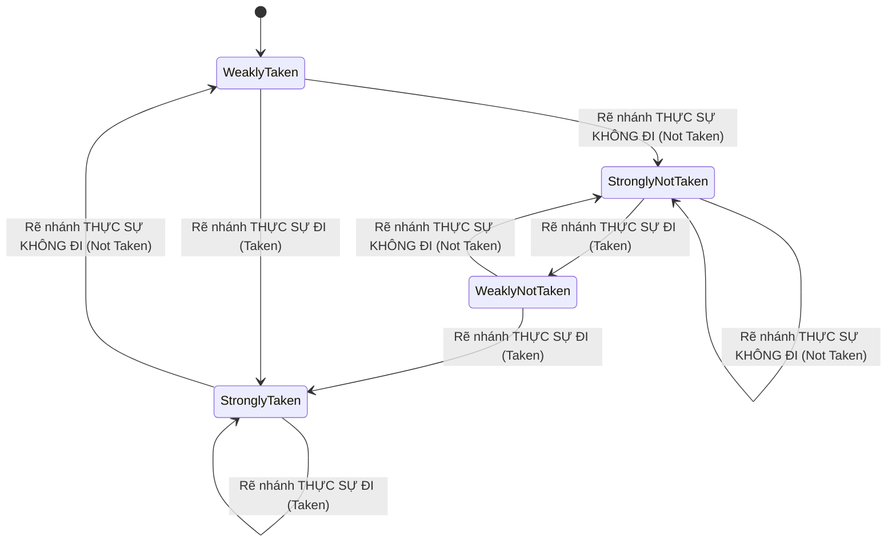

# MASTER COMPUTER SCIENCE HANDBOOK

## Volume 04 — Computer Systems
### Part I — Computer Organization and Architecture
## Chương 4.1.6 — Branch Prediction
### (Dự đoán Rẽ nhánh)

---

### Thông tin chương

| Trường | Giá trị |
|---|---|
| Chương | 4.1.6 |
| Thuộc Part | I — Computer Organization and Architecture |
| Thuộc Volume | 04 — Computer Systems |
| Thời gian đọc ước tính | 55–70 phút |
| Độ khó | ★★★★☆ |
| Kiến thức tiên quyết | Chương 4.1.3, Mục 8 (control hazard, PC không tuyến tính); Chương 4.1.4, Mục 6 và 15 (control hazard trong pipeline); Chương 4.1.5, Mục 8 (thực thi động, out-of-order) |
| Chương liên quan | 4.1.7 — SIMD: chương tiếp theo chuyển hướng sang song song hóa dữ liệu, khép lại nhóm các kỹ thuật tối ưu thực thi tuần tự của Part I |
| Từ khóa | control hazard, speculative execution, branch prediction, Branch History Table (BHT), Branch Target Buffer (BTB), saturating counter, misprediction penalty, squash/flush |

---

### Mục tiêu học tập

Sau khi hoàn thành chương này, người đọc có thể:

- Giải thích tại sao control hazard trở nên nghiêm trọng hơn khi pipeline sâu (Chương 4.1.4) kết hợp với thực thi động (Chương 4.1.5).
- Phân biệt dự đoán tĩnh (static prediction) và dự đoán động (dynamic prediction).
- Mô tả cơ chế bộ đếm bão hòa 2-bit (2-bit saturating counter) như một máy trạng thái hữu hạn dự đoán rẽ nhánh.
- Giải thích vai trò của Branch History Table (BHT) và Branch Target Buffer (BTB).
- Tính CPI hiệu dụng khi có tổn thất do dự đoán sai, mở rộng trực tiếp bài tập đã gặp ở Chương 4.1.4.
- Giải thích khái niệm thực thi suy đoán (speculative execution) và cơ chế squash/flush khi dự đoán sai — cùng liên hệ tới rủi ro bảo mật vi kiến trúc liên quan.

---

### Câu hỏi khơi gợi

> *Chương 4.1.3 đã cho thấy PC không phải lúc nào cũng nhảy tuần tự — lệnh rẽ nhánh (như `JMPZ`) làm CPU phải chờ mới biết lệnh tiếp theo là gì. Nhưng nếu CPU có pipeline 15–20 giai đoạn (Chương 4.1.4) và đang thực thi hàng chục lệnh cùng lúc theo kiểu out-of-order (Chương 4.1.5), việc "chờ" đó tốn kém đến mức nào? Và nếu CPU quyết định "đoán liều" hướng rẽ nhánh để khỏi phải chờ — điều gì xảy ra với tất cả các lệnh đã thực thi dựa trên một dự đoán hóa ra sai?*

---

## 1. Tổng quan chương

Xuyên suốt Chương 4.1.4 và 4.1.5, control hazard luôn được nhắc tới như một vấn đề "chưa giải quyết triệt để". Đã đến lúc đối mặt trực diện với nó. Vấn đề gốc rễ rất đơn giản: một lệnh rẽ nhánh (branch/jump) chỉ tiết lộ **hướng đi thực sự** của nó sau khi đã đi qua ít nhất vài giai đoạn của pipeline — nhưng CPU vẫn cần biết lệnh tiếp theo cần fetch **ngay lập tức**, ở giai đoạn IF của chu kỳ kế tiếp.

Với pipeline nông và CPI đơn giản (Chương 4.1.3), giải pháp "chờ" (stall) tuy tốn kém nhưng còn chấp nhận được. Nhưng với pipeline sâu (Chương 4.1.4) kết hợp thực thi siêu vô hướng, không theo thứ tự (Chương 4.1.5) — nơi hàng chục lệnh đang "trong dòng chảy" tại mọi thời điểm — cái giá của việc chờ đợi trở nên quá lớn để chấp nhận. **Branch Prediction (Dự đoán rẽ nhánh)** là câu trả lời của công nghiệp: thay vì chờ, CPU **đoán** hướng đi nhiều khả năng nhất, tiếp tục fetch và thực thi suy đoán (speculative execution) theo hướng đó — và chuẩn bị sẵn cơ chế "hủy bỏ" (squash) toàn bộ công việc đã làm nếu đoán sai.

> **💡 Insight**
> Branch prediction là một minh chứng tuyệt vời cho nguyên lý đánh đổi xuất hiện xuyên suốt Volume 04: chấp nhận **đôi khi làm việc "vô ích"** (khi đoán sai) để đổi lấy **hầu như luôn luôn không phải chờ đợi** (khi đoán đúng, chiếm đa số các trường hợp trong chương trình thực tế). Đây chính xác là logic đằng sau nhiều hệ thống kỹ thuật khác mà bạn có thể đã quen thuộc — ví dụ prefetching dữ liệu trong trình duyệt web, hay optimistic locking trong hệ quản trị cơ sở dữ liệu: đoán trước, chuẩn bị sẵn phương án hủy bỏ khi sai.

---

## 2. Bối cảnh lịch sử

| Thời điểm | Sự kiện | Đóng góp |
|---|---|---|
| Thập niên 1980–1990 | Các nghiên cứu học thuật đầu tiên về dự đoán rẽ nhánh động (dynamic branch prediction), bao gồm các bộ đếm bão hòa và bộ dự đoán thích ứng hai cấp (two-level adaptive predictor) | Chuyển dự đoán rẽ nhánh từ các quy tắc tĩnh đơn giản sang cơ chế học từ lịch sử thực thi, cải thiện đáng kể độ chính xác |
| Thập niên 1990 đến nay | Bộ dự đoán rẽ nhánh trở thành thành phần bắt buộc trong mọi CPU pipeline sâu, kết hợp chặt chẽ với out-of-order execution (Chương 4.1.5) | Cho phép pipeline sâu và thực thi siêu vô hướng phát huy hiệu quả thực tế, thay vì bị triệt tiêu bởi tổn thất control hazard |
| 2018 | Công bố các lỗ hổng bảo mật vi kiến trúc Spectre và Meltdown | Cho thấy chính cơ chế thực thi suy đoán (speculative execution) — vốn được thiết kế thuần túy vì mục tiêu hiệu năng — có thể để lại dấu vết quan sát được (qua trạng thái cache), mở ra một lớp tấn công kênh phụ (side-channel attack) hoàn toàn mới ở cấp độ phần cứng |

Sự kiện năm 2018 đặc biệt quan trọng về mặt nhận thức ngành: trong suốt nhiều thập kỷ, tối ưu hiệu năng vi kiến trúc (như branch prediction, out-of-order execution) được xem là hoàn toàn "trong suốt" với phần mềm — không ảnh hưởng gì đến tính đúng đắn hay an toàn. Spectre và Meltdown chứng minh rằng ngay cả những hành động "bị hủy bỏ" (squash) sau khi dự đoán sai vẫn có thể để lại dấu vết quan sát được gián tiếp, buộc toàn ngành phải xem xét lại ranh giới giữa hiệu năng và bảo mật ở tầng phần cứng.

---

## 3. Động lực

Quay lại câu hỏi khơi gợi: hãy định lượng cụ thể cái giá của việc "chờ" trong một CPU pipeline sâu. Giả sử pipeline có 15 giai đoạn (không hiếm trong CPU hiệu năng cao thực tế), và một lệnh rẽ nhánh chỉ biết kết quả thực sự ở giai đoạn thứ 10. Nếu CPU chọn chiến lược đơn giản nhất — luôn stall cho tới khi biết kết quả — thì **mỗi lệnh rẽ nhánh** gây ra tới 9 chu kỳ bubble (tương tự khái niệm đã học ở Chương 4.1.4, Mục 8, nhưng với con số lớn hơn nhiều so với ví dụ 2 chu kỳ ở đó).

Với một chương trình có 20% lệnh là rẽ nhánh (một tỷ lệ điển hình trong mã thực tế, do vòng lặp và câu lệnh điều kiện xuất hiện dày đặc), CPI hiệu dụng sẽ tăng đáng kể — làm triệt tiêu phần lớn lợi ích mà pipeline sâu (Chương 4.1.4) và superscalar (Chương 4.1.5) mang lại. Đây chính là động lực cấp bách cho branch prediction: nếu CPU có thể đoán đúng hướng rẽ nhánh với độ chính xác cao (trong thực tế, các bộ dự đoán hiện đại đạt độ chính xác rất cao nhờ khai thác các mẫu lặp lại phổ biến trong chương trình — ví dụ vòng lặp `for` gần như luôn "rẽ về đầu vòng lặp" cho tới lần lặp cuối cùng), phần lớn chu kỳ bubble tiềm năng sẽ biến mất hoàn toàn.

---

## 4. Trực giác

**Mô hình tinh thần (Mental Model) của chương này:**

> Bộ dự đoán rẽ nhánh giống như một **người lái xe quen đường**: tại một ngã ba quen thuộc, thay vì dừng hẳn lại để "chắc chắn" trước khi rẽ (như stall), người lái xe đã đi qua ngã ba đó hàng trăm lần và biết rằng 95% trường hợp mình sẽ rẽ trái — nên cứ tiếp tục giảm ga nhẹ và chuẩn bị rẽ trái ngay, thay vì dừng hẳn. Nếu hôm nay hóa ra cần rẽ phải (một ngoại lệ hiếm gặp), người lái xe phải "quay xe" — tốn thời gian hơn hẳn so với việc dừng chờ chắc chắn ngay từ đầu ở chính lần đó — nhưng vì điều này hiếm khi xảy ra, **trung bình** vẫn nhanh hơn nhiều so với luôn luôn dừng chờ ở mọi ngã ba.

| Trực giác kỹ thuật bạn đã có | Khái niệm Branch Prediction tương ứng |
|---|---|
| Trình duyệt web prefetch trang có khả năng cao được click tiếp theo | Speculative Execution — thực thi trước dựa trên dự đoán |
| Optimistic locking trong database — giả định không xung đột, rollback nếu sai | Squash/Flush — hủy bỏ công việc suy đoán khi dự đoán sai |
| Cache dự đoán (predictive caching) dựa trên hành vi truy cập gần đây của người dùng | Branch History Table — dùng lịch sử gần đây để dự đoán tương lai |

---

## 5. Trực quan hóa khái niệm

**Hình 4.1.6.1 — Máy trạng thái hữu hạn của Bộ đếm bão hòa 2-bit (2-bit Saturating Counter)**
*(Visual đặc trưng của chương — Chapter Identity)*



| Trường thông tin | Nội dung |
|---|---|
| Mục đích | Cho thấy trực quan bộ dự đoán rẽ nhánh, xét đến cùng, chỉ là MỘT máy trạng thái hữu hạn đơn giản (4 trạng thái) — cùng loại khái niệm với chu trình Fetch–Decode–Execute ở Hình 4.1.3.1 (Chương 4.1.3), chỉ khác về mục đích sử dụng |
| Điểm mấu chốt | Ở hai trạng thái "Strongly" (góc), cần **hai lần sai liên tiếp** mới đổi hướng dự đoán — đây chính là lý do bộ đếm 2-bit chịu đựng tốt hơn hẳn so với 1-bit trước "ngoại lệ đơn lẻ" trong vòng lặp (xem Mục 7.2, Mục 15) |

---

**Hình 4.1.6.2 — Speculative Execution và Squash khi dự đoán sai**

```text
                              Lệnh rẽ nhánh Bn được FETCH tại chu kỳ 1
                              Kết quả THỰC SỰ chỉ biết ở chu kỳ 5 (giả sử)

Chu kỳ:            1     2     3     4     5     6
Bn (rẽ nhánh):      IF    ID    EX    MEM   WB
Bn+1 (dự đoán):           IF    ID    EX    MEM   WB   ← SUY ĐOÁN, dựa trên
                                                            dự đoán tại chu kỳ 2
Bn+2 (dự đoán):                 IF    ID    EX
Bn+3 (dự đoán):                       IF    ID

           ─────────────────────────────────────────
           TẠI CHU KỲ 5: Bn cho biết dự đoán SAI!

           → SQUASH (hủy bỏ) TOÀN BỘ Bn+1, Bn+2, Bn+3 —
             mọi kết quả suy đoán của chúng bị loại bỏ,
             KHÔNG được phép commit (đúng nguyên tắc
             Reorder Buffer, Chương 4.1.5, Mục 6, 8)
           → PC được nạp lại ĐÚNG địa chỉ đích thực sự
           → Fetch lại từ đầu, bắt đầu chu kỳ 6
```

*Mục đích:* Trả lời trực tiếp phần thứ hai của câu hỏi khơi gợi — điều gì xảy ra với các lệnh đã thực thi dựa trên dự đoán sai. *Điểm mấu chốt:* cơ chế **squash** hoạt động dựa trên chính nguyên tắc Reorder Buffer đã học ở Chương 4.1.5 — các lệnh suy đoán sai đơn giản là **không bao giờ được phép commit**, giữ nguyên tính đúng đắn tuyệt đối của chương trình, đổi lại là lãng phí các chu kỳ đã bỏ ra để thực thi suy đoán sai.

---

## 6. Định nghĩa hình thức

> **📌 Remember — Speculative Execution**
>
> **Speculative Execution (Thực thi suy đoán)** là kỹ thuật cho phép CPU tiếp tục fetch và thực thi các lệnh nằm sau một lệnh rẽ nhánh **trước khi** biết chắc chắn kết quả thực sự của lệnh rẽ nhánh đó, dựa trên một dự đoán. Nếu dự đoán đúng, công việc suy đoán được giữ lại (commit); nếu sai, toàn bộ bị **squash** (hủy bỏ).

> **📌 Remember — Dự đoán tĩnh và Dự đoán động**
>
> - **Static Prediction (Dự đoán tĩnh):** áp dụng một quy tắc cố định, không thay đổi theo hành vi thực thi thực tế — ví dụ "luôn dự đoán rẽ nhánh lùi về phía sau (backward) là Taken, rẽ nhánh tiến về phía trước (forward) là Not Taken" (quy tắc BTFNT — Backward Taken, Forward Not Taken), dựa trên quan sát rằng rẽ nhánh lùi thường là điểm quay lại đầu vòng lặp.
> - **Dynamic Prediction (Dự đoán động):** dự đoán dựa trên **lịch sử thực thi thực tế** của chính lệnh rẽ nhánh đó (hoặc các lệnh liên quan), được cập nhật liên tục — ví dụ bộ đếm bão hòa ở Hình 4.1.6.1.

> **📌 Remember — Branch History Table (BHT) và Branch Target Buffer (BTB)**
>
> - **Branch History Table (BHT):** bảng tra cứu, thường đánh chỉ số bằng một phần địa chỉ PC của lệnh rẽ nhánh, lưu trạng thái bộ đếm bão hòa (Hình 4.1.6.1) cho từng lệnh — trả lời câu hỏi "**hướng nào**" (Taken hay Not Taken).
> - **Branch Target Buffer (BTB):** bảng tra cứu lưu **địa chỉ đích** đã từng nhảy tới của mỗi lệnh rẽ nhánh — trả lời câu hỏi "**tới đâu**", cần thiết cho lệnh nhảy có địa chỉ đích thay đổi động (ví dụ lời gọi hàm qua con trỏ).
> - **Misprediction Penalty:** số chu kỳ bị lãng phí (tương đương bubble, Chương 4.1.4) khi dự đoán sai, phụ thuộc vào độ sâu pipeline tính từ giai đoạn Fetch tới giai đoạn xác định kết quả thực sự (minh họa ở Hình 4.1.6.2).

---

## 7. Nền tảng toán học

### 7.1 CPI hiệu dụng khi có tổn thất do rẽ nhánh

- **Ý nghĩa:** Mở rộng trực tiếp công thức hiệu năng đã học ở Chương 4.1.3 và bài tập đã gợi ý ở Chương 4.1.4 (Bài tập 7), lượng hóa chính xác tác động của branch prediction lên CPI hiệu dụng.

> **📦 Formula Box — CPI hiệu dụng với tổn thất do rẽ nhánh**
>
> $$\text{CPI}_{\text{hiệu dụng}} = \text{CPI}_{\text{lý tưởng}} + \big(f_{\text{branch}} \times r_{\text{misprediction}} \times P_{\text{misprediction}}\big)$$
>
> | Thành phần | Ý nghĩa |
> |---|---|
> | $\text{CPI}_{\text{lý tưởng}}$ | CPI khi không có bất kỳ tổn thất nào (Chương 4.1.3/4.1.5) |
> | $f_{\text{branch}}$ | Tỷ lệ lệnh là rẽ nhánh trong chương trình (ví dụ 0.2 = 20%) |
> | $r_{\text{misprediction}}$ | Tỷ lệ dự đoán SAI của bộ dự đoán (ví dụ 0.05 = 5% sai) |
> | $P_{\text{misprediction}}$ | Số chu kỳ bubble bị lãng phí mỗi lần dự đoán sai (Misprediction Penalty, Mục 6) |
> | **Diễn giải kỹ thuật** | Số hạng $f_{\text{branch}} \times r_{\text{misprediction}} \times P_{\text{misprediction}}$ chính là "CPI phạt trung bình" cộng thêm do rẽ nhánh — càng nhiều lệnh rẽ nhánh, dự đoán càng kém chính xác, hoặc pipeline càng sâu (penalty càng lớn), CPI hiệu dụng càng tệ đi |
> | **Ứng dụng thường gặp** | Công cụ định lượng trực tiếp để đánh giá "bộ dự đoán tốt hơn X% đáng giá bao nhiêu về hiệu năng thực tế" — biến một cải tiến định tính thành con số CPI cụ thể |

**Ví dụ áp dụng:** với $\text{CPI}_{\text{lý tưởng}} = 1$, $f_{\text{branch}} = 0.2$, pipeline 15 giai đoạn với $P_{\text{misprediction}} = 10$ chu kỳ:

- Nếu **không** có branch prediction (luôn stall, coi như $r_{\text{misprediction}} = 1$, tức 100% "phải chờ"): $\text{CPI} = 1 + (0.2 \times 1 \times 10) = 3.0$.
- Nếu bộ dự đoán đạt độ chính xác cao, $r_{\text{misprediction}} = 0.05$ (5% sai): $\text{CPI} = 1 + (0.2 \times 0.05 \times 10) = 1.1$.

Chênh lệch giữa $3.0$ và $1.1$ là minh chứng định lượng trực tiếp cho động lực đã nêu ở Mục 3 — branch prediction có thể cải thiện CPI hiệu dụng gần gấp ba lần trong ví dụ này.

### 7.2 Vì sao bộ đếm 2-bit tốt hơn 1-bit cho vòng lặp

Xét một vòng lặp `for` chạy 10 lần: rẽ nhánh "quay lại đầu vòng lặp" là **Taken** ở 9 lần đầu, và **Not Taken** duy nhất ở lần thứ 10 (khi vòng lặp kết thúc). Với bộ đếm **1-bit** (chỉ nhớ đúng/sai lần gần nhất), lần Not Taken duy nhất đó lập tức đổi dự đoán — nhưng ngay sau đó, nếu chương trình gặp lại **chính vòng lặp này** lần nữa (ví dụ trong một vòng lặp ngoài bao quanh), lần Taken đầu tiên của lượt lặp mới **cũng bị dự đoán sai** (vì bộ đếm vẫn đang "nhớ" lần Not Taken trước đó) — gây **hai lần sai liên tiếp** cho mỗi chu kỳ vòng lặp hoàn chỉnh.

Với bộ đếm **2-bit** (Hình 4.1.6.1), một lần Not Taken đơn lẻ chỉ đẩy trạng thái từ "Strongly Taken" xuống "Weakly Taken" — **vẫn tiếp tục dự đoán Taken** ở lần lặp tiếp theo, và chỉ thực sự sai một lần duy nhất (đúng tại điểm thoát vòng lặp) thay vì hai lần. Đây là lý do bộ đếm bão hòa 2-bit trở thành lựa chọn tiêu chuẩn thực tế, dù ý tưởng cơ bản (đếm lịch sử gần đây) giống hệt bộ đếm 1-bit.

---

## 8. Thuật toán / Cơ chế

**Quy trình dự đoán động, thực thi suy đoán, và xử lý khi biết kết quả thực sự:**

```text
Bước 1 — Tại giai đoạn IF của một lệnh, kiểm tra xem địa chỉ PC
         hiện tại có khớp một lệnh rẽ nhánh đã biết trong BTB
         (Mục 6) hay không
        │
        ▼
Bước 2 — Nếu có: tra BHT (Mục 6) tại chỉ số tương ứng, lấy trạng
         thái bộ đếm bão hòa (Hình 4.1.6.1) → suy ra dự đoán
         Taken hay Not Taken
        │
        ▼
Bước 3 — Nếu dự đoán là Taken: fetch lệnh tiếp theo tại địa chỉ
         đích lấy từ BTB (thay vì PC + 1); nếu Not Taken: fetch
         tuần tự như bình thường (PC + 1, đúng Chương 4.1.3, Mục 8)
        │
        ▼
Bước 4 — Tiếp tục fetch, decode, thực thi các lệnh SUY ĐOÁN như
         bình thường (đúng Chương 4.1.4/4.1.5), nhưng ĐÁNH DẤU
         chúng là "suy đoán, CHƯA được phép commit" trong Reorder
         Buffer (Chương 4.1.5, Mục 6, 8)
        │
        ▼
Bước 5 — Khi lệnh rẽ nhánh gốc đi tới giai đoạn xác định kết quả
         THỰC SỰ (thường là EX): so sánh với dự đoán ở Bước 2
        │
        ├── Nếu ĐÚNG: cho phép các lệnh suy đoán tiếp tục commit
        │   bình thường; cập nhật bộ đếm BHT theo đúng kết quả
        │   (Hình 4.1.6.1, chuyển trạng thái theo cạnh tương ứng)
        │
        └── Nếu SAI: SQUASH toàn bộ lệnh suy đoán trong pipeline
            (Hình 4.1.6.2); nạp lại PC đúng địa chỉ thực sự; cập
            nhật BHT/BTB; fetch lại từ đầu theo hướng đúng
```

> **⚠️ Common Mistake**
> Giống hệt cảnh báo đã nêu ở Chương 4.1.5 (Mục 8) về out-of-order execution, cần nhấn mạnh lại: **dự đoán sai không bao giờ dẫn tới kết quả chương trình sai.** Bước 5 (nhánh SQUASH) đảm bảo tuyệt đối rằng không một kết quả suy đoán sai nào được phép commit — cái giá duy nhất của misprediction là **hiệu năng** (mất đi các chu kỳ đã bỏ ra để thực thi suy đoán), không phải tính đúng đắn.

---

## 9. Triển khai

```python
# Mô phỏng bộ dự đoán rẽ nhánh 2-bit saturating counter (Hình 4.1.6.1)
# và tính CPI hiệu dụng theo công thức ở Mục 7.1.

# Trạng thái: 0=Strongly Not Taken, 1=Weakly Not Taken,
#             2=Weakly Taken,       3=Strongly Taken
STRONGLY_NOT_TAKEN, WEAKLY_NOT_TAKEN, WEAKLY_TAKEN, STRONGLY_TAKEN = range(4)


class TwoBitPredictor:
    """Bộ dự đoán rẽ nhánh 2-bit, đánh chỉ số theo địa chỉ PC —
    hiện thực đúng máy trạng thái ở Hình 4.1.6.1."""

    def __init__(self):
        self.table = {}   # pc -> trạng thái bộ đếm (mặc định Weakly Taken)

    def predict(self, pc):
        state = self.table.get(pc, WEAKLY_TAKEN)
        return state >= WEAKLY_TAKEN   # True = dự đoán Taken

    def update(self, pc, actually_taken):
        """Cập nhật bộ đếm theo kết quả THỰC SỰ — đúng Bước 5, Mục 8."""
        state = self.table.get(pc, WEAKLY_TAKEN)
        if actually_taken:
            state = min(state + 1, STRONGLY_TAKEN)
        else:
            state = max(state - 1, STRONGLY_NOT_TAKEN)
        self.table[pc] = state


def run_loop_simulation(pc_of_branch, loop_trip_count, num_loop_invocations,
                         misprediction_penalty=10):
    """Mô phỏng một vòng lặp `for` chạy loop_trip_count lần, lặp lại
    num_loop_invocations lần (ví dụ vòng lặp ngoài gọi vòng lặp
    trong nhiều lần) — minh họa trực tiếp phân tích ở Mục 7.2."""
    predictor = TwoBitPredictor()
    total_branches, total_mispredictions = 0, 0

    for _invocation in range(num_loop_invocations):
        for i in range(loop_trip_count):
            actually_taken = (i < loop_trip_count - 1)  # Taken trừ lần cuối
            predicted_taken = predictor.predict(pc_of_branch)
            total_branches += 1
            if predicted_taken != actually_taken:
                total_mispredictions += 1
            predictor.update(pc_of_branch, actually_taken)

    misprediction_rate = total_mispredictions / total_branches
    cpi_ideal = 1.0
    branch_frequency = 1.0  # đơn giản hóa: coi mọi lệnh mô phỏng đều là rẽ nhánh
    cpi_effective = cpi_ideal + (branch_frequency * misprediction_rate
                                  * misprediction_penalty)
    return misprediction_rate, cpi_effective
```

Lớp `TwoBitPredictor` hiện thực chính xác máy trạng thái ở Hình 4.1.6.1: `predict()` trả lời "Taken hay Not Taken" dựa trên trạng thái hiện tại (Bước 2, Mục 8), `update()` chuyển trạng thái theo đúng kết quả thực sự (Bước 5, nhánh "Đúng" hoặc "Sai"). Hàm `run_loop_simulation` áp dụng trực tiếp công thức CPI hiệu dụng ở Mục 7.1 cho kịch bản vòng lặp đã phân tích ở Mục 7.2.

---

## 10. Trực quan hóa quá trình thực thi

**Kiểm chứng phân tích ở Mục 7.2:** vòng lặp `for` chạy 5 lần (`loop_trip_count=5`), lặp lại toàn bộ vòng lặp này 3 lần (`num_loop_invocations=3`, mô phỏng vòng lặp ngoài):

```python
rate, cpi = run_loop_simulation(pc_of_branch=100, loop_trip_count=5,
                                 num_loop_invocations=3,
                                 misprediction_penalty=10)
```

| Lượt vòng lặp | Lần lặp (i) | Thực sự Taken? | Trạng thái TRƯỚC | Dự đoán | Đúng? | Trạng thái SAU |
|:---:|:---:|:---:|:---:|:---:|:---:|:---:|
| 1 | 0 | Có | Weakly Taken (mặc định) | Taken | ✓ | Strongly Taken |
| 1 | 1–3 | Có | Strongly Taken | Taken | ✓ | Strongly Taken |
| 1 | 4 (cuối) | **Không** | Strongly Taken | Taken | **✗** | Weakly Taken |
| 2 | 0 | Có | Weakly Taken | Taken | ✓ | Strongly Taken |
| 2 | 1–3 | Có | Strongly Taken | Taken | ✓ | Strongly Taken |
| 2 | 4 (cuối) | **Không** | Strongly Taken | Taken | **✗** | Weakly Taken |
| 3 | (tương tự lượt 1–2) | | | | | |

Kết quả: đúng **1 lần sai mỗi lượt vòng lặp** (tại điểm thoát vòng lặp) — tổng $3$ lần sai trên $15$ lệnh rẽ nhánh, $\text{misprediction rate} = 3/15 = 0.2$. Áp dụng công thức Mục 7.1 với $P_{\text{misprediction}}=10$: $\text{CPI}_{\text{hiệu dụng}} = 1 + (1.0 \times 0.2 \times 10) = 3.0$.

**So sánh với bộ đếm 1-bit (phân tích lý thuyết, Mục 7.2):** cùng kịch bản này với bộ đếm 1-bit sẽ cho ra **2 lần sai mỗi lượt** (một tại điểm thoát, một tại lần Taken đầu tiên của lượt kế tiếp) — gấp đôi số lần sai so với bộ đếm 2-bit, minh chứng định lượng trực tiếp cho lập luận đã trình bày ở Mục 7.2.

---

## 11. Ứng dụng công nghiệp

> **🛠 Engineering Practice**
> Branch prediction là một trong những thành phần được đầu tư nghiên cứu và tinh chỉnh nhiều nhất trong CPU thương mại hiện đại — độ chính xác dự đoán ảnh hưởng trực tiếp và mạnh mẽ tới hiệu năng thực tế của gần như mọi phần mềm.

| Bối cảnh công nghiệp | Vai trò của Branch Prediction |
|---|---|
| CPU x86/ARM hiệu năng cao | Kết hợp nhiều cấp độ dự đoán (không chỉ bộ đếm bão hòa đơn giản ở chương này) để đạt độ chính xác rất cao trên khối lượng công việc đa dạng |
| Return Address Stack (RAS) | Một bộ dự đoán chuyên biệt cho lệnh `RETURN` (quay về từ lời gọi hàm) — dùng một cấu trúc ngăn xếp (stack, Volume 3) phần cứng riêng, vì địa chỉ trả về gần như luôn khớp chính xác với lời gọi hàm gần nhất tương ứng |
| Trình biên dịch tối ưu hóa (compiler) | Kỹ thuật "profile-guided optimization" (PGO) sắp xếp lại code dựa trên dữ liệu thực thi thực tế, giúp cả static prediction (quy tắc BTFNT, Mục 6) lẫn dynamic prediction hoạt động hiệu quả hơn |
| Vá lỗi bảo mật Spectre/Meltdown (2018) | Các bản vá phần mềm/vi mã (microcode) được phát hành để giảm thiểu rủi ro rò rỉ thông tin qua kênh phụ liên quan tới thực thi suy đoán, minh chứng cho việc branch prediction không còn chỉ là vấn đề thuần túy hiệu năng |

---

## 12. Góc nhìn nghiên cứu

> **🔬 Research Connection**
> Nghiên cứu về branch prediction là một trong những lĩnh vực có tính "đo lường được" rõ ràng nhất trong Computer Architecture: độ chính xác dự đoán có thể đo trực tiếp trên các bộ benchmark tiêu chuẩn, tạo điều kiện cho nhiều thế hệ cải tiến thuật toán dự đoán liên tục, từ bộ đếm đơn giản (chương này) tới các bộ dự đoán khai thác tương quan giữa nhiều lệnh rẽ nhánh khác nhau trong cùng một chương trình.

Về khía cạnh bảo mật, sự kiện Spectre/Meltodown (Mục 2, 11) đã mở ra một hướng nghiên cứu liên ngành hoàn toàn mới: **kênh phụ vi kiến trúc (microarchitectural side-channel)**. Ý tưởng cốt lõi, ở mức khái niệm: dù kết quả tính toán của các lệnh suy đoán sai bị squash và không bao giờ commit (đảm bảo tính đúng đắn, Mục 8), quá trình thực thi suy đoán đó vẫn có thể để lại **dấu vết gián tiếp** trong trạng thái phần cứng dùng chung (ví dụ nội dung cache, sẽ học ở Volume 4, Part II — Memory Systems) — và dấu vết này, trong một số điều kiện nhất định, có thể bị suy luận ngược lại để lộ thông tin mà lẽ ra không nên truy cập được. Đây là một lĩnh vực nghiên cứu đang tiếp diễn, đặt ra câu hỏi thiết kế mở: làm thế nào để giữ được lợi ích hiệu năng của thực thi suy đoán mà không tạo ra các kênh rò rỉ thông tin ở tầng phần cứng dùng chung?

---

## 13. Ưu điểm

- **Giảm mạnh CPI hiệu dụng trong pipeline sâu:** như minh chứng định lượng ở Mục 7.1, một bộ dự đoán chính xác có thể cải thiện CPI hiệu dụng gấp nhiều lần so với việc luôn stall.
- **Bộ đếm 2-bit đơn giản nhưng hiệu quả cao với các mẫu lặp phổ biến:** đặc biệt phù hợp với vòng lặp — một trong những cấu trúc điều khiển phổ biến nhất trong chương trình thực tế.
- **Không ảnh hưởng tới tính đúng đắn:** như nhấn mạnh nhiều lần ở Mục 8, cơ chế squash đảm bảo dự đoán sai chỉ gây tổn thất hiệu năng, không bao giờ gây kết quả sai.

---

## 14. Hạn chế

> **⚠️ Common Mistake**
> Một hiểu lầm phổ biến: cho rằng branch prediction "loại bỏ hoàn toàn" control hazard. Thực tế, nó chỉ **giảm thiểu tần suất** phải trả giá cho control hazard (bằng cách đoán đúng phần lớn thời gian), chứ không loại bỏ được bản chất vấn đề — control hazard vẫn tồn tại về mặt lý thuyết, và misprediction penalty (Mục 6) vẫn xảy ra ở những trường hợp dự đoán sai, đặc biệt với các rẽ nhánh có kết quả thực sự khó đoán (ví dụ phụ thuộc dữ liệu đầu vào ngẫu nhiên).

- **Chi phí squash tăng theo độ sâu pipeline:** như đã nêu ở Mục 3, pipeline càng sâu, misprediction penalty $P_{\text{misprediction}}$ càng lớn — bù đắp phần nào lợi ích tăng thêm từ pipeline sâu hơn (liên hệ trực tiếp Chương 4.1.4, Mục 7.2).
- **Một số loại rẽ nhánh vốn dĩ khó dự đoán:** ví dụ rẽ nhánh phụ thuộc trực tiếp vào dữ liệu đầu vào biến động mạnh (không có mẫu lặp lại rõ ràng) — không bộ dự đoán nào, dù tinh vi đến đâu, có thể đạt độ chính xác cao trong trường hợp này.
- **Rủi ro bảo mật vi kiến trúc:** như đã thảo luận ở Mục 12, chính cơ chế mang lại lợi ích hiệu năng lại là nguồn gốc của một lớp lỗ hổng bảo mật hoàn toàn mới, đòi hỏi đánh đổi bổ sung giữa hiệu năng và an toàn trong thiết kế CPU hiện đại.

---

## 15. So sánh

**Bảng 4.1.6.1 — Dự đoán tĩnh và Dự đoán động**

| Tiêu chí | Static Prediction | Dynamic Prediction |
|---|---|---|
| Cơ sở dự đoán | Quy tắc cố định (ví dụ BTFNT) | Lịch sử thực thi thực tế, cập nhật liên tục |
| Độ phức tạp phần cứng | Thấp | Cao hơn (cần BHT/BTB, Mục 6) |
| Độ chính xác trên chương trình đa dạng | Thấp hơn đáng kể | Cao hơn đáng kể, đặc biệt với vòng lặp |
| Thích ứng với hành vi thay đổi | Không | Có |

**Bảng 4.1.6.2 — Bộ đếm 1-bit và Bộ đếm bão hòa 2-bit**

| Tiêu chí | Bộ đếm 1-bit | Bộ đếm bão hòa 2-bit |
|---|---|---|
| Số trạng thái | 2 | 4 |
| Chịu đựng "ngoại lệ đơn lẻ" trong vòng lặp | Không — đổi dự đoán ngay | Có — cần 2 lần sai liên tiếp mới đổi hướng |
| Số lần sai mỗi chu kỳ vòng lặp hoàn chỉnh (điển hình) | 2 lần (Mục 7.2) | 1 lần (Mục 7.2, 10) |
| Độ phức tạp phần cứng | Thấp nhất | Thấp, chỉ hơn 1-bit không đáng kể |

**Phân tích:** Bảng 4.1.6.1 tái khẳng định một mô-típ quen thuộc xuyên suốt Part I — cơ chế "tĩnh, đơn giản" (static prediction, giống single-cycle CPU ở Chương 4.1.3) đánh đổi độ chính xác/hiệu năng để lấy sự đơn giản, trong khi cơ chế "động, thích ứng" (dynamic prediction) đạt hiệu năng cao hơn với cái giá độ phức tạp phần cứng lớn hơn. Bảng 4.1.6.2 củng cố bằng số liệu cụ thể (Mục 7.2, 10) lý do bộ đếm 2-bit trở thành lựa chọn thực tế phổ biến — một cải tiến nhỏ về độ phức tạp (thêm đúng 1 bit) mang lại lợi ích lớn với chi phí phần cứng gần như không đáng kể.

---

## 16. Tóm tắt

- **Branch prediction** giải quyết control hazard (đã nêu ở Chương 4.1.3, 4.1.4, 4.1.5) bằng cách **đoán** hướng rẽ nhánh và **thực thi suy đoán (speculative execution)**, thay vì luôn chờ (stall).
- **Dự đoán tĩnh** dùng quy tắc cố định; **dự đoán động** học từ lịch sử thực thi qua **Branch History Table (BHT)** và **Branch Target Buffer (BTB)**.
- **Bộ đếm bão hòa 2-bit** — một máy trạng thái hữu hạn 4 trạng thái — là kỹ thuật dự đoán động phổ biến, chịu đựng tốt các "ngoại lệ đơn lẻ" như điểm thoát vòng lặp, tốt hơn hẳn bộ đếm 1-bit.
- Khi dự đoán sai, cơ chế **squash/flush** hủy bỏ toàn bộ lệnh suy đoán, dựa trên chính nguyên tắc Reorder Buffer đã học ở Chương 4.1.5 — đảm bảo tính đúng đắn tuyệt đối, chỉ đánh đổi hiệu năng.
- Công thức $\text{CPI}_{\text{hiệu dụng}} = \text{CPI}_{\text{lý tưởng}} + f_{\text{branch}} \times r_{\text{misprediction}} \times P_{\text{misprediction}}$ định lượng chính xác lợi ích của một bộ dự đoán tốt hơn.
- Thực thi suy đoán, dù mang lại lợi ích hiệu năng to lớn, cũng là nguồn gốc của một lớp rủi ro bảo mật vi kiến trúc mới (Spectre/Meltdown, 2018), đặt ra bài toán đánh đổi hiệu năng–an toàn tiếp diễn trong ngành.

Với Chương 4.1.6, nhóm các kỹ thuật tối ưu hóa thực thi **tuần tự trong một luồng lệnh duy nhất** (pipeline, superscalar, out-of-order, branch prediction) đã hoàn chỉnh. Chương 4.1.7 (SIMD) sẽ chuyển hướng hoàn toàn: thay vì tiếp tục tối ưu việc thực thi **một dòng lệnh**, làm thế nào để **một lệnh duy nhất** xử lý đồng thời **nhiều phần tử dữ liệu** — mở đường trực tiếp cho kiến trúc GPU (Chương 4.1.8) và các khối lượng công việc AI ở Volume 05, 06.

---

## 17. Bài tập

### Mức Cơ bản (Basic)

1. Vẽ lại (không nhìn sách) máy trạng thái 4 trạng thái của bộ đếm bão hòa 2-bit ở Hình 4.1.6.1, ghi rõ điều kiện chuyển trạng thái trên mỗi cạnh.
2. Với $\text{CPI}_{\text{lý tưởng}} = 1$, $f_{\text{branch}} = 0.15$, $r_{\text{misprediction}} = 0.1$, $P_{\text{misprediction}} = 8$, tính $\text{CPI}_{\text{hiệu dụng}}$ bằng công thức Mục 7.1.
3. Giải thích bằng lời sự khác biệt giữa BHT và BTB — mỗi bảng trả lời câu hỏi gì?

### Mức Trung bình (Intermediate)

4. Chạy thử `run_loop_simulation` ở Mục 9 với `loop_trip_count=20` và `num_loop_invocations=5`. Dự đoán trước (bằng lý luận ở Mục 7.2, không chạy code) số lần misprediction, sau đó chạy để kiểm chứng.
5. Giải thích bằng lời tại sao quy tắc tĩnh BTFNT (Backward Taken, Forward Not Taken, Mục 6) là một lựa chọn hợp lý cho dự đoán tĩnh, dựa trên đặc điểm cấu trúc mã nguồn của vòng lặp `for`/`while` (rẽ nhánh quay lại đầu vòng lặp luôn là rẽ nhánh lùi).

### Mức Nâng cao (Advanced)

6. Cài đặt thêm một lớp `OneBitPredictor` (bộ đếm 1-bit, chỉ 2 trạng thái) tương tự `TwoBitPredictor` ở Mục 9. Chạy cùng kịch bản ở Mục 10 với cả hai bộ dự đoán, so sánh số lần misprediction thực tế, và xác nhận đúng tỷ lệ "gấp đôi" đã dự đoán lý thuyết ở Mục 7.2.
7. Với pipeline có độ sâu thay đổi được (tham số $P_{\text{misprediction}}$ trong khoảng từ 3 đến 20), vẽ (bằng tay hoặc bằng code) đồ thị $\text{CPI}_{\text{hiệu dụng}}$ theo $P_{\text{misprediction}}$, giữ nguyên $f_{\text{branch}} = 0.2$ và $r_{\text{misprediction}} = 0.05$. Nhận xét về tốc độ tăng của CPI hiệu dụng khi pipeline ngày càng sâu — liên hệ với đánh đổi đã nêu ở Chương 4.1.4, Mục 7.2.

### Mức Nghiên cứu (Research)

8. Tìm hiểu ở mức khái niệm (không cần chi tiết kỹ thuật tấn công) về sự kiện Spectre/Meltdown (2018, Mục 2, 12). Thảo luận ngắn gọn: tại sao việc "kết quả suy đoán sai không bao giờ commit" (đảm bảo tính đúng đắn logic, Mục 8) vẫn không đủ để đảm bảo an toàn tuyệt đối, khi xét tới các kênh quan sát gián tiếp như trạng thái cache?

---

## 18. Dự án nhỏ

**Dự án: So sánh định lượng các chiến lược dự đoán rẽ nhánh**

- **Mục tiêu:** Xây dựng một bộ công cụ so sánh nhiều chiến lược dự đoán (static luôn-Taken, static luôn-Not-Taken, 1-bit, 2-bit) trên cùng một tập kịch bản chương trình, báo cáo CPI hiệu dụng cho từng chiến lược.
- **Yêu cầu:**
  - Cài đặt ít nhất 4 chiến lược dự đoán như liệt kê ở trên, tái sử dụng `TwoBitPredictor` từ Mục 9 và `OneBitPredictor` từ Bài tập 6.
  - Thiết kế ít nhất 2 kịch bản chương trình khác nhau: (a) một vòng lặp đơn giản như Mục 10; (b) một chuỗi rẽ nhánh "khó đoán" (ví dụ dựa trên một dãy Taken/Not-Taken gần như ngẫu nhiên).
  - Tính và lập bảng so sánh $\text{CPI}_{\text{hiệu dụng}}$ (công thức Mục 7.1) cho cả 4 chiến lược trên cả 2 kịch bản.
  - Viết nhận xét ngắn: chiến lược nào tốt nhất cho từng kịch bản, và tại sao — liên hệ trực tiếp tới đặc điểm ILP/mẫu lặp của chương trình (tương tự tinh thần Chương 4.1.5, Mục 7.2).
- **Công nghệ gợi ý:** Python thuần, tái sử dụng toàn bộ hạ tầng từ Mục 9.
- **Kết quả mong đợi:** Một bảng so sánh định lượng rõ ràng, minh họa trực tiếp rằng "chiến lược dự đoán tốt nhất" phụ thuộc vào đặc điểm chương trình, không có một câu trả lời tuyệt đối cho mọi trường hợp.
- **Hướng mở rộng:** Thử nghiệm ý tưởng "dự đoán tương quan" đơn giản — dùng kết quả của **nhiều** lệnh rẽ nhánh gần nhất (không chỉ một) làm chỉ số tra BHT, minh họa hướng nghiên cứu nâng cao đã đề cập ở Mục 12.

---

## 19. Tự đánh giá

- [ ] Tôi có thể vẽ và giải thích chính xác máy trạng thái của bộ đếm bão hòa 2-bit, không cần nhìn lại tài liệu.
- [ ] Tôi có thể áp dụng công thức CPI hiệu dụng để tính định lượng lợi ích của một bộ dự đoán tốt hơn, không chỉ nói định tính.
- [ ] Tôi giải thích được rõ ràng tại sao bộ đếm 2-bit tốt hơn 1-bit cho vòng lặp, kèm ví dụ số liệu cụ thể (như Mục 7.2, 10).
- [ ] Tôi hiểu và có thể giải thích cơ chế squash đảm bảo tính đúng đắn của chương trình dù dự đoán sai, dựa trên nguyên tắc Reorder Buffer đã học ở Chương 4.1.5.
- [ ] Tôi đã hoàn thành Bài tập 6 (so sánh 1-bit và 2-bit bằng code) và quan sát được đúng tỷ lệ misprediction như dự đoán lý thuyết.

Nếu Bài tập 7 (vẽ đồ thị CPI theo độ sâu pipeline) vẫn còn khó khăn, nên ôn lại công thức hiệu năng ở Chương 4.1.3 (Mục 7.1) và Chương 4.1.4 (Mục 7.1–7.2) — kỹ năng phân tích định lượng bằng công thức CPI sẽ được tổng hợp lại đầy đủ khi Part I kết thúc.

---

## 20. Đọc thêm

- **Sách:** Randal E. Bryant, David R. O'Hallaron, *Computer Systems: A Programmer's Perspective* — các phần liên quan tới ảnh hưởng của cấu trúc điều khiển chương trình (rẽ nhánh, vòng lặp) lên hiệu năng thực thi. *(Xem BOOKS.md — Volume 4.)*
- **Chủ đề mở rộng (không bắt buộc):** tìm đọc thêm về các bộ dự đoán rẽ nhánh thích ứng hai cấp (two-level adaptive predictor) — mở rộng ý tưởng bộ đếm bão hòa ở chương này bằng cách khai thác tương quan giữa nhiều lệnh rẽ nhánh, thường xuất hiện trong các giáo trình Computer Architecture nâng cao.
- **Chương tiếp theo:** Chương 4.1.7 — SIMD.

---

### Liên kết chương (Cross References)

- **Chương trước:** 4.1.3 — CPU Organization (nguồn gốc control hazard, Mục 8); 4.1.4 — Pipeline (control hazard là loại hazard thứ ba chưa xử lý triệt để, Bảng 4.1.4.1); 4.1.5 — Superscalar & Out-of-Order Execution (cơ chế squash dựa trực tiếp trên nguyên tắc Reorder Buffer đã học ở đó).
- **Chương tiếp theo:** 4.1.7 — SIMD, khép lại nhóm kỹ thuật tối ưu hóa thực thi lệnh tuần tự của Part I, chuyển hướng sang song song hóa dữ liệu.
- **Chương liên quan xa hơn:** Volume 4, Part II — Memory Systems (trạng thái cache, cơ sở vật lý của kênh phụ vi kiến trúc, Mục 12); Volume 2, Part IX — Theory of Computation (định nghĩa hình thức đầy đủ của máy trạng thái hữu hạn, dùng lại ở Hình 4.1.6.1, cùng loại khái niệm với Hình 4.1.3.1).
- **Vị trí trong Knowledge Graph:** Nút thứ sáu của Volume 04, Part I; phụ thuộc trực tiếp vào Chương 4.1.3, 4.1.4, và 4.1.5; khép lại nhóm chương về tối ưu hóa thực thi lệnh tuần tự, là điều kiện tiên quyết khuyến nghị (không bắt buộc) trước khi chuyển sang Chương 4.1.7.

---

*Hết Chương 4.1.6. Chương này tuân thủ đầy đủ cấu trúc 20 mục của `OUTPUT.md` và chuẩn Presentation Layer của `WRITING_STANDARD.md`. Mô phỏng `TwoBitPredictor` và công thức CPI hiệu dụng được kiểm chứng bằng Python thực thi thực tế (Mục 9–10), nhất quán với các công thức hiệu năng đã xây dựng xuyên suốt Chương 4.1.3–4.1.5. Đang chờ rà soát trước khi tiếp tục sang Chương 4.1.7 — SIMD.*
