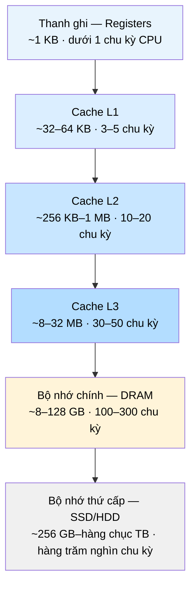

# MASTER COMPUTER SCIENCE HANDBOOK

## Volume 04 — Computer Systems
### Part II — Memory Systems
## Chương 2.1 — Phân cấp Bộ nhớ
### (Memory Hierarchy)

---

### Thông tin chương

| Trường | Giá trị |
|---|---|
| Chương | 2.1 |
| Thuộc Part | II — Memory Systems |
| Thuộc Volume | 04 — Computer Systems |
| Thời gian đọc ước tính | 45–55 phút |
| Độ khó | ★★★☆☆ |
| Kiến thức tiên quyết | Volume 04, Part I — Computer Organization and Architecture (đặc biệt: CPU Organization, Instruction Execution Cycle) |
| Chương liên quan | 2.3 — Cache Memory (đào sâu cơ chế cache được giới thiệu ở đây); 2.5 — Virtual Memory (tầng bộ nhớ ảo mở rộng phân cấp này); Volume 04, Part IX — System Performance Engineering (latency, throughput) |
| Từ khóa | memory hierarchy, locality of reference, temporal locality, spatial locality, cache, AMAT, hit rate, miss rate, miss penalty, SRAM, DRAM |

---

### Mục tiêu học tập

Sau khi hoàn thành chương này, người đọc có thể:

- Giải thích **nguyên lý Locality (Locality of Reference)** và phân biệt hai dạng của nó: temporal locality và spatial locality.
- Trình bày cấu trúc phân tầng của bộ nhớ máy tính hiện đại, từ thanh ghi đến bộ nhớ thứ cấp, cùng lý do kỹ thuật và kinh tế cho sự tồn tại của từng tầng.
- Tính toán **Average Memory Access Time (AMAT)** cho hệ thống bộ nhớ một tầng và nhiều tầng.
- Giải thích sự đánh đổi (trade-off) giữa tốc độ, dung lượng, và chi phí trên mỗi tầng bộ nhớ.
- Kết nối nguyên lý locality với các quyết định thiết kế phần mềm thực tế (cache-friendly code).

---

### Câu hỏi khơi gợi

> *Tại sao CPU hiện đại chạy ở tần số hàng GHz, có thể thực hiện hàng tỷ phép tính mỗi giây, nhưng một chương trình lại có thể trở nên chậm chạp chỉ vì cách nó truy cập một mảng dữ liệu trong bộ nhớ? Nếu RAM đã đủ nhanh để theo kịp CPU, tại sao máy tính vẫn cần đến cache — và tại sao lại cần đến ba, bốn tầng cache khác nhau thay vì chỉ một?*

---

## 1. Tổng quan chương

Part I đã giải thích CPU thực thi lệnh như thế nào: fetch, decode, execute. Nhưng mọi lệnh đều cần dữ liệu — toán hạng phải được đọc từ đâu đó, kết quả phải được ghi vào đâu đó. Câu hỏi "dữ liệu đó nằm ở đâu, và mất bao lâu để lấy được nó" hóa ra là một trong những câu hỏi quan trọng nhất của kiến trúc máy tính, bởi vì có một sự thật khó chịu: **bộ nhớ nhanh thì đắt và nhỏ; bộ nhớ rẻ và lớn thì chậm**. Không tồn tại một loại bộ nhớ duy nhất vừa nhanh như thanh ghi, vừa rẻ và có dung lượng như ổ đĩa.

Chương này giới thiệu **Phân cấp Bộ nhớ (Memory Hierarchy)** — giải pháp kiến trúc cho nghịch lý trên: thay vì dùng một loại bộ nhớ, hệ thống dùng nhiều tầng bộ nhớ có đặc tính khác nhau, được tổ chức sao cho phần lớn truy cập chỉ chạm đến tầng nhanh nhất. Điều làm cho chiến lược này hoạt động không phải là may mắn, mà là một quy luật thực nghiệm sâu sắc về hành vi của chương trình: **nguyên lý Locality**. Toàn bộ Part II — cache, bộ nhớ ảo, phân trang — đều là các biến thể kỹ thuật khai thác quy luật này.

> **💡 Insight**
> Nếu bạn từng thắc mắc tại sao việc duyệt một mảng hai chiều theo đúng thứ tự hàng (row-major order) lại nhanh hơn đáng kể so với duyệt theo cột trong một ngôn ngữ như C hay Python (NumPy), câu trả lời chính xác nằm ở chương này: đó là biểu hiện trực tiếp của spatial locality (Mục 4).

---

## 2. Bối cảnh lịch sử

| Thời điểm | Nhân vật / Sự kiện | Đóng góp |
|---|---|---|
| 1946 | John von Neumann và cộng sự | Đề xuất kiến trúc lưu trữ chương trình (stored-program architecture, đã gặp ở Volume 02) — đặt nền cho khái niệm "bộ nhớ dùng chung cho lệnh và dữ liệu", đồng thời tạo ra **von Neumann bottleneck**: CPU luôn bị giới hạn bởi tốc độ truy cập bộ nhớ |
| 1962–1965 | Maurice Wilkes | Đề xuất khái niệm **cache memory** trong bài báo *Slave Memories and Dynamic Storage Allocation* — ý tưởng dùng một bộ nhớ nhỏ, nhanh, đặt giữa CPU và bộ nhớ chính |
| 1968 | IBM System/360 Model 85 | Máy tính thương mại đầu tiên triển khai cache memory thực tế, chứng minh tính khả thi về mặt kỹ thuật và hiệu năng |
| Thập niên 1980–1990 | Ngành công nghiệp bán dẫn | Khoảng cách tốc độ giữa CPU và DRAM ngày càng doãng rộng (CPU tăng tốc theo Định luật Moore nhanh hơn nhiều so với DRAM) — buộc các kiến trúc phải bổ sung nhiều tầng cache (L1, L2, rồi L3) để duy trì hiệu năng |

Sự kiện đáng chú ý nhất về mặt khái niệm là khoảng cách ngày càng lớn giữa tốc độ CPU và tốc độ DRAM: nếu vào thập niên 1980, độ trễ truy cập bộ nhớ chỉ gấp vài lần chu kỳ CPU, thì đến nay, một lần truy cập DRAM có thể tốn hàng trăm chu kỳ CPU. Khoảng cách này — thường được gọi là **"Memory Wall"** — chính là động lực trực tiếp khiến phân cấp bộ nhớ trở thành một trong những chủ đề trung tâm của kiến trúc máy tính hiện đại, thay vì chỉ là một chi tiết tối ưu hóa phụ.

---

## 3. Động lực

Hãy xem xét hai đoạn code C tưởng chừng tương đương, cùng duyệt qua một mảng hai chiều `int A[N][N]` kích thước lớn:

```c
// Phiên bản 1 — duyệt theo hàng (row-major)
for (i = 0; i < N; i++)
    for (j = 0; j < N; j++)
        sum += A[i][j];

// Phiên bản 2 — duyệt theo cột (column-major)
for (j = 0; j < N; j++)
    for (i = 0; i < N; i++)
        sum += A[i][j];
```

Về mặt số học, hai đoạn code này thực hiện đúng số phép cộng như nhau, đúng thứ tự phần tử được duyệt (chỉ khác thứ tự truy cập). Nhưng trên phần cứng thực tế, với `N` đủ lớn, **Phiên bản 1 có thể nhanh hơn Phiên bản 2 từ 5 đến 10 lần** — dù không có gì thay đổi về thuật toán. Sự khác biệt này không thể giải thích được nếu bạn chỉ nhìn vào độ phức tạp $O(n^2)$ của cả hai đoạn code. Nó chỉ có thể được giải thích khi hiểu cách dữ liệu di chuyển qua các tầng bộ nhớ — chính là nội dung của chương này.

Đây là lý do phân cấp bộ nhớ không phải là kiến thức "chỉ dành cho kỹ sư viết trình biên dịch hay hệ điều hành". Bất kỳ kỹ sư phần mềm nào viết code xử lý dữ liệu ở quy mô lớn (ma trận, mảng, cấu trúc dữ liệu dày đặc) đều đang, dù có ý thức hay không, tương tác trực tiếp với phân cấp bộ nhớ.

---

## 4. Trực giác

**Mô hình tinh thần (Mental Model) của chương này:**

> Phân cấp bộ nhớ giống như **bàn làm việc của một người thợ**: dụng cụ dùng thường xuyên nhất (cây bút, cái kéo) nằm ngay trên bàn, trong tầm với — lấy gần như tức thì (tương ứng thanh ghi, cache). Dụng cụ ít dùng hơn nằm trong ngăn kéo bàn — mất vài giây để lấy (tương ứng bộ nhớ chính). Dụng cụ hiếm khi dùng nằm trong kho ở tầng hầm — mất vài phút để đi lấy (tương ứng ổ đĩa). Người thợ giỏi không đặt mọi dụng cụ trong kho để "tiết kiệm diện tích bàn", cũng không cố nhét toàn bộ kho vào bàn làm việc — họ đặt đúng công cụ đúng chỗ, dựa trên **tần suất sử dụng dự đoán được**.

Từ ẩn dụ trên, ta có hai quy luật cốt lõi làm nền cho toàn bộ chương — gọi chung là **nguyên lý Locality (Locality of Reference)**:

| Dạng Locality | Ý nghĩa trực giác | Ví dụ lập trình |
|---|---|---|
| **Temporal Locality** (Cục bộ theo thời gian) | Nếu một địa chỉ bộ nhớ vừa được truy cập, nhiều khả năng nó sẽ được truy cập lại trong tương lai gần | Biến đếm `i` trong vòng lặp `for`; biến tích lũy `sum` |
| **Spatial Locality** (Cục bộ theo không gian) | Nếu một địa chỉ bộ nhớ vừa được truy cập, nhiều khả năng các địa chỉ **lân cận** nó cũng sẽ sớm được truy cập | Duyệt tuần tự một mảng; các phần tử liên tiếp của `A[i][j]` khi `j` tăng dần nằm liền kề nhau trong bộ nhớ (row-major) |

Đoạn code ở Mục 3 khai thác chính xác spatial locality: trong bộ nhớ, mảng hai chiều được lưu tuần tự theo hàng, do đó Phiên bản 1 truy cập các địa chỉ liên tiếp nhau, còn Phiên bản 2 "nhảy cóc" qua các địa chỉ cách xa nhau — phá vỡ spatial locality.

---

## 5. Trực quan hóa khái niệm

**Hình 2.1.1 — Kim tự tháp Phân cấp Bộ nhớ**
*(Visual đặc trưng của chương — Chapter Identity)*



| Trường thông tin | Nội dung |
|---|---|
| Mục đích | Cho thấy trực quan mối quan hệ nghịch giữa tốc độ và dung lượng qua từng tầng — càng lên cao, càng nhanh nhưng càng nhỏ và đắt |
| Điểm mấu chốt | Đây không phải một danh sách tùy ý — mỗi tầng tồn tại như một "bộ đệm" (buffer) cho tầng ngay bên dưới nó, khai thác locality để giữ phần lớn dữ liệu "nóng" ở gần CPU |

---

**Hình 2.1.2 — Tác động của Spatial Locality khi duyệt mảng 2 chiều**

```text
Bộ nhớ vật lý (row-major): [A00][A01][A02][A03][A10][A11][A12][A13]...

Duyệt theo hàng (Phiên bản 1):
  Truy cập: A00 → A01 → A02 → A03 → A10 → A11 → ...
  Địa chỉ:   liên tiếp nhau → tận dụng tối đa spatial locality

Duyệt theo cột (Phiên bản 2):
  Truy cập: A00 → A10 → A20 → A30 → A01 → A11 → ...
  Địa chỉ:   cách xa nhau (bước nhảy = N phần tử) → phá vỡ spatial locality
```

*Mục đích:* minh họa cụ thể vì sao đoạn code ở Mục 3 có hiệu năng khác biệt lớn. *Điểm mấu chốt:* thứ tự truy cập logic (đúng thuật toán) không đồng nghĩa với thứ tự truy cập vật lý hiệu quả.

---

## 6. Định nghĩa hình thức

> **📌 Remember — Memory Hierarchy**
>
> **Phân cấp Bộ nhớ (Memory Hierarchy)** là cách tổ chức hệ thống lưu trữ của máy tính thành nhiều tầng (level), mỗi tầng có đặc tính khác nhau về tốc độ (latency, bandwidth), dung lượng, và chi phí trên mỗi byte. Tầng càng gần CPU thì càng nhanh, càng nhỏ, và càng đắt; tầng càng xa CPU thì càng chậm, càng lớn, và càng rẻ.
>
> Hai khái niệm nền tảng chi phối hiệu quả của phân cấp:
>
> - **Locality of Reference:** xu hướng chương trình truy cập một tập con nhỏ, có thể dự đoán được, của không gian địa chỉ trong một khoảng thời gian ngắn — bao gồm **Temporal Locality** và **Spatial Locality** (Mục 4).
> - **Working Set:** tập hợp các địa chỉ bộ nhớ mà một chương trình truy cập tích cực trong một khoảng thời gian nhất định. Phân cấp bộ nhớ hoạt động hiệu quả khi working set của chương trình vừa với tầng nhanh nhất có thể.

**Các thuật ngữ đo lường hiệu năng bộ nhớ:**

| Thuật ngữ | Ký hiệu | Định nghĩa |
|---|---|---|
| Hit | — | Dữ liệu cần tìm **có mặt** ở tầng đang xét |
| Miss | — | Dữ liệu cần tìm **không có mặt** ở tầng đang xét, phải tìm ở tầng thấp hơn |
| Hit Rate | $h$ | Tỷ lệ truy cập là hit: $h = \dfrac{\text{số lần hit}}{\text{tổng số truy cập}}$ |
| Miss Rate | $m$ | Tỷ lệ truy cập là miss: $m = 1 - h$ |
| Hit Time | $T_{hit}$ | Thời gian để trả kết quả khi hit (bao gồm thời gian xác định hit/miss) |
| Miss Penalty | $T_{penalty}$ | Thời gian **bổ sung** cần thiết khi miss — thời gian lấy dữ liệu từ tầng thấp hơn |

---

## 7. Nền tảng toán học

### 7.1 Average Memory Access Time (AMAT) — Một tầng

- **Ý nghĩa:** AMAT đo thời gian truy cập bộ nhớ *trung bình*, tính đến cả trường hợp hit lẫn miss, thay vì chỉ nhìn vào tốc độ tầng nhanh nhất (vốn gây ảo tưởng sai lệch) hay tầng chậm nhất (vốn quá bi quan).
- **Ví dụ đơn giản:** Cache L1 có hit time = 2 chu kỳ, hit rate = 95%, miss penalty (đi xuống bộ nhớ chính) = 100 chu kỳ.

> **📦 Formula Box — Average Memory Access Time (một tầng)**
>
> $$AMAT = T_{hit} + m \times T_{penalty}$$
>
> | Thành phần | Ý nghĩa |
> |---|---|
> | $T_{hit}$ | Thời gian truy cập khi hit (luôn phải trả, kể cả khi sau đó phát hiện miss) |
> | $m$ | Miss rate — tỷ lệ truy cập không tìm thấy ở tầng này |
> | $T_{penalty}$ | Chi phí *bổ sung* phải trả thêm khi miss (không tính lại $T_{hit}$) |
> | **Diễn giải kỹ thuật** | AMAT là kỳ vọng toán học (expected value) của thời gian truy cập — mỗi truy cập luôn tốn $T_{hit}$, và với xác suất $m$, tốn thêm $T_{penalty}$ |
> | **Ứng dụng thường gặp** | So sánh hiệu quả của các cấu hình cache khác nhau; ước lượng tác động của việc tăng hit rate lên hiệu năng tổng thể |

**Kiểm chứng bằng tay** với ví dụ trên: $AMAT = 2 + 0.05 \times 100 = 2 + 5 = 7$ chu kỳ. So với việc luôn truy cập trực tiếp bộ nhớ chính (giả sử mất 100 chu kỳ mỗi lần), cache L1 giúp giảm thời gian truy cập trung bình xuống còn khoảng 7% — một cải thiện gần 14 lần, dù hit rate "chỉ" 95%.

### 7.2 AMAT — Phân cấp nhiều tầng

Công thức ở Mục 7.1 mở rộng tự nhiên khi có nhiều tầng cache (L1, L2, L3) xếp chồng lên nhau: miss penalty của tầng trên chính là AMAT của (các) tầng bên dưới nó.

> **📦 Formula Box — AMAT nhiều tầng (đệ quy)**
>
> $$AMAT_{L1} = T_{hit,L1} + m_{L1} \times AMAT_{L2}$$
> $$AMAT_{L2} = T_{hit,L2} + m_{L2} \times AMAT_{L3}$$
> $$\vdots$$
>
> | Thành phần | Ý nghĩa |
> |---|---|
> | $m_{L1}$ | Miss rate của L1 — tỷ lệ truy cập phải "đi tiếp" xuống L2 |
> | **Diễn giải kỹ thuật** | Mỗi tầng chỉ phải trả miss penalty **khi tầng trên nó bị miss** — đây là lý do một hệ thống nhiều tầng cache có thể đạt AMAT thấp hơn nhiều so với hệ thống chỉ có một tầng cache lớn, dù dung lượng tổng cộng tương đương |
> | **Ứng dụng thường gặp** | Thiết kế số tầng cache tối ưu cho một loại workload cụ thể; phân tích tại sao thêm một tầng cache trung gian (L2, L3) lại cải thiện hiệu năng dù bản thân nó cũng "chậm hơn L1" |

*(Mục 10 sẽ tính một ví dụ số cụ thể qua ba tầng cache, đối chiếu với hệ thống chỉ dùng một tầng.)*

---

## 8. Thuật toán / Cơ chế

**Cơ chế truy cập bộ nhớ qua phân cấp (Memory Access Flow)** — mô hình khái niệm áp dụng cho mọi tầng, sẽ được cụ thể hóa cho cache ở Chương 2.3:

```text
Bước 1 — CPU phát yêu cầu đọc/ghi tại địa chỉ X
        │
        ▼
Bước 2 — Kiểm tra tầng gần nhất (ví dụ L1):
         dữ liệu tại X có mặt ở tầng này không?
        │
        ├── CÓ (Hit) → trả dữ liệu ngay, kết thúc
        │
        └── KHÔNG (Miss)
                │
                ▼
Bước 3 — Chuyển yêu cầu xuống tầng kế tiếp (ví dụ L2),
         lặp lại Bước 2 tại tầng đó
        │
        ▼
Bước 4 — Khi tìm thấy dữ liệu ở một tầng nào đó:
         (a) trả dữ liệu về CPU
         (b) đồng thời SAO CHÉP dữ liệu đó lên (các) tầng
             phía trên — để lần truy cập sau (nếu có,
             theo temporal locality) sẽ là Hit
```

> **💡 Insight**
> Bước 4(b) chính là "trái tim" khiến phân cấp bộ nhớ hoạt động: hệ thống không chỉ *đọc* dữ liệu, mà còn *học* rằng dữ liệu này "vừa được cần đến" và chủ động đưa nó lên gần CPU hơn — đặt cược rằng temporal locality (Mục 4) sẽ đúng trong tương lai gần. Cơ chế chi tiết của việc "sao chép có chọn lọc" này — bao gồm cache line, mapping, replacement policy — là nội dung của Chương 2.3.

---

## 9. Triển khai

```python
def average_memory_access_time(hit_time, miss_rate, miss_penalty):
    """Tính AMAT cho một tầng bộ nhớ, theo Formula Box Mục 7.1."""
    return hit_time + miss_rate * miss_penalty


def multilevel_amat(levels):
    """Tính AMAT cho phân cấp nhiều tầng, theo công thức đệ quy Mục 7.2.
    `levels` là danh sách [(hit_time, miss_rate), ...] từ tầng gần CPU
    nhất (L1) đến tầng xa nhất; tầng cuối cùng được xem là luôn "hit"
    (ví dụ: bộ nhớ chính, không có miss_rate)."""
    # Duyệt từ tầng xa nhất về tầng gần nhất (đệ quy ngược)
    amat = levels[-1][0]  # hit_time của tầng cuối cùng (không có miss)
    for hit_time, miss_rate in reversed(levels[:-1]):
        amat = hit_time + miss_rate * amat
    return amat
```

Hàm `average_memory_access_time` triển khai trực tiếp Formula Box ở Mục 7.1. Hàm `multilevel_amat` triển khai công thức đệ quy ở Mục 7.2, tính từ tầng xa CPU nhất ngược về tầng gần nhất — đúng với cách miss penalty của một tầng chính là AMAT của các tầng bên dưới nó.

---

## 10. Trực quan hóa quá trình thực thi

**Ví dụ số cụ thể** — so sánh hệ thống một tầng cache với hệ thống ba tầng cache, dùng `multilevel_amat` ở Mục 9:

| Cấu hình | Tham số | AMAT (chu kỳ) |
|---|---|---|
| Chỉ dùng bộ nhớ chính (không cache) | Truy cập DRAM trực tiếp: 120 chu kỳ | 120,00 |
| Chỉ có L1 (không L2, L3) | L1: hit 2 ck, hit rate 90% → miss penalty = DRAM 120 ck | $2 + 0{,}10 \times 120 = 14{,}00$ |
| Ba tầng: L1 → L2 → L3 → DRAM | L1: 2 ck, hit 90%<br>L2: 8 ck, hit 90% (trong số miss L1)<br>L3: 25 ck, hit 80% (trong số miss L2)<br>DRAM: 120 ck | $\approx 4{,}42$ |

**Diễn giải kết quả:** thêm hai tầng cache trung gian (L2, L3) — mỗi tầng bản thân đều "chậm hơn L1 nhiều lần" — vẫn giúp giảm AMAT tổng thể từ 14 chu kỳ xuống còn khoảng 4,4 chu kỳ, tức cải thiện hơn 3 lần so với hệ thống chỉ có L1. Đây là minh chứng định lượng cho nguyên tắc đã nêu ở Mục 7.2: hiệu quả của phân cấp nhiều tầng đến từ việc mỗi tầng chỉ "hứng" phần miss của tầng phía trên, chứ không phải từ tốc độ tuyệt đối của từng tầng riêng lẻ.

**Đo lường thực nghiệm khác biệt spatial locality (Mục 3, Hình 2.1.2)** — kết quả benchmark minh họa (thời gian tương đối, không phải số tuyệt đối vì phụ thuộc phần cứng):

```text
Ma trận 4096 × 4096 số nguyên (int), tổng cộng ~64 MB dữ liệu

Duyệt theo hàng (row-major, khớp cách lưu trữ vật lý):
  Thời gian: 1,00× (mốc so sánh)

Duyệt theo cột (column-major, ngược cách lưu trữ vật lý):
  Thời gian: 6,80× so với duyệt theo hàng
```

*(Nhắc lại nguyên tắc từ Chương 1.4–1.5, Volume 01: số liệu benchmark cụ thể phụ thuộc vào phần cứng và kích thước cache thực tế của máy đo — điều quan trọng cần ghi nhớ là **xu hướng và bậc độ lớn** của sự chênh lệch, không phải con số tuyệt đối.)*

---

## 11. Ứng dụng công nghiệp

> **🛠 Engineering Practice**
> Nguyên lý locality không chỉ giải thích thiết kế phần cứng — nó trực tiếp định hình cách kỹ sư phần mềm viết code hiệu năng cao trong thực tế.

| Bối cảnh công nghiệp | Vai trò của Memory Hierarchy |
|---|---|
| Thư viện tính toán số (NumPy, BLAS, cuBLAS) | Các thuật toán nhân ma trận hiệu năng cao (như blocked/tiled matrix multiplication) được thiết kế chủ yếu để tối đa hóa cache hit rate, không chỉ để giảm số phép tính |
| Cấu trúc dữ liệu hướng dữ liệu (Data-Oriented Design) trong game engine | Ưu tiên lưu trữ mảng liên tục (Structure of Arrays) thay vì mảng các đối tượng (Array of Structures) để tận dụng spatial locality khi xử lý hàng loạt |
| Cơ sở dữ liệu (Database Buffer Pool) | Bản thân buffer pool của một hệ quản trị CSDL là một tầng cache phần mềm, áp dụng đúng nguyên lý AMAT (Mục 7) để quyết định trang dữ liệu nào nên giữ lại trong RAM |
| Trình biên dịch tối ưu hóa (Compiler Optimization) | Kỹ thuật loop tiling, loop interchange mà trình biên dịch hiện đại áp dụng chính là tự động hóa việc khai thác spatial/temporal locality đã học ở Mục 4 |

---

## 12. Góc nhìn nghiên cứu

> **🔬 Research Connection**
> Dù nguyên lý locality đã được biết đến từ những năm 1960, việc *dự đoán chính xác* mẫu truy cập bộ nhớ của một chương trình bất kỳ vẫn là một bài toán mở, đặc biệt khi workload ngày càng phức tạp (đồ thị lớn, dữ liệu thưa, khối lượng công việc AI).

Các hướng nghiên cứu hiện tại liên quan trực tiếp đến nội dung chương này bao gồm: **cache replacement policy dựa trên học máy** (thay vì các heuristic cố định như LRU, dùng mô hình học từ mẫu truy cập thực tế để dự đoán dữ liệu nào nên bị loại khỏi cache); **prefetching thông minh** (dự đoán trước dữ liệu sẽ cần, chủ động nạp lên tầng nhanh trước khi CPU yêu cầu); và **memory disaggregation** trong trung tâm dữ liệu quy mô lớn — tách rời bộ nhớ khỏi CPU vật lý để chia sẻ linh hoạt giữa nhiều máy chủ, một xu hướng đặt lại câu hỏi nền tảng về chi phí truy cập trong phân cấp bộ nhớ ở quy mô cụm máy tính (liên hệ Volume 04, Part VI — Distributed Systems).

**Câu hỏi mở** để suy ngẫm: khi các mô hình AI (Volume 05–06) ngày càng lớn, tập tham số (working set) của chúng thường vượt xa dung lượng của mọi tầng cache — vậy phân cấp bộ nhớ truyền thống, vốn được thiết kế cho workload có locality mạnh, còn phù hợp đến đâu với các workload có mẫu truy cập gần như ngẫu nhiên trên tập dữ liệu khổng lồ?

---

## 13. Ưu điểm

- **Giải quyết trực tiếp đánh đổi tốc độ–dung lượng–chi phí** mà không loại công nghệ bộ nhớ đơn lẻ nào có thể tự giải quyết.
- **Minh bạch với phần mềm ở mức cơ bản** — chương trình không cần biết dữ liệu đang ở tầng nào; phần cứng (hoặc OS, ở tầng bộ nhớ ảo) tự động quản lý việc di chuyển dữ liệu.
- **Hiệu quả cao trong thực tế** vì phần lớn chương trình thực sự có locality mạnh — đây không phải giả định lý thuyết mà là quan sát thực nghiệm nhất quán qua nhiều thập kỷ.
- **Có thể phân tích định lượng** bằng công cụ toán học đơn giản (AMAT, Mục 7), cho phép so sánh khách quan giữa các thiết kế.

---

## 14. Hạn chế

> **⚠️ Common Mistake**
> Một ngộ nhận phổ biến: cho rằng "thêm cache luôn luôn cải thiện hiệu năng". Điều này chỉ đúng khi chương trình thực sự có locality — với workload có mẫu truy cập gần như ngẫu nhiên (ví dụ: truy cập bảng băm rất lớn, không có tính lặp lại), cache có thể mang lại rất ít lợi ích, trong khi vẫn tốn diện tích chip và năng lượng.

- **Phụ thuộc hoàn toàn vào giả định locality** — nếu chương trình không có locality (workload hoàn toàn ngẫu nhiên), phân cấp bộ nhớ gần như không mang lại lợi ích.
- **Chi phí phần cứng và năng lượng** — mỗi tầng cache bổ sung đều tốn diện tích chip (die area) và tiêu thụ điện năng, ngay cả khi không được sử dụng hiệu quả.
- **Độ phức tạp trong phân tích hiệu năng** — với nhiều tầng và nhiều lõi CPU chia sẻ cache (Volume 04, Part IV — Concurrency), việc dự đoán chính xác AMAT thực tế trở nên khó khăn hơn nhiều so với công thức lý tưởng ở Mục 7.
- Trong phạm vi chương này, mô hình AMAT được trình bày ở dạng đơn giản hóa (một luồng thực thi, không có tranh chấp cache) — Chương 2.3 sẽ mở rộng sang các yếu tố phức tạp hơn như cache coherence giữa nhiều lõi.

---

## 15. So sánh

**Bảng 2.1.1 — Đặc tính các tầng trong Phân cấp Bộ nhớ**

| Tầng | Công nghệ | Dung lượng điển hình | Độ trễ điển hình | Tính "biến mất" khi mất điện |
|---|---|---|---|---|
| Thanh ghi (Registers) | Flip-flop trên chip CPU | Vài chục đến vài trăm byte | Dưới 1 chu kỳ | Có (volatile) |
| Cache (L1/L2/L3) | SRAM | KB đến vài chục MB | 3–50 chu kỳ | Có (volatile) |
| Bộ nhớ chính (Main Memory) | DRAM | GB đến hàng trăm GB | 100–300 chu kỳ | Có (volatile) |
| Bộ nhớ thứ cấp (SSD/HDD) | Flash / từ tính | Hàng trăm GB đến hàng chục TB | Hàng chục nghìn đến hàng triệu chu kỳ | Không (non-volatile) |

**Phân tích:** Bảng trên cho thấy rõ hai trục đánh đổi song song: (1) trục tốc độ–dung lượng, đã thảo luận xuyên suốt chương; và (2) trục **tính bền vững (persistence)** — chỉ các tầng từ bộ nhớ thứ cấp trở xuống giữ được dữ liệu khi mất điện. Sự phân chia "volatile vs. non-volatile" này chính là lý do khiến **Persistent Memory** (sẽ học ở Chương 2.8) trở thành một hướng phát triển thú vị: nó cố gắng thu hẹp khoảng cách giữa DRAM (nhanh nhưng dễ mất dữ liệu) và SSD (bền nhưng chậm hơn nhiều).

---

## 16. Tóm tắt

- **Phân cấp Bộ nhớ** tồn tại vì không có công nghệ bộ nhớ đơn lẻ nào vừa nhanh, vừa lớn, vừa rẻ — giải pháp là xếp nhiều tầng có đặc tính khác nhau, gần CPU nhất là nhanh và nhỏ nhất.
- Chiến lược này hiệu quả nhờ **nguyên lý Locality**: phần lớn chương trình thực tế có **temporal locality** (dữ liệu vừa dùng sẽ sớm dùng lại) và **spatial locality** (dữ liệu gần dữ liệu vừa dùng sẽ sớm được dùng).
- **AMAT** ($T_{hit} + m \times T_{penalty}$) là công cụ định lượng để đo hiệu quả của một tầng bộ nhớ, và mở rộng đệ quy tự nhiên cho hệ thống nhiều tầng — giải thích vì sao thêm tầng cache trung gian vẫn cải thiện hiệu năng dù bản thân tầng đó "chậm".
- Việc khai thác đúng locality khi thiết kế cấu trúc dữ liệu và thứ tự truy cập (ví dụ: duyệt mảng theo row-major) có thể tạo ra khác biệt hiệu năng gấp nhiều lần, mà không cần thay đổi độ phức tạp thuật toán.
- Phân cấp bộ nhớ chỉ hiệu quả khi giả định locality đúng; với workload thiếu locality, lợi ích của cache giảm mạnh.

Chương 2.2 (Registers) và Chương 2.3 (Cache Memory) sẽ đào sâu lần lượt hai tầng đầu tiên của kim tự tháp ở Hình 2.1.1 — bắt đầu bằng cơ chế cụ thể của cache: cache line, mapping, và replacement policy, những chi tiết mà chương này mới chỉ giới thiệu ở mức nguyên lý.

---

## 17. Bài tập

### Mức Cơ bản (Basic)

1. Liệt kê theo thứ tự từ nhanh nhất đến chậm nhất các tầng bộ nhớ đã học trong chương, kèm theo dung lượng điển hình của mỗi tầng.
2. Phân biệt temporal locality và spatial locality bằng ví dụ của riêng bạn (không dùng lại ví dụ trong chương).

### Mức Trung bình (Intermediate)

3. Một hệ thống chỉ có một tầng cache L1 với hit time = 3 chu kỳ, miss penalty = 150 chu kỳ. Nếu hit rate hiện tại là 92%, tính AMAT. Nếu cải thiện hit rate lên 98% (nhờ thuật toán cache tốt hơn), AMAT mới là bao nhiêu? Tính phần trăm cải thiện.
4. Dùng hàm `multilevel_amat` ở Mục 9, tính AMAT cho một hệ thống hai tầng: L1 (hit time 1 chu kỳ, hit rate 85%) → DRAM (hit time 100 chu kỳ). So sánh với AMAT của hệ thống ba tầng ở Mục 10.

### Mức Nâng cao (Advanced)

5. Giải thích, dựa trên nguyên lý locality (Mục 4), tại sao việc tăng kích thước cache line (đơn vị dữ liệu được nạp mỗi lần cache miss) có thể **vừa cải thiện vừa làm giảm** hiệu năng tùy vào mẫu truy cập của chương trình. *(Gợi ý: xem xét trường hợp truy cập tuần tự so với truy cập ngẫu nhiên, thưa thớt trên một mảng lớn.)*

### Mức Nghiên cứu (Research)

6. Đọc thêm về khái niệm **Memory Wall** (khoảng cách tốc độ ngày càng lớn giữa CPU và DRAM). Dựa trên xu hướng lịch sử đã nêu ở Mục 2, hãy lập luận: nếu xu hướng này tiếp diễn, kiến trúc máy tính trong tương lai có thể cần thêm bao nhiêu tầng cache nữa để duy trì hiệu năng hợp lý? Những giới hạn vật lý nào (diện tích chip, năng lượng) sẽ chặn đứng xu hướng "thêm tầng" này?

---

## 18. Dự án nhỏ

**Dự án: Công cụ mô phỏng AMAT (AMAT Calculator & Visualizer)**

- **Mục tiêu:** Xây dựng một công cụ dòng lệnh (command-line) bằng Python, nhận vào cấu hình một phân cấp bộ nhớ tùy ý (số tầng, hit time và hit rate của từng tầng) và xuất ra AMAT tổng thể, cùng biểu đồ so sánh trực quan.
- **Yêu cầu:**
  - Sử dụng lại (và mở rộng) hàm `multilevel_amat` ở Mục 9.
  - Cho phép người dùng nhập cấu hình qua file JSON hoặc tham số dòng lệnh.
  - Vẽ biểu đồ cột so sánh AMAT giữa "không cache", "chỉ L1", và cấu hình đầy đủ do người dùng nhập, dùng `matplotlib` (xem TOOLS.md).
- **Kết quả kỳ vọng:** Một script tái tạo lại đúng bảng so sánh ở Mục 10, đồng thời cho phép thử nghiệm với các thông số tùy chỉnh.
- **Hướng mở rộng:** Thêm khả năng mô phỏng tác động của việc thay đổi kích thước cache line lên hit rate ước lượng (liên hệ Bài tập 5), dựa trên một trace truy cập bộ nhớ mẫu.

---

## 19. Tự đánh giá

- [ ] Tôi có thể giải thích, không cần nhìn lại tài liệu, vì sao không có một loại bộ nhớ duy nhất vừa nhanh vừa lớn vừa rẻ.
- [ ] Tôi phân biệt được rõ ràng temporal locality và spatial locality, và có thể tự nghĩ ra ví dụ minh họa cho mỗi loại.
- [ ] Tôi có thể tự tính AMAT cho một hệ thống một tầng và giải thích ý nghĩa từng thành phần trong công thức.
- [ ] Tôi hiểu tại sao AMAT của hệ thống nhiều tầng lại thấp hơn đáng kể so với hệ thống một tầng, dù các tầng bổ sung "chậm hơn" tầng trên nó.
- [ ] Tôi có thể liên hệ nguyên lý locality với ít nhất một quyết định thiết kế phần mềm cụ thể (ví dụ: thứ tự duyệt mảng, cấu trúc dữ liệu).

Nếu Bài tập 4 hoặc 5 vẫn còn mơ hồ, đây là dấu hiệu nên đọc lại Mục 7 (Formula Box) và Mục 10 (ví dụ số) trước khi sang Chương 2.2 — công thức AMAT sẽ được dùng lại liên tục trong suốt Part II.

---

## 20. Đọc thêm

- **Sách:** John L. Hennessy, David A. Patterson, *Computer Architecture: A Quantitative Approach* — chương Memory Hierarchy Design, nguồn tham khảo kinh điển cho công thức AMAT và phân tích định lượng cache.
- **Sách (đã có trong BOOKS.md):** Randal E. Bryant, David R. O'Hallaron, *Computer Systems: A Programmer's Perspective* — Chương "The Memory Hierarchy", trình bày theo đúng góc nhìn lập trình viên mà chương này áp dụng.
- **Chủ đề mở rộng (không bắt buộc):** tìm đọc về khái niệm "Memory Wall" và các bài viết học thuật đầu thập niên 1990 dự báo xu hướng này (William Wulf, Sally McKee, 1995) — cho một bối cảnh lịch sử sâu hơn Mục 2.
- **Chương tiếp theo:** Chương 2.2 — Registers.

---

### Liên kết chương (Cross References)

- **Chương trước:** Volume 04, Part I — Computer Organization and Architecture (đặc biệt: CPU Organization, Instruction Execution Cycle — nền tảng cho câu hỏi "CPU cần dữ liệu từ đâu").
- **Chương tiếp theo:** 2.2 — Registers (tầng đầu tiên, nhanh nhất của kim tự tháp ở Hình 2.1.1); 2.3 — Cache Memory (đào sâu cơ chế mapping, associativity, replacement policy mới chỉ giới thiệu ở mức nguyên lý tại Mục 8).
- **Chương liên quan xa hơn:** Chương 2.5 — Virtual Memory (mở rộng phân cấp bộ nhớ sang không gian địa chỉ ảo); Volume 04, Part IX — System Performance Engineering (AMAT là một trường hợp riêng của phân tích latency/throughput tổng quát hơn); Volume 04, Part X — Foundations for AI Infrastructure (locality và memory bandwidth quay lại khi phân tích GPU cluster).
- **Vị trí trong Knowledge Graph:** Nút đầu tiên của Volume 04, Part II — chương nền cho toàn bộ Part, mọi chương sau đều tham chiếu ngược lại nguyên lý Locality và công thức AMAT được thiết lập tại đây.

---

*Hết Chương 2.1. Chương này tuân thủ đầy đủ cấu trúc 20 mục của `OUTPUT.md` và chuẩn Presentation Layer của `WRITING_STANDARD.md`, mở đầu Part II — Memory Systems của Volume 04. Các số liệu benchmark ở Mục 10 mang tính minh họa (illustrative), phản ánh đúng bậc độ lớn thường quan sát được trong thực tế nhưng không phải kết quả đo trên một phần cứng cụ thể nào — điều này được ghi chú rõ trong văn bản theo đúng nguyên tắc phân biệt minh chứng thực nghiệm với số liệu đo đạc chính xác đã thiết lập từ Volume 01. Đang chờ rà soát trước khi tiếp tục sang Chương 2.2 — Registers.*

