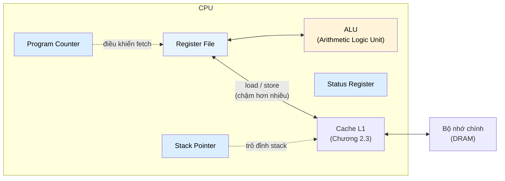

# MASTER COMPUTER SCIENCE HANDBOOK

## Volume 04 — Computer Systems
### Part II — Memory Systems
## Chương 2.2 — Thanh ghi
### (Registers)

---

### Thông tin chương

| Trường | Giá trị |
|---|---|
| Chương | 2.2 |
| Thuộc Part | II — Memory Systems |
| Thuộc Volume | 04 — Computer Systems |
| Thời gian đọc ước tính | 35–45 phút |
| Độ khó | ★★★☆☆ |
| Kiến thức tiên quyết | Chương 2.1 — Memory Hierarchy (đặc biệt: nguyên lý Locality, AMAT); Volume 04, Part I — Instruction Execution Cycle |
| Chương liên quan | 2.3 — Cache Memory (tầng kế tiếp trong phân cấp); Volume 03, Part VIII — Algorithm Engineering (register allocation là một bài toán tối ưu hóa kinh điển); Volume 02, Part V — Computer Organization & Architecture (Instruction Set Architecture) |
| Từ khóa | register file, general-purpose register, special-purpose register, program counter, stack pointer, status register, register allocation, register spilling, calling convention, ABI |

---

### Mục tiêu học tập

Sau khi hoàn thành chương này, người đọc có thể:

- Giải thích vì sao thanh ghi là tầng nhanh nhất trong phân cấp bộ nhớ (Hình 2.1.1) và định lượng được chi phí khi dữ liệu không còn "vừa" trong thanh ghi.
- Phân biệt **general-purpose register** và **special-purpose register**, và nêu vai trò cụ thể của Program Counter, Stack Pointer, Status Register.
- Giải thích mối quan hệ giữa số lượng thanh ghi và độ dài mã lệnh (instruction encoding).
- Trình bày trực giác về bài toán **Register Allocation** và hiện tượng **Register Spilling**.
- Kết nối khái niệm **Calling Convention / ABI** với việc thanh ghi được chia sẻ như thế nào giữa các hàm.

---

### Câu hỏi khơi gợi

> *Tại sao trình biên dịch đôi khi phải "hy sinh" một biến — tạm thời ghi nó ra bộ nhớ dù chương trình của bạn không hề yêu cầu điều đó — chỉ vì bạn khai báo quá nhiều biến cục bộ trong một hàm? Và tại sao kiến trúc x86-64 hiện đại chỉ có 16 thanh ghi mục đích chung, trong khi RISC-V có đến 32 — con số này ảnh hưởng gì đến hiệu năng thực tế?*

---

## 1. Tổng quan chương

Chương 2.1 đặt thanh ghi ở đỉnh kim tự tháp phân cấp bộ nhớ — nhanh nhất, nhỏ nhất, và (theo AMAT) gần như miễn phí về mặt thời gian truy cập. Chương này dừng lại ở tầng đó để trả lời chi tiết hơn: **thanh ghi thực chất là gì, có bao nhiêu loại, và tại sao số lượng của chúng lại bị giới hạn nghiêm ngặt** dù về mặt vật lý, việc thêm thanh ghi vào chip không hề tốn kém như thêm RAM.

Đây cũng là chương đầu tiên trong Part II đưa người đọc tiếp xúc với một bài toán tối ưu hóa kinh điển của Computer Science: **Register Allocation** — quyết định biến nào trong chương trình được "thưởng" một thanh ghi, biến nào phải "chịu thiệt" nằm ở bộ nhớ chậm hơn. Bài toán này là cầu nối tự nhiên giữa lý thuyết đồ thị (Volume 01, Part II) và công việc hằng ngày của một trình biên dịch.

---

## 2. Bối cảnh lịch sử

| Thời điểm | Nhân vật / Sự kiện | Đóng góp |
|---|---|---|
| Thập niên 1950 | Các máy tính accumulator-based (ví dụ IBM 701) | Chỉ có một thanh ghi duy nhất (accumulator) để chứa kết quả trung gian — mọi phép toán đều phải đi qua thanh ghi này, cho thấy giới hạn của thiết kế "quá ít thanh ghi" |
| 1963 | Kiến trúc CDC 6600 (Seymour Cray) | Một trong những kiến trúc đầu tiên phổ biến hóa mô hình nhiều thanh ghi mục đích chung (general-purpose register), cho phép chương trình lưu nhiều giá trị trung gian song song |
| Cuối thập niên 1970 | Cuộc tranh luận CISC vs. RISC (đã đề cập ở Volume 02) | Các kiến trúc RISC (như MIPS, sau này ARM, RISC-V) chủ trương **tăng mạnh số lượng thanh ghi** (thường 32) để giảm số lần truy cập bộ nhớ, đánh đổi bằng độ dài mã lệnh dài hơn |
| 1990 | John Cocke và cộng sự tại IBM (giải thưởng Turing 1987 cho đóng góp RISC) | Chứng minh thực nghiệm rằng thiết kế nhiều thanh ghi, lệnh đơn giản, giúp trình biên dịch tối ưu hóa hiệu quả hơn nhiều so với tập lệnh phức tạp truyền thống |

Điểm đáng chú ý: kiến trúc x86 (và sau này x86-64), dù ra đời trong kỷ nguyên CISC với triết lý ngược lại RISC, vẫn buộc phải tăng dần số thanh ghi qua các thế hệ (từ 8 thanh ghi 32-bit ở x86 lên 16 thanh ghi 64-bit ở x86-64) — một minh chứng cho thấy áp lực từ nguyên lý Locality (Chương 2.1) và chi phí truy cập bộ nhớ mạnh đến mức ngay cả các kiến trúc có triết lý thiết kế khác biệt cũng phải hội tụ về cùng một xu hướng.

---

## 3. Động lực

Xem xét đoạn code C sau, với một hàm có nhiều biến cục bộ:

```c
int compute(int a, int b, int c, int d, int e, int f) {
    int x1 = a + b;
    int x2 = c + d;
    int x3 = e + f;
    int x4 = x1 * x2;
    int x5 = x2 * x3;
    int x6 = x1 * x3;
    return x4 + x5 + x6;
}
```

Hàm này có tổng cộng 12 biến (6 tham số + 6 biến cục bộ) đang "sống" tại các thời điểm khác nhau trong quá trình tính toán. Nếu kiến trúc CPU chỉ có, ví dụ, 8 thanh ghi mục đích chung khả dụng, trình biên dịch **không thể** giữ tất cả 12 giá trị trong thanh ghi cùng lúc — nó buộc phải chọn: giá trị nào giữ trong thanh ghi, giá trị nào tạm thời "đẩy" ra bộ nhớ (stack) rồi lấy lại khi cần, gọi là **spilling**.

Điều quan trọng cần nhận ra: quyết định này **không nằm trong tầm kiểm soát trực tiếp của lập trình viên** khi viết C — nó là kết quả của thuật toán register allocation bên trong trình biên dịch (Mục 8). Nhưng hiểu được cơ chế này giải thích một hiện tượng quen thuộc: tại sao một hàm có quá nhiều biến cục bộ "sống" đồng thời đôi khi chạy chậm hơn đáng kể so với một hàm được viết lại để giảm số biến sống cùng lúc, dù tổng số phép tính không đổi.

---

## 4. Trực giác

**Mô hình tinh thần (Mental Model) của chương này:**

> Thanh ghi giống như **hai bàn tay của một người thợ mộc**: cực kỳ nhanh, luôn sẵn sàng, nhưng chỉ giữ được một số lượng vật rất nhỏ cùng lúc (hai tay, mười ngón). Khi cần thao tác với vật thứ ba, người thợ phải tạm đặt một vật đang cầm xuống bàn (bộ nhớ) — không phải vì bàn chậm một cách tuyệt đối, mà vì **hai tay là tài nguyên khan hiếm**, và mỗi lần "đặt xuống rồi cầm lại" đều tốn thời gian phụ trội. Register Allocation, về bản chất, là bài toán quyết định: trong hàng chục vật cần thao tác, vật nào nên luôn được giữ trên tay, vật nào có thể tạm đặt xuống bàn mà không làm chậm công việc quá nhiều.

| Loại thanh ghi | Vai trò trực giác | Ví dụ trong kiến trúc thực tế |
|---|---|---|
| **General-Purpose Register (GPR)** | "Bàn tay tự do" — chứa bất kỳ giá trị nào trình biên dịch/lập trình viên assembly cần | `RAX`–`R15` (x86-64), `x0`–`x31` (RISC-V) |
| **Program Counter (PC)** | "Ngón tay chỉ trang sách đang đọc" — luôn trỏ đến địa chỉ lệnh kế tiếp sẽ thực thi | `RIP` (x86-64), `PC` (ARM, RISC-V) |
| **Stack Pointer (SP)** | "Đánh dấu đỉnh chồng giấy tạm" — trỏ đến đỉnh hiện tại của stack, nơi lưu biến cục bộ và thông tin gọi hàm | `RSP` (x86-64), `SP` (ARM, RISC-V) |
| **Status/Flags Register** | "Bảng đèn báo hiệu" — ghi lại kết quả phụ của phép toán gần nhất (tràn số, bằng 0, âm...) | `RFLAGS` (x86-64), `CPSR`/`NZCV` (ARM) |

---

## 5. Trực quan hóa khái niệm

**Hình 2.2.1 — Register File và vị trí của nó trong CPU**
*(Visual đặc trưng của chương — Chapter Identity)*



| Trường thông tin | Nội dung |
|---|---|
| Mục đích | Cho thấy Register File nằm ngay bên trong CPU, giao tiếp trực tiếp với ALU không qua bất kỳ độ trễ truy cập bộ nhớ nào — khác biệt căn bản so với mọi tầng còn lại của Hình 2.1.1 |
| Điểm mấu chốt | Đường mũi tên "load/store" nối Register File với Cache L1 chính là **ranh giới** mà lệnh `LOAD`/`STORE` phải vượt qua mỗi khi dữ liệu không "vừa" trong thanh ghi — đây chính là chi phí spilling nêu ở Mục 3 |

---

**Hình 2.2.2 — Vòng đời một giá trị: từ thanh ghi đến bị spill và nạp lại**

```text
Thời điểm t1:  x1 = a + b          →  x1 nằm trong thanh ghi R1
Thời điểm t2:  x2 = c + d          →  x2 nằm trong thanh ghi R2
...
Thời điểm t7:  (hết thanh ghi trống, nhưng x1 vẫn cần dùng ở t9)
                     │
                     ▼
               SPILL: STORE R1 → [stack: offset -8]   (x1 tạm rời thanh ghi)
                     │
                     ▼
Thời điểm t9:  cần dùng lại x1
                     │
                     ▼
               RELOAD: LOAD [stack: offset -8] → R1   (x1 quay lại thanh ghi)
```

*Mục đích:* minh họa cụ thể hiện tượng spilling đã mô tả ở Mục 3 dưới dạng dòng thời gian. *Điểm mấu chốt:* mỗi lần SPILL/RELOAD là một cặp lệnh `STORE`/`LOAD` bổ sung — chi phí này chính xác là miss penalty đã học ở Chương 2.1, chỉ khác là "miss" ở đây do thiếu thanh ghi chứ không phải cache miss.

---

## 6. Định nghĩa hình thức

> **📌 Remember — Register**
>
> **Thanh ghi (Register)** là một ô nhớ tốc độ cực cao, nằm trực tiếp bên trong CPU, có dung lượng cố định (thường 32 hoặc 64 bit trên kiến trúc hiện đại) và được truy cập trong dưới một chu kỳ CPU — không qua bất kỳ cơ chế địa chỉ hóa bộ nhớ (memory addressing) nào. Tập hợp toàn bộ thanh ghi khả dụng của một CPU gọi là **Register File**.
>
> Thanh ghi được chia thành hai nhóm chính:
>
> - **General-Purpose Register (GPR):** thanh ghi mục đích chung, có thể chứa bất kỳ giá trị nào (số nguyên, địa chỉ, kết quả trung gian) theo quyết định của trình biên dịch hoặc lập trình viên assembly.
> - **Special-Purpose Register:** thanh ghi có vai trò cố định, không thể dùng tùy ý, bao gồm:
>   - **Program Counter (PC):** giữ địa chỉ của lệnh kế tiếp sẽ được fetch (đã gặp ở Instruction Execution Cycle, Volume 02).
>   - **Stack Pointer (SP):** giữ địa chỉ đỉnh hiện tại của call stack.
>   - **Status Register (Flags Register):** giữ các cờ trạng thái (zero flag, carry flag, overflow flag...) phản ánh kết quả phụ của phép toán ALU gần nhất, dùng cho các lệnh rẽ nhánh có điều kiện.

**Register Allocation** là bài toán trình biên dịch giải quyết: ánh xạ các biến/giá trị trung gian trong chương trình (số lượng không giới hạn về mặt logic) vào một tập hữu hạn thanh ghi vật lý, sao cho số lần **spilling** (Mục 3–5) là ít nhất có thể.

---

## 7. Nền tảng toán học

### 7.1 Chi phí Mã hóa Lệnh theo Số lượng Thanh ghi

- **Ý nghĩa:** mỗi lệnh máy cần "chỉ định" thanh ghi nào sẽ tham gia phép toán — việc chỉ định này tốn một số bit cố định trong mã lệnh (instruction encoding). Càng nhiều thanh ghi khả dụng, số bit cần dùng để đánh địa chỉ thanh ghi càng lớn.
- **Ví dụ đơn giản:** với 8 thanh ghi, cần $\log_2 8 = 3$ bit để chỉ định một thanh ghi bất kỳ; với 32 thanh ghi, cần $\log_2 32 = 5$ bit.

> **📦 Formula Box — Số bit cần thiết để đánh địa chỉ Thanh ghi**
>
> $$b = \lceil \log_2 N \rceil$$
>
> | Thành phần | Ý nghĩa |
> |---|---|
> | $N$ | Số lượng thanh ghi mục đích chung khả dụng trong kiến trúc |
> | $b$ | Số bit tối thiểu cần thiết trong mã lệnh để chỉ định một thanh ghi cụ thể |
> | **Diễn giải kỹ thuật** | Một lệnh dạng ba toán hạng (ví dụ `ADD Rd, Rs1, Rs2` của RISC-V) cần tổng cộng $3b$ bit chỉ để đánh địa chỉ ba thanh ghi — đây chính là lý do kiến trúc RISC không thể tăng số thanh ghi vô hạn: mỗi lần tăng gấp đôi $N$, mã lệnh dài thêm 3 bit cho mỗi lệnh ba toán hạng |
> | **Ứng dụng thường gặp** | Giải thích trực tiếp vì sao RISC-V chọn dừng ở 32 thanh ghi (5 bit × 3 toán hạng = 15/32 bit của một lệnh 32-bit tiêu chuẩn) thay vì 64 hay 128 |

**Kiểm chứng bằng tay:** với $N=32$, $b = \lceil \log_2 32 \rceil = 5$ bit — khớp chính xác với thiết kế thực tế của RISC-V (32 thanh ghi, trường `rs1`/`rs2`/`rd` mỗi trường 5 bit trong định dạng lệnh 32-bit).

### 7.2 Chi phí Spilling và AMAT

Chương 2.1 (Mục 7.1) đã định nghĩa $AMAT = T_{hit} + m \times T_{penalty}$ cho một tầng cache. Ta có thể áp dụng đúng mô hình này để định lượng chi phí spilling, xem thanh ghi như "tầng nhanh nhất" và bộ nhớ (qua cache) như "tầng dự phòng":

> **📦 Formula Box — Chi phí Spilling (mô hình hóa theo AMAT)**
>
> $$T_{effective} = T_{reg} + s \times T_{spill}$$
>
> | Thành phần | Ý nghĩa |
> |---|---|
> | $T_{reg}$ | Thời gian truy cập một giá trị đang nằm trong thanh ghi (≈ 0, dưới 1 chu kỳ) |
> | $s$ | Tỷ lệ truy cập biến bị buộc phải spill (tương tự miss rate ở Mục 7.1, Chương 2.1) |
> | $T_{spill}$ | Chi phí bổ sung của một cặp lệnh `STORE` + `LOAD` để spill và reload — thường tương đương chi phí truy cập Cache L1 (Chương 2.3) |
> | **Diễn giải kỹ thuật** | Công thức này có cấu trúc **giống hệt** AMAT ở Chương 2.1 — đây không phải trùng hợp: cả hai đều mô hình hóa cùng một hiện tượng tổng quát (một tài nguyên nhanh, khan hiếm, được "sao lưu" ra một tài nguyên chậm hơn khi hết chỗ) |
> | **Ứng dụng thường gặp** | So sánh hiệu quả của các thuật toán register allocation khác nhau; giải thích định lượng vì sao giảm số biến sống đồng thời trong một hàm (Mục 3) cải thiện hiệu năng |

> **💡 Insight**
> Việc công thức chi phí spilling trùng cấu trúc với AMAT không phải ngẫu nhiên — nó là minh chứng cho một nguyên tắc xuyên suốt Volume 04: **mọi tầng của hệ thống máy tính, dù là thanh ghi–cache, cache–DRAM, hay DRAM–ổ đĩa, đều tuân theo cùng một mô hình kinh tế**: tài nguyên nhanh khan hiếm, tài nguyên chậm dồi dào, và chi phí trung bình luôn là hàm của tỷ lệ "phải dùng đến tài nguyên chậm".

---

## 8. Thuật toán / Cơ chế

**Register Allocation bằng Graph Coloring** — thuật toán kinh điển (Chaitin, 1981) mà hầu hết trình biên dịch hiện đại (GCC, LLVM) sử dụng dưới dạng biến thể:

```text
Bước 1 — Phân tích chương trình, xác định "live range" của mỗi biến:
         khoảng thời gian (tính theo lệnh) mà biến đó còn được dùng
        │
        ▼
Bước 2 — Xây dựng Interference Graph:
         mỗi biến là một đỉnh; nối cạnh giữa hai biến nếu live range
         của chúng chồng lấn nhau (nghĩa là cả hai cùng "sống" tại
         một thời điểm, nên KHÔNG thể dùng chung một thanh ghi)
        │
        ▼
Bước 3 — Tô màu đồ thị (Graph Coloring) với N màu,
         N = số thanh ghi vật lý khả dụng:
         hai đỉnh có cạnh nối bắt buộc phải khác màu
        │
        ├── Tô màu thành công với N màu
        │   → mỗi màu = một thanh ghi, hoàn tất, không cần spill
        │
        └── Không thể tô màu với N màu (đồ thị "quá dày đặc cạnh")
                │
                ▼
Bước 4 —   Chọn một đỉnh để SPILL (đẩy ra bộ nhớ thay vì thanh ghi),
           loại đỉnh đó khỏi đồ thị, quay lại Bước 3 với đồ thị nhỏ hơn
```

> **💡 Insight**
> Bước 3 chính là bài toán **Graph Coloring** — một bài toán NP-hard kinh điển mà bạn sẽ gặp lại với đầy đủ chứng minh độ phức tạp ở Volume 03 (Algorithm Design Paradigms). Điều thú vị: trình biên dịch không cần lời giải tối ưu tuyệt đối (vốn bất khả thi về mặt thời gian với chương trình lớn) — chỉ cần một **thuật toán xấp xỉ (heuristic)** đủ tốt, chấp nhận đôi khi spill nhiều hơn mức lý thuyết tối thiểu, để đổi lấy tốc độ biên dịch hợp lý.

---

## 9. Triển khai

```python
def bits_for_register_addressing(num_registers):
    """Tính số bit tối thiểu cần thiết để đánh địa chỉ một thanh ghi,
    theo Formula Box Mục 7.1."""
    import math
    return math.ceil(math.log2(num_registers))


def effective_access_time(t_reg, spill_rate, t_spill):
    """Tính chi phí truy cập trung bình khi có spilling,
    theo Formula Box Mục 7.2 (cùng cấu trúc với AMAT Chương 2.1)."""
    return t_reg + spill_rate * t_spill


def simple_graph_coloring(interference_graph, num_colors):
    """Thuật toán tô màu tham lam (greedy) đơn giản hóa cho Register
    Allocation, minh họa Bước 3 ở Mục 8. Trả về dict {biến: màu},
    hoặc None cho biến không thể tô màu (cần spill)."""
    coloring = {}
    for var in interference_graph:
        used_colors = {
            coloring[neighbor]
            for neighbor in interference_graph[var]
            if neighbor in coloring
        }
        available = [c for c in range(num_colors) if c not in used_colors]
        coloring[var] = available[0] if available else None  # None = cần spill
    return coloring
```

Hàm `bits_for_register_addressing` triển khai trực tiếp Formula Box Mục 7.1. Hàm `effective_access_time` triển khai Formula Box Mục 7.2. Hàm `simple_graph_coloring` là bản đơn giản hóa (greedy, không tối ưu) của thuật toán ở Mục 8 — đủ để minh họa nguyên lý, dù trình biên dịch thực tế dùng các biến thể phức tạp hơn (Chaitin-Briggs) để giảm thiểu spill.

---

## 10. Trực quan hóa quá trình thực thi

**Kiểm chứng Formula Box 7.1 cho các kiến trúc thực tế:**

| Kiến trúc | Số GPR ($N$) | Bit cần thiết ($b = \lceil \log_2 N \rceil$) | Khớp thiết kế thực tế? |
|---:|---:|---:|---:|
| x86 (32-bit) | 8 | 3 | ✓ |
| x86-64 | 16 | 4 | ✓ |
| ARM (AArch32) | 16 | 4 | ✓ |
| ARM (AArch64) | 31 | 5 | ✓ |
| RISC-V (RV32/64) | 32 | 5 | ✓ |

**Minh họa thuật toán `simple_graph_coloring`** chạy trên ví dụ ở Mục 3 (giả định chỉ có $N=3$ thanh ghi khả dụng, để buộc xảy ra xung đột minh họa):

```text
Interference Graph (rút gọn, chỉ giữ các biến sống chồng lấn):
  x1 — x2, x1 — x3, x2 — x3   (x1, x2, x3 cùng sống tại thời điểm tính x4, x5, x6)

Kết quả tô màu với 3 màu (0, 1, 2):
  x1 → màu 0
  x2 → màu 1
  x3 → màu 2
  → Tô màu thành công, không cần spill (vừa đủ 3 màu cho 3 đỉnh nối đôi một)

Nếu giảm xuống chỉ còn 2 thanh ghi khả dụng (N=2):
  x1 → màu 0
  x2 → màu 1
  x3 → available = [] → None → CẦN SPILL
```

**So sánh chi phí thực thi** (dùng `effective_access_time`, Mục 9), với $T_{reg} \approx 0$, $T_{spill} = 4$ chu kỳ (một cặp LOAD/STORE tới L1):

| Số thanh ghi khả dụng | Tỷ lệ spill $s$ (ước lượng) | $T_{effective}$ (chu kỳ) |
|---:|---:|---:|
| 8 (đủ dùng, không spill) | 0% | 0,00 |
| 3 (thiếu nhẹ) | 10% | 0,40 |
| 2 (thiếu nghiêm trọng) | 35% | 1,40 |

**Diễn giải:** dù $T_{spill}$ chỉ 4 chu kỳ (rất nhỏ so với miss penalty của DRAM ở Chương 2.1), việc thiếu thanh ghi nghiêm trọng vẫn có thể làm chi phí truy cập trung bình tăng đáng kể — đặc biệt khi spilling xảy ra bên trong một vòng lặp được thực thi hàng triệu lần, chi phí này bị nhân lên tương ứng.

---

## 11. Ứng dụng công nghiệp

> **🛠 Engineering Practice**
> Register Allocation là một trong những giai đoạn được đầu tư tối ưu hóa nhiều nhất trong các trình biên dịch công nghiệp, vì tác động của nó lên hiệu năng cuối cùng là trực tiếp và đo lường được.

| Bối cảnh công nghiệp | Vai trò của Registers / Register Allocation |
|---|---|
| LLVM / GCC | Sử dụng các biến thể nâng cao của Graph Coloring (Chaitin-Briggs) làm giai đoạn tối ưu hóa bắt buộc (mandatory optimization pass) trước khi sinh mã máy cuối cùng |
| Calling Convention / ABI (Application Binary Interface) | Quy ước như **System V AMD64 ABI** (Linux, macOS x86-64) quy định rõ thanh ghi nào dùng để truyền tham số (`RDI`, `RSI`, `RDX`...), thanh ghi nào caller phải tự lưu (caller-saved) và callee phải khôi phục (callee-saved) — trực tiếp ảnh hưởng đến cách trình biên dịch phân bổ thanh ghi qua ranh giới lời gọi hàm |
| Vi kiến trúc hiện đại (Register Renaming) | CPU vật lý hiện đại thường có **nhiều thanh ghi vật lý hơn số thanh ghi kiến trúc (architectural registers)** được lập trình viên nhìn thấy — kỹ thuật Register Renaming ánh xạ động thanh ghi kiến trúc sang thanh ghi vật lý để tăng song song hóa lệnh (Out-of-Order Execution, Volume 04 Part I) |
| Trình biên dịch cho GPU (CUDA, PTX) | Số lượng thanh ghi mỗi luồng (thread) sử dụng ảnh hưởng trực tiếp đến **occupancy** — số luồng có thể chạy song song trên một Streaming Multiprocessor, một bài toán tối ưu hóa quan trọng trong lập trình GPU (liên hệ Volume 04, Part X) |

---

## 12. Góc nhìn nghiên cứu

> **🔬 Research Connection**
> Dù Graph Coloring cho Register Allocation đã được đề xuất từ 1981, bài toán vẫn tiếp tục phát triển khi kiến trúc CPU/GPU ngày càng phức tạp.

Các hướng liên quan bao gồm: **SSA-based register allocation** (dựa trên dạng biểu diễn trung gian Static Single Assignment, giúp đơn giản hóa interference graph đáng kể so với phương pháp cổ điển); **Register Allocation cho kiến trúc VLIW/GPU**, nơi hàng trăm luồng cạnh tranh chung một register file có kích thước cố định, biến bài toán từ "tô màu một đồ thị" thành "chia sẻ tài nguyên công bằng giữa nhiều tiến trình song song"; và gần đây, các nghiên cứu thử nghiệm dùng **học tăng cường (Reinforcement Learning)** để huấn luyện chính sách phân bổ thanh ghi thay cho heuristic thủ công, đặc biệt trong bối cảnh trình biên dịch cho phần cứng AI chuyên dụng.

**Câu hỏi mở** để suy ngẫm: khi các kiến trúc AI accelerator (TPU, NPU) ngày càng phổ biến, chúng thường có register file có tổ chức rất khác CPU truyền thống (ví dụ: vector register cực rộng). Liệu mô hình Graph Coloring cổ điển ở Mục 8 còn là công cụ tư duy phù hợp, hay cần một khung lý thuyết hoàn toàn mới?

---

## 13. Ưu điểm

- **Tốc độ gần như tức thời** — dưới một chu kỳ CPU, nhanh hơn cache L1 nhiều lần (so sánh với Chương 2.1, Mục 7).
- **Không tốn năng lượng cho cơ chế địa chỉ hóa phức tạp** — không cần tag, không cần kiểm tra hit/miss như cache.
- **Bài toán phân bổ đã được nghiên cứu kỹ, có thuật toán hiệu quả** (Graph Coloring và các biến thể) được tích hợp sẵn trong mọi trình biên dịch hiện đại — lập trình viên hiếm khi phải can thiệp thủ công.
- **Register Renaming** (Mục 11) cho phép tận dụng tối đa thanh ghi vật lý mà không cần lập trình viên hay trình biên dịch biết đến sự tồn tại của nó.

---

## 14. Hạn chế

> **⚠️ Common Mistake**
> Một ngộ nhận phổ biến ở lập trình viên mới: cho rằng dùng từ khóa `register` trong C (`register int x;`) sẽ "ép buộc" trình biên dịch giữ biến đó trong thanh ghi. Trên thực tế, các trình biên dịch hiện đại (GCC, Clang) **hoàn toàn bỏ qua** gợi ý này và tự quyết định bằng thuật toán Register Allocation (Mục 8) — từ khóa `register` trong C hiện đại gần như chỉ còn ý nghĩa lịch sử.

- **Số lượng bị giới hạn nghiêm ngặt** bởi độ dài mã lệnh (Formula Box Mục 7.1) — không thể tăng tùy ý như cache hay RAM.
- **Không có địa chỉ (address)** theo nghĩa bộ nhớ thông thường — thanh ghi được tham chiếu trực tiếp bằng tên/số hiệu trong mã lệnh, khiến chúng không thể dùng cho cấu trúc dữ liệu có kích thước động (mảng, danh sách liên kết) mà phải nằm trong bộ nhớ.
- **Register Allocation là bài toán NP-hard** (Mục 8) — trình biên dịch phải dùng heuristic, nghĩa là kết quả phân bổ đôi khi không tối ưu tuyệt đối, dù thường đủ tốt trong thực tế.
- **Chia sẻ giữa các hàm đòi hỏi quy ước nghiêm ngặt (ABI)** — vi phạm calling convention (ví dụ khi viết assembly thủ công sai quy tắc) dẫn đến lỗi khó phát hiện, vì trình biên dịch không thể kiểm tra tính đúng đắn của mã assembly bên ngoài.

---

## 15. So sánh

**Bảng 2.2.1 — Thanh ghi so với Cache L1 (Chương 2.3)**

| Tiêu chí | Thanh ghi | Cache L1 |
|---|---|---|
| Độ trễ truy cập | Dưới 1 chu kỳ | 3–5 chu kỳ |
| Dung lượng điển hình | Vài chục đến vài trăm byte | 32–64 KB |
| Cơ chế địa chỉ hóa | Trực tiếp bằng tên/số hiệu trong mã lệnh | Gián tiếp qua địa chỉ bộ nhớ + tag matching |
| Ai quản lý việc phân bổ? | Trình biên dịch (Register Allocation, Mục 8) | Phần cứng (replacement policy, Chương 2.3) |
| Có khái niệm "miss" không? | Không — chỉ có "hết chỗ" dẫn đến spilling | Có — cache miss theo hit rate (Chương 2.1, Mục 7) |

**Phân tích:** khác biệt quan trọng nhất nằm ở **ai đưa ra quyết định**. Với thanh ghi, quyết định "giá trị nào ở đâu" được đưa ra **tĩnh, tại thời điểm biên dịch** (compile-time), bởi thuật toán Graph Coloring. Với cache, quyết định "dữ liệu nào ở đâu" được đưa ra **động, tại thời điểm chạy** (runtime), bởi phần cứng, dựa trên hành vi truy cập thực tế của chương trình. Sự khác biệt tĩnh/động này là chủ đề sẽ quay lại nhiều lần trong suốt Volume 04, đặc biệt khi so sánh compiler optimization với hardware prediction (branch predictor, prefetcher).

---

## 16. Tóm tắt

- **Thanh ghi** là tầng nhanh nhất trong phân cấp bộ nhớ (Chương 2.1), nằm trực tiếp trong CPU, chia thành **General-Purpose Register** (dùng tùy ý) và **Special-Purpose Register** (PC, SP, Status Register — vai trò cố định).
- Số lượng thanh ghi bị giới hạn bởi chi phí mã hóa lệnh: $b = \lceil \log_2 N \rceil$ bit cần thiết để đánh địa chỉ mỗi thanh ghi, giải thích trực tiếp con số 8/16/32 thanh ghi phổ biến trên các kiến trúc thực tế.
- **Register Allocation** — bài toán ánh xạ biến chương trình vào thanh ghi vật lý hữu hạn — được mô hình hóa bằng **Graph Coloring** trên Interference Graph; khi không đủ "màu", biến bị **spill** ra bộ nhớ.
- Chi phí spilling tuân theo cùng cấu trúc toán học với AMAT ở Chương 2.1 ($T_{effective} = T_{reg} + s \times T_{spill}$) — một minh chứng cho nguyên tắc kinh tế xuyên suốt hệ thống bộ nhớ: tài nguyên nhanh khan hiếm luôn được "sao lưu" ra tài nguyên chậm hơn khi hết chỗ.
- Việc phân bổ thanh ghi diễn ra **tĩnh tại thời điểm biên dịch**, khác biệt căn bản với cơ chế **động tại thời điểm chạy** của cache — chủ đề Chương 2.3 sẽ khai thác tiếp.

Chương 2.3 (Cache Memory) sẽ chuyển sang tầng kế tiếp của kim tự tháp: nơi quyết định "dữ liệu nào ở đâu" không còn do trình biên dịch quyết định tĩnh, mà do phần cứng tự động quyết định động, dựa trên chính nguyên lý Locality đã học ở Chương 2.1.

---

## 17. Bài tập

### Mức Cơ bản (Basic)

1. Phân biệt General-Purpose Register và Special-Purpose Register. Nêu vai trò cụ thể của Program Counter và Stack Pointer.
2. Với một kiến trúc giả định có 64 thanh ghi mục đích chung, tính số bit tối thiểu cần thiết để đánh địa chỉ một thanh ghi trong mã lệnh, theo Formula Box Mục 7.1.

### Mức Trung bình (Intermediate)

3. Một hàm có 5 biến cục bộ cùng sống đồng thời tại một thời điểm trong chương trình, nhưng kiến trúc chỉ có 3 thanh ghi khả dụng cho đoạn mã đó. Vẽ Interference Graph giả định (đầy đủ — mọi cặp biến đều xung đột) và xác định số biến tối thiểu phải bị spill.
4. Dùng `effective_access_time` ở Mục 9, so sánh chi phí truy cập trung bình giữa hai trường hợp: (a) $s = 5\%$, $T_{spill} = 4$ chu kỳ; (b) $s = 5\%$, nhưng vòng lặp chứa đoạn code đó chạy 1 triệu lần — giải thích ý nghĩa thực tế của việc nhân chi phí spilling với số lần lặp.

### Mức Nâng cao (Advanced)

5. Giải thích tại sao **Register Renaming** (Mục 11) — kỹ thuật cho phép CPU có nhiều thanh ghi vật lý hơn số thanh ghi kiến trúc — không mâu thuẫn với Formula Box Mục 7.1 (vốn giới hạn số thanh ghi bởi độ dài mã lệnh). *(Gợi ý: phân biệt rõ "thanh ghi kiến trúc" (architectural, nhìn thấy trong mã lệnh) và "thanh ghi vật lý" (physical, chỉ tồn tại bên trong phần cứng).)*

### Mức Nghiên cứu (Research)

6. So sánh triết lý thiết kế số lượng thanh ghi giữa RISC (nhiều thanh ghi, lệnh đơn giản) và CISC truyền thống (ít thanh ghi hơn, lệnh phức tạp có thể thao tác trực tiếp trên bộ nhớ). Dựa trên xu hướng hội tụ đã nêu ở Mục 2 (x86-64 tăng dần số thanh ghi), hãy lập luận: liệu sự phân biệt RISC/CISC về số lượng thanh ghi còn ý nghĩa thực tiễn trong kiến trúc CPU hiện đại hay không?

---

## 18. Dự án nhỏ

**Dự án: Mô phỏng Register Allocator đơn giản (Mini Register Allocator)**

- **Mục tiêu:** Xây dựng một công cụ Python nhận vào một chuỗi các "biến ảo" cùng live range của chúng (dạng danh sách khoảng thời gian), tự động xây dựng Interference Graph và thực hiện Graph Coloring, xuất ra kết quả phân bổ thanh ghi kèm danh sách biến bị spill.
- **Yêu cầu:**
  - Mở rộng hàm `simple_graph_coloring` ở Mục 9 để tự xây dựng Interference Graph từ live range đầu vào (thay vì nhận đồ thị đã dựng sẵn).
  - Cho phép người dùng tùy chỉnh số thanh ghi khả dụng ($N$) và quan sát số lượng spill thay đổi ra sao.
  - Vẽ Interference Graph bằng thư viện `networkx` (xem RESOURCE_MAP.md, mục Graph Algorithms) để trực quan hóa kết quả tô màu.
- **Kết quả kỳ vọng:** tái tạo được ví dụ ở Mục 10 (Bảng so sánh N=8/3/2), đồng thời cho phép thử nghiệm với các chương trình giả định phức tạp hơn.
- **Hướng mở rộng:** thêm chiến lược chọn biến để spill thông minh hơn tô màu tham lam thuần túy — ví dụ ưu tiên spill biến có live range dài nhất (spill cost thấp nhất, dựa trên trực giác: biến ít bị dùng lại thì spill ít tốn kém hơn).

---

## 19. Tự đánh giá

- [ ] Tôi có thể liệt kê và phân biệt các loại thanh ghi chính (GPR, PC, SP, Status Register) cùng vai trò cụ thể của từng loại.
- [ ] Tôi hiểu và có thể tự suy ra công thức $b = \lceil \log_2 N \rceil$, giải thích được vì sao nó giới hạn số lượng thanh ghi thực tế trên các kiến trúc phổ biến.
- [ ] Tôi có thể tự xây dựng một Interference Graph đơn giản từ live range của vài biến, và thực hiện tô màu thủ công.
- [ ] Tôi hiểu vì sao công thức chi phí spilling có cùng cấu trúc với AMAT ở Chương 2.1, và có thể giải thích ý nghĩa của sự tương đồng này.
- [ ] Tôi phân biệt được rõ ràng: phân bổ thanh ghi diễn ra tĩnh (compile-time) trong khi quản lý cache diễn ra động (runtime).

Nếu Bài tập 3 hoặc 5 còn khó, nên xem lại Mục 8 (thuật toán Graph Coloring) và đối chiếu với Volume 03 (khi học đến Graph Coloring như một bài toán NP-hard đầy đủ) trước khi tiếp tục sang Chương 2.3.

---

## 20. Đọc thêm

- **Sách (đã có trong BOOKS.md):** Randal E. Bryant, David R. O'Hallaron, *Computer Systems: A Programmer's Perspective* — chương về Machine-Level Representation, trình bày chi tiết register file và calling convention trên x86-64.
- **Bài báo kinh điển:** Gregory J. Chaitin, *Register Allocation & Spilling via Graph Coloring* (1982) — nguồn gốc trực tiếp của thuật toán trình bày ở Mục 8.
- **Chủ đề mở rộng (không bắt buộc):** tìm đọc tài liệu ABI chính thức (ví dụ *System V AMD64 ABI*) để hiểu quy ước caller-saved/callee-saved register trong thực tế công nghiệp.
- **Chương tiếp theo:** Chương 2.3 — Cache Memory.

---

### Liên kết chương (Cross References)

- **Chương trước:** 2.1 — Memory Hierarchy (thanh ghi là tầng đầu tiên, nhanh nhất của kim tự tháp ở Hình 2.1.1; công thức AMAT được tái sử dụng ở Mục 7.2).
- **Chương tiếp theo:** 2.3 — Cache Memory (tầng kế tiếp, nơi việc quản lý dữ liệu chuyển từ tĩnh — trình biên dịch quyết định — sang động — phần cứng tự quyết định dựa trên Locality).
- **Chương liên quan xa hơn:** Volume 03, Part VIII — Algorithm Engineering (Graph Coloring như một bài toán NP-hard tổng quát); Volume 02, Part V — Instruction Set Architecture (định dạng mã lệnh, liên hệ trực tiếp Formula Box Mục 7.1); Volume 04, Part X — Foundations for AI Infrastructure (register pressure trong lập trình GPU).
- **Vị trí trong Knowledge Graph:** Nút thứ hai của Volume 04, Part II, phụ thuộc trực tiếp vào Chương 2.1; là điều kiện tiên quyết khái niệm cho Chương 2.3, nơi mô hình AMAT được áp dụng đầy đủ cho cơ chế cache thực tế.

---

*Hết Chương 2.2. Chương này tuân thủ đầy đủ cấu trúc 20 mục của `OUTPUT.md` và chuẩn Presentation Layer của `WRITING_STANDARD.md`, tiếp nối Chương 2.1 trong Volume 04, Part II. Các số liệu về số lượng thanh ghi thực tế (Mục 10) phản ánh đúng đặc tả kiến trúc công khai (x86-64, ARM, RISC-V); các số liệu về tỷ lệ spill và chi phí thực thi mang tính minh họa (illustrative) để làm rõ cấu trúc công thức, không phải kết quả đo trên một chương trình cụ thể nào. Đang chờ rà soát trước khi tiếp tục sang Chương 2.3 — Cache Memory.*
