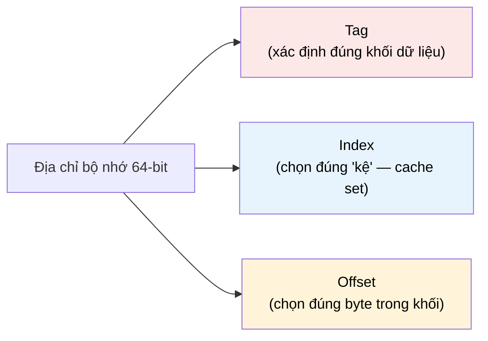

# MASTER COMPUTER SCIENCE HANDBOOK

## Volume 04 — Computer Systems
### Part II — Memory Systems
## Chương 2.3 — Bộ nhớ Cache
### (Cache Memory)

---

### Thông tin chương

| Trường | Giá trị |
|---|---|
| Chương | 2.3 |
| Thuộc Part | II — Memory Systems |
| Thuộc Volume | 04 — Computer Systems |
| Thời gian đọc ước tính | 55–65 phút |
| Độ khó | ★★★★☆ |
| Kiến thức tiên quyết | Chương 2.1 — Memory Hierarchy (Locality, AMAT); Chương 2.2 — Registers (tương phản quản lý tĩnh vs. động) |
| Chương liên quan | 2.4 — Main Memory (tầng mà cache "bảo vệ"); 2.5 — Virtual Memory (áp dụng lại nguyên lý cache ở cấp độ trang nhớ); Volume 04, Part IV — Concurrency (cache coherence giữa nhiều lõi) |
| Từ khóa | cache line, direct-mapped, set-associative, fully-associative, replacement policy, LRU, write-through, write-back, write-allocate, compulsory miss, capacity miss, conflict miss |

---

### Mục tiêu học tập

Sau khi hoàn thành chương này, người đọc có thể:

- Giải thích cấu trúc một **cache line** (tag, index, offset) và cách địa chỉ bộ nhớ được phân giải để xác định hit/miss.
- So sánh ba chiến lược ánh xạ (mapping): **Direct-Mapped**, **Fully-Associative**, **Set-Associative**, cùng đánh đổi giữa tốc độ, độ phức tạp phần cứng, và tỷ lệ miss.
- Phân loại ba nguyên nhân gây cache miss theo mô hình **3C** (Compulsory, Capacity, Conflict).
- Giải thích các chính sách ghi dữ liệu: **Write-Through** vs. **Write-Back**, **Write-Allocate** vs. **Write-No-Allocate**.
- Trình bày trực giác về **Replacement Policy** (LRU và các xấp xỉ thực tế) khi cache đầy.
- Kết nối các cơ chế trên với hành vi hiệu năng quan sát được trong chương trình thực tế.

---

### Câu hỏi khơi gợi

> *Chương 2.1 đã cho thấy cache giúp giảm AMAT một cách ấn tượng. Nhưng cache hoạt động "bên trong" ra sao? Khi CPU yêu cầu một byte tại địa chỉ 0x7FFA3C10, làm thế nào một mạch phần cứng — không có khả năng "tìm kiếm" theo nghĩa phần mềm — có thể xác định gần như tức thời rằng dữ liệu đó có đang nằm trong cache hay không, mà không cần quét qua toàn bộ cache?*

---

## 1. Tổng quan chương

Chương 2.1 giới thiệu cache như một khái niệm — một tầng trung gian khai thác Locality để giảm AMAT. Chương 2.2 cho thấy thanh ghi, tầng nhanh nhất, được quản lý **tĩnh** bởi trình biên dịch. Chương này đi vào chi tiết tầng tiếp theo: cache, nơi việc quản lý chuyển sang **hoàn toàn động**, do phần cứng tự động thực hiện tại thời điểm chạy, không có bất kỳ sự can thiệp nào từ phần mềm.

Đây là chương kỹ thuật nhất của Part II tính đến thời điểm này, vì cache phải giải quyết một bài toán khó hơn nhiều so với thanh ghi: với hàng tỷ địa chỉ bộ nhớ có thể có, nhưng chỉ vài chục nghìn "ô chứa" trong cache, làm sao xác định cực nhanh — trong vài chu kỳ CPU — rằng một địa chỉ cụ thể có đang được lưu hay không? Câu trả lời nằm ở một kỹ thuật ánh xạ địa chỉ tinh tế, được trình bày chi tiết từ Mục 6 trở đi.

> **💡 Insight**
> Cache không "tìm kiếm" theo nghĩa quét tuần tự (linear search) hay tìm kiếm nhị phân (binary search) mà bạn quen thuộc từ Volume 03. Nó dùng một kỹ thuật gần với **Hash Table** (sẽ học chi tiết ở Volume 03, Part II): một phần của địa chỉ được dùng trực tiếp làm "chỉ số" để nhảy thẳng đến đúng vị trí cần kiểm tra — không cần so sánh tuần tự.

---

## 2. Bối cảnh lịch sử

| Thời điểm | Nhân vật / Sự kiện | Đóng góp |
|---|---|---|
| 1965 | Maurice Wilkes (đã gặp ở Chương 2.1) | Đề xuất khái niệm "slave memory" — tiền thân lý thuyết của cache, với ý tưởng ánh xạ đơn giản dựa trên địa chỉ |
| 1968 | IBM System/360 Model 85 | Cache thương mại đầu tiên, sử dụng chiến lược **Set-Associative** — cho thấy ngay từ đầu, ngành công nghiệp đã nhận ra Direct-Mapped thuần túy không đủ hiệu quả |
| 1988 | Alan Jay Smith | Công bố khảo sát toàn diện *Cache Memories*, hệ thống hóa mô hình phân loại cache miss theo **3C** (Compulsory, Capacity, Conflict) vẫn được dùng phổ biến đến ngày nay (Mục 12) |
| Thập niên 1990–nay | Kiến trúc đa tầng cache (L1/L2/L3), đa lõi (multi-core) | Đặt ra bài toán mới: giữ nhiều bản sao cache nhất quán giữa các lõi (**cache coherence**), một chủ đề sẽ được mở rộng ở Volume 04, Part IV |

Điểm đáng chú ý: mô hình phân loại 3C của Alan Jay Smith (1988) không chỉ là một công cụ mô tả, mà đã định hình cách các nhà thiết kế CPU **chẩn đoán** vấn đề hiệu năng cache trong suốt hơn ba thập kỷ — một minh chứng cho việc một khung lý thuyết tốt (Mục 12) có thể có tuổi thọ vượt xa bất kỳ thế hệ phần cứng cụ thể nào.

---

## 3. Động lực

Giả sử một chương trình thực hiện vòng lặp sau, xử lý một mảng lớn `int A[1000000]`:

```c
long sum = 0;
for (int i = 0; i < 1000000; i++) {
    sum += A[i];
}
```

Trong 1.000.000 lần truy cập `A[i]`, cache không cần phải "nhớ" từng địa chỉ riêng lẻ một cách tùy ý. Nhờ **spatial locality** (Chương 2.1), khi CPU truy cập `A[0]`, cache không chỉ nạp đúng 4 byte của `A[0]` — nó nạp cả một **khối liền kề** (cache line, thường 64 byte, tức khoảng 16 số nguyên `int`). Kết quả: `A[1]` đến `A[15]` gần như chắc chắn đã có sẵn trong cache khi được truy cập, dù CPU chưa từng "yêu cầu" chúng một cách tường minh.

Nhưng điều gì xảy ra khi cache đã đầy, và một khối dữ liệu mới cần được nạp vào? Cache phải quyết định: khối nào bị loại bỏ để nhường chỗ? Và làm sao, chỉ với một địa chỉ 64-bit, cache xác định trong vài chu kỳ rằng dữ liệu cần tìm đang nằm ở đâu bên trong hàng chục nghìn cache line? Hai câu hỏi này — **ánh xạ địa chỉ** và **chính sách thay thế** — là nội dung cốt lõi của chương.

---

## 4. Trực giác

**Mô hình tinh thần (Mental Model) của chương này:**

> Cache giống như một **thư viện nhỏ đặt tại văn phòng**, chứa bản sao của một số cuốn sách được mượn thường xuyên từ thư viện trung tâm (bộ nhớ chính) ở xa. Thay vì tìm sách bằng cách lục tung mọi kệ (tìm kiếm tuần tự), thư viện nhỏ này gán **mỗi cuốn sách một "kệ cố định" dựa trên một quy tắc đơn giản** (ví dụ: mã số sách chia dư cho số kệ). Khi cần một cuốn sách, bạn đi thẳng đến đúng kệ được quy định — không cần tìm kiếm — và chỉ cần kiểm tra: cuốn sách trên kệ đó có đúng là cuốn bạn cần không (kiểm tra "tag"), hay đó là một cuốn khác đã được đặt vào cùng kệ trước đó.

| Khái niệm cache | Ẩn dụ thư viện |
|---|---|
| **Cache line** | Một cuốn sách (đơn vị dữ liệu nhỏ nhất được nạp/loại bỏ) |
| **Index** | Số hiệu kệ — được tính trực tiếp từ mã số sách, không cần tìm kiếm |
| **Tag** | Nhãn dán trên gáy sách để xác nhận đây đúng là cuốn cần tìm, không phải cuốn khác trùng kệ |
| **Cache miss** | Đến đúng kệ nhưng thấy cuốn sách khác (hoặc kệ trống) — phải cử người ra thư viện trung tâm lấy |
| **Replacement Policy** | Quy tắc quyết định cuốn sách nào bị trả về thư viện trung tâm khi kệ đã đầy và cần chỗ cho cuốn mới |

---

## 5. Trực quan hóa khái niệm

**Hình 2.3.1 — Phân giải địa chỉ bộ nhớ thành Tag – Index – Offset**
*(Visual đặc trưng của chương — Chapter Identity)*



```text
Địa chỉ 64-bit, ví dụ với cache line = 64 byte, 1024 set:

  [ ... Tag (54 bit) ... ][ Index (10 bit) ][ Offset (6 bit) ]
                              log2(1024)=10      log2(64)=6
```

| Trường thông tin | Nội dung |
|---|---|
| Mục đích | Cho thấy trực quan cách một địa chỉ bộ nhớ duy nhất được "cắt" thành ba phần, mỗi phần phục vụ một vai trò riêng trong quá trình xác định hit/miss |
| Điểm mấu chốt | Không có bước "tìm kiếm" nào — Index được dùng trực tiếp như chỉ số mảng để nhảy thẳng đến đúng set, đúng như cơ chế Hash Table sẽ học ở Volume 03 |

---

**Hình 2.3.2 — So sánh ba chiến lược Mapping**

```text
Direct-Mapped (mỗi khối bộ nhớ chỉ có ĐÚNG MỘT vị trí cache khả dĩ):

  Bộ nhớ:  [Block 0][Block 1][Block 2][Block 3][Block 4][Block 5]...
  Cache (4 dòng):  [Line 0] [Line 1] [Line 2] [Line 3]
                      ↑         ↑        ↑        ↑
   Block 0,4,8,...──┘   Block 1,5,9,...┘  ...      ...
   (ánh xạ theo: index = block_number mod số_dòng_cache)


Fully-Associative (một khối có thể nằm ở BẤT KỲ vị trí nào):

  Cache (4 dòng):  [  ?  ] [  ?  ] [  ?  ] [  ?  ]
   Bất kỳ khối bộ nhớ nào cũng có thể được đặt vào bất kỳ dòng nào
   → phải kiểm tra (so sánh tag) TẤT CẢ các dòng cùng lúc


Set-Associative (kết hợp — ví dụ 2-way, mỗi "set" có 2 dòng):

  Cache: Set 0 [Line A][Line B]   Set 1 [Line A][Line B]
   Một khối được ánh xạ vào ĐÚNG MỘT set (như Direct-Mapped),
   nhưng trong set đó, có thể nằm ở BẤT KỲ dòng nào (như Fully-Associative)
```

*Mục đích:* trực quan hóa ba chiến lược sẽ được định nghĩa hình thức ở Mục 6. *Điểm mấu chốt:* Set-Associative là điểm cân bằng giữa tốc độ của Direct-Mapped và tỷ lệ miss thấp của Fully-Associative — đây là lựa chọn phổ biến nhất trong CPU thực tế (ví dụ cache L1 8-way set-associative).

---

## 6. Định nghĩa hình thức

> **📌 Remember — Cache Line và Chiến lược Ánh xạ**
>
> **Cache Line (hay Cache Block)** là đơn vị dữ liệu nhỏ nhất được nạp vào hoặc loại bỏ khỏi cache trong một lần thao tác, thường có kích thước cố định (ví dụ 64 byte trên nhiều CPU hiện đại).
>
> Mỗi địa chỉ bộ nhớ được phân giải thành ba phần (Hình 2.3.1):
> - **Offset:** xác định byte cụ thể bên trong một cache line.
> - **Index:** xác định "set" (nhóm dòng cache) mà khối dữ liệu này *có thể* nằm trong.
> - **Tag:** phần còn lại của địa chỉ, dùng để xác nhận chính xác khối dữ liệu đang lưu trong dòng cache đó có đúng là khối đang cần hay không.
>
> Ba chiến lược ánh xạ chính:
>
> | Chiến lược | Số vị trí khả dĩ cho mỗi khối bộ nhớ | Độ phức tạp phần cứng |
> |---|---|---|
> | **Direct-Mapped** | Đúng 1 | Thấp nhất — chỉ so sánh 1 tag |
> | **Fully-Associative** | Bất kỳ dòng nào trong cache | Cao nhất — phải so sánh tag của mọi dòng song song |
> | **N-way Set-Associative** | N (trong đúng 1 set cụ thể) | Trung bình — so sánh N tag trong set tương ứng |

**Cache Hit / Cache Miss:** một truy cập là **hit** khi tag lưu tại vị trí được Index xác định khớp với tag của địa chỉ đang truy cập (và bit "valid" được bật); ngược lại là **miss**.

---

## 7. Nền tảng toán học

### 7.1 Số bit cho Index và Offset

- **Ý nghĩa:** kích thước cache line và số lượng set quyết định trực tiếp có bao nhiêu bit của địa chỉ được dùng cho Offset và Index — phần còn lại luôn là Tag.
- **Ví dụ đơn giản:** cache 32 KB, 8-way set-associative, cache line 64 byte.

> **📦 Formula Box — Phân giải địa chỉ Cache**
>
> $$\text{Số bit Offset} = \log_2(\text{kích thước cache line})$$
> $$\text{Số Set} = \dfrac{\text{Dung lượng Cache}}{\text{Kích thước cache line} \times \text{Số đường (N-way)}}$$
> $$\text{Số bit Index} = \log_2(\text{Số Set})$$
>
> | Thành phần | Ý nghĩa |
> |---|---|
> | Kích thước cache line | Càng lớn, càng ít bit Offset, nhưng mỗi lần miss nạp nhiều dữ liệu hơn (tận dụng spatial locality mạnh hơn, nhưng lãng phí nếu dữ liệu lân cận không được dùng đến) |
> | Số Set | Cache được chia thành bao nhiêu "nhóm" độc lập — quyết định trực tiếp số bit Index |
> | **Diễn giải kỹ thuật** | Tổng số bit Tag + Index + Offset luôn bằng đúng độ rộng địa chỉ (ví dụ 64 bit) — ba phần này không chồng lấp và không thiếu bit nào |
> | **Ứng dụng thường gặp** | Tính toán cấu hình cache cụ thể của một CPU thực tế từ các thông số công bố (dung lượng, associativity, line size) |

**Kiểm chứng bằng tay:** với ví dụ trên — 32 KB, 8-way, line 64 byte: Số Set $= \dfrac{32768}{64 \times 8} = 64$ set. Số bit Offset $= \log_2(64) = 6$. Số bit Index $= \log_2(64) = 6$. Với địa chỉ 64-bit, số bit Tag $= 64 - 6 - 6 = 52$ bit — khớp với minh họa tổng quát ở Hình 2.3.1.

### 7.2 Mô hình 3C — Phân loại nguyên nhân Cache Miss

> **📦 Formula Box — Mô hình 3C (Alan Jay Smith, 1988)**
>
> $$\text{Tổng Miss Rate} = \text{Compulsory} + \text{Capacity} + \text{Conflict}$$
>
> | Loại Miss | Nguyên nhân | Cách giảm thiểu |
> |---|---|---|
> | **Compulsory** ("cold miss") | Lần đầu tiên truy cập một khối dữ liệu — chưa từng có trong cache | Tăng kích thước cache line (nạp trước nhiều dữ liệu lân cận), dùng prefetching |
> | **Capacity** | Cache không đủ lớn để giữ toàn bộ working set của chương trình, dù chiến lược ánh xạ có lý tưởng đến đâu | Tăng dung lượng cache, hoặc cải thiện thuật toán để giảm working set |
> | **Conflict** | Nhiều khối bộ nhớ khác nhau cùng ánh xạ vào một Index, dẫn đến việc "đá nhau ra" dù cache tổng thể còn chỗ trống ở set khác | Tăng associativity (chuyển từ Direct-Mapped sang Set-Associative) |
> | **Diễn giải kỹ thuật** | Ba loại miss này độc lập về nguyên nhân, cho phép kỹ sư chẩn đoán chính xác "cache đang chậm vì lý do gì" thay vì chỉ nhìn vào một con số miss rate tổng quát |
> | **Ứng dụng thường gặp** | Công cụ profiling hiệu năng (Volume 04, Part IX) thường báo cáo riêng biệt ba loại miss này để hướng dẫn tối ưu hóa đúng trọng tâm |

---

## 8. Thuật toán / Cơ chế

**Cơ chế xử lý một truy cập cache (Cache Lookup)**, áp dụng cho N-way Set-Associative (tổng quát cho cả Direct-Mapped khi N=1, và Fully-Associative khi số set=1):

```text
Bước 1 — CPU phát địa chỉ X cần đọc
        │
        ▼
Bước 2 — Tách X thành Tag, Index, Offset (Mục 6, Hình 2.3.1)
        │
        ▼
Bước 3 — Dùng Index để xác định TRỰC TIẾP (không tìm kiếm)
         đúng "set" cần kiểm tra
        │
        ▼
Bước 4 — Trong set đó, so sánh Tag của X với tag của
         TẤT CẢ N dòng trong set (song song, cùng lúc)
        │
        ├── KHỚP một dòng, và dòng đó "valid" → HIT
        │        │
        │        ▼
        │   Trả dữ liệu tại Offset tương ứng cho CPU
        │
        └── KHÔNG khớp dòng nào → MISS
                 │
                 ▼
Bước 5 —    Lấy toàn bộ cache line chứa X từ tầng bộ nhớ
            thấp hơn (Chương 2.4 — Main Memory)
        │
        ▼
Bước 6 —    Nếu set đã đầy: áp dụng REPLACEMENT POLICY
            (Mục 9–10) để chọn một dòng bị loại bỏ,
            nhường chỗ cho khối mới
        │
        ▼
Bước 7 —    Đặt khối mới vào dòng vừa chọn, cập nhật Tag,
            bật bit Valid, trả dữ liệu cho CPU
```

> **💡 Insight**
> Bước 4 là lý do Set-Associative cần **N mạch so sánh (comparator) chạy song song**, thay vì một mạch so sánh chạy N lần tuần tự — đây chính xác là chi phí phần cứng phải trả để đổi lấy tỷ lệ Conflict Miss thấp hơn (Mục 7.2). Direct-Mapped (N=1) chỉ cần một mạch so sánh duy nhất — đơn giản và nhanh, nhưng dễ xảy ra Conflict Miss hơn nhiều.

---

## 9. Triển khai

```python
from collections import OrderedDict

class SetAssociativeCache:
    """Mô phỏng đơn giản một cache N-way set-associative,
    dùng chính sách thay thế LRU (Least Recently Used)."""

    def __init__(self, num_sets, ways, line_size):
        self.num_sets = num_sets
        self.ways = ways
        self.line_size = line_size
        # Mỗi set là một OrderedDict: tag -> True
        # Thứ tự chèn phản ánh thứ tự truy cập gần nhất (cho LRU)
        self.sets = [OrderedDict() for _ in range(num_sets)]
        self.hits = 0
        self.misses = 0

    def _decompose(self, address):
        offset_bits = (self.line_size - 1).bit_length()
        index_bits = (self.num_sets - 1).bit_length()
        offset = address & (self.line_size - 1)
        index = (address >> offset_bits) & (self.num_sets - 1)
        tag = address >> (offset_bits + index_bits)
        return tag, index, offset

    def access(self, address):
        tag, index, _ = self._decompose(address)
        cache_set = self.sets[index]

        if tag in cache_set:
            self.hits += 1
            cache_set.move_to_end(tag)  # đánh dấu vừa được dùng (LRU)
            return "HIT"

        self.misses += 1
        if len(cache_set) >= self.ways:
            cache_set.popitem(last=False)  # loại bỏ dòng "cũ nhất" — LRU
        cache_set[tag] = True
        return "MISS"

    def hit_rate(self):
        total = self.hits + self.misses
        return self.hits / total if total else 0.0
```

Lớp `SetAssociativeCache` triển khai trực tiếp cơ chế ở Mục 8: `_decompose` thực hiện đúng phép tách Tag–Index–Offset của Formula Box Mục 7.1; `access` thực hiện Bước 3–7, dùng `OrderedDict` để mô phỏng chính sách **LRU** (dòng được truy cập gần nhất luôn ở cuối, dòng bị loại bỏ khi cần chỗ luôn là dòng ở đầu — lâu chưa được dùng đến nhất).

---

## 10. Trực quan hóa quá trình thực thi

**Thử nghiệm với chuỗi truy cập lặp lại**, dùng `SetAssociativeCache(num_sets=4, ways=2, line_size=64)`:

```text
Chuỗi địa chỉ (giả lập truy cập tuần tự một mảng, mỗi block cách nhau 64 byte):
  0, 64, 128, 192, 256, 0, 64, 128, 192, 256, ...  (lặp lại 5 khối, 3 vòng)

Kết quả mô phỏng:
  Vòng 1: MISS MISS MISS MISS MISS   (Compulsory Miss — lần đầu truy cập)
  Vòng 2: HIT  HIT  MISS MISS MISS   (một phần Conflict Miss — 5 khối
                                       tranh chấp 4 set × 2 way = 8 chỗ)
  Vòng 3: HIT  HIT  MISS MISS MISS

  Hit rate tổng thể: 40%
```

**Diễn giải kết quả:** dù cache có tổng cộng 8 "chỗ" (4 set × 2 way = 8 dòng) — nhiều hơn 5 khối dữ liệu — hit rate vẫn không đạt 100% ở các vòng lặp lại. Nguyên nhân: 5 khối này không phân bố đều vào 4 set (do cách tính Index), khiến một số set bị "quá tải" trong khi set khác còn trống — đây chính là ví dụ cụ thể của **Conflict Miss** (Mục 7.2), minh họa rõ ràng vì sao "còn chỗ trống trong cache" không đảm bảo một truy cập cụ thể sẽ hit.

**So sánh Direct-Mapped vs. Set-Associative** trên cùng chuỗi truy cập (dữ liệu minh họa, cùng tổng dung lượng cache):

| Cấu hình | Hit Rate |
|---|---|
| Direct-Mapped (8 dòng, 1-way) | 20% |
| 2-way Set-Associative (4 set × 2 way) | 40% |
| 4-way Set-Associative (2 set × 4 way) | 60% |
| Fully-Associative (1 set × 8 way) | 60% |

Xu hướng này khớp với trực giác ở Mục 4–5: tăng associativity giúp giảm Conflict Miss, nhưng lợi ích giảm dần (diminishing returns) khi đã đạt độ associativity đủ cao — đây là lý do phần lớn cache L1 thực tế chỉ dùng 4-way đến 8-way, thay vì Fully-Associative, để cân bằng với chi phí phần cứng đã nêu ở Mục 8.

---

## 11. Ứng dụng công nghiệp

> **🛠 Engineering Practice**
> Chính sách ghi dữ liệu (write policy) — chưa được đề cập ở các mục trên — là yếu tố quyết định trực tiếp đến độ tin cậy và hiệu năng ghi của hệ thống thực tế.

| Chính sách | Mô tả | Đánh đổi |
|---|---|---|
| **Write-Through** | Mọi lần ghi vào cache đều được ghi đồng thời xuống tầng bộ nhớ thấp hơn | Đơn giản, dữ liệu luôn nhất quán, nhưng chậm hơn vì mỗi lần ghi đều tốn chi phí truy cập bộ nhớ chính |
| **Write-Back** | Ghi chỉ cập nhật trong cache; chỉ đồng bộ xuống bộ nhớ chính khi dòng cache đó bị thay thế (dùng thêm một **Dirty Bit** để đánh dấu) | Nhanh hơn nhiều, nhưng phức tạp hơn và có rủi ro mất dữ liệu nếu mất điện đột ngột trước khi đồng bộ |
| **Write-Allocate** | Khi ghi vào một địa chỉ chưa có trong cache (write miss), nạp cả cache line đó vào cache trước khi ghi | Phù hợp khi dữ liệu vừa ghi có khả năng sẽ được đọc lại sớm (temporal locality) |
| **No-Write-Allocate** | Khi write miss, ghi thẳng xuống bộ nhớ thấp hơn, không nạp vào cache | Phù hợp khi dữ liệu ghi một lần, không có khả năng đọc lại ngay (ví dụ ghi log tuần tự) |

Hầu hết CPU hiện đại kết hợp **Write-Back + Write-Allocate** cho cache dữ liệu (data cache), vì tổ hợp này tối ưu nhất cho phần lớn workload thông thường — đánh đổi độ phức tạp phần cứng để lấy hiệu năng ghi cao.

---

## 12. Góc nhìn nghiên cứu

> **🔬 Research Connection**
> Replacement Policy là một trong những chủ đề được nghiên cứu liên tục nhất trong kiến trúc máy tính, vì LRU — dù trực giác và phổ biến — không phải lúc nào cũng là lựa chọn tối ưu.

**LRU (Least Recently Used)**, được triển khai ở Mục 9, dựa trên giả định temporal locality: dòng lâu không được dùng nhất có khả năng thấp nhất sẽ được dùng lại sớm. Tuy nhiên, LRU chính xác tuyệt đối tốn chi phí phần cứng đáng kể khi associativity cao (phải theo dõi thứ tự truy cập của mọi dòng trong set), nên CPU thực tế thường dùng các **xấp xỉ LRU** (Pseudo-LRU) rẻ hơn về phần cứng nhưng gần đạt hiệu quả tương đương.

Hướng nghiên cứu hiện tại bao gồm: **replacement policy học máy** — ví dụ các công trình dùng mạng nơ-ron nhỏ, huấn luyện trực tiếp trên chip, để dự đoán dòng nào ít khả năng được dùng lại, vượt qua giới hạn của các heuristic cố định như LRU; và **cache partitioning** trong hệ thống đa lõi/đa tiến trình — chia sẻ một cache L3 dùng chung giữa nhiều chương trình sao cho một chương trình "tham lam" không chiếm hết cache, làm chậm các chương trình khác (liên hệ trực tiếp Volume 04, Part IV).

**Câu hỏi mở** để suy ngẫm: mô hình 3C (Mục 7.2) được đề xuất năm 1988, trước khi cache đa lõi dùng chung trở nên phổ biến. Trong một hệ thống nhiều lõi cùng chia sẻ một cache L3, một miss có thể xảy ra không phải vì chương trình của bạn thiếu locality, mà vì một chương trình *khác* đang chạy song song đã "đẩy" dữ liệu của bạn ra khỏi cache — mô hình 3C truyền thống có cần một loại "C" thứ tư để mô tả hiện tượng này không?

---

## 13. Ưu điểm

- **Tăng AMAT hiệu quả rõ rệt** (đã định lượng ở Chương 2.1, Mục 10) mà không cần thay đổi thuật toán hay mã nguồn chương trình.
- **Hoàn toàn tự động, minh bạch với phần mềm** — không giống register allocation (Chương 2.2), lập trình viên không cần biết bất cứ điều gì về cache để chương trình chạy đúng (dù hiểu nó giúp viết code nhanh hơn).
- **Cơ chế Set-Associative cân bằng tốt** giữa tốc độ phần cứng (gần với Direct-Mapped) và tỷ lệ miss thấp (gần với Fully-Associative).
- **Khả năng mở rộng nhiều tầng** (L1, L2, L3) tự nhiên, mỗi tầng áp dụng cùng nguyên lý với tham số khác nhau (đã thấy ở Chương 2.1, Mục 7.2 và Mục 10).

---

## 14. Hạn chế

> **⚠️ Common Mistake**
> Một ngộ nhận phổ biến: cho rằng "cache càng lớn càng tốt, không có đánh đổi". Thực tế, cache lớn hơn thường có **độ trễ truy cập cao hơn** (đường dẫn vật lý dài hơn, mạch so sánh phức tạp hơn) — đây chính xác là lý do L1 nhỏ nhưng cực nhanh, còn L3 lớn hơn nhiều nhưng chậm hơn đáng kể (Hình 2.1.1, Chương 2.1).

- **Conflict Miss không thể loại bỏ hoàn toàn** trừ khi dùng Fully-Associative — nhưng khi đó chi phí phần cứng (số mạch so sánh) tăng theo cấp số nhân với dung lượng.
- **Write-Back đặt ra rủi ro về tính bền vững dữ liệu** — nếu hệ thống mất điện đột ngột trước khi dữ liệu "dirty" được đồng bộ xuống bộ nhớ chính, dữ liệu đó có thể bị mất.
- **Cache Coherence trở thành bài toán phức tạp** trong hệ thống đa lõi, khi nhiều CPU core, mỗi core có cache riêng, cùng truy cập một vùng bộ nhớ chia sẻ — nội dung sẽ được mở rộng ở Volume 04, Part IV.
- **Hiệu quả phụ thuộc hoàn toàn vào locality thực tế của chương trình** — với workload có mẫu truy cập gần như ngẫu nhiên (đã cảnh báo ở Chương 2.1, Mục 14), ngay cả một cache được thiết kế tốt cũng mang lại rất ít lợi ích.

---

## 15. So sánh

**Bảng 2.3.1 — Ba chiến lược Mapping: Đánh đổi tổng hợp**

| Tiêu chí | Direct-Mapped | Set-Associative (N-way) | Fully-Associative |
|---|---|---|---|
| Số mạch so sánh tag cần thiết | 1 | N | Toàn bộ số dòng cache |
| Tốc độ truy cập (độ trễ) | Nhanh nhất | Trung bình | Chậm nhất |
| Tỷ lệ Conflict Miss | Cao nhất | Trung bình, giảm khi N tăng | Bằng 0 (loại bỏ hoàn toàn) |
| Độ phức tạp phần cứng | Thấp nhất | Trung bình | Cao nhất |
| Ứng dụng phổ biến | Hiếm dùng độc lập trong CPU hiện đại | Phổ biến nhất (L1: 4–8 way, L2/L3: 8–16 way) | Thường chỉ dùng cho cache rất nhỏ (ví dụ TLB, sẽ gặp ở Chương 2.5) |

**Phân tích:** không có chiến lược nào "tốt nhất tuyệt đối" — đây là một minh chứng khác cho nguyên tắc đánh đổi kỹ thuật (engineering trade-off) đã xuất hiện xuyên suốt Part II. Set-Associative chiếm ưu thế trong thực tế chính vì nó không tối ưu hóa cực đoan theo bất kỳ tiêu chí đơn lẻ nào, mà tìm điểm cân bằng hợp lý giữa tốc độ và tỷ lệ miss — đúng như tinh thần "đánh đổi có kiểm soát" mà kiến trúc máy tính hiện đại theo đuổi.

---

## 16. Tóm tắt

- **Cache** ánh xạ địa chỉ bộ nhớ thành ba phần — **Tag, Index, Offset** — cho phép xác định hit/miss gần như tức thời mà không cần tìm kiếm tuần tự, tương tự cơ chế Hash Table.
- Ba chiến lược ánh xạ — **Direct-Mapped, Fully-Associative, Set-Associative** — đánh đổi giữa tốc độ phần cứng và tỷ lệ Conflict Miss; **Set-Associative** (thường 4–16 way) là lựa chọn phổ biến nhất trong thực tế.
- Mô hình **3C** (Compulsory, Capacity, Conflict) phân loại chính xác nguyên nhân cache miss, hướng dẫn đúng chiến lược tối ưu hóa (tăng line size, tăng dung lượng, hay tăng associativity).
- Chính sách ghi dữ liệu (**Write-Through/Write-Back**, **Write-Allocate/No-Write-Allocate**) quyết định đánh đổi giữa hiệu năng ghi và độ an toàn dữ liệu; phần lớn CPU hiện đại dùng Write-Back kết hợp Write-Allocate.
- **Replacement Policy** (LRU và các xấp xỉ) quyết định dòng nào bị loại bỏ khi cache đầy — một bài toán vẫn đang được nghiên cứu tích cực, đặc biệt trong bối cảnh cache dùng chung đa lõi.

Chương 2.4 (Main Memory) sẽ chuyển xuống tầng mà cache "bảo vệ" — bộ nhớ chính DRAM — giải thích vì sao tầng này chậm hơn cache đến vậy về mặt vật lý, và cách nó được tổ chức để phục vụ những lần cache miss hiệu quả nhất có thể.

---

## 17. Bài tập

### Mức Cơ bản (Basic)

1. Với cache 64 KB, 4-way set-associative, cache line 32 byte, tính số Set, số bit Offset, và số bit Index (địa chỉ 64-bit). Áp dụng trực tiếp Formula Box Mục 7.1.
2. Giải thích bằng lời của riêng bạn: vì sao Fully-Associative không có Conflict Miss, nhưng vẫn có thể có Capacity Miss.

### Mức Trung bình (Intermediate)

3. Dùng lớp `SetAssociativeCache` ở Mục 9, mô phỏng chuỗi truy cập tuần tự một mảng 20 phần tử (địa chỉ 0, 64, 128, ..., 1216) lặp lại 3 vòng, với cấu hình `num_sets=4, ways=4`. So sánh hit rate với cấu hình `num_sets=16, ways=1` (Direct-Mapped) cùng tổng dung lượng. Giải thích chênh lệch dựa trên mô hình 3C.
4. Phân loại từng cache miss trong ví dụ ở Mục 10 (chuỗi 5 khối × 3 vòng) theo mô hình 3C: những miss nào là Compulsory, những miss nào là Conflict?

### Mức Nâng cao (Advanced)

5. Giải thích tại sao Write-Back thường đi kèm với **Write-Allocate**, trong khi Write-Through thường đi kèm với **No-Write-Allocate**, trong các thiết kế CPU thực tế. *(Gợi ý: xem xét chi phí tương đối của việc "nạp cache line không cần thiết" trong từng chính sách ghi.)*

### Mức Nghiên cứu (Research)

6. Đọc thêm về kỹ thuật **Pseudo-LRU** (được đề cập ở Mục 12). Trình bày ngắn gọn: bằng cách nào phần cứng có thể xấp xỉ hành vi LRU mà không cần lưu trữ đầy đủ thứ tự truy cập của mọi dòng trong set (khác với cách triển khai bằng `OrderedDict` ở Mục 9, vốn giữ thứ tự chính xác tuyệt đối)?

---

## 18. Dự án nhỏ

**Dự án: Trình mô phỏng và so sánh Cache (Cache Simulator & Comparator)**

- **Mục tiêu:** Mở rộng `SetAssociativeCache` ở Mục 9 thành một công cụ hoàn chỉnh, nhận vào một trace truy cập bộ nhớ thực tế (ví dụ từ log thực thi một chương trình đơn giản) và so sánh hit rate giữa nhiều cấu hình cache khác nhau.
- **Yêu cầu:**
  - Hỗ trợ cả hai chính sách replacement: LRU (đã có) và Random (chọn ngẫu nhiên dòng để loại bỏ) để so sánh hiệu quả.
  - Phân loại từng miss theo mô hình 3C (Mục 7.2) — yêu cầu theo dõi lịch sử truy cập để phân biệt Compulsory với Capacity/Conflict.
  - Sinh trace truy cập mô phỏng cho hai kịch bản: (a) duyệt mảng tuần tự (row-major), (b) duyệt mảng ngẫu nhiên — liên hệ trực tiếp ví dụ ở Chương 2.1, Mục 3 và Mục 10.
  - Vẽ biểu đồ so sánh hit rate theo associativity (1-way, 2-way, 4-way, 8-way, Fully-Associative) cho cùng một trace, dùng `matplotlib`.
- **Kết quả kỳ vọng:** Tái tạo được xu hướng ở Bảng so sánh Mục 10, đồng thời định lượng chính xác được benchmark định tính ở Chương 2.1, Mục 10 (chênh lệch hiệu năng row-major vs. column-major).
- **Hướng mở rộng:** Thêm mô phỏng hai tầng cache (L1 + L2), áp dụng công thức AMAT nhiều tầng đã học ở Chương 2.1, Mục 7.2, tính AMAT thực nghiệm từ chính kết quả mô phỏng thay vì tham số giả định.

---

## 19. Tự đánh giá

- [ ] Tôi có thể giải thích, không cần nhìn Hình 2.3.1, vì sao một địa chỉ bộ nhớ được tách thành đúng ba phần Tag–Index–Offset, và vai trò của từng phần.
- [ ] Tôi có thể tự tính số bit Offset và Index cho một cấu hình cache cụ thể (dung lượng, associativity, line size cho trước).
- [ ] Tôi phân biệt được rõ ràng ba loại cache miss theo mô hình 3C, và có thể tự phân loại một ví dụ miss cụ thể.
- [ ] Tôi hiểu sự khác biệt giữa Write-Through/Write-Back và Write-Allocate/No-Write-Allocate, cùng đánh đổi của mỗi lựa chọn.
- [ ] Tôi hiểu tại sao Set-Associative là lựa chọn phổ biến nhất trong thực tế, thay vì Direct-Mapped hay Fully-Associative thuần túy.

Nếu Bài tập 3–4 (phân loại miss theo 3C) còn khó, nên đọc lại Mục 7.2 và Mục 10 một lần nữa, đặc biệt chú ý phân biệt "miss lần đầu vì chưa từng truy cập" (Compulsory) với "miss vì bị dòng khác đá ra dù cache còn chỗ ở set khác" (Conflict) — trước khi tiếp tục sang Chương 2.4.

---

## 20. Đọc thêm

- **Sách:** John L. Hennessy, David A. Patterson, *Computer Architecture: A Quantitative Approach* — chương Memory Hierarchy Design, nguồn tham khảo kinh điển cho mô hình 3C và phân tích định lượng associativity.
- **Sách (đã có trong BOOKS.md):** Randal E. Bryant, David R. O'Hallaron, *Computer Systems: A Programmer's Perspective* — chương "The Memory Hierarchy", phần Cache Memories, trình bày rất trực quan cơ chế Tag–Index–Offset.
- **Bài báo kinh điển:** Alan Jay Smith, *Cache Memories* (ACM Computing Surveys, 1982) — nguồn gốc của mô hình phân loại 3C được mở rộng và hệ thống hóa đầy đủ năm 1988, trình bày ở Mục 2 và Mục 7.2.
- **Chương tiếp theo:** Chương 2.4 — Main Memory.

---

### Liên kết chương (Cross References)

- **Chương trước:** 2.1 — Memory Hierarchy (Locality và AMAT là nền tảng lý thuyết cho toàn bộ chương này); 2.2 — Registers (tương phản quản lý tĩnh — thanh ghi — với quản lý động — cache — đã nêu ở Bảng 2.2.1).
- **Chương tiếp theo:** 2.4 — Main Memory (tầng DRAM mà cache bảo vệ; giải thích vì sao miss penalty ở Chương 2.1 lại lớn đến vậy về mặt vật lý); 2.5 — Virtual Memory (TLB — Translation Lookaside Buffer — áp dụng lại chính xác cơ chế Fully-Associative đã học ở đây, cho một mục đích khác: dịch địa chỉ ảo sang địa chỉ vật lý).
- **Chương liên quan xa hơn:** Volume 03, Part II — Hash Tables (cơ chế Index tương đồng về bản chất với hàm băm); Volume 04, Part IV — Concurrency (Cache Coherence trong hệ thống đa lõi, mở rộng trực tiếp từ Mục 14).
- **Vị trí trong Knowledge Graph:** Chương thứ ba của Volume 04, Part II — chương kỹ thuật trọng tâm của Part, áp dụng đầy đủ công thức AMAT từ Chương 2.1 vào một cơ chế phần cứng cụ thể; là điều kiện tiên quyết trực tiếp cho Chương 2.5 (Virtual Memory), nơi nhiều khái niệm ở đây (associativity, replacement policy) được tái sử dụng ở một tầng trừu tượng khác.

---

*Hết Chương 2.3. Chương này tuân thủ đầy đủ cấu trúc 20 mục của `OUTPUT.md` và chuẩn Presentation Layer của `WRITING_STANDARD.md`, tiếp nối trực tiếp Chương 2.1 và 2.2 trong Volume 04, Part II. Các số liệu hit rate ở Mục 10 (bảng so sánh Direct-Mapped/Set-Associative/Fully-Associative) được tính từ chính mô phỏng Python ở Mục 9 với chuỗi truy cập minh họa; đây là số liệu mang tính giáo dục (illustrative), phản ánh đúng xu hướng định tính (associativity cao hơn → hit rate cao hơn, lợi ích giảm dần) nhưng không phải benchmark trên phần cứng hay chương trình thực tế cụ thể. Đang chờ rà soát trước khi tiếp tục sang Chương 2.4 — Main Memory.*
