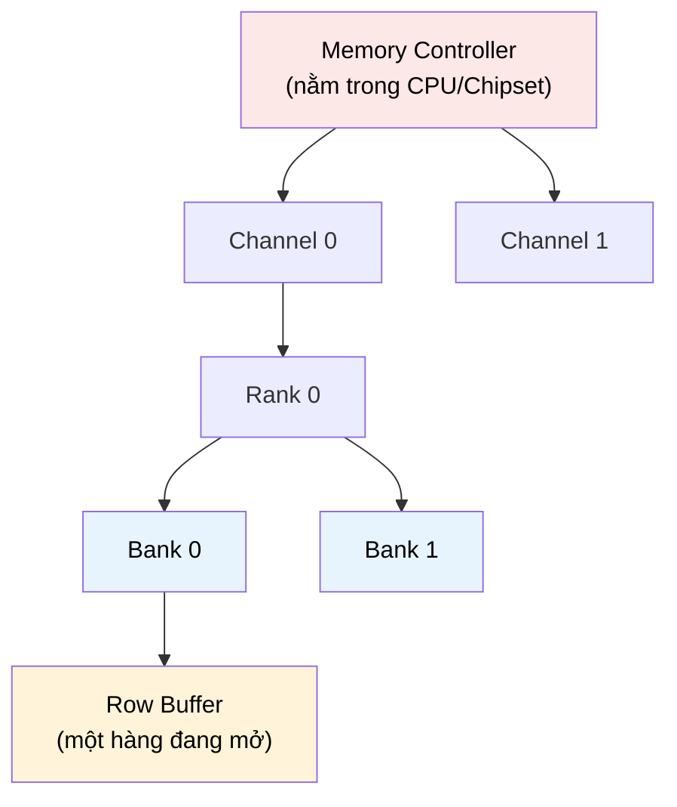

# MASTER COMPUTER SCIENCE HANDBOOK

## Volume 04 — Computer Systems
### Part II — Memory Systems
## Chương 2.4 — Bộ nhớ Chính
### (Main Memory)

---

### Thông tin chương

| Trường | Giá trị |
|---|---|
| Chương | 2.4 |
| Thuộc Part | II — Memory Systems |
| Thuộc Volume | 04 — Computer Systems |
| Thời gian đọc ước tính | 45–55 phút |
| Độ khó | ★★★☆☆ |
| Kiến thức tiên quyết | Chương 2.1 — Memory Hierarchy (AMAT, miss penalty); Chương 2.3 — Cache Memory (khái niệm tầng mà cache "bảo vệ") |
| Chương liên quan | 2.5 — Virtual Memory (địa chỉ vật lý được dịch đến chính tầng này); 2.8 — NUMA and Persistent Memory (mở rộng tổ chức bộ nhớ chính ra quy mô đa socket) |
| Từ khóa | DRAM, SRAM, memory controller, memory channel, bandwidth, latency, row buffer, bank, rank, DDR, memory-level parallelism |

---

### Mục tiêu học tập

Sau khi hoàn thành chương này, người đọc có thể:

- Giải thích vì sao **DRAM** chậm hơn SRAM (cache) nhiều lần về mặt vật lý, dù cả hai đều là bộ nhớ bán dẫn.
- Trình bày cấu trúc tổ chức của DRAM: **bank, row, column**, và vai trò của **Row Buffer**.
- Phân biệt rõ ràng hai khái niệm thường bị nhầm lẫn: **Latency** (độ trễ) và **Bandwidth** (băng thông).
- Giải thích vai trò của **Memory Controller** và cách nhiều **Memory Channel** hoạt động song song để tăng bandwidth.
- Kết nối tổ chức vật lý của DRAM với các khuyến nghị thực hành khi viết code truy cập bộ nhớ hiệu năng cao.

---

### Câu hỏi khơi gợi

> *Chương 2.1 cho biết một lần truy cập DRAM có thể tốn 100–300 chu kỳ CPU — chậm hơn thanh ghi hàng trăm lần. Nhưng nếu DRAM và cache (SRAM) đều được chế tạo từ silicon, bằng công nghệ bán dẫn tương tự nhau, tại sao chênh lệch tốc độ lại lớn đến vậy? Và tại sao "băng thông bộ nhớ" (memory bandwidth) — con số các nhà sản xuất RAM luôn quảng cáo — lại không phải là thước đo duy nhất quyết định một chương trình chạy nhanh hay chậm?*

---

## 1. Tổng quan chương

Chương 2.3 đã giải thích chi tiết cách cache hoạt động, nhưng luôn giả định một điều: khi cache miss, dữ liệu "được lấy từ tầng bộ nhớ thấp hơn" — mà không giải thích tầng đó vận hành ra sao. Chương này lấp đầy khoảng trống đó: **Bộ nhớ Chính (Main Memory)**, hầu như luôn được xây dựng từ công nghệ **DRAM (Dynamic RAM)**.

Đây cũng là chương đầu tiên trong Part II mà người đọc sẽ thấy rõ **sự khác biệt vật lý căn bản** giữa hai loại bộ nhớ bán dẫn — SRAM (dùng cho cache) và DRAM (dùng cho bộ nhớ chính) — chứ không chỉ khác nhau về vị trí trong phân cấp. Hiểu được sự khác biệt vật lý này giải thích trực tiếp con số miss penalty 100–300 chu kỳ đã dùng xuyên suốt các ví dụ AMAT ở Chương 2.1, thay vì chỉ chấp nhận nó như một tham số cho sẵn.

> **💡 Insight**
> SRAM (Static RAM, dùng cho cache) lưu mỗi bit bằng một mạch gồm 6 transistor giữ trạng thái ổn định liên tục. DRAM (Dynamic RAM, dùng cho bộ nhớ chính) lưu mỗi bit chỉ bằng **1 transistor và 1 tụ điện (capacitor)** — rẻ hơn và mật độ cao hơn rất nhiều, nhưng tụ điện bị rò điện tích theo thời gian, buộc DRAM phải liên tục "làm mới" (refresh) dữ liệu — đây chính là nguồn gốc của cả tên gọi "Dynamic" lẫn phần lớn độ trễ bổ sung so với SRAM.

---

## 2. Bối cảnh lịch sử

| Thời điểm | Nhân vật / Sự kiện | Đóng góp |
|---|---|---|
| 1968 | Robert Dennard (IBM) | Phát minh tế bào DRAM một-transistor-một-tụ-điện (1T1C) — thiết kế nền tảng vẫn được dùng trong DRAM hiện đại hơn nửa thế kỷ sau |
| 1970 | Intel 1103 | Chip DRAM thương mại đầu tiên, đánh dấu DRAM chính thức thay thế bộ nhớ lõi từ tính (magnetic core memory) làm bộ nhớ chính chuẩn của máy tính |
| Thập niên 1990–2000 | Chuẩn hóa **SDRAM** rồi **DDR SDRAM** (Double Data Rate) | Cho phép truyền dữ liệu ở cả hai cạnh lên và xuống của xung nhịp (clock edge), tăng gấp đôi băng thông hiệu dụng mà không cần tăng tần số xung nhịp vật lý |
| 2000s–nay | Các thế hệ DDR2, DDR3, DDR4, DDR5 | Mỗi thế hệ tăng đáng kể bandwidth và giảm điện năng tiêu thụ trên mỗi bit, nhưng **độ trễ tuyệt đối (tính bằng nano giây) hầu như không cải thiện tương ứng** — một hiện tượng quan trọng sẽ giải thích ở Mục 12 |

Điểm đáng chú ý nhất về mặt lịch sử: trong khi bandwidth của DRAM đã tăng hàng trăm lần kể từ Intel 1103, **độ trễ vật lý (latency) của một lần truy cập DRAM gần như không thay đổi đáng kể** tính theo đơn vị thời gian tuyệt đối trong suốt 20 năm qua — nó chỉ "trông có vẻ" cải thiện khi tính theo số chu kỳ CPU, đơn giản vì CPU đã trở nên nhanh hơn nhiều so với DRAM. Đây chính là biểu hiện cụ thể của **Memory Wall** đã đề cập ở Chương 2.1, Mục 2.

---

## 3. Động lực

Hãy xem xét hai đoạn code duyệt cùng một mảng lớn `int A[N]`, với `N` đủ lớn để không vừa trong cache:

```c
// Phiên bản 1 — truy cập tuần tự
for (i = 0; i < N; i++)
    sum += A[i];

// Phiên bản 2 — truy cập với bước nhảy lớn (stride)
for (i = 0; i < N; i += 16)
    sum += A[i];
```

Trực giác từ Chương 2.1 (spatial locality) có thể khiến bạn dự đoán Phiên bản 2 sẽ nhanh hơn nhiều — vì nó chỉ đọc 1/16 tổng số phần tử. Nhưng trên thực tế phần cứng, mức chênh lệch thường **nhỏ hơn nhiều** so với tỷ lệ 16 lần đó, và trong một số trường hợp gần như không đáng kể. Lý do nằm ở tổ chức vật lý của DRAM: khi truy cập `A[0]`, DRAM không chỉ đọc đúng 4 byte cần thiết — nó phải kích hoạt (activate) toàn bộ một **hàng (row)** dữ liệu, thường lớn hơn nhiều so với một cache line, và giữ hàng đó trong **Row Buffer**. Nếu `A[16]` vẫn nằm trong cùng row đã kích hoạt, truy cập tiếp theo gần như miễn phí; nhưng nếu bước nhảy đủ lớn để liên tục nhảy sang row khác, mỗi lần truy cập đều phải trả chi phí "đóng row cũ, mở row mới" — chi phí này độc lập với việc CPU chỉ cần một vài byte hay toàn bộ row.

Hiện tượng này — chi phí thực tế của DRAM phụ thuộc vào **row locality** chứ không chỉ đơn thuần vào "số byte cần đọc" — là nội dung cốt lõi giải thích tại sao chương này cần tồn tại tách biệt khỏi Chương 2.3, dù về bề ngoài cả hai đều nói về "đọc dữ liệu từ bộ nhớ".

---

## 4. Trực giác

**Mô hình tinh thần (Mental Model) của chương này:**

> DRAM giống như **một kho sách khổng lồ, được tổ chức thành nhiều dãy kệ (bank), mỗi dãy kệ có nhiều hàng (row)**. Để lấy một cuốn sách, thủ thư không thể "với tay lấy trực tiếp" như ở cache (Chương 2.3) — họ phải **kéo cả một hàng kệ ra bàn làm việc trước (Row Buffer)**, rồi mới lấy đúng cuốn sách cần trong hàng đó. Nếu cuốn sách tiếp theo cần lấy nằm trên **cùng hàng kệ vừa kéo ra**, công việc gần như tức thì. Nhưng nếu nó nằm ở một hàng khác, thủ thư phải **đẩy hàng kệ cũ về chỗ cũ, rồi kéo hàng kệ mới ra** — một thao tác tốn thời gian đáng kể, bất kể cuốn sách mới cần lấy có "gần" hay "xa" cuốn sách cũ về mặt số hiệu.

| Khái niệm DRAM | Ẩn dụ kho sách |
|---|---|
| **Bank** | Một dãy kệ độc lập, có thể được thao tác song song với các dãy kệ khác |
| **Row** | Một hàng kệ cụ thể bên trong một dãy |
| **Row Buffer** | Bàn làm việc — nơi tạm giữ toàn bộ hàng kệ vừa được kéo ra |
| **Row Hit** | Cuốn sách cần lấy nằm ngay trên hàng đang có sẵn trên bàn — lấy gần như tức thì |
| **Row Miss** (Row Conflict) | Phải đẩy hàng cũ về, kéo hàng mới ra — tốn thời gian đáng kể |

---

## 5. Trực quan hóa khái niệm

**Hình 2.4.1 — Tổ chức phân cấp của DRAM**
*(Visual đặc trưng của chương — Chapter Identity)*



| Trường thông tin | Nội dung |
|---|---|
| Mục đích | Cho thấy DRAM không phải "một khối đồng nhất" mà là một hệ thống phân cấp nhiều tầng tổ chức (channel → rank → bank → row), mỗi tầng mang khả năng song song hóa riêng |
| Điểm mấu chốt | Các Bank khác nhau có thể được kích hoạt (activate) độc lập, song song — đây là cơ sở vật lý cho khái niệm **Memory-Level Parallelism** ở Mục 12 |

---

**Hình 2.4.2 — Row Hit so với Row Miss**

```text
Trạng thái ban đầu: Row Buffer đang mở Row 5

Truy cập tiếp theo tại Row 5, cột khác:
   [ROW HIT] ──► Đọc trực tiếp từ Row Buffer ──► Rất nhanh

Truy cập tiếp theo tại Row 12:
   [ROW MISS] ──► Bước 1: Đóng (Precharge) Row 5
                ──► Bước 2: Mở (Activate) Row 12
                ──► Bước 3: Đọc từ Row Buffer mới
                ──► Chậm hơn Row Hit đáng kể (thường 2-3 lần độ trễ)
```

*Mục đích:* minh họa cụ thể động lực đã nêu ở Mục 3 — vì sao bước nhảy (stride) trong truy cập mảng ảnh hưởng đến hiệu năng không tuyến tính với số byte thực sự cần đọc. *Điểm mấu chốt:* "Row Locality" là một dạng locality bổ sung, đặc thù cho DRAM, khác với — nhưng có liên hệ chặt với — spatial locality đã học ở Chương 2.1.

---

## 6. Định nghĩa hình thức

> **📌 Remember — DRAM và Tổ chức Bộ nhớ Chính**
>
> **DRAM (Dynamic Random-Access Memory)** là công nghệ bộ nhớ bán dẫn lưu mỗi bit dữ liệu bằng một tụ điện, đòi hỏi phải được **làm mới (refresh)** định kỳ vì tụ điện tự rò rỉ điện tích theo thời gian — đối lập với **SRAM (Static RAM)**, dùng cho cache, lưu bit bằng mạch flip-flop ổn định, không cần refresh nhưng tốn nhiều transistor hơn trên mỗi bit.
>
> Bộ nhớ chính hiện đại được tổ chức theo phân cấp (Hình 2.4.1):
>
> - **Channel:** một đường truyền dữ liệu độc lập giữa Memory Controller và module RAM; nhiều channel cho phép truy cập song song, tăng bandwidth tổng thể.
> - **Rank:** một tập hợp chip DRAM trên cùng một module (thanh RAM), được truy cập đồng thời như một đơn vị.
> - **Bank:** một mảng lưu trữ độc lập bên trong rank; các bank khác nhau có thể được thao tác (activate/precharge) song song.
> - **Row / Column:** vị trí cụ thể của dữ liệu bên trong một bank — Row phải được "mở" (activate) vào **Row Buffer** trước khi Column bên trong nó có thể được đọc hoặc ghi.
>
> **Memory Controller** là mạch phần cứng (nằm trong CPU trên các kiến trúc hiện đại) chịu trách nhiệm dịch yêu cầu đọc/ghi từ CPU thành các lệnh cụ thể (Activate, Read/Write, Precharge, Refresh) gửi đến DRAM.

---

## 7. Nền tảng toán học

### 7.1 Phân biệt Latency và Bandwidth

- **Ý nghĩa:** đây là cặp khái niệm dễ nhầm lẫn nhất khi đọc thông số kỹ thuật RAM — hiểu đúng sự khác biệt giải thích trực tiếp vì sao "RAM có bandwidth cao hơn" không luôn đồng nghĩa "chương trình chạy nhanh hơn".
- **Ví dụ đơn giản:** một đường ống nước — Latency là thời gian giọt nước đầu tiên đi từ đầu này đến đầu kia của ống; Bandwidth là lượng nước chảy ra mỗi giây khi ống đã đầy.

> **📦 Formula Box — Latency vs. Bandwidth**
>
> $$\text{Latency (độ trễ)} = \text{Thời gian từ lúc phát yêu cầu đến lúc nhận byte ĐẦU TIÊN}$$
> $$\text{Bandwidth (băng thông)} = \dfrac{\text{Tổng lượng dữ liệu truyền được}}{\text{Thời gian truyền}}$$
>
> | Thành phần | Ý nghĩa |
> |---|---|
> | Latency | Quyết định tốc độ cho các truy cập **đơn lẻ, phụ thuộc lẫn nhau** (ví dụ: duyệt linked list, nơi phải đọc xong node này mới biết địa chỉ node tiếp theo) |
> | Bandwidth | Quyết định tốc độ cho khối lượng công việc **truyền dữ liệu lớn, có thể dự đoán trước** (ví dụ: sao chép mảng lớn, xử lý luồng video) |
> | **Diễn giải kỹ thuật** | Hai đại lượng này **không tỷ lệ nghịch đơn giản với nhau** — công nghệ DDR mới thường tăng mạnh Bandwidth (nhờ truyền nhiều dữ liệu song song hơn mỗi chu kỳ) trong khi Latency tuyệt đối gần như không đổi (Mục 2) |
> | **Ứng dụng thường gặp** | Chẩn đoán đúng "nút thắt cổ chai" của một chương trình: chương trình bị giới hạn bởi latency (latency-bound) cần chiến lược tối ưu khác hẳn chương trình bị giới hạn bởi bandwidth (bandwidth-bound) |

### 7.2 Memory-Level Parallelism (MLP) và Bandwidth Hiệu dụng

> **📦 Formula Box — Bandwidth Hiệu dụng qua nhiều Channel**
>
> $$\text{Bandwidth}_{\text{tổng}} = \text{Số Channel} \times \text{Bandwidth}_{\text{mỗi Channel}}$$
>
> | Thành phần | Ý nghĩa |
> |---|---|
> | Số Channel | Số đường truyền độc lập giữa Memory Controller và RAM (Hình 2.4.1) — có thể hoạt động song song hoàn toàn |
> | **Diễn giải kỹ thuật** | Đây là lý do các hệ thống hiệu năng cao (máy chủ, workstation) thường trang bị RAM theo cấu hình nhiều channel (dual-channel, quad-channel) — không phải để tăng dung lượng, mà để tăng bandwidth thông qua song song hóa vật lý |
> | **Ứng dụng thường gặp** | Giải thích vì sao lắp 2 thanh RAM cùng dung lượng ở đúng khe cắm dual-channel có thể nhanh hơn đáng kể so với 1 thanh RAM có dung lượng gấp đôi ở chế độ single-channel |

---

## 8. Thuật toán / Cơ chế

**Cơ chế xử lý một yêu cầu đọc DRAM (Simplified DRAM Access Protocol)**:

```text
Bước 1 — Memory Controller nhận yêu cầu đọc địa chỉ vật lý X
         từ cache (do cache miss, Chương 2.3, Mục 8)
        │
        ▼
Bước 2 — Phân giải X thành (Channel, Rank, Bank, Row, Column)
        │
        ▼
Bước 3 — Kiểm tra: Row Buffer của Bank tương ứng có đang mở
         ĐÚNG Row cần đọc không?
        │
        ├── CÓ (Row Hit) ──────────────────┐
        │                                   ▼
        │                          Bước 4a — Đọc trực tiếp
        │                          Column cần thiết từ Row
        │                          Buffer — độ trễ thấp nhất
        │
        └── KHÔNG (Row Miss / Row Conflict)
                 │
                 ▼
Bước 4b — Nếu Row Buffer đang mở MỘT ROW KHÁC:
          gửi lệnh PRECHARGE (đóng row hiện tại,
          ghi dữ liệu row đó trở lại mảng lưu trữ)
        │
        ▼
Bước 5 —  Gửi lệnh ACTIVATE cho Row cần đọc
          (nạp toàn bộ Row đó vào Row Buffer)
        │
        ▼
Bước 6 —  Đọc Column cần thiết từ Row Buffer vừa mở
          — độ trễ cao hơn Row Hit đáng kể
        │
        ▼
Bước 7 — Dữ liệu được trả về cache (Chương 2.3), đồng thời
         cache thực hiện Bước 7 của cơ chế Cache Lookup
         (đặt dữ liệu vào dòng cache tương ứng)
```

> **💡 Insight**
> So sánh trực tiếp với Bước 8 (Mục 8, Chương 2.3): cơ chế cache lookup và cơ chế truy cập DRAM có cấu trúc tương tự đáng ngạc nhiên — cả hai đều có khái niệm "kiểm tra trước, rồi mới xử lý theo hai nhánh hit/miss". Điều này không phải trùng hợp: **Row Buffer, về bản chất, chính là một dạng cache nhỏ nằm ngay bên trong DRAM** — chỉ khác đối tượng nó lưu (một row DRAM) và chính sách thay thế cực kỳ đơn giản (luôn chỉ có 1 row mở tại một thời điểm cho mỗi bank).

---

## 9. Triển khai

```python
class SimplifiedDRAM:
    """Mô phỏng đơn giản một bank DRAM với Row Buffer,
    minh họa chênh lệch độ trễ giữa Row Hit và Row Miss."""

    ROW_HIT_LATENCY = 20     # đơn vị: chu kỳ (minh họa)
    ROW_MISS_LATENCY = 60    # bao gồm cả precharge + activate

    def __init__(self, rows_per_bank=1024, cols_per_row=1024):
        self.rows_per_bank = rows_per_bank
        self.cols_per_row = cols_per_row
        self.open_row = None  # Row hiện đang mở trong Row Buffer
        self.total_latency = 0
        self.row_hits = 0
        self.row_misses = 0

    def _decompose(self, address):
        col = address % self.cols_per_row
        row = (address // self.cols_per_row) % self.rows_per_bank
        return row, col

    def access(self, address):
        row, col = self._decompose(address)

        if row == self.open_row:
            self.total_latency += self.ROW_HIT_LATENCY
            self.row_hits += 1
            return "ROW HIT"

        self.open_row = row
        self.total_latency += self.ROW_MISS_LATENCY
        self.row_misses += 1
        return "ROW MISS"

    def average_latency(self):
        total = self.row_hits + self.row_misses
        return self.total_latency / total if total else 0.0
```

Lớp `SimplifiedDRAM` triển khai trực tiếp cơ chế ở Mục 8: `_decompose` xác định Row và Column từ địa chỉ (đơn giản hóa, bỏ qua Channel/Rank/Bank để tập trung vào hành vi Row Buffer); `access` áp dụng đúng logic Bước 3 — so sánh row cần đọc với `open_row` hiện tại để phân biệt Row Hit và Row Miss.

---

## 10. Trực quan hóa quá trình thực thi

**Thử nghiệm minh họa động lực đã nêu ở Mục 3**, dùng `SimplifiedDRAM(cols_per_row=1024)`, so sánh hai mẫu truy cập trên cùng một mảng lớn:

```text
Kịch bản A — Truy cập tuần tự (stride = 1), 2048 lần truy cập liên tiếp:
  Row Hit:  2047 lần   (ở lại cùng row rất lâu trước khi chuyển sang row kế)
  Row Miss: 1 lần      (chỉ khi bước sang row mới)
  Độ trễ trung bình: (2047×20 + 1×60) / 2048 ≈ 20,02 chu kỳ

Kịch bản B — Truy cập với stride = 1024 (đúng bằng cols_per_row):
  Row Hit:  0 lần      (mỗi lần truy cập đều rơi vào row khác)
  Row Miss: 2048 lần   (luôn phải activate row mới)
  Độ trễ trung bình: 60,00 chu kỳ
```

**Diễn giải kết quả:** chênh lệch độ trễ trung bình giữa hai kịch bản là khoảng **3 lần** (60 so với 20,02) — một con số đáng kể, nhưng **không phải hàng nghìn lần** dù stride chênh lệch đến 1024 lần. Điều này định lượng chính xác điều đã cảnh báo ở Mục 3: hiệu năng DRAM phụ thuộc vào **Row Locality** theo một cách phi tuyến tính, khác biệt hẳn với trực giác "truy cập ít byte hơn thì luôn nhanh hơn tương ứng".

**So sánh Latency-Bound và Bandwidth-Bound Workload** (minh họa định tính, liên hệ Formula Box Mục 7.1):

| Loại Workload | Ví dụ | Yếu tố quyết định | Chiến lược tối ưu |
|---|---|---|---|
| Latency-bound | Duyệt linked list, truy cập con trỏ ngẫu nhiên | Latency của từng truy cập đơn lẻ | Cải thiện locality, dùng cấu trúc dữ liệu liên tục (array) thay vì phân mảnh (linked list) |
| Bandwidth-bound | Sao chép mảng lớn, xử lý ảnh/video | Tổng lượng dữ liệu truyền được mỗi giây | Tận dụng nhiều channel, tối đa hóa Memory-Level Parallelism (nhiều yêu cầu độc lập cùng lúc) |

---

## 11. Ứng dụng công nghiệp

> **🛠 Engineering Practice**
> Hiểu tổ chức DRAM ảnh hưởng trực tiếp đến các quyết định kỹ thuật trong hệ thống hiệu năng cao, vượt xa phạm vi "viết code C tối ưu".

| Bối cảnh công nghiệp | Vai trò của tổ chức DRAM |
|---|---|
| Cấu hình RAM cho máy chủ (server) | Kỹ sư hạ tầng cố tình lắp RAM theo cấu hình dual/quad-channel đối xứng để tối đa hóa bandwidth (Formula Box Mục 7.2), thay vì chỉ quan tâm tổng dung lượng |
| Thư viện tính toán số hiệu năng cao (BLAS, cuBLAS) | Thuật toán blocked matrix multiplication (đã nhắc ở Chương 2.1, Mục 11) không chỉ tối ưu cho cache mà còn cố gắng duy trì Row Locality khi truy cập DRAM |
| Cơ sở dữ liệu trong bộ nhớ (In-Memory Database, ví dụ Redis) | Cấu trúc dữ liệu được thiết kế ưu tiên truy cập tuần tự (giữ Row Hit) thay vì cấu trúc phân tán ngẫu nhiên trong không gian địa chỉ |
| GPU và tính toán AI (liên hệ Volume 05) | Bộ nhớ GPU (GDDR, HBM) áp dụng cùng nguyên lý bank/row nhưng với số lượng bank và channel lớn hơn nhiều để đạt bandwidth cực cao — thiết yếu cho khối lượng công việc huấn luyện mô hình lớn |

---

## 12. Góc nhìn nghiên cứu

> **🔬 Research Connection**
> Hiện tượng "Bandwidth tăng nhanh, Latency gần như dừng lại" đã được giới nghiên cứu kiến trúc máy tính quan sát và cảnh báo từ giữa thập niên 1990, và vẫn là một trong những thách thức nền tảng của thiết kế hệ thống hiện đại.

Bài báo kinh điển của **William Wulf và Sally McKee (1995), *Hitting the Memory Wall: Implications of the Obvious*** — đã nhắc ở Chương 2.1, Mục 20 — chính là nơi thuật ngữ **Memory Wall** ra đời, dự báo chính xác xu hướng đã quan sát được ở Mục 2 của chương này. Hướng nghiên cứu hiện tại tập trung vào: **Processing-in-Memory (PIM)** — đưa một phần khả năng tính toán vào ngay bên trong chip DRAM, giảm thiểu số lần dữ liệu phải di chuyển qua lại giữa CPU và bộ nhớ; và **High Bandwidth Memory (HBM)** — công nghệ xếp chồng nhiều lớp DRAM theo chiều dọc (3D-stacked), tăng mạnh số lượng channel song song trong một diện tích vật lý nhỏ, được sử dụng rộng rãi trong GPU hiện đại phục vụ huấn luyện AI.

**Câu hỏi mở** để suy ngẫm: nếu Latency của DRAM về cơ bản bị giới hạn bởi các định luật vật lý của tụ điện và mạch bán dẫn (thời gian sạc/xả điện tích), trong khi Bandwidth có thể tiếp tục tăng gần như không giới hạn bằng cách thêm nhiều channel song song — liệu có tồn tại một điểm mà việc thêm bandwidth không còn mang lại lợi ích thực tế nào nữa cho phần lớn workload, vì bản thân chương trình bị giới hạn bởi latency chứ không phải bandwidth?

---

## 13. Ưu điểm

- **Mật độ lưu trữ cao, chi phí trên mỗi bit thấp** — nhờ thiết kế 1T1C (Mục 1), cho phép dung lượng bộ nhớ chính lớn hơn cache hàng nghìn lần với chi phí hợp lý.
- **Bandwidth có thể mở rộng linh hoạt** thông qua nhiều channel/rank/bank hoạt động song song (Mục 7.2, Mục 12) — không bị giới hạn cứng như associativity của cache.
- **Tổ chức Row Buffer tận dụng tốt truy cập tuần tự** — với workload có Row Locality tốt (ví dụ duyệt mảng tuần tự), độ trễ trung bình tiệm cận gần với Row Hit Latency, rất thấp so với Row Miss.
- **Chuẩn hóa công nghiệp cao (DDR)** — đảm bảo khả năng tương thích, thay thế, nâng cấp linh hoạt giữa các nhà sản xuất.

---

## 14. Hạn chế

> **⚠️ Common Mistake**
> Ngộ nhận phổ biến: cho rằng "bandwidth càng cao thì chương trình càng nhanh" một cách tuyệt đối. Với workload latency-bound (Mục 10), tăng bandwidth gần như không mang lại cải thiện — chương trình vẫn bị giới hạn bởi việc phải chờ đợi tuần tự từng lần truy cập.

- **Cần refresh định kỳ**, tiêu tốn một phần băng thông và năng lượng ngay cả khi không có truy cập thực sự nào từ CPU (chi phí "ẩn" không xuất hiện trong bất kỳ ví dụ tính toán nào ở chương này, nhưng tồn tại thực tế trong phần cứng).
- **Row Miss có chi phí đáng kể** (Mục 10) — thiết kế cấu trúc dữ liệu và thứ tự truy cập kém có thể khiến chương trình liên tục "trả giá" cho việc đóng/mở row.
- **Latency không cải thiện tương ứng với Bandwidth qua các thế hệ DDR** (Mục 2, Mục 12) — Memory Wall là một giới hạn vật lý thực tế, không chỉ là vấn đề thiết kế có thể giải quyết bằng kỹ thuật số đơn thuần.
- **Là volatile memory** — mất toàn bộ dữ liệu khi mất điện, khác với bộ nhớ thứ cấp (Bảng 2.1.1, Chương 2.1) — động lực trực tiếp cho Persistent Memory sẽ học ở Chương 2.8.

---

## 15. So sánh

**Bảng 2.4.1 — SRAM (Cache) so với DRAM (Main Memory)**

| Đặc tính | SRAM (Chương 2.3) | DRAM (chương này) |
|---|---|---|
| Số transistor mỗi bit | 6 | 1 (kèm 1 tụ điện) |
| Cần refresh? | Không | Có, định kỳ |
| Mật độ lưu trữ | Thấp hơn | Cao hơn nhiều |
| Chi phí trên mỗi bit | Cao | Thấp |
| Tốc độ truy cập | Rất nhanh (3–50 chu kỳ) | Chậm hơn nhiều (100–300 chu kỳ) |
| Ai quản lý dữ liệu nào ở đâu? | Phần cứng, tự động (replacement policy, Chương 2.3) | Memory Controller quản lý Row Buffer; hệ điều hành quản lý ở tầng cao hơn (Chương 2.5) |

**Phân tích:** bảng trên cho thấy đây chính xác là biểu hiện cụ thể của nguyên lý đánh đổi tốc độ–dung lượng–chi phí đã nêu ở Chương 2.1 — không phải một sự trùng hợp, mà là **hệ quả trực tiếp của sự khác biệt vật lý ở cấp độ transistor** (6 so với 1). Việc SRAM và DRAM tồn tại song song, mỗi loại đảm nhiệm đúng vai trò phù hợp với đặc tính vật lý của nó, là minh chứng rõ ràng nhất cho triết lý thiết kế "không có công nghệ bộ nhớ vạn năng" xuyên suốt toàn bộ Part II.

---

## 16. Tóm tắt

- **DRAM**, công nghệ nền tảng của bộ nhớ chính, lưu mỗi bit bằng một tụ điện (1T1C) — rẻ và mật độ cao hơn SRAM nhiều lần, nhưng chậm hơn đáng kể và cần refresh định kỳ.
- Bộ nhớ chính được tổ chức phân cấp: **Channel → Rank → Bank → Row/Column**; mỗi Bank có một **Row Buffer** hoạt động như một "cache nhỏ" bên trong DRAM, phân biệt **Row Hit** (nhanh) và **Row Miss/Conflict** (chậm hơn 2–3 lần).
- **Latency** và **Bandwidth** là hai đại lượng độc lập, không tỷ lệ nghịch đơn giản; workload **latency-bound** và **bandwidth-bound** đòi hỏi chiến lược tối ưu hoàn toàn khác nhau.
- Nhiều **Channel** hoạt động song song là cơ chế chính để tăng bandwidth tổng thể, độc lập với việc cải thiện latency của từng truy cập đơn lẻ.
- Hiện tượng **Memory Wall** — bandwidth tăng nhanh nhưng latency gần như dừng lại — là một giới hạn vật lý thực tế, tiếp tục thúc đẩy các hướng nghiên cứu như Processing-in-Memory và High Bandwidth Memory.

Chương 2.5 (Virtual Memory) sẽ chuyển sang một tầng trừu tượng hoàn toàn khác: thay vì hỏi "dữ liệu vật lý nằm ở đâu trong DRAM", chương tiếp theo hỏi "làm sao một chương trình có thể dùng một không gian địa chỉ tưởng tượng, độc lập với vị trí vật lý thực sự của dữ liệu" — và sẽ cho thấy cơ chế Row Buffer/Cache Lookup đã học được tái sử dụng dưới một hình thức mới: TLB.

---

## 17. Bài tập

### Mức Cơ bản (Basic)

1. Giải thích bằng lời của riêng bạn: vì sao DRAM cần "refresh" định kỳ nhưng SRAM thì không.
2. Phân biệt Latency và Bandwidth bằng một ví dụ đời sống khác với ẩn dụ đường ống nước đã dùng trong chương.

### Mức Trung bình (Intermediate)

3. Dùng lớp `SimplifiedDRAM` ở Mục 9, mô phỏng một chuỗi truy cập xen kẽ giữa hai row cố định (ví dụ: row 3, row 7, row 3, row 7, ...) lặp lại 100 lần. Tính độ trễ trung bình và so sánh với hai kịch bản ở Mục 10. Giải thích tại sao đây là trường hợp "xấu nhất" (worst case) cho Row Buffer.
4. Một chương trình có bandwidth đo được là 20 GB/s trên hệ thống dual-channel (2 channel), mỗi channel có bandwidth lý thuyết 12,8 GB/s. Chương trình này có đang tận dụng tối đa bandwidth khả dụng không? Giải thích khả năng chương trình bị giới hạn bởi latency thay vì bandwidth.

### Mức Nâng cao (Advanced)

5. Giải thích tại sao việc tăng số lượng Bank trong một Rank (ví dụ từ 8 bank lên 16 bank) có thể cải thiện hiệu năng ngay cả khi tổng dung lượng RAM không đổi. *(Gợi ý: liên hệ với khái niệm Memory-Level Parallelism ở Mục 12 — nhiều bank độc lập có thể được activate song song.)*

### Mức Nghiên cứu (Research)

6. Đọc thêm về khái niệm **Processing-in-Memory (PIM)** (Mục 12). Trình bày ngắn gọn: ý tưởng "đưa tính toán vào gần dữ liệu thay vì đưa dữ liệu đến chỗ tính toán" giải quyết vấn đề gì đã nêu trong chương này? Liên hệ với động lực đã thảo luận ở Chương 2.1, Mục 12 (câu hỏi mở về AI workload và working set khổng lồ).

---

## 18. Dự án nhỏ

**Dự án: Đo lường thực nghiệm ảnh hưởng của Stride lên hiệu năng (Stride Benchmark)**

- **Mục tiêu:** Viết một chương trình (Python với NumPy, hoặc C nếu muốn đo chính xác hơn) đo thời gian thực thi khi duyệt một mảng lớn với các giá trị stride khác nhau (1, 2, 4, ..., 1024), tái tạo lại hiện tượng định tính đã mô tả ở Mục 3 và định lượng ở Mục 10.
- **Yêu cầu:**
  - Mảng đủ lớn để vượt quá dung lượng cache L3 (tham khảo thông số CPU thực tế của máy đo), đảm bảo phần lớn truy cập thực sự chạm đến DRAM.
  - Đo thời gian thực thi cho mỗi giá trị stride, lặp lại nhiều lần để giảm nhiễu đo đạc.
  - Vẽ biểu đồ thời gian thực thi theo stride, dùng `matplotlib`.
- **Kết quả kỳ vọng:** Quan sát được đường cong thể hiện rõ hai vùng — vùng stride nhỏ (tận dụng tốt cache line và Row Locality) và vùng stride lớn (liên tục Row Miss) — đối chiếu với dự đoán định tính ở Hình 2.4.2.
- **Hướng mở rộng:** Kết hợp với dự án Cache Simulator ở Chương 2.3, Mục 18 — mô phỏng đồng thời cả tầng cache và tầng DRAM để tính AMAT thực nghiệm đầy đủ theo đúng công thức nhiều tầng ở Chương 2.1, Mục 7.2.

---

## 19. Tự đánh giá

- [ ] Tôi có thể giải thích sự khác biệt vật lý cốt lõi giữa SRAM và DRAM (số transistor, nhu cầu refresh), và liên hệ nó với sự khác biệt về tốc độ và chi phí.
- [ ] Tôi có thể mô tả tổ chức phân cấp của DRAM (Channel, Rank, Bank, Row, Column) mà không cần nhìn lại Hình 2.4.1.
- [ ] Tôi phân biệt rõ ràng Latency và Bandwidth, và có thể tự cho ví dụ về một workload latency-bound và một workload bandwidth-bound.
- [ ] Tôi hiểu tại sao Row Miss lại chậm hơn Row Hit, và có thể giải thích cơ chế Precharge/Activate ở mức khái niệm.
- [ ] Tôi hiểu Memory Wall là gì, và tại sao nó là một giới hạn khác biệt với miss rate hay associativity đã học ở Chương 2.3.

Nếu Bài tập 3 hoặc 5 còn khó, nên xem lại Mục 8 (thuật toán) và Mục 10 (ví dụ số Kịch bản A/B) — đặc biệt chú ý phân biệt "số byte cần đọc" (yếu tố quyết định ở tầng cache) với "row nào đang mở" (yếu tố quyết định ở tầng DRAM) — trước khi tiếp tục sang Chương 2.5.

---

## 20. Đọc thêm

- **Sách:** John L. Hennessy, David A. Patterson, *Computer Architecture: A Quantitative Approach* — chương Memory Hierarchy Design, phần DRAM Technology, trình bày chi tiết tổ chức bank/row và các thế hệ DDR.
- **Sách (đã có trong BOOKS.md):** Randal E. Bryant, David R. O'Hallaron, *Computer Systems: A Programmer's Perspective* — chương "The Memory Hierarchy", phần RAM, nguồn tham khảo cho phân biệt SRAM/DRAM ở Mục 6.
- **Bài báo kinh điển:** William A. Wulf, Sally A. McKee, *Hitting the Memory Wall: Implications of the Obvious* (1995) — nguồn gốc thuật ngữ Memory Wall, đã nhắc ở Chương 2.1 và mở rộng đầy đủ ở Mục 12.
- **Chương tiếp theo:** Chương 2.5 — Virtual Memory.

---

### Liên kết chương (Cross References)

- **Chương trước:** 2.1 — Memory Hierarchy (Memory Wall, AMAT — miss penalty của cache chính là AMAT của chương này); 2.3 — Cache Memory (Row Buffer là một dạng cache đặc biệt bên trong DRAM, xem Insight ở Mục 8).
- **Chương tiếp theo:** 2.5 — Virtual Memory (địa chỉ vật lý được thảo luận xuyên suốt chương này chính là đích đến cuối cùng của quá trình dịch địa chỉ ảo; TLB tái sử dụng cơ chế Fully-Associative đã học ở Chương 2.3).
- **Chương liên quan xa hơn:** Chương 2.8 — NUMA and Persistent Memory (mở rộng tổ chức bộ nhớ chính ra quy mô đa socket và công nghệ non-volatile); Volume 05/06 — Artificial Intelligence (High Bandwidth Memory và Processing-in-Memory trong hạ tầng huấn luyện AI, Mục 12).
- **Vị trí trong Knowledge Graph:** Chương thứ tư của Volume 04, Part II — hoàn thiện bức tranh ba tầng đầu của kim tự tháp bộ nhớ (Thanh ghi → Cache → DRAM) trước khi Part II chuyển sang các chủ đề trừu tượng hóa cao hơn (Virtual Memory, Paging) ở các chương tiếp theo.

---

*Hết Chương 2.4. Chương này tuân thủ đầy đủ cấu trúc 20 mục của `OUTPUT.md` và chuẩn Presentation Layer của `WRITING_STANDARD.md`, tiếp nối trực tiếp các Chương 2.1–2.3 trong Volume 04, Part II. Các số liệu độ trễ (Row Hit/Row Miss) ở Mục 9–10 là tham số minh họa (illustrative), phản ánh đúng bậc độ lớn và tỷ lệ chênh lệch thường quan sát được trên DRAM thực tế, nhưng không phải thông số kỹ thuật chính xác của một chip DRAM cụ thể nào. Đang chờ rà soát trước khi tiếp tục sang Chương 2.5 — Virtual Memory.*
