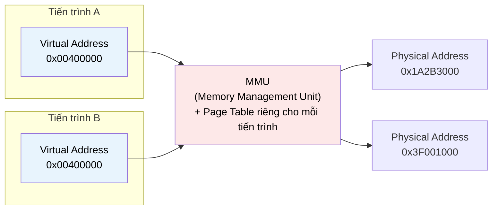

# MASTER COMPUTER SCIENCE HANDBOOK

## Volume 04 — Computer Systems
### Part II — Memory Systems
## Chương 2.5 — Bộ nhớ Ảo
### (Virtual Memory)

---

### Thông tin chương

| Trường | Giá trị |
|---|---|
| Chương | 2.5 |
| Thuộc Part | II — Memory Systems |
| Thuộc Volume | 04 — Computer Systems |
| Thời gian đọc ước tính | 50–60 phút |
| Độ khó | ★★★★☆ |
| Kiến thức tiên quyết | Chương 2.3 — Cache Memory (đặc biệt: Fully-Associative, Tag–Index–Offset); Chương 2.4 — Main Memory (địa chỉ vật lý là đích đến của quá trình dịch địa chỉ) |
| Chương liên quan | 2.6 — Paging and Segmentation (triển khai cụ thể của address translation); Volume 04, Part III — Operating Systems (page fault handling, swapping — thuộc phạm vi OS, chỉ giới thiệu khái niệm ở đây) |
| Từ khóa | virtual address, physical address, address space, address translation, page table, TLB, page fault, memory protection, isolation |

---

### Mục tiêu học tập

Sau khi hoàn thành chương này, người đọc có thể:

- Giải thích vì sao mỗi chương trình cần một **không gian địa chỉ ảo (virtual address space)** riêng biệt, thay vì truy cập trực tiếp vào địa chỉ vật lý.
- Trình bày khái niệm **Address Translation** — quá trình dịch địa chỉ ảo sang địa chỉ vật lý — ở mức nguyên lý.
- Giải thích vai trò của **TLB (Translation Lookaside Buffer)** như một cache chuyên biệt cho kết quả dịch địa chỉ, và liên hệ trực tiếp với cơ chế Fully-Associative đã học ở Chương 2.3.
- Trình bày khái niệm **Page Fault** ở mức nguyên lý (không đi sâu cơ chế xử lý của hệ điều hành — nội dung đó thuộc Volume 04, Part III).
- Giải thích hai lợi ích nền tảng mà bộ nhớ ảo mang lại: **cách ly (isolation)** và **bảo vệ (protection)** giữa các tiến trình.

---

### Câu hỏi khơi gợi

> *Khi hai chương trình cùng chạy trên máy tính của bạn, cả hai đều có thể dùng địa chỉ `0x0040000` để lưu một biến — không hề xung đột, không hề ghi đè lên nhau, dù về mặt vật lý, RAM của bạn chỉ có một dải địa chỉ duy nhất. Làm thế nào điều này có thể xảy ra? Và tại sao một chương trình bị lỗi ("Segmentation Fault") gần như không bao giờ có khả năng làm hỏng dữ liệu của chương trình khác đang chạy cùng lúc?*

---

## 1. Tổng quan chương

Từ Chương 2.1 đến 2.4, mọi địa chỉ được thảo luận đều là **địa chỉ vật lý (physical address)** — vị trí thực sự của dữ liệu trong RAM. Nhưng có một sự thật quan trọng chưa được nói ra: **chương trình không bao giờ trực tiếp thấy địa chỉ vật lý**. Mọi địa chỉ mà một chương trình sử dụng — con trỏ trong C, tham chiếu đối tượng trong Java, biến trong Python — đều là **địa chỉ ảo (virtual address)**, thuộc về một không gian địa chỉ tưởng tượng, hoàn toàn riêng biệt cho từng tiến trình (process).

Chương này giới thiệu **Bộ nhớ Ảo (Virtual Memory)** — có lẽ là phát minh mang tính "ảo thuật" nhất trong toàn bộ Part II: mỗi chương trình được tạo ảo giác rằng nó sở hữu toàn bộ không gian địa chỉ (ví dụ, toàn bộ dải $2^{64}$ địa chỉ có thể trên hệ 64-bit) cho riêng mình, trong khi thực tế nhiều chương trình đang chia sẻ cùng một lượng RAM vật lý hữu hạn. Cơ chế biến ảo giác này thành hiện thực — **Address Translation** — chính là nội dung trung tâm của chương, và sẽ được triển khai cụ thể hơn ở Chương 2.6 (Paging).

> **💡 Insight**
> Bộ nhớ ảo giải quyết cùng lúc ba vấn đề tưởng chừng không liên quan: (1) cho phép nhiều chương trình chạy đồng thời mà không cần biết về nhau, (2) bảo vệ chương trình này khỏi lỗi hoặc hành vi độc hại của chương trình khác, và (3) cho phép một chương trình sử dụng nhiều bộ nhớ hơn RAM vật lý thực có (thông qua swapping, sẽ học ở Volume 04, Part III). Một cơ chế duy nhất — gián tiếp hóa địa chỉ — giải quyết cả ba.

---

## 2. Bối cảnh lịch sử

| Thời điểm | Nhân vật / Sự kiện | Đóng góp |
|---|---|---|
| Cuối thập niên 1950 | Đại học Manchester, hệ thống Atlas | Một trong những hệ thống đầu tiên triển khai khái niệm bộ nhớ ảo thực tế, giải quyết bài toán chương trình cần nhiều bộ nhớ hơn RAM vật lý có sẵn thời bấy giờ |
| 1961–1962 | Nhóm nghiên cứu tại Manchester (Tom Kilburn và cộng sự) | Phát triển đầy đủ cơ chế **paging** (sẽ học chi tiết ở Chương 2.6) cho hệ thống Atlas — đặt nền móng thuật ngữ và kỹ thuật vẫn dùng đến ngày nay |
| Thập niên 1970 | Đa số hệ điều hành thời gian chia sẻ (time-sharing OS) | Bộ nhớ ảo trở thành tiêu chuẩn, không chỉ để "mở rộng" bộ nhớ mà chủ yếu để **cách ly các tiến trình** chạy đồng thời trên cùng một máy |
| 1980s–nay | Hầu như mọi CPU hiện đại | Tích hợp phần cứng chuyên dụng — **Memory Management Unit (MMU)** — để tăng tốc address translation, giảm gánh nặng cho phần mềm |

Điều thú vị về mặt lịch sử: động lực ban đầu cho bộ nhớ ảo là **mở rộng dung lượng** (cho phép chương trình lớn hơn RAM vật lý chạy được), nhưng động lực khiến nó trở thành tiêu chuẩn bắt buộc trong mọi hệ điều hành hiện đại lại là **cách ly và bảo mật** (Mục 12) — một sự dịch chuyển trọng tâm phản ánh đúng cách các hệ thống máy tính đã chuyển từ chạy một chương trình duy nhất sang chạy hàng trăm tiến trình đồng thời.

---

## 3. Động lực

Hãy hình dung hai chương trình A và B cùng chạy trên một máy tính, và cả hai đều được biên dịch với giả định rằng đoạn code chính của chúng bắt đầu tại địa chỉ `0x00400000` — một địa chỉ phổ biến do quy ước của trình liên kết (linker). Nếu không có bộ nhớ ảo, đây sẽ là một xung đột nghiêm trọng: cả hai chương trình không thể cùng tồn tại trong RAM vật lý, vì cả hai đều "đòi" cùng một địa chỉ.

Bộ nhớ ảo giải quyết vấn đề này bằng một lớp gián tiếp: địa chỉ `0x00400000` mà chương trình A sử dụng, và địa chỉ `0x00400000` mà chương trình B sử dụng, là hai địa chỉ **ảo**, mỗi cái được dịch (translate) sang một địa chỉ **vật lý** hoàn toàn khác nhau, tùy thuộc vào tiến trình nào đang thực thi. Chương trình A và B không hề biết — và không cần biết — về sự tồn tại của lớp dịch địa chỉ này; với mỗi chương trình, thế giới chỉ đơn giản là "tôi có toàn quyền với không gian địa chỉ của mình".

Đây cũng chính là lý do một lỗi con trỏ (dereference một con trỏ null hoặc con trỏ sai) trong chương trình A gây ra "Segmentation Fault" — thuật ngữ, không phải ngẫu nhiên, bắt nguồn trực tiếp từ cơ chế mà chương này sắp trình bày — mà **không** làm hỏng bộ nhớ của chương trình B đang chạy song song.

---

## 4. Trực giác

**Mô hình tinh thần (Mental Model) của chương này:**

> Bộ nhớ ảo giống như **hệ thống số phòng khách sạn**. Mỗi vị khách (chương trình) được cấp một "số phòng" riêng — ví dụ Phòng 101 — và trong nhận thức của họ, đó là con số duy nhất họ cần biết. Nhưng "Phòng 101" trên tấm chìa khóa của khách A và "Phòng 101" trên tấm chìa khóa của khách B (ở một khách sạn khác, hoặc một tầng khác) có thể trỏ đến hai căn phòng vật lý hoàn toàn khác nhau. **Lễ tân khách sạn (tương đương MMU)** là nơi duy nhất biết ánh xạ thực sự giữa "số phòng trên chìa khóa" và "vị trí vật lý của căn phòng" — khách không bao giờ tự mình đi tìm phòng dựa trên tọa độ vật lý của tòa nhà.

| Khái niệm Bộ nhớ ảo | Ẩn dụ khách sạn |
|---|---|
| **Virtual Address** | Số phòng trên chìa khóa mà khách nhìn thấy |
| **Physical Address** | Vị trí thực tế của căn phòng trong tòa nhà |
| **Address Translation** | Công việc của lễ tân: tra cứu số phòng → vị trí thực tế |
| **Page Table** | Sổ đăng ký của lễ tân, ghi lại toàn bộ ánh xạ số phòng ↔ vị trí |
| **Isolation** | Khách A không thể vô tình (hay cố ý) mở cửa phòng của khách B chỉ bằng cách "đoán số phòng", vì hệ thống ánh xạ của họ hoàn toàn độc lập |

---

## 5. Trực quan hóa khái niệm

**Hình 2.5.1 — Address Translation: Từ Virtual Address đến Physical Address**
*(Visual đặc trưng của chương — Chapter Identity)*



| Trường thông tin | Nội dung |
|---|---|
| Mục đích | Minh họa trực tiếp tình huống động lực ở Mục 3: cùng một địa chỉ ảo, hai tiến trình khác nhau, hai địa chỉ vật lý hoàn toàn tách biệt |
| Điểm mấu chốt | MMU tham chiếu một **Page Table khác nhau** cho mỗi tiến trình — đây chính là cơ sở kỹ thuật cho tính chất Isolation (Mục 12) |

---

**Hình 2.5.2 — Vị trí của TLB trong đường ống truy cập bộ nhớ**

```text
CPU phát Virtual Address
        │
        ▼
   ┌─────────┐   HIT (nhanh)
   │   TLB   │──────────────► Physical Address ──► Cache (Chương 2.3)
   └─────────┘
        │ MISS (chậm hơn — phải tra Page Table đầy đủ)
        ▼
   Page Table Walk (Chương 2.6)
        │
        ▼
   Physical Address ──► nạp lại kết quả vào TLB ──► Cache (Chương 2.3)
```

*Mục đích:* cho thấy TLB đóng vai trò "cache của quá trình dịch địa chỉ", nằm ngay trước cache dữ liệu thông thường trong đường ống truy cập bộ nhớ. *Điểm mấu chốt:* TLB miss không có nghĩa là dữ liệu không có trong cache — nó có nghĩa là **bản thân việc xác định địa chỉ vật lý** còn chưa xong, một bước hoàn toàn tách biệt với cache lookup ở Chương 2.3.

---

## 6. Định nghĩa hình thức

> **📌 Remember — Virtual Memory**
>
> **Bộ nhớ Ảo (Virtual Memory)** là một kỹ thuật trừu tượng hóa, trong đó mỗi tiến trình được cấp một **không gian địa chỉ ảo (virtual address space)** riêng biệt, độc lập với vị trí thực tế của dữ liệu trong bộ nhớ vật lý. Mọi địa chỉ mà chương trình sử dụng là **địa chỉ ảo (virtual address)**; chúng được **dịch (translate)** sang **địa chỉ vật lý (physical address)** trước khi thực sự truy cập RAM.
>
> - **Address Translation:** quá trình ánh xạ một địa chỉ ảo sang địa chỉ vật lý tương ứng, được thực hiện bởi phần cứng chuyên dụng gọi là **MMU (Memory Management Unit)**, dựa trên bảng ánh xạ do hệ điều hành quản lý gọi là **Page Table** (sẽ định nghĩa đầy đủ ở Chương 2.6).
> - **TLB (Translation Lookaside Buffer):** một cache tốc độ cao, chuyên biệt, lưu lại các kết quả dịch địa chỉ **gần đây nhất**, nhằm tránh phải tra cứu Page Table đầy đủ (một thao tác tốn nhiều lần truy cập bộ nhớ) cho mỗi lần truy cập.
> - **Page Fault:** tình huống xảy ra khi địa chỉ ảo được yêu cầu **không có ánh xạ vật lý hợp lệ hiện tại** (ví dụ: trang dữ liệu đã bị đưa ra bộ nhớ thứ cấp để nhường chỗ) — buộc hệ điều hành phải can thiệp để xử lý trước khi CPU có thể tiếp tục (cơ chế xử lý chi tiết thuộc phạm vi Volume 04, Part III).

---

## 7. Nền tảng toán học

### 7.1 TLB như một trường hợp áp dụng của AMAT

- **Ý nghĩa:** vì TLB về bản chất là một cache (Hình 2.5.2, Insight Mục 8), công thức AMAT đã học ở Chương 2.1 áp dụng trực tiếp, không cần công thức mới.

> **📦 Formula Box — Thời gian Truy cập Bộ nhớ có TLB**
>
> $$T_{effective} = T_{TLB} + m_{TLB} \times T_{page\_table\_walk}$$
>
> | Thành phần | Ý nghĩa |
> |---|---|
> | $T_{TLB}$ | Thời gian tra cứu TLB (rất nhanh — TLB thường nhỏ và Fully-Associative, xem Mục 8) |
> | $m_{TLB}$ | Tỷ lệ TLB miss |
> | $T_{page\_table\_walk}$ | Thời gian thực hiện tra cứu Page Table đầy đủ khi TLB miss — có thể tốn **nhiều lần truy cập bộ nhớ chính** (Chương 2.4), vì Page Table bản thân nó cũng nằm trong RAM |
> | **Diễn giải kỹ thuật** | Đây là cùng cấu trúc công thức với Formula Box Mục 7.1 (Chương 2.1) — TLB đóng đúng vai trò của "một tầng cache" trong công thức AMAT tổng quát, chỉ khác đối tượng nó cache (kết quả dịch địa chỉ, thay vì dữ liệu thực tế) |
> | **Ứng dụng thường gặp** | Giải thích vì sao chương trình truy cập bộ nhớ với mẫu hình phân tán rộng (ví dụ duyệt qua nhiều cấu trúc dữ liệu lớn, rải rác) có thể chậm hơn đáng kể — không chỉ vì cache miss (Chương 2.3) mà còn vì **TLB miss** xảy ra thường xuyên hơn |

**Điểm quan trọng cần lưu ý:** một truy cập bộ nhớ hoàn chỉnh trong thực tế phải trải qua **cả hai** tầng tra cứu — TLB (để có địa chỉ vật lý) rồi mới đến Cache (Chương 2.3, để lấy dữ liệu tại địa chỉ đó) — nghĩa là AMAT tổng thể của hệ thống thực tế kết hợp cả hai công thức đã học.

---

## 8. Thuật toán / Cơ chế

**Cơ chế truy cập bộ nhớ đầy đủ, tích hợp TLB và Cache**, tổng hợp lại toàn bộ Part II tính đến chương này:

```text
Bước 1 — CPU phát ra Virtual Address (VA)
        │
        ▼
Bước 2 — Tra cứu TLB với phần "Virtual Page Number" của VA
        │
        ├── TLB HIT ─────────────────────────┐
        │                                     ▼
        │                          Bước 3a — Lấy ngay Physical
        │                          Address tương ứng
        │
        └── TLB MISS
                 │
                 ▼
        Bước 3b — Thực hiện PAGE TABLE WALK: tra cứu
                  Page Table (nằm trong RAM, Chương 2.4)
                  để tìm ánh xạ Virtual → Physical
                 │
                 ├── Tìm thấy ánh xạ hợp lệ
                 │        │
                 │        ▼
                 │   Nạp kết quả vào TLB (cho lần sau)
                 │   → tiếp tục Bước 4
                 │
                 └── KHÔNG tìm thấy ánh xạ hợp lệ
                          │
                          ▼
                    PAGE FAULT — chuyển quyền xử lý cho
                    hệ điều hành (Volume 04, Part III)
        │
        ▼
Bước 4 — Với Physical Address đã có, thực hiện CACHE LOOKUP
         (chính xác theo cơ chế đã học ở Chương 2.3, Mục 8)
        │
        ▼
Bước 5 — Trả dữ liệu về cho CPU
```

> **💡 Insight**
> So sánh Bước 2 ở đây với Mục 8, Chương 2.3: TLB thường được thiết kế **Fully-Associative** (không phải Set-Associative như cache L1), vì số lượng entry của TLB rất nhỏ (thường 32–1536 entry, so với hàng chục nghìn dòng cache), khiến chi phí phần cứng của việc so sánh song song mọi entry (Mục 8, Chương 2.3) trở nên hoàn toàn khả thi. Đây là ứng dụng thực tế trực tiếp của Bảng 2.3.1 (Chương 2.3): khi số lượng phần tử đủ nhỏ, Fully-Associative không còn là lựa chọn "quá đắt".

---

## 9. Triển khai

```python
class SimpleTLB:
    """Mô phỏng TLB Fully-Associative đơn giản, dùng chính sách LRU,
    minh họa trực tiếp Formula Box Mục 7.1."""

    def __init__(self, num_entries, page_table, page_walk_cost):
        self.num_entries = num_entries
        self.page_table = page_table          # dict: virtual_page -> physical_page
        self.page_walk_cost = page_walk_cost  # chi phí khi TLB miss
        self.cache = {}                       # virtual_page -> physical_page (TLB entries)
        self.access_order = []                # theo dõi LRU
        self.hits = 0
        self.misses = 0

    def translate(self, virtual_page):
        if virtual_page in self.cache:
            self.hits += 1
            self.access_order.remove(virtual_page)
            self.access_order.append(virtual_page)
            return self.cache[virtual_page], 1   # TLB hit: chi phí 1 đơn vị

        self.misses += 1
        physical_page = self.page_table.get(virtual_page)  # Page Table Walk

        if len(self.cache) >= self.num_entries:
            oldest = self.access_order.pop(0)
            del self.cache[oldest]

        self.cache[virtual_page] = physical_page
        self.access_order.append(virtual_page)
        return physical_page, 1 + self.page_walk_cost        # TLB miss: chi phí bổ sung

    def hit_rate(self):
        total = self.hits + self.misses
        return self.hits / total if total else 0.0
```

Lớp `SimpleTLB` triển khai trực tiếp Bước 2–3 của Mục 8: `translate` kiểm tra `self.cache` (đóng vai trò TLB) trước, chỉ thực hiện "Page Table Walk" (tra cứu `self.page_table` đầy đủ) khi miss, và áp dụng LRU giống hệt nguyên lý đã dùng ở `SetAssociativeCache` (Chương 2.3, Mục 9) — một minh chứng cụ thể cho việc TLB và Cache, dù phục vụ mục đích khác nhau, chia sẻ chung một nền tảng cơ chế.

---

## 10. Trực quan hóa quá trình thực thi

**Thử nghiệm minh họa tác động của TLB miss**, dùng `SimpleTLB(num_entries=4, page_walk_cost=50)`:

```text
Kịch bản A — Truy cập tuần tự, chỉ 4 virtual page khác nhau, lặp lại 20 lần:
  TLB Hit Rate: 85%   (4 page vừa khít trong 4 entry — chỉ miss lần đầu mỗi page)
  Chi phí trung bình mỗi lần dịch địa chỉ: 1 + 0,15 × 50 ≈ 8,50 đơn vị

Kịch bản B — Truy cập rải rác trên 10 virtual page khác nhau (TLB chỉ có 4 entry):
  TLB Hit Rate: 25%   (liên tục "đá nhau ra" do vượt quá dung lượng TLB)
  Chi phí trung bình mỗi lần dịch địa chỉ: 1 + 0,75 × 50 ≈ 38,50 đơn vị
```

**Diễn giải kết quả:** chênh lệch chi phí trung bình giữa hai kịch bản là hơn 4,5 lần — hoàn toàn tương tự về mặt cấu trúc với ví dụ AMAT nhiều tầng ở Chương 2.1, Mục 10, nhưng lần này áp dụng cho **quá trình dịch địa chỉ**, chứ không phải cho việc lấy dữ liệu thực tế. Đây là lý do các chương trình xử lý dữ liệu rất lớn, rải rác trên nhiều vùng bộ nhớ khác nhau (ví dụ: duyệt đồ thị lớn với các node được cấp phát ngẫu nhiên khắp không gian địa chỉ) thường chịu chi phí "kép": vừa cache miss (Chương 2.3) vừa TLB miss (chương này) — hai loại chi phí độc lập nhưng cộng dồn.

---

## 11. Ứng dụng công nghiệp

> **🛠 Engineering Practice**
> Ý thức về TLB miss là một trong những kỹ thuật tối ưu hóa "bậc cao" mà kỹ sư hệ thống hiệu năng cao thường áp dụng, vượt ra ngoài tối ưu hóa cache thông thường.

| Bối cảnh công nghiệp | Vai trò của Virtual Memory / TLB |
|---|---|
| **Huge Pages** (Linux: `Transparent Huge Pages`) | Dùng kích thước trang (page size) lớn hơn nhiều lần so với mặc định (ví dụ 2 MB thay vì 4 KB) — mỗi entry TLB "bao phủ" nhiều dữ liệu hơn, giảm đáng kể TLB miss cho các ứng dụng xử lý dữ liệu lớn (cơ sở dữ liệu, máy ảo, workload AI) |
| **Container hóa (Docker, Kubernetes)** | Mỗi container thường chạy trong không gian địa chỉ ảo riêng biệt, tận dụng chính cơ chế Isolation đã học ở Mục 12, dù chia sẻ cùng nhân hệ điều hành |
| **Máy ảo (Virtual Machine)** | Thêm một tầng dịch địa chỉ nữa — Guest Virtual → Guest Physical → Host Physical — mở rộng trực tiếp mô hình ở Hình 2.5.1 cho một tầng trừu tượng hóa cao hơn |
| **Trình gỡ lỗi bộ nhớ (ASan — AddressSanitizer)** | Khai thác cơ chế bảo vệ bộ nhớ ảo để phát hiện lỗi truy cập bộ nhớ trái phép (buffer overflow, use-after-free) ngay khi chúng xảy ra, thay vì để chương trình âm thầm ghi đè dữ liệu sai |

---

## 12. Góc nhìn nghiên cứu

> **🔬 Research Connection**
> Bộ nhớ ảo, dù đã xuất hiện từ những năm 1960, vẫn là chủ đề nghiên cứu tích cực khi khối lượng dữ liệu và số lượng tiến trình đồng thời trên một máy tăng vọt trong kỷ nguyên cloud computing và AI.

Hai lợi ích nền tảng của bộ nhớ ảo — **Isolation** (mỗi tiến trình không thể vô tình truy cập bộ nhớ của tiến trình khác) và **Protection** (hệ điều hành có thể đánh dấu từng vùng bộ nhớ là chỉ-đọc, thực-thi-được, hay không-thể-truy-cập) — là nền tảng của gần như mọi cơ chế bảo mật hệ thống hiện đại, từ sandbox trình duyệt đến container hóa. Hướng nghiên cứu hiện tại tập trung vào: **giảm chi phí Address Translation cho workload AI/GPU** — nơi lượng dữ liệu khổng lồ (tham số mô hình, kích hoạt trung gian) khiến TLB miss trở thành một nút thắt cổ chai đáng kể, thúc đẩy các thiết kế TLB chuyên dụng và page size linh hoạt hơn; và **bộ nhớ ảo cho hệ thống phân tán (Distributed Shared Memory)** — mở rộng khái niệm "một không gian địa chỉ thống nhất" ra ngoài phạm vi một máy tính đơn lẻ, sang toàn bộ một cụm máy chủ (liên hệ Volume 04, Part VI).

**Câu hỏi mở** để suy ngẫm: bộ nhớ ảo dựa trên tiền đề rằng "gián tiếp hóa địa chỉ" là gần như miễn phí về mặt hiệu năng nhờ TLB (giống như cache gần như miễn phí nhờ Locality, Chương 2.1). Với các workload AI hiện đại, nơi lượng bộ nhớ truy cập có thể lên tới hàng trăm GB và mẫu truy cập không có locality mạnh, liệu tiền đề "gián tiếp hóa gần như miễn phí" này có còn đúng, hay bộ nhớ ảo truyền thống cần được thiết kế lại cho một lớp workload hoàn toàn khác với những gì nó được thiết kế ban đầu vào thập niên 1960?

---

## 13. Ưu điểm

- **Cách ly hoàn toàn giữa các tiến trình** — lỗi hoặc hành vi độc hại của một chương trình không thể (trong điều kiện bình thường) làm hỏng bộ nhớ của chương trình khác.
- **Đơn giản hóa mô hình lập trình** — mỗi chương trình được viết như thể nó sở hữu toàn bộ không gian địa chỉ, không cần quan tâm những chương trình nào khác đang chạy cùng lúc, hay chúng chiếm vùng RAM vật lý nào.
- **Cho phép chạy chương trình lớn hơn RAM vật lý** — thông qua cơ chế swapping (Volume 04, Part III), dù đây không còn là động lực chính trong kỷ nguyên RAM giá rẻ, dung lượng lớn.
- **Nền tảng cho bảo mật hệ thống hiện đại** — từ sandbox đến container hóa, hầu hết đều dựa trên chính cơ chế Isolation đã học trong chương này.

---

## 14. Hạn chế

> **⚠️ Common Mistake**
> Một ngộ nhận phổ biến: cho rằng bộ nhớ ảo "miễn phí hoàn toàn" về mặt hiệu năng nhờ TLB. Thực tế, TLB miss (Mục 10) có thể gây ra chi phí đáng kể — đặc biệt với workload có mẫu truy cập phân tán rộng trên không gian địa chỉ, một vấn đề độc lập với cache miss đã học ở Chương 2.3.

- **Address Translation luôn tốn ít nhất một bước bổ sung** so với việc truy cập trực tiếp địa chỉ vật lý — dù TLB giảm thiểu chi phí này rất nhiều trong đa số trường hợp.
- **TLB có dung lượng còn nhỏ hơn cache L1** (thường 32–1536 entry) — khiến nó dễ bị "quá tải" hơn cache dữ liệu thông thường, đặc biệt với workload truy cập nhiều vùng bộ nhớ khác nhau.
- **Page Fault đòi hỏi sự can thiệp của hệ điều hành**, một hoạt động tốn kém hơn rất nhiều (có thể hàng triệu chu kỳ, khi liên quan đến truy cập ổ đĩa) so với bất kỳ loại miss nào đã học trước đó trong Part II — chi tiết đầy đủ thuộc phạm vi Volume 04, Part III.
- **Thêm một tầng phức tạp cho debug hiệu năng** — một chương trình chậm có thể do cache miss (Chương 2.3), Row Miss (Chương 2.4), TLB miss (chương này), hoặc kết hợp cả ba, đòi hỏi công cụ profiling chuyên dụng để phân biệt chính xác.

---

## 15. So sánh

**Bảng 2.5.1 — TLB so với Cache dữ liệu thông thường (Chương 2.3)**

| Tiêu chí | TLB | Cache dữ liệu (L1/L2/L3) |
|---|---|---|
| Đối tượng được cache | Kết quả Address Translation (Virtual → Physical) | Dữ liệu thực tế tại một địa chỉ |
| Chiến lược mapping phổ biến | Fully-Associative (do dung lượng rất nhỏ) | Set-Associative (cân bằng tốc độ–chi phí) |
| Hậu quả khi miss | Phải thực hiện Page Table Walk (truy cập RAM nhiều lần) | Phải truy cập tầng bộ nhớ thấp hơn (Chương 2.1, Mục 7.2) |
| Vị trí trong đường ống truy cập | Trước cache dữ liệu (Hình 2.5.2) | Sau khi đã có địa chỉ vật lý |
| Áp dụng công thức AMAT? | Có (Mục 7.1) | Có (Chương 2.1, Mục 7.1) |

**Phân tích:** bảng trên củng cố một thông điệp xuyên suốt chương này: **TLB không phải một cơ chế hoàn toàn mới**, mà là một ứng dụng cụ thể của những nguyên lý đã học đầy đủ ở Chương 2.1 và 2.3 (AMAT, Fully-Associative, LRU), chỉ khác ở đối tượng được lưu trữ. Đây là một minh chứng mạnh mẽ cho nguyên tắc **Concept Reuse** đã nêu trong triết lý thiết kế của toàn bộ Handbook (`UIT_MASTER_CURRICULUM.md`, Mục 3): hiểu sâu một cơ chế nền tảng (cache) cho phép người học nhanh chóng nắm bắt một cơ chế mới (TLB) mà không cần học lại từ đầu.

---

## 16. Tóm tắt

- **Bộ nhớ Ảo** cấp cho mỗi tiến trình một không gian địa chỉ ảo riêng biệt, độc lập với vị trí vật lý thực tế của dữ liệu — giải quyết đồng thời bài toán cách ly, bảo vệ, và mở rộng dung lượng.
- **Address Translation**, thực hiện bởi **MMU**, dịch địa chỉ ảo sang địa chỉ vật lý dựa trên **Page Table** — cơ chế cụ thể sẽ được trình bày đầy đủ ở Chương 2.6.
- **TLB** là một cache chuyên biệt cho kết quả dịch địa chỉ, thường thiết kế Fully-Associative do dung lượng nhỏ; TLB miss dẫn đến **Page Table Walk**, tốn chi phí truy cập RAM đáng kể (Formula Box Mục 7.1, tái sử dụng trực tiếp cấu trúc AMAT từ Chương 2.1).
- **Page Fault** xảy ra khi không có ánh xạ vật lý hợp lệ cho một địa chỉ ảo — cần sự can thiệp của hệ điều hành, chi tiết thuộc Volume 04, Part III.
- Hai lợi ích cốt lõi — **Isolation** và **Protection** — là nền tảng cho hầu hết cơ chế bảo mật hệ thống hiện đại, từ container hóa đến sandbox trình duyệt.

Chương 2.6 (Paging and Segmentation) sẽ trình bày chi tiết **cách Page Table thực sự được tổ chức và tra cứu** — bao gồm cấu trúc multi-level page table giải quyết bài toán "Page Table cho không gian địa chỉ 64-bit sẽ lớn đến mức nào nếu tổ chức ngây thơ" — cùng với việc so sánh Paging với chiến lược thay thế: Segmentation.

---

## 17. Bài tập

### Mức Cơ bản (Basic)

1. Giải thích bằng lời của riêng bạn: vì sao hai chương trình khác nhau có thể cùng sử dụng địa chỉ ảo `0x00400000` mà không xảy ra xung đột.
2. Liệt kê ba lợi ích chính mà bộ nhớ ảo mang lại, theo thứ tự bạn cho là quan trọng nhất trong bối cảnh máy tính hiện đại — giải thích ngắn gọn lựa chọn của bạn.

### Mức Trung bình (Intermediate)

3. Dùng lớp `SimpleTLB` ở Mục 9, mô phỏng một chuỗi truy cập luân phiên giữa 6 virtual page khác nhau (`page_table` tùy chọn), với `num_entries=4`. Tính TLB hit rate và so sánh với trường hợp `num_entries=8` (đủ chứa toàn bộ 6 page). Giải thích chênh lệch dựa trên nguyên lý đã học ở Chương 2.3 (Capacity Miss).
4. Một hệ thống có TLB hit rate 96%, chi phí Page Table Walk khi miss là 80 đơn vị thời gian, chi phí TLB hit là 1 đơn vị. Tính thời gian dịch địa chỉ trung bình theo Formula Box Mục 7.1. Nếu chuyển sang dùng Huge Page (Mục 11) và TLB hit rate tăng lên 99,5%, thời gian trung bình mới là bao nhiêu? Tính phần trăm cải thiện.

### Mức Nâng cao (Advanced)

5. Giải thích tại sao TLB thường được thiết kế Fully-Associative, trong khi cache dữ liệu L1 (Chương 2.3) thường được thiết kế Set-Associative, dù cả hai đều là cache tốc độ cao nằm gần CPU. *(Gợi ý: so sánh trực tiếp số lượng entry điển hình của mỗi loại, liên hệ Bảng 2.3.1, Chương 2.3.)*

### Mức Nghiên cứu (Research)

6. Đọc thêm về **Huge Pages** (Mục 11). Giải thích, dựa trên Formula Box Mục 7.1, chính xác cơ chế nào khiến Huge Page giảm TLB miss: có phải vì TLB "chứa được nhiều dữ liệu hơn" theo nghĩa tuyệt đối, hay vì mỗi entry TLB giờ đây "bao phủ" một vùng địa chỉ lớn hơn? Đây là hai cách giải thích khác nhau — hãy phân biệt rõ.

---

## 18. Dự án nhỏ

**Không áp dụng dự án độc lập cho chương này.**

Chương 2.5 xây dựng nền tảng khái niệm cho Address Translation, TLB, và Page Fault — các thành phần này sẽ được tích hợp đầy đủ vào một dự án mô phỏng hoàn chỉnh ở Chương 2.6 (Paging and Segmentation), nơi Page Table thực sự được xây dựng và tra cứu, thay vì được giả định có sẵn như trong lớp `SimpleTLB` ở Mục 9.

---

## 19. Tự đánh giá

- [ ] Tôi có thể giải thích, không cần nhìn lại tài liệu, vì sao hai chương trình khác nhau có thể dùng cùng một địa chỉ ảo mà không xung đột.
- [ ] Tôi hiểu vai trò của MMU và Page Table trong quá trình Address Translation, ở mức nguyên lý (chưa cần biết chi tiết cấu trúc Page Table — đó là nội dung Chương 2.6).
- [ ] Tôi có thể giải thích tại sao TLB được xem là "một dạng cache", và chỉ ra điểm giống/khác cụ thể so với cache dữ liệu đã học ở Chương 2.3.
- [ ] Tôi hiểu Page Fault là gì ở mức khái niệm, và tại sao nó tốn kém hơn nhiều so với TLB miss hay cache miss.
- [ ] Tôi có thể liên hệ Isolation và Protection với ít nhất một ứng dụng thực tế cụ thể (ví dụ container hóa, sandbox).

Nếu Bài tập 4 hoặc 5 còn khó, nên xem lại Mục 7.1 (Formula Box) và Bảng 2.5.1 một lần nữa — mối liên hệ giữa TLB và cache dữ liệu là nền tảng quan trọng để hiểu Chương 2.6, nơi cơ chế Page Table được trình bày đầy đủ.

---

## 20. Đọc thêm

- **Sách (đã có trong BOOKS.md):** Randal E. Bryant, David R. O'Hallaron, *Computer Systems: A Programmer's Perspective* — chương "Virtual Memory", trình bày đầy đủ và trực quan cơ chế address translation dùng làm nền tảng cho chương này.
- **Sách:** Andrew S. Tanenbaum, *Modern Operating Systems* — chương Memory Management, góc nhìn bổ sung từ phía hệ điều hành, đặc biệt hữu ích để chuẩn bị cho Volume 04, Part III.
- **Chủ đề mở rộng (không bắt buộc):** tìm đọc tài liệu kỹ thuật về **Transparent Huge Pages** trên Linux — một ví dụ thực tế đầy đủ cho ứng dụng công nghiệp đã nêu ở Mục 11.
- **Chương tiếp theo:** Chương 2.6 — Paging and Segmentation.

---

### Liên kết chương (Cross References)

- **Chương trước:** 2.3 — Cache Memory (TLB tái sử dụng trực tiếp cơ chế Fully-Associative và LRU đã học); 2.4 — Main Memory (địa chỉ vật lý là đích đến của Address Translation; Page Table Walk bản thân cũng là các lần truy cập DRAM).
- **Chương tiếp theo:** 2.6 — Paging and Segmentation (triển khai cụ thể, đầy đủ của Page Table mới được giới thiệu ở mức nguyên lý tại chương này).
- **Chương liên quan xa hơn:** Volume 04, Part III — Operating Systems (Page Fault Handling, Swapping — phần "hậu trường" của cơ chế đã giới thiệu ở Mục 6); Volume 04, Part VII — Cloud Computing (Virtualization tái sử dụng mô hình Address Translation cho một tầng trừu tượng hóa cao hơn, Mục 11).
- **Vị trí trong Knowledge Graph:** Chương thứ năm của Volume 04, Part II — bản lề quan trọng chuyển Part II từ các cơ chế "vật lý thuần túy" (thanh ghi, cache, DRAM) sang các cơ chế "trừu tượng hóa phần mềm–phần cứng phối hợp" (bộ nhớ ảo, phân trang) sẽ chi phối phần còn lại của Part.

---

*Hết Chương 2.5. Chương này tuân thủ đầy đủ cấu trúc 20 mục của `OUTPUT.md` và chuẩn Presentation Layer của `WRITING_STANDARD.md`, tiếp nối trực tiếp các Chương 2.1–2.4 trong Volume 04, Part II. Theo đúng phạm vi đã xác định ở `VOLUME_04_COMPUTER_SYSTEMS.md` (Chương 2.5 chỉ giới thiệu khái niệm Virtual Memory ở mức nguyên lý, chưa đi sâu cơ chế OS), nội dung xử lý Page Fault chi tiết được để dành cho Volume 04, Part III — Operating Systems, tránh trùng lặp phạm vi giữa hai Part. Các số liệu TLB hit rate ở Mục 10 mang tính minh họa (illustrative). Đang chờ rà soát trước khi tiếp tục sang Chương 2.6 — Paging and Segmentation.*
