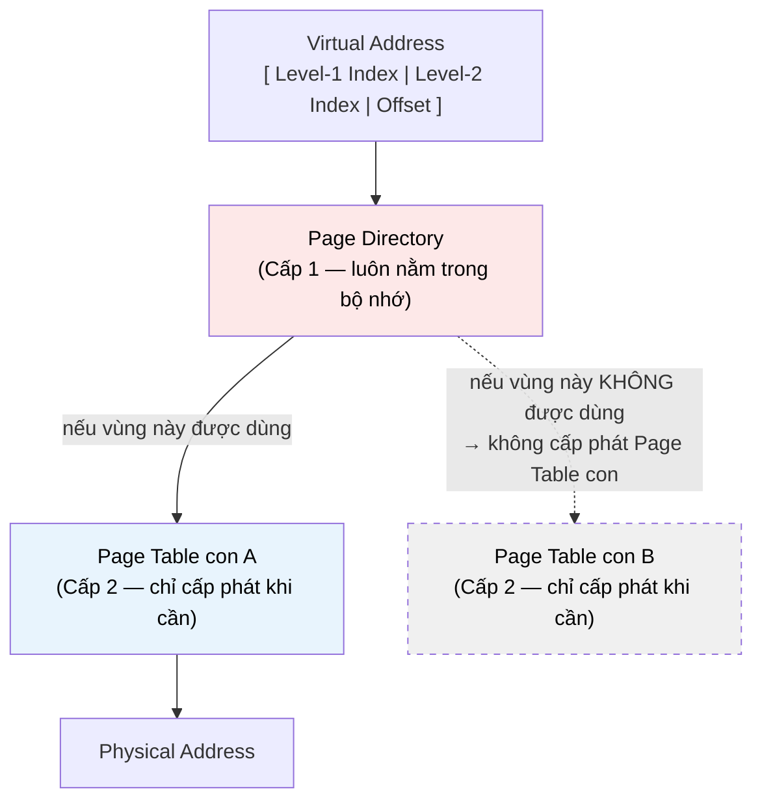

# MASTER COMPUTER SCIENCE HANDBOOK

## Volume 04 — Computer Systems
### Part II — Memory Systems
## Chương 2.6 — Phân trang và Phân đoạn
### (Paging and Segmentation)

---

### Thông tin chương

| Trường | Giá trị |
|---|---|
| Chương | 2.6 |
| Thuộc Part | II — Memory Systems |
| Thuộc Volume | 04 — Computer Systems |
| Thời gian đọc ước tính | 55–65 phút |
| Độ khó | ★★★★☆ |
| Kiến thức tiên quyết | Chương 2.5 — Virtual Memory (Address Translation, MMU, TLB, Page Fault ở mức nguyên lý) |
| Chương liên quan | 2.7 — Memory Allocation (heap được cấp phát trên nền một hoặc nhiều trang đã học ở đây); Volume 04, Part III — Operating Systems (Page Fault Handling, Swapping — triển khai đầy đủ) |
| Từ khóa | page, page table, page table entry, multi-level page table, page size, internal fragmentation, segment, segmentation fault, external fragmentation |

---

### Mục tiêu học tập

Sau khi hoàn thành chương này, người đọc có thể:

- Giải thích cấu trúc một **Page Table Entry (PTE)** và cách nó lưu thông tin ánh xạ cùng các bit điều khiển (valid, permission, dirty).
- Tính toán kích thước của một Page Table đơn cấp (single-level) cho một không gian địa chỉ cho trước, và giải thích vì sao thiết kế này không khả thi ở quy mô 64-bit.
- Trình bày cơ chế **Multi-Level Page Table** như giải pháp cho bài toán trên, cùng chi phí đánh đổi (nhiều lần truy cập bộ nhớ hơn khi TLB miss).
- Định nghĩa **Segmentation** như một chiến lược quản lý không gian địa chỉ thay thế, và giải thích nguồn gốc thuật ngữ "Segmentation Fault".
- So sánh có hệ thống Paging và Segmentation, cùng lý do các hệ điều hành hiện đại chủ yếu dùng Paging hoặc mô hình lai (Paged Segmentation).

---

### Câu hỏi khơi gợi

> *Chương 2.5 giới thiệu Page Table như "một cuốn sổ ánh xạ" mà MMU tra cứu. Nhưng trên một hệ thống 64-bit, số lượng địa chỉ ảo có thể có là $2^{64}$ — một con số khổng lồ. Nếu Page Table phải có một mục (entry) cho mỗi trang trong toàn bộ không gian địa chỉ đó, bản thân cuốn sổ này sẽ lớn đến mức nào? Và tại sao thuật ngữ lỗi runtime phổ biến nhất trong C/C++ — "Segmentation Fault" — lại không hề nhắc đến từ "trang" (page) dù chương trước vừa học xong về Paging?*

---

## 1. Tổng quan chương

Chương 2.5 dừng lại ở mức nguyên lý: bộ nhớ ảo cần một "Page Table" để MMU tra cứu, nhưng chưa giải thích Page Table thực sự được xây dựng và tổ chức ra sao. Chương này lấp đầy khoảng trống đó bằng hai câu trả lời cụ thể cho cùng một câu hỏi — "làm sao quản lý ánh xạ không gian địa chỉ ảo một cách hiệu quả?" — **Paging** và **Segmentation**.

Hai chiến lược này đại diện cho hai triết lý thiết kế khác nhau: Paging chia không gian địa chỉ thành các khối có **kích thước cố định** (trang, page), trong khi Segmentation chia thành các khối có **kích thước biến đổi**, phản ánh cấu trúc logic thực sự của chương trình (đoạn code, đoạn dữ liệu, đoạn stack). Phần lớn hệ điều hành hiện đại nghiêng hẳn về Paging — và hiểu tại sao là một bài học quan trọng về cách các đánh đổi kỹ thuật (kích thước cố định so với linh hoạt) định hình toàn bộ hướng đi của một lĩnh vực trong suốt hàng thập kỷ.

> **💡 Insight**
> Thuật ngữ "Segmentation Fault" mà bạn gặp khi chương trình C/C++ truy cập bộ nhớ trái phép, thực chất bắt nguồn từ các hệ thống dùng Segmentation thuần túy (Mục 11) — nơi mỗi "segment" tương ứng với một vùng logic của chương trình, và lỗi xảy ra khi truy cập vượt ra ngoài ranh giới hợp lệ của một segment. Dù hầu hết hệ thống hiện đại đã chuyển sang Paging, cái tên lịch sử này vẫn được giữ lại — một minh chứng thú vị cho việc thuật ngữ kỹ thuật đôi khi "sống lâu hơn" chính công nghệ đã sinh ra nó.

---

## 2. Bối cảnh lịch sử

| Thời điểm | Nhân vật / Sự kiện | Đóng góp |
|---|---|---|
| 1961–1962 | Hệ thống Atlas (đã gặp ở Chương 2.5) | Triển khai Paging thực tế đầu tiên, với kích thước trang cố định 512 từ |
| Giữa thập niên 1960 | Hệ thống Burroughs B5000 | Triển khai Segmentation thực tế sớm, phản ánh trực tiếp cấu trúc chương trình (mỗi thủ tục, mỗi mảng dữ liệu là một segment riêng) |
| 1972 | Đa số hệ điều hành thời gian chia sẻ (Multics) | Kết hợp cả hai — **Paged Segmentation**: mỗi segment lại được chia nhỏ thành các page — cố gắng lấy ưu điểm của cả hai chiến lược |
| Thập niên 1980–nay | Hầu hết hệ điều hành hiện đại (Unix, Linux, Windows) | Nghiêng hẳn về Paging thuần túy (đôi khi giữ lại một số khái niệm segment ở mức tối thiểu, ví dụ x86 protected mode), vì lý do sẽ phân tích ở Mục 15 |

Điểm đáng chú ý: kiến trúc x86 (32-bit) từng hỗ trợ đầy đủ cả Segmentation và Paging cùng lúc — một di sản lịch sử từ giai đoạn Segmentation còn phổ biến — nhưng hầu hết hệ điều hành hiện đại (bao gồm Linux) chọn cách "vô hiệu hóa" Segmentation bằng cách cấu hình mọi segment trỏ đến toàn bộ không gian địa chỉ, thực chất chỉ dùng Paging. Kiến trúc x86-64 sau này loại bỏ phần lớn hỗ trợ Segmentation, phản ánh đúng xu hướng hội tụ về Paging của toàn ngành.

---

## 3. Động lực

**Bài toán 1 — Kích thước Page Table:** Xét một hệ thống 32-bit đơn giản (không gian địa chỉ ảo $2^{32}$ byte = 4 GB), kích thước trang 4 KB. Số trang cần quản lý là $2^{32} / 2^{12} = 2^{20}$ (khoảng 1 triệu trang). Nếu mỗi Page Table Entry (PTE) chiếm 4 byte, một Page Table đơn cấp (single-level) cho **một tiến trình duy nhất** đã cần $2^{20} \times 4 = 4$ MB. Với hệ thống 64-bit, con số này trở nên phi thực tế: không gian địa chỉ $2^{64}$ byte với trang 4 KB cho ra $2^{52}$ trang — một Page Table đơn cấp sẽ cần hàng nghìn tỷ byte, vượt xa tổng dung lượng RAM của bất kỳ máy tính thực tế nào, **chỉ để lưu bảng ánh xạ cho một tiến trình duy nhất**.

**Bài toán 2 — Cấu trúc logic của chương trình không đồng nhất:** Một chương trình thực tế có nhiều vùng dữ liệu với kích thước rất khác nhau và tính chất khác nhau — đoạn code (thường cố định, chỉ đọc và thực thi), đoạn dữ liệu toàn cục, heap (tăng trưởng động), stack (tăng trưởng động theo hướng ngược lại). Nếu chia không gian địa chỉ thành các khối kích thước cố định (page) một cách "mù quáng", thông tin về ranh giới logic này bị mất đi — trong khi nếu tổ chức theo đúng cấu trúc logic (segment), việc cấp quyền truy cập (ví dụ: đoạn code chỉ-đọc-thực-thi, đoạn dữ liệu đọc-ghi) trở nên tự nhiên hơn nhiều.

Hai bài toán trên — không thể lưu trữ Page Table đơn cấp một cách khả thi, và mong muốn phản ánh cấu trúc logic của chương trình — chính là động lực dẫn đến hai giải pháp sẽ trình bày trong chương: **Multi-Level Page Table** (giải quyết Bài toán 1) và **Segmentation** (giải quyết Bài toán 2, dù với đánh đổi riêng).

---

## 4. Trực giác

**Mô hình tinh thần (Mental Model) của chương này:**

> **Paging** giống như một **cuốn sách được đóng thành các trang có kích thước bằng nhau tuyệt đối** — dù nội dung một chương dài hay ngắn, sách vẫn được chia thành các trang 4 KB đều tăm tắp, và một cuốn "mục lục nhiều cấp" (Multi-Level Page Table) được dùng để nhanh chóng tìm ra trang cần thiết mà không cần một mục lục khổng lồ, phẳng, liệt kê toàn bộ hàng nghìn tỷ trang có thể có.
>
> **Segmentation** giống như một **tủ hồ sơ được chia theo chủ đề thực tế**: ngăn "Hợp đồng" có thể dày 200 trang, ngăn "Hóa đơn" chỉ 10 trang — kích thước phản ánh đúng nội dung logic, không bị ép về một khuôn khổ cố định. Nhưng khi cần thêm một ngăn mới, hoặc một ngăn cần "phình to" thêm, việc sắp xếp lại tủ hồ sơ (tránh chồng lấp giữa các ngăn có kích thước khác nhau) phức tạp hơn nhiều so với việc đơn giản thêm một trang mới vào cuốn sách.

| Khái niệm | Paging | Segmentation |
|---|---|---|
| Đơn vị quản lý | Page — kích thước **cố định** | Segment — kích thước **biến đổi**, theo logic chương trình |
| Phản ánh cấu trúc chương trình? | Không trực tiếp | Có — mỗi segment tương ứng một vùng logic (code, data, stack...) |
| Rủi ro lãng phí bộ nhớ | **Internal Fragmentation** (Mục 12) — phần cuối một page không dùng hết | **External Fragmentation** (Mục 14) — khoảng trống nhỏ, rải rác giữa các segment |

---

## 5. Trực quan hóa khái niệm

**Hình 2.6.1 — Multi-Level Page Table (2 cấp) — Vượt qua bài toán "Page Table khổng lồ"**
*(Visual đặc trưng của chương — Chapter Identity)*



| Trường thông tin | Nội dung |
|---|---|
| Mục đích | Cho thấy trực quan vì sao Multi-Level Page Table giải quyết được Bài toán 1 ở Mục 3: phần lớn không gian địa chỉ ảo của một chương trình thực tế **không hề được sử dụng**, nên các Page Table con tương ứng với vùng không dùng đơn giản là không tồn tại — không tốn bộ nhớ |
| Điểm mấu chốt | Đây là sự đánh đổi thời gian lấy không gian: tra cứu địa chỉ giờ cần nhiều bước hơn (đi qua từng cấp), nhưng tổng dung lượng Page Table chỉ tỷ lệ với **phần không gian địa chỉ thực sự được dùng**, không phải toàn bộ không gian địa chỉ lý thuyết |

---

**Hình 2.6.2 — Segmentation: Không gian địa chỉ chia theo logic chương trình**

```text
Không gian địa chỉ ảo của một tiến trình:

  ┌───────────────┐  0x00000000
  │  Segment CODE │  (chỉ đọc, thực thi được)
  ├───────────────┤
  │  Segment DATA │  (đọc/ghi, kích thước cố định khi biên dịch)
  ├───────────────┤
  │  Segment HEAP │  (đọc/ghi, TĂNG TRƯỞNG hướng lên)
  │       ↓ (tăng) │
  │               │
  │   (khoảng      │
  │    trống)      │
  │               │
  │       ↑ (tăng) │
  │ Segment STACK │  (đọc/ghi, TĂNG TRƯỞNG hướng xuống)
  └───────────────┘  Địa chỉ ảo cao nhất
```

*Mục đích:* minh họa trực quan cách Segmentation phản ánh trực tiếp cấu trúc logic chương trình — mỗi khối trong hình có ranh giới rõ ràng gắn với vai trò cụ thể, khác hẳn với việc chia đều thành các page 4 KB không phân biệt. *Điểm mấu chốt:* khoảng trống giữa Heap và Stack cho phép cả hai tăng trưởng độc lập mà không cần biết trước kích thước tối đa của nhau — một thiết kế sẽ được nhắc lại khi học về Memory Allocation ở Chương 2.7.

---

## 6. Định nghĩa hình thức

> **📌 Remember — Page và Page Table Entry**
>
> Một **Page (Trang)** là một khối có kích thước cố định (thường 4 KB trên nhiều kiến trúc phổ biến) trong cả không gian địa chỉ ảo và không gian địa chỉ vật lý — khối tương ứng trong không gian vật lý được gọi là **Page Frame**.
>
> Mỗi **Page Table Entry (PTE)** — một dòng trong Page Table — thường chứa:
> - **Physical Frame Number:** số hiệu page frame vật lý tương ứng.
> - **Valid Bit:** ánh xạ này có đang hợp lệ (đã được cấp phát) hay không — nếu không, truy cập gây ra Page Fault (Chương 2.5).
> - **Permission Bits:** quyền truy cập (đọc, ghi, thực thi) — cơ sở kỹ thuật cho tính chất Protection đã học ở Chương 2.5.
> - **Dirty Bit:** trang này đã bị ghi (sửa đổi) kể từ lần nạp gần nhất hay chưa — thông tin quan trọng cho cơ chế swapping (Volume 04, Part III).
>
> **Multi-Level Page Table** tổ chức Page Table thành nhiều cấp phân cấp (Hình 2.6.1), trong đó chỉ những nhánh **thực sự được sử dụng** mới được cấp phát bộ nhớ, giải quyết trực tiếp Bài toán 1 ở Mục 3.

> **📌 Remember — Segment**
>
> Một **Segment (Phân đoạn)** là một vùng liên tục trong không gian địa chỉ ảo, có **kích thước biến đổi**, tương ứng với một đơn vị logic của chương trình (ví dụ: code, data, stack — Hình 2.6.2). Mỗi segment được mô tả bằng một **Segment Descriptor**, gồm: địa chỉ cơ sở (base), độ dài (limit), và quyền truy cập. Một truy cập vượt ra ngoài giới hạn `limit` của segment tương ứng là nguồn gốc của thuật ngữ **Segmentation Fault**.

---

## 7. Nền tảng toán học

### 7.1 Kích thước Page Table Đơn cấp

- **Ý nghĩa:** công thức này định lượng chính xác Bài toán 1 đã nêu ở Mục 3, cho thấy vì sao thiết kế đơn cấp không khả thi ở quy mô 64-bit.

> **📦 Formula Box — Kích thước Page Table Đơn cấp**
>
> $$\text{Số Entry cần thiết} = \dfrac{\text{Kích thước không gian địa chỉ ảo}}{\text{Kích thước một Page}}$$
> $$\text{Kích thước Page Table} = \text{Số Entry} \times \text{Kích thước mỗi PTE}$$
>
> | Thành phần | Ý nghĩa |
> |---|---|
> | Kích thước không gian địa chỉ ảo | $2^{n}$ với $n$ là số bit địa chỉ (ví dụ $2^{32}$ hoặc $2^{64}$) |
> | Kích thước một Page | Thường $2^{12}$ byte (4 KB) trên nhiều kiến trúc phổ biến |
> | **Diễn giải kỹ thuật** | Số entry tăng theo hàm mũ với số bit địa chỉ, trong khi kích thước mỗi PTE gần như không đổi — giải thích tại sao bước nhảy từ 32-bit lên 64-bit không chỉ "tăng gấp đôi" độ khó, mà tăng theo cấp số nhân khủng khiếp ($2^{32}$ lần nhiều hơn) |
> | **Ứng dụng thường gặp** | Biện minh định lượng cho việc mọi hệ điều hành 64-bit hiện đại đều bắt buộc phải dùng Multi-Level Page Table, không có ngoại lệ |

**Kiểm chứng bằng tay** (đã thực hiện ở Mục 3): hệ 32-bit, page 4 KB → 4 MB Page Table cho một tiến trình. Với hệ 64-bit, cùng công thức cho ra một con số không thể lưu trữ trong bất kỳ hệ thống thực tế nào — minh chứng toán học trực tiếp cho động lực dẫn đến Hình 2.6.1.

### 7.2 Chi phí Multi-Level Page Table Walk

> **📦 Formula Box — Số lần Truy cập Bộ nhớ khi TLB Miss (Multi-Level)**
>
> $$\text{Số lần truy cập RAM cho một Page Table Walk} = L$$
>
> với $L$ là số cấp của Page Table (ví dụ x86-64 hiện đại thường dùng $L=4$ hoặc $L=5$ cấp).
>
> | Thành phần | Ý nghĩa |
> |---|---|
> | $L$ | Mỗi cấp yêu cầu một lần truy cập RAM riêng biệt (đi từ cấp cao nhất xuống cấp thấp nhất) trước khi có được địa chỉ vật lý cuối cùng |
> | **Diễn giải kỹ thuật** | Đây chính là con số $T_{page\_table\_walk}$ đã xuất hiện như một "hộp đen" trong Formula Box Mục 7.1, Chương 2.5 — giờ được định lượng cụ thể: với $L=4$, một TLB miss có thể tốn tới 4 lần truy cập RAM đầy đủ (mỗi lần theo đúng AMAT của DRAM, Chương 2.4) trước khi CPU thậm chí có được dữ liệu thực sự cần |
> | **Ứng dụng thường gặp** | Giải thích định lượng vì sao TLB miss "đắt" hơn nhiều so với cache miss thông thường — một cache miss chỉ cần 1 lần truy cập tầng thấp hơn, còn TLB miss trên Multi-Level Page Table cần tới $L$ lần |

---

## 8. Thuật toán / Cơ chế

**Cơ chế Page Table Walk đầy đủ (Multi-Level, 2 cấp để đơn giản hóa)**, mở rộng chi tiết Bước 3b đã giới thiệu ở Mục 8, Chương 2.5:

```text
Bước 1 — Tách Virtual Address thành ba phần:
         [ Level-1 Index | Level-2 Index | Offset ]
        │
        ▼
Bước 2 — Dùng Level-1 Index để tra cứu PAGE DIRECTORY
         (luôn nằm cố định trong bộ nhớ, một bảng nhỏ)
        │
        ├── Entry KHÔNG hợp lệ (vùng địa chỉ này chưa
        │   từng được cấp phát) → PAGE FAULT
        │
        └── Entry hợp lệ → chứa địa chỉ của một
            Page Table con (Level-2)
                 │
                 ▼
        Bước 3 — Dùng Level-2 Index để tra cứu
                 Page Table con vừa tìm được
                 │
                 ├── Entry KHÔNG hợp lệ → PAGE FAULT
                 │
                 └── Entry hợp lệ → chứa
                     Physical Frame Number
                          │
                          ▼
        Bước 4 —  Kết hợp Physical Frame Number với
                   Offset → có được Physical Address
                   hoàn chỉnh
                          │
                          ▼
        Bước 5 —  Nạp kết quả vào TLB (Chương 2.5)
                   để tránh lặp lại toàn bộ quá trình
                   này cho lần truy cập kế tiếp vào
                   cùng trang
```

> **💡 Insight**
> So sánh trực tiếp với Hình 2.6.1: mỗi "mũi tên đứt nét" trong sơ đồ (nhánh Level-2 chưa được cấp phát) tương ứng chính xác với nhánh "Entry KHÔNG hợp lệ" ở Bước 2 của thuật toán trên. Đây là lý do một chương trình chỉ dùng một phần nhỏ của $2^{64}$ địa chỉ khả dụng (điều gần như luôn đúng trong thực tế) không hề tốn bộ nhớ cho những vùng nó không dùng đến — Multi-Level Page Table "lười biếng" một cách có chủ đích.

---

## 9. Triển khai

```python
class TwoLevelPageTable:
    """Mô phỏng Page Table 2 cấp đơn giản, minh họa cơ chế 'lười cấp phát'
    (chỉ tạo Page Table con khi thực sự cần) đã mô tả ở Mục 8."""

    def __init__(self, l1_bits, l2_bits, offset_bits):
        self.l1_bits = l1_bits
        self.l2_bits = l2_bits
        self.offset_bits = offset_bits
        self.page_directory = {}   # l1_index -> Page Table con (dict)
        self.memory_accesses = 0   # đếm số lần "truy cập RAM" mô phỏng

    def _decompose(self, virtual_address):
        offset = virtual_address & ((1 << self.offset_bits) - 1)
        rest = virtual_address >> self.offset_bits
        l2_index = rest & ((1 << self.l2_bits) - 1)
        l1_index = rest >> self.l2_bits
        return l1_index, l2_index, offset

    def map_page(self, virtual_address, physical_frame):
        """Tạo ánh xạ mới — mô phỏng việc hệ điều hành cấp phát một trang."""
        l1_index, l2_index, _ = self._decompose(virtual_address)
        if l1_index not in self.page_directory:
            self.page_directory[l1_index] = {}   # tạo Page Table con MỚI, khi cần
        self.page_directory[l1_index][l2_index] = physical_frame

    def translate(self, virtual_address):
        l1_index, l2_index, offset = self._decompose(virtual_address)
        self.memory_accesses += 1  # truy cập Page Directory

        if l1_index not in self.page_directory:
            return None  # PAGE FAULT

        self.memory_accesses += 1  # truy cập Page Table con
        page_table = self.page_directory[l1_index]

        if l2_index not in page_table:
            return None  # PAGE FAULT

        physical_frame = page_table[l2_index]
        return (physical_frame << self.offset_bits) | offset

    def page_directory_size(self):
        """Số Page Table con THỰC SỰ được cấp phát — minh họa cơ chế lười."""
        return len(self.page_directory)
```

Lớp `TwoLevelPageTable` triển khai trực tiếp Mục 8: `translate` thực hiện đúng Bước 2–4, đếm số lần truy cập RAM mô phỏng (`memory_accesses`) — minh họa cụ thể Formula Box Mục 7.2 với $L=2$. Phương thức `page_directory_size` cho thấy trực tiếp cơ chế "lười cấp phát": chỉ những nhánh Level-1 thực sự được dùng (qua `map_page`) mới xuất hiện trong `self.page_directory`.

---

## 10. Trực quan hóa quá trình thực thi

**Minh chứng định lượng cho cơ chế "lười cấp phát"**, dùng `TwoLevelPageTable(l1_bits=10, l2_bits=10, offset_bits=12)` (mô phỏng hệ 32-bit, page 4 KB, giống ví dụ ở Mục 3):

```text
Kịch bản: một chương trình chỉ thực sự sử dụng 5 vùng địa chỉ nhỏ,
rải rác trong không gian địa chỉ ảo 4 GB (map_page được gọi 5 lần).

Nếu dùng Page Table ĐƠN CẤP (Mục 7.1):
  Kích thước cố định, LUÔN LUÔN: 4 MB (bất kể chương trình dùng bao nhiêu)

Nếu dùng Page Table 2 CẤP (mô phỏng ở trên):
  page_directory_size() = 5 (hoặc ít hơn, nếu một số vùng
                              trùng cùng Level-1 Index)
  Kích thước ước lượng thực tế: 5 Page Table con × (2^10 entry × 4 byte)
                              = 5 × 4 KB = 20 KB

So sánh: 20 KB so với 4 MB cố định — tiết kiệm hơn 200 lần
trong kịch bản chương trình chỉ dùng một phần nhỏ không gian địa chỉ
(điều gần như luôn đúng trong thực tế).
```

**Diễn giải kết quả:** đây là minh chứng định lượng trực tiếp cho lý do Multi-Level Page Table trở thành tiêu chuẩn bắt buộc: chi phí bộ nhớ của nó tỷ lệ với **lượng địa chỉ ảo thực sự được dùng**, không phải kích thước lý thuyết của toàn bộ không gian địa chỉ — đúng như dự đoán ở Hình 2.6.1 và Mục 8, và đối lập hoàn toàn với chi phí cố định, lãng phí của thiết kế đơn cấp ở Mục 7.1.

---

## 11. Ứng dụng công nghiệp

> **🛠 Engineering Practice**
> Dù Segmentation thuần túy không còn phổ biến, các khái niệm nền tảng của nó vẫn hiện diện rõ ràng trong công cụ mà kỹ sư phần mềm sử dụng hằng ngày.

| Bối cảnh công nghiệp | Vai trò của Paging / Segmentation |
|---|---|
| Trình liên kết (Linker) và định dạng file thực thi (ELF, PE) | Vẫn tổ chức chương trình thành các "section" mang tính khái niệm tương tự segment: `.text` (code), `.data`, `.bss`, `.rodata` — dù cuối cùng được ánh xạ vào bộ nhớ bằng Paging |
| Trình gỡ lỗi bộ nhớ (memory debugger, ví dụ Valgrind) | Sử dụng thông tin permission bits của PTE (Mục 6) để phát hiện truy cập trái phép (ghi vào vùng chỉ-đọc, thực thi vùng không được phép thực thi — liên hệ kỹ thuật bảo mật W^X) |
| Hệ điều hành hiện đại (Linux `mmap`) | Cho phép chương trình yêu cầu cấp phát các vùng địa chỉ ảo với quyền truy cập cụ thể — về bản chất là một dạng "segment do người dùng định nghĩa", được triển khai bên dưới bằng Paging |
| Ảo hóa phần cứng (Virtualization, Volume 04, Part VII) | Kỹ thuật **Nested Paging** mở rộng trực tiếp Multi-Level Page Table thành hai tầng dịch địa chỉ lồng nhau (Guest Virtual → Guest Physical → Host Physical), tái sử dụng chính cơ chế Mục 8 |

---

## 12. Góc nhìn nghiên cứu

> **🔬 Research Connection**
> Dù mô hình cơ bản của Paging đã ổn định từ thập niên 1960, các chi tiết triển khai cụ thể — kích thước trang, số cấp Page Table — vẫn là chủ đề tối ưu hóa tích cực khi khối lượng bộ nhớ hệ thống tăng vọt.

**Internal Fragmentation** là hiện tượng lãng phí xảy ra khi một chương trình cần một lượng bộ nhớ không chia hết cho kích thước trang — ví dụ cần 4097 byte thì vẫn phải cấp phát đủ 2 trang (8192 byte với page 4 KB), lãng phí gần 4095 byte cho mỗi lần cấp phát như vậy trung bình. Đây là đánh đổi trực tiếp của việc dùng kích thước trang cố định (Mục 4), đối lập với Segmentation vốn không gặp vấn đề này nhưng lại gặp External Fragmentation (Mục 14).

Hướng nghiên cứu hiện tại liên quan trực tiếp bao gồm: **Variable Page Size / Huge Pages** (đã nhắc ở Chương 2.5, Mục 11) — cân bằng giữa Internal Fragmentation (page nhỏ tốt hơn) và chi phí Page Table Walk cùng TLB miss (page lớn tốt hơn); và **Page Table nén (compressed page tables)** cho các hệ thống có bộ nhớ cực lớn (terabyte-scale), nơi ngay cả Multi-Level Page Table truyền thống cũng bắt đầu tạo ra chi phí quản lý đáng kể.

**Câu hỏi mở** để suy ngẫm: Formula Box Mục 7.2 cho thấy tăng số cấp $L$ của Multi-Level Page Table làm tăng chi phí mỗi lần TLB miss (nhiều lần truy cập RAM hơn), nhưng lại giảm chi phí bộ nhớ tổng thể cho Page Table (mỗi cấp cho phép "lười cấp phát" mịn hơn). Với xu hướng không gian địa chỉ ảo ngày càng lớn (một số kiến trúc đã hỗ trợ 57-bit địa chỉ ảo, cần 5 cấp Page Table), liệu có tồn tại một giới hạn thực tế cho số cấp hợp lý, trước khi chi phí Page Table Walk vượt quá lợi ích tiết kiệm bộ nhớ?

---

## 13. Ưu điểm

**Paging:**
- Cấp phát và giải phóng bộ nhớ đơn giản — mọi trang có cùng kích thước, không cần thuật toán phức tạp để tìm khoảng trống vừa vặn (khác biệt hoàn toàn với vấn đề External Fragmentation của Segmentation, Mục 14).
- Multi-Level Page Table cho phép hỗ trợ không gian địa chỉ khổng lồ (64-bit) mà không tốn chi phí bộ nhớ cố định khổng lồ tương ứng (Mục 10).
- Cơ sở tự nhiên cho swapping (Volume 04, Part III) — mỗi trang có thể được đưa ra/vào bộ nhớ độc lập với các trang khác.

**Segmentation:**
- Phản ánh trực tiếp cấu trúc logic của chương trình, giúp việc cấp quyền truy cập (permission) tự nhiên và có ý nghĩa hơn.
- Không có Internal Fragmentation — mỗi segment có kích thước đúng bằng nhu cầu thực tế.

---

## 14. Hạn chế

> **⚠️ Common Mistake**
> Một ngộ nhận phổ biến: cho rằng Paging "hoàn toàn ưu việt" so với Segmentation. Thực tế, mỗi chiến lược có một loại lãng phí bộ nhớ hoàn toàn khác nhau — không loại nào giải quyết được cả hai vấn đề cùng lúc mà không có đánh đổi bổ sung (như mô hình lai Paged Segmentation, Mục 2).

**Paging:**
- **Internal Fragmentation** (Mục 12) — lãng phí trung bình nửa page cho mỗi lần cấp phát không chia hết cho kích thước trang.
- Page Table Walk tốn nhiều lần truy cập RAM khi TLB miss, đặc biệt với Multi-Level Page Table nhiều cấp (Formula Box Mục 7.2).
- Đơn vị cố định (page) không phản ánh cấu trúc logic của chương trình — khó áp dụng permission một cách tự nhiên theo ý nghĩa (dù vẫn khả thi qua permission bits trên từng page).

**Segmentation:**
- **External Fragmentation** — khi các segment có kích thước khác nhau được cấp phát và giải phóng liên tục, bộ nhớ trở nên "manh mún" với nhiều khoảng trống nhỏ, rải rác, không đủ lớn để chứa segment mới dù tổng dung lượng trống vẫn đủ.
- Thuật toán tìm khoảng trống vừa vặn (fit algorithm) cho segment kích thước biến đổi phức tạp hơn nhiều so với việc cấp một page có kích thước cố định.
- Không còn được hỗ trợ đầy đủ trên các kiến trúc CPU hiện đại nhất (ví dụ x86-64 đã loại bỏ phần lớn cơ chế Segmentation truyền thống).

---

## 15. So sánh

**Bảng 2.6.1 — Paging so với Segmentation: So sánh Toàn diện**

| Tiêu chí | Paging | Segmentation |
|---|---|---|
| Kích thước đơn vị quản lý | Cố định (page) | Biến đổi (segment) |
| Phản ánh cấu trúc logic chương trình | Gián tiếp (qua permission bits trên từng page) | Trực tiếp (mỗi segment là một đơn vị logic) |
| Loại lãng phí bộ nhớ | Internal Fragmentation | External Fragmentation |
| Độ phức tạp thuật toán cấp phát | Đơn giản (mọi khối bằng nhau) | Phức tạp (cần tìm khoảng trống vừa vặn) |
| Hỗ trợ trên CPU hiện đại | Phổ biến, chuẩn mực | Hạn chế hoặc không còn (x86-64) |
| Nguồn gốc thuật ngữ lỗi runtime | — | "Segmentation Fault" (Mục 1) |

**Phân tích:** bảng trên cho thấy đây là một ví dụ kinh điển khác của nguyên tắc đánh đổi kỹ thuật xuyên suốt Part II — không có "người chiến thắng tuyệt đối". Nhưng lịch sử ngành công nghiệp (Mục 2) đã cho thấy một xu hướng rõ ràng: **Internal Fragmentation (lãng phí trung bình, dự đoán được) được xem là "cái giá dễ chấp nhận hơn" so với External Fragmentation (lãng phí khó dự đoán, có thể trở nên nghiêm trọng theo thời gian sử dụng hệ thống)**. Đây là lý do cốt lõi khiến Paging trở thành lựa chọn thống trị, dù Segmentation vẫn để lại di sản khái niệm quan trọng trong cách chương trình được tổ chức về mặt logic (Mục 11).

---

## 16. Tóm tắt

- **Paging** chia không gian địa chỉ thành các **page** kích thước cố định; **Multi-Level Page Table** (Hình 2.6.1) giải quyết bài toán Page Table đơn cấp không khả thi ở quy mô 64-bit (Formula Box Mục 7.1), bằng cách chỉ cấp phát các nhánh thực sự được sử dụng.
- Mỗi **Page Table Entry** lưu Physical Frame Number cùng các bit điều khiển (Valid, Permission, Dirty) — cơ sở kỹ thuật cho Protection đã học ở Chương 2.5.
- Chi phí của TLB miss trên Multi-Level Page Table tỷ lệ trực tiếp với số cấp $L$ (Formula Box Mục 7.2) — mỗi cấp là một lần truy cập RAM bổ sung.
- **Segmentation** chia không gian địa chỉ theo cấu trúc logic của chương trình (Hình 2.6.2), phản ánh trực tiếp vai trò của từng vùng nhưng đánh đổi bằng External Fragmentation — nguồn gốc thuật ngữ "Segmentation Fault".
- Hầu hết hệ thống hiện đại chọn **Paging** làm chiến lược chính, vì Internal Fragmentation dễ quản lý và dự đoán hơn External Fragmentation (Bảng 2.6.1).

Chương 2.7 (Memory Allocation) sẽ chuyển góc nhìn từ phần cứng/hệ điều hành sang góc nhìn lập trình viên: khi một chương trình gọi `malloc()`, điều gì thực sự xảy ra bên trong heap — vùng bộ nhớ đã được giới thiệu ở Hình 2.6.2 — và tại sao khái niệm Fragmentation vừa học ở chương này lại xuất hiện trở lại, lần này ở cấp độ bộ cấp phát bộ nhớ trong không gian người dùng (user-space allocator).

---

## 17. Bài tập

### Mức Cơ bản (Basic)

1. Với hệ thống 36-bit (không gian địa chỉ ảo $2^{36}$ byte), page 4 KB, PTE 8 byte, tính kích thước Page Table đơn cấp theo Formula Box Mục 7.1.
2. Giải thích bằng lời của riêng bạn: vì sao "Segmentation Fault" là tên gọi có nguồn gốc lịch sử, dù phần lớn hệ thống hiện đại dùng Paging chứ không phải Segmentation thuần túy.

### Mức Trung bình (Intermediate)

3. Dùng lớp `TwoLevelPageTable` ở Mục 9, gọi `map_page` cho 10 địa chỉ ảo ngẫu nhiên (tự chọn), sau đó gọi `translate` cho cả 10 địa chỉ đó lẫn 5 địa chỉ khác chưa từng được map. Đếm số Page Fault xảy ra và giá trị `memory_accesses` cuối cùng — so sánh với dự đoán từ Formula Box Mục 7.2 (với $L=2$).
4. Một chương trình cấp phát 1000 khối bộ nhớ, mỗi khối có kích thước ngẫu nhiên từ 1 đến 8192 byte, dùng Paging với page 4 KB. Ước lượng tổng Internal Fragmentation trung bình (gợi ý: lãng phí trung bình cho mỗi lần cấp phát không chia hết cho page size là bao nhiêu, theo trực giác đã nêu ở Mục 12?).

### Mức Nâng cao (Advanced)

5. Giải thích tại sao Multi-Level Page Table với quá nhiều cấp (ví dụ $L=10$) sẽ **không** phải là một thiết kế tốt, dù về lý thuyết nó có thể "lười cấp phát" mịn hơn nữa. *(Gợi ý: áp dụng trực tiếp Formula Box Mục 7.2, kết hợp với AMAT của DRAM đã học ở Chương 2.4 — mỗi lần truy cập RAM trong Page Table Walk không phải miễn phí.)*

### Mức Nghiên cứu (Research)

6. Đọc thêm về mô hình lai **Paged Segmentation** (đã nhắc ở Mục 2, hệ thống Multics). Giải thích: mô hình này giải quyết đồng thời Internal Fragmentation và External Fragmentation như thế nào? Tại sao, dù về lý thuyết có vẻ "lấy ưu điểm của cả hai", nó vẫn không trở thành chuẩn mực phổ biến trong các hệ điều hành hiện đại?

---

## 18. Dự án nhỏ

**Dự án: Trình mô phỏng Multi-Level Page Table hoàn chỉnh (Full Page Table Simulator)**

- **Mục tiêu:** Mở rộng `TwoLevelPageTable` ở Mục 9 thành một công cụ tổng quát hỗ trợ số cấp $L$ tùy chỉnh (2, 3, hoặc 4 cấp), tích hợp với `SimpleTLB` đã xây dựng ở Chương 2.5, Mục 9, để mô phỏng đầy đủ đường ống truy cập bộ nhớ: TLB → Page Table Walk (nhiều cấp) → Physical Address → Cache (tái sử dụng `SetAssociativeCache` từ Chương 2.3).
- **Yêu cầu:**
  - Cho phép cấu hình số cấp Page Table và kích thước trang tùy chỉnh.
  - Ghi lại và báo cáo riêng biệt: số TLB hit/miss, số lần truy cập RAM cho Page Table Walk, và số Cache hit/miss cho dữ liệu thực tế — ba loại chi phí độc lập đã học qua các Chương 2.3–2.6.
  - Tính AMAT tổng thể của toàn bộ đường ống, kết hợp cả ba công thức AMAT đã học (Chương 2.1 Mục 7, Chương 2.5 Mục 7.1, Chương 2.6 Mục 7.2).
- **Kết quả kỳ vọng:** Một công cụ mô phỏng tích hợp, có khả năng tái tạo lại toàn bộ các ví dụ số đã trình bày rải rác qua 6 chương của Part II, trong một mô hình thống nhất.
- **Hướng mở rộng:** Thêm mô-đun mô phỏng Segmentation đơn giản (dùng thuật toán First-Fit hoặc Best-Fit) để so sánh trực tiếp External Fragmentation thực nghiệm với Internal Fragmentation của Paging trên cùng một tập yêu cầu cấp phát bộ nhớ giả lập — chuẩn bị trực tiếp cho Chương 2.7.

---

## 19. Tự đánh giá

- [ ] Tôi có thể tự tính kích thước một Page Table đơn cấp cho một cấu hình cho trước, và giải thích vì sao con số này không khả thi ở quy mô 64-bit.
- [ ] Tôi hiểu cơ chế "lười cấp phát" của Multi-Level Page Table, và có thể giải thích tại sao nó tiết kiệm bộ nhớ đáng kể so với thiết kế đơn cấp trong thực tế.
- [ ] Tôi có thể phân biệt rõ ràng Internal Fragmentation (Paging) và External Fragmentation (Segmentation), kèm ví dụ cụ thể cho mỗi loại.
- [ ] Tôi hiểu nguồn gốc lịch sử của thuật ngữ "Segmentation Fault", và có thể giải thích nó cho một người mới học lập trình.
- [ ] Tôi có thể giải thích, dựa trên Bảng 2.6.1, lý do chính khiến ngành công nghiệp nghiêng hẳn về Paging thay vì Segmentation thuần túy.

Nếu Bài tập 3 hoặc 5 còn khó, nên xem lại Mục 8 (thuật toán Page Table Walk) và Mục 10 (ví dụ số về tiết kiệm bộ nhớ) một lần nữa, đặc biệt chú ý mối liên hệ giữa số cấp $L$ và chi phí mỗi lần TLB miss — trước khi tiếp tục sang Chương 2.7.

---

## 20. Đọc thêm

- **Sách (đã có trong BOOKS.md):** Randal E. Bryant, David R. O'Hallaron, *Computer Systems: A Programmer's Perspective* — chương "Virtual Memory", phần VM as a Tool for Memory Management, trình bày chi tiết cấu trúc Multi-Level Page Table trên x86-64.
- **Sách:** Andrew S. Tanenbaum, *Modern Operating Systems* — chương Memory Management, phần Segmentation, cung cấp góc nhìn lịch sử đầy đủ về Multics và các hệ thống Paged Segmentation.
- **Chủ đề mở rộng (không bắt buộc):** tìm đọc tài liệu kỹ thuật về cấu trúc Page Table 4 cấp (hoặc 5 cấp, với **5-Level Paging**) trên kiến trúc x86-64 hiện đại, để đối chiếu trực tiếp với mô hình 2 cấp đơn giản hóa đã trình bày trong chương.
- **Chương tiếp theo:** Chương 2.7 — Memory Allocation.

---

### Liên kết chương (Cross References)

- **Chương trước:** 2.5 — Virtual Memory (giới thiệu Page Table và TLB ở mức nguyên lý; chương này triển khai đầy đủ cấu trúc và cơ chế cụ thể).
- **Chương tiếp theo:** 2.7 — Memory Allocation (heap, một trong các segment ở Hình 2.6.2, sẽ được phân tích ở góc độ cấp phát động trong không gian người dùng); khái niệm Fragmentation (Mục 12, 14) sẽ tái xuất hiện dưới một hình thức khác — Heap Fragmentation.
- **Chương liên quan xa hơn:** Volume 04, Part III — Operating Systems (Page Fault Handling và Swapping đầy đủ, dựa trên Dirty Bit và Valid Bit đã định nghĩa ở Mục 6); Volume 04, Part VII — Cloud Computing (Nested Paging trong ảo hóa, Mục 11).
- **Vị trí trong Knowledge Graph:** Chương thứ sáu của Volume 04, Part II — hoàn thiện toàn bộ chuỗi lý thuyết về quản lý không gian địa chỉ (Chương 2.5–2.6), là điều kiện tiên quyết trực tiếp cho Chương 2.7, nơi các khái niệm Fragmentation được áp dụng lại ở một tầng trừu tượng khác (user-space heap allocator).

---

*Hết Chương 2.6. Chương này tuân thủ đầy đủ cấu trúc 20 mục của `OUTPUT.md` và chuẩn Presentation Layer của `WRITING_STANDARD.md`, gộp hai chủ đề Paging và Segmentation theo đúng outline Part II đã thống nhất, với Bảng So sánh 2.6.1 đóng vai trò trung tâm liên kết hai chủ đề. Các số liệu định lượng ở Mục 3, 7, và 10 (kích thước Page Table, tỷ lệ tiết kiệm bộ nhớ) được tính toán chính xác theo công thức đã trình bày, áp dụng cho các cấu hình giả định cụ thể (32-bit/64-bit, page 4 KB) — phản ánh đúng bậc độ lớn thực tế trên các kiến trúc phổ biến. Đang chờ rà soát trước khi tiếp tục sang Chương 2.7 — Memory Allocation.*
