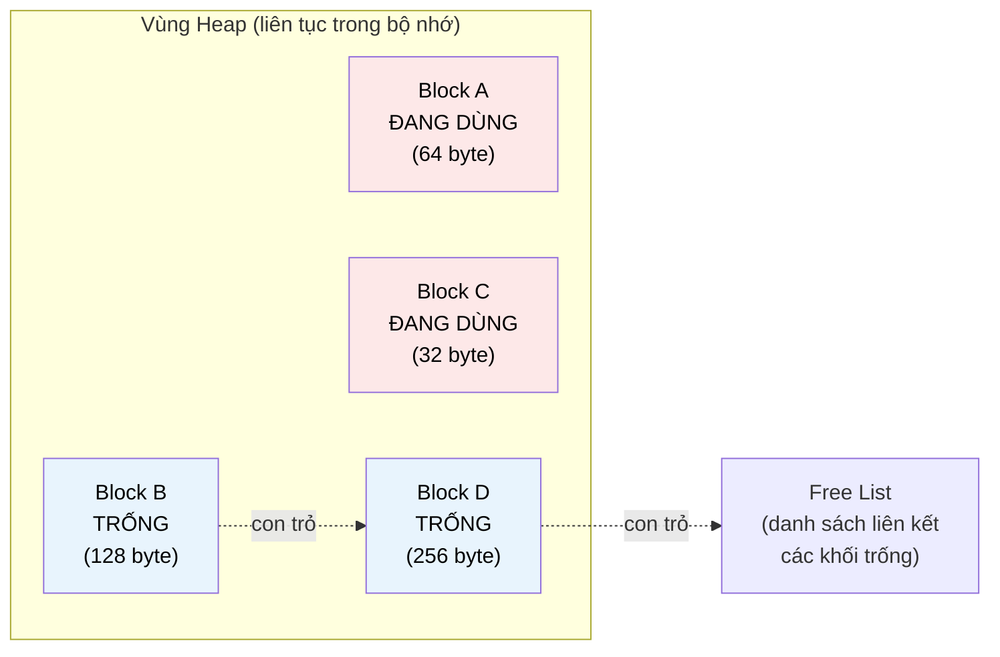

# MASTER COMPUTER SCIENCE HANDBOOK

## Volume 04 — Computer Systems
### Part II — Memory Systems
## Chương 2.7 — Cấp phát Bộ nhớ Động
### (Memory Allocation)

---

### Thông tin chương

| Trường | Giá trị |
|---|---|
| Chương | 2.7 |
| Thuộc Part | II — Memory Systems |
| Thuộc Volume | 04 — Computer Systems |
| Thời gian đọc ước tính | 50–60 phút |
| Độ khó | ★★★★☆ |
| Kiến thức tiên quyết | Chương 2.6 — Paging and Segmentation (Heap trong Hình 2.6.2; Internal/External Fragmentation) |
| Chương liên quan | 2.8 — NUMA and Persistent Memory (chương tiếp theo, mở rộng tổ chức bộ nhớ ra quy mô đa socket); Volume 03, Part II — Fundamental Data Structures (Free List dùng lại cấu trúc Linked List) |
| Từ khóa | heap, malloc, free, allocator, free list, fragmentation, best-fit, first-fit, worst-fit, buddy system, memory leak |

---

### Mục tiêu học tập

Sau khi hoàn thành chương này, người đọc có thể:

- Giải thích vai trò của **Heap Allocator** như một lớp phần mềm nằm giữa chương trình và hệ điều hành, quản lý vùng Heap đã học ở Chương 2.6.
- Trình bày cấu trúc **Free List** và cách nó theo dõi các khối bộ nhớ đang trống.
- So sánh ba chiến lược tìm khoảng trống: **First-Fit, Best-Fit, Worst-Fit**, cùng đánh đổi giữa tốc độ và mức độ Fragmentation.
- Giải thích nguyên lý **Buddy System** như một chiến lược cấp phát có cấu trúc, giảm chi phí tìm kiếm và hợp nhất khối trống.
- Phân biệt **Memory Leak** với **Fragmentation** — hai vấn đề khác nhau thường bị nhầm lẫn.

---

### Câu hỏi khơi gợi

> *Khi bạn gọi `malloc(100)` trong C, chương trình của bạn không hề "xin phép" hệ điều hành mỗi lần — việc đó quá chậm nếu phải thực hiện cho từng lần cấp phát nhỏ. Vậy ai thực sự quản lý vùng Heap ở Hình 2.6.2 (Chương 2.6), quyết định byte nào được cấp cho `malloc(100)` này, và làm sao `free()` biết chính xác phải trả lại bao nhiêu byte, dù bạn chỉ truyền vào duy nhất một con trỏ?*

---

## 1. Tổng quan chương

Chương 2.6 đã giới thiệu **Heap** như một trong bốn vùng logic của không gian địa chỉ một tiến trình (Hình 2.6.2), có khả năng tăng trưởng động. Nhưng "tăng trưởng động" ở cấp độ hệ điều hành (yêu cầu thêm trang bộ nhớ) khác hoàn toàn với việc quản lý chi tiết bên trong vùng Heap đó — nơi hàng nghìn lần gọi `malloc()` và `free()` với kích thước khác nhau diễn ra liên tục trong suốt vòng đời chương trình, mà **không hề** cần tương tác với hệ điều hành mỗi lần.

Chương này giới thiệu **Heap Allocator** — một thư viện phần mềm (thường là một phần của thư viện chuẩn ngôn ngữ, ví dụ `glibc` cho C) chạy hoàn toàn trong không gian người dùng (user-space), chịu trách nhiệm quản lý chi tiết vùng Heap đã được hệ điều hành cấp cho tiến trình. Đây là chương đầu tiên trong Part II mà người đọc thấy rõ: quản lý bộ nhớ không dừng lại ở phần cứng (thanh ghi, cache, DRAM) hay hệ điều hành (Paging), mà còn tiếp diễn ở một tầng phần mềm thứ ba, ngay bên trong chương trình của chính bạn.

> **💡 Insight**
> Khi `malloc()` cần thêm bộ nhớ mà Heap hiện tại không đủ, nó mới thực sự gọi đến hệ điều hành (qua system call như `brk()` hoặc `mmap()`) để mở rộng Heap — một thao tác tương đối tốn kém. Phần lớn thời gian, `malloc()` và `free()` chỉ đơn thuần "quản lý sổ sách" trên vùng bộ nhớ đã có sẵn, không hề chạm đến hệ điều hành — đây chính là lý do các lần gọi `malloc()`/`free()` thông thường nhanh hơn nhiều so với việc xin cấp phát trang mới trực tiếp.

---

## 2. Bối cảnh lịch sử

| Thời điểm | Nhân vật / Sự kiện | Đóng góp |
|---|---|---|
| Thập niên 1960 | Các hệ thống Lisp đầu tiên | Cần đến các kỹ thuật quản lý bộ nhớ động phức tạp sớm nhất, do bản chất tạo và hủy cấu trúc dữ liệu liên tục của lập trình hàm — thúc đẩy nghiên cứu ban đầu về garbage collection (sẽ đề cập ngắn gọn ở Mục 12) |
| 1975 | Donald Knuth, *The Art of Computer Programming, Vol. 1* | Hệ thống hóa và phân tích chi tiết các thuật toán First-Fit, Best-Fit — nền tảng lý thuyết vẫn được trích dẫn đến ngày nay |
| 1985 | Donald E. Knuth (hình thức hóa), khái niệm **Buddy System** (ý tưởng gốc từ Kenneth C. Knowlton, 1965) | Buddy System trở thành một chiến lược tiêu chuẩn, cân bằng giữa tốc độ cấp phát/giải phóng và mức độ Fragmentation |
| 1996–nay | `ptmalloc`, `dlmalloc`, `jemalloc`, `tcmalloc` | Các allocator hiện đại, hiệu năng cao, tối ưu hóa đặc biệt cho hệ thống đa luồng (multi-threaded) — chủ đề sẽ liên hệ ở Volume 04, Part IV |

Điều thú vị về mặt lịch sử: bài toán cấp phát bộ nhớ động, dù đã được nghiên cứu từ những năm 1960, vẫn liên tục sinh ra các allocator mới (`jemalloc` của Facebook, `tcmalloc` của Google) trong hai thập kỷ gần đây — một minh chứng rằng đây không phải bài toán "đã giải xong", mà tiếp tục cần tối ưu hóa khi workload và kiến trúc phần cứng (đặc biệt hệ thống đa lõi) thay đổi.

---

## 3. Động lực

Hãy xem xét một chuỗi thao tác Heap đơn giản:

```c
void *a = malloc(64);   // Cấp 64 byte
void *b = malloc(128);  // Cấp 128 byte
void *c = malloc(32);   // Cấp 32 byte
free(b);                 // Giải phóng khối 128 byte ở giữa
void *d = malloc(100);  // Cấp 100 byte — sẽ dùng khối trống 128 byte vừa giải phóng?
```

Câu hỏi tưởng chừng đơn giản — "khối trống 128 byte vừa được `free(b)` trả lại có được dùng cho `malloc(100)` không?" — mở ra hàng loạt vấn đề kỹ thuật cốt lõi của chương này: Allocator cần một cách để **theo dõi** khối nào đang trống (Free List, Mục 6), một **chiến lược** để chọn khối trống phù hợp khi có nhiều lựa chọn (Mục 8), và một cơ chế để xử lý phần dư khi khối trống lớn hơn nhu cầu (128 byte trống nhưng chỉ cần 100 byte — 28 byte còn lại đi đâu?).

Quan trọng hơn, nếu chuỗi thao tác này lặp lại hàng triệu lần với kích thước ngẫu nhiên trong suốt vòng đời một chương trình chạy dài hạn (ví dụ một web server), chất lượng của chiến lược cấp phát quyết định trực tiếp: chương trình có bị "phình to" dần theo thời gian dù lượng dữ liệu thực tế không tăng hay không — hiện tượng **Heap Fragmentation**, phiên bản cụ thể của External Fragmentation đã học ở Chương 2.6, nay xảy ra ngay trong không gian người dùng.

---

## 4. Trực giác

**Mô hình tinh thần (Mental Model) của chương này:**

> Heap Allocator giống như **người quản lý một bãi đỗ xe có các ô đỗ kích thước khác nhau**. Khi một xe (yêu cầu `malloc`) đến, người quản lý phải quyết định: đỗ vào ô nào? Nếu chọn ô vừa khít nhất (Best-Fit), bãi đỗ gọn gàng nhưng người quản lý phải đi kiểm tra nhiều ô hơn để tìm ô "vừa khít nhất". Nếu chọn ô trống đầu tiên tìm thấy (First-Fit), việc quyết định rất nhanh, nhưng có thể để lại nhiều khoảng trống nhỏ, lẻ tẻ không dùng được cho xe lớn sau này.
>
> Khi một xe rời đi (`free`), ô đỗ đó trở thành trống — nhưng nếu ô đỗ **liền kề** cũng đang trống, người quản lý khôn ngoan sẽ "gộp" hai ô liền kề thành một ô lớn hơn, sẵn sàng cho xe lớn hơn đến sau — đây chính là thao tác **Coalescing (Hợp nhất)**, một phần thiết yếu của bất kỳ allocator thực tế nào.

| Khái niệm Allocator | Ẩn dụ bãi đỗ xe |
|---|---|
| **Free List** | Sổ ghi chép các ô đỗ hiện đang trống |
| **First-Fit / Best-Fit / Worst-Fit** | Chiến lược chọn ô đỗ khi có nhiều lựa chọn |
| **Coalescing** | Gộp hai ô trống liền kề thành một ô lớn hơn |
| **Fragmentation** | Tình trạng có nhiều ô trống nhỏ, rải rác, không đủ lớn cho xe mới dù tổng diện tích trống vẫn đủ |

---

## 5. Trực quan hóa khái niệm

**Hình 2.7.1 — Cấu trúc Heap và Free List**
*(Visual đặc trưng của chương — Chapter Identity)*



| Trường thông tin | Nội dung |
|---|---|
| Mục đích | Cho thấy Heap là một dải bộ nhớ liên tục xen kẽ giữa khối đang dùng và khối trống, được theo dõi bằng một cấu trúc **Linked List** (Volume 03, Part II) đi qua các khối trống |
| Điểm mấu chốt | Free List **không cần cấu trúc dữ liệu riêng biệt tốn thêm bộ nhớ** — con trỏ "next" của danh sách liên kết thường được lưu ngay bên trong chính khối bộ nhớ đang trống đó, vì khối trống không chứa dữ liệu người dùng nào cần bảo toàn |

---

**Hình 2.7.2 — Ba chiến lược tìm khoảng trống**

```text
Free List hiện tại: [20 byte] → [200 byte] → [50 byte] → [500 byte]
Yêu cầu: malloc(45)

First-Fit:  Duyệt từ đầu, chọn khối ĐẦU TIÊN đủ lớn
            → chọn [200 byte]  (bỏ qua 20, vì quá nhỏ)
            → dư thừa: 155 byte (có thể gây fragmentation)

Best-Fit:   Duyệt TOÀN BỘ danh sách, chọn khối VỪA KHÍT NHẤT
            → chọn [50 byte]   (50 ≥ 45, dư ít nhất trong các khối đủ lớn)
            → dư thừa: chỉ 5 byte

Worst-Fit:  Duyệt TOÀN BỘ danh sách, chọn khối LỚN NHẤT
            → chọn [500 byte]  (cố tình để lại khối dư LỚN, dễ dùng lại)
            → dư thừa: 455 byte
```

*Mục đích:* so sánh trực quan ba chiến lược sẽ được định nghĩa hình thức ở Mục 6. *Điểm mấu chốt:* Best-Fit giảm dư thừa tức thời nhưng tốn thời gian duyệt toàn bộ danh sách; First-Fit nhanh nhưng có thể để lại dư thừa lớn hơn — đúng tinh thần đánh đổi tốc độ–chất lượng đã xuất hiện xuyên suốt Part II.

---

## 6. Định nghĩa hình thức

> **📌 Remember — Heap Allocator và Free List**
>
> **Heap Allocator** là thành phần phần mềm (thường thuộc thư viện chuẩn ngôn ngữ lập trình) quản lý việc cấp phát và giải phóng các khối bộ nhớ có kích thước tùy ý trong vùng Heap, cung cấp giao diện như `malloc()`/`free()` (C) hay tương đương ẩn sau bộ thu gom rác (garbage collector) ở các ngôn ngữ quản lý bộ nhớ tự động (Java, Python — Mục 12).
>
> **Free List** là một cấu trúc dữ liệu (thường là Linked List, xem Volume 03, Part II) theo dõi tất cả các khối bộ nhớ hiện đang trống trong Heap, cho phép allocator nhanh chóng tìm khối phù hợp khi có yêu cầu cấp phát mới.
>
> **Coalescing (Hợp nhất):** thao tác gộp hai (hoặc nhiều) khối trống liền kề nhau trong bộ nhớ thành một khối trống lớn hơn duy nhất, thường được thực hiện ngay khi một khối được `free()` — nhằm giảm thiểu Fragmentation.
>
> **Ba chiến lược tìm khoảng trống (Fit Strategy):**
>
> | Chiến lược | Định nghĩa |
> |---|---|
> | **First-Fit** | Chọn khối trống **đầu tiên** trong Free List đủ lớn để đáp ứng yêu cầu |
> | **Best-Fit** | Duyệt toàn bộ Free List, chọn khối trống đủ lớn có kích thước **gần nhất** với yêu cầu (dư thừa ít nhất) |
> | **Worst-Fit** | Duyệt toàn bộ Free List, chọn khối trống **lớn nhất** hiện có |

---

## 7. Nền tảng toán học

### 7.1 Độ phức tạp thời gian của các chiến lược

- **Ý nghĩa:** đây là ứng dụng trực tiếp khái niệm độ phức tạp thuật toán ($O$-notation) sẽ được hình thức hóa đầy đủ ở Volume 03, nhưng đã có thể phân tích trực giác ngay tại đây.

> **📦 Formula Box — Độ phức tạp Thời gian Tìm kiếm**
>
> $$T_{First\text{-}Fit} = O(k) \quad \text{(trung bình, dừng ngay khi tìm thấy)}$$
> $$T_{Best\text{-}Fit} = T_{Worst\text{-}Fit} = O(n)$$
>
> | Thành phần | Ý nghĩa |
> |---|---|
> | $n$ | Tổng số khối trống hiện có trong Free List |
> | $k$ | Vị trí của khối đầu tiên đủ lớn — có thể nhỏ hơn nhiều so với $n$ trong trường hợp trung bình, nhưng vẫn có thể bằng $n$ trong trường hợp xấu nhất |
> | **Diễn giải kỹ thuật** | First-Fit có thể dừng lại ngay khi tìm thấy khối đủ lớn đầu tiên, trong khi Best-Fit/Worst-Fit **buộc phải duyệt toàn bộ danh sách** để đảm bảo tìm đúng khối tốt nhất/xấu nhất — đây chính là chi phí phải trả để đổi lấy chất lượng cấp phát tốt hơn (ít dư thừa hơn) |
> | **Ứng dụng thường gặp** | Giải thích vì sao nhiều allocator thực tế (Mục 11) không dùng Best-Fit thuần túy cho mọi kích thước — chi phí $O(n)$ trở nên đáng kể khi Free List có hàng nghìn khối trống |

### 7.2 Ước lượng Internal Fragmentation trong Buddy System

> **📦 Formula Box — Kích thước Khối trong Buddy System**
>
> $$\text{Kích thước khối được cấp} = 2^{\lceil \log_2(\text{kích thước yêu cầu}) \rceil}$$
>
> | Thành phần | Ý nghĩa |
> |---|---|
> | Kích thước yêu cầu | Số byte thực sự chương trình yêu cầu qua `malloc()` |
> | **Diễn giải kỹ thuật** | Buddy System (Mục 8) chỉ cấp phát các khối có kích thước là **lũy thừa của 2** — một yêu cầu 100 byte sẽ nhận được khối 128 byte ($2^7$), lãng phí 28 byte. Trong trường hợp xấu nhất (yêu cầu vừa quá $2^k$ một byte), lãng phí có thể lên tới gần 50% |
> | **Ứng dụng thường gặp** | Đây là Internal Fragmentation (Chương 2.6, Mục 12) tái xuất hiện ở tầng user-space allocator — đối lập trực tiếp với Best-Fit (Mục 7.1), vốn tối thiểu hóa dư thừa nhưng tốn $O(n)$ thời gian tìm kiếm |

---

## 8. Thuật toán / Cơ chế

**Cơ chế Buddy System** — chiến lược kết hợp tốc độ tìm kiếm nhanh với khả năng Coalescing hiệu quả, không cần duyệt toàn bộ Free List:

```text
Bước 1 — Toàn bộ Heap được xem như MỘT khối lớn duy nhất,
         kích thước là lũy thừa của 2 (ví dụ 1024 byte)
        │
        ▼
Bước 2 — Khi có yêu cầu cấp phát kích thước S:
         Làm tròn S lên lũy thừa của 2 gần nhất
         (Formula Box Mục 7.2)
        │
        ▼
Bước 3 — Nếu khối hiện có VỪA ĐÚNG kích thước cần → cấp phát ngay
        │
        └── Nếu khối hiện có LỚN HƠN kích thước cần:
                 │
                 ▼
        Bước 4 —  CHIA ĐÔI khối thành hai "buddy" (khối anh em)
                  bằng nhau, mỗi khối bằng nửa kích thước cũ
                 │
                 ▼
        Bước 5 —  Lặp lại Bước 3 với MỘT trong hai buddy
                  (buddy còn lại được thêm vào Free List
                  ở cấp độ kích thước tương ứng)
        │
        ▼
Bước 6 — Khi GIẢI PHÓNG một khối:
         Kiểm tra: "buddy" của khối này (địa chỉ được tính
         bằng phép XOR đơn giản với kích thước khối) có
         đang trống không?
        │
        ├── CÓ → HỢP NHẤT (coalesce) hai buddy thành khối
        │        lớn hơn NGAY LẬP TỨC, rồi lặp lại Bước 6
        │        với khối vừa hợp nhất (kiểm tra buddy của nó)
        │
        └── KHÔNG → dừng lại, thêm khối vào Free List ở
                     đúng cấp độ kích thước của nó
```

> **💡 Insight**
> Điều làm Buddy System đặc biệt hiệu quả nằm ở Bước 6: nhờ mọi khối đều có kích thước lũy thừa của 2 và được chia theo cấu trúc cây nhị phân hoàn chỉnh, địa chỉ của "buddy" (khối anh em) của bất kỳ khối nào cũng có thể được **tính toán trực tiếp bằng phép toán bit** (XOR địa chỉ với kích thước khối) — không cần tìm kiếm hay duyệt qua Free List để xác định "khối liền kề có đang trống hay không", như cách một allocator dựa hoàn toàn trên Free List tuyến tính phải làm.

---

## 9. Triển khai

```python
import math

class BuddyAllocator:
    """Mô phỏng đơn giản Buddy System, minh họa cơ chế chia đôi/hợp nhất
    đã mô tả ở Mục 8. Không xử lý đầy đủ mọi trường hợp biên — chỉ nhằm
    mục đích giáo dục."""

    def __init__(self, total_size):
        self.total_size = total_size          # phải là lũy thừa của 2
        self.max_order = int(math.log2(total_size))
        # free_lists[k] = danh sách các khối trống có kích thước 2^k
        self.free_lists = {k: [] for k in range(self.max_order + 1)}
        self.free_lists[self.max_order].append(0)  # toàn bộ Heap ban đầu
        self.allocated = {}  # địa chỉ -> order (kích thước đã cấp)

    def _order_for(self, size):
        return max(0, math.ceil(math.log2(size)))

    def allocate(self, size):
        order = self._order_for(size)
        return self._allocate_order(order)

    def _allocate_order(self, order):
        if order > self.max_order:
            return None  # yêu cầu vượt quá tổng dung lượng Heap

        if self.free_lists[order]:
            address = self.free_lists[order].pop()
            self.allocated[address] = order
            return address

        # Không có khối đúng kích thước — mượn từ cấp lớn hơn, rồi chia đôi
        parent_address = self._allocate_order(order + 1)
        if parent_address is None:
            return None

        buddy_address = parent_address ^ (1 << order)  # phép toán XOR (Mục 8)
        self.free_lists[order].append(buddy_address)
        del self.allocated[parent_address]
        self.allocated[parent_address] = order
        return parent_address

    def free(self, address):
        order = self.allocated.pop(address)
        self._free_order(address, order)

    def _free_order(self, address, order):
        buddy_address = address ^ (1 << order)

        if order < self.max_order and buddy_address in self.free_lists[order]:
            self.free_lists[order].remove(buddy_address)   # HỢP NHẤT
            merged_address = min(address, buddy_address)
            self._free_order(merged_address, order + 1)    # đệ quy lên cấp cao hơn
        else:
            self.free_lists[order].append(address)
```

Lớp `BuddyAllocator` triển khai trực tiếp Mục 8: `_allocate_order` thực hiện đệ quy Bước 3–5 (mượn từ cấp lớn hơn và chia đôi khi cần); `_free_order` thực hiện đúng Bước 6, dùng phép XOR để tính địa chỉ buddy và đệ quy hợp nhất khi có thể.

---

## 10. Trực quan hóa quá trình thực thi

**Thử nghiệm với `BuddyAllocator(total_size=1024)`**, tái tạo chuỗi thao tác tương tự Mục 3:

```text
allocate(64)  → order=6 (2^6=64) → cấp tại địa chỉ 0
allocate(128) → order=7 (2^7=128) → cấp tại địa chỉ 128
allocate(32)  → order=5 (2^5=32) → cấp tại địa chỉ 64

Trạng thái Free List: {0: [], ..., 5: [96], 6: [], 7: [], ..., 9: [512]}
  (khối 32 byte tại địa chỉ 96 — phần dư khi chia đôi khối 64 byte
   ban đầu để phục vụ allocate(32) — vẫn còn trống)

free(128)  → giải phóng khối tại địa chỉ 128 (order=7)
           → kiểm tra buddy: địa chỉ 128 XOR 128 = 0 (đang CẤP PHÁT,
             không trống) → KHÔNG hợp nhất, thêm 128 vào free_lists[7]

allocate(100) → order=7 (2^7=128, vì 100 nằm giữa 64 và 128)
              → free_lists[7] đã có khối tại 128 → cấp NGAY, không
                cần chia hay mượn thêm từ cấp cao hơn
```

**Diễn giải kết quả:** khối 128 byte vừa `free()` được tái sử dụng ngay lập tức và trực tiếp cho `allocate(100)` — trả lời chính xác câu hỏi đặt ra ở Mục 3. Đồng thời, ví dụ này cho thấy rõ Internal Fragmentation của Buddy System theo Formula Box Mục 7.2: yêu cầu 100 byte nhưng nhận khối 128 byte — lãng phí 28 byte, một đánh đổi được chấp nhận để giữ được tốc độ cấp phát/giải phóng gần như hằng số (không cần duyệt Free List tuyến tính).

---

## 11. Ứng dụng công nghiệp

> **🛠 Engineering Practice**
> Hầu như mọi chương trình chạy dài hạn (long-running) trong thực tế đều phụ thuộc trực tiếp vào chất lượng của allocator đang dùng, dù lập trình viên hiếm khi ý thức về điều này.

| Bối cảnh công nghiệp | Vai trò của Memory Allocator |
|---|---|
| `glibc malloc` (ptmalloc) trên Linux | Kết hợp nhiều chiến lược tùy kích thước yêu cầu — dùng cấu trúc tương tự Buddy System (gọi là "bins") cho khối nhỏ, và mmap trực tiếp cho khối rất lớn |
| `jemalloc` (phát triển bởi Facebook, dùng trong Redis, MariaDB) | Tối ưu hóa đặc biệt cho hệ thống đa luồng — mỗi luồng có vùng cấp phát riêng để giảm tranh chấp (contention), một chủ đề sẽ mở rộng ở Volume 04, Part IV |
| `tcmalloc` (Google) | Được thiết kế để giảm thiểu chi phí cấp phát cho các dịch vụ có traffic cực cao, với cơ chế cache cấp phát theo luồng tương tự `jemalloc` |
| Bộ thu gom rác (Garbage Collector) trong JVM, CPython | Vẫn cần một allocator nền tảng để quản lý vùng bộ nhớ thô — garbage collection chỉ thêm một lớp **tự động hóa việc gọi `free()`**, không thay thế hoàn toàn các khái niệm Free List/Fragmentation đã học trong chương |

---

## 12. Góc nhìn nghiên cứu

> **🔬 Research Connection**
> Quản lý bộ nhớ động vẫn là lĩnh vực nghiên cứu tích cực, đặc biệt khi hệ thống hiện đại ngày càng đa luồng và cần độ trễ thấp, dự đoán được (predictable latency).

Một hướng phát triển quan trọng là **Garbage Collection (GC)** — thay vì yêu cầu lập trình viên tự gọi `free()` (như C/C++), các ngôn ngữ như Java, Python, Go tự động xác định khi nào một khối bộ nhớ không còn được tham chiếu và giải phóng nó. Đây không phải một chiến lược thay thế cho Free List hay Buddy System, mà là một **lớp tự động hóa việc gọi `free()` đúng lúc** — bản thân GC vẫn cần một allocator nền tảng để thực sự quản lý bộ nhớ vật lý. Một vấn đề khác với Fragmentation nhưng thường bị nhầm lẫn là **Memory Leak (Rò rỉ bộ nhớ)** — xảy ra khi chương trình cấp phát bộ nhớ nhưng không bao giờ giải phóng (quên gọi `free()`, hoặc GC không thể xác định đối tượng đã "chết" do vẫn còn tham chiếu vô tình), khiến lượng bộ nhớ sử dụng tăng dần vô hạn theo thời gian — khác hẳn bản chất của Fragmentation (bộ nhớ đã được giải phóng nhưng không thể tái sử dụng hiệu quả).

Hướng nghiên cứu hiện tại còn bao gồm: **Region-based Memory Management** (cấp phát và giải phóng theo "vùng" thay vì từng đối tượng riêng lẻ, phổ biến trong ngôn ngữ Rust ở dạng biến thể "ownership") — loại bỏ hoàn toàn nhu cầu GC lẫn rủi ro memory leak thủ công bằng cách kiểm tra tại thời điểm biên dịch; và **allocator nhận biết NUMA** (liên hệ trực tiếp Chương 2.8) — cấp phát bộ nhớ ưu tiên gần với lõi CPU đang thực thi, giảm độ trễ truy cập trong hệ thống đa socket.

**Câu hỏi mở** để suy ngẫm: Garbage Collection giải quyết vấn đề "lập trình viên quên `free()`", nhưng tự nó cũng có chi phí (thời gian dừng chương trình để quét bộ nhớ — "stop-the-world pause"). Với các ứng dụng đòi hỏi độ trễ cực thấp và dự đoán được (ví dụ hệ thống giao dịch tài chính tốc độ cao), liệu việc quay lại quản lý bộ nhớ thủ công (như C/C++, hoặc mô hình ownership của Rust) có phải luôn là lựa chọn tốt hơn GC, hay đây vẫn là một đánh đổi phụ thuộc hoàn toàn vào bối cảnh ứng dụng cụ thể?

---

## 13. Ưu điểm

- **Giảm đáng kể chi phí tương tác với hệ điều hành** — phần lớn thao tác `malloc()`/`free()` chỉ là "quản lý sổ sách" trên bộ nhớ đã có sẵn, không cần system call (Mục 1).
- **Buddy System cung cấp tốc độ cấp phát/giải phóng gần như hằng số** ($O(\log n)$ trong trường hợp cần chia/hợp nhất, thực tế thường rất nhanh) — không cần duyệt tuyến tính như Best-Fit thuần túy.
- **Coalescing tự động** giúp giảm thiểu tích lũy Fragmentation theo thời gian, đặc biệt hiệu quả trong Buddy System nhờ khả năng tính toán địa chỉ buddy trực tiếp (Mục 8, Insight).
- **Có thể tùy chỉnh cho từng bối cảnh ứng dụng cụ thể** — như đã thấy ở Mục 11, các allocator hiện đại (`jemalloc`, `tcmalloc`) tối ưu hóa riêng cho các đặc tính workload khác nhau.

---

## 14. Hạn chế

> **⚠️ Common Mistake**
> Một ngộ nhận phổ biến: nhầm lẫn **Memory Leak** với **Fragmentation** — hai hiện tượng có triệu chứng bề ngoài tương tự (chương trình dùng ngày càng nhiều bộ nhớ) nhưng nguyên nhân hoàn toàn khác nhau (Mục 12). Chẩn đoán sai nguyên nhân dẫn đến hướng khắc phục sai: Fragmentation cần thay đổi chiến lược allocator; Memory Leak cần sửa lỗi logic chương trình (thiếu `free()`, hoặc giữ tham chiếu không cần thiết).

- **Buddy System luôn có Internal Fragmentation đáng kể** (Formula Box Mục 7.2) — trung bình khoảng 25% dung lượng bị lãng phí do làm tròn lên lũy thừa của 2.
- **Best-Fit, dù giảm dư thừa tức thời, có chi phí $O(n)$** cho mỗi lần cấp phát (Mục 7.1) — không phù hợp cho hệ thống cần độ trễ thấp, dự đoán được.
- **Coalescing không giải quyết được mọi trường hợp Fragmentation** — nếu các khối trống không liền kề nhau về mặt vật lý, không có cách nào hợp nhất chúng dù tổng dung lượng trống đủ lớn.
- **Quản lý bộ nhớ thủ công (như C/C++) luôn tiềm ẩn rủi ro Memory Leak hoặc Use-After-Free** — hai lớp lỗi phổ biến bậc nhất trong lập trình hệ thống, động lực trực tiếp cho các công cụ như ASan (đã nhắc ở Chương 2.5, Mục 11) và các ngôn ngữ với mô hình ownership (Rust).

---

## 15. So sánh

**Bảng 2.7.1 — Ba chiến lược Fit và Buddy System**

| Tiêu chí | First-Fit | Best-Fit | Worst-Fit | Buddy System |
|---|---|---|---|---|
| Độ phức tạp thời gian | $O(k)$, trung bình nhanh | $O(n)$ | $O(n)$ | $O(\log n)$ |
| Mức độ Fragmentation | Trung bình | Thấp (dư thừa ít) | Cao (dư thừa lớn tích lũy) | Trung bình (Internal, có thể tính trước) |
| Khả năng dự đoán hiệu năng | Trung bình | Thấp (phụ thuộc kích thước Free List) | Thấp | Cao (gần hằng số) |
| Coalescing | Cần duyệt tìm khối liền kề | Cần duyệt tìm khối liền kề | Cần duyệt tìm khối liền kề | Tính trực tiếp bằng XOR (Mục 8) |

**Phân tích:** không có chiến lược nào chiếm ưu thế tuyệt đối — đây là lần thứ tư trong Part II (sau Mapping ở Chương 2.3, AMAT nhiều tầng ở Chương 2.1, và Paging/Segmentation ở Chương 2.6) người đọc gặp lại đúng một khuôn mẫu tư duy: **đánh đổi giữa tốc độ và chất lượng, giữa đơn giản và tối ưu**. Buddy System nổi bật trong bảng này không phải vì nó "tốt nhất" theo mọi tiêu chí, mà vì nó đạt được **khả năng dự đoán hiệu năng cao** — một tiêu chí ngày càng quan trọng trong các hệ thống thực tế hiện đại, nơi độ trễ ổn định (dù không phải luôn nhanh nhất) thường được ưu tiên hơn tốc độ trung bình cao nhưng không ổn định.

---

## 16. Tóm tắt

- **Heap Allocator** là lớp phần mềm user-space quản lý chi tiết vùng Heap (đã học ở Chương 2.6), dùng **Free List** để theo dõi các khối bộ nhớ đang trống, tránh phải tương tác với hệ điều hành cho mỗi lần cấp phát nhỏ.
- Ba chiến lược **First-Fit, Best-Fit, Worst-Fit** đánh đổi giữa tốc độ tìm kiếm ($O(k)$ so với $O(n)$, Mục 7.1) và chất lượng cấp phát (mức độ dư thừa để lại).
- **Buddy System** là một chiến lược có cấu trúc, cấp phát khối kích thước lũy thừa của 2, cho phép tính toán địa chỉ "buddy" trực tiếp bằng phép XOR — đạt tốc độ gần hằng số nhưng đánh đổi bằng Internal Fragmentation có thể ước lượng trước (Formula Box Mục 7.2).
- **Coalescing** — hợp nhất các khối trống liền kề — là cơ chế thiết yếu để hạn chế Fragmentation tích lũy theo thời gian trong bất kỳ allocator nào.
- **Memory Leak** và **Fragmentation** là hai vấn đề khác nhau về bản chất (Mục 12, 14) dù có triệu chứng bên ngoài tương tự — chẩn đoán đúng nguyên nhân là bước đầu tiên để khắc phục hiệu quả.

Chương này khép lại nhóm các chương tập trung vào "quản lý một máy tính đơn lẻ" của Part II. Chương 2.8 (NUMA and Persistent Memory) sẽ mở rộng góc nhìn ra ngoài phạm vi một CPU/RAM đơn lẻ, đặt câu hỏi: điều gì xảy ra với các nguyên lý đã học xuyên suốt Part II — Locality, AMAT, phân cấp bộ nhớ — khi một hệ thống có nhiều CPU socket, mỗi socket có RAM "gần" và "xa" khác nhau?

---

## 17. Bài tập

### Mức Cơ bản (Basic)

1. Giải thích bằng lời của riêng bạn: vì sao `malloc()`/`free()` thường không cần gọi trực tiếp đến hệ điều hành cho mỗi lần cấp phát, dù về mặt khái niệm Heap là bộ nhớ do hệ điều hành quản lý (Chương 2.6).
2. Với chuỗi Free List `[30 byte] → [10 byte] → [100 byte] → [45 byte]` và yêu cầu `malloc(40)`, xác định khối được chọn theo First-Fit, Best-Fit, và Worst-Fit.

### Mức Trung bình (Intermediate)

3. Dùng lớp `BuddyAllocator` ở Mục 9 với `total_size=256`, thực hiện chuỗi thao tác: `allocate(50)`, `allocate(20)`, `allocate(90)`, `free()` khối đầu tiên, `allocate(45)`. Vẽ lại trạng thái `free_lists` sau mỗi bước và xác định liệu `allocate(45)` cuối cùng có tái sử dụng được khối vừa giải phóng không.
4. Tính Internal Fragmentation trung bình của Buddy System, giả sử kích thước yêu cầu phân bố đều ngẫu nhiên trong khoảng $(2^{k-1}, 2^k]$ cho một $k$ cố định. *(Gợi ý: dùng Formula Box Mục 7.2, tính lãng phí trung bình trên toàn khoảng.)*

### Mức Nâng cao (Advanced)

5. Giải thích tại sao Best-Fit, dù trực giác có vẻ luôn tốt hơn (giảm dư thừa ngay lập tức), có thể dẫn đến **nhiều Fragmentation hơn về lâu dài** so với First-Fit trong một số kịch bản thực tế. *(Gợi ý: xem xét việc Best-Fit có xu hướng để lại rất nhiều khối dư thừa cực nhỏ, "không dùng được cho bất kỳ yêu cầu thực tế nào".)*

### Mức Nghiên cứu (Research)

6. Đọc thêm về mô hình **Ownership** trong ngôn ngữ Rust. Giải thích ngắn gọn: cơ chế này loại bỏ nhu cầu cả Garbage Collection lẫn rủi ro quên gọi `free()` thủ công như thế nào, bằng cách nào trình biên dịch có thể đảm bảo tính đúng đắn này **tại thời điểm biên dịch**, thay vì thời điểm chạy chương trình?

---

## 18. Dự án nhỏ

**Dự án: Bộ so sánh Chiến lược Allocator (Allocator Strategy Benchmark)**

- **Mục tiêu:** Triển khai đầy đủ ba allocator dựa trên Free List (First-Fit, Best-Fit, Worst-Fit) bằng Python, cùng `BuddyAllocator` đã có ở Mục 9, sau đó so sánh hiệu năng và mức độ Fragmentation trên cùng một chuỗi thao tác `malloc`/`free` mô phỏng.
- **Yêu cầu:**
  - Sinh một chuỗi thao tác ngẫu nhiên gồm hàng nghìn lần `allocate`/`free` với kích thước ngẫu nhiên, mô phỏng workload thực tế của một chương trình chạy dài hạn.
  - Đo và so sánh: (a) tổng thời gian thực thi của mỗi chiến lược, (b) mức độ Fragmentation cuối cùng (tổng dung lượng trống so với kích thước khối trống lớn nhất còn liên tục).
  - Vẽ biểu đồ so sánh cả hai tiêu chí cho bốn chiến lược, dùng `matplotlib`.
- **Kết quả kỳ vọng:** Tái tạo được xu hướng định tính ở Bảng 2.7.1 bằng số liệu thực nghiệm cụ thể — First-Fit nhanh nhưng Fragmentation trung bình, Best-Fit chậm nhưng Fragmentation thấp, Buddy System cân bằng và ổn định.
- **Hướng mở rộng:** Thêm cơ chế mô phỏng Memory Leak có chủ đích (một tỷ lệ nhỏ các lần `allocate` "quên" gọi `free`) và quan sát cách nó ảnh hưởng đến tổng bộ nhớ sử dụng theo thời gian, khác biệt rõ rệt với đồ thị Fragmentation thuần túy — minh họa trực tiếp phân biệt đã nêu ở Mục 12 và Mục 14.

---

## 19. Tự đánh giá

- [ ] Tôi có thể giải thích vai trò của Heap Allocator như một lớp trung gian giữa chương trình và hệ điều hành, và tại sao lớp này giúp giảm chi phí system call.
- [ ] Tôi có thể tự áp dụng cả ba chiến lược First-Fit/Best-Fit/Worst-Fit cho một Free List cụ thể, và giải thích đánh đổi độ phức tạp thời gian giữa chúng.
- [ ] Tôi hiểu cơ chế Buddy System, đặc biệt là cách tính địa chỉ "buddy" bằng phép XOR, và có thể giải thích tại sao cơ chế này nhanh hơn duyệt Free List tuyến tính.
- [ ] Tôi phân biệt rõ ràng Memory Leak và Fragmentation — hai vấn đề khác nhau về nguyên nhân dù triệu chứng bên ngoài tương tự.
- [ ] Tôi có thể liên hệ khái niệm Coalescing đã học ở đây với khái niệm tương tự (dù ở tầng khác) đã gặp tại Chương 2.6.

Nếu Bài tập 3 hoặc 5 còn khó, nên xem lại Mục 8 (thuật toán Buddy System, đặc biệt Bước 6) và Mục 15 (bảng so sánh) một lần nữa trước khi tiếp tục sang Chương 2.8 — chương cuối cùng của Part II.

---

## 20. Đọc thêm

- **Sách:** Donald E. Knuth, *The Art of Computer Programming, Volume 1: Fundamental Algorithms* — chương Dynamic Storage Allocation, nguồn tham khảo kinh điển cho phân tích First-Fit/Best-Fit và Buddy System.
- **Sách (đã có trong BOOKS.md):** Randal E. Bryant, David R. O'Hallaron, *Computer Systems: A Programmer's Perspective* — chương "Dynamic Memory Allocation", trình bày chi tiết các kỹ thuật allocator thực tế dùng trong `glibc`.
- **Chủ đề mở rộng (không bắt buộc):** tìm đọc tài liệu kỹ thuật về `jemalloc` và `tcmalloc` — hai allocator hiện đại được dùng rộng rãi trong công nghiệp, minh họa ứng dụng thực tế đầy đủ cho Mục 11.
- **Chương tiếp theo:** Chương 2.8 — NUMA and Persistent Memory.

---

### Liên kết chương (Cross References)

- **Chương trước:** 2.6 — Paging and Segmentation (Heap là một trong bốn segment ở Hình 2.6.2; External Fragmentation tái xuất hiện dưới hình thức Heap Fragmentation).
- **Chương tiếp theo:** 2.8 — NUMA and Persistent Memory (chương cuối cùng của Part II, mở rộng phạm vi ra ngoài một CPU/RAM đơn lẻ).
- **Chương liên quan xa hơn:** Volume 03, Part II — Fundamental Data Structures (Free List dùng lại trực tiếp cấu trúc Linked List); Volume 04, Part IV — Concurrency (allocator nhận biết đa luồng như `jemalloc`, Mục 11); Volume 03, Part III — Algorithm Design Paradigms (phân tích độ phức tạp $O(n)$ so với $O(\log n)$ ở Mục 7.1 là một ứng dụng cụ thể sẽ được hình thức hóa đầy đủ ở đó).
- **Vị trí trong Knowledge Graph:** Chương thứ bảy của Volume 04, Part II — chuyển góc nhìn từ phần cứng/hệ điều hành (Chương 2.1–2.6) sang góc nhìn lập trình viên ứng dụng trực tiếp; là chương cuối cùng trước khi Part II mở rộng phạm vi ra hệ thống đa socket ở Chương 2.8.

---

*Hết Chương 2.7. Chương này tuân thủ đầy đủ cấu trúc 20 mục của `OUTPUT.md` và chuẩn Presentation Layer của `WRITING_STANDARD.md`, tiếp nối trực tiếp các Chương 2.1–2.6 trong Volume 04, Part II. Mã Python ở Mục 9 (`BuddyAllocator`) là bản triển khai giáo dục, đơn giản hóa nhiều chi tiết biên (edge case) mà allocator sản xuất thực tế (`ptmalloc`, `jemalloc`) phải xử lý — mục đích là minh họa đúng nguyên lý cốt lõi (chia đôi, hợp nhất qua XOR), không phải một allocator sẵn sàng cho môi trường production. Đang chờ rà soát trước khi tiếp tục sang Chương 2.8 — NUMA and Persistent Memory, chương khép lại Part II.*
