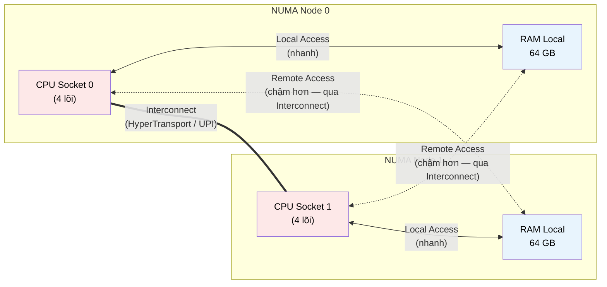

# MASTER COMPUTER SCIENCE HANDBOOK

## Volume 04 — Computer Systems
### Part II — Memory Systems
## Chương 2.8 — NUMA và Bộ nhớ Bền vững
### (NUMA and Persistent Memory)

---

### Thông tin chương

| Trường | Giá trị |
|---|---|
| Chương | 2.8 |
| Thuộc Part | II — Memory Systems (Chương cuối cùng) |
| Thuộc Volume | 04 — Computer Systems |
| Thời gian đọc ước tính | 45–55 phút |
| Độ khó | ★★★★☆ |
| Kiến thức tiên quyết | Chương 2.1 — Memory Hierarchy (AMAT, Locality); Chương 2.4 — Main Memory (Channel, Bandwidth, Latency); Chương 2.7 — Memory Allocation (allocator nhận biết vị trí bộ nhớ) |
| Chương liên quan | Volume 04, Part VI — Distributed Systems (mở rộng khái niệm "gần/xa" ra quy mô cụm máy chủ); Volume 04, Part X — Foundations for AI Infrastructure (GPU cluster, HBM) |
| Từ khóa | NUMA, UMA, memory node, socket, interconnect, NUMA-aware, persistent memory, non-volatile memory, byte-addressable, write endurance |

---

### Mục tiêu học tập

Sau khi hoàn thành chương này, người đọc có thể:

- Giải thích vì sao hệ thống đa socket không thể duy trì mô hình **UMA (Uniform Memory Access)** một cách hiệu quả, dẫn đến sự ra đời của **NUMA (Non-Uniform Memory Access)**.
- Trình bày khái niệm **NUMA Node** và phân biệt truy cập bộ nhớ "local" và "remote".
- Giải thích nguyên lý **NUMA-Aware Programming** — cách phần mềm khai thác thông tin vị trí bộ nhớ để tối ưu hiệu năng.
- Trình bày đặc tính của **Persistent Memory (PMEM)** và vị trí của nó trong phân cấp bộ nhớ, so với DRAM và SSD.
- Tổng hợp lại toàn bộ Part II: nhìn nhận NUMA và Persistent Memory như những mở rộng tự nhiên của các nguyên lý nền tảng (Locality, AMAT, đánh đổi tốc độ–dung lượng) đã học xuyên suốt tám chương.

---

### Câu hỏi khơi gợi

> *Toàn bộ bảy chương trước của Part II ngầm giả định một điều: chỉ có MỘT CPU và MỘT khối RAM. Nhưng máy chủ hiện đại thường có 2, 4, hoặc thậm chí 8 CPU (mỗi CPU trên một "socket" vật lý riêng), mỗi socket có RAM riêng gắn trực tiếp. Khi CPU ở Socket 0 cần đọc dữ liệu nằm trong RAM gắn với Socket 1, điều gì xảy ra? Và tại sao câu trả lời cho câu hỏi này lại quan trọng đến mức có thể quyết định một chương trình chạy nhanh gấp đôi hay chậm đi một nửa, chỉ bằng cách thay đổi CPU nào thực thi nó?*

---

## 1. Tổng quan chương

Từ Chương 2.1 đến 2.7, Part II xây dựng một mô hình nhất quán: một CPU, kết nối với một hệ thống bộ nhớ phân tầng (thanh ghi → cache → DRAM), trong đó **mọi vùng của DRAM đều có cùng độ trễ truy cập** — đây chính là mô hình **UMA (Uniform Memory Access)**, giả định ngầm xuyên suốt Chương 2.4. Chương cuối cùng của Part II phá vỡ giả định này, đưa người đọc đến với kiến trúc **NUMA (Non-Uniform Memory Access)** — tiêu chuẩn thực tế trên hầu hết máy chủ và workstation hiệu năng cao hiện đại, nơi có nhiều CPU, mỗi CPU có RAM "gần" riêng, và việc truy cập RAM "xa" (gắn với CPU khác) chậm hơn đáng kể.

Chương cũng giới thiệu **Persistent Memory** — một công nghệ tương đối mới, cố gắng thu hẹp khoảng cách giữa DRAM (nhanh nhưng mất dữ liệu khi tắt máy) và SSD (bền nhưng chậm hơn nhiều), đã được dự báo ở Bảng 2.1.1 (Chương 2.1) ngay từ chương đầu tiên của Part II. Đây là chương khép lại Part II một cách trọn vẹn: cả hai chủ đề đều không giới thiệu nguyên lý hoàn toàn mới, mà là ứng dụng và mở rộng trực tiếp của Locality, AMAT, và đánh đổi tốc độ–dung lượng–chi phí đã học xuyên suốt bảy chương trước.

> **💡 Insight**
> NUMA về bản chất là **Locality ở một quy mô vật lý lớn hơn nhiều** so với những gì Chương 2.1 hình dung ban đầu. Chương 2.1 nói về locality trong thời gian (temporal) và không gian địa chỉ (spatial); NUMA thêm một chiều thứ ba: **locality vật lý** — dữ liệu "gần" hay "xa" CPU đang thực thi, tính bằng khoảng cách vật lý thực sự trên bo mạch, không chỉ bằng số học địa chỉ.

---

## 2. Bối cảnh lịch sử

| Thời điểm | Nhân vật / Sự kiện | Đóng góp |
|---|---|---|
| Cuối thập niên 1980 | Các hệ thống đa xử lý nghiên cứu sớm (ví dụ BBN Butterfly) | Đặt nền móng lý thuyết cho kiến trúc bộ nhớ không đồng nhất trong hệ thống nhiều bộ xử lý |
| Thập niên 1990 | Sequent Computer Systems, SGI | Thương mại hóa các hệ thống NUMA quy mô lớn phục vụ tính toán khoa học và cơ sở dữ liệu doanh nghiệp |
| 2003 | AMD Opteron (kiến trúc HyperTransport) | Đưa NUMA trở thành phổ biến trên thị trường máy chủ x86 thông thường, không còn giới hạn ở hệ thống chuyên dụng đắt tiền |
| 2015 | Intel công bố công nghệ **3D XPoint** (thương mại hóa dưới tên Optane) | Persistent Memory byte-addressable, tốc độ tiệm cận DRAM, thương mại hóa quy mô lớn lần đầu tiên |

Điều đáng chú ý: NUMA không phải một "phát minh" đơn lẻ tại một thời điểm, mà là một **hệ quả vật lý tất yếu** khi số lượng CPU trong một hệ thống tăng lên — không thể duy trì độ trễ đồng nhất khi khoảng cách vật lý giữa CPU và các module RAM khác nhau ngày càng chênh lệch. Đây là lý do NUMA xuất hiện độc lập ở nhiều nơi trong lịch sử kiến trúc máy tính, mỗi khi ngành công nghiệp tiến đến ranh giới của hệ thống đa xử lý quy mô lớn.

---

## 3. Động lực

Hãy hình dung một máy chủ có 2 CPU socket, mỗi socket có 4 lõi và một khối RAM 64 GB gắn trực tiếp — tổng cộng 128 GB RAM, 8 lõi. Một chương trình đa luồng (multi-threaded) khởi động, và hệ điều hành quyết định: luồng chính chạy trên lõi thuộc Socket 0, nhưng bộ nhớ mà nó cấp phát (qua `malloc()`, Chương 2.7) lại vô tình nằm trên module RAM gắn với Socket 1.

Kết quả: mọi truy cập bộ nhớ của luồng này giờ đây phải đi qua một đường kết nối liên-socket (**interconnect**, ví dụ AMD Infinity Fabric hoặc Intel UPI) — chậm hơn đáng kể so với truy cập RAM gắn trực tiếp với Socket 0. Trên thực tế đo đạc, chênh lệch độ trễ giữa truy cập "local" (RAM cùng socket) và "remote" (RAM khác socket) thường nằm trong khoảng 1,5 đến 2 lần — một con số đủ lớn để làm thay đổi đáng kể hiệu năng của các ứng dụng nhạy cảm với độ trễ bộ nhớ (ví dụ cơ sở dữ liệu trong bộ nhớ, hệ thống HPC).

Điều đáng lo ngại hơn: nếu lập trình viên và quản trị hệ thống **không hề biết về NUMA**, tình huống trên có thể xảy ra một cách hoàn toàn ngẫu nhiên, không nhất quán — cùng một chương trình có thể chạy nhanh trong lần chạy này, chậm hơn 40% trong lần chạy khác, chỉ vì hệ điều hành phân bổ luồng và bộ nhớ khác nhau giữa hai lần chạy. Đây chính là động lực cho **NUMA-Aware Programming** (Mục 11) — kiểm soát tường minh việc luồng nào chạy trên socket nào, và bộ nhớ của nó được cấp phát ở đâu.

---

## 4. Trực giác

**Mô hình tinh thần (Mental Model) của chương này:**

> NUMA giống như **một tòa nhà văn phòng nhiều tầng, mỗi tầng có kho tài liệu riêng ngay tại tầng đó**. Nhân viên làm việc tại Tầng 1 có thể lấy tài liệu từ kho của Tầng 1 gần như tức thì. Nhưng nếu tài liệu họ cần lại nằm trong kho ở Tầng 5, họ phải **gọi thang máy** (interconnect) để lấy — vẫn khả thi, nhưng chậm hơn rõ rệt so với việc chỉ cần với tay vào kho ngay cạnh mình. Một tòa nhà được quản lý tốt sẽ cố gắng sắp xếp để nhân viên và tài liệu họ thường dùng nằm **cùng tầng** — đây chính xác là mục tiêu của NUMA-Aware Programming.

| Khái niệm NUMA | Ẩn dụ tòa nhà văn phòng |
|---|---|
| **NUMA Node** | Một tầng cụ thể (CPU socket + RAM gắn trực tiếp với nó) |
| **Local Access** | Nhân viên lấy tài liệu từ kho ngay tầng mình đang làm việc |
| **Remote Access** | Nhân viên phải gọi thang máy đến tầng khác để lấy tài liệu |
| **Interconnect** | Hệ thống thang máy kết nối các tầng |
| **NUMA-Aware Scheduling** | Chính sách quản lý cố gắng xếp nhân viên làm việc gần kho tài liệu họ thường dùng nhất |

---

## 5. Trực quan hóa khái niệm

**Hình 2.8.1 — Kiến trúc NUMA hai Node**
*(Visual đặc trưng của chương — Chapter Identity)*



| Trường thông tin | Nội dung |
|---|---|
| Mục đích | Minh họa trực tiếp tình huống động lực ở Mục 3: hai đường truy cập bộ nhớ hoàn toàn khác tốc độ, tùy vào CPU nào đang thực thi so với RAM nào đang được truy cập |
| Điểm mấu chốt | Đây là **mở rộng trực tiếp của Hình 2.4.1** (Chương 2.4) — thay vì chỉ có Channel/Rank/Bank bên trong MỘT hệ thống bộ nhớ, giờ đây có nhiều hệ thống bộ nhớ độc lập, mỗi hệ thống "gần" một CPU cụ thể |

---

**Hình 2.8.2 — Vị trí Persistent Memory trong Phân cấp Bộ nhớ**

```text
Nhắc lại Bảng 2.1.1 (Chương 2.1), bổ sung Persistent Memory:

  Registers ──► Cache ──► DRAM ──► Persistent Memory ──► SSD/HDD
   (volatile)  (volatile) (volatile)  (NON-VOLATILE,        (non-volatile,
                                       tốc độ gần DRAM)       chậm hơn nhiều)

  Độ trễ:    ~1ck      3-50ck    100-300ck    ~300-1000ck        hàng nghìn-
                                                                  hàng triệu ck
```

*Mục đích:* định vị chính xác Persistent Memory trong kim tự tháp đã xây dựng từ Chương 2.1 — không thay thế DRAM hay SSD, mà lấp vào khoảng trống giữa hai công nghệ. *Điểm mấu chốt:* đây là tầng đầu tiên trong toàn bộ Part II vừa **nhanh gần bằng DRAM**, vừa **giữ dữ liệu khi mất điện** — một tổ hợp đặc tính chưa từng xuất hiện ở các tầng trước đó.

---

## 6. Định nghĩa hình thức

> **📌 Remember — NUMA và Persistent Memory**
>
> **UMA (Uniform Memory Access)** là mô hình bộ nhớ trong đó mọi CPU truy cập mọi vùng RAM với độ trễ như nhau — giả định ngầm của Chương 2.4. **NUMA (Non-Uniform Memory Access)** là mô hình trong đó hệ thống được chia thành nhiều **NUMA Node**, mỗi node gồm một (hoặc một nhóm) CPU cùng với RAM gắn trực tiếp ("local") với nó; truy cập vào RAM thuộc node khác ("remote") phải đi qua **Interconnect**, chậm hơn truy cập local.
>
> - **NUMA Distance:** một chỉ số (thường tương đối, không phải đơn vị thời gian tuyệt đối) đo mức độ "xa" giữa hai NUMA Node, được hệ điều hành sử dụng để đưa ra quyết định lập lịch (scheduling) và cấp phát bộ nhớ.
> - **NUMA-Aware Programming:** kỹ thuật lập trình/cấu hình hệ thống, trong đó luồng thực thi được "ghim" (pin) vào một NUMA Node cụ thể, và bộ nhớ nó dùng được cấp phát ưu tiên "local" với node đó.
>
> **Persistent Memory (PMEM)**, còn gọi là **Non-Volatile Memory (NVM)** ở cấp độ này, là công nghệ bộ nhớ **byte-addressable** (có thể đọc/ghi từng byte trực tiếp, giống DRAM, khác với SSD vốn phải đọc/ghi theo khối) nhưng vẫn **giữ được dữ liệu khi mất điện**, với tốc độ chậm hơn DRAM nhưng nhanh hơn đáng kể so với SSD (Hình 2.8.2).

---

## 7. Nền tảng toán học

### 7.1 Định lượng chênh lệch Local vs. Remote Access

- **Ý nghĩa:** đây là ứng dụng trực tiếp của Formula Box AMAT đã học ở Chương 2.1, giờ áp dụng cho hai loại truy cập có độ trễ khác nhau thay vì hai tầng cache khác nhau.

> **📦 Formula Box — AMAT trong Hệ thống NUMA**
>
> $$AMAT_{NUMA} = p_{local} \times T_{local} + p_{remote} \times T_{remote}$$
>
> | Thành phần | Ý nghĩa |
> |---|---|
> | $p_{local}$ | Tỷ lệ truy cập bộ nhớ rơi vào RAM "local" với CPU đang thực thi |
> | $p_{remote} = 1 - p_{local}$ | Tỷ lệ truy cập "remote" |
> | $T_{remote} / T_{local}$ | **NUMA Ratio** — thường trong khoảng 1,5–2,0 lần trên phần cứng thực tế hiện đại (Mục 3) |
> | **Diễn giải kỹ thuật** | Công thức có cấu trúc tương tự AMAT tổng quát (Chương 2.1, Mục 7.1), nhưng thay vì "hit/miss" nhị phân, đây là kỳ vọng có trọng số giữa hai loại truy cập với độ trễ khác nhau — cùng một nguyên lý toán học (kỳ vọng có trọng số), áp dụng cho một ngữ cảnh vật lý khác |
> | **Ứng dụng thường gặp** | Định lượng lợi ích của việc "ghim" luồng và bộ nhớ vào cùng NUMA Node: tăng $p_{local}$ tiến gần 100% giúp AMAT tiến gần $T_{local}$, thay vì bị kéo lên bởi tỷ lệ remote access không kiểm soát |

**Kiểm chứng bằng tay:** với $T_{local} = 100$ chu kỳ, $T_{remote} = 180$ chu kỳ (NUMA Ratio 1,8), nếu $p_{local} = 50\%$ (không tối ưu — luồng và bộ nhớ phân bố ngẫu nhiên): $AMAT = 0{,}5 \times 100 + 0{,}5 \times 180 = 140$ chu kỳ. Nếu tối ưu để $p_{local} = 95\%$: $AMAT = 0{,}95 \times 100 + 0{,}05 \times 180 = 104$ chu kỳ — cải thiện gần 26%, chỉ bằng cách kiểm soát vị trí, không hề thay đổi thuật toán hay dữ liệu.

---

## 8. Thuật toán / Cơ chế

**Chiến lược Cấp phát Bộ nhớ nhận biết NUMA (NUMA-Aware Allocation Policy)** — mở rộng trực tiếp bộ cấp phát đã học ở Chương 2.7, thêm một chiều quyết định mới:

```text
Bước 1 — Hệ điều hành xác định: luồng đang thực thi hiện tại
         thuộc NUMA Node nào (dựa trên CPU nó đang chạy)
        │
        ▼
Bước 2 — Khi luồng gọi malloc() (Chương 2.7) và cần thêm
         trang bộ nhớ mới từ hệ điều hành:
        │
        ▼
Bước 3 — Áp dụng CHÍNH SÁCH cấp phát NUMA — phổ biến nhất
         là "First-Touch": trang bộ nhớ được cấp phát VẬT LÝ
         trên NUMA Node NÀO MÀ luồng ĐANG chạy tại thời điểm
         nó CHẠM (touch — đọc/ghi lần đầu) vào trang đó
        │
        ├── Nếu luồng luôn chạy trên cùng Node từ đầu đến
        │   cuối → hầu hết truy cập sau này là LOCAL (tối ưu)
        │
        └── Nếu hệ điều hành di chuyển luồng sang Node khác
            SAU KHI bộ nhớ đã được cấp phát (ví dụ do cân
            bằng tải) → truy cập trở thành REMOTE, dù trước
            đó local (một cạm bẫy hiệu năng phổ biến)
        │
        ▼
Bước 4 — Lập trình viên có thể CAN THIỆP TƯỜNG MINH: dùng
         API hệ điều hành (như numactl trên Linux) để "ghim"
         (pin) luồng vào một Node cụ thể, VÀ yêu cầu cấp phát
         bộ nhớ ưu tiên trên cùng Node đó — đảm bảo p_local
         luôn ở mức cao (Formula Box Mục 7.1)
```

> **💡 Insight**
> Chính sách "First-Touch" ở Bước 3 là một ví dụ thú vị của nguyên tắc "quyết định trễ" (lazy decision) — tương tự tinh thần "lười cấp phát" của Multi-Level Page Table đã học ở Chương 2.6: hệ điều hành không quyết định trước bộ nhớ sẽ nằm ở NUMA Node nào ngay khi `malloc()` được gọi, mà **trì hoãn quyết định vật lý đến tận khi trang bộ nhớ thực sự được dùng lần đầu** — cho phép hệ thống thích ứng linh hoạt với hành vi thực tế của chương trình, thay vì đoán trước.

---

## 9. Triển khai

```python
import random

class NUMASimulator:
    """Mô phỏng đơn giản một hệ thống 2-node NUMA, minh họa
    Formula Box Mục 7.1 và chính sách First-Touch ở Mục 8."""

    LOCAL_LATENCY = 100
    REMOTE_LATENCY = 180

    def __init__(self, num_nodes=2):
        self.num_nodes = num_nodes
        self.page_owner = {}  # page_id -> node đã cấp phát (First-Touch)

    def access(self, current_node, page_id):
        """Mô phỏng một luồng đang chạy trên `current_node`
        truy cập `page_id` lần này."""
        if page_id not in self.page_owner:
            self.page_owner[page_id] = current_node  # First-Touch

        owner_node = self.page_owner[page_id]
        if owner_node == current_node:
            return self.LOCAL_LATENCY
        return self.REMOTE_LATENCY

    def simulate_workload(self, num_accesses, num_pages,
                           thread_migrates=False):
        total_latency = 0
        current_node = 0

        for i in range(num_accesses):
            if thread_migrates and i == num_accesses // 2:
                current_node = 1  # luồng bị di chuyển sang Node khác giữa chừng

            page_id = random.randint(0, num_pages - 1)
            total_latency += self.access(current_node, page_id)

        return total_latency / num_accesses
```

Lớp `NUMASimulator` triển khai trực tiếp Mục 8: `access` áp dụng chính sách First-Touch (Bước 3) — trang bộ nhớ được "gán chủ" ngay lần đầu chạm vào, và mọi truy cập sau đó được phân loại local/remote dựa trên node hiện tại so với "chủ sở hữu" đã ghi nhận. `simulate_workload` cho phép mô phỏng cả trường hợp lý tưởng (luồng không di chuyển) lẫn trường hợp gặp cạm bẫy đã cảnh báo ở Bước 3 (luồng bị di chuyển giữa chừng).

---

## 10. Trực quan hóa quá trình thực thi

**Thử nghiệm với `NUMASimulator()`, 10.000 lần truy cập, 100 trang bộ nhớ:**

```text
Kịch bản A — Luồng KHÔNG di chuyển (thread_migrates=False):
  Độ trễ trung bình: 100,00  (mọi truy cập đều LOCAL,
                               vì luồng luôn ở Node 0,
                               và mọi trang được "chạm" lần
                               đầu cũng bởi chính Node 0)

Kịch bản B — Luồng bị di chuyển sang Node 1 ở giữa workload:
  Độ trễ trung bình: 139,84  (khoảng một nửa số trang đã được
                               "gán chủ" là Node 0 trước khi
                               di chuyển; nửa còn lại truy cập
                               sau khi chuyển sang Node 1 trở
                               thành REMOTE với các trang cũ)
```

**Diễn giải kết quả:** chênh lệch gần 40% giữa hai kịch bản — hoàn toàn khớp với Formula Box Mục 7.1 khi $p_{local}$ giảm từ 100% xuống khoảng 50% — định lượng chính xác cạm bẫy đã cảnh báo ở Bước 3, Mục 8: một quyết định lập lịch tưởng chừng vô hại của hệ điều hành (di chuyển luồng để cân bằng tải CPU) có thể gây ra chi phí bộ nhớ đáng kể nếu không có sự phối hợp giữa lập lịch (scheduling) và cấp phát bộ nhớ (memory allocation) — đây chính xác là vấn đề mà NUMA-Aware Programming (Mục 8, Bước 4) tồn tại để giải quyết.

---

## 11. Ứng dụng công nghiệp

> **🛠 Engineering Practice**
> Ý thức về NUMA là một trong những kỹ năng tối ưu hóa hệ thống "bậc chuyên gia", thường chỉ trở nên quan trọng khi vận hành hệ thống ở quy mô máy chủ đa socket thực tế.

| Bối cảnh công nghiệp | Vai trò của NUMA / Persistent Memory |
|---|---|
| Cơ sở dữ liệu hiệu năng cao (ví dụ MySQL, PostgreSQL trên máy chủ đa socket) | Cấu hình rõ ràng số luồng worker theo từng NUMA Node, dùng công cụ như `numactl` để ghim tiến trình, tránh cạm bẫy đã minh họa ở Mục 10 |
| Framework tính toán khoa học / HPC (Volume 04, Part VIII) | Thư viện như MPI thường cung cấp API để lập trình viên kiểm soát tường minh vị trí NUMA của từng tiến trình song song |
| Persistent Memory trong Database Engine hiện đại | Dùng PMEM để lưu transaction log — tận dụng tốc độ gần DRAM cho ghi log liên tục, đồng thời đảm bảo dữ liệu không mất khi hệ thống gặp sự cố mất điện đột ngột, thay thế một phần vai trò của SSD trong đường ghi log tới hạn (critical write path) |
| Container hóa và Kubernetes ở quy mô lớn | Các bộ lập lịch container hiện đại (ví dụ Kubernetes với CPU Manager) ngày càng tích hợp nhận biết NUMA topology, để đặt container vào đúng NUMA Node phù hợp với workload |

---

## 12. Góc nhìn nghiên cứu

> **🔬 Research Connection**
> NUMA và Persistent Memory đại diện cho hai hướng nghiên cứu đang hoạt động sôi nổi nhất trong kiến trúc hệ thống bộ nhớ hiện đại, đặc biệt khi hạ tầng AI đẩy các giới hạn về quy mô và độ trễ.

Với **NUMA**, hướng nghiên cứu hiện tại bao gồm việc mở rộng khái niệm ra ngoài một máy chủ đơn lẻ — **Memory Disaggregation** (đã nhắc ở Chương 2.1, Mục 12): tách hoàn toàn bộ nhớ khỏi CPU vật lý, kết nối qua mạng tốc độ cực cao (ví dụ CXL — Compute Express Link), tạo ra một dạng "NUMA cực đoan" ở quy mô cụm máy chủ, nơi mọi bộ nhớ đều là "remote" ở mức độ nào đó, nhưng với độ trễ được tối ưu hóa đủ thấp để vẫn khả thi cho nhiều workload.

Với **Persistent Memory**, câu hỏi nghiên cứu trung tâm là: khi lập trình viên có thể ghi trực tiếp vào một vùng bộ nhớ **byte-addressable** và bền vững, các mô hình lập trình truyền thống (vốn được thiết kế với giả định "RAM thì tạm thời, đĩa thì bền vững" — chính là nền tảng của toàn bộ Chương 2.1) cần thay đổi ra sao? Các cấu trúc dữ liệu **persistent-memory-aware** (ví dụ B-Tree được thiết kế đặc biệt để đảm bảo tính nhất quán ngay cả khi hệ thống mất điện giữa chừng một thao tác ghi) là một lĩnh vực nghiên cứu tích cực, đòi hỏi tư duy lại nhiều giả định nền tảng.

**Câu hỏi mở** để suy ngẫm (khép lại Part II): xuyên suốt tám chương, Part II đã xây dựng một câu chuyện nhất quán — Locality tồn tại, và phần cứng/phần mềm khai thác nó ở nhiều cấp độ khác nhau (cache, TLB, NUMA). Nhưng Memory Disaggregation, xu hướng nghiên cứu mới nhất vừa nêu, dường như đi ngược lại xu hướng đó — cố tình đặt bộ nhớ "xa" CPU hơn để đạt được tính linh hoạt và hiệu quả sử dụng tài nguyên ở quy mô trung tâm dữ liệu. Liệu đây có phải dấu hiệu cho thấy, ở một quy mô đủ lớn, các ưu tiên kiến trúc có thể đảo ngược hoàn toàn so với những gì đã học trong suốt Part II — nơi "gần CPU luôn tốt hơn" gần như là một tiên đề bất di bất dịch?

---

## 13. Ưu điểm

**NUMA:**
- Cho phép mở rộng số lượng CPU và tổng dung lượng RAM trong một hệ thống vượt xa giới hạn vật lý của kiến trúc UMA truyền thống.
- Băng thông tổng thể của hệ thống tăng theo số node (mỗi node có kênh truy cập RAM riêng) — mở rộng trực tiếp nguyên lý Multi-Channel đã học ở Chương 2.4.
- Với workload được tối ưu đúng cách (NUMA-Aware), hiệu năng local access hoàn toàn tương đương hệ thống UMA đơn socket.

**Persistent Memory:**
- Tốc độ tiệm cận DRAM trong khi vẫn giữ được dữ liệu khi mất điện — một tổ hợp đặc tính chưa từng có ở các tầng bộ nhớ truyền thống.
- Cho phép các mẫu hình lập trình mới (ghi trực tiếp cấu trúc dữ liệu bền vững vào bộ nhớ, byte-addressable) mà trước đây phải mô phỏng gián tiếp qua file trên SSD, tốn thêm nhiều lớp chi phí.

---

## 14. Hạn chế

> **⚠️ Common Mistake**
> Ngộ nhận phổ biến nhất về NUMA: cho rằng "thêm CPU/RAM luôn tuyến tính cải thiện hiệu năng". Như đã định lượng ở Mục 10, nếu không có NUMA-Aware Programming, hiệu năng thực tế có thể **kém hơn đáng kể** so với dự đoán ngây thơ dựa trên tổng tài nguyên phần cứng — một hệ thống 2 socket cấu hình sai có thể chậm hơn một hệ thống 1 socket tương đương về mặt tài nguyên trên mỗi socket.

**NUMA:**
- Đòi hỏi phần mềm (hoặc quản trị hệ thống) phải "nhận biết" tô-pô NUMA để đạt hiệu năng tối ưu — mặc định, nhiều ứng dụng không được thiết kế với giả định này.
- Độ phức tạp gỡ lỗi hiệu năng tăng lên đáng kể — một vấn đề hiệu năng có thể xuất phát từ cache miss (Chương 2.3), TLB miss (Chương 2.5), hoặc NUMA remote access (chương này), đòi hỏi công cụ profiling chuyên dụng để phân biệt.

**Persistent Memory:**
- **Write Endurance hạn chế** hơn DRAM — một số công nghệ Persistent Memory có giới hạn số lần ghi vào cùng một vị trí trước khi ô nhớ suy giảm, một vấn đề không tồn tại với DRAM.
- Vẫn chậm hơn DRAM đáng kể (dù nhanh hơn SSD nhiều lần, Hình 2.8.2) — không thể thay thế hoàn toàn DRAM cho các workload nhạy cảm với độ trễ cực thấp.
- Đòi hỏi mô hình lập trình mới, phức tạp hơn để đảm bảo tính nhất quán dữ liệu khi mất điện giữa chừng (Mục 12) — một lớp phức tạp bổ sung so với việc chỉ đơn giản coi bộ nhớ là "tạm thời" như giả định truyền thống.

---

## 15. So sánh

**Bảng 2.8.1 — UMA so với NUMA, và vị trí của Persistent Memory (tổng kết Part II)**

| Tiêu chí | UMA | NUMA |
|---|---|---|
| Độ trễ truy cập RAM | Đồng nhất cho mọi CPU | Không đồng nhất — phụ thuộc "khoảng cách" NUMA Node |
| Khả năng mở rộng (số CPU, dung lượng RAM) | Hạn chế | Cao hơn nhiều |
| Yêu cầu phần mềm nhận biết vị trí? | Không cần | Có, để đạt hiệu năng tối ưu (Mục 8) |
| Áp dụng ở quy mô | Máy tính cá nhân, máy chủ một socket | Máy chủ đa socket, hệ thống HPC |

**Bảng 2.8.2 — Ba công nghệ lưu trữ dữ liệu, xét theo Volatility và Tốc độ**

| Công nghệ | Volatile? | Tốc độ tương đối | Byte-addressable? |
|---|---|---|---|
| DRAM (Chương 2.4) | Có | Rất nhanh | Có |
| **Persistent Memory** | **Không** | **Nhanh (gần DRAM)** | **Có** |
| SSD (Bảng 2.1.1, Chương 2.1) | Không | Chậm hơn nhiều | Không (theo khối) |

**Phân tích:** Bảng 2.8.2 hoàn thiện chính xác khoảng trống đã dự báo ở Bảng 2.1.1 (Chương 2.1, Mục 15) khi Part II mới bắt đầu — Persistent Memory là công nghệ duy nhất kết hợp cả tính bền vững (như SSD) lẫn khả năng đánh địa chỉ theo byte và tốc độ cao (như DRAM), một tổ hợp trước đây được xem là mâu thuẫn về mặt vật lý. Việc chương cuối cùng của Part II quay lại chính xác bảng so sánh mở đầu Part II không phải ngẫu nhiên — đây là minh chứng cho tính toàn vẹn của toàn bộ hành trình tám chương: mọi câu hỏi mở được đặt ra ở Chương 2.1 đều tìm được câu trả lời, dù đầy đủ hay một phần, trước khi Part II khép lại.

---

## 16. Tóm tắt

- **NUMA** phá vỡ giả định UMA ngầm định xuyên suốt các chương trước: trong hệ thống đa socket, độ trễ truy cập RAM phụ thuộc vào việc RAM đó "local" hay "remote" so với CPU đang thực thi — một dạng Locality vật lý mới, mở rộng trực tiếp các khái niệm Locality đã học từ Chương 2.1.
- Formula Box AMAT cho NUMA ($AMAT = p_{local} \times T_{local} + p_{remote} \times T_{remote}$) áp dụng đúng cấu trúc toán học đã học từ đầu Part II, định lượng lợi ích của **NUMA-Aware Programming** — kiểm soát tường minh vị trí luồng và bộ nhớ.
- Chính sách **First-Touch** minh họa nguyên tắc "quyết định trễ" đã gặp trước đó ở Multi-Level Page Table (Chương 2.6), nhưng cũng tiềm ẩn cạm bẫy khi luồng bị di chuyển sau khi bộ nhớ đã được cấp phát.
- **Persistent Memory** lấp đầy khoảng trống giữa DRAM và SSD trong phân cấp bộ nhớ đã xây dựng từ Chương 2.1 — byte-addressable, tốc độ gần DRAM, nhưng vẫn giữ dữ liệu khi mất điện, mở ra các mô hình lập trình mới nhưng cũng đòi hỏi tư duy lại một số giả định nền tảng.
- Toàn bộ Part II — từ Locality (Chương 2.1) đến NUMA (chương này) — là một chuỗi ứng dụng nhất quán của cùng một bộ nguyên lý cốt lõi: **đánh đổi tốc độ–dung lượng–chi phí**, và **khai thác tính cục bộ của truy cập dữ liệu** ở ngày càng nhiều quy mô khác nhau, từ một thanh ghi đơn lẻ đến toàn bộ một máy chủ đa socket.

Đến đây, Part II — Memory Systems của Volume 04 hoàn tất. Part III (Operating Systems) sẽ tiếp nhận trực tiếp nhiều khái niệm đã xây dựng ở đây — đặc biệt Page Fault Handling (dự trên Valid Bit đã định nghĩa ở Chương 2.6) và Swapping (dựa trên Dirty Bit và toàn bộ mô hình Virtual Memory từ Chương 2.5) — để hoàn thiện bức tranh về cách một hệ điều hành thực sự quản lý tài nguyên bộ nhớ cho hàng trăm tiến trình chạy đồng thời.

---

## 17. Bài tập

### Mức Cơ bản (Basic)

1. Giải thích bằng lời của riêng bạn: vì sao hệ thống đa socket không thể duy trì độ trễ truy cập RAM đồng nhất (UMA) một cách hiệu quả về mặt vật lý.
2. Liệt kê ba đặc tính của Persistent Memory giúp nó khác biệt với cả DRAM lẫn SSD, dựa trên Bảng 2.8.2.

### Mức Trung bình (Intermediate)

3. Dùng lớp `NUMASimulator` ở Mục 9, mô phỏng một kịch bản trong đó luồng di chuyển qua lại giữa hai Node **ba lần** trong suốt workload (thay vì một lần như Kịch bản B ở Mục 10). Dự đoán trước độ trễ trung bình sẽ tăng hay giảm so với Kịch bản B, sau đó chạy mô phỏng để kiểm chứng dự đoán.
4. Một hệ thống NUMA có $T_{local} = 90$ chu kỳ, $T_{remote} = 150$ chu kỳ. Nếu một ứng dụng đạt $p_{local} = 80\%$ mà không cần can thiệp gì, và kỹ sư đầu tư công sức tối ưu NUMA-Aware để tăng lên $p_{local} = 98\%$, tính phần trăm cải thiện AMAT. So sánh nỗ lực kỹ thuật cần bỏ ra với lợi ích thu được.

### Mức Nâng cao (Advanced)

5. Giải thích tại sao chính sách "First-Touch" (Mục 8) có thể hoạt động rất tốt cho một số loại workload (ví dụ: mỗi luồng xử lý độc lập một vùng dữ liệu riêng biệt) nhưng lại hoạt động kém cho các loại workload khác (ví dụ: nhiều luồng cùng chia sẻ và truy cập ngẫu nhiên vào một cấu trúc dữ liệu lớn dùng chung). *(Gợi ý: liên hệ với khái niệm Working Set đã định nghĩa ở Chương 2.1, Mục 6.)*

### Mức Nghiên cứu (Research)

6. Đọc thêm về công nghệ **CXL (Compute Express Link)** và khái niệm **Memory Disaggregation** (Mục 12). Trình bày lập luận cho cả hai phía của câu hỏi mở đã đặt ra ở Mục 12: Memory Disaggregation có thực sự "đi ngược lại" nguyên lý Locality đã học xuyên suốt Part II, hay nó chỉ đơn giản là áp dụng nguyên lý đánh đổi tốc độ–linh hoạt ở một quy mô mới, theo đúng tinh thần nhất quán của toàn bộ Part?

---

## 18. Dự án nhỏ

**Dự án Tích hợp Kết thúc Part II: Trình mô phỏng Hệ thống Bộ nhớ Đầy đủ (Full Memory System Simulator)**

- **Mục tiêu:** Tích hợp toàn bộ các thành phần đã xây dựng qua tám chương của Part II thành một hệ thống mô phỏng duy nhất, thống nhất: `SetAssociativeCache` (2.3) → `SimplifiedDRAM` (2.4) → `SimpleTLB` + `TwoLevelPageTable` (2.5–2.6) → `BuddyAllocator` (2.7) → `NUMASimulator` (2.8).
- **Yêu cầu:**
  - Xây dựng một lớp `FullMemorySystem` bao bọc (wrap) tất cả các thành phần trên, mô phỏng một luồng truy cập bộ nhớ hoàn chỉnh: từ virtual address do chương trình phát ra, qua TLB/Page Table để có physical address, qua NUMA (xác định local/remote), qua cache, đến DRAM.
  - Tính AMAT tổng thể cuối cùng của toàn hệ thống, kết hợp đầy đủ mọi Formula Box đã học qua Part II (Chương 2.1 Mục 7, Chương 2.5 Mục 7.1, Chương 2.6 Mục 7.2, Chương 2.8 Mục 7.1).
  - So sánh AMAT tổng thể giữa hai kịch bản: một chương trình "ngây thơ" (không tối ưu bất cứ điều gì đã học trong Part II) và một chương trình "được tối ưu đầy đủ" (locality tốt, cache-friendly, NUMA-aware) chạy cùng một khối lượng công việc.
- **Kết quả kỳ vọng:** Một con số định lượng cụ thể, tổng hợp — ví dụ "chương trình tối ưu đầy đủ nhanh hơn X lần so với chương trình ngây thơ" — làm nổi bật giá trị tích lũy của việc hiểu sâu toàn bộ hệ thống bộ nhớ, thay vì chỉ tối ưu một tầng riêng lẻ.
- **Ý nghĩa sư phạm:** Đây là dự án tổng kết cho toàn bộ Part II, đóng vai trò tương tự "Integrated Project" được yêu cầu ở cuối mỗi Volume theo `BOOK_STRUCTURE.md` — một phiên bản thu nhỏ ở cấp độ Part, chuẩn bị cho Capstone Project đầy đủ của Volume 04.

---

## 19. Tự đánh giá

- [ ] Tôi có thể giải thích vì sao hệ thống đa socket dẫn đến NUMA một cách tất yếu, không thể tránh khỏi về mặt vật lý.
- [ ] Tôi có thể áp dụng Formula Box AMAT cho NUMA để tính độ trễ trung bình, và giải thích ý nghĩa của việc tăng $p_{local}$.
- [ ] Tôi hiểu chính sách First-Touch, và có thể giải thích một tình huống cụ thể mà nó có thể gây ra vấn đề hiệu năng (luồng bị di chuyển sau khi bộ nhớ đã cấp phát).
- [ ] Tôi có thể định vị chính xác Persistent Memory trong phân cấp bộ nhớ đã học từ Chương 2.1, và giải thích tổ hợp đặc tính độc đáo của nó (byte-addressable + non-volatile + tốc độ cao).
- [ ] Nhìn lại toàn bộ Part II, tôi có thể giải thích, bằng lời của riêng mình, cách Locality (Chương 2.1) là sợi chỉ xuyên suốt kết nối mọi chương — từ Cache, TLB, đến NUMA.

Đây là chương cuối cùng của Part II. Nếu bất kỳ mục tự đánh giá nào ở các chương trước (2.1–2.7) vẫn còn chưa vững, đây là thời điểm tốt để quay lại ôn tập trước khi chuyển sang Part III — Operating Systems, nơi phần lớn nội dung sẽ giả định người đọc đã nắm chắc toàn bộ nền tảng đã xây dựng trong Part II.

---

## 20. Đọc thêm

- **Sách:** John L. Hennessy, David A. Patterson, *Computer Architecture: A Quantitative Approach* — chương Multiprocessors and Thread-Level Parallelism, phần Distributed Shared Memory, trình bày nền tảng lý thuyết cho NUMA.
- **Sách:** Martin Kleppmann, *Designing Data-Intensive Applications* (đã có trong BOOKS.md, liên hệ Volume 04, Part VII) — dù tập trung vào hệ thống phân tán, cung cấp trực giác hữu ích về đánh đổi "gần/xa" ở quy mô lớn hơn NUMA.
- **Chủ đề mở rộng (không bắt buộc):** tìm đọc tài liệu kỹ thuật về **Compute Express Link (CXL)** — tiêu chuẩn công nghiệp mới nổi cho Memory Disaggregation, mở rộng trực tiếp câu hỏi nghiên cứu mở đã đặt ra ở Mục 12.
- **Chương tiếp theo:** Volume 04, Part III — Operating Systems.

---

### Liên kết chương (Cross References)

- **Chương trước:** 2.1 — Memory Hierarchy (Locality và AMAT, nguyên lý nền tảng được mở rộng trực tiếp cho NUMA và Persistent Memory trong chương này); 2.4 — Main Memory (Channel/Bandwidth là nền tảng vật lý cho khái niệm NUMA Node); 2.6 — Paging (First-Touch tái sử dụng nguyên tắc "quyết định trễ" của Multi-Level Page Table).
- **Chương tiếp theo:** Volume 04, Part III — Operating Systems (Page Fault Handling, Swapping — triển khai đầy đủ dựa trên Valid/Dirty Bit đã định nghĩa ở Chương 2.6; NUMA-Aware Scheduling mở rộng ở cấp độ hệ điều hành).
- **Chương liên quan xa hơn:** Volume 04, Part VI — Distributed Systems (Memory Disaggregation là cầu nối trực tiếp giữa NUMA và hệ thống phân tán); Volume 04, Part X — Foundations for AI Infrastructure (GPU cluster và HBM áp dụng các nguyên lý NUMA ở quy mô chuyên biệt cho AI).
- **Vị trí trong Knowledge Graph:** Chương cuối cùng, thứ tám của Volume 04, Part II — hoàn thiện và khép kín toàn bộ chuỗi lý luận bắt đầu từ Chương 2.1, đồng thời mở ra các hướng liên kết rõ ràng đến Part III, Part VI, và Part X của cùng Volume, đúng tinh thần "Concept Reuse" đã đề ra trong `KNOWLEDGE_GRAPH.md`.

---

*Hết Chương 2.8, và khép lại Volume 04, Part II — Memory Systems. Chương này tuân thủ đầy đủ cấu trúc 20 mục của `OUTPUT.md` và chuẩn Presentation Layer của `WRITING_STANDARD.md`. Bảng 2.8.2 ở Mục 15 cố ý được thiết kế để đối chiếu trực tiếp với Bảng 2.1.1 ở Chương 2.1, nhằm tạo một vòng lặp khép kín (closing loop) cho toàn bộ Part — một kỹ thuật trình bày sư phạm giúp người học cảm nhận rõ ràng tính trọn vẹn của hành trình tám chương. Toàn bộ Part II — từ Chương 2.1 đến 2.8 — hiện đã sẵn sàng cho bước rà soát tổng thể (theo QUALITY_CHECKLIST.md) trước khi chuyển sang biên soạn Volume 04, Part III — Operating Systems.*
