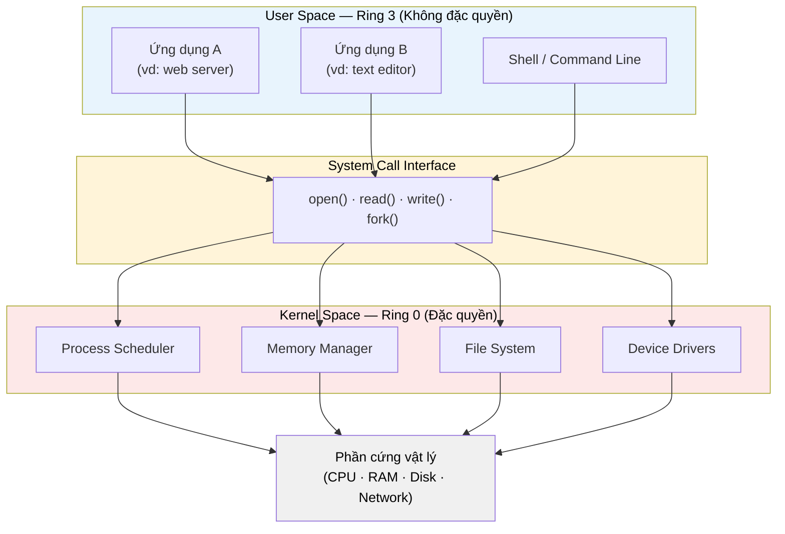

# MASTER COMPUTER SCIENCE HANDBOOK

## Volume 04 — Computer Systems
### Part III — Operating Systems
## Chương 3.1 — Kiến trúc Hệ điều hành
### (Operating System Architecture)

---

### Thông tin chương

| Trường | Giá trị |
|---|---|
| Chương | 3.1 |
| Thuộc Part | III — Operating Systems |
| Thuộc Volume | 04 — Computer Systems |
| Thời gian đọc ước tính | 45–55 phút |
| Độ khó | ★★☆☆☆ |
| Kiến thức tiên quyết | Volume 04, Part I — Computer Organization and Architecture (đặc biệt CPU, Interrupt); Volume 02 — Computer Science Foundations (khái niệm Operating Systems tổng quan) |
| Chương liên quan | 3.2 — Processes (PCB và Process State sẽ được quản lý bởi chính Kernel giới thiệu ở chương này); Volume 04, Part VII — Cloud Computing (Container tái sử dụng khái niệm Kernel/User Space theo cách khác) |
| Từ khóa | Kernel, User Space, System Call, Monolithic Kernel, Microkernel, Hybrid Kernel, Privilege Level, Boot Process, Interrupt |

---

### Mục tiêu học tập

Sau khi hoàn thành chương này, người đọc có thể:

- Giải thích được vì sao một Hệ điều hành (Operating System) là cần thiết, thay vì để ứng dụng truy cập trực tiếp phần cứng.
- Phân biệt rõ ràng Kernel Space và User Space, cùng cơ chế System Call kết nối hai không gian này.
- So sánh ba mô hình kiến trúc Kernel chính: Monolithic Kernel, Microkernel, Hybrid Kernel — cùng đánh đổi (trade-off) của từng mô hình.
- Mô tả được vai trò của Privilege Level (Ring 0 / Ring 3) trong việc bảo vệ hệ thống.
- Trình bày tổng quan quy trình Boot của một máy tính hiện đại, từ khi bật nguồn đến khi Kernel bắt đầu quản lý tài nguyên.

---

### Câu hỏi khơi gợi

> *Khi bạn gõ lệnh `cat file.txt` trên terminal, chương trình `cat` — một chương trình do người dùng viết, không có quyền đặc biệt gì — làm thế nào để đọc được dữ liệu vật lý từ ổ đĩa? Nó không hề biết dữ liệu nằm ở sector nào, cluster nào trên đĩa. Ai đứng ra làm việc đó thay nó, và tại sao `cat` không được phép tự làm?*

---

## 1. Tổng quan chương

Volume 04, Part I và Part II đã trang bị cho bạn một mô hình tinh thần về **phần cứng thuần túy**: CPU thực thi lệnh, bộ nhớ lưu dữ liệu theo từng tầng (cache, RAM, disk). Nhưng phần cứng, tự bản thân nó, không biết khái niệm "chương trình", "người dùng", hay "tập tin". Nó chỉ biết đọc và ghi các ô nhớ theo địa chỉ.

Chương này mở đầu Part III — Operating Systems — bằng câu hỏi nền tảng nhất: **Hệ điều hành là gì, và tại sao nó phải tồn tại như một lớp trung gian bắt buộc** giữa phần cứng và mọi phần mềm khác, kể cả những chương trình quen thuộc nhất mà bạn viết hằng ngày.

Đây là chương "đặt nền" cho toàn bộ Part III. Các khái niệm giới thiệu ở đây — Kernel, System Call, Privilege Level — sẽ được dùng lại xuyên suốt từ Chương 3.2 (Processes) đến Chương 3.9 (Linux Internals), tương tự cách Chương 1.5 (Set Theory) đặt nền cho toàn bộ Volume 01.

> **💡 Insight**
> Nếu Volume 04 Part I trả lời câu hỏi "CPU thực thi một lệnh máy như thế nào", thì chương này trả lời câu hỏi tiếp theo: "Điều gì ngăn hai chương trình chạy cùng lúc không ghi đè lên vùng nhớ của nhau, và điều gì ngăn một chương trình lỗi làm sập toàn bộ máy?" Câu trả lời, trong cả hai trường hợp, là Hệ điều hành.

---

## 2. Bối cảnh lịch sử

| Thời điểm | Sự kiện | Đóng góp |
|---|---|---|
| Thập niên 1950 | Hệ thống Batch Processing đầu tiên | Chưa có khái niệm OS theo nghĩa hiện đại; một chương trình chiếm toàn bộ máy cho đến khi chạy xong |
| 1961 | CTSS (Compatible Time-Sharing System) tại MIT | Đặt nền móng cho Time-Sharing — nhiều người dùng chia sẻ một máy tính cùng lúc, tiền đề trực tiếp cho khái niệm Process (Chương 3.2) |
| 1969 | UNIX (Ken Thompson, Dennis Ritchie tại Bell Labs) | Xác lập triết lý thiết kế OS ảnh hưởng đến gần như mọi hệ điều hành hiện đại: "mọi thứ đều là file", kiến trúc đơn giản, System Call rõ ràng |
| 1983–1991 | Cuộc tranh luận Monolithic vs Microkernel (Andrew Tanenbaum vs Linus Torvalds) | Tranh luận công khai nổi tiếng giữa hai triết lý kiến trúc Kernel (Mục 7), định hình hướng phát triển của Linux |
| 1991 | Linux Kernel (Linus Torvalds) | Kernel mã nguồn mở, theo kiến trúc Monolithic, hiện là nền tảng của phần lớn hạ tầng cloud và server hiện đại |

Cuộc tranh luận năm 1991 giữa Andrew Tanenbaum (tác giả Minix, ủng hộ Microkernel) và Linus Torvalds (tác giả Linux, chọn Monolithic Kernel) không chỉ là một giai thoại lịch sử thú vị — nó phản ánh chính xác sự đánh đổi kiến trúc mà Mục 7 của chương này sẽ phân tích: đơn giản và hiệu năng cao (Monolithic) đối lập với an toàn và dễ bảo trì (Microkernel). Ba mươi năm sau, cả hai triết lý vẫn cùng tồn tại, mỗi bên phù hợp với một lớp bài toán khác nhau.

---

## 3. Động lực

Hãy hình dung một tình huống kỹ thuật quen thuộc: bạn chạy đồng thời một web server (ví dụ Node.js) và một tiến trình ghi log trên cùng một máy. Cả hai chương trình:

- Cùng cần dùng CPU để thực thi lệnh.
- Cùng cần vùng nhớ RAM để lưu dữ liệu.
- Cùng có thể cần ghi vào cùng một file log.

Nếu không có một "trọng tài" đứng giữa, điều gì sẽ ngăn web server ghi đè lên vùng nhớ của tiến trình ghi log? Điều gì quyết định chương trình nào được dùng CPU tại một thời điểm cụ thể, khi CPU vật lý chỉ có thể thực thi một lệnh tại một thời điểm trên một lõi? Điều gì ngăn một bug trong code Node.js của bạn đọc được mật khẩu mà một chương trình khác đang xử lý?

Câu trả lời cho cả ba câu hỏi là cùng một thực thể: **Hệ điều hành**. Nó không phải một chương trình bình thường — nó là chương trình duy nhất được phép trực tiếp điều khiển phần cứng, và mọi chương trình khác (kể cả web server của bạn) đều phải "xin phép" nó thông qua một cơ chế có kiểm soát.

---

## 4. Trực giác

**Mô hình tinh thần (Mental Model) của chương này:**

> Hệ điều hành giống như **ban quản lý của một tòa nhà văn phòng lớn**. Từng công ty thuê văn phòng (mỗi công ty là một chương trình người dùng) không được tự ý đi vào phòng máy chủ điện, phòng kỹ thuật, hay hệ thống thang máy của tòa nhà. Nếu một công ty cần điện, cần thang máy, cần điều hòa — họ gọi lễ tân (System Call), và ban quản lý (Kernel) sẽ thực hiện yêu cầu đó thay họ, sau khi kiểm tra công ty đó có quyền hay không.

| Trực giác kỹ thuật bạn đã có | Khái niệm hệ điều hành tương ứng |
|---|---|
| Ứng dụng di động không được truy cập trực tiếp GPS mà phải xin quyền (permission) | Privilege Level — chương trình User Space không có quyền truy cập phần cứng trực tiếp |
| Gọi một hàm thư viện như `open()` trong Python để đọc file | System Call — cầu nối duy nhất hợp lệ từ User Space vào Kernel Space |
| Một microservice bị crash không làm sập toàn bộ hệ thống (nếu thiết kế tốt) | Cách ly Process (được Kernel đảm bảo — chi tiết ở Chương 3.2) |

---

## 5. Trực quan hóa khái niệm

**Hình 3.1.1 — Kernel Space và User Space**
*(Visual đặc trưng của chương — Chapter Identity)*



| Trường thông tin | Nội dung |
|---|---|
| Mục đích | Cho thấy trực quan rằng **không có con đường nào khác** từ User Space đến phần cứng ngoại trừ đi qua System Call Interface rồi vào Kernel Space |
| Điểm mấu chốt | Mọi mũi tên từ tầng trên xuống đều bắt buộc đi qua tầng System Call — đây chính là cơ chế kiểm soát trung tâm mà Mục 6–7 sẽ hình thức hóa |

---

**Hình 3.1.2 — Quy trình Boot tổng quan**

```text
Bật nguồn
    │
    ▼
Firmware (BIOS / UEFI)
    │   kiểm tra phần cứng cơ bản (POST)
    ▼
Bootloader (vd: GRUB)
    │   nạp Kernel vào bộ nhớ
    ▼
Kernel Initialization
    │   khởi tạo Memory Manager, Device Drivers, File System
    ▼
Init Process (tiến trình đầu tiên, PID 1)
    │   khởi động các dịch vụ hệ thống
    ▼
Hệ thống sẵn sàng cho người dùng
```

*Mục đích:* Cho thấy Kernel không phải là thứ đầu tiên chạy khi bật máy — nó được một chuỗi chương trình nhỏ hơn (Firmware, Bootloader) nạp vào bộ nhớ trước. *Điểm mấu chốt:* "Init Process" ở bước cuối chính là tổ tiên của **mọi Process khác** trên hệ thống — khái niệm này sẽ được hình thức hóa đầy đủ ở Chương 3.2.

---

## 6. Định nghĩa hình thức

> **📌 Remember — Hệ điều hành (Operating System)**
>
> **Hệ điều hành (Operating System — OS)** là một phần mềm hệ thống đóng vai trò trung gian giữa phần cứng máy tính và các chương trình ứng dụng, với hai trách nhiệm chính:
>
> - **Quản lý tài nguyên (Resource Management):** phân bổ CPU, bộ nhớ, thiết bị lưu trữ, và thiết bị vào/ra cho nhiều chương trình chạy đồng thời.
> - **Trừu tượng hóa phần cứng (Hardware Abstraction):** cung cấp một giao diện thống nhất, đơn giản để chương trình tương tác với phần cứng đa dạng mà không cần biết chi tiết triển khai vật lý.

**Kernel** là thành phần lõi của Hệ điều hành — phần duy nhất chạy với đặc quyền cao nhất, có toàn quyền truy cập phần cứng.

**Kernel Space** và **User Space** là hai vùng logic tách biệt:

- **Kernel Space:** nơi Kernel và các Device Driver thực thi, có toàn quyền truy cập phần cứng.
- **User Space:** nơi mọi chương trình ứng dụng thông thường thực thi, bị giới hạn quyền truy cập.

> **📌 Remember — System Call**
>
> **System Call** là cơ chế hình thức, có kiểm soát, cho phép một chương trình chạy trong User Space yêu cầu Kernel thực hiện một thao tác cần đặc quyền (đọc file, cấp phát bộ nhớ, gửi dữ liệu qua mạng...) thay cho nó. Đây là **con đường hợp lệ duy nhất** từ User Space vào Kernel Space.

**Privilege Level (Ring)** là cơ chế phần cứng (được CPU hỗ trợ trực tiếp — xem lại Volume 04, Part I) phân chia các mức đặc quyền thực thi. Trên kiến trúc x86, phổ biến nhất là:

- **Ring 0:** đặc quyền cao nhất, dành cho Kernel.
- **Ring 3:** đặc quyền thấp nhất, dành cho chương trình User Space.

---

## 7. Nền tảng toán học

Chương này chủ yếu mang tính khái niệm và kiến trúc hệ thống, không có nền tảng toán học riêng biệt. Tuy nhiên, việc **so sánh định lượng** giữa các kiến trúc Kernel là một kỹ năng quan trọng cần hình thức hóa rõ ràng.

### 7.1 Chi phí của System Call (Context Switch Overhead)

- **Ý nghĩa:** mỗi lần một chương trình User Space gọi System Call, CPU phải chuyển từ Ring 3 sang Ring 0, thực hiện thao tác, rồi chuyển ngược lại — quá trình này gọi là **Mode Switch**, tốn thời gian thực tế (không phải miễn phí).
- **Ứng dụng thường gặp:** đây chính là lý do vì sao các chương trình hiệu năng cao (ví dụ database engine) cố gắng **giảm thiểu số lượng System Call**, ví dụ bằng cách đọc/ghi file theo khối lớn (buffered I/O) thay vì từng byte một.

> **💡 Insight**
> Khái niệm Context Switch được nêu ở đây sẽ được định nghĩa đầy đủ và phân tích chi phí chi tiết ở Chương 3.2 (Processes), khi bạn đã có đủ vốn từ vựng về Process State. Ở chương này, chỉ cần ghi nhớ: **System Call không miễn phí — nó có chi phí thời gian thực, và đây là lý do kiến trúc Kernel (Mục 8) tạo ra sự đánh đổi hiệu năng.**

---

## 8. Thuật toán / Cơ chế — Ba Kiến trúc Kernel

Đây là phần cốt lõi kỹ thuật của chương: ba cách tổ chức Kernel Space, mỗi cách phản ánh một triết lý đánh đổi khác nhau.

### 8.1 Monolithic Kernel

Toàn bộ dịch vụ hệ thống (Process Scheduler, Memory Manager, File System, Device Driver) chạy chung trong Kernel Space, cùng một không gian địa chỉ.

```text
User Space
    │ System Call
    ▼
┌─────────────────────────────────────┐
│         Kernel Space (Ring 0)         │
│  Scheduler | Memory | FS | Drivers    │  ← tất cả chung 1 khối
└─────────────────────────────────────┘
    │
    ▼
Phần cứng
```

**Đại diện:** Linux, phần lớn UNIX truyền thống.

### 8.2 Microkernel

Chỉ những chức năng tối thiểu (giao tiếp giữa các tiến trình, quản lý bộ nhớ cơ bản, scheduling cơ bản) chạy trong Kernel Space. File System, Device Driver được đẩy ra chạy như những chương trình User Space bình thường, giao tiếp với Kernel qua cơ chế truyền thông điệp (Message Passing).

```text
User Space
    │
    ├── File System Server (User Space)
    ├── Device Driver Server (User Space)
    │
    ▼ Message Passing
┌─────────────────────────┐
│   Microkernel (Ring 0)    │
│  IPC | Scheduling cơ bản  │  ← tối thiểu
└─────────────────────────┘
    │
    ▼
Phần cứng
```

**Đại diện:** Minix, QNX, một phần triết lý của macOS (XNU là Hybrid — xem 8.3).

### 8.3 Hybrid Kernel

Kết hợp: giữ phần lớn dịch vụ trong Kernel Space (như Monolithic) để tối ưu hiệu năng, nhưng tổ chức mã nguồn theo module rõ ràng, cho phép nạp/gỡ Driver linh hoạt (gần giống triết lý Microkernel).

**Đại diện:** Windows NT Kernel, macOS (XNU).

> **⚠️ Common Mistake**
> Một hiểu lầm phổ biến: "Microkernel luôn chậm hơn Monolithic Kernel." Thực tế chính xác hơn là: Microkernel có **overhead cao hơn cho mỗi lần giao tiếp** giữa các thành phần (vì phải qua Message Passing thay vì gọi hàm trực tiếp trong cùng không gian địa chỉ), nhưng đổi lại có **độ cô lập lỗi tốt hơn** — một Driver lỗi trong Microkernel không làm sập toàn bộ Kernel, trong khi ở Monolithic Kernel, nó có thể làm sập cả hệ thống.

---

## 9. Triển khai

Chương này mang tính khái niệm kiến trúc, không có thuật toán số học để lập trình trực tiếp. Tuy nhiên, ta có thể **quan sát System Call trong thực tế** bằng công cụ `strace` trên Linux — một cách trực quan để "nhìn thấy" ranh giới User Space / Kernel Space đã mô tả ở Mục 6.

```python
import subprocess

def trace_syscalls(command: list[str]) -> str:
    """Chạy một lệnh và ghi lại toàn bộ System Call mà nó thực hiện,
    sử dụng công cụ strace có sẵn trên hệ thống Linux.
    Đây là cách trực quan để quan sát ranh giới User Space / Kernel Space
    đã mô tả ở Mục 6, thay vì chỉ đọc lý thuyết."""
    result = subprocess.run(
        ["strace", "-c", *command],
        capture_output=True,
        text=True,
    )
    # strace ghi thống kê System Call ra stderr, không phải stdout
    return result.stderr


if __name__ == "__main__":
    # Ví dụ: quan sát System Call của lệnh đơn giản `echo hello`
    report = trace_syscalls(["echo", "hello"])
    print(report)
```

> **🛠 Engineering Practice**
> Đoạn code trên chỉ chạy được trên Linux (yêu cầu `strace` đã cài đặt). Đây không phải một thuật toán cần tối ưu — nó là một **công cụ quan sát (observability tool)**, cùng họ với các công cụ debugging và performance profiling mà bạn có thể đã dùng trong công việc kỹ sư phần mềm (ví dụ: network tracing, APM tools).

---

## 10. Trực quan hóa quá trình thực thi

Khi chạy `strace -c echo hello` trên một hệ thống Linux thực tế, kết quả thống kê (rút gọn) trông tương tự:

```text
% time     seconds  usecs/call     calls    syscall
------ ----------- ----------- --------- ----------------
 35.00    0.000042          21         2 mmap
 20.00    0.000024          24         1 execve
 15.00    0.000018          18         1 write
 10.00    0.000012          12         1 open
 ...
------ ----------- ----------- --------- ----------------
100.00    0.000120                    12 total
```

**Điểm mấu chốt cần quan sát:** ngay cả một chương trình cực kỳ đơn giản như `echo hello` — chỉ in ra một dòng chữ — cũng đã cần đến hàng chục System Call: nạp chương trình vào bộ nhớ (`execve`), cấp phát vùng nhớ (`mmap`), và cuối cùng mới thực sự ghi ký tự ra màn hình (`write`). Điều này minh họa trực tiếp cho Mục 7.1: **System Call xảy ra thường xuyên hơn nhiều so với trực giác ban đầu**, và mỗi lần đều có chi phí Mode Switch thực tế.

---

## 11. Ứng dụng công nghiệp

> **🛠 Engineering Practice**
> Kiến trúc Kernel không chỉ là kiến thức lý thuyết — nó ảnh hưởng trực tiếp đến quyết định kỹ thuật hằng ngày của kỹ sư phần mềm.

| Bối cảnh công nghiệp | Vai trò của kiến trúc Kernel |
|---|---|
| Container (Docker) | Container **chia sẻ chung một Kernel** của máy host — khác biệt cốt lõi với Virtual Machine (mỗi VM có Kernel riêng). Đây là lý do container khởi động nhanh hơn VM rất nhiều — chi tiết đầy đủ ở Volume 04, Part VII |
| Hệ thống nhúng thời gian thực (Embedded, IoT) | Thường ưu tiên Microkernel hoặc RTOS (Real-Time OS) nhỏ gọn, vì độ tin cậy và khả năng dự đoán thời gian phản hồi quan trọng hơn hiệu năng thô |
| Server backend hiệu năng cao | Ưu tiên giảm số lượng System Call (buffered I/O, batching) vì chi phí Mode Switch tích lũy có thể ảnh hưởng đáng kể đến throughput ở quy mô lớn |
| Hệ điều hành di động (Android — dựa trên Linux Kernel) | Vẫn dùng Monolithic Kernel (Linux) làm lõi, nhưng thêm nhiều lớp trừu tượng hóa quyền truy cập ở tầng User Space để tăng bảo mật cho ứng dụng bên thứ ba |

---

## 12. Góc nhìn nghiên cứu

> **🔬 Research Connection**
> Cuộc tranh luận Monolithic vs Microkernel không chỉ là lịch sử — nó vẫn là một hướng nghiên cứu hệ thống đang tiếp diễn.

Nghiên cứu hệ điều hành hiện đại tiếp tục khám phá các hướng lai giữa hai triết lý:

- **Unikernel:** biên dịch ứng dụng và các thành phần Kernel cần thiết thành một image duy nhất, tối giản hóa bề mặt tấn công — hướng đi cực đoan hơn cả Microkernel về mặt cô lập, nhắm đến môi trường cloud-native.
- **seL4:** một Microkernel được **chứng minh hình thức (formally verified)** — nghĩa là tính đúng đắn của nó được chứng minh bằng logic toán học chặt chẽ (kết nối trực tiếp tới kỹ thuật chứng minh học ở Volume 01, Part I), không chỉ kiểm thử thực nghiệm. Đây là một trong số ít Kernel có mức đảm bảo an toàn cao nhất từng được xây dựng.
- **eBPF:** một hướng đi mới cho phép chạy mã tùy chỉnh an toàn **bên trong** Kernel Space (Linux) mà không cần viết Kernel Module truyền thống — dung hòa giữa hiệu năng của Monolithic và tính linh hoạt của Microkernel.

**Câu hỏi mở** để suy ngẫm: nếu một Kernel có thể được chứng minh hình thức là đúng đắn (như seL4), điều đó có loại bỏ hoàn toàn nguy cơ lỗi hệ thống hay không? *(Gợi ý cho câu trả lời: chứng minh hình thức chỉ đảm bảo tính đúng đắn theo đặc tả — nếu đặc tả ban đầu có sai sót, chứng minh không thể phát hiện ra điều đó. Đây là giới hạn quan trọng cần ghi nhớ, tương tự cách một chứng minh toán học chỉ đúng trong phạm vi các tiên đề đã chọn.)*

---

## 13. Ưu điểm

- **Kernel Space / User Space** cung cấp một ranh giới bảo mật rõ ràng, ngăn chương trình lỗi hoặc độc hại truy cập trực tiếp phần cứng hoặc dữ liệu của chương trình khác.
- **System Call** tạo ra một giao diện thống nhất — chương trình không cần biết chi tiết phần cứng cụ thể (loại ổ đĩa, loại card mạng) để thực hiện thao tác I/O.
- **Ba kiến trúc Kernel khác nhau** cho phép lựa chọn đánh đổi phù hợp với từng bối cảnh: Monolithic cho hiệu năng, Microkernel cho độ tin cậy, Hybrid cho sự cân bằng.

---

## 14. Hạn chế

> **⚠️ Common Mistake**
> Nhiều người mới học lầm tưởng rằng Hệ điều hành chỉ là "phần mềm quản lý file và hiển thị giao diện". Thực chất, giao diện đồ họa (Desktop Environment) **không phải** một phần của Kernel — nó là một chương trình User Space bình thường, chạy trên nền Kernel giống như mọi ứng dụng khác.

- **Chi phí System Call là có thật:** thiết kế phần mềm không cân nhắc điều này có thể dẫn đến hiệu năng kém ở quy mô lớn (Mục 7.1, Mục 10).
- **Không có kiến trúc Kernel nào "tốt nhất tuyệt đối"** — mỗi lựa chọn đều đánh đổi giữa hiệu năng, độ cô lập lỗi, và độ phức tạp bảo trì (Mục 8).
- Chương này chỉ giới thiệu **kiến trúc ở mức khái niệm**. Cơ chế cụ thể để Kernel quản lý nhiều Process cùng lúc — Process State, PCB, Context Switch — sẽ được hình thức hóa đầy đủ ở Chương 3.2, không lặp lại ở đây.

---

## 15. So sánh

**Bảng 3.1.1 — So sánh ba kiến trúc Kernel**

| Tiêu chí | Monolithic Kernel | Microkernel | Hybrid Kernel |
|---|---|---|---|
| Vị trí Driver/File System | Trong Kernel Space | Trong User Space | Chủ yếu trong Kernel Space, module hóa |
| Hiệu năng giao tiếp nội bộ | Cao (gọi hàm trực tiếp) | Thấp hơn (Message Passing) | Cao |
| Độ cô lập lỗi | Thấp (một lỗi Driver có thể sập cả Kernel) | Cao (lỗi Driver không sập Kernel) | Trung bình |
| Độ phức tạp bảo trì | Cao khi Kernel lớn dần | Thấp hơn (module tách biệt) | Trung bình |
| Đại diện tiêu biểu | Linux | Minix, QNX | Windows NT, macOS (XNU) |

**Phân tích:** Không có lựa chọn nào đúng tuyệt đối cho mọi bài toán — đây là ví dụ điển hình của **engineering trade-off**, một chủ đề sẽ lặp lại xuyên suốt toàn bộ Volume 04. Linux chọn Monolithic vì ưu tiên hiệu năng và đơn giản hóa phát triển ban đầu (lịch sử ở Mục 2); các hệ thống yêu cầu độ tin cậy cực cao (hàng không, y tế) thường ưu tiên triết lý Microkernel hoặc các biến thể được chứng minh hình thức như seL4 (Mục 12).

---

## 16. Tóm tắt

- **Hệ điều hành** là lớp trung gian bắt buộc giữa phần cứng và mọi phần mềm khác, đảm nhiệm quản lý tài nguyên và trừu tượng hóa phần cứng.
- **Kernel Space** (đặc quyền cao — Ring 0) và **User Space** (đặc quyền thấp — Ring 3) được tách biệt bằng cơ chế **Privilege Level** hỗ trợ bởi phần cứng CPU.
- **System Call** là con đường hợp lệ duy nhất từ User Space vào Kernel Space, và có **chi phí thời gian thực** (Mode Switch) — một yếu tố quan trọng trong thiết kế phần mềm hiệu năng cao.
- Ba kiến trúc Kernel chính — **Monolithic, Microkernel, Hybrid** — phản ánh ba điểm cân bằng khác nhau giữa hiệu năng và độ cô lập lỗi, không có lựa chọn nào tối ưu tuyệt đối.
- Quy trình **Boot** (Firmware → Bootloader → Kernel → Init Process) cho thấy Kernel không phải chương trình đầu tiên chạy, và **Init Process** là tổ tiên của mọi Process khác trên hệ thống.

Chương 3.2 (Processes) sẽ đi sâu vào chính thực thể mà Kernel quản lý: cách một chương trình User Space trở thành một Process với vòng đời rõ ràng, và cách Kernel theo dõi trạng thái của hàng trăm Process cùng lúc.

---

## 17. Bài tập

### Mức Cơ bản (Basic)

1. Giải thích bằng lời của bạn: vì sao một chương trình User Space không được phép trực tiếp ghi dữ liệu vào ổ đĩa mà không thông qua System Call?
2. Liệt kê ba System Call phổ biến mà bạn nghĩ một trình duyệt web có thể gọi khi tải một trang web (gợi ý: liên quan đến mạng, bộ nhớ, và tập tin cache).

### Mức Trung bình (Intermediate)

3. So sánh chi phí giao tiếp nội bộ giữa Monolithic Kernel và Microkernel. Trong bối cảnh nào bạn sẽ chọn thiết kế một hệ thống nhúng (embedded) theo triết lý Microkernel, dù biết nó chậm hơn?
4. Dựa trên Hình 3.1.2 (Quy trình Boot), giải thích tại sao Bootloader cần tồn tại như một chương trình riêng biệt, thay vì Firmware nạp thẳng Kernel.

### Mức Nâng cao (Advanced)

5. Chạy thử `strace -c` (hoặc công cụ tương đương trên hệ điều hành của bạn) với một chương trình bạn tự viết (ví dụ một script Python đọc một file văn bản). Liệt kê ít nhất 5 System Call xuất hiện và giải thích vai trò của từng System Call đó dựa trên định nghĩa ở Mục 6.
6. Container (Docker) chia sẻ chung Kernel với máy host, trong khi Virtual Machine có Kernel riêng. Dựa trên khái niệm Kernel Space / User Space vừa học, hãy giải thích vì sao điều này khiến Container khởi động nhanh hơn đáng kể so với VM.

### Mức Nghiên cứu (Research)

7. seL4 là một Microkernel được chứng minh hình thức là đúng đắn. Tìm hiểu thêm (qua tài liệu ở Mục 20) và thảo luận: chứng minh hình thức có đảm bảo Kernel đó "an toàn tuyệt đối" trước mọi cuộc tấn công không? Giới hạn của phương pháp chứng minh hình thức trong bối cảnh bảo mật hệ thống là gì?

---

## 18. Dự án nhỏ

**Không áp dụng cho chương này.**

Chương này tập trung xây dựng nền tảng khái niệm kiến trúc, chưa đủ vốn kiến thức về Process (Chương 3.2) và Scheduling (Chương 3.4) để triển khai một dự án kỹ thuật có ý nghĩa. Dự án tích hợp đầu tiên của Part III sẽ xuất hiện sau Chương 3.6 (Deadlocks), khi người đọc đã có đủ công cụ để xây dựng "Process & Resource Monitor" — dự án tích hợp cuối Part III.

---

## 19. Tự đánh giá

- [ ] Tôi có thể giải thích vì sao một chương trình User Space không thể tự ý truy cập phần cứng mà không qua Kernel.
- [ ] Tôi có thể vẽ lại (hoặc mô tả bằng lời) sơ đồ Kernel Space / User Space / System Call Interface từ Hình 3.1.1 mà không cần nhìn lại.
- [ ] Tôi có thể liệt kê ít nhất 2 điểm khác biệt và 1 đánh đổi giữa Monolithic Kernel và Microkernel.
- [ ] Tôi hiểu vì sao System Call có chi phí thực, không phải một "phép thuật miễn phí" xảy ra ngay lập tức.
- [ ] Tôi có thể mô tả quy trình Boot ở mức tổng quan (Firmware → Bootloader → Kernel → Init Process).

Nếu bạn còn mơ hồ về sự khác biệt giữa Ring 0 và Ring 3, đây là dấu hiệu nên ôn lại nhanh phần CPU và Privilege Mode ở Volume 04, Part I trước khi tiếp tục sang Chương 3.2 — khái niệm Privilege Level sẽ được dùng lại trực tiếp khi giải thích vì sao Context Switch giữa các Process cần có sự can thiệp của Kernel.

---

## 20. Đọc thêm

- **Sách:** Abraham Silberschatz, Peter B. Galvin, Greg Gagne, *Operating System Concepts* — Chương 1–2, phần giới thiệu kiến trúc hệ điều hành. *(Xem BOOKS.md — Volume 4.)*
- **Sách:** Andrew S. Tanenbaum, *Modern Operating Systems* — góc nhìn chi tiết về so sánh Monolithic và Microkernel, viết bởi chính một trong hai nhân vật của cuộc tranh luận lịch sử ở Mục 2.
- **Chủ đề mở rộng (không bắt buộc):** tìm đọc thêm về dự án seL4 (Mục 12) — một trong số ít Microkernel được chứng minh hình thức, tài liệu công khai có sẵn từ nhóm nghiên cứu seL4 Foundation.
- **Chương tiếp theo:** Chương 3.2 — Processes.

---

### Liên kết chương (Cross References)

- **Chương trước:** Volume 04, Part I — Computer Organization and Architecture (CPU, Interrupt là nền tảng phần cứng cho Privilege Level và System Call ở chương này).
- **Chương tiếp theo:** 3.2 — Processes (Kernel giới thiệu ở đây chính là thực thể quản lý Process; PCB và Process State sẽ mở rộng trực tiếp từ khái niệm Kernel Space).
- **Chương liên quan xa hơn:** Volume 04, Part VII — Cloud Computing (Container chia sẻ chung Kernel — ứng dụng trực tiếp Mục 11); Volume 01, Part I (chứng minh hình thức, liên hệ với seL4 ở Mục 12).
- **Vị trí trong Knowledge Graph:** Nút đầu tiên của Volume 04, Part III, phụ thuộc vào Volume 04 Part I; là điều kiện tiên quyết trực tiếp cho toàn bộ các chương còn lại của Part III.

---

*Hết Chương 3.1. Chương này tuân thủ đầy đủ cấu trúc 20 mục của `OUTPUT.md` và chuẩn Presentation Layer của `WRITING_STANDARD.md`, khớp với outline Part III đã đề xuất (không có Mini Project theo đúng thiết kế — dự án tích hợp đầu tiên xuất hiện sau Chương 3.6). Đang chờ rà soát trước khi tiếp tục sang Chương 3.2 — Processes.*
